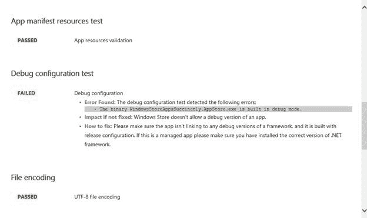

# 七、部署

传统上，Windows 桌面应用程序是通过结合专用安装程序、文件复制机制和命令行批处理文件来部署给最终用户的。对于 Windows Store 应用程序，可用于分发应用程序的选项和机制略有不同，对于传统桌面应用程序开发人员来说可能是新的。

顾名思义，用户获取视窗商店应用程序的最常见方式是通过视窗商店本身。开发人员可以发布免费应用程序，也可以发布以固定费用出售的应用程序，出售的应用程序可以选择包括对预览或试用模式的支持。除了可以通过应用程序的首次购买实现的收入之外，开发人员还可以通过应用程序内的购买以及与几个广告框架之一的集成在应用程序的整个生命周期中赚钱。正如整本书所讨论的那样，任何提交到 Windows Store 的应用程序在向公众提供之前，都必须首先经过标准的审批流程，确保商店中的应用程序没有恶意，符合微软发布的要求，并为最终用户提供所有必要的隐私和系统状态保护。

开发人员不仅限于通过公共窗口商店进行部署，这对于业务线应用程序来说特别有趣和有价值。有多种机制可用于将 Windows Store 应用程序直接部署到终端用户设备，主要集中在几个场景。然而，这些机制不仅仅涉及简单的文件复制，这将在本章后面讨论。

|  | 注意:适用于 Windows 8 的 Visual Studio Express 2012 包含一个方便的“商店”菜单，其中包含与使用 Windows 商店帐户和应用程序部署相关的几个常见操作的命令，而更高级别的 Visual Studio 版本不包含此菜单。此菜单中可用的一些命令也可以在支持创建 Windows Store 应用程序的所有 Visual Studio 版本中的其他地方找到，包括右键单击解决方案资源管理器中的项目时出现的上下文菜单中的 Store 条目。该上下文菜单包括用于将应用程序与商店条目相关联、捕获应用程序截图以及创建应用程序包以供上传的命令。 |


图 31:用于 Windows 8 的 Visual Studio Express 2012 中的商店菜单

## 窗户商店

视窗商店为开发者提供了几个机会。通过视窗商店发布的应用程序可以在一个中心位置看到，并且可以用 100 多种不同的语言到达全球 200 多个市场。商店本身实现了前面讨论过的搜索契约，允许用户通过商店布局和搜索关键词找到他们感兴趣的应用程序。此外，可以通过网络查看在 Windows Store 中发布的应用程序的描述，为描述应用程序而提供的内容会展示给搜索引擎，从而使最终用户更容易发现他们可能感兴趣的应用程序。

如前所述，Windows Store 应用程序有几种销售方式。应用程序本身可以在一组预定义的层中被分配各种各样的价格。这些包括(美元价格):

*   自由的
*   从 1.49 美元到 4.99 美元的区间为 0.50 美元。
*   从 4.99 美元到 49.99 美元的 1 美元区间。
*   从$49.99 到$99.99 的区间为$5.00。
*   从 99.99 美元到 299.99 美元的区间为 10.00 美元。
*   从$299.99 到$999.99 的 50.00 间隔。

对于通过 Windows Store 销售的应用程序，微软目前的模式是，70%的收入被传递给应用程序所有者，直到应用程序实现 2.5 万美元的收入，之后份额百分比跃升至 80%。此外，正如已经提到的并将在本章中更全面地探讨的那样，应用程序可以包括试用模式、通过窗口商店或其他方式进行的内置购买以及广告。

向 Windows 商店提交应用程序的过程并不太复杂，通常包括:

1.  获取 Windows 商店开发人员帐户。
2.  保留应用名称并提供一些应用设置。
3.  构建、测试和上传应用程序。
4.  为最终用户提供有关该应用的发布信息。
5.  将应用提交到商店进行认证。

这些步骤将在以下章节中讨论。

## Windows 商店开发人员帐户

在开始向窗口商店提交应用程序之前，有必要注册并获取一个必须与特定微软帐户相关联的窗口商店开发人员帐户，该帐户是现在用来描述以前的 Hotmail 或 Windows Live 帐户的名称。有两种 Windows Store 开发人员帐户类型:个人帐户和公司帐户。公司账户需要额外的验证，以确保申请人被授权代表公司创建账户，在美国，需要一个员工识别号，也称为由国内税收署颁发的联邦税收识别号。美国的个人账户需要社会安全号码。只有通过公司帐户提交的应用程序才能包括企业身份验证、共享用户证书和文档库访问功能。由于这些额外的功能，通过公司帐户提交的应用程序有时可能会经过比个人帐户提交的应用程序更严格的认证审查。

无论具体账户类型如何，都可以通过 Visual Studio Express 中**商店**菜单中的**打开开发者账户**命令，或者导航至[https://app dev . Microsoft . com/Store portals/Account/registration/Start](https://appdev.microsoft.com/StorePortals/Account/Signup/Start)启动创建 Windows Store 开发者账户的过程。

|  | 注意:公司帐户也可以用于通过 Windows 商店提交桌面应用程序。通过 Windows 商店发布和获取桌面应用程序超出了本书的范围。关于通过 Windows 商店部署桌面应用的更多信息，请访问[http://blogs . msdn . com/b/Windows Store/archive/2012/06/08/listing-your-desktop-app-in-Store . aspx](http://blogs.msdn.com/b/windowsstore/archive/2012/06/08/listing-your-desktop-app-in-the-store.aspx)。 |

截至本文撰写之时，个人开发者账户的标准费用为每年 49 美元，公司账户为每年 99 美元。描述其他国家费用的表格见[http://msdn . Microsoft . com/en-us/library/windows/apps/hh 694064 . aspx](http://msdn.microsoft.com/en-us/library/windows/apps/hh694064.aspx)。

|  | 提示:有些程序会定期提供服务，帮助支付 Windows Store 开发人员帐户订阅的部分或全部费用。此类计划可能包括 MSDN 订阅和微软的梦想火花和商业火花计划的成员资格。建议咨询计划福利资源和协调员，以了解可能提供的优惠。 |

## 注册并提交应用

一旦创建了 Windows Store 开发人员帐户，就可以向 Windows Store 提交应用程序。应用程序是通过 Windows Store 仪表板提交和管理的，该仪表板可在[https://appdev.microsoft.com/StorePortals](https://appdev.microsoft.com/StorePortals)在线获得。仪表板提供现有应用程序注册列表以及用于管理和查看帐户信息的链接。

### 预约应用名称和预上传设置

在仪表板中，应用程序提交流程被分解为几个独立的步骤，这些步骤专注于提供不同的应用程序信息和内容。这个过程的第一步是为应用程序创建和保留一个名称，这必须在开始任何其他步骤之前完成。应用程序的名称在商店中的所有应用程序中必须是唯一的，虽然应用程序可以有特定于语言的名称，但每个名称在商店中的所有语言中都必须是唯一的。此外，在窗口商店注册过程中选择的应用程序名称必须用作应用程序清单文件中的`DisplayName`值。实际的应用程序必须在预订后一年内以预订名称提交，否则预订将会丢失。可以通过在 Visual Studio Express 的**商店**菜单中选择**保留应用名称**命令，或者从仪表板中选择**提交应用**链接来保留应用名称。无论是哪种情况，都会显示一个网页，列出提交应用程序所需的步骤——选择**应用程序名称**步骤上的链接，将浏览器导航到可以提供应用程序名称的页面。

选择应用程序名称后，可以使用 Visual Studio 将应用程序与商店相关联。从 Visual Studio Express 中的**商店**菜单(或从其他 Visual Studio 版本中的**项目**上下文菜单中的**商店**条目)中选择**将应用程序与商店关联**命令，将弹出**将您的应用程序与 Windows 商店关联**向导。此向导将要求与 Windows Store 开发人员帐户关联的 Microsoft 帐户凭据，并列出用该帐户注册的应用程序名称。选择其中一个应用程序并单击**关联**将更新应用程序清单文件中的`Package`条目:

*   软件包名称将被更新，以匹配 Windows 存储中使用的唯一名称。
*   在开发过程中用于签署应用程序的数字证书文件将使用与 Windows Store 开发人员帐户对应的已发布信息进行更新。请注意，当应用程序在 Windows Store 中可用时，这不是将用于签署应用程序的最终证书。
*   这种更新组合将创建**包系列名称**条目，该条目唯一标识应用程序，该应用程序与应用程序添加到窗口商店时可用的应用程序一致。

除了将应用程序与商店相关联的能力之外，一旦选择了应用程序名称，其他预上传应用程序注册步骤就可以完成。这些步骤包括:

*   **销售详情**:这是为某个应用选择价格或指示该应用是否免费提供的地方。如果为该应用程序选择了价格，该应用程序还可以配置为提供试用模式，允许免费下载该应用程序，并可能在以后升级。试用模式可以设置为永不过期或在特定时间后过期。此屏幕还提供了指示应用程序应该在哪个国家可用、最早的应用程序发布日期(如果需要)以及应用程序应该在窗口商店中出现的类别和子类别的功能。最后，可以选择指定一些最低的系统 DirectX 和 RAM 要求，以及应用程序的设计是否符合可访问性准则。更多关于应用程序可访问性的信息可以在[http://www.microsoft.com/enable/](http://www.microsoft.com/enable/)找到。
*   **高级功能**:这是可以获取提供推送通知相关设置的地方。与实时连接应用编程接口提供的身份验证集成相关的设置可以在此设置和获取。此外，这一步还包括为通过窗口商店销售的应用内产品注册产品标识的能力。本章稍后将讨论应用内购买。
*   **年龄评级和评级证书**:这是可以识别一个应用的年龄评级的地方。该页面包括每个评级类别的描述和指南。请注意，除非某个应用程序是专门为儿童设计的，否则在大多数情况下，12 岁以上将是使用的年龄类别。除了选择目标年龄组之外，某些国家对游戏和其他应用程序有强制和可选的要求，包括某些评级委员会颁发的证书，这些证书可以通过此页面上传。
*   **加密技术**:应用程序必须识别它们是否使用了任何类型的加密技术，这是由于与使用特定加密技术的技术出口相关的法规。对于应用程序中的某些加密用途，必须提供出口商品分类编号(ECCN)。

### 上传应用包

一旦应用程序的预上传信息完成，就可以创建和上传应用程序包。从**商店**菜单或上下文菜单中选择**创建应用程序包**将调用创建应用程序包向导，该向导可用于创建要上传到商店的**应用程序包**。完成程序包文件的创建后，此向导的最后一个屏幕将包含一个指向已创建文件的文件夹的链接，以及通过 Windows 应用程序认证工具包运行应用程序的选项。

### Windows 应用程序认证套件

为开发视窗商店应用程序而安装的工具包括视窗应用程序认证套件。视窗确认是一个工具，可以自动测试视窗商店应用程序(以及其他应用程序类型)的几个特征。该工具将多次运行应用程序，同时检查功能和安全问题。工具完成后，将显示一份报告，指出应用程序要通过认证必须解决的任何问题。

有关使用 Windows ACK 的更多信息，请访问[http://msdn . Microsoft . com/en-us/library/Windows/apps/hh 694081 . aspx](http://msdn.microsoft.com/en-us/library/windows/apps/hh694081.aspx)。微软还发布了一份白皮书，讨论可以从 http://www.microsoft.com/en-us/download/details.aspx?[下载的 Windows ACKid=27414](http://www.microsoft.com/en-us/download/details.aspx?id=27414) 。



图 32:在窗口确认报告中发现的认证问题

### 上传后内容

一旦应用程序包成功上传，要提供的最后两条信息包括将在应用程序的 Windows Store 条目中向客户显示的信息，以及可能有助于认证测试人员成功导航应用程序的任何注释(例如，测试帐户用户名和密码、如何导航到访问可能不明显的功能的描述等)。).

可以提供的应用描述信息包括:

*   应用程序的描述文本(必填)。
*   应用程序功能列表(可选)。
*   可以匹配的关键词，以帮助终端用户搜索应用程序(可选)。
*   有关更新内容的信息(可选)。
*   向最终用户显示的版权和商标信息(强制)。
*   与应用程序使用相关的任何附加许可条款的描述(可选)。
*   应用程序截图和相关标题(至少一个是必需的)。请注意，前几章讨论的模拟器提供了拍摄应用截图的内置工具。
*   如果选择在商店中展示应用程序，则使用促销图像(可选)。
*   任何硬件建议的指示(可选)。
*   与应用程序相关的网站的网址(可选)。
*   用户可以用来获得应用支持的电子邮件地址或网址(必填)。
*   应用程序隐私政策文本的网址链接(如果应用程序收集最终用户的个人信息或连接到在线服务，则为必填项)。
*   如果应用程序包括通过 Windows Store 进行的应用程序内购买，请提供每个应用程序内优惠的简要说明(如果提供了任何优惠条目，则为必填项)。

### 认证过程

随着每个信息收集步骤的完成，其在仪表盘中的显示状态将从**未完成**切换到**完成**。完成所有步骤后，该应用程序可以正式提交认证，如果通过认证过程，将被纳入 Windows Store。

认证过程应该相当透明，包括几个步骤:

*   预处理检查:确保发布应用程序所需的适当细节到位，包括确保开发人员帐户处于良好状态，并且支付信息设置正确。
*   安全测试:检查该应用程序的病毒和其他恶意代码。
*   技术符合性测试:Windows 应用程序认证套件用于自动测试应用程序。
*   内容符合性测试:应用程序的内容由人工测试人员检查。
*   发布日期:如果应用程序表明需要特定的发布日期，此步骤将隐藏应用程序，直到目标发布日期到来。
*   签名和发布:应用程序经过数字签名，以确保在批准和发布后不会被篡改，然后发布到 Windows Store。

为了帮助提供流程的透明度，仪表板将显示应用程序通过每个认证步骤的进度，以及每个步骤通常需要多长时间的信息。此外，无论应用程序是否通过认证，都会提供认证报告。该报告可用于在出现故障的情况下确定哪里出错，提供更正，并重新提交应用程序。

视窗商店应用认证要求围绕着一系列关键原则。为了通过认证，视窗商店应用程序:

*   必须为客户提供价值。
*   可能会显示广告，但必须不仅仅是广告或应用内网站。
*   必须表现得可预测。
*   必须让客户掌控一切。
*   必须适合全球观众。
*   必须易于识别和理解。

关于如何满足这些标准的具体指南已经传达，但预计会有所发展。这些要求的最新版本以及修订历史信息可在[http://msdn . Microsoft . com/en-us/library/windows/apps/xaml/hh 694083 . aspx](http://msdn.microsoft.com/en-us/library/windows/apps/xaml/hh694083.aspx)上找到。

## 包括试用模式

从微软销售 Windows Phone 应用程序的经验中收集的信息为在应用程序中使用试用模式提供了有趣的见解。[<sup>【1】</sup>](Endnotes.htm#_ftn1)发表时，其分析显示:

*   提供试用模式的付费应用被下载的可能性是不提供的 70 倍。
*   从试用应用到付费应用的转化率接近 10%。
*   提供试用模式的应用程序平均产生的收入是不包括试用模式的付费应用程序的 10 倍。

如应用程序预上传设置步骤中所述，通过 Windows Store 提供的付费应用程序可以配置为提供试用模式。WinRT APIs 可以在应用程序内使用，以确定它当前是否以试用模式运行，何时试用模式设置为过期，或者试用模式是否已经过期。

|  | 注意:试用模式 API 中没有直接影响应用运行时行为的功能；这些 API 仅仅提供了关于应用程序许可证当前状态的信息。由应用程序开发人员决定如何解释这些信息并相应地调整功能，例如通过禁用功能或减少功能、向最终用户提供消息等。 |

`Windows.ApplicationModel.Store`类中的静态`CurrentApp`类用于获取关于应用程序当前试用模式状态的信息。除了其他功能之外，该类还提供了一些成员，这些成员可以用来检索有关应用程序在 Windows Store 中的列表、已安装应用程序许可证的当前状态的信息，以及请求升级试用模式应用程序。下面的代码显示了如何获取与应用程序的试用模式相关的信息。

```cs
    // Obtain the current application's licensing state.
    var licenseInformation = Windows.ApplicationModel.Store.CurrentApp.LicenseInformation;

    // The application is currently in trial mode (though it may have expired).
    var isTrial = licenseInformation.IsTrial;

    // The application is in full mode, or is in trial mode and not yet expired.
    var isActive = licenseInformation.IsActive;

    // The date the application's trial mode will expire (relative to the system clock).
    // DateTimeOffset.MaxValue for non-trial mode or non-expiring trials.
    // DateTimeOffset.MinValue for expired trials.
    var expirationDate = licenseInformation.ExpirationDate;

    // Event raised when license information changes as the result of an upgrade request.
    // Note that an app crossing its trial expiration time will not raise this event.
    licenseInformation.LicenseChanged += HandleLicenseInformationLicenseChanged;

```

与试用模式应用程序交互的最后一个方面是为试用模式应用程序提供升级到完整功能的能力。这是由`CurrentApp`类上的`RequestAppPurchaseAsync`方法提供的。由于此方法需要与 Windows 商店交互，因此调用它需要应用程序能够访问可用的互联网连接。

```cs
    // Request an app upgrade purchase.
    // The parameter indicates whether the method should return an XML receipt.
    await Windows.ApplicationModel.Store.CurrentApp.RequestAppPurchaseAsync(false);

```

虽然有些情况可能会导致此方法引发异常，但取消或其他购买未完成的情况可能会导致该方法返回时没有错误。因此，重要的是要么倾听`LicenseChanged`事件，要么在对`RequestPurchaseAsync`的呼叫结束时取回并检查`LicenseInformation`。

### 调试试用模式应用

为了开发、测试和调试支持试用模式的应用程序，需要一种机制来模拟`Windows.ApplicationModel.Store.CurrentApp`对 Windows Store 的调用。为了帮助解决这个问题，WinRT 应用编程接口包括`Windows.ApplicationModel.Store.CurrentAppSimulator`类。这个类提供了与`CurrentApp`类相同的方法和属性，外加一个额外的调用。由于这种相似性，`CurrentAppSimulator`类可以在开发过程中代替`CurrentApp`类来验证应用程序试用模式功能的实现。

在最常见的使用案例中，`CurrentAppSimulator`通过从名为**的代理 XML 文件中加载应用信息来工作，该文件名为**windowsstorproxy . XML**，它期望在应用的本地存储文件夹中的**Microsoft \ Windows Store \ apidate**文件夹中找到该文件。描述代理文件中包含的值的模式可以在 MSDN 文档中找到。**

代理文件包含描述应用商店基本信息的信息，包括提供给应用内购买的产品集合(这将在后面详细讨论)。它还包括配置应用程序许可证信息的当前状态的能力，该信息描述了应用程序和任何已购买产品的试用状态，以及可用于指定应由`CurrentAppSimulator`方法调用返回的 HRESULT 错误代码或打开允许交互式设置这些错误代码的对话框的指令的设置。

需要注意的是，应用程序运行时进行的更新发生在内存中，不会保存在 WindowsStoreProxy 文件中，而是只存在于内存中。重新启动应用程序将导致再次从磁盘读取文件，并且之前所做的任何许可更改都将丢失。

最后，在向视窗商店提交应用程序之前，必须删除任何`CurrentAppSimulator`调用。如果一个应用包含模拟器调用，它将无法通过认证。下面的代码利用`#if`预处理器指令创建了一个`CurrentAppAccesor`别名，当应用程序在发布模式下构建时，该别名允许将`CurrentAppSimulator`类替换为`CurrentApp`类:

```cs
    // This #if approach allows swapping out to the "real" app when deploying to the store.
    #if DEBUG
        using CurrentAppAccessor = Windows.ApplicationModel.Store.CurrentAppSimulator;
    #else
        using CurrentAppAccessor = Windows.ApplicationModel.Store.CurrentApp;
    #endif

```

## 应用内购买

应用内购买允许最终用户通过购买独立的功能单元来增强应用，这些功能单元超出了基本应用本身所包含的功能，例如额外的游戏级别或儿童着色应用的季节性内容。免费和付费应用程序都可以包括应用内购买，不过需要注意的是，如果应用程序对终端用户没有任何应用内购买，那么它很可能无法通过认证。应用内购买需要以某种方式增强应用功能。虽然包含在视窗商店中的应用程序的条款并不限制用于安全地提供此类购买的机制，但视窗商店确实包含了一种方便地集成此类功能的机制。

应用内购买的 Windows Store 机制使用术语“产品”来表示为应用内购买提供的独立功能。产品在申请注册流程的**高级功能**部分定义，必须包括:

*   产品标识，这是一个用于识别功能的内部代码。
*   价格，可以是之前讨论的应用定价的任何定价值。
*   指示该功能在用户购买后激活多长时间的寿命(包括**永久**选项)。

还必须提供用户可读的每个产品的描述，但这将在注册过程的后期配置应用程序描述信息时发生。

与试用模式支持一样，在 Windows Store 注册过程中定义的应用内购买信息与设计用于在应用内与之交互的代码配对。

第一个任务是获取可用的应用内购买项目列表，以适合应用的任何方式呈现给用户。定义的包列表可以通过`CurrentApp`(和`CurrentAppSimulator`)对象获得。`LoadListingInformationAsync`方法获取与应用程序在视窗商店注册相关的信息，包括应用程序的名称、描述、年龄等级、当前市场、价格和产品列表。产品列表包括每个注册包的`Name`、`ProductId`和`Price`信息，然后可以显示给用户。

`CurrentApp`类包括一个`RequestProductPurchaseAsync`方法，其功能与前面讨论的`RequestAppPurchaseAsync`方法非常相似，只是它允许指定要购买的特征的标识。如果购买成功，将引发`LicenseChanged`事件，更新`CurrentApp` `LicenseInformation`房产。

```cs
    // Obtain the app's Windows Store listing information.
    var listing = await 
                  Windows.ApplicationModel.Store.CurrentApp.LoadListingInformationAsync();
    var productListings = listing.ProductListings;

    // Purchase a specific feature from the store.
    await Windows.ApplicationModel.Store.CurrentApp.RequestProductPurchaseAsync(featureId,                                                                            false);

    // Check the existing licenses to obtain activity and expiration information.
    var licenses = licenseInformation.ProductLicenses;
    var featureLicense = licenses[featureId];
    var featureIsActive = featureLicense.IsActive;
    var featureExpirationDate = featureLicense.ExpirationDate;

```

当使用`CurrentAppSimulator`类时，XML 包括在应用程序列表标记中定义产品的能力，以及在许可信息标记中定义现有产品购买的能力。

## 添加广告

从视窗商店应用程序中获得收入的另一种方式是通过使用嵌入式广告。与应用内购买一样，包含在 Windows Store 中的应用的条款并没有对必须使用哪种特定的广告显示工具施加限制，但 Windows 8 的微软广告软件开发工具包提供了一种方便的机制，可以与微软的 pubCenter 广告平台集成。无论选择何种工具，都必须始终满足基本的认证要求，尤其是那些与用户隐私相关的要求。

|  | 注意:虽然本部分将提供有关使用微软视窗 8 广告软件开发工具包的基本信息，但更多更深入的信息可以在[http://msdn.microsoft.com/en-us/library/hh506371.aspx](http://msdn.microsoft.com/en-us/library/hh506371(v=msads.10).aspx)找到。 |

### 配置公共中心内容

要在 Windows 8 应用程序中包含广告软件开发工具包广告，需要在 pubCenter 中提供应用程序和相关的“广告单元”信息，可在[https://pubcenter.microsoft.com](https://pubcenter.microsoft.com)访问该信息。要访问 pubCenter，必须设置一个帐户，该帐户将用于管理应用程序注册以及配置支付信息。

从 pubCenter 帐户，准备提供广告的第一步是注册一个应用程序。注册一个应用程序只需要识别它是一个 Windows 8 应用程序，并为该应用程序提供一个名称，这样 pubCenter 就可以生成一个唯一的应用程序标识。对于每个应用，可以创建多个广告单元。广告单元与应用程序唯一相关联。创建广告单元需要为要呈现给用户的项目定义大小和类别。Windows 商店应用程序目前有几种可用的广告大小；选择合适的广告取决于应用程序的布局和广告适合的空间。广告应该放在最终用户可以看到的地方，但最好不要干扰用户成功使用应用程序的能力。

广告单元也需要选择广告类别。类别(以及潜在的子类别)值有助于确定将显示哪些广告，以确保呈现的广告与使用该应用的受众相关。这一点尤其重要，因为广告的收入模式。广告收入是基于印象(提供给个人用户屏幕的广告数量)和点击率(广告被点击的次数)的组合来实现的。与最终用户利益相关的广告更有可能被点击，从而有可能增加收入。

pubCenter 的最后一个配置选项是建立广告排除的能力。广告排除用于授予排除链接到某些网址的广告的能力。这些最明显的用途是防止链接到竞争对手网站的广告在应用程序中显示。

请务必记下创建的应用程序标识和演示单元标识。当广告控件包含在 Windows Store 应用程序中时，将使用它们。

### 使用广告软件开发工具包

在将广告控件包含在 Windows 商店应用程序中之前，必须首先下载并安装适用于 Windows 8 的微软广告软件开发工具包。获取软件开发工具包的说明可以在[http://msdn.microsoft.com/en-us/library/hh506342.aspx](http://msdn.microsoft.com/en-us/library/hh506342(v=msads.10).aspx)找到。此外，在 Windows 8 应用程序中包含广告控件需要在应用程序的清单文件中定义互联网(客户端)功能。

|  | 注意:这一要求有一个幸运的副作用，即该软件开发工具包不能用于在为幼儿评级的应用程序中投放广告，因为评级低于 12+的应用程序不能包括在线服务，否则它们将无法通过认证过程。 |

广告控件可以手动包含在页面上，也可以通过从 Visual Studio 的工具箱中拖动它来包含在页面上。拖动它将添加适当的项目引用和 XAML 命名空间声明。


图 33:Visual Studio XAML 设计器工具箱中的广告控件

要手动包含该控件，项目需要添加一个引用到**微软视窗 8 广告软件开发工具包(Xaml)** 程序集中。放置广告控件的页面或控件需要包含`Microsoft.Advertising.WinRT.UI`的名称空间声明。然后，广告控件可以被放置在适当的位置，并根据所显示的广告单元的尺寸来调整大小。

```cs
    Namespace declaration for the ad control:
    xmlns:UI="using:Microsoft.Advertising.WinRT.UI"
    Ad control element declared in XAML:
    <UI:AdControl x:Name="AdControl" Grid.ColumnSpan="99" Grid.Row="1"
                  ApplicationId="d25517cb-12d4-4699-8bdc-52040c712cab"
                  AdUnitId="10042999"
                  Width="728" Height="90"
                  HorizontalAlignment="Center"
                  Margin

```

无论是手动添加还是通过拖放从工具箱添加，广告控件`ApplicationId`和`AdUnitId`的值都需要根据之前在 pubCenter 中记录的值进行设置。

|  | 提示:在开发和测试期间，模拟器不能显示真实的直播广告。然而，`ApplicationId`和`AdUnitId`的测试值是可用的，允许广告控件模拟它正在显示实际广告。可以使用的可用值在[定义。aspx](http://msdn.microsoft.com/en-us/library/advertising-windows-test-mode-values(v=msads.10).aspx) 。 |

|  | 注意:安装适用于 Windows 8 的微软广告软件开发工具包时，它包含一份 EULA 文档，其中包含可能需要包含在隐私政策和/或 Windows Store 应用程序使用条款中的条款。在分发包含广告控制的应用程序之前，务必查看这些内容，并确保满足必要的条件。关于 EULA 的信息可以在[http://msdn.microsoft.com/en-us/library/jj157026.aspx](http://msdn.microsoft.com/en-us/library/jj157026.aspx)找到。 |

广告控件还有其他几种可用的设置，其中一种设置是能够向广告控件提供纬度和经度值，以确保显示的广告与坐标所指示的地理区域相关。然而，提供这条附加信息将需要声明适当的能力，让用户知道信息正在被共享，以及允许用户选择不提供这种信息的控制。

## 分发 Windows 商店应用程序的其他方式

本章的主要重点是通过 Windows 商店分发应用程序。这当然是最终用户获取这些应用程序的最常见方式，也是利用 Windows Store 机制进行试用模式和应用程序内购买的唯一方式。但是，有几种情况下这种部署并不理想，例如开发机器之外的应用程序或企业内的业务线共享应用程序。对于这些和类似的情况，有一些替代部署方法可用。

第一个部署选项是通过在目标计算机上使用开发人员许可证。这种方法对于需要在各种非开发人员机器上测试应用程序的情况非常有用。该应用程序由 Visual Studio 生成的自签名证书保护，并且只能在拥有有效开发者许可证的机器上运行(在[第 1 章](1.html#DevLicense1)中讨论)。这些开发人员许可证仅在有限的时间内有效。确切的期限取决于它们是否是通过链接到 Windows Store 帐户的微软帐户获得的，尽管它们可以在到期时续订。在已过期的开发人员帐户支持下运行的应用程序将在其“开始”菜单平铺上显示一个 X，表明存在阻止应用程序运行的问题。

使用开发人员许可证部署应用程序的最简单方法是使用 Visual Studio 创建应用程序包时发出的内容。创建这样一个包的过程在本章前面已经描述过，但是如果目的是创建这样一个包而不将其上传到 Windows Store，则可以在创建应用包向导的第一页中关于构建要上传的包的问题中选择**否**，以跳过关联步骤。

名为 **< App 包名> _ <版本> _ <处理器架构>_ 测试**的文件夹将被添加到创建包的目标目录中。该文件夹包含进行本地应用部署所需的内容，包括名为 **Add-AppDevPackage.ps1** 的 PowerShell 脚本。这个文件夹可以复制到运行应用程序的机器上，并且可以运行 PowerShell 脚本来安装 Windows Store 应用程序。PowerShell 脚本还将注册自签名证书，并检查该计算机上是否有开发人员许可证，如果没有，将提示用户获取一个。


图 34:测试部署文件夹的内容

第二个部署选项称为侧装。一般来说，侧装通常指的是绕过正常的管理方法，直接将软件应用于设备的过程。然而，对于 Windows Store 应用程序来说，这个术语与一个非常具体的机制相关联。要使应用程序能够在运行 Windows 8 或 Windows RT 的设备上侧装，必须满足以下条件:

*   机器必须运行 Windows RT、Windows 8 企业版、Windows 8 专业版或 Windows Server 2012。
*   如果操作系统运行的是 Windows 8 企业版或 Windows Sever 2012，则必须将操作系统加入到启用了**允许所有受信任应用程序安装**组策略的活动目录域中。
*   或者，如果未加入活动目录域的所有 Windows 8 Professional、Windows 8 Enterprise 或 Windows Server 2012 系统应用了特殊的侧面加载产品密钥，并且本地启用了**允许所有受信任的应用程序安装**组策略设置，则这些系统都可以参与。
*   Windows RT 设备必须应用特殊的侧装产品密钥才能参与。
*   应用程序必须使用链接到目标计算机上受信任根证书的证书进行数字签名。

|  | 注意:侧装产品密钥是通过微软的批量许可程序获得的。关于获取和应用这些产品密钥的细节的具体讨论超出了本书的范围，但更多信息可以在[http://download . Microsoft . com/download/9/4/3/9439 a928-A0 D1-44c 2-A099-26a 59 AE 0543 b/Windows _ 8 _ Licensing _ Guide . pdf](http://download.microsoft.com/download/9/4/3/9439A928-A0D1-44C2-A099-26A59AE0543B/Windows_8_Licensing_Guide.pdf)上找到。 |

侧装被定位为企业运营用来在内部部署应用程序的一项功能，需要一定的基础架构以及微软许可和企业系统管理方面的知识，以便进行适当的编排。在[http://technet.microsoft.com/en-us/library/hh852635.aspx](http://technet.microsoft.com/en-us/library/hh852635.aspx#SideloadingRequirements)可以获得关于前面描述的需求以及如何管理侧装应用的更具体的指导

## 重述

本章介绍了与向 Windows Store 发布应用程序相关的基本概念，包括获取开发人员帐户的需要以及提交应用程序进行认证的过程。它还提供了从这些应用程序中实现收入的其他选项，包括提供试用模式、提供应用程序内购买以及在 Windows Store 应用程序中启用广告。最后，讨论了如何在不涉及 Windows 商店的情况下部署应用程序的一些附加选项。

本章总结了在使用 XAML 和 C#创建 Windows Store 应用程序时所涉及和可用的许多部分，希望这是一个简洁而有用的讨论。当然，还有更多的内容可以涵盖，希望已经呈现的内容提供了一个坚实的基础，可以从这个平台的其他领域进行探索。