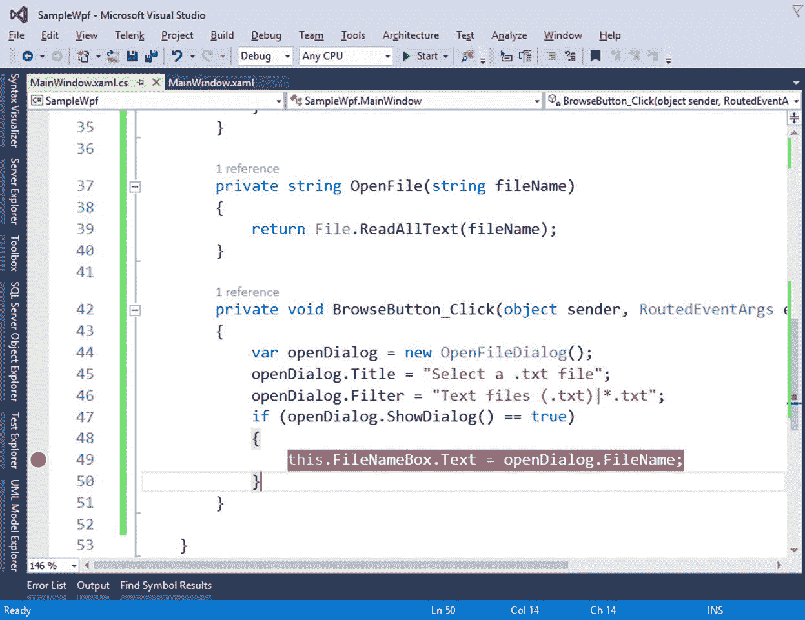
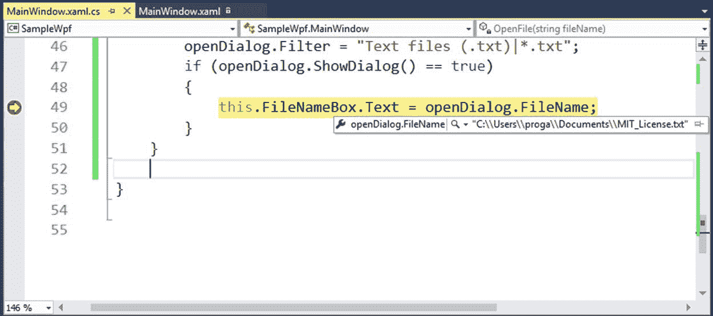
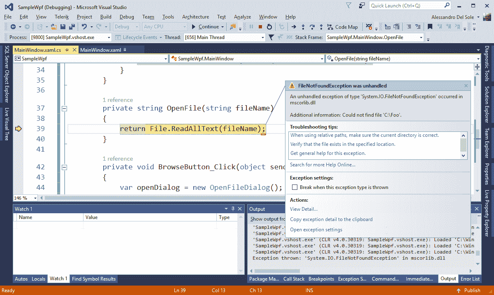
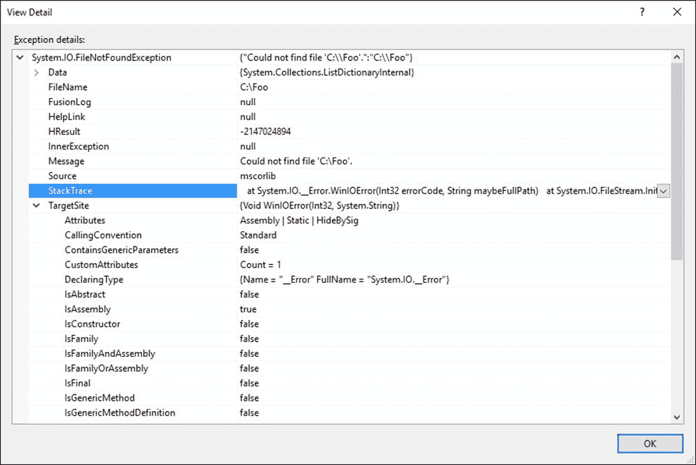
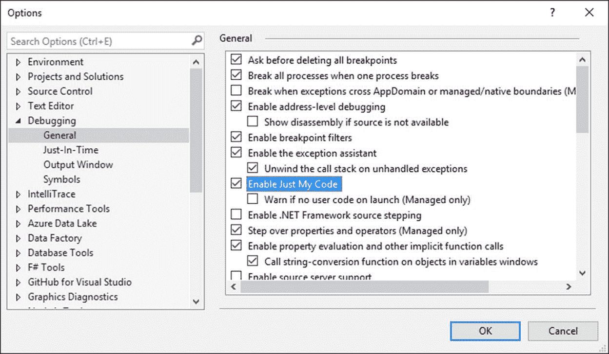
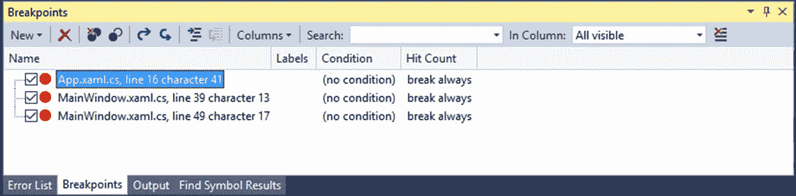
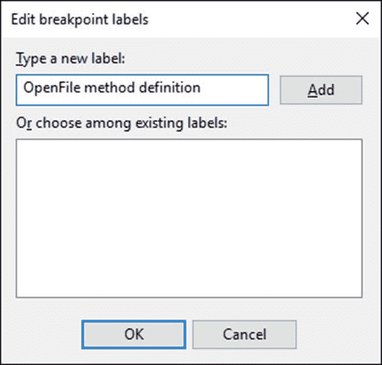
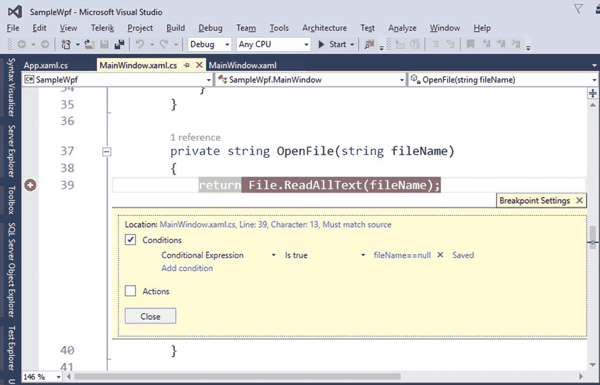
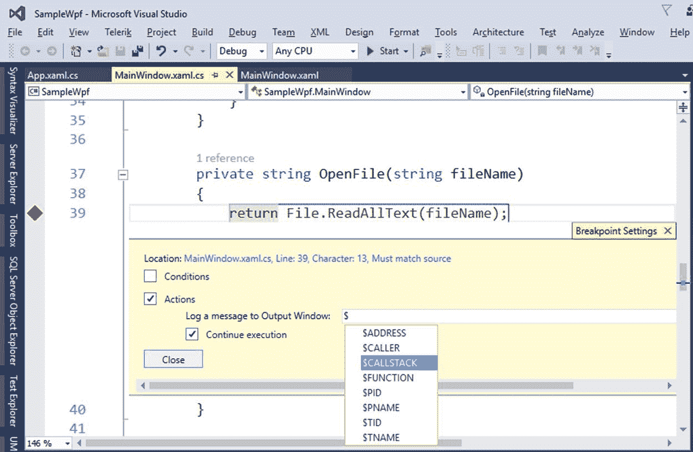
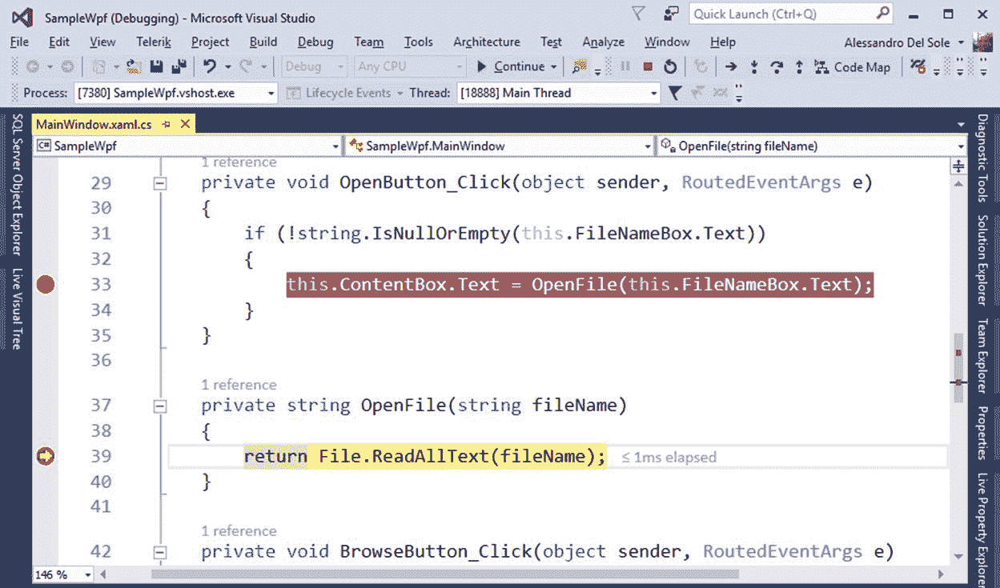

# 二、浏览代码

调试器是 Visual Studio 开发体验中最强大的工具之一。例如，它允许我们执行单行代码或一小段代码，并研究代码和引用变量的行为。调试代码从代码编辑器开始，因此本章将介绍如何使用断点、数据提示和每次执行有限代码行的特殊命令。本章中您将学到的内容适用于您使用 Visual Studio 构建的任何类型的应用程序，但这里我们将使用 WPF 应用程序。

## 引入断点和数据提示

断点会导致应用程序的执行在断点处停止。当应用程序因断点而中断时，Visual Studio 将进入中断模式。在中断模式下，您可以调查局部变量的值，可以分步执行代码，可以使用调试窗口计算表达式，并且可以在准备就绪时恢复执行。在代码中放置一个或多个断点很容易。事实上，您可以在要调试的代码行上按 F9，也可以在代码编辑器窗口中单击最左边的列。您也可以选择调试，切换断点。添加断点时，代码行以红色突出显示。例如，在第 1 章创建的示例应用程序中，在`BrowseButton_Click`事件处理程序内的以下行添加断点:

`this.FileNameBox.Text = openDialog.FileName;`

该行将以红色突出显示，如图 4 所示。

图 4:添加断点

请注意代码编辑器中的滚动条如何报告红色小方块，以帮助您在代码中找到断点。现在，按 F5 开始调试应用程序。运行时，点击**浏览**并选择电脑上的任何文件。当 Visual Studio 遇到断点时，它通过进入中断模式来中断执行，并在该行执行之前用黄色突出显示当前正在调试的行(参见图 5)。如果您将鼠标悬停在`openDialog.FileName`对象上，您将看到一个显示其当前值的小工具提示(见图 5)。如果您对`this.FileNameBox.Text`属性执行同样的操作，工具提示将显示它还没有值，这是正确的，因为那行代码还没有执行。此类工具提示的名称为**数据提示**。现在您有很多选择:您可以使用调试命令之一(稍后描述)单步执行代码，例如单步执行(F11)，或者您可以使用 F5 继续应用程序的执行。

图 5:使用数据提示调查变量的值

### Visual Studio 2017 中的点击运行

在 Visual Studio 2017 之前，您必须引入临时断点，以便从断点继续执行到代码中的某个点。Visual Studio 2017 向前迈进了一步，推出了一个名为**运行到点击**的新功能。当调试器进入中断模式并且您将鼠标悬停在一行代码上时，该行附近会出现一个绿色标志符号。此标志符号代表“点击运行”按钮。如果单击它，您的代码将执行到该行，而不需要临时断点。实际上，“运行到单击”一行被突出显示，而不是执行，就像在该行设置断点一样。你可以在我的 *[Visual Studio 2017 简洁地](https://www.syncfusion.com/resources/techportal/details/ebooks/VS2017_Succinctly)* 电子书中找到更详细的解释。

### 有意无意地中断应用程序的执行

断点允许您在某个时刻有意停止应用程序的执行，以便您可以调查代码的行为。您也可以使用`System.Diagnostics.Debugger`类及其`Break`方法故意中断代码中的应用程序执行，如下所示:

`System.Diagnostics.Debugger.Break();`

遇到这一行代码时，调试器进入中断模式。当然，在某些情况下，应用程序的执行会意外中断——这通常是未处理的运行时错误。

|  | 提示:`Debugger`类提供了与调试器的通信通道。如果调试器的实例附加到进程，则`IsAttached`属性返回真；`Log`方法允许向调试器发送消息；`Launch`方法允许启动调试器并将其附加到应用程序进程。 |

### 删除断点

删除断点和添加断点一样简单。您可以使用 F9 移除断点，或者单击代码编辑器中最左边的列，或者选择调试，在断点的当前行上切换断点。您可以通过按 Ctrl+Alt+F9 或选择调试，删除所有断点来删除所有断点。

## 了解运行时错误

运行时错误是不可预测的。它们发生在应用程序运行时，并且通常是由编译时无法检测到的编程错误引起的。例如，假设您给用户指定文件名的选项，但是在磁盘上找不到该文件。在现实场景中，您肯定会实现`try..catch`块，预测尽可能多的错误，并以正确的方式处理这些错误。但是，在调试时，您可能会遇到未处理的错误。例如，再次运行示例应用程序，但不是使用“浏览”按钮选择文件名，而是输入文本框中不存在的文件名，然后单击**打开**。此时，由于未处理的错误，应用程序执行将中断，Visual Studio 将进入中断模式，用黄色突出显示导致异常的代码行(参见图 6)。

图 6:运行时错误导致应用程序执行中断

在这种情况下，突出显示的代码行正在搜索一个不存在的文件，但是没有提供适当的`try..catch`块，因此调试器在这一点上中断了。如果您陷入这种情况，您可以看到异常详细信息窗口(灰色弹出窗口)，它不仅显示关于错误的信息，例如错误的文件名(在这种情况下是一个`FileNotFoundException`，还允许您通过单击操作区域中的**查看详细信息**超链接来获取详细信息。这将打开“查看详细信息”窗口(参见图 7)，在这里您可以获得关于堆栈跟踪的信息，并允许您调查方法调用堆栈。它还将打开`InnerException`对象，如果当前异常是由另一个异常引起的，这将非常有用。此外，您将获得特定于异常的信息，例如由`FileNotFoundException`类公开的`FileName`属性值。

图 7:获取导致运行时异常的问题的详细信息

不要忘记将可能遇到运行时错误的代码包含在`try..catch`块中，特别是在用户界面的代码隐藏中，以避免这些情况，并允许用户基于上下文做出决定。

## 使用“编辑并继续”在运行时修复代码

在某些情况下，您可以在中断模式下更改导致错误的代码，然后继续执行应用程序。这项功能被称为“编辑并继续”，从 Visual Studio 2015 开始，它得到了增强，以支持 lambda 表达式。您也可以通过单击调试工具栏上的暂停来暂停应用程序的执行(例如，不是因为错误)来更改一些代码。在某些情况下，您将无法使用“编辑并继续”；例如，如果您的更改会影响一般的应用程序行为，您将需要停止、编辑和重新启动代码。另外，当您在中断模式下编辑代码时，Visual Studio 会告诉您“编辑并继续”是否可用。

## 单步执行代码

有时您的代码看起来没有错误，但是在运行时应用程序不会像预期的那样工作。对于必须发现细微错误的情况，调试可能是一项非常复杂的任务。因此，Visual Studio 中强大的调试器允许您单步调试代码，这意味着执行一行代码或有限的一组代码，并调查该行为。您可以使用许多调试命令来逐步执行代码，这些命令在“调试”菜单和键盘快捷键中都可用，这将在本章中详细描述。

|  | 提示:在大多数情况下，您将在中断模式下单步执行代码。但是，两个调试命令“单步执行”和“单步结束”允许您开始调试并直接单步执行代码。如果您想从启动时调查 WPF 应用程序的行为，这将非常有用。 |

继续之前，在示例应用程序中的任何方法或事件处理程序上放置一个断点。这将帮助您理解以下调试命令是如何工作的。

### 步入和跨过

单步执行(F11)和单步执行(F10)都是一次执行一条指令。下面是它们之间的区别:如果要执行的指令是一个方法，Step Over 不会进入方法体，将在返回调用方之前完成它的执行。但是，“单步执行”会进入方法体并一次执行一条指令。当您必须调试调用以前测试和调试过的方法的方法时，单步执行非常有用，您不必每次都检查这些方法。

### 走出去

步出(Shift+F11)只在方法中有效。它执行当前行旁边的所有代码行，直到方法完成。例如，如果在示例应用程序中的`OpenButton_Click`事件处理程序的`if`块上放置一个断点，调试器将在该行中断。但是，当使用单步执行时，它将执行以下所有行，直到事件处理程序完成。

### 运行至光标

使用“运行至光标”，您可以将光标放在任意代码行上，右键单击，然后选择“运行至光标”。这将导致调试器执行所有的行，直到选定的一行，然后它将中断并以黄色突出显示当前行。当您想要在不使用断点的情况下调试代码的特定部分时，这很有用。

### 设置下一条语句和显示下一条语句

在中断模式下，您可以选择设置并显示将在恢复应用程序后、断点或停止后执行的下一条语句。您可以右键单击要执行的下一条语句，从而排除所有其他行单步执行代码，然后选择设置下一条语句。相比之下，使用“显示下一条语句”，您可以将光标快速移动到下一条可执行语句上。这对于断点不立即可见的长代码文件特别有用。

## 仅调试用户代码

WPF 应用程序由您编写的代码加上系统代码组成。您可以决定是只调试代码还是调试系统代码。该功能被称为“仅我的代码”，默认情况下是启用的，这意味着调试器将只关注用户代码。为了更改此选项并包含系统代码，您必须打开调试选项。这可以通过选择**工具**、**选项**，然后在选项窗口中打开**调试**节点来完成(见图 8)。

图 8:更改“仅我的代码”的默认值

请记住，禁用“仅我的代码”将导致 Visual Studio 和调试器加载更多符号并监视更多资源，这意味着这样做可能会降低调试体验。只有在严格要求时才禁用它。

## 启用本机代码调试

如果您的 WPF 应用程序调用非托管代码(如 Win32 API)，您可以启用本机代码调试。您可以通过打开项目的“属性”窗口并选中“调试”选项卡中的“启用本机代码调试”复选框来实现这一点。至于禁用“仅我的代码”，请仅在严格需要时启用本机代码调试。

## 自定义断点

现在您已经知道如何设置断点并在中断模式下单步执行代码，是时候学习如何通过使用一些有趣的功能来最大限度地利用断点了。

### 使用“断点”窗口管理断点

通过按 Ctrl+Alt+B，您可以启用“断点”窗口，在该窗口中，您可以通过方便的用户界面轻松管理解决方案中的所有断点(参见图 9)。只需将鼠标悬停在工具栏中的每个按钮上即可获得描述。

图 9:在断点窗口中管理断点

您可以选中或取消选中断点复选框，以便暂时禁用或启用断点。工具栏上有添加、删除甚至导入和导出断点的按钮。事实上，Visual Studio 可以将断点列表存储到一个 XML 文件中供以后使用。您也可以单击工具栏上的列，并向窗口中添加其他列，以了解每个断点的更多详细信息。这样的窗口还会显示重要信息，包括标签、条件和命中次数。

### 提供断点标签

尽管“断点”窗口提供了一种使用断点的便捷方式，但是如果您的代码中有几十个断点，则很难记住每个断点所处理的内容，并且查看断点所在的文件和行号可能没有太大帮助。Visual Studio 允许添加和编辑断点标签，这是一种标识符，可以帮助您更容易地对断点进行分类、查找和管理。为了给断点提供标签，您有几个选项:

*   在断点窗口中，右键单击一个断点，然后选择**编辑标签**。
*   在代码编辑器中，右键单击标识断点的红色符号，然后选择**编辑标签**。

无论选择哪个选项，您都会看到“编辑断点标签”窗口出现。例如，假设您在 OpenFile 方法定义中有一个断点。在“编辑断点标签”窗口中，您可以键入一个描述，如图 10 所示。

图 10:为断点分配标签

点击**添加**，然后点击**确定**。新标签将立即显示在“断点”窗口中，从而更容易记住断点的内容。

### 设置断点条件

条件允许您指定当遇到断点时应用程序执行必须中断的时间。为了理解条件是如何工作的，在`OpenFile`方法的主体中放置一个断点，从而得到`return`语句。然后右击断点的红色图标，选择**条件**。此时，您可以指定一个或多个条件，当遇到此断点时，这些条件将使执行中断。

|  | 注意:从 Visual Studio 2015 开始，添加条件和操作的用户界面发生了变化。现在，您有了一个方便的弹出窗口，允许您将注意力集中在活动的编辑器窗口上，而不是像以前的版本那样集中在模态对话框上。 |

假设您希望该断点仅在提供的字符串为空时导致应用程序执行中断。这种情况需要计算表达式；也就是说，提供的字符串等于 null。条件表达式选项允许计算必须为真的条件，以便在遇到断点时中断应用程序的执行。在这种情况下，您可以指定如图 11 所示的条件。

图 11:指定断点条件

值得一提的是 IntelliSense 的可用性，它极大地简化了您编写要计算的表达式的方式。现在，让我们谈谈其他条件——命中数和过滤器。命中计数允许您从某个时间点开始调试代码。假设您有一个内部带有断点的`for`循环，但是您不希望应用程序的执行在每次迭代时中断。使用命中计数，您可以指定断点必须命中的迭代，因此应用程序执行必须中断。例如，如果输入命中计数= 2，断点将在第二次迭代中命中。可能的选项有=(等于)，是的倍数，以及> =(大于或等于)。使用筛选器，只有当断点命中指定的进程、线程或计算机名时，才能中断应用程序的执行。

### 通过操作向输出窗口发送消息

操作功能允许您使用内置功能将日志消息发送到输出窗口。

|  | 注意:在 Visual Studio 的早期版本中，此功能被称为跟踪点。它现在被称为操作，并包含在断点设置的新用户界面中。 |

要添加操作，右键单击断点的红色图标并选择**操作**。您将看到与条件描述相同的交互式弹出窗口。在 Actions 区域，您可以提供编写$符号的内置函数的名称，然后从上下文化的 IntelliSense 中获取函数名称(参见图 12)。

图 12:指定一个动作

例如`$CALLSTACK`函数将调用栈信息发送到输出窗口。表 1 显示了支持的功能。

表 1:动作配置中支持的功能

| 断点操作 |
| --- |
| $ADDRESS | 当前指令 |
| $CALLER | 调用方函数的名称 |
| $CALLSTACK | 方法调用堆栈 |
| $FUNCTION | 当前函数的名称 |
| $PID | 进程标识 |
| $ PNA name | 流程名称 |
| $TID | 线程标识 |
| $TNAME | 线程名称 |

在[https://blogs . msdn . Microsoft . com/visualstudioam/2013/10/10/trace points/](https://blogs.msdn.microsoft.com/visualstudioalm/2013/10/10/tracepoints/)上也支持并记录了自定义表达式。

## 介绍性能提示

Visual Studio 2015 为您的调试体验引入了一个有趣的新功能，称为性能提示(也称为**性能提示**)。有了这个特性，您可以测量在中断模式下执行一段代码需要多长时间。为了理解它是如何工作的，在示例应用程序中放置两个断点，一个在调用`OpenFile`方法并将其结果赋给文本框的代码行上，一个在`OpenFile`方法的返回语句上。现在启动应用程序，用**选择一个已有的文件名，浏览**，然后点击**打开**。此时，第一个断点被命中。按 F5 继续执行。当第二个断点被命中时，您将在突出显示的行附近看到一个小工具提示，显示在两个断点之间执行代码所花费的毫秒数，如图 13 所示。

图 13:使用性能提示测量代码执行时间

|  | 注意:性能提示时间值是近似值，因为它们包含调试开销。然而，它们对于建立关于代码行为的良好想法很有用。 |

## 章节总结

Visual Studio 2015 和 2017 提供了强大的调试工具，您可以使用任何类型的。NET 应用程序，并且您看到了针对 WPF 项目的操作。有了断点，您就可以突出显示要研究的代码行，然后通过使用“单步执行”、“单步执行”和“单步退出”等命令一次执行一行或一小段代码来单步执行代码。但是断点提供了更多—您可以指定条件和操作来控制应用程序执行必须中断的时间，以及您想要记录到“输出”窗口的信息。本章中描述的工具通常在代码编辑器中可用，但是 VS 2015 中的调试体验提供了更多。在下一章中，您将使用允许对代码进行更深入调查和评估的窗口。