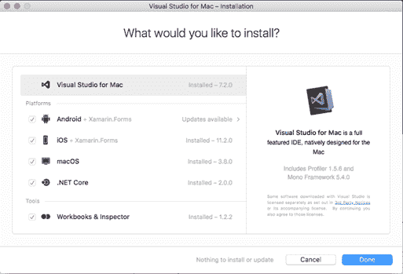
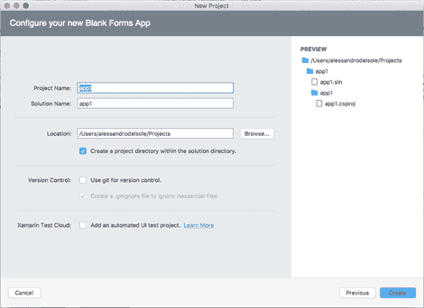
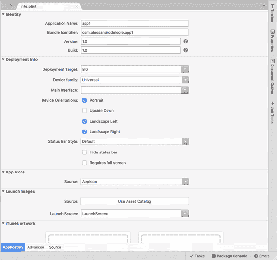
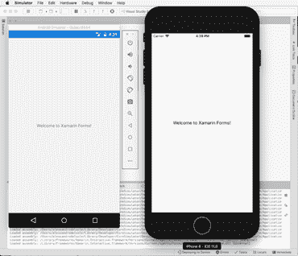
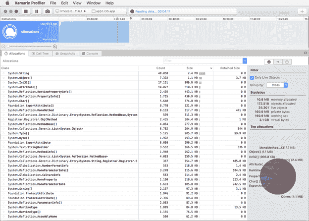

# 一、开始学习 Xamarin.Forms

在你开始用 Xamarin 编写移动应用程序之前。表单，你首先需要了解当今移动应用开发的状态，以及 Xamarin 如何融入其中。此外，您需要设置您的开发环境，以便能够构建、测试、调试应用程序并将其部署到安卓和 iOS 设备上。本章介绍 Xamarin 作为一套工具和服务以及 Xamarin.Forms 作为您将使用的平台，然后呈现您在现实世界中开发所需的工具和硬件。

Xamarin 是微软在 2016 年收购的一家公司的名称，同时也是一组开发工具和服务的名称，开发人员可以使用这些工具和服务在 C#中为 iOS 和 Android(以及在 Windows 上开发时的 Windows 10)构建本机应用程序。Xamarin 的主要目标是让。NET 开发人员为安卓和 iOS 构建本地应用程序，重用他们现有的技能。这个目标的原因很简单:为 Android 构建应用需要你懂 Java 和 Android Studio 或 Eclipse 为 iOS 构建应用需要了解 Objective-C 或 Swift 和 Xcode 而且在 Windows 上工作时，为 Windows 10 构建应用程序需要你懂 C#和 Visual Studio。作为一个现存的。NET 开发人员，无论你是有经验的还是初学者，了解所有可能的平台、语言和开发环境都是极其困难的，而且成本也是极高的。

Xamarin 允许您基于的跨平台开源移植，用 C#构建本机应用程序。NET 框架称为 [Mono](http://www.mono-project.com/) 。从开发的角度来看，Xamarin 提供了多种风格:

*   **Xamarin.iOS** 和 **Xamarin。Mac** :包装原生苹果 API 的库，你可以用 C#和 Visual Studio 为 iOS 和 macOS 构建应用
*   **Xamarin。安卓**:一个包装了原生 Java 和谷歌 API 的库，你可以使用 C#和 Visual Studio 为安卓构建应用
*   **Xamarin.Forms**:一个开源库，允许你跨平台共享代码，并从一个 C#代码库中构建运行在安卓、iOS 和 Windows 上的应用程序

Xamarin 最大的好处。Forms 是您只需编写一次代码，它就可以在所有支持的平台上运行，无需额外的成本。正如你将从这本电子书中学到的，Xamarin.Forms 由一个层组成，该层将所有支持的平台共有的对象包装成 C#对象。访问本机的、特定于平台的对象和 API 有几种方式，所有这些都将在接下来的章节中讨论，但是需要一些额外的工作。另外，Xamarin 与 Visual Studio for Mac IDE 以及 Windows 上的 Visual Studio 2017 集成，因此您不仅可以创建跨平台解决方案，还可以在不同的系统上编写代码。

Xamarin 产品还包括 [Xamarin 大学](https://university.xamarin.com/)，这是一项付费服务，允许您在线参加现场课程和观看教学视频，帮助您准备获得 Xamarin 认证移动开发人员徽章。它还包括用于测试自动化的 [Xamarin 测试云](https://www.xamarin.com/test-cloud)服务。微软最近还启动了 [Visual Studio 应用中心](https://appcenter.ms)，这是一个完整的云解决方案，用于从构建自动化到持续集成、测试、分析等应用管理生命周期(请注意，不支持 Internet Explorer)。这本电子书聚焦于 Xamarin。窗体和目标 Visual Studio for Mac，但如果你更喜欢在 Windows 上工作，可以下载 [Xamarin。简洁地形成第二版](https://www.syncfusion.com/resources/techportal/details/ebooks/Xamarin_Forms_Succinctly)同一作者的电子书。我还为 Syncfusion 录制了一个[视频系列](https://www.youtube.com/playlist?list=PLDzXQPWT8wED1eXjcfjGndwGVzBF8U7uO)，提供了 Xamarin、Xamarin.iOS 和 Xamarin 的概述。安卓，以及 Xamarin.Forms。

为了用 Xamarin 构建原生移动应用。窗体和 Visual Studio for Mac，你需要配置你的 Mac 机进行开发。实际上，同样的步骤适用于 Xamarin.iOS 和 Xamarin.Forms。配置 Mac 可以分为两个步骤:安装苹果工具和为 Mac 安装微软 Visual Studio。

为了配置你的苹果电脑使用 Xamarin 开发应用程序。表单和 Visual Studio 对于 Mac，您必须满足以下要求:

*   您的 Mac 必须运行 macOS“Sierra”(10.12)或更高版本。
*   您必须安装 Xcode 9、苹果的 IDE 和苹果 SDK，它们是您从应用商店免费获得的。下载量约为 5 Gb，因此需要一些时间才能准备好。

你需要 Xcode 的原因很简单:苹果的政策规定，只有 Xcode 可以生成和签署 iOS 应用包；因此，像 Visual Studio for Mac 这样的工具将需要在幕后调用 Xcode 和 Apple SDKs 来生成和签署您的应用程序二进制文件。安装好 Xcode 后，您至少应该创建并运行一个新的空白项目，这样 Xcode 将生成开发所需的所有文件。Xamarin 官方文档有一个[特定页面](https://developer.xamarin.com/guides/ios/getting_started/installation/windows/connecting-to-mac/)，可以帮助你配置一台 Mac 电脑，我建议你仔细阅读，尤其是因为它解释了如何配置配置文件和证书，以及如何使用 Xcode 执行初步配置。实际上，文档是关于 Xamarin.iOS 的，但是同样的步骤也适用于 Xamarin.Forms

Visual Studio for Mac 有三个版本:企业版、专业版和社区版。企业版和专业版可以通过 MSDN 订阅获得，而[社区版](http://www.visualstudio.com/vs/visual-studio-mac)可以免费下载，足以成功完成本电子书中的所有示例。

安装程序的第一个屏幕如图 1 所示。我的苹果电脑上已经安装了所有可用的组件，因此在图 1 中复选框被禁用，但在您的情况下，它们可能都被启用了。

图 1:安装 Xamarin 开发工具

确保至少选择**安卓+ Xamarin。形成**和 **iOS + Xamarin.Forms**组件。。NET Core 在本电子书中不会讨论，所以安装完全由你决定。或者，您可以选择**工作簿&检查器**，这是两个简短总结的有趣的诊断工具。准备好之后，点击**完成**。此时，安装程序将负责下载和安装所有必要的工具，为安卓和 iOS 构建应用程序(见图 2)。

图 2:用于 Mac 安装进度的 VS

等待安装完成，并记住这可能需要一些时间。

假设您已经安装并配置了开发环境，下一步是打开 Visual Studio，查看如何创建 Xamarin.Forms 解决方案，以及这些解决方案由什么组成。Xamarin 的项目模板。表单可在**新项目**对话框的**多平台** > **应用程序**节点获得(见图 3)。

图 Xamarin 的项目模板。形式

**表单应用程序**模板可用于构建 Xamarin。包含大量页面和示例数据的表单解决方案，有助于理解导航和数据绑定等概念。**空白表格应用程序**模板允许您创建一个完全空白的 Xamarin.Forms 解决方案，我将使用这个模板来讨论接下来的所有主题。其他模板与原生和游戏开发相关，不会在本电子书中讨论。

选择**空白表单 App** 模板，然后点击**下一步**。此时，Visual Studio 将要求您指定一些信息(参见图 4)。更具体地说，在**应用名称**框中，您可以输入应用名称，该名称也将用于生成捆绑包标识符，该标识符是**组织标识符**和应用名称的组合。捆绑包标识符是唯一代表您的应用程序包的标识。按照惯例，组织标识符的形式是 *com.yourorganizationname* ，其中 *com。*是常见的前缀。

图 4:为新应用程序提供基本信息

在**目标平台**组中，可以决定针对单个平台，也可以同时针对安卓和 iOS。在**共享代码**组中，您可以在共享项目和可移植类库之间进行选择。代码共享策略是 Xamarin 中一个非常重要的话题。表格，第 2 章将提供详细的解释。现在，选择**使用** **可移植类库**选项，点击**下一步**。在下一个屏幕上，您将被要求输入项目名称和解决方案名称，并且您将可以选择启用 Git 版本控制和 Xamarin 测试云来进行自动化 UI 测试，如图 5 所示。项目名称与此无关，输入一个，点击**创建**。

图 5:输入项目和解决方案名称

一旦创建了项目，在解决方案面板中，您将看到解决方案由三个项目组成，如图 6 所示。

图 6:Xamarin 的结构。表单解决方案

第一个项目是可移植类库或共享项目，这取决于您在项目创建时的选择。这个项目包含所有可以跨平台共享的代码，它的实现将在下一章讨论。目前，您需要知道的是，这个项目是您将编写应用程序的所有用户界面以及所有不需要与本机 API 交互的代码的地方。

第二个项目的后缀是 Droid，是一个 Xamarin。安卓原生项目。它引用了共享代码和 Xamarin.Forms，并实现应用程序在安卓设备上运行所需的基础设施。第三个项目的后缀是 iOS，是一个 Xamarin.iOS 原生项目。这个还引用了共享代码和 Xamarin.Forms，并实现应用程序在 iPhone 和 iPad 上运行所需的基础架构。我现在将提供每个平台项目的更多细节，以便您对它们的属性有一个基本的了解。这非常重要，因为每次创建新的 Xamarin 时，您都需要微调项目属性。形成解决方案。

从技术上讲，Xamarin。Forms 是一个. NET 库，它通过一个名为`Xamarin.Forms`的根命名空间公开了这本电子书中讨论的所有对象。它最近是[开源的](https://github.com/xamarin/Xamarin.Forms)，并作为 [NuGet 包](https://www.nuget.org/packages/Xamarin.Forms/)发布，当您创建新的解决方案时，Visual Studio 会自动将其安装到所有项目中。然后，Visual Studio 中的“获取包管理器”会通知您可用的更新。因为创建 Xamarin。即使您的电脑处于脱机状态，也必须允许表单解决方案，Visual Studio 会在本地缓存中安装 NuGet 包的版本，该版本通常不是最新版本。因此，建议您升级 Xamarin.Forms 和解决方案中的其他 Xamarin 包升级到最新版本，显然，也建议您只升级到稳定版本。尽管 alpha 和 beta 中间版本经常可用，但它们的唯一预期用途是试验仍在开发中的新功能。截至本文撰写之时，2.4.0.74863 版本是最新的稳定版本。

Xamarin。安卓让你的 Xamarin 成为可能。在安卓设备上运行的表单解决方案。 **MainActivity.cs** 文件代表 Xamarin 生成的安卓应用的启动活动。在安卓系统中，一个活动可以被认为是一个有用户界面的单一屏幕，每个应用程序至少有一个。在这个文件中，Visual Studio 添加了您不应该更改的启动代码，尤其是 Xamarin 的初始化代码。您在最后两行代码中看到的表单。在这个项目中，您可以添加需要访问本机 API 和平台特定特性的**资源**文件夹也很重要，因为它包含子文件夹，您可以在其中添加不同屏幕分辨率的图标和图像。此类文件夹的名称以**开头，可绘制**，每个文件夹代表一个特定的屏幕分辨率。Xamarin [文档](https://developer.xamarin.com/guides/android/application_fundamentals/resources_in_android/part_4_-_creating_resources_for_varying_screens/)详细解释了如何在安卓系统上为不同分辨率提供图标和图像。为了构建安卓应用程序包，您需要指定 Visual Studio 应该使用的安卓软件开发工具包的版本。这可以在**项目选项**对话框中完成，您可以通过右键单击解决方案面板中的项目名称，然后选择**选项**来启用该对话框。在**安卓应用**标签中(见图 7)，你可以选择 SDK 版本。

图 7:选择要编译的安卓软件开发工具包版本

Visual Studio 会自动选择计算机上可用的最高版本。这不影响你想针对的安卓最低版本；它与 Visual Studio 将使用的构建工具的版本有关。我的建议是保持默认选择不变。

|  | 提示:您可以使用安卓软件开发工具包管理器管理已安装的软件开发工具包版本，这是一个您可以通过选择工具>软件开发工具包管理器从 Visual Studio 启动的工具。 |

在同一个标签中，你还可以编辑所谓的安卓清单。在这里，您可以指定应用程序的元数据，例如名称、版本号、图标以及用户必须授予应用程序的权限。在图 7 中，您可以在对话框的底部看到权限列表。您在安卓清单中提供的信息对于发布到谷歌游戏也很重要。例如，包名在 Google Play 商店中唯一标识您的应用包，按照惯例，它的形式如下:com *.companyname.appname* ，这是不言而喻的(com。是常规前缀)。版本名称是您的应用程序版本，而版本号是代表更新的一位数字符串。例如，您可能有版本名 1.0 和版本号 1，版本名 1.1 和版本号 2，版本名 1.2 和版本号 3，等等。

**安装位置**选项允许您指定您的应用程序应该只安装在内部存储器中，还是允许存储卡，但是请记住，从安卓 6.0 开始，应用程序不能再安装到可移动存储器上。在**最低安卓版本**下拉菜单中，你可以选择你想要的最低安卓版本。

需要特别注意的是**所需权限**列表。在这里，您必须指定您的应用程序必须被授予的所有权限，以便访问资源，如互联网、相机、其他硬件设备、传感器等。请记住，从 Android 6.0 开始，操作系统在访问需要您在清单中标记的权限之一的资源之前会要求用户确认，如果应用程序试图访问敏感资源，但清单中没有选择相关权限，则会崩溃。

在**项目选项**对话框的**安卓构建**选项卡中，您将能够管理调试和构建选项。我不会在这里介绍所有可用的选项，但值得强调的是**使用快速部署**选项，该选项是默认启用的。启用后，将应用程序部署到物理或模拟设备只会替换已更改的文件。这通常会导致应用程序无法正常工作或根本无法启动，因此我的建议是禁用此选项。

类似于 Xamarin。安卓项目，Xamarin.iOS 项目让你的 Xamarin 成为可能。形成在 iPhone 和 iPad 上运行的解决方案。这里 **AppDelegate.cs** 文件包含 Xamarin.Forms 初始化代码，不应更改。您可以在这个项目中添加所有需要访问本机 API 和平台特定特性的代码，您将在第 8 章中了解到这一点。在 **Info.plist** 文件中(见图 8)，通过每个选项卡，您可以配置您的应用元数据、最低目标版本、支持的设备和方向、功能(如游戏中心和地图集成)、视觉资产(如启动图像和图标)以及其他高级功能。

图 8:信息文件

**Info.plist** 文件代表 iOS 中的应用清单，因此不仅仅与 Xamarin.iOS 相关，其实如果你有 Apple Xcode 和原生 iOS 开发的经验，就已经知道这个文件了。与安卓不同，iOS 操作系统包含自动应用于大多数敏感资源的限制策略，尤其是那些涉及安全和隐私的资源。此外，iOS 8.x、9.x 和 10.x 在操作系统如何处理这些选项方面也有所不同。[信息列表参考](https://developer.xamarin.com/guides/ios/deployment,_testing,_and_metrics/provisioning/infoplist-reference/)将帮助您了解如何正确配置任何异常。在项目属性中，最重要的无疑是 iOS 捆绑包签名，您可以在“项目选项”对话框的同名选项卡中找到它(参见图 9)。您可以使用捆绑签名来指定 Apple 工具必须用来签名应用程序包的身份，并指定用于将开发团队与应用程序标识符相关联的配置文件。在准备发布应用程序时，配置签名身份和配置文件尤为重要。

图 iOS 捆绑包签名选项

有关配置 Xamarin.iOS 项目的更多详细信息，请参见[文档](https://developer.xamarin.com/guides/ios/getting_started/installation/windows/introduction_to_xamarin_ios_for_visual_studio/)。

启动用 Xamarin 构建的应用程序。调试和测试表单再简单不过了:您只需在解决方案资源管理器中选择一个平台项目作为启动项目，然后选择目标设备并按**命令** + **进入**。在第一次调试之前，不要忘记重建您的解决方案。当您启动应用程序进行调试时，Visual Studio 将构建您的解决方案，并将应用程序包部署到选定的物理设备或仿真器。构建过程的结果是。安卓的 apk 文件。iOS 的 ipa 文件。当应用程序在物理设备或仿真器上启动时，Visual Studio 会附加一个调试器实例，您将能够使用集成开发环境的所有强大调试工具，包括(但不限于)断点、数据提示、工具窗口、观察窗口等。选择目标平台和配置的最简单方法是使用标准工具栏，如图 10 所示。

图 10:选择调试的目标平台和设备

调试配置是开发过程中的合适选择，而临时配置则适合在 iOS 和 Android 上准备发布。使用 iOS 时，目标体系结构通常是用于在 iOS 模拟器中调试应用程序的 iPhone 模拟器，或者用于在物理 iPhone 或 iPad 上调试应用程序的 iPhone(请记住，物理苹果设备必须通过 Xcode 与您的 Mac 相关联并连接到 Mac)。您还可以快速选择启动项目并指定目标设备。例如，在图 10 中，您可以看到安卓仿真器配置的列表。

|  | 注:在这本电子书中，我将提供数字，显示所有支持的平台在行动时，它是相关的。在其他情况下，我将只展示一个正在运行的平台，这意味着在所有平台上都期望有相同的行为。 |

图 11 显示了之前创建的空白应用程序在两个平台上各自的模拟器中运行。请注意，在后台，Visual Studio 如何显示**输出**窗口，您可以在其中接收来自调试器的消息。您将能够类似地使用所有其他调试工具。

图 11:用 Xamarin 构建的应用程序。在所有平台上运行的表单

Visual Studio 可以轻松地将应用程序包部署到物理 iOS 和安卓设备上。对于 Android，首先需要启用开发者模式，通过以下步骤完成:

1.  打开**设置** app。
2.  点击**关于**项。
3.  在出现的列表中，找到操作系统内部版本号，并轻按该项目七次。

此时，您只需将设备插入电脑的 USB 端口，Visual Studio 就会立即识别它。它将在可用设备列表中可见，如图 10 所示。对于 iOS，您首先需要将您的 iPhone 或 iPad 连接到您的 Mac 电脑，确保您可以通过 Xcode 发现它们。然后，当您从 Visual Studio 开始调试时，您的应用程序将被部署到 iPhone 或 iPad 上。

Xamarin 工具箱最近增加了三个惊人的工具: [Xamarin 工作簿](https://developer.xamarin.com/guides/cross-platform/workbooks/)、 [Xamarin 检查器](https://developer.xamarin.com/guides/cross-platform/inspector/)和 [Xamarin 探查器](https://www.xamarin.com/profiler)。第一个工具允许您探索许多。NET 和 Mono 开发平台，带有交互示例。Xamarin 检查器允许您很好地检查 Xamarin 应用程序的视觉树，并实时更改用户界面(参见[文档](https://developer.xamarin.com/guides/cross-platform/inspector/))。

Xamarin Profiler 是一个程序中的一整套分析工具，您可以使用它来分析您的移动应用程序，并分析性能、内存使用、CPU 消耗等。在 Visual Studio 中，您可以选择**运行** > **开始分析**，然后系统会要求您指定要对应用程序执行哪种分析。图 12 显示了一个基于内存分配分析工具的例子。

图 12:使用 Xamarin Profiler 分析应用程序性能

您还可以拍摄并比较不同时刻的内存快照，看看内存分配是否会导致潜在的问题。这是一个优秀的性能分析工具，[文档](https://developer.xamarin.com/guides/cross-platform/profiler/)将提供您提高应用性能所需的所有细节。

本章介绍了 Xamarin.Forms 平台及其目标，描述所需的开发工具并提供 Xamarin 的概述。表单解决方案，传递平台项目及其最重要的设置。您还看到了如何使用模拟器启动应用程序进行调试。现在您已经对 Xamarin 有了一个概述。表单和开发工具，下一步是理解它的核心:跨平台共享代码。