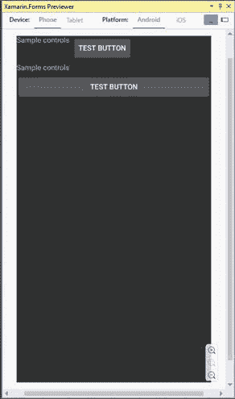
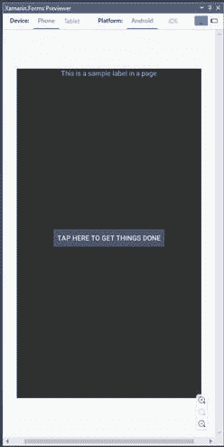
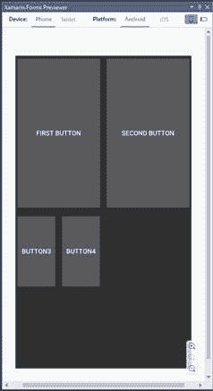
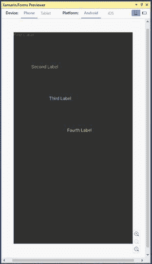
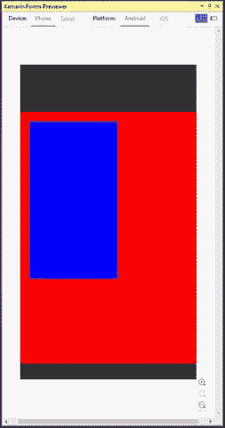
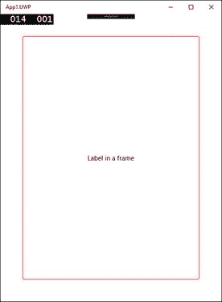
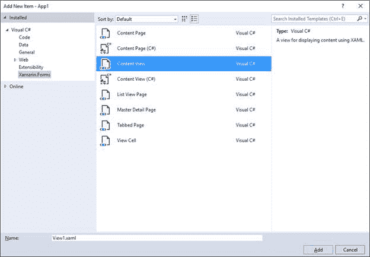

# 四、使用布局组织 UI

手机、平板电脑和笔记本电脑等移动设备具有不同的屏幕尺寸和外形。它们还支持横向和纵向。因此，移动应用程序中的用户界面必须动态适应系统、屏幕和设备，以便可视元素可以根据外形和设备方向自动调整大小或重新排列。在 Xamarin.Forms，这是通过布局来完成的，这是本章的主题。

|  | 提示:如果你以前有过 WPF 或 UWP 的经验，布局的概念和面板的概念是一样的，比如网格和堆栈面板。 |

Xamarin 的目标之一。表单提供了创建动态界面的能力，这些界面可以根据用户的偏好或设备和屏幕大小进行重新排列。正因为如此，用 Xamarin 构建的移动应用程序中的控件在用户界面上不应该有固定的大小或位置，除非在非常有限的情况下。为了使这成为可能，Xamarin.Forms 控件排列在特殊的容器中，称为*布局*。布局是允许在用户界面和 Xamarin 中排列视觉元素的类。表单提供了许多这样的功能。

在本章中，您将了解可用的布局以及如何使用它们来排列控件。需要记住的最重要的一点是 Xamarin 中的控件。表单有层次逻辑；因此，您可以嵌套多个面板来创建复杂的用户体验。表 2 总结了可用的布局。在接下来的章节中，您将更详细地了解它们。

表 Xamarin 中的布局。形式

| 布局 | 描述 |
| --- | --- |
| `StackLayout` | 允许您水平或垂直放置视觉元素。 |
| `FlexLayout` | 允许您水平或垂直放置视觉元素。如果没有足够的可用空间，将可视元素换行到下一行或下一列。 |
| `Grid` | 允许您在行和列中组织可视元素。 |
| `AbsoluteLayout` | 放置在指定的固定位置的布局。 |
| `RelativeLayout` | 其位置取决于相对约束的布局。 |
| `ScrollView` | 允许您滚动其中包含的视觉元素。 |
| `Frame` | 绘制边框并在它包含的视觉元素周围添加空间。 |
| `ContentView` | 一种特殊的布局，可以包含可视元素的层次结构，并可用于在 XAML 创建自定义控件。 |

请记住，只有一个根布局被分配给页面的`Content`属性，然后该布局可以包含嵌套的视觉元素和布局。

一般来说，布局和控件都可以通过将`HorizontalOptions`和`VerticalOptions`属性分配给`LayoutOptions`结构中的一个属性值来对齐，如表 3 所示。提供对齐选项非常常见。例如，如果您在一个页面中只有根布局，您将希望使用`StartAndExpand`分配`VerticalOptions`，以便该布局获得页面中的所有可用空间(当您在本章和下一章中尝试布局和视图时，请记住这一点)。

表 Xamarin 中的对齐选项。形式

| 对齐 | 描述 |
| --- | --- |
| `Center` | 将视觉元素居中对齐。 |
| `CenterAndExpand` | 将视觉元素居中对齐，并扩展其边界以填充可用空间。 |
| `Start` | 将视觉元素左对齐。 |
| `StartAndExpand` | 将可视元素左对齐，并扩展其边界以填充可用空间。 |
| `End` | 将视觉元素右对齐。 |
| `EndAndExpand` | 将可视元素右对齐，并扩展其边界以填充可用空间。 |
| `Fill` | 使视觉元素周围没有填充，并且不扩展。 |
| `FillAndExpand` | 使视觉元素自身周围没有填充，并扩展以填充可用空间。 |

您还可以通过三个属性控制视觉元素之间的空间:`Padding`、`Spacing`和`Margin`，如表 4 所示。

表 Xamarin 中的间距选项。形式

| 间隔 | 描述 |
| --- | --- |
| `Margin` | 表示当前视觉元素与其相邻元素之间的距离，四边都是固定值，左边、上边、右边和下边是逗号分隔值。它是类型`Thickness`，XAML 已经为它内置了一个类型转换器。 |
| `Padding` | 表示视觉元素与其子元素之间的距离。可以为所有四边设置一个固定值，也可以为左边、上边、右边和下边设置逗号分隔值。它是类型`Thickness`，XAML 已经为它内置了一个类型转换器。 |
| `Spacing` | 仅在`StackLayout`容器中可用，它允许您设置每个子元素之间的空间量，默认值为 6.0。 |

我建议您花一些时间尝试对齐和间距选项是如何工作的，以便了解如何在用户界面中获得合适的结果。

`StackLayout`容器允许将控件放置在彼此附近，如在可水平和垂直排列的堆栈中。与其他容器一样，`StackLayout`可以包含嵌套面板。下面的代码显示了如何水平和垂直排列控件。代码清单 5 显示了一个带有根`StackLayout`和两个嵌套布局的示例。

代码清单 5

```cs
<?xml version="1.0" encoding="utf-8" ?>
<ContentPage 
             xmlns:x="http://schemas.microsoft.com/winfx/2009/xaml"
             xmlns:local="clr-namespace:App1"
             x:Class="App1.MainPage">

    <StackLayout Orientation="Vertical">
        <StackLayout Orientation="Horizontal" Margin="5">
            <Label Text="Sample controls" Margin="5"/>
            <Button Text="Test button" Margin="5"/>
        </StackLayout>
        <StackLayout Orientation="Vertical" Margin="5">
            <Label Text="Sample controls" Margin="5"/>
            <Button Text="Test button" Margin="5"/>
        </StackLayout>
    </StackLayout>
</ContentPage>

```

代码清单 5 中 XAML 的结果如图 25 所示。



图 25:用堆栈布局排列视觉元素

`Orientation`属性可以设置为`Horizontal`或`Vertical`，这将影响最终布局。如果未指定，则默认为`Vertical`。XAML 代码的一个主要好处是元素名称和属性是不言自明的，这在`StackLayout`的属性中也是如此。请记住`StackLayout`内的控件会根据方向自动调整大小。如果不喜欢这种行为，需要在每个控件上指定`WidthRequest`和`HeightRequest`属性，分别表示宽度和高度。`Spacing`是一个属性，可以用来调整子元素之间的空间量；这优于使用`Margin`属性调整单个控件上的空间。

`FlexLayout`是用 Xamarin 引入的。表单 3.0。它的工作方式类似于`StackLayout`，因为它垂直或水平排列子视觉元素，但不同的是，如果单行或单列中没有足够的空间，它也能够包装子视觉元素。代码清单 6 提供了一个例子，并展示了使用这种布局是多么容易。

代码清单 6

```cs
<?xml version="1.0" encoding="utf-8" ?>
<ContentPage 
             xmlns:x="http://schemas.microsoft.com/winfx/2009/xaml"
             xmlns:local="clr-namespace:App1"
             x:Class="App1.MainPage">

  <FlexLayout Wrap="Wrap" JustifyContent="SpaceAround"

   Direction="Row">

  <Label Text="This is a sample label in a page"

   FlexLayout.AlignSelf="Center"/>

  <Button Text="Tap here to get things done" 

   FlexLayout.AlignSelf="Center" x:Name="Button1"/>

  </FlexLayout>
  </ContentPage>

```

`FlexLayout`公开了几个属性，其中大部分是其他布局所共有的，但以下是`FlexLayout`独有的，当然也是用来调整其行为的最重要的属性:

*   `Wrap`:来自`FlexWrap`枚举的值，指定如果第一行没有足够的空间，`FlexLayout`内容是否应该包装到下一行。可能的值有`Wrap`(换行到下一行)、`NoWrap`(将视图内容保留在一行)和`Reverse`(以相反的方向换行到下一行)。
*   `Direction`:来自`FlexDirection`枚举的一个值，用于确定`FlexLayout`的子代是否应该排列在单行或单列中。默认值为`Row`。其他可能的值有`Column`、`RowReverse`和`ColumnReverse`(其中`Reverse`表示子视图将以相反的顺序排列)。
*   `JustifyContent`:来自`FlexJustify`枚举的值，指定当子视图周围有额外空间时，子视图应该如何排列。有`Start`、`Center`、`End`等不言而喻的值，也有`SpaceAround`等其他选项，元素在开头和结尾用一个单位的空间隔开，中间用两个单位的空间隔开，这样元素和空间就占满了线；和`SpaceBetween`，其中子元素在单元之间以相等的间距隔开，并且线的两端都没有空间，因此元素和空间再次填充线。`SpaceEvenly`值导致子元素被隔开，因此每个元素之间设置的间距与从父元素的边缘到开始和结束元素的间距相同。

您可以在`FlexLayout`中指定子视图的对齐方式，方法是为`FlexLayout.AlignSelf`附加的属性指定不言而喻的值，如`Start`、`Center`、`End`和`Stretch`。为了快速理解，您可以看一下图 26，它展示了子视图是如何包装的。



图 26:用 FlexLayout 排列视觉元素

如果将`Wrap`属性值更改为`NoWrap`，子视图将在同一行上对齐，相互重叠。因此`FlexLayout`对于创建视觉元素的动态层次结构特别有用，尤其是当您事先不知道子元素的大小时。

`Grid`是最容易理解的布局之一，可能也是最通用的。它允许您创建带有行和列的表。通过这种方式，您可以定义单元格，并且每个单元格都可以包含一个控件或存储嵌套控件的另一个布局。`Grid`是通用的，因为你可以把它分成行或列，或者两者都有。

下面的代码定义了一个`Grid`，分为两行两列:

`<Grid>`

`<Grid.RowDefinitions>`

`<RowDefinition />`

`<RowDefinition />`

`</Grid.RowDefinitions>`

`<Grid.ColumnDefinitions>`

`<ColumnDefinition />`

`<ColumnDefinition />`

`</Grid.ColumnDefinitions>`

`</Grid>`

`RowDefinitions`是`RowDefinition`物体的集合，`ColumnDefinitions`和`ColumnDefinition`也是如此。每个项目分别代表`Grid`内的一行或一列。您也可以指定一个`Width`或一个`Height`属性来限定行和列的尺寸；如果没有指定任何内容，则行和列的尺寸都是可用的最大尺寸。调整父容器大小时，行和列会自动重新排列。

上面的代码创建了一个包含四个单元格的表。要在`Grid`中放置控件，可以通过控件上的`Grid.Row`和`Grid.Column`属性(称为[附加属性](https://developer.xamarin.com/guides/xamarin-forms/xaml/attached-properties/))指定行和列的位置。附加属性允许从当前可视元素分配父容器的属性。两者的索引都是从零开始的，也就是说`0`代表左侧第一列，顶部第一行。您可以在单元格或单行或单列中放置嵌套布局。代码清单 7 中的代码展示了如何将网格嵌套到带有子控件的根网格中。

|  | 提示:网格。Row="0 "和 Grid。可以省略 column =“0”。 |

代码清单 7

```cs
  <?xml
  version="1.0" encoding="utf-8" ?>
  <ContentPage 
               xmlns:x="http://schemas.microsoft.com/winfx/2009/xaml"
               x:Class="Layouts.GridSample">
      <ContentPage.Content>
          <Grid>
              <Grid.RowDefinitions>
                  <RowDefinition />
                  <RowDefinition />
              </Grid.RowDefinitions>
              <Grid.ColumnDefinitions>
                  <ColumnDefinition />
                  <ColumnDefinition />
              </Grid.ColumnDefinitions>
              <Button Text="First
  Button" />
              <Button Grid.Column="1" Text="Second Button"/>

              <Grid Grid.Row="1">
                  <Grid.RowDefinitions>
                      <RowDefinition />
                      <RowDefinition />
                  </Grid.RowDefinitions>
                  <Grid.ColumnDefinitions>
                      <ColumnDefinition />
                      <ColumnDefinition />
                  </Grid.ColumnDefinitions>
                  <Button Text="Button
  3" />
                  <Button Text="Button
  4" Grid.Column="1" />
              </Grid>
          </Grid>
      </ContentPage.Content>
  </ContentPage>

```

图 27 显示了这段代码的结果。



图 27:用网格排列视觉元素

`Grid`布局非常通用，在性能方面也是一个不错的选择(如果可能的话)。

您可以精细控制行和列的大小、空间和比例。`RowDefinition`和`ColumnDefinition`对象的`Height`和`Width`属性可以用来自`GridUnitType`枚举的值进行设置，如下所示:

*   `Auto`:自动调整大小以适应行或列中的内容。
*   `Star`:根据剩余空间的比例调整列和行的大小。
*   `Absolute`:用特定的固定高度和宽度值来调整列和行的大小。

XAML 有`GridUnitType`值的类型转换器，所以您只需不传递`Auto`的值，传递一个`*`给`Star`，传递一个固定数值给`Absolute`，例如:

`<Grid.ColumnDefinitions>`

`<ColumnDefinition />`

`<ColumnDefinition Width="*"/>`

`<ColumnDefinition Width="20"/>`

`</Grid.ColumnDefinitions>`

在某些情况下，元素可能会占据多行或多列。在这些情况下，您可以为`Grid.RowSpan`和`Grid.ColumnSpan`附加属性分配视觉元素应该占据的行数和列数。

`AbsoluteLayout`容器允许您指定子元素在屏幕上的确切显示位置，以及它们的大小和边界。根据此过程中使用的`AbsoluteLayoutFlags`枚举，有几种不同的方法来设置子元素的边界。

`AbsoluteLayoutFlags`枚举包含以下值:

*   `All`:所有维度都是成比例的。
*   `HeightProportional`:高度与布局成正比。
*   `None`:不做解读。
*   `PositionProportional`:结合`XProportional`和`YProportional`。
*   `SizeProportional`:结合`WidthProportional`和`HeightProportional`。
*   `WidthProportional`:宽度与布局成正比。
*   `XProportional` : `X`属性与布局成正比。
*   `YProportional` : `Y`属性与布局成正比。

一旦您创建了您的子元素，要将它们设置在容器内的绝对位置，您需要分配`AbsoluteLayout.LayoutFlags`附加属性。您还需要分配`AbsoluteLayout.LayoutBounds`附加属性，以给出元素的边界。从 Xamarin 开始。Forms 是 Xamarin 和设备特定实现之间的抽象层，位置值可以独立于设备像素。这就是前面提到的`LayoutFlags`发挥作用的地方。代码清单 8 为子控件提供了一个基于比例维度和绝对位置的例子。

代码清单 8

```cs
  <?xml version="1.0" encoding="utf-8" ?>
  <ContentPage 
               xmlns:x="http://schemas.microsoft.com/winfx/2009/xaml"
               xmlns:local="clr-namespace:App1"
               x:Class="App1.MainPage">

      <AbsoluteLayout>
          <Label Text="First Label" 

  AbsoluteLayout.LayoutBounds="0, 0, 0.25, 0.25"
                 AbsoluteLayout.LayoutFlags="All" TextColor="Red"/>
          <Label Text="Second Label" 

  AbsoluteLayout.LayoutBounds="0.20, 0.20, 0.25, 0.25"
                 AbsoluteLayout.LayoutFlags="All" TextColor="Orange"/>
          <Label Text="Third Label" 

  AbsoluteLayout.LayoutBounds="0.40, 0.40, 0.25, 0.25"
                 AbsoluteLayout.LayoutFlags="All" TextColor="Violet"/>
          <Label Text="Fourth Label" 

  AbsoluteLayout.LayoutBounds="0.60, 0.60, 0.25, 0.25"
                 AbsoluteLayout.LayoutFlags="All" TextColor="Yellow"/>
      </AbsoluteLayout>
  </ContentPage>

```

图 28 显示了`AbsoluteLayout`示例的结果。



图 28:绝对定位和绝对布局

`RelativeLayout`容器提供了一种方法来指定子元素相对于彼此或相对于父控件的位置。相对位置通过一系列`Constraint`对象来解析，这些对象定义了每个特定子元素相对于另一个子元素的相对位置。在 XAML，`Constraint`对象通过`ConstraintExpression`标记扩展表示，该扩展用于将子视图的位置或大小指定为常数，或者相对于父视图或其他命名视图。标记扩展在 XAML 非常常见，您将在第 7 章中看到许多与数据绑定相关的扩展，但是详细讨论它们超出了本文的范围。官方文档有一个非常详细的[页面](https://developer.xamarin.com/guides/xamarin-forms/xaml/xaml-basics/xaml_markup_extensions/)关于它们的语法和实现，我鼓励你阅读。

在`RelativeLayout`类中，有名为`XConstraint`和`YConstraint`的属性。在下一个示例中，您将看到如何通过附加属性从另一个 XAML 元素中为这些属性赋值。代码清单 9 展示了这一点，其中您遇到了`BoxView`，这是一个允许您绘制彩色框的视觉元素。在这种情况下，它有助于让您立即了解布局是如何组织的。

代码清单 9

```cs
  <?xml version="1.0" encoding="utf-8" ?>
  <ContentPage 
               xmlns:x="http://schemas.microsoft.com/winfx/2009/xaml"
               xmlns:local="clr-namespace:App1"
               x:Class="App1.MainPage">

      <RelativeLayout>
          <BoxView Color="Red" x:Name="redBox"
          RelativeLayout.YConstraint="{ConstraintExpression Type=RelativeToParent,
              Property=Height,Factor=.15,Constant=0}"
          RelativeLayout.WidthConstraint="{ConstraintExpression
              Type=RelativeToParent,Property=Width,Factor=1,Constant=0}"
          RelativeLayout.HeightConstraint="{ConstraintExpression
              Type=RelativeToParent,Property=Height,Factor=.8,Constant=0}" />
          <BoxView Color="Blue"
          RelativeLayout.YConstraint="{ConstraintExpression Type=RelativeToView,
              ElementName=redBox,Property=Y,Factor=1,Constant=20}"
          RelativeLayout.XConstraint="{ConstraintExpression Type=RelativeToView,
              ElementName=redBox,Property=X,Factor=1,Constant=20}"
          RelativeLayout.WidthConstraint="{ConstraintExpression
              Type=RelativeToParent,Property=Width,Factor=.5,Constant=0}"
          RelativeLayout.HeightConstraint="{ConstraintExpression
              Type=RelativeToParent,Property=Height,Factor=.5,Constant=0}" />
      </RelativeLayout>
  </ContentPage>

```

代码清单 9 的结果如图 29 所示。



图 29:用 RelativeLayout 排列视觉元素

|  | 提示:RelativeLayout 容器的呈现性能很差，文档建议您尽可能避免这种布局，或者至少避免每页有多个 RelativeLayout。 |

特殊的布局`ScrollView`允许您呈现无法容纳在一个屏幕上的内容，因此应该滚动。它的用法很简单:

`<ScrollView x:Name="Scroll1">`

`<StackLayout>`

`<Label Text="My favorite color:" x:Name="Label1"/>`

`<BoxView BackgroundColor="Green" HeightRequest="600" />`

`</StackLayout>`

`</ScrollView>`

你基本上是在`ScrollView`里面添加了一个布局或者视觉元素，在运行的时候，如果内容的面积大于屏幕大小，它就会是可滚动的。您还可以通过`HorizontalScrollbarVisibility`和`VerticalScrollbarVisibility`属性来决定是否显示滚动条，这些属性可以用不言而喻的值来指定，如`Always`、`Never`和`Default`。此外，您可以指定`Orientation`属性(值为`Horizontal`或`Vertical`，以将`ScrollView`设置为仅水平滚动或仅垂直滚动。布局在示例用法中有名称的原因是，您可以通过编程方式与`ScrollView`交互，调用其`ScrollToAsync`方法根据两个不同的选项移动其位置。

请考虑以下几行:

`Scroll1.ScrollToAsync(0, 100, true);`

`Scroll1.ScrollToAsync(Label1, ScrollToPosition.Start, true);`

在第一种情况下，从顶部 100px 处的内容是可见的。在第二种情况下，ScrollView 将指定的控件移动到视图的顶部，并将当前位置设置在控件的位置。滚动位置枚举的可能值有:

*   `Center`:将元素滚动到视图可见部分的中心。
*   `End`:将元素滚动到视图可见部分的末尾。
*   `MakeVisible`:使元素在视图中可见。
*   `Start`:将元素滚动到视图可见部分的开始。

请注意，您不应该嵌套滚动视图布局，也不应该在滚动视图中包含列表视图和网络视图控件，因为它们都已经实现了滚动。

框架是 Xamarin 中非常特殊的布局。窗体，因为它提供了一个选项，可以在它所包含的视觉元素周围绘制彩色边框，还可以选择在框架的边界和视觉元素之间添加额外的空间。代码清单 10 提供了一个例子。

代码清单 10

```cs
  <?xml version="1.0" encoding="utf-8" ?>
  <ContentPage 
               xmlns:x="http://schemas.microsoft.com/winfx/2009/xaml"
               xmlns:local="clr-namespace:App1"
               x:Class="App1.MainPage">

      <Frame OutlineColor="Red" CornerRadius="3" HasShadow="True" Margin="20">
          <Label Text="Label in a frame"
                 HorizontalOptions="Center"
                 VerticalOptions="Center"/>
      </Frame>
  </ContentPage>

```

OutlineColor 属性被分配了边框的颜色，CornerRadius 属性被分配了允许您绘制圆形角的值，HasShadow 属性允许您显示阴影。图 30 提供了一个基于 UWP 版本项目的例子。请注意，框架对象是在 iOS 和 UWP 上呈现的，而不是在安卓上。



图 30:绘制框架

框架将根据父容器的大小按比例调整大小。

特殊的容器`ContentView`允许将多个视图聚合到一个视图中，对于创建可重用的自定义控件非常有用。因为`ContentView`代表一个独立的视觉元素，所以 Visual Studio 可以更容易地用特定的项目模板创建这个容器的实例。在解决方案资源管理器中，您可以右键单击。NET 标准项目名称，然后选择**添加新项目**。在**添加新项目**对话框中，选择 **Xamarin。形成**节点，然后是**内容视图**项，如图 31 所示。确保您没有选择名为内容视图(C#)的项目；否则，您将获得一个新的类文件，需要用 C#代码而不是 XAML 来填充它。



图 31:添加内容视图

当新文件被添加到项目中时，XAML 编辑器显示由`ContentView`根元素和一个`Label`组成的基本内容。您可以添加多个视觉元素，如代码清单 11 所示，然后您可以像使用单个控件或布局一样使用`ContentView`。

代码清单 11

```cs
  <?xml version="1.0" encoding="UTF-8"?>
  <ContentView  
               xmlns:x="http://schemas.microsoft.com/winfx/2009/xaml"
               x:Class="App1.View1">
    <ContentView.Content>
        <StackLayout>
            <Label Text="Enter your email address:" />
            <Entry x:Name="EmailEntry" />
        </StackLayout>
    </ContentView.Content>
  </ContentView>

```

值得一提的是，`ContentView`内部的可视化元素可以引发和管理事件，支持数据绑定，这使得`ContentView`非常通用，非常适合构建可重用视图。

Xamarin.Forms 允许您使用级联样式表(CSS)来设置用户界面的样式。如果您有使用 HTML 创建内容的经验，您可能会发现这个功能非常有趣。

|  | 注意:CSS 样式必须符合 Xamarin。因为它不支持所有的 CSS 元素。因此，这一特点应被视为对 XAML 的补充，而不是替代。在您决定在您的移动应用程序中使用 CSS 进行严肃的样式设计之前，请确保您阅读了[文档](https://docs.microsoft.com/en-us/xamarin/xamarin-forms/user-interface/styles/css/)以了解关于可用和支持的更多信息。 |

Xamarin 中有三个使用 CSS 样式的选项。表单项目，两个在 XAML，一个在 C#代码中。

|  | 注意:本节中的示例基于 ContentPage 对象，因为您还没有阅读过其他页面，但是这些概念适用于从 Page 派生的所有页面。[第 6 章](06.html#_Chapter_6_Pages)将详细描述 Xamarin.Forms 中所有可用的页面 |

在 Xamarin 中使用 CSS 样式的第一种方法。表单是通过在页面的资源中定义一个`StyleSheet`对象来实现的，如下面的代码片段所示:

`<?xml version="1.0" encoding="utf-8" ?>`

`<ContentPage`

`xmlns:x="http://schemas.microsoft.com/winfx/2009/xaml"`

`x:Class="Layouts.CSSsample">`

`<ContentPage.Resources>`

`<ResourceDictionary>`

`<StyleSheet>`

`<![CDATA[`

`^contentpage {`

`background-color: lightgray; }`

`stacklayout {`

`margin: 20; }`

`]]>`

`</StyleSheet>`

`</ResourceDictionary>`

`</ContentPage.Resources>`

`</ContentPage>`

在这种情况下，CSS 内容包含在`CDATA`部分中。

|  | 注意:CSS 样式中视觉元素的名称必须是小写的。 |

对于每个可视元素，以键/值对的形式提供属性值。该语法要求视觉元素名称和括在括号内的属性名称后跟冒号，值后跟分号，如`stacklayout { margin: 20; }`。请注意根元素，在本例中为`contentpage`，前面必须有`^`符号。您不需要做任何其他事情，因为样式将应用于 CSS 中指定的所有视觉元素。

在 XAML 使用 CSS 样式的第二个选择是从现有的。css 文件。首先，您需要添加您的。css 文件转换为 Xamarin.Forms 项目(或者。NET 标准或共享项目)，并将其`BuildAction`属性设置为`EmbeddedResource`。下一步是将一个`StyleSheet`对象添加到`ContentPage`的资源中，并将其`Source`属性分配给。css 文件名，如下所示:

`<ContentPage.Resources>`

`<ResourceDictionary>`

`<StyleSheet Source="/mystyle.css"/>`

`</ResourceDictionary>`

`</ContentPage.Resources>`

显然你可以组织你的。css 文件到子文件夹中；例如，`Source`属性的值可以是`/Assets/mystyle.css`。

最后一个选项是在 Xamarin 中使用 CSS 样式。表单使用 C#代码。您可以从字符串(通过`StringReader`对象)创建 css 样式，也可以从. CSS 文件加载现有样式，但在这两种情况下，关键是您仍然需要将样式添加到页面的资源中。下面的代码片段演示了第一个场景，其中从字符串创建了一个 CSS 样式，并将其添加到页面的资源中:

`using (var reader =`

`new StringReader`

`("^contentpage { background-color: lightgray; }`

`stacklayout { margin: 20; }"))`

`{`

`// "this" represents a page`

`// StyleSheet requires a using Xamarin.Forms.StyleSheets directive`

`this.Resources.Add(StyleSheet.FromReader(reader));`

`}`

对于第二个场景，从现有文件加载 CSS 样式的内容，下面的代码片段提供了一个示例:

`var styleSheet = StyleSheet.FromAssemblyResource(IntrospectionExtensions.`

`GetTypeInfo(typeof(Page1)).Assembly,`

`"Project1.Assets.mystyle.css");`

`this.Resources.Add(styleSheet);`

第二个片段有点复杂，因为文件是通过反射加载的(事实上，它需要一个`using System.Reflection`指令来导入`IntrospectionExtensions`对象)。请注意如何提供文件名，包括项目名(`Project1`)和包含的子文件夹名(如果有)。css 文件。

移动应用需要能够自动适应不同设备外形尺寸的动态用户界面。在 Xamarin.Forms，创建动态用户界面是可能的，通过一些所谓的布局。

StackLayout 允许您将控件水平和垂直排列在一起。FlexLayout 也是如此，但是它也能够包装视觉元素。网格允许您在行和列中排列控件；绝对布局允许你给控件一个绝对的位置；RelativeLayout 允许您根据其他控件或容器的大小和位置排列控件；ScrollView 布局允许您滚动不适合单个页面的视觉元素的内容；框架布局允许您在视觉元素周围绘制边框；ContentView 允许您创建可重用的视图。

在本章的最后一部分，您看到了如何在 XAML 和命令式代码中使用 CSS 样式表来设置视觉元素的样式，但是这些必须符合 Xamarin。的形式，只应被视为对 XAML 的补充，而不是替代。

现在您已经对布局有了基本的了解，是时候讨论 Xamarin 中的常见控件了。允许您构建用户界面功能的表单，排列在本章中学习的布局中。