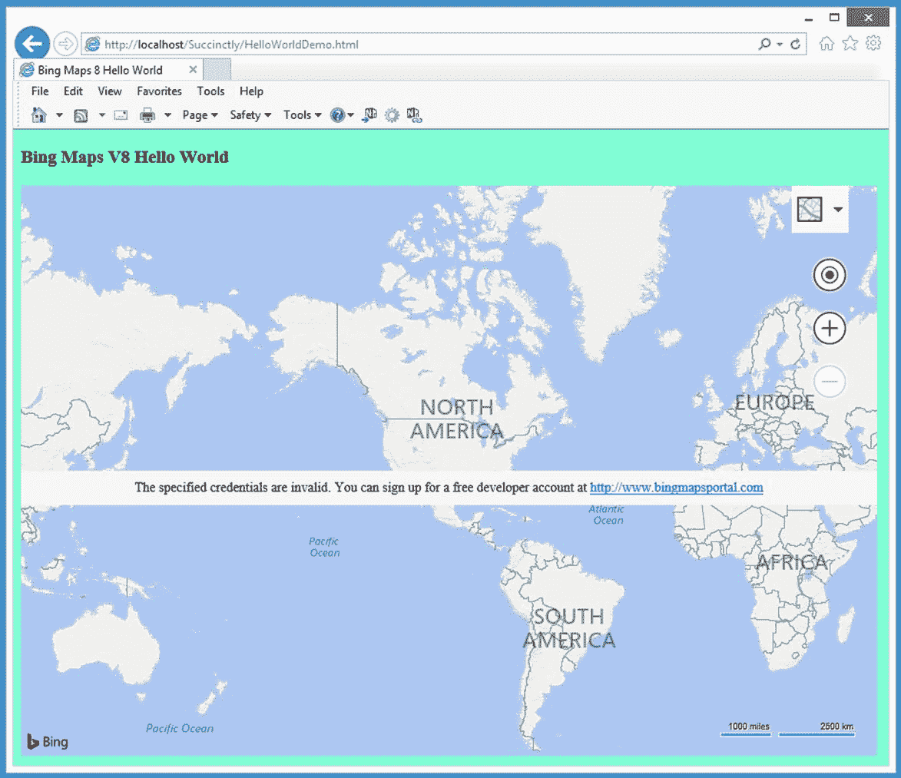
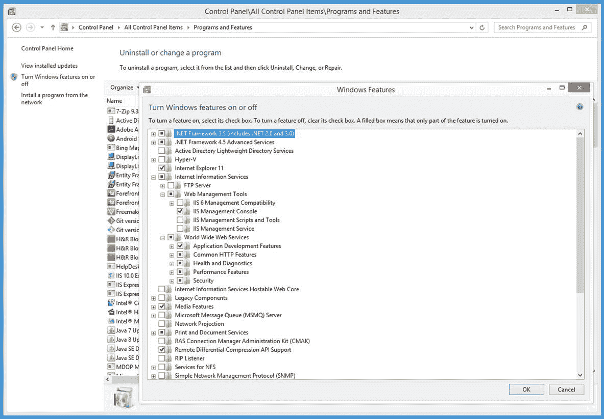

# 第 1 章开始

众所周知，各种各样的企业正在产生越来越多的数据。其中大部分数据包含地理位置信息。任何与数据相关的统计数据注定会立即过时，但人们普遍认为，80%的信息都有某种地理位置参考。

必应地图 V8 库是一个非常大的 JavaScript 代码集合，允许网络开发人员将地图放置在网页上，查询数据，以及操作地图上的对象。换句话说，必应地图库使您能够创建地理应用程序。

必应地图 V8 库于 2016 年 6 月发布。在功能和性能数量方面，新版本比 V7 版本库有了显著的改进。在 V7 之前，Bing Maps 被称为虚拟地球，一些遗留代码仍然引用 VE。

在这本电子书中，我们将假设你有基本的网络开发知识，但我们不会假设你对地理应用或大地图库有任何了解。如果你能启动并运行一个网络服务器，你应该能跟上。

我们将介绍如何创建基于网络的地理应用程序，但不会介绍如何将 Bing Maps V8 与 WPF 或 Silverlight 应用程序结合使用，本电子书的每一部分都将展示一个完整的、独立的演示网络应用程序。

我认识的每个开发人员都是通过启动并运行一个示例应用程序，然后通过进行更改来试验程序，从而学会如何使用新技术进行编程。如果您想学习如何以最有效的方式使用必应地图库，请将本电子书中演示网络应用程序的源代码复制到您最喜欢的编辑器中，将其保存在本地网络服务器上，玩该应用程序，然后摆弄代码。

你可以在:[https://github.com/jdmccaffrey/bing-maps-v8-succinctly](https://github.com/jdmccaffrey/bing-maps-v8-succinctly)获取本电子书使用的所有源代码和数据文件。

我不会在这里展示数百个代码片段。这就是文档的作用。相反，我试图挑选关键技术，并在每个演示 web 应用程序中结合一些关键技术。因为必应地图库在不断发展，所以深入了解一些关键技术比初步了解数百种很少使用的技术更重要。

在我看来，学习任何技术最困难的部分是让第一个应用程序运行。之后，都只是细节。但是开始可能会令人沮丧，所以这第一章的目的是确保您可以让您的初始地理应用程序工作。

在 1.1 节中，您将学习如何创建使用必应地图 V8 库的最简单的网络应用程序。在 1.2 节中，您将学习如何获取阿炳地图密钥，以便您可以免费使用必应地图服务(受使用限制)。在 1.3 节中，您将学习如何在网页上的普通 HTML 控件和地图上的对象之间进行通信。

已经聊够了。我们开始吧。

## 1.1 Hello World

通常，学习一项新技术最困难的部分就是克服最初的障碍，做出第一个成功的例子。本节的目标是帮助您创建一个非常简单的 Bing Maps V8“Hello World”(字面意思)演示页面。



图 1:你好世界演示

您可能在图 1 中注意到的第一件事是地图中心的消息，它指示“指定的凭据无效。”在下一节中，我将引导您完成获取阿炳地图密钥的过程，但现在您可以忽略该错误消息。

正如您将很快看到的，在网页上放置阿炳地图所需的 HTML 和 JavaScript 代码非常简单。图 1 中浏览器地址栏中的网址表示演示网页是本地托管的——在运行互联网信息服务(IIS)网络服务器的 Windows 10 机器上。本电子书中的示例只包含 HTML 和 JavaScript，没有依赖关系，这意味着任何 web 服务器都可以工作。

演示 web 应用程序名为 HelloWorldDemo.html，在一个文件中定义。

代码清单 1:HelloWorldDemo.html

```html
    <!DOCTYPE html>
   <!-- HelloWorldDemo.html -->

    <html>
       <head>
         <title>Bing Maps 8 Hello World</title>
         <meta  http-equiv ="Content-Type" content="text/html; charset=utf-8"/>
         <script  type ='text/javascript'>

        var  map = null;

        function GetMap()
        {
          var  options = {
            credentials: "TheBingMapsKeyGoesHere",
            center: new Microsoft.Maps.Location(35.00, -100.00),
            mapTypeId: Microsoft.Maps.MapTypeId.road,
            zoom:  2,
            enableClickableLogo: false,
            showCopyright: false
          };

          var  mapDiv = document.getElementById("mapDiv");  // Where to place
  map.
          map = new Microsoft.Maps.Map(mapDiv,
  options);   // Create the map.
        }

         </script>
       </head>

       <body  style ="background-color:aquamarine">
         <h3> Bing Maps V8 Hello World</h3>
         <div  id ='mapDiv'  style ='width:900px; height:600px;'></div>

   <script
  type='text/javascript'
        src='http://www.bing.com/api/maps/mapcontrol?callback=GetMap'
        async  defer >
      </script>

      </body>
    </html>

```

如果您已经启动并运行了 web 服务器，您可以复制该文件，将其放在 web 服务器上，然后导航到该页面。不幸的是，就配置设置而言，使用 web 服务器可能有些噩梦般。在这本电子书中，我们将假设您可以访问一台运行 web 服务的机器。图 2 显示了我一直使用的机器上的 IIS 组件。

大多数版本的 Windows 都包含 IIS，但默认情况下不启用 IIS。您可以通过转到窗口控制面板|程序和功能，然后单击左上角的**打开或关闭窗口功能**来启用 IIS。默认情况下，标记为“互联网信息服务”的条目将被清除。如果选择该条目，将启用运行 IIS 所需的所有子组件以及本电子书中的示例。



图 2:互联网信息服务组件

单击右下角的**确定**后，将出现一个对话框，向您显示更改应用到机器时的进度。

为了制作 Hello World 演示网页，我首先在 C:\inetpub\wwwroot 根目录中创建了一个名为“简洁地”的目录。接下来，我使用“以管理员身份运行”选项启动记事本程序，以便能够保存在受限的 inetpub 子目录中。

请注意，网页有两个脚本部分，一个在 HTML 头部区域，一个在 HTML 主体区域。身体部位脚本异步加载必应地图 V8 库: