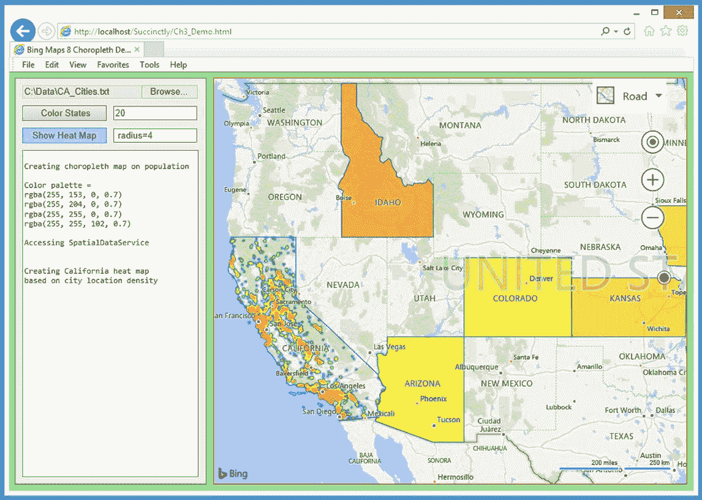
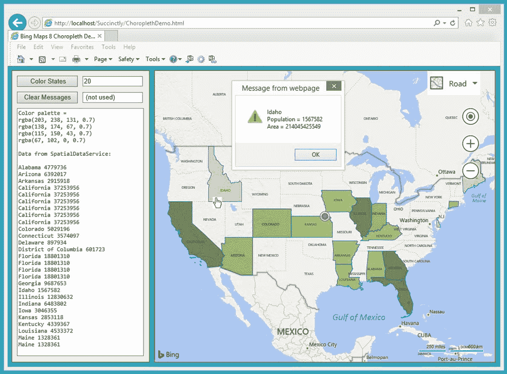
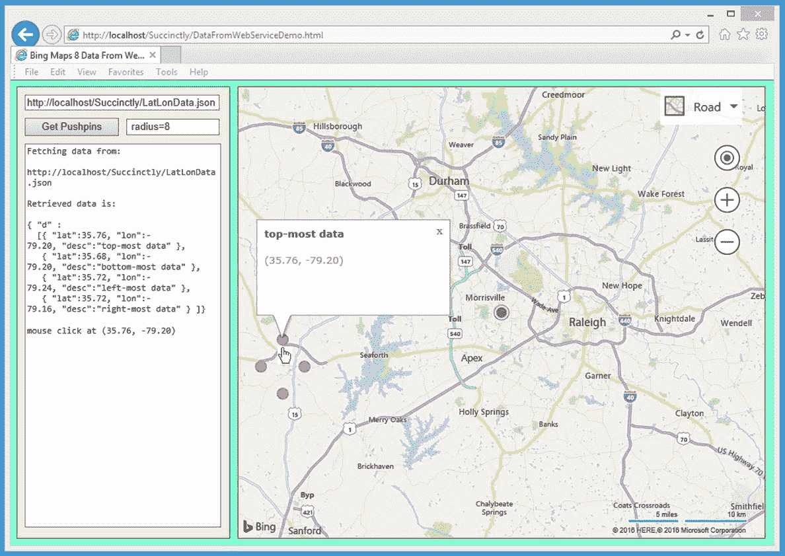

# 第三章处理数据

本章介绍了使用数据创建地图要素的一些最常见的技术。地理应用程序使用的常见数据源包括存储在本地的普通文件、存储在公司网络上的 SQL 数据以及存储在远程但可通过 web 服务访问的数据。常见的数据格式包括纯文本、众所周知的文本(WKT)、JSON 和 GeoJSON。

在 3.1 节中，您将学习如何从 Bing 空间数据服务中读取 WKT 格式的数据，以及如何过滤和解析这些数据。您还将了解调色板以及如何创建调色板贴图。您还将了解事件处理技术以及如何使用对象元数据。



图 16:使用数据演示

在 3.2 节中，您将学习如何从 web 服务读取 JSON 中的数据，以及如何解析该数据以创建可以添加到地图上的对象。您还将学习如何将 JavaScript 库(如 jQuery 和 AngularJS)集成到阿炳地图地理应用程序中。

在 3.3 节中，您将了解颜色渐变以及如何通过创建热图来处理大型数据集。您还将学习如何访问政府地理数据来源，如美国人口普查局提供的数据。

## 3.1 choropeth 地图

choropleth(发音为 koro-pleth)地图使用特定颜色的不同色调来表示某些统计数据的相对比例——例如，人口或人均收入。使用必应地图 V8 库创建地图相对简单。定义调色板，获取相关的形状和统计数据，应用调色板颜色，并将结果添加到图层。



图 17:合唱团地图演示

图 17 所示的演示网络应用程序显示了美国的人口分布图。较暗的阴影表示人口较多。演示最初加载一个以(40.00，-96.00)为中心的地图，并在中心放置一个默认样式的紫色图钉。在初始化期间，创建一个 **`Layer`** 对象来保存美国各州的形状。

当用户单击第一个按钮控件时，使用 REST 服务获取指定数量状态的实时形状和填充数据。由四种绿色组成的定制调色板是硬编码的。对于每个州，基于该州的人口确定颜色，并将该州的多边形数据添加到显示 **`Layer`** 对象中。

绘制每个州的多边形时，将添加一个单击事件处理程序，该程序将显示一个警报对话框，其中包含目标州的名称、人口和土地面积。

演示 web 应用程序名为 ChoroplethDemo.html，在一个文件中定义。

代码清单 6:ChoroplethDemo.html

```
    <!DOCTYPE html>
   <!-- ChoroplethDemo.html -->

    <html>
       <head>
         <title>Bing Maps 8 Choropleth Demo</title>
         <meta  http-equiv ="Content-Type" content="text/html; charset=utf-8"/>

         <script  type ='text/javascript'>

        var  map = null;
        var  ppLayer = null;
        var  statesLayer = null;

        function GetMap()
        {
          var  options = {
            credentials: "Anw _ _ _ 3xt",
            center: new Microsoft.Maps.Location(40.00, -96.00),
            mapTypeId: Microsoft.Maps.MapTypeId.road,
            zoom:  4,
            enableClickableLogo: false,
            showCopyright: false
          };

          var  mapDiv = document.getElementById("mapDiv");
          map = new Microsoft.Maps.Map(mapDiv,
  options);

          ppLayer = new Microsoft.Maps.Layer();
          var  cpp= new Microsoft.Maps.Pushpin(map.getCenter(), null);
          ppLayer.add(cpp);
          map.layers.insert(ppLayer);
          statesLayer = new Microsoft.Maps.Layer();
        }

        function WriteLn(txt)
        {
          var  existing = msgArea.value;
          msgArea.value = existing + txt + "\n";
        }

        function Button1_Click()
        {
          var  paletteGreen = [ 'rgba(203, 238, 131, 0.7)',
           'rgba(138, 174, 67, 0.7)', 'rgba(115, 150, 43, 0.7)',
           'rgba(67, 102, 0, 0.7)' ];

          WriteLn("Color palette = ");
          for  (var i =  0; i < paletteGreen.length; ++i)
  {
            WriteLn(paletteGreen[i]);
          }
          var  maxCount = textbox1.value;

          Microsoft.Maps.loadModule('Microsoft.Maps.SpatialDataService',
           function() {
            var world = Microsoft.Maps.LocationRect.fromEdges(90, -180, -90, 180);

            var queryOptions = {
              queryUrl: 'https://spatial.virtualearth.net/REST/v1/data/' +
                '755aa60032b24cb1bfb54e8a6d59c229/USCensus2010_States/States',
              spatialFilter: {
                spatialFilterType: 'intersects',
                intersects: world
              },
              top: maxCount
            };

            Microsoft.Maps.SpatialDataService.QueryAPIManager.search(queryOptions,
              map, function (data) {

              WriteLn("\nData from SpatialDataService:
  \n" );
              for (var i = 0; i < data.length; ++i)
  {
                // WriteLn(Object.keys(data[i].metadata));
                var name = data[i].metadata.Name;
                var pop = data[i].metadata.Population;

                if (name == "Alaska" || name ==
  "Hawaii") {
                  continue;
                }
                WriteLn(name + " " + pop);

                data[i].setOptions({
                  fillColor: GetStateColor(pop,
  paletteGreen)
                });

                Microsoft.Maps.Events.addHandler(data[i],
  'click', function (e) {
                  var n = e.target.metadata.Name;
                  var p = e.target.metadata.Population;
                  var a = e.target.metadata.Area_Land;
                  alert(n + '\nPopulation = ' + p +
  '\nArea
  = ' +
  a);
                });
              }

              statesLayer.add(data);
              map.layers.insert(statesLayer);
            });
          });
        } // Button1_Click()

        function GetStateColor(pop, palette)
        {
          if  (pop <  2000000) {
            return palette[0];
          }
          else if  (pop <  5000000) {
            return palette[1];
          }
          else if  (pop <  8000000) {
            return palette[2];
          }
          else  {
            return palette[3];
          }
        }

        function Button2_Click()
        {
          msgArea.value = "";
        }

         </script>
       </head>

       <body  style ="background-color:lightseagreen">
         <div  id ='controlPanel'  style ="float:left; width:262px; height:580px;
         border:1px solid green; padding:10px; background-color:
  beige" >
           <input  id ="button1" type='button'  style="width:125px;"
             value =' Color States' onclick="Button1_Click();"></input>
           <div  style ="width:2px; display:inline-block"></div> 
           <input  id ="textbox1" type='text' size='15' value='20'>
             </input><br/>
           <span  style ="display:block; height:10px"></span> 

           <input  id ="button2" type='button'  style="width:125px;"
             value =' Clear Messages ' onclick="Button2_Click();"></input>
           <div  style ="width:2px; display:inline-block"></div> 
           <input  id ="textbox2" type='text' size='15' value=' (not used) '>
             </input><br/>
           <span  style ="display:block; height:10px"></span> 

           <textarea  id ='msgArea'  rows ="36"  cols ="36"  style ="font-family:Consolas;
           font-size:12px"></textarea>
         </div>

         <div  style ="float:left; width:10px; height:600px"></div>
         <div  id ='mapDiv'  style ="float:left; width:700px; height:600px;
         border:1px solid red;"></div>
         <br  style ="clear: left;" />

   <script
  type='text/javascript'
        src='http://www.bing.com/api/maps/mapcontrol?callback=GetMap'
        async  defer >
      </script>

      </body>
    </html>

```

演示应用程序设置了三个全局脚本范围对象:

var 映射 = 零;
为 ppLayer = 零;
状态层 = 空;

对象`ppLayer`是一个用于保存普通图钉的地图图层，在这种情况下是一个默认样式的图钉来标记地图中心。`statesLayer`对象是 choropleth 着色的主要显示层。定义 choropleth 使用的颜色的调色板是在第一个按钮控件的 click 处理程序的本地定义的，但它可能是用全局对象定义的。

演示应用程序通过以通常的方式调用程序定义的`GetMap()`函数来异步加载 **`map`** 对象。`stateLayer`对象在`GetMap()`函数中实例化。

所有的工作都是在第一个按钮控件的 click handler 函数中完成的。函数定义从以下内容开始:

function button 1 _ Click()
{
var palettegen =[' rgba(203，238，131，0.7)'，' rgba(138，174，67，0.7)'，
'rgba(115，150，43，0.7)'，' rgba(67，102，0，0.7)']；

WriteLn("调色板= ")；
为(var I = 0；I<palette green . length；++(I){
WriteLn(paletteGreen[I])；
}
var maxCount = textbox 1 . value；
。。。

实际上，对于一个 choropleth 地图使用多少种颜色和哪些颜色有很多研究，但是我任意选择了四种绿色，并使用内置的`rgba()`功能创建了一个调色板。您也可以使用颜色名称。例如:

var palettgreen =[‘green yellow’、‘light green’、【t0’、‘medumusagreen’、‘darkolivegren’]；

要处理的最大状态数(演示中为 20)是从 textbox1 控件中提取的。在这种情况下，没有必要将该值转换为整数。

有几种方法可以获得 choropleth 数据。演示应用程序使用必应地图 V8 空间数据服务模块从阿炳地图 RESTful 网络服务获取实时状态数据。所有的工作都在模块的回调函数中完成:

微软。Maps.loadModule('微软。Maps . SpatialDataService '，function(){
var world = Microsoft。地图位置从边缘(90，-180，-90，180)；
var query options = {
query yurl:' ' https://spatial . virtualearth . net/REST/v1/data/'+
' 755 aa 60032 b24 CB 1 bfb 54 E8 a6 d 59 c 229/uscensus 2010 _ States/States '，
spatial filter:{
spatial filter type:' ' intersections '，
intersections:world
}，
top:maxCount
}；

web 服务支持几种不同类型的查询，但大多数都需要某种空间过滤器来缩小结果列表。例如，如果您在服务中查询兴趣点，您可能希望将结果限制在一个城市或地区。演示将其过滤器设置为全世界，因为最多只会返回 52 个结果(50 个州加上波多黎各和哥伦比亚特区)。

接下来，调用 **`search()`** 功能:

微软。maps . SpatialDataService . queryApimanager . search(query options，
map，function(data){
WriteLn(" \ n 来自 SpatialDataServiCe 的数据:\ n ")；
为(var I = 0；一<数据长度；++ I){
var name = data[I]. metadata . name；
var pop = data[i]。
if (name == "阿拉斯加" || name == "夏威夷"){
继续；
}
WriteLn(name+" "+pop)；
数据[i]。setOptions({
fill color:GetStateColor(pop，paletteGreen)
})；
微软。Maps.Events.addHandler(data[i]，' click '，function(e){
var n = e . target . metadata . name；
var p = e . target . metadata . population；
var a = e . target . metadata . area _ Land；
警报(n+' \ n 人口= '+p+' \ n 区域= '+a)；
})；
}

回调函数将结果返回到名为`data`的对象中。`data`中的每个项目都有一个元数据属性，该属性又有一个名称、人口、土地面积和其他信息。我在开发过程中通过将这个语句放在 for 循环中来确定元数据名称:

对象键(数据[i]。元数据))；

该演示执行二级编程过滤器，以删除阿拉斯加和夏威夷。通过调用程序定义的`GetStateColor()`函数来设置每个状态的颜色。然后，每个数据项都添加了一个事件处理程序，它将在一个不起眼的 JavaScript 警告框中显示元数据信息。使用自定义 **`Infobox`** 对象是一种替代方式。

从总体中确定颜色值的函数是:

函数 GetStateColor(pop，调色板)
{
if(pop<2000000){
返回调色板[0]；
}
else if(pop<5000000){
返回调色板[1]；
}
else if(pop<8000000){
返回调色板[2]；
}
else {
返回调色板[3]；
}
}

该功能简单但有效，因为只处理四种颜色。当您有许多不同的颜色时，一种替代方法是定义阈值数组。例如:

var PoLimits =[0，2000000，5000000，800000]；

您可以编写接受填充值、扫描阈值并返回调色板数组索引的代码。

总之，一旦有了形状数据和相关的统计数据，创建一个 choropleth 地图就相对容易了。最困难的部分是获取形状数据。您可以使用 virtualearth.net REST 服务，这是许多可用的外部数据源之一，并且您可以通过使用 Bing Maps V8 库 SpatialDataService 模块中的 **`search()`** 函数来解析该服务的结果。创建 choropleth 地图的替代方法包括从政府或商业 web 服务中获取纯文本、WKT、GeoJSON 或标准 JSON 格式的数据，并以编程方式解析数据。

### 资源

有关 Bing Maps V8 空间数据服务模块的详细信息，请参见:
[【https://msdn.microsoft.com/en-us/library/mt712849.aspx】](https://msdn.microsoft.com/en-us/library/mt712849.aspx)。

有关查询应用编程接口组件的详细信息，请参见:
[【https://msdn.microsoft.com/en-us/library/gg585126.aspx】](https://msdn.microsoft.com/en-us/library/gg585126.aspx)。

你可以在
[【http://www.w3schools.com/colors/colors_groups.asp】](http://www.w3schools.com/colors/colors_groups.asp)看到各种颜色的色调集合。

## 3.2 来自网络服务的数据

为地图应用程序获取数据的最常见方式之一是查询 web 服务。在大多数情况下，网络服务以 JSON 或 XML 格式返回数据。从 web 服务获取阿炳地图应用程序数据的一种有效技术是使用 jQuery 库。因为必应地图库只是普通的 JavaScript，所以使用 jQuery 库是一种自然的方法。



图 18:来自网络服务演示的数据

图 18 所示的演示 web 应用程序给出了一个从模拟 web 服务中获取 JSON 数据的例子。演示最初加载了一个位于北卡罗来纳州莫里斯维尔附近的地图，并在地图中心放置了一个默认样式的大紫色图钉。

左上角的文本框控件指向本地 web 服务器上名为 LatLonData.json 的数据文件，但是本节中介绍的技术可以使用指向返回 json 数据的 web 服务的任何 URL。当用户点击“获取图钉”时，一个请求被发送到模拟的网络服务。返回的数据被回显并用于在地图上放置四个图钉。每个图钉都有一个鼠标点击事件处理程序，显示一个包含相关图钉数据的 **`Infobox`** 对象。

演示应用程序名为 DataFromWebServiceDemo.html，在一个文件中定义。

代码清单 7:DataFromWebServiceDemo.html

```
    <!DOCTYPE html>
   <!-- DataFromWebServiceDemo.html -->

    <html>
       <head>
         <title>Bing Maps 8 Data From Web Service</title>
         <meta  http-equiv ="Content-Type" content="text/html; charset=utf-8"/>

         <script  type ="text/javascript"
        src="http://code.jquery.com/jquery-latest.min.js"> </script>
         <script  type ='text/javascript'>

        var  map = null;
        var  pushpins = [];
        var  infobox = null;
        var  ppLayer = null;

        function GetMap()
        {
          var  options = {
            credentials: "Anw _ _ _ 3xt",
            center: new Microsoft.Maps.Location(35.80, -78.80),
            mapTypeId: Microsoft.Maps.MapTypeId.road,
            zoom:  10,
            enableClickableLogo: false,
            showTermsLink: false
          };

          var  mapDiv = document.getElementById("mapDiv");
          map = new Microsoft.Maps.Map(mapDiv,
  options);

          infobox = new Microsoft.Maps.Infobox(new
  Microsoft.Maps.Location( 0, 0),
            { visible: false, offset: new
  Microsoft.Maps.Point(0,0) });
          infobox.setMap(map);

          ppLayer = new Microsoft.Maps.Layer();
          var  cpp= new Microsoft.Maps.Pushpin(map.getCenter(), null);
          ppLayer.add(cpp);
          map.layers.insert(ppLayer);
        }

        function WriteLn(txt)
        {
          var  existing = msgArea.value;
          msgArea.value = existing + txt + "\n";
        }

        function LatLonStr(loc)
        {
          var  s = "(" + Number(loc.latitude).toFixed(2) + ", " +
            Number(loc.longitude).toFixed(2) + ")";
          return  s;
        }

        $(document).ready(function() {
          $("#button1").click(function() {
            var urlVal = $("#textbox1").val();
            WriteLn("Fetching data from: \n");
            WriteLn(urlVal + "\n");

            var radius = parseInt((textbox2.value).split('=')[1]);
            var pinkDot = CreateSvgDot(radius, "DeepPink");

            $.ajax({
              url: urlVal,
              dataType: "text",
              success: function (data) {
                WriteLn("Retrieved data is: \n");
                WriteLn(data);
                var parsed = JSON.parse(data);
                var len = parsed.d.length;
                for (var i = 0; i < len; ++i)
  {
                  var loc = new
  Microsoft.Maps.Location(parsed.d[i].lat,
                    parsed.d[i].lon);

                  var ppOptions = { icon:
  pinkDot,
                    anchor: new Microsoft.Maps.Point(radius,radius)
  };

                  var pp = new
  Microsoft.Maps.Pushpin(loc, ppOptions);
                  pp.metadata = parsed.d[i].desc;
                  pushpins[i] = pp;
                  Microsoft.Maps.Events.addHandler(pp,
  'click', ShowInfobox);
                }
                ppLayer.add(pushpins);
                map.layers.insert(ppLayer);
              }
            });
          });
        });

        function ShowInfobox(e)
        {
          var  loc = e.target.getLocation();
          WriteLn('\nmouse click at ' + LatLonStr(loc));
          infobox.setLocation(loc);
          infobox.setOptions({ visible: true,
            title: e.target.metadata,
            description: LatLonStr(loc)
          });
        }

        function CreateSvgDot(radius, clr)
        {
          var  s = '<svg ';
             s += ' width="' + radius *
  2 +'"';

  s += ' height="' + radius * 2 + '"';

  s += '>' ;       
          s += '<circle cx="' + radius +
  '"';
          s += ' cy="' + radius + '"';
          s += ' r="' + radius + '"';
          s += ' fill="' + clr + '"';
          s += ' /></svg>';
          return s;
        }

         </script>
       </head>

       <body  style ="background-color:aquamarine">
         <div  id ='controlPanel'  style ="float:left; width:262px; height:580px;
         border:1px solid green; padding:10px; background-color:
  beige" >

           <input  id ="textbox1" type="text" size="38"
             value ="http://localhost/Succinctly/LatLonData.json"></input>
           <span  style ="display:block; height:10px"></span> 

           <input  id ="button1" type='button'  style="width:125px;"
             value ='Get Pushpins'  onclick ="Button1_Click();"></input>
           <div  style ="width:2px; display:inline-block"></div> 
           <input  id ="textbox2" type='text' size='15'
             value ='radius=8'></input><br/>
           <span  style ="display:block; height:10px"></span> 

           <textarea  id ='msgArea'  rows ="36"  cols ="36"  style ="font-family:Consolas;
           font-size:12px"></textarea>
         </div>

         <div  style ="float:left; width:10px; height:600px"></div> 
         <div  id ='mapDiv'  style ="float:left; width:700px; height:600px;
         border:1px solid red;">
         </div>
         <br  style ="clear: left;" />

    <script
  type='text/javascript'
        src='http://www.bing.com/api/maps/mapcontrol?callback=GetMap'
        async  defer >
      </script>

      </body>
    </html>

```

对 jQuery 库的引用位于 HTML 标题部分的顶部: