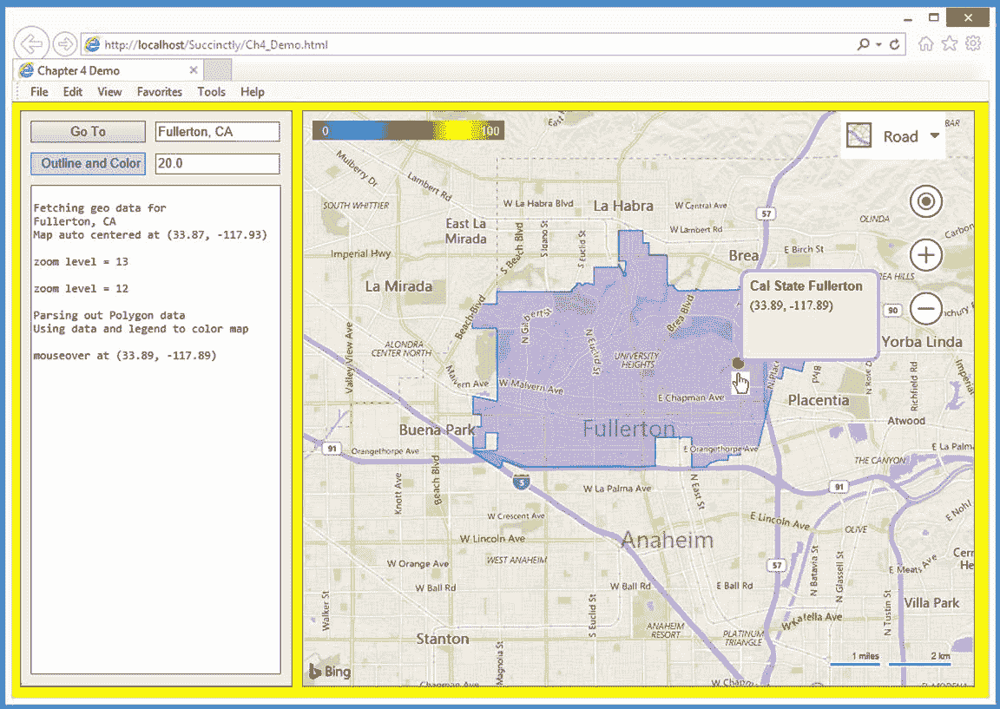
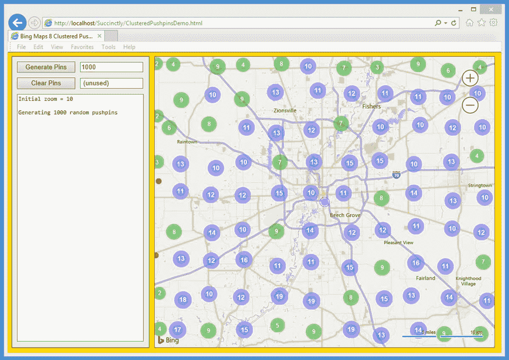
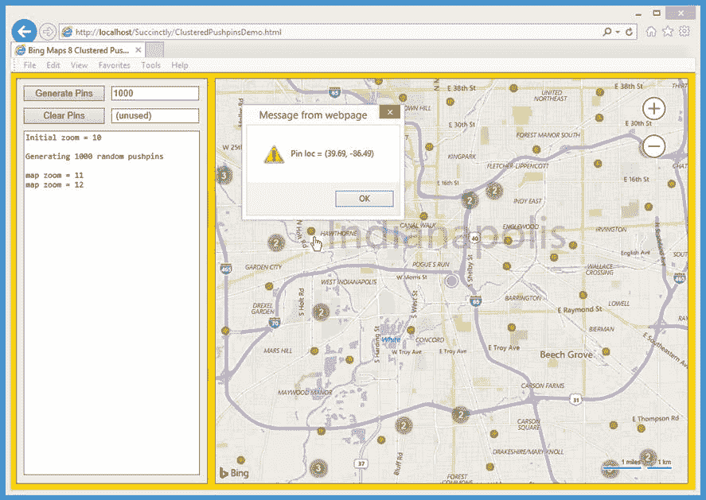
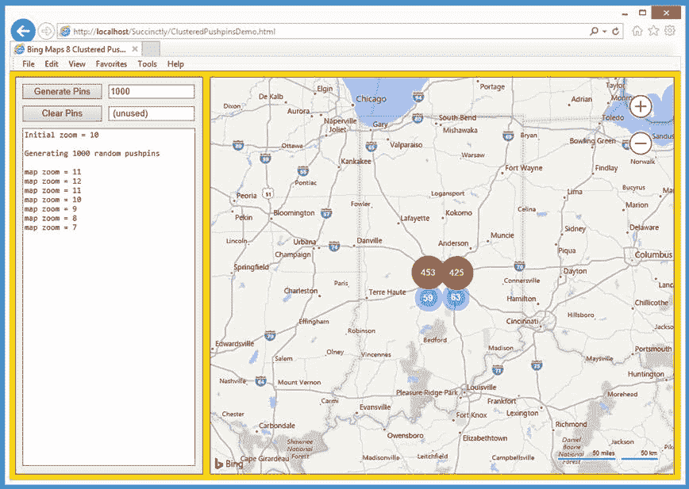
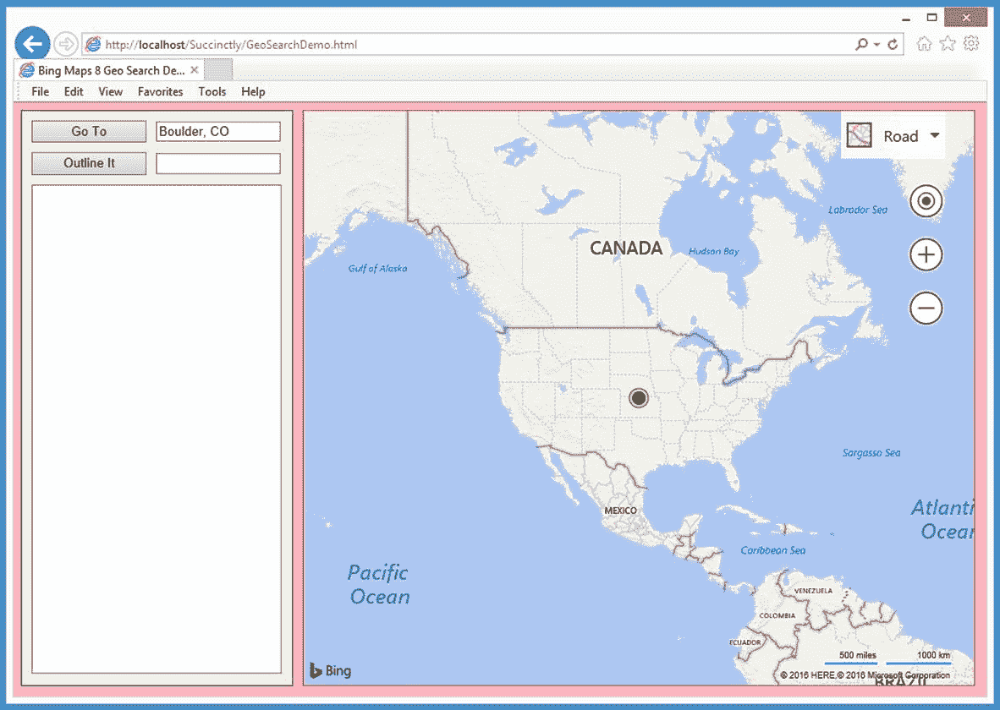
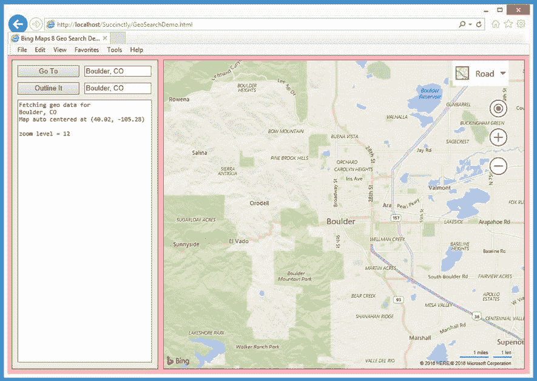
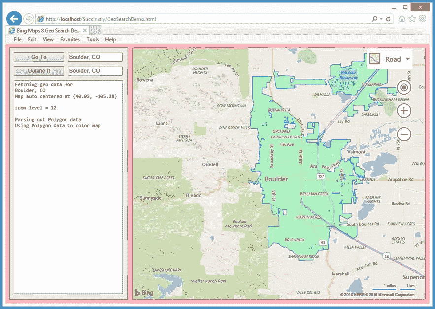
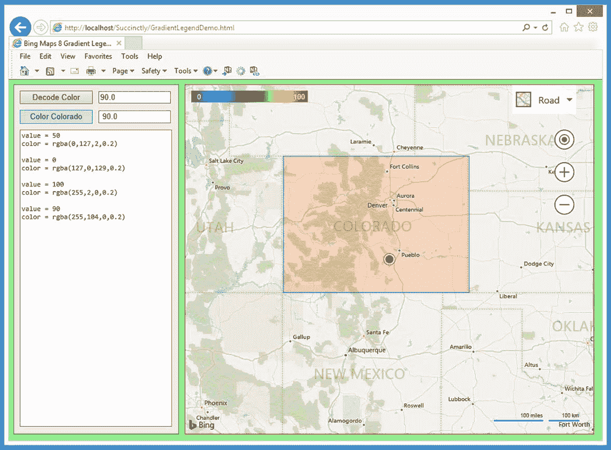
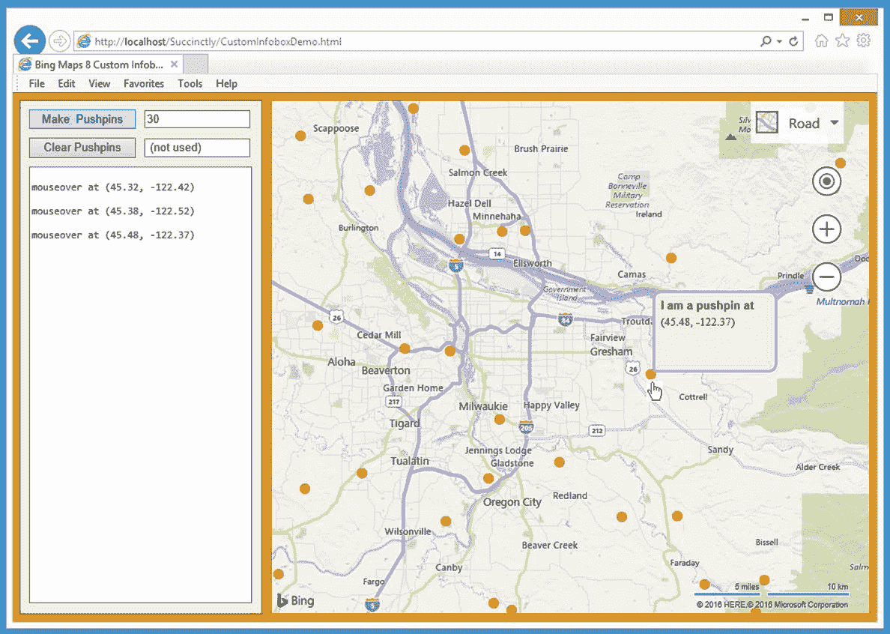

# 第四章高级技术

本章介绍了一些相对先进的地理应用必应地图 V8 技术。在 4.1 节中，您将学习如何创建自动图钉聚类，以便在有大量数据点时使用。你还将学习如何在地图中使用 **`getLocations()`** 和 **`getPolygons()`** 等功能。TestDataGenerator 模块，以便在开发过程中生成随机数据。



图 20:高级技术演示

在 4.2 节中，您将学习如何使用地图中的 **`SearchManager.geocode()`** 等功能。搜索模块以读取数据。您还将学习如何使用地图中的 **`GeoDataAPIManager.getBoundary()`** 等功能。空间数据服务模块，用于分析和处理数据。

在 4.3 节中，您将学习如何创建颜色渐变图例，以及如何使用图例将 0 到 100 之间的数值转换为相应的颜色。您还将学习如何使用渐变图例颜色为地图上的区域着色。

在 4.4 节中，您将学习如何创建自定义样式的 **`Infobox`** 对象。您还将学习如何使用莱默算法(有时称为帕克-米勒算法)生成可复制的伪随机数。

## 4.1 集束图钉

在地图应用程序上处理大量数据点可能很有挑战性。必应地图 V8 库最强大的功能之一是它能够将数据点聚类为 **`pushpin`** 对象。这个特点最好用一个直观的例子来解释。

图 21 中的演示 web 应用程序加载了一张位于印第安纳波利斯附近的地图。，初始缩放级别设置为 10。



图 21:集群图钉演示初始视图

当用户点击“生成图钉”时，应用程序在初始地图边界内创建了 1000 个随机位置的图钉。代码逻辑设置为将地图分成大约 10 乘 10 = 100 个网格正方形。绿色圆圈图标表示网格在该位置有两到九个图钉。单个图钉是橙色的——你可以在地图的左边看到其中两个。蓝色圆圈表示有 10 到 99 个图钉。

请注意，地图上的大多数标签，如“印第安纳波利斯”，都不可见。在幕后，必应地图库使用标签碰撞检测来自动移动或移除标签。

接下来，用户单击“+”缩放控件以获得缩放级别 12，这样大多数单个图钉都是可见的，并且可以被单击。请注意，“印第安纳波利斯”标签现在可见。



图 22:集群图钉演示放大

接下来，用户点击“-”缩放控件五次以缩小到级别 7。红色圆圈表示有 100 个或更多图钉。在图 23 中，四个集群的计数总和为 1000。



图 23:集群图钉演示缩小

演示应用程序名为 ClusteredPushpinsDemo.html，在一个文件中定义。

代码清单 9:ClusteredPushpinsDemo.html

```html
    <!DOCTYPE html>
   <!-- ClusteredPushpinsDemo.html -->

    <html>
       <head>
         <title>Bing Maps 8 Clustered Pushpins</title>
         <meta  http-equiv ="Content-Type" content="text/html; charset=utf-8"/>

         <script  type ="text/javascript">

        var  map = null;
        var  pushpins = [];
        var  ppLayer = null;  // ordinary pushpin layer
        var  clusterLayer = null;  // for pushpin clustering

        var  orangeDot = 'data:image/png;base64,iVBORw0KGgoAAAANSUhEUgAAAAw' + 
          'AAAAMCAYAAABWdVznAAAAGXRFWHRTb2Z0d2FyZQBBZG9iZSBJbWFnZVJlYWR5cc' +
          'llPAAAAIxJREFUeNpiZICCD766CkCqHogDgFgAJgzEG4C4UWDz5QcgAUaoYgMgt' +
          'R9JIToAaXQEarrACDX5PB7FyJoMmaDOIKSYAaqmngnqZmJBABORpsNtYWIgETBB' +
          'PUMs+MAEDWdiwQaQhkYibQGpaWSCxqAjAU2wiHsA9jQoBkGRAsQL0DR+gIoZQtU' +
          'wAAQYAGgpKDzqLFoIAAAAAElFTkSuQmCC'; 

        function GetMap()
        {
          var  options = {
            credentials: "Anw _ _ _ 3xt",
            center: new Microsoft.Maps.Location(39.75, -86.15), // Indy
            mapTypeId: Microsoft.Maps.MapTypeId.road,
            zoom:  10,
            enableClickableLogo: false,
            showCopyright: false,
            showMapTypeSelector: false,
            showLocateMeButton: false
          };

          var  mapDiv = document.getElementById("mapDiv");
          map = new Microsoft.Maps.Map(mapDiv,
  options);

          WriteLn('Initial zoom = ' +
  map.getZoom());
          Microsoft.Maps.Events.addHandler(map, 'viewchangeend', ViewChanged);

          ppLayer = new Microsoft.Maps.Layer();
          var  cpp = new Microsoft.Maps.Pushpin(map.getCenter(),
            { color: "fuchsia" });
          ppLayer.add(cpp);
          map.layers.insert(ppLayer);
        }

        function ViewChanged(e)
        {
          var  z = map.getZoom();
          WriteLn('map zoom = ' + z);
        }

        function WriteLn(txt)
        {
          var  existing = msgArea.value;
          msgArea.value = existing + txt + "\n";
        }

        function Button1_Click()
        {
          var  numPins = parseInt(textbox1.value);
          var  mb = map.getBounds();

          var  tdg = Microsoft.Maps.TestDataGenerator;
          var  locs = tdg.getLocations(numPins, mb);
          WriteLn("\nGenerating " + numPins +
  "
  random pushpins \n"); 

          var  n = locs.length; 
          var  ppOptions = { icon: orangeDot,
            anchor: new Microsoft.Maps.Point(4,4) };
          for  (var i =  0; i < n; ++i)
  {  
            var pp = new Microsoft.Maps.Pushpin(locs[i],
  ppOptions);
            pp.meta = locs[i];
            Microsoft.Maps.Events.addHandler(pp, 'click',
              function() {
                alert( "Pin loc = " + LatLonStr(pp.meta)
  );
              }
            );
            pushpins[i] = pp; 
          }

          // Add the pushpins to a cluster layer.
          Microsoft.Maps.loadModule('Microsoft.Maps.Clustering',
            function() {
              clusterLayer = new
  Microsoft.Maps.ClusterLayer(pushpins, {
                clusteredPinCallback: MakeClusterPins,
                gridSize:  70  // 70 pixels = ~1/10 of map width
            });
            map.layers.insert(clusterLayer);
          });
        }

        function MakeClusterPins(clusterDot)
        {
          // Customize the pushpin/dot that represents a cluster.
          var  minRadius =  12;
          var  outlineWidth =  7;
          var  count =  clusterDot.containedPushpins.length;
          var  radius =  2.2 * Math.log(count) +
  minRadius;

          var  fillColor = null;

          if  (count >=  100) {
            fillColor = 'red';  // solid red
          }
          else if  (count >=  10 && count <= 99) {
            fillColor = 'rgba(80, 80, 255, 0.45)';  // blue-ish
          }
          else if  (count >=  2 && count <= 9) {
            fillColor = 'rgba(20, 180, 20, 0.45)';  // green-ish
          }

          var  img = '<svg 
  width="'  +
            (radius * 2) + '"
  height="'  + (radius * 2) + '">' +
            '<circle cx="' + radius + '" cy="' + radius +
  '"
  r="'  +
            radius + '" fill="' + fillColor
  + '"/>' +
            '<circle cx="' + radius + '" cy="' + radius +
  '"
  r="'  +
            (radius - outlineWidth) + '" fill="' + fillColor
  + '"/>' +
            '</svg>';

          clusterDot.setOptions({
            icon: img,
            anchor: new Microsoft.Maps.Point(radius,
  radius),
            textOffset: new Microsoft.Maps.Point(0, radius - 8)
          });

        } 

        function LatLonStr(loc)
        {
          var  s = "(" + Number(loc.latitude).toFixed(2) + ", " +
            Number(loc.longitude).toFixed(2) + ")";
          return  s;
        }

        function Button2_Click(e)
        {
          WriteLn("Clearing all clustered pushpins"); 
          clusterLayer.clear();
        }

         </script>
       </head>

       <body  style ="background-color:gold">
         <div  id ='controlPanel'  style ="float:left; width:262px; height:580px;
         border:1px solid green; padding:10px; background-color:
  beige" >

           <input  id ="button1" type='button'  value='Generate Pins'
             style ="width:120px;" onclick="Button1_Click();"></input>
           <div  style ="width:2px; display:inline-block"></div>
           <input  id ="textbox1" type='text' size='16'
             value ='1000' ></input><br/>
           <span  style ="display:block; height:10px"></span> 

           <input  id ="button2" type='button'  value='Clear Pins'
             style ="width:120px;" onclick="Button2_Click();"></input>
           <div  style ="width:2px; display:inline-block"></div> 
           <input  id ="textbox2" type='text' size='16'
             value =' (unused) '></input><br/>
           <span  style ="display:block; height:10px"></span>

           <textarea  id ='msgArea'  rows ="36"  cols ="36"  style ="font-family:Consolas;
           font-size:12px"></textarea>
         </div>
         <div  style ="float:left; width:10px; height:600px"></div> 
         <div  id ='mapDiv'  style ="float:left; width:700px; height:600px; 
         border:1px solid red;"></div>
         <br  style ="clear: left;" /> 

    <script
  type='text/javascript'
        src='http://www.bing.com/api/maps/mapcontrol?callback=GetMap'
        async  defer >
      </script>

      </body>
    </html>

```

该演示设置了五个脚本全局对象:

var map = null
var 图钉=[]；
var ppLayer = null；//普通图钉层
var cluster layer = null；//用于图钉聚类

var orange dot = ' data:image/png；-伊甸园字幕组=-翻译:粒粒粒尘紫月猫姐 scenery 校对:粒尘紫月猫姐时间轴:邦德猪

使用图钉聚类时，通常为单个图钉创建一个层，为代表多个图钉的簇创建第二个层。`orangeDot`对象是半径为六个像素的橙色圆圈的 Base64 编码的 PNG 图像。更常见的替代方法是使用普通图像。例如:

var orangeDot = img/12x 12 orange . png "；

地图加载有`zoom: 10`选项和`showCopyright`、`showMapTypeSelector`、`showLocateMeButton`选项设置为`false`，以保持地图视觉上的干净。带有`color: fuchsia`的默认样式普通图钉放置在中心作为参考点。

修改地图`viewchangeend`事件处理程序，以便将控制转移到名为`ViewChanged()`的程序定义函数，以便记录缩放级别。

功能`ViewChanged()`定义为:

函数 view changed(e)
{
var z = map . getzoom()；
WriteLn('地图缩放= '+z)；
}

除了缩放改变之外，`viewchangeend`事件由几个动作触发。或者，我们可以使用一个名为`zoomLev`的全局对象，并且只有当`getZoom()`的新值与当前的`zoomLev`值不同时才编写一条消息。

标有“获取图钉”的按钮控件与功能`Button1_Click()`相关联:

function button 1 _ Click()
{
var numPins = parsent(textbox 1 . value)；
var MB = map . getbounds()；
var tdg =微软。地图。测试数据生成器；
var locas = tdg . getlocations(numPins，MB)；
WriteLn(" \ n 生成"+ numPins +"随机图钉\ n ")；
。。。

这里的关键思想是在地图中使用静态`getLocations()`功能。TestDataGenerator 模块。该函数期望生成多个 **`Location`** 对象和一个 **`Bounds`** 对象，该对象限制返回的 **`Location`** 对象数组的纬度和经度范围。

TestDataGenerator 模块有一个小缺点——它使用内置的 JavaScript `Math.random()`函数，该函数不能被植入种子，这意味着每次调用`getLocations()`时，您都会得到不同的结果，即使您想要可重现的结果。或者，您可以编写自己的可播种随机数生成器，该生成器可以播种并用于生成 **`Location`** 对象。

随机位置的图钉由以下代码创建:

var n = locs.length
var ppooptions = { icon:orangeDot，主播:新微软。Maps.Point(4，4)}；
为(var I = 0；I<n；++(I){
var PP =新微软。图钉(位置[i]，选项)；
PP . meta = locas[I]；
微软。Maps.Events.addHandler(pp，' click '，function(){
alert(" Pin loc =+LatLonStr(PP . meta))；
})；
图钉[I]= PP；//存储到全局数组

每个图钉都修改了其点击事件处理程序，以便在一个简单的警告框中显示其位置(使用`LatLonStr()`格式化)。另一种方法是使用一个 **`Infobox`** 对象。

图钉创建并存储后，将被添加到集群层:

。。。
微软。Maps.loadModule('微软。Maps.Clustering '，
function(){
cluster layer =新微软。Maps.ClusterLayer(图钉，{
clusteredPinCallback:make clusterpins，
grid size:70
})；
map . layers . insert(cluster layer)；
})；
} //结束按钮 1_Click()

匿名回调函数使用`ClusterLayer()`构造函数将所有图钉添加到全局`clusterLayer`对象中。`clusteredPinCallback`属性指向一个函数`MakeClusterPins()`，该函数将定义集群图标的大小和颜色。`gridSize`属性设置为 70 像素，是地图宽度的十分之一。或者，您可以使用`Map.getWidth()`功能以编程方式设置网格大小。

**`MakeClusterPins()`** 功能从设置集群图标的大小开始:

函数 MakeClusterPins(cluster dot)
{
var minRadius = 12；
var outlineWidth = 7；
var count = ClusterDot . contained PushPins . length；
var 半径= 2.2 * Math.log(计数)+minRadius；
。。。

根据它所代表的图钉数量来计算集群图标的半径可能有些棘手。这个想法是设置一个绝对最小半径，然后为代表大量图钉的图标增加一个奖励。`Math.log()`函数将日志返回到其参数的基础 **`e`** 。图钉计数的对数将是一个不超过大约 9.5 的值，而 2.2 的因子是通过一点点反复试验确定的。您可以简单地使用固定值，而不是计算可变半径。

接下来，确定集群图标的颜色:

var fillColor = 空;

if(计数> = 100){
fill color = ' red '；//纯红
}
else if(计数> = 10 & &计数<= 99){
fill color = ' rgba(80，80，255，0.45)'；//蓝色系
}
else if(count>= 2&&count<= 9){
fill color = ' rgba(20，180，20，0.45)'；//绿色

如果你看一下这部分开头的图，你会发现蓝色和绿色的集群图标是两个同心圆。使用`rgba()`功能，将 alpha 值设置为 0.45，外圆会有点透明。画内圆的时候，会显得近乎实心。`rbga()`功能的另一种选择是地图。色彩类。

接下来，使用 SVG 创建双圆图标图像:

var img = ' (半径* 2)+' height = '+(半径* 2) + '" > ' +
' <圆 CX = '+半径+' " cy = '+半径+' " r = '+
半径+' " fill = '+fill color+' "/>'+
'<圆 CX = '+半径+' " cy = '+半径+' " r = '+
(radius-outlineidth)

或者，我们可以按照`CreateSvgConcentric()`的思路定义一个函数。另一种选择是使用 HTML 画布对象来定义图标。

回调函数以创建集群图标结束:

。。。
clusterDot.setOptions({
图标:img，
主播:新微软。地图。点(半径，半径)，
文本偏移量:新微软。地图.点(0，半径-8)
})；
}

`textOffset`属性考虑了簇图标中心的计数文本的高度。

简而言之，首先以通常的方式为图钉创建一个图钉数组和一个 **`Layer`** 对象，从而创建集群图钉。接下来，在地图中定义一个匿名函数。调用`ClusterLayer()`构造函数的聚类模块，该构造函数又可选地设置一个定义聚类图标大小和颜色的回调函数。

### 资源

有关集群层选项的详细信息，请参见:
[【https://msdn.microsoft.com/en-us/library/mt712813.aspx】](https://msdn.microsoft.com/en-us/library/mt712813.aspx)。

有关集群层类的更多详细信息，请参见:
[【https://msdn.microsoft.com/en-us/library/mt712808.aspx】](https://msdn.microsoft.com/en-us/library/mt712808.aspx)。

有关使用地图的信息。颜色类代替了 **`rgba()`** 功能，参见:
[https://msdn.microsoft.com/en-us/library/mt712639.aspx](https://msdn.microsoft.com/en-us/library/mt712639.aspx)。

## 4.2 地理搜索

必应地图 V8 库有许多功能，允许您查询必应地图空间数据服务。您可以将必应地图空间数据服务视为一个巨大的地理数据库，可以使用 RESTful URL 进行查询。必应地图库具有包装函数，这使得调用必应地图空间数据服务比直接调用服务要容易得多。

图 24 中的演示 web 应用程序加载了一个位于内布拉斯加州和堪萨斯州边界附近的地图，初始缩放级别设置为 3。



图 24:地理搜索演示的初始地图视图

应用程序在地图中心放置一个默认样式的绿色图钉作为参考点。最上面的文本框控件预填充了“科罗拉多州博尔德”，但它是可编辑的。

当用户单击“转到”时，应用程序加载了地图。搜索模块在幕后，并向必应地图空间数据服务发送请求，以获取有关指定位置的信息。

当返回关于博尔德的信息时，应用程序保存结果供以后使用，然后自动确定“最佳视图”

在本例中，用户确定科罗拉多州博尔德的最佳视图为缩放级别 12 和地图中心位置(40.02，-105.28)。



图 25:获取有人居住的地方的数据

接下来，用户单击“概述它”应用程序加载了地图。空间数据服务模块，然后用它来给科罗拉多州博尔德的边界上色



图 26:人口稠密地区的彩色多边形信息

演示应用程序名为 GeoSearchDemo.html，在一个文件中定义。

代码清单 10:GeoSearchDemo.html

```html
    <!DOCTYPE html>
   <!-- GeoSearchDemo.html -->

    <html>
       <head>
         <title>Bing Maps 8 Geo Search Demo</title>
         <meta  http-equiv ="Content-Type" content="text/html; charset=utf-8"/>

         <script  type ="text/javascript">

          var  map = null;
          var  ppLayer = null;
          var  geoShapeLayer = null;
          var  geoResult = null;

        function GetMap()
        {
          var  options = {
            credentials: "Anw _ _ _ 3xt",
            center: new Microsoft.Maps.Location(39.80, -98.60),
            mapTypeId: Microsoft.Maps.MapTypeId.road,
            zoom:  3,
            enableClickableLogo: false,
            showTermsLink: false
          };

          var  mapDiv = document.getElementById("mapDiv");
          map = new Microsoft.Maps.Map(mapDiv,
  options);

          Microsoft.Maps.Events.addHandler(map, 'viewchangeend', ViewChanged);

          ppLayer = new Microsoft.Maps.Layer();
          var  cpp= new Microsoft.Maps.Pushpin(map.getCenter(), {color:
  'green'}); 
          ppLayer.add(cpp);
          map.layers.insert(ppLayer);

          geoShapeLayer = new Microsoft.Maps.Layer();
        }

        function ViewChanged(e)
        {
          var  z = map.getZoom();
          WriteLn('\nzoom level = ' + z);
        }

        function WriteLn(txt)
        {
          var  existing = msgArea.value;
          msgArea.value = existing + txt + "\n";
        }

        function Button1_Click(e)
        {
          var  city = textbox1.value;
          textbox2.value = city;  // echo
          WriteLn("Fetching geo data for \n" +
  city.toString());

          Microsoft.Maps.loadModule('Microsoft.Maps.Search', function() {
            var searchManager = new
  Microsoft.Maps.Search.SearchManager(map);
            var geoRequest = {
              where: city,
              callback: function(res) {
                geoResult = res;  // Save for use by
  the outliner function.
                if (res && res.results &&
  res.results.length >  0) {
                  map.setView({ bounds: res.results[0].bestView });
                  WriteLn("Map auto centered at " +
                    LatLonStr(map.getCenter()));
                } 
              } 
            }; 
            searchManager.geocode(geoRequest);  // Do an async
  request.
          }); 
        }

        function Button2_Click(e)
        {
          var  city = textbox1.value;
          WriteLn('\nParsing out Polygon data');
          WriteLn('Using Polygon data to color map');

          var  geoOptions = { entityType: 'PopulatedPlace',
            getAllPolygons: true };

          Microsoft.Maps.loadModule('Microsoft.Maps.SpatialDataService',
            function() {
              var apimgr =
  Microsoft.Maps.SpatialDataService.GeoDataAPIManager;
              apimgr.getBoundary(geoResult.results[0].location,
  geoOptions, map,
                function(data) {
                  if (data.results &&
  data.results.length >  0) {
                    geoShapeLayer.add(data.results[0].Polygons);
                    map.layers.insert(geoShapeLayer);
                  }
                });
            });
        }

        function LatLonStr(loc)
        {
          var  s = "(" + Number(loc.latitude).toFixed(2) + ", " +
            Number(loc.longitude).toFixed(2) + ")";
          return  s;
        }

         </script>
       </head>

       <body  onload ="GetMap();" style="background-color:lightpink">
         <div  id ='controlPanel'  style ="float:left; width:262px; height:580px;
         border:1px solid green; padding:10px; background-color:
  beige" >

           <input  id ="button1" type='button'  value='Go To'  style="width:120px;"
             onclick ="Button1_Click();"></input>
           <div  style ="width:2px; display:inline-block"></div> 
           <input  id ="textbox1" type='text' size='16' value='Boulder, CO'>
             </input><br/>
           <span  style ="display:block; height:10px"></span> 

           <input  id ="button2" type='button'  value='Outline It'
             style ="width:120px;" onclick="Button2_Click();"></input>
           <div  style ="width:2px; display:inline-block"></div> 
           <input  id ="textbox2" type='text' size='16' value=''></input><br/>
           <span  style ="display:block; height:10px"></span>  

           <textarea  id ='msgArea'  rows ="36"  cols ="36"  style ="font-family:Consolas;
           font-size:12px"></textarea>
         </div>
         <div  style ="float:left; width:10px; height:600px"></div>
         <div  id ='mapDiv'  style ="float:left; width:700px; height:600px;
         border:1px solid red;"></div>
         <br  style ="clear: left;" />

    <script
  type='text/javascript'
        src='http://www.bing.com/api/maps/mapcontrol?callback=GetMap'
        async  defer >
      </script>

      </body>
    </html>

```

该演示设置了四个脚本全局对象:

var 映射 = 零;
为 ppLayer = 零;
geoShapeLayer = 零;
geoResult = 空;

这两个 **`Layer`** 对象是全局声明的，尽管它们只分别由单个函数`GetMap()`和`Button2_Click()`使用，以强调地图分层的思想。然而，对象`geoResult`是在函数`Button1_Click()`中创建的，然后在函数`Button2_Click()`中访问，因此它是合法的全局对象。

第一个按钮控件的事件处理程序是`Button1_Click()`。函数的定义开始于:

function button 1 _ Click(e)
{
var city = textbox 1 . value；
textbox 2 . value = city；
WriteLn(“为\n 获取地理数据”+city . tostring())；
。。。

正如您将很快看到的，必应地图空间数据服务数据库将被查询所谓的人口密集的地方。该服务对模糊查询进行了相当多的智能猜测。例如，如果用户指定“巴黎”，查询将返回法国巴黎的信息，而不是阿肯色州、爱达荷州、伊利诺伊州、印第安纳州、爱荷华州、肯塔基州、缅因州、密歇根州和得克萨斯州名为巴黎的城市。

搜索是这样进行的:

。。。
微软。Maps.loadModule('微软。Maps.Search '，function(){
var Search manager = new Microsoft。地图。搜索。搜索管理器(地图)；
var georeqest = {
其中:city，
回调:function(RES){
geoResult = RES；//如果(RES&&RES . results&&RES . results . length>0){
map . setview({ bounds:RES . results[0])，则保存以供 outliner 函数使用。best view })；
WriteLn(“地图自动居中于”+
LatLonStr(Map . getcenter()))；
}
}
}；
search manager . geocode(geoRequest)；
})；
}

由于嵌套的回调函数，这里发生了很多事情。第一个语句可以解释为“加载地图。搜索模块，并在加载完成后执行以下操作。

下一条语句可以解释为“在当前 **`map`** 对象上实例化一个新的 **`SearchManager`** 对象。”执行搜索时，查询将在空间数据服务中查找被识别为城市的数据，如果返回任何结果，则将结果保存在全局`geoResult`对象中，然后使用`setView()`功能使用结果重新定位和调整 **`map`** 对象的大小。

功能`Button2_Click()`中的代码使用查询结果对目标城市进行勾勒和着色。定义开始于:

函数 button 2 _ Click(e)
{
var city = textbox 1 . value；
WriteLn('导出多边形数据')；

WriteLn('使用多边形数据进行颜色映射')；
var geoOptions = { entity type:' PopulatedPlace '，
getall polygons:true }；
。。。

`SearchManager`对象返回大量信息，因此该函数设置了一个`geoOptions`过滤器，仅提取标记为`PopulatedPlace`的数据，并获取所有多边形。(许多城市有复杂的边界，由多个多边形组成。)

存储在全局对象`geoResult`中的数据是 WKT 格式的，这可能很难解析，但是`getBoundary()`功能让您的生活更轻松:

。。。
微软。Maps.loadModule('微软。Maps.SpatialDataService '，
function(){
var API mgr = Microsoft。地图.空间数据服务.地理数据管理器；
API mgr . getboundary(georesult . results[0]。位置、地理选项、地图、
功能(数据){
if(data . results&&data . results . length>0){
geoshape layer . add(data . results[0]。多边形)；
map . layers . insert(geoshape layer)；
}
})；
})；
}

总之，您可以使用地图的搜索管理器类。搜索模块从必应地图空间数据服务查询数据，而不是使用原始的 RESTful 网址。您可以使用地图的地理数据管理器类。用来解析返回的 WKT 格式数据的类。

### 资源

有关地图的详细信息。空间数据服务模块，参见:
[https://msdn.microsoft.com/en-us/library/mt712849.aspx](https://msdn.microsoft.com/en-us/library/mt712849.aspx)。

有关地图的详细信息。搜索模块，参见:
[https://msdn.microsoft.com/en-us/library/mt712846.aspx](https://msdn.microsoft.com/en-us/library/mt712846.aspx)。

有关使用 QueryAPIManager 类查询 Bing 服务的信息，请参见:
[【https://msdn.microsoft.com/en-us/library/mt712828.aspx】](https://msdn.microsoft.com/en-us/library/mt712828.aspx)。

有关使用地理数据管理器类提取多边形的信息，请参见:
[https://msdn.microsoft.com/en-us/library/mt712862.aspx](https://msdn.microsoft.com/en-us/library/mt712862.aspx)。

## 4.3 渐变图例

对于某些地理应用程序，创建连续颜色渐变，然后使用渐变定义的颜色值为形状和其他地图要素着色是很有用的。必应地图 V8 库没有任何允许您直接创建颜色渐变图例的功能，但是很容易将 HTML5 画布与自定义图钉相结合来创建渐变图例。



图 27:渐变图例演示

图 27 所示的演示 web 应用程序最初加载一个以(38.00，-105.00)为中心的地图，并在中心放置一个默认的大紫色图钉。在幕后，一个颜色渐变图例以编程方式创建为自定义图钉，并放置在地图的西北角。

渐变的颜色范围从紫色到绿色再到红色，每种颜色对应一个介于 0(紫色)和 100(红色)之间的数值。每当用户更改缩放级别或滚动地图时，图例都会在西北角重新绘制。

标记为“解码颜色”的按钮将颜色显示为 RGBA，对应于关联文本框控件中的数值。标记为“Color Colorado”的按钮就是这样做的，它使用与相关文本框控件中的数值相对应的颜色。

演示 web 应用程序名为 GradientLegendDemo.html，在一个文件中定义。

代码清单 11:GradientLegendDemo.html

```html
    <!DOCTYPE html>
   <!-- GradientLegendDemo.html -->

    <html>
       <head>
         <title>Bing Maps 8 Gradient Legend Demo</title>
         <meta  http-equiv ="Content-Type" content="text/html; charset=utf-8"/>

         <script  type ='text/javascript'>

        var  map = null;
        var  ppLayer = null;  // pushpin layer
        var  legendLayer = null;
        var  stateLayer = null;

        var  legend = null;
        var  legendImageInfo = null;

        var  colorado =
          'GEOMETRYCOLLECTION( POLYGON ((-102 41, -109 41, -109 37,' +
         '-102 37, -102 41)) )';

        function GetMap()
        {
          var  options = {
            credentials: "Anw _ _ _ 3xt",
            center: new Microsoft.Maps.Location(38.00, -105.00),
            mapTypeId: Microsoft.Maps.MapTypeId.road,
            zoom:  6,
            enableClickableLogo: false,
            showCopyright: false
          };

          var  mapDiv = document.getElementById("mapDiv");
          map = new Microsoft.Maps.Map(mapDiv,
  options); 

          Microsoft.Maps.Events.addHandler(map, 'viewchangeend', ViewChanged);

          ppLayer = new Microsoft.Maps.Layer();
          var  cpp= new Microsoft.Maps.Pushpin(map.getCenter(), null);
          ppLayer.add(cpp);
          map.layers.insert(ppLayer);

          legendLayer = new Microsoft.Maps.Layer();
          CreateLegend();
          var  legendOpt = { icon: legend,
            anchor: new Microsoft.Maps.Point(-10,-10) };
          var  bounds = map.getBounds();
          var  nw = bounds.getNorthwest();

          var  legendPp = new Microsoft.Maps.Pushpin(nw,
  legendOpt);
          legendLayer.add(legendPp);
          map.layers.insert(legendLayer);

          stateLayer = new Microsoft.Maps.Layer();
        }

        function ViewChanged(e)
        {
          // Relocate legend.
          legendLayer.clear();
          var  legendOpt = { icon: legend,
            anchor: new Microsoft.Maps.Point(-10,-10) };
          var  bounds = map.getBounds();
          var  nw = bounds.getNorthwest();
          var  legendPp = new Microsoft.Maps.Pushpin(nw,
  legendOpt);
          legendLayer.add(legendPp);
          map.layers.insert(legendLayer);
        }

        function WriteLn(txt)
        {
          var  existing = msgArea.value;
          msgArea.value = existing + txt + "\n";
        }

        function Button1_Click()
        {
          // Get color, associate with a value.
          var  maxValue =  100;
          var  v = parseInt(textbox1.value);
          var  color = GetLegendColor(v, maxValue);
          WriteLn("value = " + v);
          WriteLn("color = " +
  color.toString());
          WriteLn("");
        }

        function CreateLegend()
        {
          // Create, save a legend as png for use as a custom pushpin.
          var  c = document.createElement('canvas');
          c.width =  200;
          c.height =  20;
          var  ctx = c.getContext("2d");
          var  grd = ctx.createLinearGradient(0, 0, c.width, 0);
          grd.addColorStop(0.0, "purple");
          grd.addColorStop(0.25, "blue");
          grd.addColorStop(0.50, "green");
          grd.addColorStop(0.75, "yellow");
          grd.addColorStop(1.0, "red");
          ctx.fillStyle = grd;
          ctx.fillRect( 0, 0, c.width, c.height);  // Rectangle fills
  canvas.
          ctx.font = "12px Arial";
          ctx.fillStyle = "white";
          ctx.fillText("100", 175, 15);
          ctx.fillText("0", 10, 15);
          legendImageInfo = ctx.getImageData(0, 0, c.width, 1);  // Save pixel info.
          legend = c.toDataURL();  // Save as png for
  custom pp.
        }

        function GetLegendColor(value, maxValue)
        {
          value = (value > maxValue) ?
  maxValue : value;
          var  idx = Math.round((value / maxValue)
  *  200 )  *  4  -  4 ;
          if  (idx <  0) {
            idx =  0;
          }
          return 'rgba('  + legendImageInfo.data[idx] + ',' +
            legendImageInfo.data[idx + 1] + ',' +
            legendImageInfo.data[idx + 2] + ',' + '0.2)';
        }

        function Button2_Click()
        {
          var  colorVal = parseInt(textbox2.value);
          var  colorRgba = GetLegendColor(colorVal, 100);

          Microsoft.Maps.loadModule('Microsoft.Maps.WellKnownText', function () {
            var geoColl = Microsoft.Maps.WellKnownText.read(colorado,
              { polygonOptions: { fillColor:
  colorRgba } });

            for (var i = 0; i < geoColl.length;
  ++i) {
              stateLayer.add(geoColl[i]);
            }
            map.layers.insert(stateLayer);
          });      
        }

         </script>
       </head>

       <body  style ="background-color:lightgreen">
         <div  id ='controlPanel'  style ="float:left; width:262px; height:580px;
         border:1px solid green; padding:10px; background-color:
  beige" >

           <input  id ="button1" type='button'  style="width:125px;"
             value =' Decode Color ' onclick="Button1_Click();"></input>
           <div  style ="width:2px; display:inline-block"></div> 
           <input  id ="textbox1" type='text' size='15' value=' 50.0 '></input><br/>
           <span  style ="display:block; height:10px"></span> 

           <input  id ="button2" type='button'  style="width:125px;"
             value ='Color Colorado' onclick="Button2_Click();"></input>
           <div  style ="width:2px; display:inline-block"></div> 
           <input  id ="textbox2" type='text' size='15' value=' 50.0 '></input><br/>
           <span  style ="display:block; height:10px"></span> 

           <textarea  id ='msgArea'  rows ="36"  cols ="36"  style ="font-family:Consolas;
           font-size:12px"></textarea>
         </div>

         <div  style ="float:left; width:10px; height:600px"></div> 
         <div  id ='mapDiv'  style ="float:left; width:700px; height:600px;
         border:1px solid red;"></div>
         <br  style ="clear: left;" /> 

      <script
  type='text/javascript'
       src='http://www.bing.com/api/maps/mapcontrol?callback=GetMap'
       async  defer >
      </script>

      </body>
    </html>

```

演示应用程序设置了七个全局脚本范围对象:

var 映射 = 零;
为 ppLayer = 零;
被传说层 = 零;
状态层 = 零;
是图例 = 零;
图例图像信息 = 空;
是科罗拉多州 =
'几何采集（ 多边形 （（-102 41， -109 41， -109 37，' +
'-102 37， -102 41）';;

对象`ppLayer`是存放普通图钉的地图图层。颜色渐变图例实际上是一个自定义图钉，并为其创建了一个`legendLayer`地图图层对象。`stateLayer`对象是描绘科罗拉多州的多边形。

`legend`对象实际上是一个 PNG 图像，它将以编程方式创建，并充当自定义图钉的图标。`legendImageInfo`是保存图例图像信息的对象，用于将数值映射为颜色值。

`colorado`对象是使用 WKT 语法定义的多边形形状。科罗拉多非常简单，只有五个 lat-lon 顶点(最后一个顶点复制第一个顶点以闭合形状)。

演示应用程序通过以通常的方式调用程序定义的`GetMap()`函数来异步加载 **`map`** 对象。创建颜色渐变图例的语句有:

legendLayer =新微软。地图.图层()；
create legend()；
var legendOpt = { icon: legend，
主播:新微软。地图.点(-10，-10)}；

键码包含在程序定义函数`CreateLegend()`中。 **`options`** 对象以 10 像素的偏移量设置锚点，这样图例就不会与地图边缘齐平。

将渐变图例放置在地图上的语句有:

var bounds = map . getbounds()；
var NW = bounds .get 西北()；
var legendPp =新微软。图钉(西北，勒让德)；
legendlayer . add(legendPp)；
map . layers . insert(LegendLayer)；

传说只是一个伪装的图钉，像普通图钉一样放在地图上。`CreateLegend()`的定义始于:

函数 create legend()
{
var c = document . createelement(' canvas ')；
长宽= 200；
c . height = 20；
var CTX = c . getcontext(" 2d ")；
。。。

我们使用 HTML5 画布来绘制颜色渐变，然后将该画布转换为 PNG 图像，用作自定义图钉图标。正如您将很快看到的，使用 HTML5 画布比使用 SVG 或静态图像更好。接下来，使用内置的`createLinearGradient()`功能创建颜色渐变:

var grd = CTX . createlinear gradients(0，0，c.width，0)；
grd . add color op(0.0，“紫色”)；
grd . add color op(0.25，“蓝色”)；
grd . add colorrstop(0.50，“绿色”)；
grd . add color op(0.75，“黄色”)；
grd . add color op(1.0，“red”)；

`createLinearGradient()`的争论可能很棘手。在这种情况下，它们定义了一个横跨画布整个宽度的渐变，而不是从上到下。接下来，该函数使用渐变信息填充矩形:

ctx.fillStyle = grd：
ctx.fillRect(0，0，c.width，c . height)；//rectangle fills canvas
CTX . font = " 12px arial "；
CTX . fill style = " white "；
ctx.fillText("100 "，175.15)；
ctx.fillText("0 "，10，15)；

代码将标签“0”和“100”放在渐变的左右两端。定位参数值(175，15，10，15)是通过反复试验确定的。函数定义的结论是:

。。。
字幕信息= ctx.getImageData(0，0，c.width，1)；
legend = c . todataurl()；

`getImageData()`函数从梯度中返回一组 RGBA 数据。这些值将由程序定义的函数使用，该函数将从 0 到 100 的数值映射到 RGBA 颜色。奇怪命名的`toDataURL()`函数返回一个 PNG 图像用于显示。

控制面板区域中的第一个按钮用于提供信息，并显示由指定值的颜色渐变定义的 RGBA 信息。代码是:

函数 button 1 _ Click()
{
var maxValue = 100；
var v = Parseint(textbox 1 . value)；
var color = GetLegendColor(v，maxValue)；
WriteLn(“value =+v)；
WriteLn(" color =+color . tostring())；
WriteLn(" ")；
}

所有的实际工作都由`GetLegendColor()`函数执行，该函数从脚本-全局`legendImageInfo`对象中提取信息，定义为:

函数 GetLegendColor(value，maxValue)
{
value =(value>maxValue)？maxValue:值；
var idx = math . round((value/maxValue)* 200)* 4-4；
if(idx<0){
idx = 0；
}
返回' rgba('+LegenDimageInfo . data[idx]+'，'+
LegenDimageInfo . data[idx+1]+'，'+
LegenDimageInfo . data[idx+2]+'，'+' 0.2 ')；
}

索引值考虑到每个像素有四个值。alpha 值被硬编码为 0.2，但是您可能希望将其参数化。颜色值由从 HTML5 画布对象创建的`legendImageInfo`信息决定。如果没有这些信息，将数值从渐变映射到颜色将非常困难。

第二个按钮控件为科罗拉多州的多边形着色。代码是:

函数 button 2 _ click():t0 { } var color val = parseint(文本框 2.value)；
var colorba = getlegend color(color val，100)；

微软。Maps.loadModule('微软。Maps.WellKnownText '，function(){
var geo coll = Microsoft。Maps.WellKnownText.read(科罗拉多州，
{ polygonOptions:{ fill color:colorgba } })；

for(var I = 0；I< geoColl.length; ++i) {
state layer . add(GeoColl[I])；
}

map . layers . insert(StateLayer)；
})；
}

WKT 模块的`read()`功能将存储在`colorado`对象中的 WKT 数据解析成一个多边形数组，因为许多形状(如夏威夷州)是由几个多边形组成的。多边形的颜色设置为 RGBA 值，该值对应于 0 到 100 之间的数值。使用 GeoJSON 格式提供了一个重要的替代方案，而不是像 WKT 那样存储和读取数据。例如:

var Wyoming = { ' type ':' FeatureCollection '，
' features ':[{ ' type ':' Feature '，' id': 'WY '，
' properties ':{ ' name ':' Wyoming ' }，
'geometry': { 'type': 'Polygon '，'坐标':
[[-104.05，41]，[-104.05，45]，[-111.05，45]，[-111.05，41]，[-104 . 05，41]

然后:

微软。Maps.loadModule('微软。Maps.GeoJson '，function(){
var geoColl = Microsoft。Maps.GeoJson.read(怀俄明州，
{ polygonOptions:{ fill color:colorgba } })；
为(var I = 0；i <地理坐标长度；++(I){
StateLayer . add(GeoColl[I])；
}
地图图层插入(国家图层)；
})；

总之，创建渐变图例的一种方法是绘制一个 HTML5 画布，将其转换为 PNG 图像，并将该图像用作自定义图钉的图标。这项技术允许您编写一个函数，将数值映射到渐变中的颜色。必应地图 V8 库可以处理 WKT 和地理 JSON 格式的数据。

### 资源

有关 Bing Maps V8 知名文本模块的详细信息，请参见:
[【https://msdn.microsoft.com/en-us/library/mt712880.aspx】](https://msdn.microsoft.com/en-us/library/mt712880.aspx)。

有关 Bing Maps V8 GeoJSON 模块的详细信息，请参见:
[【https://msdn.microsoft.com/en-us/library/mt712806.aspx】](https://msdn.microsoft.com/en-us/library/mt712806.aspx)。

## 4.4 自定义信息框对象

必应地图库允许您使用普通的 CSS 标记结合 JavaScript 字符串 **`replace()`** 功能来创建自定义样式的 **`Infobox`** 对象。在开发过程中，生成随机的 **`Location`** 对象通常很有用。地图。TestGenerator 模块有 **`getLocations()`** 功能。然而，生成的位置是不可再现的。为了生成可再现的随机位置，您可以编写自己的随机数生成器。



图 28:带有可再现随机位置演示的定制信息框

图 28 所示的演示 web 应用程序展示了自定义 **`Infobox`** 对象和自定义伪随机位置生成。演示最初加载了一个以(45.50，-122.50)为中心的地图，该地图位于俄勒冈州波特兰市附近。当用户单击“制作图钉”时，应用程序使用自定义随机数生成器在地图边界内创建 30 个随机 **`Location`** 对象。

然后使用这些位置创建 30 个橙色图钉。每个图钉的 mouseover 事件处理程序都会触发显示图钉位置的自定义样式的 Infobox 外观。

随机位置是可再现的，这意味着如果图钉被清除或网页被重新加载，点击“制作图钉”将重新创建相同的 30 个位置。

演示应用程序名为 CustomInfoboxDemo.html，在一个文件中定义。

代码清单 12:custominfooxdemo . html

```html
    <!DOCTYPE html>
   <!-- CustomInfoboxDemo.html -->

    <html>
       <head>
         <title>Bing Maps 8 Custom Infobox Demo</title>
         <meta  http-equiv ='Content-Type'  content ='text/html; charset=utf-8'/>

         <script  type ='text/javascript'>

        var  map = null;
        var  ctr = null;
        var  pushpins = [];
        var  ppLayer = null;
        var  infobox = null;
        var  ibTemplate = null;

        function GetMap()
        {
          var  options = {
            credentials: "Anw _ _ _ 3xt",
            center: new Microsoft.Maps.Location(45.50, -122.50),  // Portland, OR
            mapTypeId: Microsoft.Maps.MapTypeId.road,
            zoom:  10,
            enableClickableLogo: false,
            showTermsLink: false
          };

          var  mapDiv = document.getElementById("mapDiv"); 
          map = new Microsoft.Maps.Map(mapDiv,
  options);
          ctr = map.getCenter(); 

          ppLayer = new Microsoft.Maps.Layer();

          ibTemplate = '<div id="ibBox"
  style="border-radius: 10px 10px 10px 0px;' +
            ' background-color:beige; border-style:solid;
  border-width:medium;'  +
            ' border-color:magenta; min-height: 90px; width: 140px;
  ">'  +
            ' <b id="ibTitle" style="position: absolute;
  top: 10px; left: 10px;'  +
            ' width: 220px; font-family:Arial;
  font-size:small">{title}</b>' +
            ' <a id="ibDesc" style="position: absolute;
  top: 30px; left: 10px;'  +
            ' width: 220px;
  font-size:small">{description}</a></div>';

          infobox = new Microsoft.Maps.Infobox(ctr, {
            visible: false,
            htmlContent: ibTemplate.replace('{title}',
              'dummy title').replace('{description}', 'dummy description')
          });

          infobox.setMap(map);
        }

        function ShowInfobox(e)
        {
          var  loc = e.target.getLocation();
          infobox.setLocation(loc);
          WriteLn('\nmouseover at ' + LatLonStr(loc));
          infobox.setOptions({
            visible: true,
            offset: new Microsoft.Maps.Point(2, 2),
            htmlContent: ibTemplate.replace('{title}',
              'I am a '  + e.targetType + ' at').replace('{description}',
              LatLonStr(loc)) });
        }

        function HideInfobox(e)
        {
          infobox.setOptions({ visible: false });
        }

        function Button1_Click()
        {
          var  count = parseInt(textbox1.value);
          var  locs = MakeLocs(count, map.getBounds(),
  19);

          var  orangeDot = 'data:image/png;base64,iVBORw0KGgoAAAANSUhEUgAAAAw' + 
            'AAAAMCAYAAABWdVznAAAAGXRFWHRTb2Z0d2FyZQBBZG9iZSBJbWFnZVJlYWR5cc' +
            'llPAAAAIxJREFUeNpiZICCD766CkCqHogDgFgAJgzEG4C4UWDz5QcgAUaoYgMgt' +
            'R9JIToAaXQEarrACDX5PB7FyJoMmaDOIKSYAaqmngnqZmJBABORpsNtYWIgETBB' +
            'PUMs+MAEDWdiwQaQhkYibQGpaWSCxqAjAU2wiHsA9jQoBkGRAsQL0DR+gIoZQtU' +
            'wAAQYAGgpKDzqLFoIAAAAAElFTkSuQmCC'; 

          var  ppOptions = { icon: orangeDot,
            anchor: new Microsoft.Maps.Point(6, 6) };

          for  (var i =  0; i < count; ++i)
  {
            var pp = new Microsoft.Maps.Pushpin(locs[i],
  ppOptions);
            Microsoft.Maps.Events.addHandler(pp, 'mouseover', ShowInfobox);
            Microsoft.Maps.Events.addHandler(pp, 'mouseout', HideInfobox);
            pushpins[i] = pp;
          }

          ppLayer.add(pushpins);
          map.layers.insert(ppLayer);
        }

        function Button2_Click()
        {
          ppLayer.clear();
        }

        function MakeLocs(n, bounds, sd)
        {
          Math.myRandom = SetSeed(sd);
          var  latHi = bounds.getNorth();
          var  latLo = bounds.getSouth();
          var  lonHi = bounds.getEast();
          var  lonLo = bounds.getWest();

          var  result = [];
          for  (var i =  0; i < n; ++i)
  {
            var lat = (latHi - latLo) *
  Math.myRandom() + latLo;
            var lon = (lonHi - lonLo) *
  Math.myRandom() + lonLo;
            var loc = new Microsoft.Maps.Location(lat,
  lon);
            result.push(loc);
          }
          return  result;
        }

        SetSeed = function(seed) {
          if  (seed <=  0) {
            alert('Bad seed');
          }

          function ParkMiller() {
            var hi = Math.floor(seed / 127773);
            var lo = seed % 127773;
            seed = (16807 * lo) - (2836 * hi);
  //
  global
            if (seed <= 0) {
              seed +=  2147483647;
            }
            return seed / 2147483647;
          }

          for  (var i =  0; i < 20; ++i)
  {  // Burn away first 20 results.
            var dummy = ParkMiller();
          }
          return  ParkMiller;
        }

        function WriteLn(txt)
        {
          var  existing = msgArea.value;
          msgArea.value = existing + txt + "\n";
        }

        function LatLonStr(loc)
        {
          var  s = "(" + Number(loc.latitude).toFixed(2) + ", " +
            Number(loc.longitude).toFixed(2) + ")";
          return  s;
        }

         </script>
       </head>

       <body  style ="background-color:goldenrod">
         <div  id ='controlPanel'  style ="float:left; width:262px; height:580px;
         border:1px solid green; padding:10px; background-color:
  beige" >

           <input  id ="button1" type='button'  style="width:125px;"
             value =' Make  Pushpins ' onclick="Button1_Click();"></input>
           <div  style ="width:2px; display:inline-block"></div> 
           <input  id ="textbox1" type='text' size='15'
             value ='30' ></input><br/>
           <span  style ="display:block; height:10px"></span> 

           <input  id ="button2" type='button'  style="width:125px;"
             value =' Clear Pushpins ' onclick="Button2_Click();"></input>
           <div  style ="width:2px; display:inline-block"></div> 
           <input  id ="textbox2" type='text' size='15'
             value =' (not used) '></input><br/>
           <span  style ="display:block; height:10px"></span>

           <textarea  id ='msgArea'  rows ="36"  cols ="36"  style ="font-family:Consolas;
           font-size:12px"></textarea>
         </div>

         <div  style ="float:left; width:10px; height:600px"></div>
         <div  id ='mapDiv'  style ="float:left; width:700px; height:600px;
         border:1px solid red;"></div>
         <br  style ="clear: left;" />

    <script
  type='text/javascript'
        src='http://www.bing.com/api/maps/mapcontrol?callback=GetMap'
        async  defer >
      </script>

      </body>
    </html>

```

该演示设置了六个脚本全局对象:

var 映射 = 零;
ctr = 零;
是图钉 = [];
为 ppLayer = 零;
信息框 = 空;
被 ibTemplate = 零;

`Infobox`对象是一个单独的信息框，将由存储在名为`pushpins`的数组中的所有图钉共享。`ibTemplate`对象是定义`Infobox`对象外观的字符串。对象`ctr`将持有地图的中心经纬度。

使用功能`GetMap()`创建地图。该函数还实例化了自定义模板:

ibTemplate = '

'背景色:米色；边框样式:实心；边框宽度:中等；+
'边框颜色:洋红色；最小高度:90px 宽度:140px">'+
'<b id = " ibTitle " style = " position:absolute；top:10px；左:10px+
'宽:220px 字体系列:Arialfont-size:小">{ title }</b>'+
'<a id = " ibDesc " style = " position:absolute；top:30px；左:10px+
'宽:220px 字号:小“>{ description }</a></div>'；

模板有三个主要区域。第一个区域定义了盒子形状的外观。这意味着模板是使用普通的 CSS 标记定义的，并且有大量的格式选项可供您选择。

第二个区域定义了信息框标题的外观。请注意“{ title }”—这将被特定内容替换。

第三个区域定义了 Infobox 描述部分的外观，其中“{description}”将被特定内容替换。“{title}”和“{description}”不是特殊的词，因此如果您愿意，可以使用“{foo}”和“{bar}”。

全局信息框是这样创建的:

infobox =新微软。maps . Infobox(ctrl，{
visible: false，
html content:ibtemplate . replace(' { title } '，
'dummy title ')。替换(' {description} '，' dummy description ')
})；

信息框最初位于地图中心，但不可见。JavaScript `replace()`函数用于存储标题和描述的虚拟文本。替换链接是方便和标准的做法，但是，在我看来，它有点丑陋。另一种选择是:

var s = IBTemplate . replace(“{ title }”，“伪标题”)；
var t = s . replace(“{ description }”，“虚拟描述”)；
。。。
html 内容:t

内置的 JavaScript `Math.random()`函数无法接受初始种子值，这意味着结果不可重现。演示定义了一个使用莱默算法的自定义随机数发生器(你会记得，它有时被称为帕克-米勒算法)。自定义随机数生成器的代码是:

SetSeed =函数(种子){
if(种子< = 0) {
alert(【坏种子】)；

函数 ParkMiller(){
var hi = math . floor(seed/127773)；
var lo =种子% 127773；
种子=(16807 * lo)-(2836 * hi)；//全局
if(种子< = 0) {
种子+= 2147483647；
}

返回种子/2147483647；
}

for(var I = 0；I< 20; ++i) {
var dummy = park miller()；
}

返回帕克米勒；
}

请注意，该函数是一个声明(而不是定义)，带有一个返回的嵌套函数定义。代码相当微妙，您可以在本节末尾找到关于该算法的更多信息的链接。

随机数发生器由程序定义的函数`MakeLocations()`调用，该函数定义为:

函数 MakeLocs(n，bounds，SD)
{
math . myrandom = SetSeed(SD)；
var latHi = bounds . getnorth()；
var latLo = bounds . getsouth()；
var lonHi = bounds . geteast()；
var lonLo = bounds . getwest()；
。。。

该函数接受要生成的 **`Location`** 对象的数量作为`n`，接受一个地图边界对象作为`bounds`，接受一个随机数种子值作为`sd`。随机数生成器被创建为`Math.myRandom`，通过使用有趣的 JavaScript 技术，动态地将新成员分配给现有的类。

内置的`getNorth()`和`getSouth()`函数返回相关联的`bounds`对象的顶部和底部纬度值。`getEast()`和`getWest()`函数返回左右经度值。要在当前地图区域内创建 100 个随机位置，使用随机种子值 19，可以这样调用函数:

var locs = MakeLocs（100， map.getBounds（）， 19）;

`MakeLocations()`的代码结束于:

。。。
var 结果=[]；
为(var I = 0；I<n；++ I){
var lat =(latHi-latLo)* math . myrandom()+latLo；
var lon =(lonHi-lonLo)* math . myrandom()+lonLo；
var loc =新微软。地图。位置(lat，lon)；
result . push(loc)；
}
返回结果；
}

`Math.myRansom()`函数返回 0.0 到 1.0 之间的伪随机值。在任意值 A 和 B 之间返回值的代码习惯用法是`(A-B) * Math.myRandom() + B`。

`Button1_Click()`函数创建随机位置图钉，并将鼠标悬停和鼠标移出事件与函数`ShowInfobox()`和`HideInfobox()`相关联:

函数 ShowInfobox(e)
{
var loc = e . target . getlocation()；
infobox . setlocation(loc)；
infobox.setOptions({
可见:真，偏移量:新微软。地图.点(2，2)，
html content:ibtemplate . replace(“{ title }”，
“我是一个“+e . target type+”at”)。替换(' {description} '，
LatLonStr(loc))})；
}

对于自定义 **`Infobox`** 对象，`showCloseButton`选项属性被忽略，这是不利的。因为 **`Infobox`** 对象没有点击处理程序，所以很难去掉可见的信息框，而且在很多情况下，使用 mouseout 事件将`visible`属性设置为`false` 是一个很好的方法。例如:

微软公司。Maps.Events.addHandler(pp、Moussa、hideinfobox)；
。。。
功能隐藏信息框(e)
{
信息框. setOptions({可见:false })；

总之，为了创建自定义样式的 **`Infobox`** 对象，您需要定义一个模板 CSS 字符串，并使用 JavaScript 字符串替换函数来提供特定的标题和描述内容。通过编写使用莱默(或帕克-米勒)算法的自定义函数，可以创建可再现的伪随机 **`Location`** 对象。

### 资源

有关信息框选项类的详细信息，请参见:
[https://msdn.microsoft.com/en-us/library/mt712658.aspx](https://msdn.microsoft.com/en-us/library/mt712658.aspx)。

自定义 **`Infobox`** 对象的高级示例，请参见:
[【https://msdn.microsoft.com/en-us/library/mt750644.aspx】](https://msdn.microsoft.com/en-us/library/mt750644.aspx)。

有关 Lehmer 随机数算法的更多信息，请参见:
[https://en . Wikipedia . org/wiki/Lehmer _ random _ number _ generator](https://en.wikipedia.org/wiki/Lehmer_random_number_generator)。

关于随机数发生器的一篇著名文章，在网上搜索:
《随机数发生器:好的很难找到》，1988，Park and Miller。