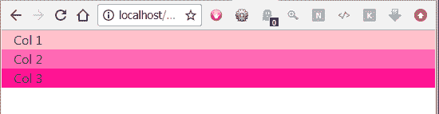
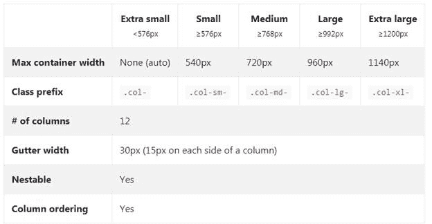

从我记事起，使用超文本标记语言技术的开发人员就一直在努力设计最基本的网格模式。如果你已经足够大了，可以记住 HTML4 和(*颤抖*)甚至版本 2 和 3，那么你会非常熟悉 HTML 表格的滥用，因为许多人(包括我)试图使用它们来控制和约束他们的布局。

有了 Bootstrap，这一切都成为过去。

近年来，CSS 规范提出了两种新的布局模式，称为 Flexbox 和 CSS Grid，后者是区块上的最新小子。BS4 充分利用了 Flexbox 所能提供的一切，这不仅给了我们 BS3 已经拥有的最初的世界一流的 Flexbox 前网格，而且严重增压了 BS4 所拥有的一切。

BS4 完全是 Flexbox 的核心，几乎所有的东西都用它。现在，所有块级容器和元素都使用 Flexbox 进行控制，从而能够创建一些非常有趣的布局。

在我们进一步讨论之前，让我们从一些简单的例子开始。

在使用任何 Bootstrap 网格工具做任何事情之前，您需要一个容器。容器是爸爸，阿尔法，第 0 个数字，它们包含了你的布局将使用的所有其他东西。

容器有两种类型:一种是宽度总是其父容器(通常是页面)宽度的 100%的流体容器，另一种是总是使用中心列固定宽度的标准容器，其大小取决于父容器的总宽度。

使用代码清单 1 或 2 中的模板，在`<!--Page content goes here-->`之后添加以下内容。

代码清单 3:我们的第一个容器

```html
  <div class="container" style="background-color: yellow">Hello Bootstrap</div>

```

如果您保存文件并将其加载到浏览器中，您应该会看到如下图所示的内容。


图 1:我们的第一个容器，如 Chrome 中所示

您刚刚创建的是一个固定宽度的容器，如果您更改浏览器窗口的宽度，您应该会看到它保持居中，并且在可能的情况下，在每一侧保持相等的间距。

您刚才添加的所有内容都是常规的 HTML 神奇的部分是添加到其中的类。

Bootstrap 的大部分魔力只是通过选择正确的类添加到代码中来实现的。在这种情况下，我们添加了`container`，我们还添加了一些额外的样式，以便您可以看到它创建的`<div>`标签的背景。

将您的 HTML 文件加载回编辑器，并更改类，使其读作`container-fluid`而不是`container`，然后按 **F5** 刷新浏览器。结果应该如图 2 所示。


图 2:我们第一个应用了`container-fluid`的容器

您会注意到容器现在占据了页面 100%的宽度。如果您创建的布局要求您使用整个页面宽度，那么您已经创建了基本容器来添加其余内容。

你可能想知道固定宽度容器的目的是什么——你想做的大多数布局肯定是全宽的，对吗？

嗯，有也有没有。如果你正在建立一个博客或杂志风格的网站，那么你肯定会想使用固定宽度，事实上，任何有高密度的单词阅读的东西都应该使用固定宽度的容器。这是因为如果宽度太大，那么人们在阅读时必须左右移动他们的头。

有了平衡的中柱，通常只需要移动一个人的眼睛。

另一方面，如果您正在创建一个应用程序，那么预期界面将使用整个浏览器窗口。不仅如此，还有一种预期，即用户界面实际上将根据所使用的设备调整自己以适应不同的页面宽度。

当您创建基本容器时，您创建的不仅仅是一个占位符，您还创建了一个灵活的盒子，它可以调整自身的大小，甚至在某些情况下，根据所使用的屏幕大小，它的布局也会有所不同。这种技术被称为响应设计，BS4(像它的前身一样)以移动优先的策略全力支持它。

|  | 注意:移动优先策略意味着您首先专注于让您的设计在许多不同的移动平台上工作，然后专注于它在桌面上的外观。 |

简而言之，BS4 为您设置了所有这些，并通过在您的 HTML 标签中添加一个简单的类来添加惊人数量的支持，让您快速启动和运行。

容器都很好，但大多数布局也由行和列组成，根据设计者的需要，将使用的空间分成不同的区域。

例如，应用程序通常有页眉、正文和页脚。通常只有中心体内的内容滚动；其余的通常保持在固定的位置。

阅读版式通常有一个页眉和一个内容区，然后是一个页脚，但整个页面通常会滚动，页眉向上滚动并离开屏幕，页脚随着到达页面底部而滚动。阅读版式通常在页边距或页眉的广告位也有方框。

实现这一切的第一步是将布局分成行。

使用行相当于在表中定义行；在你开始水平分割这些槽之前，你需要弄清楚你想如何使用垂直空间，以及你想要多少槽。

打开您的 HTML 文件(或者使用模板创建一个新的文件)，并确保您的主体代码如下所示。

代码清单 4:我们的第一个包含一行的容器

```html
  <div class="container" style="background-color: yellow">
    <div class="row" style="background-color: green">Hello Bootstrap Row</div>
  </div>

```

一切正常，您应该会看到类似于图 3 的内容。


图 3:我们的容器中有一行

您可能会想，“这看起来和第一个容器示例一样，只是现在它是绿色的。加进去有什么意义？”我能理解你为什么会得出那个结论。

一行被设计为消耗 100%的父空间，但与容器不同，它没有设置任何东西来支持响应设计。它只是确保它遵循父容器的宽度，这包括嵌套行。

在代码清单 4 的清单中再添加两个不同颜色的`<div>`，现在看起来是这样的:

代码清单 5:定义了三行的固定容器

```html
  <div class="container" style="background-color: yellow">
    <div class="row" style="background-color: green">Hello Bootstrap Row</div>
    <div class="row" style="background-color: red">Hello Bootstrap Row</div>
    <div class="row" style="background-color: blue">Hello Bootstrap Row</div>
  </div>

```

将它保存并重新加载到您的浏览器中，您应该会看到与图 4 相同的内容。


图 4:三行

您应该看到每一行都整齐地排列在另一行之上，并且每一行都遵守父容器中 100%的可用空间。

如果你像以前一样把你的容器换成一个流体容器，那么你会看到所有的三行也将跟随容器和它的宽度。

然而，您现在拥有的是三个完全独立的行，就像电子表格中的行或表格中的行一样，每个行都可以垂直划分。

重要的是，您正在划分文档的各个部分，正如您将在本书后面看到的那样，您可以固定这些行的高度，以便您始终有一个固定高度的页眉和页脚，以及一个不同高度的内容区域。

|  | 注意:在后面的章节中，我将向您展示如何使用 BS4 为您提供的工具创建一些常见的布局，其中之一将是“黄金布局”，即固定的页眉、页脚和滚动内容区域。 |

行就这些了。如果你想的话，你可以把它们嵌套起来，但这没什么必要。更有可能发生的是，您将生成某种描述的静态模板(类似于我们前面定义的模板)，并且您将使用前端框架，如 Aurelia、React、Redux 或 Vue 来托管该模板。模板反过来会有自己的容器和更小规模的行布局，如果当你的应用程序被编译成产品时，所有内容都被正确嵌套，那么组件和模板应该根据显示的需要重新调整大小。

当然，在布局中有行并没有多大用处，除非您可以进一步将这些行分成列，BS4 肯定为您提供了一些相当令人惊讶的能力。

首先:为了使事情更简单，让我们改变我们的身体代码，这样我们就可以回到只有一行。

代码清单 6:重置回一列

```html
    <!-- Page content goes here
  -->
    <div class="container" style="background-color: yellow">

  <div class="row" style="background-color: green">Hello Bootstrap Row</div>
    </div>

```

这将使您的文档恢复到图 3 中的样子。如果你想保留你以前做过的事情，那么一定要用一个新的名字保存它，并开始一个新的文档。

在 BS3 中，您总是必须指定一列使用的具体单元数，每行允许的最大单元数是 12(除非您创建了自定义的 BS3 版本)。

在 BS4 中，这仍然是正确的，您可以像以前一样指定行大小，但是 BS4 也有一种指定列的新方法(得益于 Flexbox)，允许您只设置一些列，并让列计算出它们应该占用多少空间。

我先从更新的做事方式开始，然后快速覆盖旧的方式，这样你就能看到两者的优缺点。

与所有 Bootstrap 一样，它都是关于您添加到标记中的 CSS 类名。对于列，您使用`col-XXXXX`类。

从代码清单 6 中获取代码，并对其进行更改，使其如下所示。

代码清单 7:三个大小相等的列

```html
    <!-- Page content goes here
  -->
    <div class="container" style="background-color: yellow">

  <div class="row" style="background-color: green">

  <div class="col-sm" style="background-color: pink">Col 1</div>

  <div class="col-sm" style="background-color: hotpink">Col 2</div>

  <div class="col-sm" style="background-color: deeppink">Col 3</div>

  </div>
    </div>

```

一旦保存并将其加载到浏览器中，您应该会看到如下图所示的内容。


图 5:三个等间距的列

您应该注意的第一件事是，所有三列都有相同的空间。

到目前为止，您只需在您的行中添加三个额外的`<div>`并告诉您的浏览器这些是相等的小列(这就是`sm`后缀的意思)。然而，最好的部分还在后面。

如果您调整浏览器的大小，使其更像移动宽度而不是桌面宽度，您应该会看到以下输出。



图 6:图 5 中相同的布局，只是宽度减小了

你的三根柱子神奇地重新定位，当显示屏变窄时，它们整齐地叠在一起。是`sm`后缀决定了这个切换发生在什么点，在基本的 BS4 网格系统中定义了几个不同的后缀。

这里是后缀和大小选项，如 BS4 文档中所提供的。



图 7:引导列大小选项

这些测量中的每一个都是基于连续 12 个单位的标准尺寸。因此，在代码清单 7 的示例中，每列的大小为 4 个单位。

然而，因为我们没有指定任何实际的列单元大小，所以 BS4 自动为我们计算出了这个值。如果我们愿意，我们可以很容易地做到以下几点:

代码清单 8:三个大小相同的列，其大小由类指定

```html
    <!-- Page content goes here
  -->
    <div class="container" style="background-color: yellow">

  <div class="row" style="background-color: green">

  <div class="col-sm-4" style="background-color: pink">Col 1</div>

  <div class="col-sm-4" style="background-color: hotpink">Col 2</div>

  <div class="col-sm-4" style="background-color: deeppink">Col 3</div>

  </div>
    </div>

```

改变的只是类名；我们只是在`sm`后缀后添加了一个`-4`，告诉 BS4 它应该总是为该列使用 4 个单位(在 12 个可用单位中)。

同样，如果您调整浏览器的大小，您应该会看到与图 5 和图 6 中完全相同的效果。

在 Bootstrap 的早期版本中，您必须一直以这种方式工作，所以您总是必须记住您设置的大小，并且经常必须在脑海中想象您的布局和它们使用的空间。如果您超过了一行中可用的单位数，那么您的列将溢出到下一行。在某些情况下，这可能是你想要的；例如，如果您正在创建图像库。然而，在大多数情况下，它不是期望的输出，所以您总是需要确保一行中不超过 12 个单位。

这两种方法的关键在于，在 BS4 中，您可以轻松地混合使用两种方法。

例如，让我们假设您希望您的中心柱无论如何总是占据 6 个单位的空间，但是您的两个侧柱应该总是在它们之间划分剩余的空间。在 BS3 中，您必须确保在您想要支持的所有不同单元集上为所有三列指定了单元集数，从而产生类名，如`col-xs-2`、`col-sm-2`、`col-md-1`、`col-lg-1`等。

在 BS4 中，就像这样简单:

代码清单 9:三列，中心固定

```html
    <!-- Page content goes here
  -->
    <div class="container" style="background-color: yellow">

  <div class="row" style="background-color: green">

  <div class="col-sm" style="background-color: pink">Col 1</div>

  <div class="col-sm-6" style="background-color: hotpink">Col 2</div>

  <div class="col-sm" style="background-color: deeppink">Col 3</div>

  </div>
    </div>

```

渲染后会给你:


图 8:代码清单 9 生成的列布局

如您所见，现在中间的列是三列中最宽的，左右列共享它们之间剩下的内容。

根据您的需要，您可能仍然需要使用`sm`、`lg`和其他需要的地方在您的类上指定多个后缀断点，但是您不必使每个大小都特定。

不过，事情会变得更好——我把最好的留到最后。

如果您完全删除后缀，那么您的列将在所有断点处工作。这意味着，如果您重写代码清单 9，使其如代码清单 10 所示，您将获得与图 8 中完全相同的输出，但这次您不必指定多个后缀，因为它现在适用于所有大小。

代码清单 10:清单 9 经过修改，删除了断点后缀

```html
    <!-- Page content goes here
  -->
    <div class="container" style="background-color: yellow">

  <div class="row" style="background-color: green">

  <div class="col" style="background-color: pink">Col 1</div>

  <div class="col-6" style="background-color: hotpink">Col 2</div>

  <div class="col" style="background-color: deeppink">Col 3</div>

  </div>
    </div>

```

然而，你确实要付出代价:你失去了一些自动堆叠的列。使用非后缀方法，基站将尝试使您的行在小显示器上保持一致。通过适当的列和行的排列，仍然有可能利用 BS 可以做的聪明的事情；你只需要发挥创造力。

对于列和行，您可以做更多的事情，例如垂直和水平对齐、嵌套、偏移和浮动容器。其余内容可以在[官方文档](https://getbootstrap.com/docs/4.1/layout/grid/)中找到。