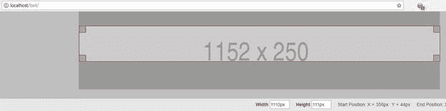
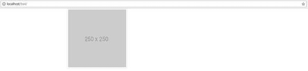
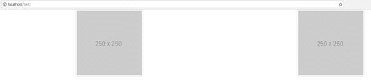
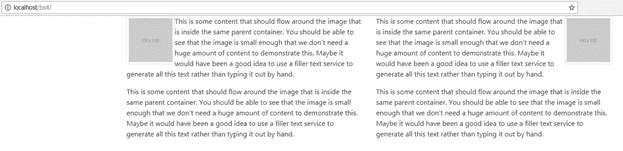
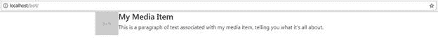
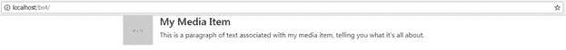
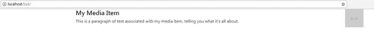
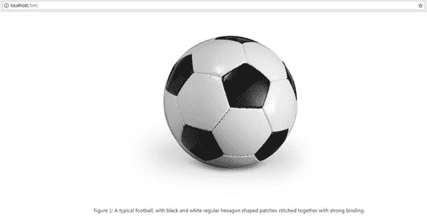

没有添加图像和图片的能力，任何网页都是不完整的。BS4 有各种各样的工具和类来帮助你定位你的图像。

因为``标签是一个块级对象，我们已经可以说，鉴于我们已经看到的行、列和网格结构，将``标签排列到常规网格上并将其放置在书写内容旁边是非常容易的。

然而，Bootstrap 甚至走得更远。它包括由`<div>`组成的预制块级结构，其唯一目的是允许您创建类似卡片的结构，或者缩略图和内容完全对齐的媒体列表。

正如我们将在本章中看到的，自举控制的图片不仅仅值一千个字——它是一生的艺术机会，能够传达您需要的任何信息。人们看着你的设计，说“哦，我看到你用了 Bootstrap”的日子已经一去不复返了

|  | 注意:Bootstrap 文档中使用的许多图像示例都使用 holder.js，可以按照 [holder GitHub 页面](https://github.com/imsky/holder)上的说明将其添加到您的项目中。然而，对于本书中的例子，我将保持简单，并使用优秀的[在线占位服务](https://placeholder.com/)。通过将看起来像[http://via.placeholder.com/350x150](http://via.placeholder.com/350x150)的网址替换成你喜欢使用的网址，你可以随意替换你喜欢使用的任何图片或其他服务。 |

我们将从 BS4 提供的响应图像类开始。BS4 首先是为移动而设计的，所以它所做的一切，都是假设你是为移动体验而设计的。对于图像，这意味着您放置在 Bootstrap 控制下的每个图像都是自动设置的，因此它会随着正在查看的显示器移动、调整和缩放。

这也意味着在许多情况下，调整图像大小并不依赖于图像标签本身，而是父容器的责任。这并不意味着图像类不重要——您仍然必须使用它们来获得最佳输出——但这确实意味着您不再需要为布局的不同部分设置特定的图像大小。在许多情况下，您可以在多个地方多次使用相同的图像，即使是在不同的大小和比例下。

然而，图像质量和尺寸仍然需要考虑，所以它不是一张完整的出狱卡。

基本响应图像类的最简单用法是一个标准的``标签，上面应用了`img-fluid`类，如代码清单 31 所示。

代码清单 31:使用响应图像类

```html
    <!-- Page content goes here -->
    <div class="container">

  <div class="row">

  <div class="col">

  

  </div>

  </div>
    </div>

```

在向您展示渲染输出之前，我想指出一件事。因为我使用的图像服务要求我为图像占位符指定一个大小，所以我不能创建小图像并让它们向上调整大小以占用父空间。如果您正在生成自己的图像，这并不是一个问题，但是向读者演示这个特性确实有点困难。

我为代码清单 31 中的例子所做的是使图像比父容器更宽(在这种情况下，只是一个标准的 BS 行被包围在一个居中的容器中)。

BS4 将尝试缩小图像的大小以适应，如图 33 所示。我在标尺模式下使用了克里斯·佩德里克的优秀的网络开发工具来显示图像的实际宽度和我要求的宽度。



图 33:代码清单 31 的输出，启用了 Web Developer 标尺来显示图像的实际宽度

从代码和输出中可以看到，我请求了一个 1152 像素宽的图像，但是收到了一个 1110 像素宽的图像。

在许多情况下，如果您没有指定任何大小，那么图像的大小将精确到可用空间。如果你只使用一个测量值，那么 BS4 将调整事物的大小，以保持比例。在代码清单 31 的例子中，我还可以显示高度已经从 250 像素降低到 242 像素，以保持所请求的大小比例。

在调整和测试尺寸时，最好尝试不同的尺寸，而不是直接选择你认为合适的尺寸。在 BS4 控制的布局中固定尺寸通常会导致你悲伤和图像尺寸错误，看起来不太合适。

为列表等制作更小的图像缩略图也非常容易；你只要用`img-thumbnail`类代替`img-fluid`类。

代码清单 32:使用图像缩略图类

```html
    <!-- Page content goes here
  -->
    <div class="container">

  <div class="row">

  <div class="col">

  

  </div>

  </div>
    </div>

```

`img-thumbnail`类和`img-fluid`类的主要区别在于，使用缩略图时，会在图像周围应用一个细边框和间距，使其看起来有吸引力。



图 33:我们应用了缩略图类的图像

边界也可以使用边界实用程序进行调整，我们将在后面的章节中介绍。您可以设置高光和颜色，并使用许多预制的圆角设置来按照您想要的方式设计框架。

通过添加`float-left`或`float-right`类，图像可以很容易地左右对齐，如下所示。

代码清单 33:对齐图像

```html
    <!-- Page content goes here
  -->
    <div class="container">

  <div class="row">
        <div class="col">

  

  

  </div>

  </div>
    </div>

```

你可能想知道为什么 BS4 选择使用`float`来完成这项任务，因为我们已经确定它始终使用 Flexbox，并且 Flexbox 中有足够多的功能来允许我们想要使用的任何类型的对齐。

答案是对齐类被设计成在父容器中对齐。因此，如果你有一个内容区，也包含图像和其他内容，并且你希望这些内容围绕图像流动，那么这项工作的最佳工具就是`float`。(这就是`float`最初的设计目的。)代码清单 34 展示了如何做到这一点。图 34 中的图像向您展示了对代码清单 33 的期望。当我们到达关于我们尚未涉及的其他实用程序类的章节时，我们将看到额外的 Flexbox 类，它们可能有助于我们在这种情况下进行调整。



图 34:使用`float`类对齐的图像

关于`float`类的最后一个注意事项:BS4 工具包已经应用了设置，因此如果您确实在它们的预期位置使用了`float`，它们实际上会在需要的地方应用诸如明确的修复之类的东西。这是为了让你不必担心`float`会打乱你的路线并造成问题。

代码清单 34:一个示例，展示了如何将对齐类与父容器中的内容一起使用，以允许文本包装图像

```html
    <!-- Page content goes here
  -->
    <div class="container">

  <div class="row">

  <div class="col-sm-6">

  

  <p>---
  Snipped ---</p>

  <p>---
  Snipped ---</p>

  </div>

  <div class="col-sm-6">

  

  <p>---
  Snipped ---</p>

  <p>---
  Snipped ---</p>

  </div>

  </div>
    </div>

```

代码清单 34 和其他包含大量文本的代码一样，用`---Snipped---`替换了文本，允许您用自己的长文本替换完整的效果。



图 35:代码清单 34 的输出，显示了与文本和图像的对齐

如果您想在没有 Flexbox 实用程序的情况下将图像居中，最快的方法是将整个``标签包装在`<div>`标签内，然后对其应用`text-center`对齐类，如前面的文本对齐部分所示。

如果您使用的是图片元素，那么您需要将 BS4 类应用于内部的``标签，而不是外部的`<picture>`标签。如果您尝试将类应用到`<picture>`标签，对齐将不会像预期的那样工作。不幸的是，这意味着如果你的图片元素中有多个``源，那么你将不得不分别标记每个源。

媒体名单很棒。好了，我说了！

今天的许多布局需要你创建某种对话或项目和缩略图风格的项目列表。BS4(和 BS3)有完成这项工作的完美工具，称为媒体列表。概念很简单:您有垂直堆叠的行，每个行都有一个小的、完全对齐的缩略图、一个标题和一个小的正文。

不幸的是，它确实需要一点嵌套来获得正确的设置，但这是一种列出各种东西的理想方式，从产品项目到网络电子邮件收件箱中的电子邮件，等等。

要创建单个媒体列表项，请在引导模板中输入以下代码。

代码清单 35:一个简单的媒体列表对象

```html
    <!-- Page content goes here
  -->
    <div class="container">

  <div class="row">

  <div class="col">

  <div class="media">

  

  <div class="media-body">

  <h4>My
  Media Item</h4>

  <p>This
  is a paragraph of text associated with my media item, telling you what it's
  all about.</p>

  </div>

  </div>

  </div>

  </div>
    </div>

```

在浏览器中渲染模板。



图 36:由代码清单 35 产生的媒体列表项

您会注意到文本被直接推到缩略图。您可以通过使用内部``标签上的 BS4 间距类之一来提高该间距。在这种情况下，我们将使用`mr-3`(我将在实用程序一章中详细介绍这一点)。

代码清单 36:一个添加了间距的简单媒体列表对象

```html
    <!-- Page content goes here
  -->
    <div class="container">

  <div class="row">

  <div class="col">

  <div class="media">

  

  <div class="media-body">

  <h4>My
  Media Item</h4>

  <p>This
  is a paragraph of text associated with my media item, telling you what it's
  all about.</p>

  </div>

  </div>

  </div>

  </div>
    </div>

```

现在重新渲染你的页面，你会看到文本和图像有更好的间距。



图 37:更好的图像间距

也可以将图像放在包含`media-body`类的`<div>`之后。这将自动将图像对齐容器的右侧。

代码清单 37:带有图像的媒体主体

```html
    <!-- Page content goes here
  -->
    <div class="container">

  <div class="row">

  <div class="col">

  <div class="media">

  <div class="media-body">

  <h4>My
  Media Item</h4>

  <p>This
  is a paragraph of text associated with my media item, telling you what it's
  all about.</p>

  </div>

         

  </div>

  </div>

  </div>
    </div>

```



图 38:图像现在是右对齐的，只需移动缩略图位置

您还可以做许多其他的事情，例如有两个图像，一个在文本的每一侧，或者将图像的底部与容器中文本的底部对齐。所有这些额外功能都是使用 Flexbox 实用程序和我们稍后将介绍的其他间距工具完成的。

通过使用 HTML5 `<figure>`和`<figurecaption>`标签，你可以给你的图像添加完全对齐的标题，让你可以正确地注释东西。

因为我们在这里又一次冒险回到语义上，并且给我们的图像增加了`alt`属性，你也应该尽可能的使用与图形相关的标签和类，这样屏幕阅读器和其他辅助技术可以更好的描述你的图像。

请记住，这个想法是为了描述你的形象，而不是告诉屏幕阅读器在屏幕上可以看到什么。虽然这看起来很容易，但比许多人意识到的要困难得多。

说“一张足球的照片”很容易，但说“一个典型的足球，用黑色和白色的正六边形补丁用强力装订缝合在一起”就难多了。在大多数情况下，使用屏幕阅读器的应用程序用户会感谢您的详细描述。

代码清单 38:使用`<figure>`和`<figcaption>`为图像添加标题

```html
    <!-- Page content goes here
  -->
    <div class="container">

  <div class="row">

  <div class="col">

  <figure>

  

  <figcaption class="figure-caption">Figure 1: A typical football, with
  black and white regular hexagon-shaped patches stitched together with strong
  binding.</figcaption>

  </figure>

  </div>

  </div>
    </div>

```

我在这个例子中使用的足球图片是在线链接的，所以为了不让任何人感到不安，你需要在代码中添加你自己的图片链接。以下是我的作品在浏览器中呈现时的外观:



图 39:我们的足球标题示例