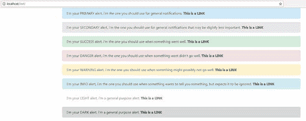
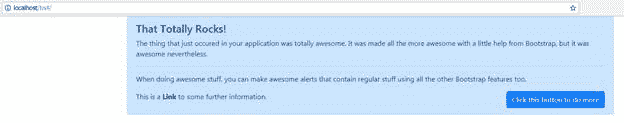
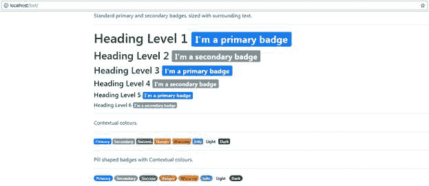
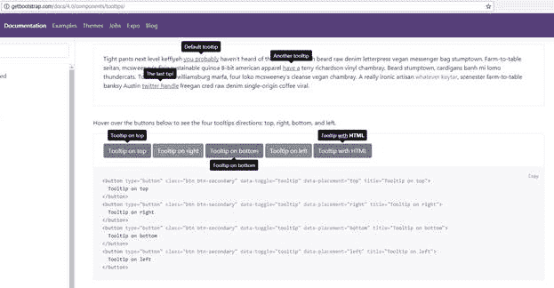
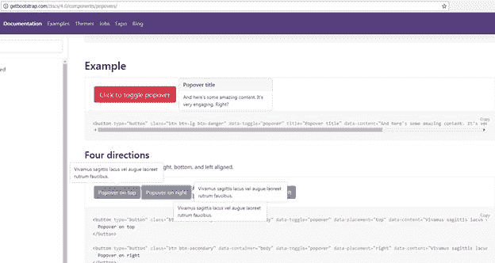

为用户提供反馈是任何网络应用程序的重要组成部分。我们将看到的第一组组件是警报、徽章、弹出窗口和工具提示。

警报很简单。它们是一个单独的`<div>`标签，附加了一个角色(因为 ARIA 的原因)和几个类名。警报本质上是一个块元素，并且会扩展以填充它们可用的空间，因此如果您需要控制它们的大小，那么您需要定制您的 CSS 和父元素来约束它们，或者您需要使用 BS4 网格系统来确保它们出现在您想要它们出现的地方。

提醒也是上下文相关的，并且使用与您在本书中看到的其他颜色相关功能相同的颜色命名。下面的 HTML 列表演示了所有不同的可用警报样式。

代码清单 45:带有内嵌链接的 BS4 警报样式

```html
    <!-- Page content goes here
  -->
    <div class="container">

  <div class="row">

  <div class="col">

  <div class="alert alert-primary" role="alert">

  I'm your PRIMARY alert, I'm the one you should use for general notifications.

  <a href="#" class="alert-link"> This is a LINK</a>

  </div>

  <div class="alert alert-secondary" role="alert">

  I'm your SECONDARY alert, I'm the one you should use for general
  notifications that may be slightly less important.

  <a href="#" class="alert-link"> This is a LINK</a>

  </div>

  <div class="alert alert-success" role="alert">

  I'm your SUCCESS alert, I'm the one you should use when something went well.

  <a href="#" class="alert-link"> This is a LINK</a>

  </div>

  <div class="alert alert-danger" role="alert">

  I'm your DANGER alert, I'm the one you should use when something didn't go
  well.

  <a href="#" class="alert-link"> This is a LINK</a>

  </div>

  <div class="alert alert-warning" role="alert">

  I'm your WARNING alert, I'm the one you should use when something might
  possibly not go well.

  <a href="#" class="alert-link"> This is a LINK</a>

  </div>

  <div class="alert alert-info" role="alert">

  I'm your INFO alert, I'm the one you should use when something wants to tell
  you something, but expects it to be ignored.

  <a href="#" class="alert-link"> This is a LINK</a>

  </div>

  <div class="alert alert-light" role="alert">

     I'm your LIGHT alert. I'm a general purpose alert.

  <a href="#" class="alert-link"> This is a LINK</a>

  </div>

  <div class="alert alert-dark" role="alert">

  I'm your DARK alert. I'm a general purpose alert.

  <a href="#" class="alert-link"> This is a LINK</a>

  </div>

  </div>

  </div>
    </div>

```

当您在浏览器中呈现代码清单 45 时，您会注意到我还在其中添加了一些锚点链接。BS4 框架提供了一种内嵌样式，专门添加到`<a>`标签中，这样您就可以将链接放在警告框中，并赋予它们与周围文本相同的外观和感觉。您不必使用这些，如果您省略它们，您将看到链接文本通常的原色(默认为蓝色)，但是使用预制样式意味着一切都将匹配并看起来很平衡。



图 45:代码清单 45 产生的警报

您可能还会在代码清单 45 中注意到，我没有使用 HTML 格式化警报中的内部内容。如果您不使用 HTML，警报仍然会被格式化为看起来正常，并且会在它周围添加一些默认填充，适合一个连续的行，该行将根据需要换行。但不一定是这样的——你可以(也许应该，取决于你的需要)使用标题、段落和其他排版功能来让你的提醒更加突出。

代码清单 46:一个相当奇特的 BS4 警告框

```html
    <!-- Page content goes here
  -->
    <div class="container">

  <div class="row">

  <div class="col">

  <div class="alert alert-primary" role="alert">

  <h4>That
  Totally Rocks!</h4>

  <p>The
  thing that just occured in your application was totally awesome. It was made
  all the more awesome with a little help from Bootstrap, but it was awesome
  nevertheless.</p>

  <hr />

  <p>When
  doing awesome stuff, you can make awesome alerts that contain regular stuff
  using all the other Bootstrap features too.</p>

  <div class="row">

  <div class="col">

             <p>This
  is a <a href="#" class="alert-link">Link</a> to some further information.</p>

  </div>

  <div class="col">

  <button class="btn
  btn-primary float-right">Click this button to do more</button>

  </div>

  </div>

  </div>

  </div>

  </div>
    </div>

```

代码清单 46 展示了一种方法，您可以向您的警报添加一些额外的标记，使它看起来功能更全面。不要担心里面那几节你还没看过的课；你很快就会看到它们的细节。图 46 显示了我们的时髦警报是什么样子的。



图 46:时髦的警告框

到目前为止，您使用警报框所做的一切都不需要使用任何 BS4 JavaScript 库。然而，警报库包括一个关闭按钮和一些额外的 JavaScript 功能，使它看起来更好。

更改代码清单 46 中的代码，使其如下所示:

代码清单 47:带有关闭图标和关闭动画的时髦警告框

```html
    <!-- Page content goes here
  -->
    <div class="container">

  <div class="row">

  <div class="col">

  <div class="alert alert-primary
  alert-dismissible fade show" role="alert">

  <button type="button" class="close" data-dismiss="alert" aria-label="Close">

  <span aria-hidden="true">&times;</span>

  </button>

  <h4>That
  Totally Rocks!</h4>

  <p>The
  thing that just occurred in your application was totally awesome. It was made
  all the more awesome with a little help from Bootstrap, but it was awesome
  nevertheless.</p>

  <hr />

  <p>When
  doing awesome stuff, you can make awesome alerts that contain regular stuff
  using all the other Bootstrap features too.</p>

  <div class="row">

  <div class="col">

  <p>This
  is a <a href="#" class="alert-link">Link</a> to some further information.</p>

  </div>

  <div class="col">

  <button class="btn
  btn-primary float-right">Click this button to do more</button>

  </div>

  </div>

  </div>

  </div>

  </div>
    </div>

```

如果您在浏览器中呈现此内容，您应该会看到警报框的右上角现在有一个小的“关闭”图标。此外，如果您单击图标，您将看到警报以相当好且简单的淡入效果关闭。

额外的功能是通过简单地将`alert-dismissible`、`fade`和`show`类添加到主警报`<div>`容器中，并使用`data-dismiss="alert"`属性添加额外的`<button>`标签来链接这两个类来提供的。`show`确保页面渲染时出现提醒，`fade`提供淡入淡出动画(两者都是可选的)。然而`dismissible`级是必需的。

|  | 注:数据-什么？HTML5 中添加的许多新东西之一是 data-xxxx 属性。当您开始使用 Bootstrap 组件，尤其是 JS 特性时，您将会越来越多地使用这些组件。本质上，数据属性是创建 HTML 标记的人将用户定义的数据添加到 HTML 标记中的一种方式。这些数据可以在以后的一些 JavaScript 代码中使用，可能是由完全不同的人编写的，以影响代码的行为。例如，设计人员可以添加此处使用的原色的名称，然后 JavaScript 程序员可以使用该名称对 JavaScript 进行编程，以便在其他地方使用该颜色。在这种情况下，Bootstrap JS 库会看到消除数据项，看到该值等于 alert，然后使用该信息来查找设置为 alert 的父元素。如果它找到了一个，它就连接了功能，允许设计者向警告框添加一个关闭特性，而不必编写任何 JavaScript。 |

当我们浏览不同的组件时，您将开始看到更多的 HTML 块被设置为使用数据属性；这是 BS4 用来让非程序员在设计中添加编程特性的主要方法。

像使用 JavaScript 库的其他组件一样，警报库也有一些调用，您可以使用它们来使警报可见或对应用程序的其他部分隐藏它。我不打算在这本书里讨论这些，因为官方文档中的解释和代码示例比我能做得更好，而且由于这本书主要是关于使用 BS4 进行造型的，我不想让它变得太复杂。

你可以在[引导网站](https://getbootstrap.com/docs/4.1/components/alerts/)找到官方文档。

徽章旨在为主要通知对象提供上下文信息。例如，基于 web 的电子邮件服务的收件箱部分的选项卡可能会显示文件夹中新邮件或未读邮件的数量。一个很好的现实例子是推特网络应用程序，在顶部导航栏的通知项目旁边有一个小数字，显示您有多少新通知。

徽章通常在`<span>`标签上内嵌使用，其大小将与周围元素的大小相匹配。有几个不同的变体，例如`Dark`和`Light`，像 BS4 提供的许多类一样，它们也有上下文颜色变体。

徽章没有可用的 JavaScript 功能(这意味着它们在不包含 Bootstrap.js 的情况下也能工作)，但是如果它们应用于其中没有内容的元素，它们就会消失。这是通过使用`:empty` CSS 选择器并在应用时将其设置为`display:none`来实现的。`:empty`只有当内部文本完全为空时才起作用，所以空格和回车等不会被认为是空的。

代码清单 48 显示了徽章的所有不同功能。

代码清单 48:展示 BS4 徽章组件

```html
    <!-- Page content goes here
  -->
    <div class="container">

  <div class="row">

  <div class="col">

  <p>Standard
  primary and secondary badges, sized with surrounding text.</p>

  <hr />

  <h1>Heading
  Level 1 <span class="badge badge-primary">I'm a primary badge</span></h1>

  <h2>Heading
  Level 2 <span class="badge
  badge-secondary">I'm
  a secondary badge</span></h2>

  <h3>Heading
  Level 3 <span class="badge badge-primary">I'm a primary badge</span></h3>

  <h4>Heading
  Level 4 <span class="badge
  badge-secondary">I'm
  a secondary badge</span></h4>

  <h5>Heading
  Level 5 <span class="badge badge-primary">I'm a primary badge</span></h5>

  <h6>Heading
  Level 6 <span class="badge
  badge-secondary">I'm
  a secondary badge</span></h6>

  <hr/>

  <p>Contextual
  colors.</p>

  <hr />

  <div>

  <span class="badge badge-primary">Primary</span>

  <span class="badge
  badge-secondary">Secondary</span>

  <span class="badge badge-success">Success</span>

  <span class="badge badge-danger">Danger</span>

  <span class="badge badge-warning">Warning</span>

  <span class="badge badge-info">Info</span>

  <span class="badge badge-light">Light</span>

  <span class="badge badge-dark">Dark</span>

  </div>

  <hr />

  <p>Pill-shaped
  badges with contextual colors.</p>

  <hr />

  <div>

  <span class="badge badge-pill
  badge-primary">Primary</span>

  <span class="badge badge-pill
  badge-secondary">Secondary</span>

  <span class="badge badge-pill
  badge-success">Success</span>

  <span class="badge badge-pill
  badge-danger">Danger</span>

  <span class="badge badge-pill
  badge-warning">Warning</span>

  <span class="badge badge-pill
  badge-info">Info</span>

   <span class="badge badge-pill
  badge-light">Light</span>

  <span class="badge badge-pill
  badge-dark">Dark</span>

  </div>

  </div>

  </div>
    </div>

```

我打算在代码清单 48 中添加一些 JavaScript 来切换内容，这样读者就可以看到没有内容的效果，但是如果我只是鼓励您进行实验，那就容易多了。将这些代码放入模板文件后，尝试移除并清空一些标签中的文本，然后刷新页面。你会看到，不仅徽章消失了，而且它原本使用的空间也坍塌了，缩小了差距。

如果在浏览器中呈现代码清单 48，应该会看到如下图所示的内容。



图 47:代码清单 48 生成的徽章组件的演示

工具提示是一些有用的小信息，通常只有一两个单词会在您将鼠标悬停在控件上或单击某种帮助按钮时出现。要在 Bootstrap 中使用它们，不仅需要 **Bootstrap.js** 文件，还需要确保加载了 **Popper.js** 。

Popovers 通常比工具提示更完整一点，有一个标题区，通常有一段文字。然而，两者在操作上非常相似。

|  | 注意:Popper.js 是一个第三方 JavaScript 库，用于管理 web 应用程序中的分层弹出窗口。BS4 使用这一点，而不是编写自己的实现，因为它有一个经过验证的记录，并且众所周知是跨平台的。你可以在[https://popper.js.org/](https://popper.js.org/)找到更多。 |

如果您回忆一下简介，最初的 BS4 模板在文件的底部包含了三行 JavaScript。

代码清单 49:我们初始模板的最后三行

```html
  <!--
  Optional JavaScript -->
    <!-- jQuery first, then
  Popper.js, then Bootstrap JS -->
     <script src="https://code.jquery.com/jquery-3.2.1.slim.min.js"
  integrity="sha384-q8i/X+965DzO0rT7abK41JStQIAqVgRVzpbzo5smXKp4YfRvH+8abtTE1Pi6jizo" crossorigin="anonymous"></script>
    <script src="https://cdnjs.cloudflare.com/ajax/libs/popper.js/1.14.0/umd/popper.min.js" integrity="sha384-cs/chFZiN24E4KMATLdqdvsezGxaGsi4hLGOzlXwp5UZB1LY//20VyM2taTB4QvJ" crossorigin="anonymous"></script>
    <script src="https://stackpath.bootstrapcdn.com/bootstrap/4.1.0/js/bootstrap.min.js" integrity="sha384-uefMccjFJAIv6A+rW+L4AHf99KvxDjWSu1z9VI8SKNVmz4sk7buKt/6v9KI65qnm" crossorigin="anonymous"></script>  

```

如代码清单 49 所示，我们包括 jQuery，然后包括 Popper.js，最后包括 Bootstrap.js 库。

如果你不打算使用工具提示和弹出窗口，那么你就不需要包含 Popper.js。

另一件你需要注意的事情是，一旦你的页面完成加载，工具提示和弹出窗口必须手工初始化。根据 BS4 文档，这是出于性能原因。然而，我从未测试过这个，在我使用它们的少数时间里，性能总是超出可接受的范围。

所有这一切意味着，在您的页面就绪功能中，无论是通过使用 jQuery 的`onReady`处理程序，还是通过使用您正在使用的任何框架提供的事件和函数，您都需要包含以下小的 JavaScript 片段来初始化任何工具提示，然后才能使用它们。

代码清单 50:初始化工具提示和弹出窗口所需的 JavaScript

```html
  $(function () {
    $('[data-toggle="tooltip"]').tooltip()
    $('[data-toggle="popover"]').popover()
  })

```

代码清单 50 展示了使用匿名函数进行工作的 jQuery 方式。如果你使用的是 Angular 或 Aurelia 这样的框架，那么你只需要中间以`tooltip`或`popover`结尾的线条。本质上，您所需要做的就是在每个具有`tooltip`或`popover`属性的 HTML5 元素上调用适当的函数。请注意，如果您使用的是框架，您不必使用代码清单 50 中所示的 jQuery 方法进行初始化。只要你能得到一个包含`data-toggle`属性的元素列表，然后在上面调用`tooltip`或`popover`函数，那也是可以的。

由于在如何做到这一点上有大量的变化，我不打算给你一个例子——我将把它留给 Bootstrap 4 文档，向你展示如何将工具提示应用到你的元素。

您可以通过以下链接找到相关的 BS4 文档:

*   [工具提示文档](https://getbootstrap.com/docs/4.1/components/tooltips/)
*   [Popovers 文档](https://getbootstrap.com/docs/4.1/components/popovers/)

这是工具提示和弹出窗口的截图，可以在 BS4 文档网站上看到。



图 48:引导文档网站上的工具提示演示



图 49:引导文档网站上的 Popovers 演示

就交互性而言，弹出窗口和工具提示的主要区别在于，工具提示会自动从元素中移除，通常是在鼠标指针移开或触发修饰事件时。波波夫将留在原地，直到被明确告知移动。

无论您选择哪种方式，在元素上显示它们在这两种情况下都是一样的。

工具提示设置`data-toggle`等于`tooltip`，popovers 设置为`popover`。

要设置内容，设置工具提示的`title`属性，设置弹出窗口的`data-content`。

工具提示和弹出窗口都使用等于`top`、`bottom`、`left`或`right`的`data-placement`来确定它们出现的位置。请记住，您必须以适合您正在使用的框架或页面设计的方式手工初始化 JavaScript。

还有一些其他不常用的选择；如果你对它们感兴趣，你需要的一切都可以在文档中找到。