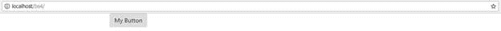
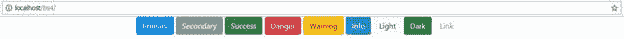
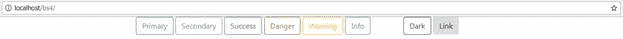
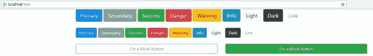
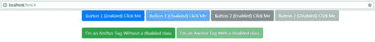
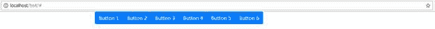
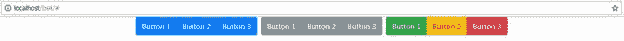
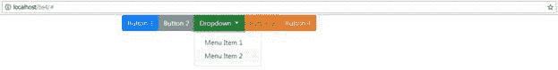
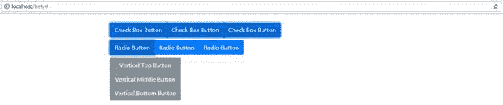

如果没有某种形式的按钮可以点击，一个 web 应用程序就不会太好。按钮允许你执行动作，选择选项，或者在某些情况下，做不可描述的事情——历史上的每个恶棍都有一个大红色的按钮。

不管你有按钮的原因是什么，BS4 都有足够的多样性来让最狂躁的点击者保持快乐，并且和所有其他可用的组件一样，它也提供了上下文相关的颜色和明暗变化。

创建按钮最简单的方法是将`btn`类应用于块级元素。

您也可以将该类应用于锚点标签和内联元素，但是为了获得最佳效果，按钮应该始终与 HTML5 语义`<button>`标签一起使用。

|  | 注意:按钮还是锚？许多使用 HTML5 的人使用标准的 |

你能生产的最简单的按钮如下。

代码清单 51:你能产生的最基本的按钮

```html
    <!-- Page content goes here
  -->
    <div class="container">

  <div class="row">

  <div class="col">

  <button type="button" class="btn">My Button</button>

  </div>

  </div>
    </div>

```

渲染时，您应该会看到一个简单的灰色按钮，带有您提供的任何标题。



图 50:最简单的按钮

不过，增加`btn`类并不是全部。为了应用上下文颜色，您添加了一个修饰符类，如代码清单 52 所示。

代码清单 52:添加了修饰符类的简单按钮

```html
    <!-- Page content goes here
  -->
    <div class="container">

  <div class="row">

  <div class="col">

  <button type="button" class="btn
  btn-primary">Primary</button>

  <button type="button" class="btn
  btn-secondary">Secondary</button>

  <button type="button" class="btn
  btn-success">Success</button>

  <button type="button" class="btn
  btn-danger">Danger</button>

  <button type="button" class="btn
  btn-warning">Warning</button>

  <button type="button" class="btn
  btn-info">Info</button>

  <button type="button" class="btn
  btn-light">Light</button>

  <button type="button" class="btn
  btn-dark">Dark</button>

  <button type="button" class="btn
  btn-link">Link</button>

  </div>

  </div>
    </div>

```

代码清单 52 显示了可以添加到按钮中的不同上下文颜色。在 Chrome 中，您应该会看到每种类型，如下所示。



图 51:带有上下文颜色的简单按钮

在图 51 中，可以看到最后一个按钮被标记为**链接**按钮。这里的想法是允许你使用常规的语义按钮标签，但是让它们看起来像标准的锚点链接。预期用途是将它们放在表行中，作为激活记录操作的控件，或者作为对话框和警报中的帮助链接。但是请记住:颜色只是颜色。因为这是用一个额外的类设置的，屏幕阅读器不会发现按钮是危险的或者可能导致不必要的动作。有了按钮，你**必须**添加 ARIA 角色(`role="button"`)和替代文本之类的东西，这样屏幕阅读器才能帮助它的用户。您还应该为按钮添加适当的制表符顺序，并允许它们可聚焦；这将允许使用键盘上的 Tab 键或箭头键在应用程序中正确移动。

事实上，使用`<button>`标签进行这种交互的一大好处是你不必自己编码。没有什么能阻止你在 T2 标签上使用 T1 类。毕竟，这两个元素都是块级元素，在文档中呈现时它们看起来完全一样，但是从根本上来说，除非您添加大量额外的 JavaScript 代码，并确保您虔诚地正确设置选项卡顺序，否则您将无法像使用按钮时那样专注和导航控件。

如果您不想要填充按钮，那么您可以使用`btn-outline-xxxx`修改器类来代替您在代码清单 52 中使用的标准上下文颜色。`xxxx`应该替换为您想要使用的上下文名称，如代码清单 53 所示。

代码清单 53:大纲上下文按钮样式

```html
    <!-- Page content goes here
  -->
    <div class="container">

  <div class="row">

  <div class="col">

  <button type="button" class="btn
  btn-outline-primary">Primary</button>

  <button type="button" class="btn
  btn-outline-secondary">Secondary</button>

  <button type="button" class="btn
  btn-outline-success">Success</button>

  <button type="button" class="btn
  btn-outline-danger">Danger</button>

  <button type="button" class="btn
  btn-outline-warning">Warning</button>

  <button type="button" class="btn
  btn-outline-info">Info</button>

  <button type="button" class="btn
  btn-outline-light">Light</button>

  <button type="button" class="btn
  btn-outline-dark">Dark</button>

  <button type="button" class="btn
  btn-outline-link">Link</button>

  </div>

  </div>
    </div>

```

在浏览器中，您的按钮应该变成如图 52 所示。



图 52:简单的按钮改变为使用轮廓上下文颜色

有三个修改器类可以调整按钮大小:`btn-lg`、`btn-sm`和`btn-block`。`lg`和`sm`将改变大小，但将保持按钮宽度，使其大小符合文本。另一方面，使用`block`，将使按钮扩展到填充其父容器的宽度。如果您使用本书开头显示的灵活网格来控制按钮的布局，那么`btn-block`是一个非常好的修饰符，因为它将确保您的按钮适应各种容器在响应屏幕大小变化时所适应的任何响应宽度。

代码清单 54:不同的按钮尺寸

```html
    <!-- Page content goes here
  -->
    <div class="container">

  <div class="row">

  <div class="col">

  <button type="button" class="btn
  btn-primary btn-lg">Primary</button>

  <button type="button" class="btn
  btn-secondary btn-lg">Secondary</button>

  <button type="button" class="btn
  btn-success btn-lg">Success</button>

  <button type="button" class="btn
  btn-danger btn-lg">Danger</button>

  <button type="button" class="btn
  btn-warning btn-lg">Warning</button>

  <button type="button" class="btn
  btn-info btn-lg">Info</button>

  <button type="button" class="btn
  btn-light btn-lg">Light</button>

  <button type="button" class="btn
  btn-dark btn-lg">Dark</button>

  <button type="button" class="btn
  btn-link btn-lg">Link</button>

  <br/><br/>

  <button type="button" class="btn
  btn-primary btn-sml">Primary</button>

  <button type="button" class="btn
  btn-secondary btn-sml">Secondary</button>

  <button type="button" class="btn
  btn-success btn-sml">Success</button>

  <button type="button" class="btn
  btn-danger btn-sml">Danger</button>

  <button type="button" class="btn
  btn-warning btn-sml">Warning</button>

  <button type="button" class="btn
  btn-info btn-sml">Info</button>

  <button type="button" class="btn
  btn-light btn-sml">Light</button>

  <button type="button" class="btn
  btn-dark btn-sml">Dark</button>

  <button type="button" class="btn
  btn-link btn-sml">Link</button>

  <br/><br/>

  <div class="row">

  <div class="col"><button class="btn
  btn-outline-primary btn-block">I'm a Block Button</button></div>

  <div class="col"><button class="btn
  btn-success btn-block">I'm a Block Button</button></div>

  </div>

  </div>

  </div>
    </div>

```

如果您将代码清单 54 中的代码作为主体代码放入模板中，并将其加载到浏览器中，它应该会产生以下输出。



图 53:代码清单 54 产生的不同按钮大小

当你玩按钮时，你应该注意到它们有不同的视觉风格，这取决于按钮的状态。例如，当你点击一个时，它会变得稍微暗一点，并有一个内部阴影。

通常这些都是由 BS4 内部处理的，但是有时您需要让您的按钮看起来像是从应用程序代码中点击的。您可以通过将`active`类添加到按钮的类列表中来实现。不要忘记，如果您确实添加了类，最好添加 ARIA 角色`aria-pressed=”true”`属性，以便屏幕读者知道它被标记为被按下。

您也可以通过添加`disabled`属性使按钮看起来被禁用。当你在一个标准的按钮标签上使用它时，它不仅给了你 BS4 禁用的按钮样式，而且它也在物理上禁用了该按钮，这意味着它不会触发任何事件。

不幸的是，`disabled`属性在`<a>`标签上不起作用，所以如果你使用带有按钮样式的锚点来激活东西，那么添加`disabled`属性不会有任何效果。相反，你需要做的是将`disabled`类添加到`<a>`标签中，然后你需要在你的程序代码中采取措施来防止点击锚被执行。如何做到这一点完全取决于您在应用程序中使用的框架和代码，但通常只涉及从事件处理程序返回`false`。

代码清单 55:显示按钮禁用的样式

```html
    <!-- Page content goes here
  -->
    <div class="container">

  <div class="row">

  <div class="col">

  <button type="button" class="btn
  btn-primary" onclick="alert('You
  clicked button 1')">Button 1 (Enabled) Click Me</button>

  <button type="button" class="btn
  btn-primary" onclick="alert('You
  clicked button 1')" disabled>Button 1 (Disabled) Click Me</button>

  <button type="button" class="btn
  btn-secondary" onclick="alert('You
  clicked button 2')">Button 2 (Enabled) Click Me</button>

  <button type="button" class="btn
  btn-secondary" onclick="alert('You
  clicked button 2')" disabled>Button 2 (Disabled) Click Me</button>

  <br /><br />

  <a href="igosomewhere" class="btn
  btn-success">I'm
  an Anchor Tag Without a disabled class</a>

  <a href="igosomewhere" class="btn
  btn-success disabled" onclick="return false;">I'm an Anchor Tag With a disabled
  class</a>

  </div>

  </div>
    </div>

```

代码清单 55 显示了一个将按钮标记为禁用的例子。我在`<a>`标签上添加了一个简单的`onclick`，让它返回`false`，这样它的点击就被有效地禁用了。点击第一个`<a>`标签会给你一个 404 错误(除非你的系统中有一个名为 IGO Haus 的文件)。如果您将两个链接中的`href`属性更改为另一个页面，您将看到它们的行为与禁用按钮相同。我展示的方法在普通的 JavaScript 中工作，但是在您决定如何在框架中使用按钮或`<a>`标签之前，请阅读本章前面关于使用按钮或`<a>`标签的注释。



图 54:禁用的按钮样式

在许多网站或页面设计中，您可能需要一组按钮，例如，在工具栏或某种描述的菜单上。BS4 有适当的样式和类，不仅允许您在这样做时保持一致性，还允许您设置一个控件，该控件的行为方式与一组单选按钮的行为方式非常相似(其中只能选择一个)。

按钮组对于应用程序用户界面的许多方面来说都很棒，因为您可以用它们来制作可重用的组件。有了像 Aurelia 或 Angular 这样的框架，您可以将整个按钮选项板放在一起，然后将它们作为单个控件重用。

您也可以使用输入控件对按钮进行分组，例如，通过向搜索字段添加搜索按钮。我们将在表单一章中看到更多相关内容。

基本组是通过将一组`<button>`标签包装在一个`<div>`标签中，然后将类`btn-group`应用于`<div>`来创建的。像往常一样，您还应该在外部标签上放置正确的 ARIA 属性，以便辅助技术正确处理它。

代码清单 56:一个基本的按钮组

```html
    <!-- Page content goes here
  -->
    <div class="container">

  <div class="row">

  <div class="col">

  <div class="btn-group" role="group" aria-label="A group of buttons">

  <button type="button" class="btn
  btn-primary">Button
  1</button>
            <button type="button" class="btn
  btn-primary">Button
  2</button>

  <button type="button" class="btn
  btn-primary">Button
  3</button>

  <button type="button" class="btn
  btn-primary">Button
  4</button>

  <button type="button" class="btn
  btn-primary">Button
  5</button>

  <button type="button" class="btn
  btn-primary">Button
  6</button>

  </div>

  </div>

  </div>

  </div>

```

代码清单 56 显示了一个包含六个按钮的基本水平组。每个按钮彼此独立，但格式看起来像一个单元，如图 55 所示。



图 55:基本的 BS4 按钮组

按钮也可以通过将多个按钮组`<div>`标签包装在一个外部`<div>`标签中而组合成一个工具栏，该标签应用了一个`btn-toolbar`类。这允许您创建按钮组链，同时仍然保持它们作为一个功能单元。如果您使用一些间距实用程序，您还可以在组之间保持良好、平衡的间距。

代码清单 57 演示了如何做到这一点。

代码清单 57:BS4 按钮工具栏的演示

```html
    <!-- Page content goes here
  -->
    <div class="container">

  <div class="row">

  <div class="col">

  <div class="btn-toolbar" role="toolbar" aria-label="An example of a button toolbar">

  <div class="btn-group mr-2" role="group" aria-label="First Button Group">

  <button type="button" class="btn
  btn-primary">Button
  1</button>

  <button type="button" class="btn
  btn-primary">Button
  2</button>

        <button type="button" class="btn
  btn-primary">Button
  3</button>

  </div>

  <div class="btn-group mr-2" role="group" aria-label="Second Button Group">

  <button type="button" class="btn
  btn-secondary">Button
  1</button>

        <button type="button" class="btn
  btn-secondary">Button
  2</button>

  <button type="button" class="btn
  btn-secondary">Button
  3</button>

  </div>

  <div class="btn-group" role="group" aria-label="Third Button Group">

    <button type="button" class="btn
  btn-success">Button
  1</button>

  <button type="button" class="btn
  btn-warning">Button
  2</button>

  <button type="button" class="btn
  btn-danger">Button
  3</button>

  </div>

  </div>

  </div>

  </div>
    </div>

```

同样，ARIA 的角色非常重要，因为屏幕阅读器会简单地宣布所有这些都是单个独立的按钮，这可能会让屏幕阅读器感到困惑，或者在最坏的情况下，因为“有太多的事情发生”而拒绝辅助用户。



图 56:代码清单 57 生成的按钮工具栏

按钮还可以附加下拉菜单(您将在下一章中看到更多)；但是，如果要将带有下拉菜单的按钮添加到按钮组中，则必须嵌套两个包含它们的按钮组。

代码清单 58:包含带有下拉菜单的按钮的嵌套按钮组

```html
    <!-- Page content goes here
  -->
    <div class="container">

  <div class="row">

  <div class="col">

  <div class="btn-group" role="group" aria-label="Button group with nested drop-down">

  <button type="button" class="btn
  btn-primary">Button
  1</button>

  <button type="button" class="btn
  btn-secondary">Button
  2</button>

  <div class="btn-group" role="group">

  <button id="demoDropdown1" type="button" class="btn
  btn-success dropdown-toggle" data-toggle="dropdown" aria-haspopup="true" aria-expanded="false">

  Dropdown

  </button>

  <div class="dropdown-menu" aria-labelledby="demoDropdown1">

  <a class="dropdown-item" href="#">Menu Item 1</a>

  <a class="dropdown-item" href="#">Menu Item 2</a>

  </div>

  </div>

  <button type="button" class="btn
  btn-warning">Button
  3</button>

  <button type="button" class="btn
  btn-danger">Button
  4</button>

  </div>

  </div>

  </div>
    </div>

```

您需要将您想要使用的每个下拉菜单包装在其自己的嵌套`<button>`组中，而您所有的常规按钮组成员都保留在最外面的`<button>`组标签中。

嵌套可能会变得有点复杂，所以我建议您谨慎使用下拉菜单。如果你正在考虑将它们用于导航系统，BS4 有一个更好的组件。



图 57:代码清单 58 生成的带有嵌套下拉列表的按钮组

所有常用的大小和颜色子类在按钮组中的工作方式相同，就像它们在常规按钮中的工作方式一样，因此您可以显示禁用的按钮或颜色按钮，并将它们设置为不同的大小。

您也可以将`btn-group`类更改为`btn-group-vertical`，以便您的按钮从上到下堆叠，而不是从左到右内联运行。

如果您还将`btn-group-toggle`添加到您的外部`<div>`，然后使用复选框标记您的按钮，您的按钮组将以与一行复选框相同的视觉方式工作。使用单选按钮来标记内部控件可以使您获得一个按钮组，一次只能选择一个选项。

代码清单 59:复选框、单选按钮和垂直按钮组示例

```html
    <!-- Page content goes here
  -->
    <div class="container">

  <div class="row">

  <div class="col">

  <br />

  <div class="btn-group
  btn-group-toggle" data-toggle="buttons">

  <label class="btn btn-primary
  active">

  <input type="checkbox" checked autocomplete="off">Check Box Button

  </label>

  <label class="btn btn-primary">

  <input type="checkbox" autocomplete="off">Check Box Button

  </label>

  <label class="btn btn-primary">

  <input type="checkbox" autocomplete="off">Check Box Button

  </label>

  </div>

  <br />

  <div class="btn-group
  btn-group-toggle" data-toggle="buttons">

  <label class="btn btn-primary">

  <input type="radio" autocomplete="off">Radio Button

  </label>

  <label class="btn btn-primary">

  <input type="radio" autocomplete="off">Radio Button

       </label>

  <label class="btn btn-primary
  active">

  <input type="radio" checked autocomplete="off">Radio Button

  </label>

  </div>

  <br/>

  <div class="btn-group-vertical" role="group" aria-label="Vertical Buttons">

  <button type="button" class="btn
  btn-secondary">Vertical
  Top Button</button>

  <button type="button" class="btn
  btn-secondary">Vertical
  Middle Button</button>

  <button type="button" class="btn
  btn-secondary">Vertical
  Bottom Button</button>

  </div>

  </div>

  </div>
    </div>

```

代码清单 59 展示了如何将复选框、单选按钮和垂直按钮组合在一起。请注意，我们可以通过添加`active`类来标记组中预选的任何项目。在复选框和单选按钮的情况下，它被添加到具有`checked`属性的同一元素中，因此在提交可能包含它们的表单时，您可以提交正确的值。BS4 将不会为你处理**而不是**的`checked`属性——它唯一会改变的是按钮上的样式。如果您希望更改底层控件的`checked`属性，那么您需要自己添加所需的代码，使用您的框架或一些标准的 JavaScript。

代码清单 59 应该会生成一个类似于图 58 的页面。



图 58:由代码清单 59 产生的复选框、单选按钮和垂直组

我们将把按钮这个主题留在这里，继续讨论其他一些特性。按钮还可以做更多的事情——它们有很多 JavaScript 功能，并且可以附加到数据属性上，以自动打开对话框、菜单和许多其他东西。

超越这一点意味着阅读[官方文件](https://getbootstrap.com/docs/4.1/components/buttons/)。