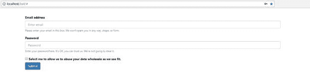
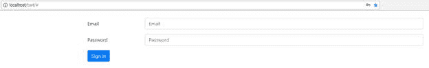
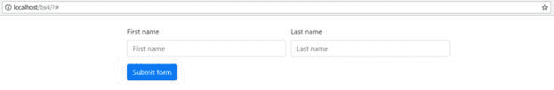
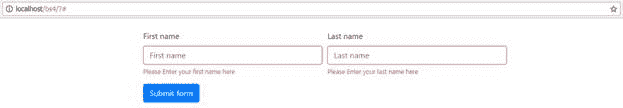

BS4 中唯一没有太大变化的是表单组件。使用标准 HTML5 `<form>`和`<input>`标签并在元素级别设置它们的样式，而不是添加额外的类，这仍然是在表单上使用 BS4 的最基本方式。

实际上，为了充分利用 BS4 的表单，您至少需要使用`form-group`、`form-control`和`form-text`类。通过为真正简单的表单这样做，您可以确保您的输入和它们相关联的标签彼此正确关联，更重要的是，它们很容易与验证助手一起设计样式，并且对使用它们的各种 ARIA 角色属性的辅助技术有意义。

在 BS4 中使用这些基类可以产生的最基本的形式如下所示:



图 70:一个非常基本的形式

在这种格式中，标签位于输入之上，使用`form-group`类将输入包装在`<div>`中，以及它们各自的标签，并且使用`form-help`的`<span>`或其他内联元素放置在`<input>`元素之下以提供帮助文本。

生成表单的代码非常简单。

代码清单 70:图 70 所示的基本表单的标记

```
    <!-- Page content goes here
  -->
    <div class="container">

  <div class="row">

  <div class="col">

   <br />

  <form>

  <div class="form-group">

  <label for="email">Email address</label>

  <input type="email" class="form-control" id="email" aria-describedby="emailHelp" placeholder="Enter email">

  <small id="emailHelp" class="form-text
  text-muted">Please
  enter your email in this box. We won't spam you in any way, shape, or form.</small>

  </div>

  <div class="form-group">

  <label for="password">Password</label>

  <input type="password" class="form-control" id="password" aria-describedby="passwordHelp" placeholder="Password">

  <small id="passwordHelp" class="form-text
  text-muted">Enter
  your password here. It's OK, you can trust us. We’re not going to steal it.</small>

  </div>

  <div class="form-check">

  <input type="checkbox" class="form-check-input" id="confirm">

  <label class="form-check-label" for="confirm">Select me to allow us to abuse your
  data wholesale as we see fit.</label>

  </div>

  <button type="submit" class="btn
  btn-primary">Submit</button>

  </form>

  </div>

  </div>
    </div>

```

代码清单 70 中有几件事需要注意。首先，请注意属性的标签与分配给输入控件的实际标识值相同。这不是 BS4 的东西，而是 HTML5 的东西，让辅助技术知道哪个标签属于哪个控件。

如果您不想在表单上使用标签，那么您仍然应该在您的 HTML 中创建标签标签，但是通过使用`sr-only`类来隐藏它们。在属性中的其他类上添加此类作为最终类，将有效地在浏览器呈现过程中隐藏您的标签，但仍允许辅助技术告诉用户输入字段代表什么。

第二件需要注意的是输入控件上的`aria-describedby`属性。同样，像标签一样，它的值是组中另一个元素的标识。然而，这一次是类为`form-text`的内联元素的标识，如果存在的话，屏幕阅读器将使用它向用户提供额外的上下文相关描述。

最后要注意的是复选框的顺序和复选框控件的标签。为了使标签正确呈现，标签必须始终跟随输入。这是 HTML 的一个限制，不是 BS4 中的任何东西。

BS4 表单的最大变化是它们提供的布局可能性，这要归功于 BS4 现在使用的弹性箱优先策略。

如果我们用`col` `<div>` s 将代码清单 70 剥离回仅输入一行中的元素，我们可以轻松实现以下输出。


图 71:使用列水平排列的输入

我们可以使用所有基于网格的类，如`col`、`col-md-*`、`form-groups`内外的`row`，以及自己的纯旧输入元素。

然而，真正改变的地方是产生水平形式。

在 Bootstrap 的早期版本中，存在用于水平对齐表单的特定类。现在，您所需要做的就是在您的`<div>`中添加一个额外的`row`类来形成`form-group`，然后根据需要在标签和输入元素上使用基于`col`的类来划分内部空间。例如:

代码清单 71:一个小的改变使得水平表单变得容易

```
    <!-- Page content goes here
  -->
    <div class="container">

  <div class="row">

  <div class="col">

  <br />

  <form>

  <div class="form-group row">

  <label for="email" class="col-sm-2
  col-form-label">Email</label>

  <div class="col-sm-10">

  <input type="email" class="form-control" id="email" placeholder="Email">

  </div>

  </div>

  <div class="form-group row">

  <label for="password" class="col-sm-2
  col-form-label">Password</label>

  <div class="col-sm-10">

  <input type="password" class="form-control" id="password" placeholder="Password">

  </div>

  </div>

  <div class="form-group row">

  <div class="col-sm-10">

  <button type="submit" class="btn
  btn-primary">Sign
  in</button>

  </div>

  </div>

  </form>

  </div>

  </div>
    </div>

```

这与 BS3 形成了鲜明的对比，BS3 包含了一个与代码清单 71 中显示的一般结构有点不同的 HTML 结构，以及一些类名更改。在 BS4 中，根据屏幕或设备的大小和方向，表单在水平布局和垂直布局之间切换要容易得多。

当使用您的 BS4 模板呈现时，代码清单 71 应该会产生以下输出。



图 72:水平形式现在容易多了

如果在网格上拆分表单时使用`col-auto`而不是`col`，您可以让控件只使用绘制控件及其内容所需的空间。如果您直接在表单的`<form>`标签上使用`form-inline`类，这将非常方便，这将迫使您的整个表单沿着一条线运行。(当您将表单添加到导航栏时，这正是 navbar 表单在内部所做的事情。)

除了布局的可能性之外，添加`disabled`、`readonly`和 HTML5 规范中定义的各种新类型将使 BS4 做出适当的反应，并根据需要设置表单元素的样式，以便在呈现时以只读、禁用或两种状态显示它们。

可能有点令人震惊的最后一个变化是验证助手。

在 BS3 中，您向实际的`<form>`元素或包含表单组的`<div>`元素添加了各种类，如`has-error`、`has-warning`等。

虽然这些在 BS4 中仍然存在，但现在推荐的方法是使用 HTML5 验证应用编程接口。随着四个新类的使用，一切都由 BS4 为您处理——您不再需要像使用 BS3 那样在许多地方开始添加和删除许多类。

看看下面的 HTML 代码。

代码清单 72:使用 HTML5 验证的 BS4 表单

```
    <!-- Page content goes here
  -->
    <div class="container">

  <div class="row">

  <div class="col">

  <br />

  <form class="needs-validation" novalidate>

  <div class="form-row">

  <div class="col-md-4 mb-3">

  <label for="firstName">First name</label>

  <input type="text" class="form-control" id="firstName" placeholder="First name" required>

  <div class="valid-feedback">That's great thanks</div>

  <div class="invalid-feedback">Please enter your first name here</div>

  </div>

     <div class="col-md-4 mb-3">

  <label for="lastName">Last name</label>

  <input type="text" class="form-control" id="lastName" placeholder="Last name" required>

  <div class="valid-feedback">That's great thanks</div>

  <div class="invalid-feedback">Please enter your last name here</div>

  </div>

  </div>

  <button class="btn
  btn-primary" type="submit">Submit form</button>

  </form>

  </div>

  </div>
    </div>

```

请注意，它主要只是一个标准的 BS4 表单布局，使用表单行、组和带有标签的输入类型。

看看开头的`<form>`标签。请注意添加到其中的`needs-validation`类，以及`novalidate`属性。

添加`novalidate`属性是为了阻止浏览器在首次加载表单时尝试对表单应用常规的 HTML5 验证。`needs-validation`类告诉 BS4 **不要**设置任何输入元素或组的样式，或者激活任何验证状态。这意味着表单第一次加载时看起来像下图。



图 73:首次加载时代码清单 72 中的 BS4 表单

这里没有什么特别令人惊讶的，但是如果您现在将`<form>`标签上的类从`needs-validation`更改为`was-validated`，然后按 **F5** 重新加载您的表单，现在应该是这样的:



图 74:代码清单 72 中的 BS4 表单，在父表单上改变了单个类

这一更改告诉 BS4，您现在已经验证了表单，它现在必须显示不同的样式，以指示验证中存在失败。请注意，不同的颜色会自动工作。例如，如果您在其中一个框中键入内容，您将看到验证状态随着输入字段下方的文本而改变。

此外，您不必像以前在 BS3 下那样手动更改任何类来实现这一点。相反，Bootstrap 已经使用 HTML5 Validation API 查询了输入控件，如果您查看使用的两个输入文本框，您会看到它们具有`required`属性。

这里发生的事情是你在表单上设置`novalidate`属性，这样 HTML5 验证 API 允许你点击**提交**按钮。在您的**提交**按钮处理程序中，您将在 JavaScript 中手动检查状态，如果您的验证不满意，您将把表单上的 CSS 类更改为`was-validated`，让 BS4 为您完成剩下的繁重工作。

如果您查看输入下面的`<div>`元素，您会看到它们每个都有两个`<div>`元素:一个带有`valid-feedback`类，一个带有`invalid-feedback`类。如果表单通过验证，有效的反馈元素将被取消隐藏，无效的反馈元素将被隐藏。如果验证失败，则执行相反的操作，并显示无效的反馈元素。

一个合适的 JavaScript 函数可能看起来像下面的代码清单(直接取自 [BS4 文档](https://getbootstrap.com/docs/4.1/components/forms/))。

代码清单 73:一个处理 BS4 表单验证的小 JavaScript 函数

```

  <script>

  (function() {

  'use strict';

  window.addEventListener('load', function() {

  var forms = document.getElementsByClassName('needs-validation');

  var validation =
  Array.prototype.filter.call(forms, function(form)
  {

  form.addEventListener('submit', function(event) {

  if (form.checkValidity() === false) {

        event.preventDefault();

  event.stopPropagation();

  }

  form.classList.add('was-validated');

  }, false);

  });

  }, false);

  })();

  </script>

```

在页面加载时，我们使用 jQuery `ready`处理程序来运行一个小例程，该例程查找并向页面中具有`needs-validation`类的每个表单附加一个处理程序。这个处理程序拦截表单的`submit`调用，这样当表单提交时，它就停止提交。只有当 HTML5 验证应用编程接口中的`checkValidity`告诉它表单没有无效元素时，例程才会反转该块并允许表单提交。

这样做的好处是，如果 JavaScript 被禁用，标准表单提交过程仍会按预期工作，但不会发生验证。

当然，您可以在这里添加任何您喜欢的验证机制，并使用任何您想要的验证方法。重要的是表单的验证状态被报告为有效或无效，并且`<form>`标签上的类根据需要被更改。

同样，还有更多要看的，所以和前几章一样，我鼓励你去 BS4 文档中的[表单文档](https://getbootstrap.com/docs/4.1/components/forms/)并从那里继续。