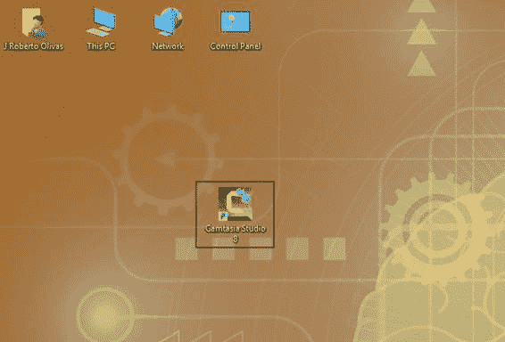
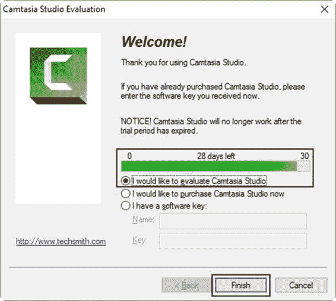
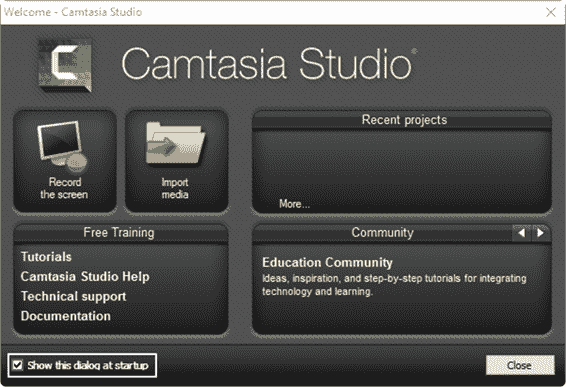
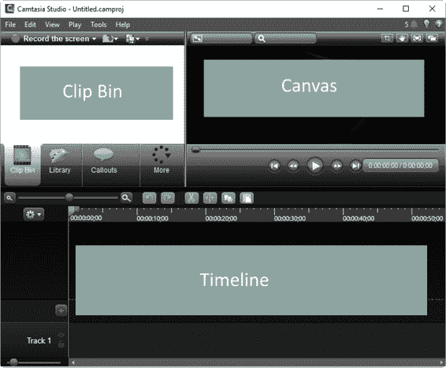
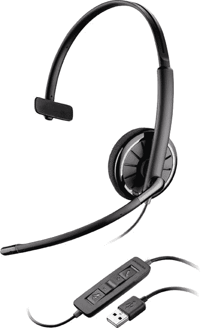

# 三、启动 Camtasia

要启动 Camtasia，请点按电脑桌面上的 Camtasia 图标。

图 9:计算机桌面上的 Camtasia 图标

如果安装了 Camtasia 的试用版，将出现以下对话框。

图 10: Camtasia 评估对话框

图 10 所示的对话框告诉用户 Camtasia 正在评估模式下运行。在这种情况下，如果用户没有提供有效的许可证密钥，对话框会指示程序可以再执行 28 天。

要继续使用该程序，用户应该购买该软件，并通过点击对话框中的**我有一个软件密钥**选项来输入适当的许可证密钥。当用户这样做时，“名称”和“密钥”的文本条目将被启用，以允许输入正确的数据。然后，要激活程序，用户应点击对话框底部的**完成**。

|  | 注意:购买 Camtasia 后，必须有互联网连接才能激活它。 |

就本书而言，将采用该计划的评估版本。所以留下**我想评估 Camtasia Studio** 选项选择，然后点击**完成**开始使用 Camtasia。

现在程序将显示以下对话框。

图 11: Camtasia 欢迎对话框

Camtasia 欢迎对话框(如图 11 所示)为用户提供了程序中通常执行的任务、最近创建的所有项目的列表，以及从中获得免费培训和想法的最相关的站点。

这个对话框对于新手用户来说是一个有用的工具，因为它只需点击几下就可以开始使用软件。此外，用户可以从一个地方访问许多有用的培训内容。

如果不想执行对话框的任何任务，点击右下方的**关闭**按钮，将显示 Camtasia 用户界面。

为了避免每次 Camtasia 启动时都显示欢迎对话框，您可以取消选中位于屏幕左下角的**启动时显示该对话框**复选框。

## camtasia 用户界面

Camtasia 的主窗口是用户使用软件进行大部分工作的地方，如下图所示。

图 12: Camtasia 的主窗口。

Camtasia 的主窗口被称为 Camtasia 编辑器界面。该界面有三个主要区域，如图 12 所示:

*   剪辑库:这是用户存储他们计划在 Camtasia 项目中使用的所有素材的地方。剪辑库有额外的选项卡，这些选项卡提供了添加到视频的效果选项。
*   画布:这是视频编辑的视觉预览。这也是用户可以与 Camtasia 提供的附加效果和选项进行交互的地方，例如资产库。
*   时间线:这是安排所有视频剪辑、效果和其他媒体序列的地方，以便组合和编辑将要制作的视频。时间线中的每个元素都位于独立的轨道中，可以单独编辑。

在开始第一次视频录制之前，有一些建议应该考虑在内，以便创建高质量的材料，清楚地传达其中讨论的主题。

建议您完全清除桌面上的所有图标，以免录制时分心。如果计算机有两个显示器，您可以将所有图标从主显示器移到辅助显示器。清理桌面的另一种方法是选择所有图标并将其拖到回收站。然后，当录制完成时，您可以将它们恢复到桌面。

另外要考虑的是桌面壁纸。彩色壁纸会分散你对目标的注意力。

图 13:建议用于视频录制的桌面

图 13 显示了视频录制计算机显示器上的建议桌面。可以注意到，没有彩色壁纸，也没有图标。

要解决的一个重要问题是计划视频录制。最好的方法是写剧本。脚本可以帮助用户组织他们想要包含在视频中的所有内容，并确保叙事中使用的语言准确简洁。下表显示了由 TechSmith 的人制作的脚本文档的建议结构。

表 2:视频脚本建议结构。

| [脚本标题]【简述准备录制场景需要做的事情。] |
| 步骤 | 屏幕上的操作 | 叙述 |

如前表所述，脚本文档应以标题开始，标题将定义录制视频的原因。然后，应该有一个段落描述录制场景和准备它必须做的所有事情。最后，建议您创建一个表格，列出视频录制过程中要执行的所有步骤，并进行编号。该表应包含三列:

*   步骤:从 1 开始的顺序数字，表示视频中每个动作的顺序。
*   屏幕上的动作:对观看视频时屏幕上应该发生的事情的描述。
*   旁白:描述旁白应该说什么的段落，以便在观看视频时听到。

建议你和负责视频录制的团队所有成员分享剧本。强烈建议进行一次演练性视频录制。

|  | 注意:完整的脚本文档将在下一章中讨论，它解释了如何进行屏幕录制。 |

为了获得更好的声音，建议使用 USB 麦克风。它可以是桌面或耳机麦克风，但通用串行总线永远是首选。

尽管大多数 USB 麦克风允许您配置降噪，但请注意周围的一切。为了获得最佳的音频效果，请远离嘈杂的热风扇、开关门和其他干扰噪音。

图 14:耳机 USB 麦克风

本章讨论了如何开始使用 Camtasia。用户应该单击计算机桌面上的 Camtasia 图标来运行软件。

使用 Camtasia 试用版时，软件启动前会显示一个对话框。该对话框告诉用户在程序变为非活动状态之前还有多少天。该对话框允许您输入有效的许可证密钥，以便在购买后激活软件。

每次 Camtasia 启动时，都会显示“欢迎”对话框。此对话框为用户提供了程序中通常执行的任务，对于新手用户可能很有用。要禁用欢迎对话框，取消选中【启动时显示该对话框】选项。

Camtasia 的主窗口是用户使用软件最多的地方。该窗口包含三个主要区域:剪辑库、画布和时间线。

在开始第一次视频录制之前，有四个基本建议可以遵循，以创建高质量的视频。第一个是移除电脑桌面上的所有图标。第二种方法是在桌面上放一张普通的壁纸，以避免分心。第三，也可能是最重要的一点，就是写一份录音计划作为脚本文档。最后，为了获得最好的音频，使用一个 USB 麦克风，远离嘈杂的地方。