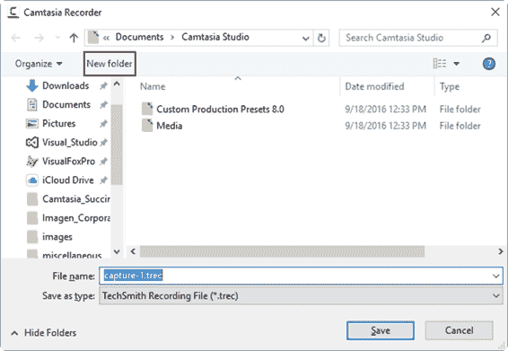

这本书里解释的练习相当于电脑的屏幕记录。这一章涵盖了这个主题的基础知识。最后，将创建一个关于如何使用闹钟应用程序的小视频教程。

正如第 3 章所建议的，应该创建一个脚本文档，以便为视频录制制定计划。下表显示了警报和时钟应用教程的脚本。

表 3:闹钟和时钟教程脚本

| 闹钟和时钟窗口应用视频教程请通读整个脚本，以熟悉您将在本活动中完成的操作。此外，在开始录制之前，打开**报警&时钟**窗口应用程序，并在屏幕中心调整其大小和位置。 |
| 步骤 | 屏幕上的操作 | 叙述 |
| one | 警报和时钟应用程序显示在屏幕中央。 | 大家好，欢迎来到这个关于如何使用闹钟应用程序的视频教程。 |
| Two | 鼠标指针位于应用程序主窗口的中心。 | 首先，我们可以注意到应用程序主窗口顶部的工具栏。这个工具栏有四个按钮。 |
| three | 鼠标指针放在工具栏的报警按钮上。 | 这个工具栏的第一个按钮叫做报警。如您所见，这是当前选择的按钮。你可以看出来，因为按钮下面有一条蓝线，按钮本身是用蓝色画的。 |
| four | 鼠标指针停留在报警按钮上。 | 当选择此按钮时，我们可以设置一个或多个警报，当满足特定的时间条件时，这些警报将被触发。 |
| five | 移动鼠标指针，以便将它放在应用程序窗口右下角的加号上。然后，在旁白结束时，应该单击按钮。 | 让我们注意位于应用程序窗口右下角的加号。这个按钮允许我们添加和设置一个新的警报。现在，点击这个按钮会出现以下屏幕。 |
| six | 新警报屏幕出现在应用程序的窗口中。默认情况下，报警时间选择早上 7 点。 | 这是“新警报”应用程序的屏幕。这是我们要设置要添加的警报的地方。 |
| seven | 鼠标指针放在旁白提到的每一个标签的**报警名称**、**重复**、**声音**和**打盹时间**上。 | 闹钟需要一些数据来设置闹钟。应用需要的要素有:一个在应用中识别报警的名称，可以在**报警名称**标签下输入；重复的时间跨度，可以设置为只触发一次或在某个特定的星期几；报警时播放的声音，可在**声音**标签下方选择；和打盹时间，在此之后，警报将持续触发，直到用户停止它。 |
| eight | 讲述人点击警报名称条目，同时解释将使用应用程序建议的默认时间。 | 对于本教程，将使用应用程序建议的默认时间。也就是说，我们将设置一个在早上 7 点触发的警报。在本教程中，我们将该警报命名为**自定义警报**。我们将在位于**警报名称**标签下方的条目中输入该名称。 |
| nine | 鼠标指针放在位于“新警报”屏幕右下角的磁盘图标上。 | 我们将按照应用程序的建议保留其他数据条目。现在，我们将单击位于屏幕右下角的磁盘图标来保存警报。 |
| Ten | 将显示应用程序的主窗口，以及其中的“自定义警报”定义。 | 如您所见，新的警报定义现在出现在屏幕上。就这样——我们已经使用闹钟和时钟窗口应用程序设置了一个闹钟。 |

上表中显示的脚本应该保存在自己的文件中，作为记录资产的一部分。当然，该文件将在 Camtasia 之外，不会作为媒体资产库的一部分显示。

根据本章上一节显示的脚本，在屏幕录制之前，报警和时钟应用程序应该放在屏幕的中央。所以屏幕应该如下图所示。

图 15:屏幕中央的报警和时钟应用程序

从上图中可以看到，电脑桌面上没有图标。这避免了对视频制作者和未来观众的干扰。

要开始屏幕录制，第一步是调出 Camtasia 屏幕录制程序。这可以通过点击位于 Camtasia 主窗口左上角的**录制屏幕**来完成。

图 16:Camtasia 主窗口中的“录制屏幕”按钮

点击该按钮后，Camtasia 的主窗口将最小化，Camtasia 屏幕记录器将显示在屏幕的右下角。此外，将在整个屏幕周围绘制一个绿色虚线矩形，指示程序将记录的区域。

|  | 注意:调出 Camtasia 屏幕记录器不会开始任何实际录制。单击录制按钮(或 F9 热键)开始。 |

图 17:屏幕录制边界矩形

默认情况下，Camtasia 屏幕录制器将录制边界设置为整个屏幕。这可以使用记录仪中的“选择区域”选项进行自定义。

图 18: Camtasia 屏幕记录器和“选择区域”选项面板

上图突出显示了“选择区域”面板。这是可以设置屏幕录制边界的地方。位于“全屏”选项底部的蓝点表示将记录整个屏幕。

要指定整个屏幕以外的录制区域，点击录制程序的**自定义**按钮。此操作将弹出一个上下文菜单，其中包含所有可用的自定义选项。

图 19:自定义区域选项上下文菜单

如上图所示，自定义上下文菜单提供了三个选项组，并在最后提供了两个独立的选项。自定义选项组包括:

*   **宽屏(16:9)** :包含所有可用于创建 16:9 视频的屏幕区域(以像素分辨率计)。
*   **标准(4:3)** :包含所有可用于创建 4:3 标准视频的屏幕区域(以像素分辨率计)。
*   **最近区域**:包含所有最近用于录像的区域。

|  | 注:视频质量和屏幕区域取决于机器中的图形适配器。 |

除了上下文菜单中显示的选项组，还有两个独立的选项可用:

*   **锁定应用程序**:告诉屏幕记录器，记录边界将与当前活动应用程序的边界相同(屏幕记录器不被视为活动应用程序)。
*   **选择要记录的区域**:允许用户选择屏幕上要记录的部分。

在本练习中，点击**选择区域记录**。之后，鼠标指针应该放在闹钟&应用程序的左上角。完成后，屏幕将如下图所示。

图 20:选择“选择要录制的区域”选项后屏幕的一般视图

当鼠标指针放在应用程序上时，屏幕记录器自动选择其窗口边界，并在它们周围放置一个绿色矩形，建议将这些边界作为记录区域。此外，屏幕左上角会显示一个放大镜。当我们在屏幕上移动鼠标指针时，这个放大镜将帮助您准确地看到鼠标指针在像素级的位置。最后，屏幕顶部会显示一张黑白贴纸。此标签显示了完成“选择要记录的区域”任务应遵循的一系列指导。

图 21:屏幕顶部的方向标签

上图显示了位于屏幕顶部的方向。以下选项可用于选择要录制的区域:

*   **点击选择高亮区域**:当用户点击其边界时，选择高亮区域作为记录区域。
*   **点击并拖动选择一个区域**:要选择不同于建议的区域，用户应该在这些边界之外点击并拖动鼠标指针，直到选择了所需的区域，然后松开鼠标按钮。
*   **按 Esc** :取消“选择区域录制*”*任务。

在本练习中，单击突出显示的区域，将报警和时钟应用程序设置为记录区域。

图 22:选择作为记录区域的报警和时钟应用程序

如图 22 所示，在选择了要记录的区域后，一个绿色的虚线矩形被绘制在报警和时钟应用程序窗口的边界周围。此外，一个指针放在选定的区域上，指示这个区域的中心。现在，屏幕记录器的“选择区域”面板在“自定义”按钮下显示蓝点，“自定义”按钮旁边的“尺寸”条目显示区域的宽度和高度。

图 23:显示所选记录区域尺寸的屏幕记录器

录制前的下一步是设置可用于工作的音频选项。这可以通过使用位于**录制输入**选项面板中的**音频**按钮来完成。默认情况下，屏幕录制器使用窗口的默认录制设备打开音频录制。因此，假设默认的录音设备是将用于录音的麦克风，此时，除了使用位于“音频”按钮右侧的滑块调整麦克风的音量之外，似乎没什么可做的了。但是还有一些事情需要考虑:一个叫做“录制系统音频”的音频选项也是由屏幕录制器打开的。此选项允许计算机播放的所有声音与麦克风的输入一起录制。在某些情况下，如果我们打开这个选项，没有问题，但有时需要抑制系统播放的所有声音，除了麦克风的输入。

出于本练习的目的，我们将关闭系统音频录制。为此，点击**音频**，将出现一个上下文菜单。

图 24:音频选项上下文菜单

如图 24 所示，选中“录制系统音频”选项，表示该选项已打开。我们应该点击菜单选项来关闭它。之后，上下文菜单将消失。

要开始视频录制，点击位于屏幕录制器窗口右侧的 **rec** ，或按下 **F9** 热键。无论哪种方式，屏幕都将如下图所示。

图 25:点击 **rec** 或按 F9 热键后开始录屏。

图 25 显示了 Camtasia 屏幕记录器如何开始工作。首先，我们可以看到一组四个绿色的角被放置在记录区域的界限内。这些角落充当向导，告诉用户只有在这些边界内执行的动作才会被记录下来。当然，这包括鼠标指针的移动。此外，在录制区域的中央会显示一个横幅窗口，上面有图例“按 F10 停止录制”。该窗口有两个目的:首先，它指示用户如何停止录制作业(在这种情况下，通过按下 F10 热键)，其次，它将显示屏幕录制开始时刻的倒计时。

图 26:屏幕录制前的倒计时

如图 26 所示，在录制作业开始之前，会显示三秒倒计时。之后，横幅会消失，开始录制。

|  | 提示:建议使用两个插入计算机的监视器，以便在主监视器上进行实际录制时，在第二个监视器上显示录制脚本。 |

要停止录像，我们要按下 **F10** 热键。之后，会显示一个预览窗口，我们的录制材料会自动播放。这个窗口有一系列控件，允许我们操作记录的结果。我们可以播放整个录音，跳到开头或结尾，或者选择如何处理录音输出。

图 27:预览窗口

图 27 显示了预览窗口。有三个突出显示的区域指向窗口中的一组特定控件:

1.  录制时间和缩小以适合按钮:显示录制的总时间，并允许您调整视频大小以适合整个窗口。
2.  录制导航控件:允许您完整播放录制内容、跳到录制内容的开头或结尾。
3.  录制输出操作:允许您选择如何处理录制输出。我们可以在编辑器窗口中保存录制和编辑，直接制作特定格式的视频，或者删除录制的材料以执行新的工作。

在这种情况下，我们将点击**保存并编辑**将录音保存到磁盘，并在 Camtasia 编辑器中进行编辑。

点击**保存并编辑**后，将出现 Camtasia 记录仪文件保存窗口。

图 28: Camtasia 文件保存窗口

默认情况下，Camtasia 屏幕记录器使用 **Documents\Camtasia Studio** 文件夹保存文件。为了保持文件的正确组织，我们将为这个练习创建一个单独的文件夹，并将其称为**警报 _ 教程**。然后，我们将把记录的材料保存在一个名为 **alarmstutorial.trec** 的文件中。完成后，屏幕录制器将关闭，录制文件将显示在 Camtasia 编辑器窗口中。

图 29: Camtasia 编辑器窗口，剪辑库中有录制文件和时间线

上图显示了剪辑库中和时间线中的 Camtasia 编辑器窗口和**alarm tutorial . trec**文件。现在，我们准备开始与卡姆塔西亚项目合作。

本章介绍了屏幕录制的基础知识。最后，我们创建了一个关于如何使用闹钟应用程序的小视频教程。根据第 3 章的建议，使用脚本文档作为视频录制的计划。我们还在录制前将闹钟应用程序放在屏幕的中央。之后，我们使用程序主窗口中的“录制屏幕”按钮来执行 Camtasia 屏幕录制器。

在开始工作之前，我们使用 Camtasia 屏幕录制器的“选择区域”和“音频”按钮来设置录制边界和音频选项。在本练习中，我们使用了“选择区域”的“自定义”按钮来指示报警和时钟应用程序的窗口将是要使用的记录边界。我们还使用了音频按钮来抑制系统播放的所有声音的录制。

我们使用 F9 热键开始屏幕录制。之后会出现一个横幅窗口，指示可以通过按下 F10 热键来停止录制。该窗口还显示三秒倒计时，以指示录制何时开始。

录制作业完成后(按下 F10 热键)，预览窗口将显示录制输出。录制作业的素材保存在名为**alarm tutorial . trec**的文件中。