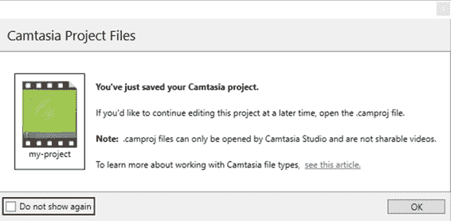
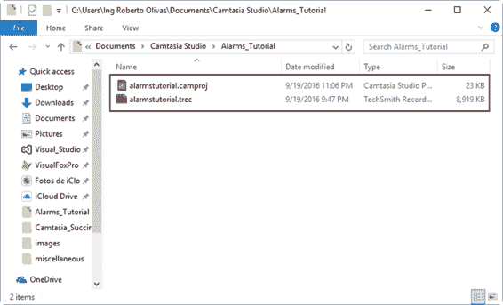

# 五、Camtasia 文件和项目

在前一章中，我们记录了一个关于闹钟应用程序的小视频教程，使用了计算机屏幕的输出。然后这个练习的记录材料被保存在一个名为**alarm tutorial . trec**的文件中。该文件被称为录音，对于 Camtasia，它被视为媒体文件。然而，媒体文件只是完整视频制作的一部分。为了制作一个完整的视频，可能需要几个媒体文件，为了在这件事上取得成功，Camtasia 需要将这些文件组织到一个地方:一个项目文件。

Camtasia 项目是一个媒体文件，它引用了完整视频制作中包含的所有其他媒体文件。每当用户需要处理这些媒体文件时，他或她应该打开项目文件。每个项目文件都以. camproj 文件扩展名保存。

在 Camtasia 项目中，其他常见的媒体文件类型包括:

*   TechSmith 录音(。trec 文件):这些文件包含屏幕视频、麦克风音频、网络摄像头和网络摄像头录像。此外，这些是多平台文件。这意味着它们可以在 Windows 的 Camtasia 和 Mac 的 Camtasia 中使用。
*   图像(。巴布亚新几内亚。jpeg 等。):用作标题幻灯片或其他视觉效果。
*   音频(。wav、. mp3 等。):用作背景音乐，或包含在卡姆塔西亚以外录制的叙述。

默认情况下，Camtasia 使用 **Documents\Camtasia Studio** 文件夹保存任何媒体文件。这种行为可以改变，但就本书而言，它将保持不变。

当我们处理项目时，建议我们为每个项目创建一个单独的文件夹。该文件夹将包含制作视频所需的所有媒体文件。

参加第 4 章的练习，在保存**警报教程. trec** 文件之前，创建了一个名为**警报教程**的文件夹。现在我们将使用这个文件夹来保存项目文件，该文件将保存制作闹钟&时钟视频教程所需的所有媒体文件。我们将命名文件**alarm tutorial . camproj**。

保存项目文件后，Camtasia 会显示一个如下图所示的窗口。

图 30:卡姆塔西亚项目文件窗口

此时，Camtasia 正在告诉我们一个项目文件已经保存，但是没有办法在程序本身之外打开这个文件。也就是说，该文件不是可共享的视频。消息还说，每次我们需要编辑项目保存的任何媒体文件时，都应该打开文件。

熟悉 Camtasia 后，勾选位于窗口左下角的**不再显示**复选框，可以防止该窗口显示。点击**确定**关闭该窗口。

现在，如果我们查看 Alarms_Tutorial 文件夹，可以看到几个文件:一个文件对应于录音(。trec)，另一个是 Camtasia 项目文件(。camproj)。当项目需要任何其他文件时，应该将其保存到此文件夹中，以便保持所有项目材料的正确组织。

图 31:警报教程项目的文件夹

Camtasia 项目是一个媒体文件，它引用了完整视频制作中包含的所有其他媒体文件。每个项目文件都以. camproj 文件扩展名保存。在 Camtasia 项目中，其他常见的媒体文件类型包括 TechSmith 录音(。trec 文件)、图像(如。巴布亚新几内亚和。jpg 文件)和音频文件。

默认情况下，Camtasia 使用 **Documents\Camtasia Studio** 文件夹来保存任何媒体文件，但是当我们处理项目时，建议我们为每个项目创建一个单独的文件夹。制作视频所需的所有媒体文件都应保存到此文件夹中，包括项目文件。还应考虑到项目文件本身不是视频，项目文件仅用于保存所有视频媒体文件。