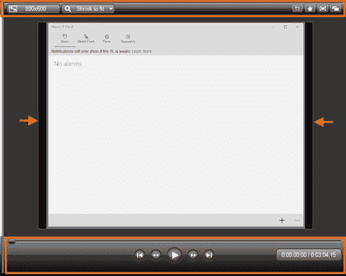

# 六、Camtasia 编辑器

本章将给出关于 Camtasia 编辑器的一般说明。如第 3 章所述，Camtasia 编辑器是应用程序的主窗口，有三个主要区域:剪辑库、画布和时间线。卡姆塔西亚编辑器是我们制作最终视频的必要工作场所。

剪辑库是存储我们计划在 Camtasia 项目中使用的所有录音和其他媒体类型的地方。

图 32:带闹钟教程的剪辑箱

图 32 显示了剪辑库，并指向剪辑库选项卡。这些选项卡为我们提供了向视频项目添加效果或其他媒体元素的选项:

*   **剪辑库**:指向剪辑库本身。当我们选择此选项卡时，将显示作为项目一部分的所有文件。
*   **库**:选择此页签时，显示资产库元素。该库包含我们可以添加到项目中的不同媒体类型。
*   **标注**:当我们选择这个选项卡时，我们可以向我们的项目添加形状和文本，以便可视化地传达关于它的信息。
*   **缩放-n-平移**:我们使用这个选项卡来添加缩放和平移动画，以增强我们项目的视觉体验。
*   **音频**:如果我们想为项目提高音频质量，应该选择这个选项卡。
*   **转场**:当我们选择这个选项卡时，它显示了一系列可以添加到我们项目中的转场效果。
*   **更多**:此选项卡显示一个菜单，其中包含可以添加到项目中的附加效果。当我们从菜单中选择这些附加效果中的一个时，它会被放置在前一个标签位置。这是“过渡”选项卡所在的位置。

图 33:更多标签上下文菜单

画布是我们在编辑时放置视频的视觉预览的地方。画布还可用于预览项目可用的所有媒体资源，并使用鼠标指针直接排列视频项目元素。

显示**警报教程. trec** 记录时的画布视图如图 34 所示。

图 34:带有 alarmstutorial.trec 录制文件预览的画布

上图中突出显示的区域指向画布控件。这些控件用于以多种方式操作当前显示的媒体。显示的箭头指向显示边界标记，它是一个单行矩形。这些边界告诉我们，当播放我们制作的视频时，观众会看到什么。

#### 放大和缩小

我们可以使用**缩放尺寸**组合框来改变画布中显示输出的缩放尺寸。如前图所示，当显示媒体类型的内容时，“画布”会自动将缩放大小设置为“缩小以适合”也就是说，内容被缩放以适合窗口。

图 35:画布缩放大小组合框及其选项

图 35 显示了缩放大小组合框的可用选项。请注意，“收缩以适合”选项已选中，因为这是画布的默认行为。改变缩放尺寸很容易:我们只需从菜单中选择所需的尺寸选项。

|  | 提示:也可以通过单击视频边界标记外的画布并滚动鼠标滚轮来更改缩放大小。 |

#### 浏览显示的媒体

我们可以使用控制条在预览的媒体周围移动。这个栏中有七个元素可以帮助我们完成这项任务:

图 36:画布控制栏。

1.  滑块:我们可以使用位于此栏上的滑块按钮沿着预览媒体的整个内容移动。要做到这一点，我们应该点击这个按钮，并把它拖到酒吧的末尾或开始。
2.  转到开始按钮:这将带我们进入预览媒体的开始。
3.  后退按钮:这将在预览媒体时向后移动我们，精度为 1/100 秒。
4.  播放/暂停按钮:播放或暂停预览的媒体。
5.  前进按钮:这将在预览媒体时向前移动我们，精度为 1/100 秒。
6.  转到结束按钮:这将带我们到预览媒体的结尾。
7.  时间刻度:显示预览媒体的位置，相对于预览媒体总长度的时间。

时间线是组装项目的地方。在这里，我们将所有项目元素放入我们希望在制作的视频中看到的序列中。每个项目元素都位于时间轴中一个名为“轨道”的单独位置。每次我们添加一个轨道，时间轴将其命名为**轨道 n** ，其中 **n** 是一个连续的整数，从 1 开始。

时间线中可以放置的轨道数量没有限制。同样，轨道没有特定的媒体类型，这意味着任何轨道都可以容纳视频、音频、图像或任何其他可用效果。此外，对于项目的媒体元素的放置顺序没有限制。但是，这个顺序定义了媒体在制作的视频中是如何排列的。这种行为被称为堆叠顺序，将在本书后面解释。

时间线向您显示制作的视频何时显示每个项目元素，以及每个元素将保留多长时间。

图 37:卡姆塔西亚编辑器时间线

图 37 显示了包含一个轨道的时间线。此外，它还指出了做这项工作的一些重要因素。

*   **时间线控制栏**:包含一系列界面元素，允许我们编辑放置在其中的每个轨道。此外，放置缩放控件是为了提高或降低规则中显示的时间精度。
*   **时间线播放头**:允许我们移动到项目元素中，直到某个精确的时刻。我们也可以使用播放头来选择元素的片段，以便执行操作，例如剪切或复制。
*   **时间轴水平规则**:以时间为单位显示刻度，精度为 1/100 秒。我们可以拖移播放头，并将其放在规则上所需的时间位置，画布将显示项目元素序列中对应于该时刻的帧。

在下一章中，我们将使用时间轴学习一些视频编辑基础知识。

卡姆塔西亚编辑器是我们制作最终视频所需工作的地方，它有三个主要区域:剪辑库、画布和时间线。

剪辑库是存储我们计划在 Camtasia 项目中使用的所有录音和其他媒体类型的地方。剪辑库有一系列选项卡，允许我们向视频项目添加效果或其他媒体元素。

画布是我们在编辑时放置视频的视觉预览的地方。它还可以用来预览所有可用的媒体资源，并使用鼠标指针排列视频项目元素。画布有一系列控制来执行某些操作，如放大或缩小显示的输出，或在预览的媒体中移动。

时间线是组装项目的地方。所有项目元素都以在制作的视频中查看的相同顺序位于此处。每个项目元素都位于一个名为“轨迹”的位置。轨道可以容纳任何媒体类型，如视频、音频、图像或任何其他效果。一个项目可以添加无限数量的轨道。

时间线向您显示制作的视频何时显示每个项目元素，以及每个元素将保持显示多长时间。