本章将使用时间线中可用的元素解释视频编辑的一些要点。

在第四章中，我解释了如何利用电脑屏幕的输出进行录制。最后，我们保存了一个关于闹钟应用程序的小视频教程。后来，我们将这个录制文件添加到一个名为**alarm tutorial . camproj**的 Camtasia 项目中。

如果您在 Camtasia 编辑器中打开此项目，时间线中将显示包含屏幕录制的单个轨道。我们可以看到，当录音保存到磁盘时，Camtasia 屏幕录像机将音频和视频放在一个通道中。这看起来很实用，但是如果我们想编辑录音，我们将同时处理视频和音频，并且存在潜在事故的风险。

幸运的是，我们可以通过单击操作在屏幕录制中将音频与视频分开。首先，我们应该右键单击包含录音的时间线轨道，以便显示轨道上下文菜单。

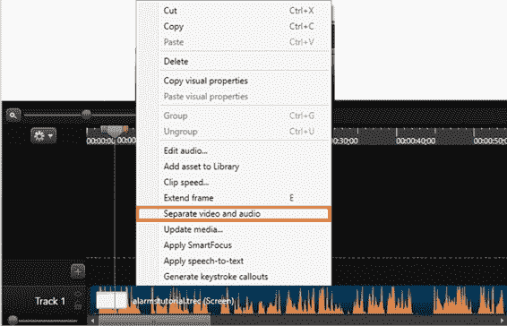

图 38:轨迹上下文菜单

要执行视频和音频分离，我们需要单击位于上下文菜单中的**分离视频和音频**选项。该选项在图 38 中突出显示。

现在，Camtasia 编辑器中的时间线应该如下图所示。

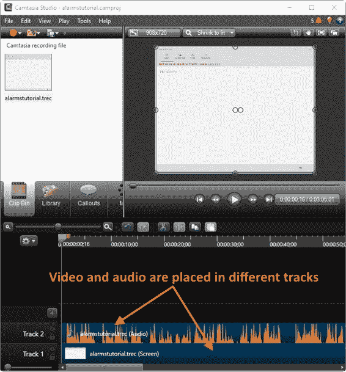

图 39:屏幕录制视频和音频分离后的时间线。

如图 39 所示，屏幕录制的视频和音频现在放在不同的轨道上。

如前一章的时间线部分所述，播放头是时间线的元素，允许我们移动到轨道内的精确时刻。播放头还将帮助我们选择轨道内容的部分，以便执行编辑操作。

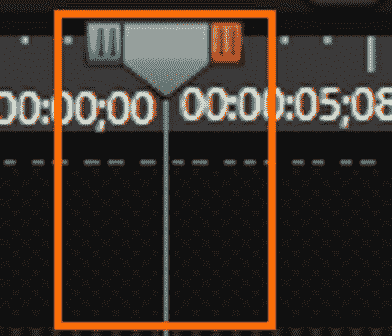

图 40:播放头

图 40 显示了位于轨道内特定时刻的播放头。播放头的开头和结尾有两个按钮。绿色按钮称为“输入”按钮，红色按钮称为“输出”按钮。

“输入”按钮允许我们选择轨道内容的一部分，从播放头所在的点开始，到位于该位置左侧的特定时刻结束。当播放头位于时间线的开头时，“输入”按钮不可见。

“出”按钮执行与“入”按钮相同的操作，但方式相反。这意味着选择在当前播放头位置右侧的特定时刻结束。

进行选择时，播放头的垂直灰色线会分开，表示选择的边界。

要将播放头移动到轨道内的某个精确时刻，我们应该点按灰色按钮(播放头本身)，并将其拖到标尺上所需的位置。

首先，确保警报教程项目( **alarmstutorial.camproj)** 已打开。接下来，将播放头放在对应于 00:00:02 的位置；08 秒(注意 Camtasia 使用分号分隔分钟和秒)。要使这变得更容易，请单击时间线控制栏上的**放大**。

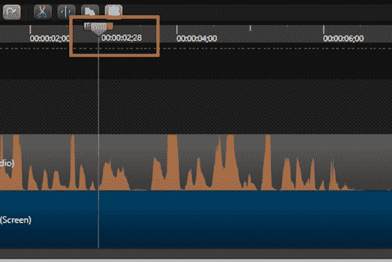

图 41:00:00:02 中的播放头；28 秒位置

现在，点击**退出**并将其拖动到**00:00:03；29** 位置。请注意，拖动按钮时会出现工具提示标签。此工具提示标签显示所选内容的结束位置和持续时间。要结束操作，请释放鼠标按钮。时间线应该如下图所示。

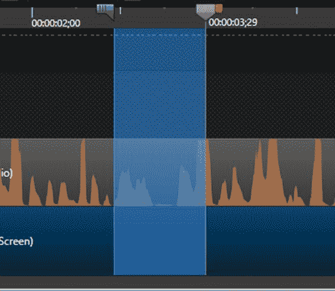

图 42:用播放头做出的选择

上图的蓝色透明区域界定了轨道的选定部分。播放头的“入”按钮指示开始位置，播放头本身显示选定部分的结束位置。

有两种方法来播放选择。首先是通过按空格键热键。二是在画布控制栏点击**播放**。

播放头也可以用来清除之前所做的选择。有两种方法可以完成这项任务:

*   在中双击**:在这种情况下，清除选择后，播放头将被放置在清除的选择的起点。**
*   双击**退出**:在这种情况下，清除选择后，播放头会保留在清除的选择的结束点。

|  | 注意:进行部分选择时，如果我们将“输入”按钮拖到当前播放头位置之后的某个时间点，则会自动排列“输入”和“输出”按钮。 |

在本节中，我们将删除轨道中不必要的部分。在这种情况下，要删除的部分对应于轨道 2，它包含项目的音频。为此，我们将从以下步骤开始:

1.  将播放头带到**00:00:00；00** 位置(时间轴的开始)。
2.  将**退出**按钮向上拖动至**00:00:01；01** 位置。

现在选择了要删除的部分，如图 43 所示。

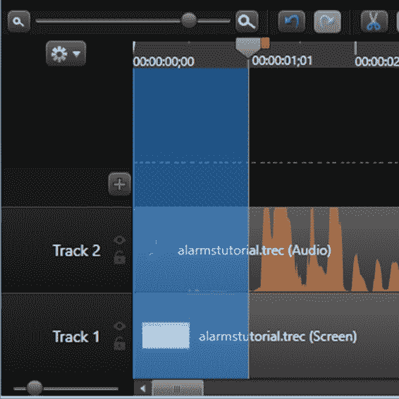

图 43:要删除的轨道部分

在这一点上，完成这个动作似乎很容易。点击**剪切**会删除选中的部分，但是有一个小问题。

此时，先前所做的选择将应用于项目中的所有轨道。因此，如果我们点击**剪切**，不仅轨道 2 的选定部分将被删除，而且选择区域下所有轨道的该部分也将被删除。

Camtasia 提供了一种机制来处理这种情况:轨道锁定。项目中的每个轨道都可以受到保护，以避免对其内容进行更改。要做这个操作，我们需要点击**锁定**，在每个曲目名称的右边找到。

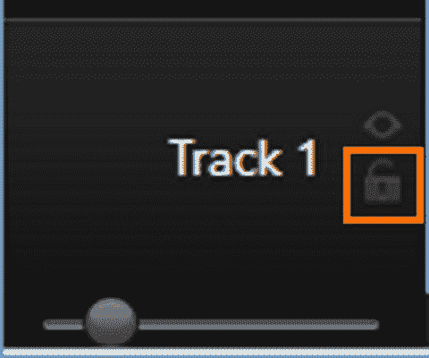

图 44:锁定按钮

之后，我们应该点击**剪切**来移除不需要的轨迹部分。现在，时间线如下图所示。

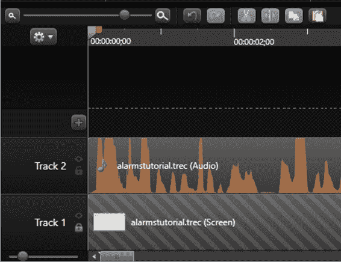

图 45:剪下选区后的时间线。

如图 45 所示，轨道 2 的选定部分不再存在，轨道 1 保持不变。此外，所有轨道 2 内容都自动移动到时间线的开头。

|  | 提示:为避免意外，建议锁定项目中除需要编辑的轨道外的所有轨道。 |

有时，为了获得对放置在轨道上的媒体的更多控制，分割轨道的内容是有用的。让我们考虑 00:00:05 之间的时间线部分；13 和 00:00:06；第二跑道 21 号。这一部分对应于叙述过程中的一个沉默的瞬间。也许还是把这一段从轨道上剪下来，处理两个不同的旁白片段比较好。因此，我们可以通过分别处理这些部分来获得更好的结果。

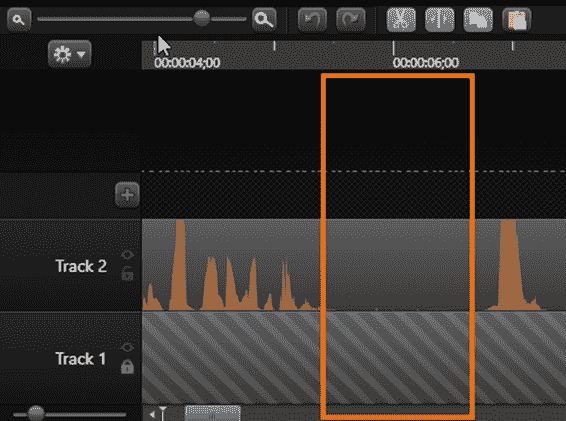

图 46:轨道 2 中的寂静时刻

要移除轨道 2 中的静默时刻，我们将把播放头放在**00:00:05；13** 位置。然后，我们将右键单击播放头，以显示播放头的上下文菜单。菜单显示后，我们将选择**分割所有**选项。

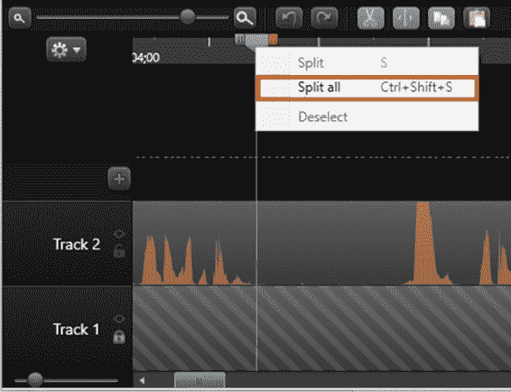

图 47:播放头上下文菜单中的“全部分割”选项

此时，轨道 2 的音频被分成两个独立的部分。现在，我们将播放头的**出**按钮向上拖到**00:00:06；21** 位置。然后，我们将通过点击**剪切**来移除所选部分。之后，点击位于时间线控制栏中的**分割**。

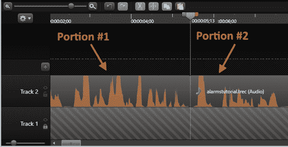

图 48:轨道 2 的音频被分割

现在，如图 48 所示，轨道 2 的无声时刻已经被删除，音频被分成两个独立的部分。

在前一节中，我们讨论了如何分割轨道的内容。本练习的结果是将音频的两个独立部分放在轨道 2 中。本节的目的是处理这些部分，以便解释如何在轨道内拖动孤立的元素。

为了完成本练习，我们将执行以下步骤:

1.  首先，鼠标指针应该放在位于轨道 2 的第二个音频部分上。
2.  现在，我们将点击音频部分并将其向上拖动到**00:00:06；22** 位置。

由于执行了前面的步骤，两个音频选项之间会有一个间隙，现在这个间隙将创建上一节中删除的无声时刻。

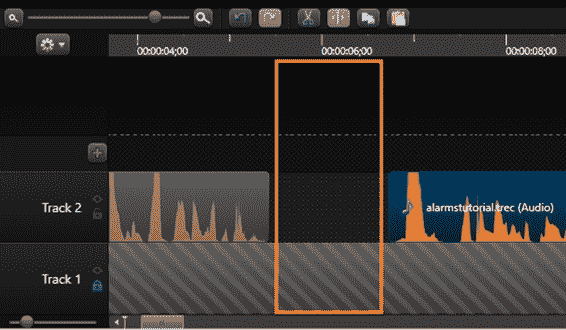

图 49:拖动音频部分后的时间线

与剪切所选内容不同，裁剪轨道内容时，Camtasia 仅抑制播放轨道时裁剪的部分。这意味着内容不会被删除。

在本练习中，我们将执行以下操作:

1.  将播放头放在 **00:03:02 处；10** 在时间轴中的位置。
2.  将鼠标指针放在轨道 2 的末端，直到指针变成水平调整大小箭头。
3.  按住鼠标左键并将指针向上拖到播放头位置。

就这样！轨道 2 的内容被裁剪。

|  | 注意:在内容被裁剪后，我们可以将鼠标指针放在结果的边缘，并以相反的方向拖动它。这将保留内容的原始形式。 |

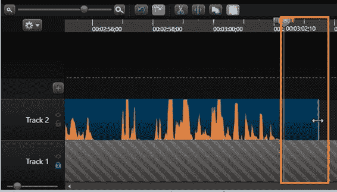

图 50:轨道 2 中要裁剪的内容

当我们为视频项目创建录制计划时，最好创建一个脚本文件。该文件包含详细的记录计划，作为一系列详细的步骤。正如第 3 章所建议的，这些步骤应该按顺序编号，从 1 开始。

有时你需要分别录制视频和音频。Camtasia 允许您在编辑项目时添加语音旁白。语音旁白录制开始后，将根据时间线播放录制视频的预览。所以叙述者需要一个参照物来知道具体什么时候说话。该参考可以在 Camtasia 中设置为一系列图形元素，放置在时间轴的顶部。这些图形元素被称为标记。

要在时间线中添加标记，我们首先需要显示标记视图。这可以通过按下 **Ctrl** + **M** 组合键来完成。

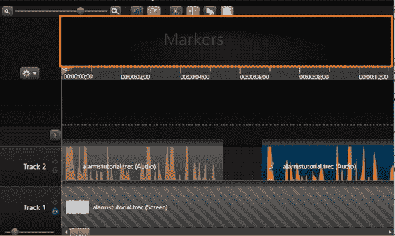

图 51:显示标记视图的时间线

现在，我们需要将播放头放在每个需要标记的时间线位置。之后要按 **M** 热键添加标记。

|  | 注意:每次添加标记时，都会显示一个文本条目来命名它。 |

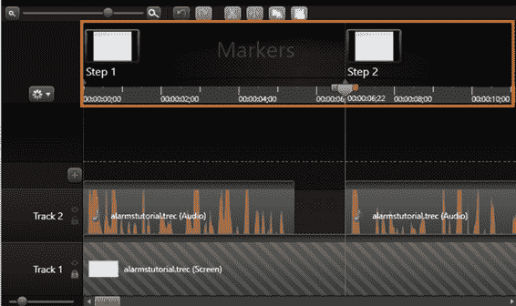

图 52:添加标记后的时间线

本章使用时间轴中可用的元素解释了视频编辑的一些要点。

第一个任务是将音频和视频分离出来进行屏幕录制。通过右键单击包含录音的时间线轨道，然后从上下文菜单中选择**分离视频和音频**选项来执行分离。

然后，我们学习了如何使用播放头。播放头是时间线的元素，它允许我们前往项目轨道中的精确时刻。播放头的两侧有两个按钮。绿色按钮是输入按钮，红色按钮是输出按钮。使用这些按钮，我们可以在项目内容中进行选择。

选择会影响项目中的所有轨道，因此我们在进行编辑操作时需要小心，例如剪切、拆分或裁剪。任何编辑操作都会应用于所有轨道。Camtasia 让我们可以在任何轨道上放置一个锁定机构，以避免事故。编辑操作不考虑锁定的轨道。

有时候，视频和音频需要分开录制。后来，在编辑项目时，Camtasia 允许我们添加音频旁白。在这种情况下，叙述者应该在项目中有一个参考，以便知道确切的发言时间。该参考由一系列称为标记的图形元素组成。我们可以通过将播放头放在需要放置标记的时间轴位置，然后按下 **M** 热键来添加标记。