# 八、效果和其它编辑技巧

在这一章中，我们将讨论给我们的视频添加效果，我们将学习一些其他的编辑技巧。

在这一点上，我完全删除了 Alarms & Clock 原始屏幕录制的原始音频(我认为读者不应该听到我糟糕的声音)。相反，我用一系列 MP3 文件替换了音频。这些文件包含录音脚本中描述的所有叙述的音频。为了创建这些文件，我使用了一个很棒的文本到语音在线工具，位于[这里](http://www.soundoftext.com/)。该工具的唯一限制是文本长度最多只能有 100 个字符。这就是我把叙述分成几个文件的原因。

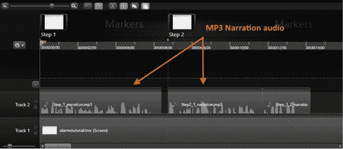

图 53:轨道 2 中带有 MP3 文件的时间线

图 53 显示了将这些 MP3 文件放在轨道 2 中的一般视图。请注意，记录脚本的每一步都有标记。这些标记将帮助我们将音频文件准确地放在时间轴上需要它们的地方。

现在，让我们看看这些文件是如何导入到我们的项目中的。这可以通过使用位于剪辑库顶部的**导入媒体**按钮来完成。点击此按钮将弹出一个菜单，其中包含所有可用的导入选项。

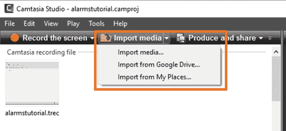

图 54:导入媒体按钮及其菜单

如图 54 所示，Camtasia 中有三个导入选项:

*   **导入媒体**:从电脑导入媒体文件。
*   **从 Google Drive 导入**:从 Google Drive 文件夹导入媒体文件。
*   **从我的位置导入**:从 TechSmith 我的位置存储帐户导入媒体文件。

点击**导入媒体**选项，从电脑导入媒体文件。将出现“打开”对话框。

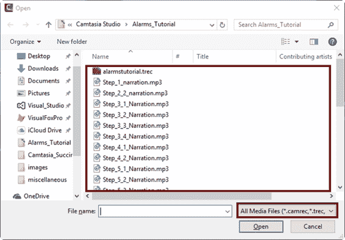

图 55:用于导入媒体文件的打开对话框

“打开”对话框将只显示媒体类型文件，如图 55 所示。我们可以像在任何窗口应用程序中一样选择所有需要的文件。选择后，点击**打开**导入文件。

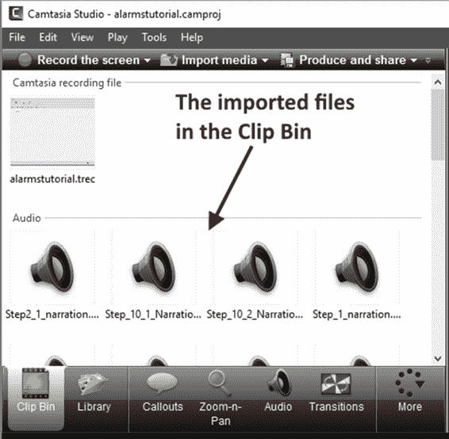

图 56:导入媒体文件后的剪辑库

导入文件后，它们会出现在剪辑库中，如图 56 所示。我们可以将这些文件中的任何一个拖到时间线内的轨道上。

我们也可以使用谷歌驱动帐户来导入媒体文件。这个过程类似于从计算机导入文件，只是我们需要先登录谷歌驱动帐户。

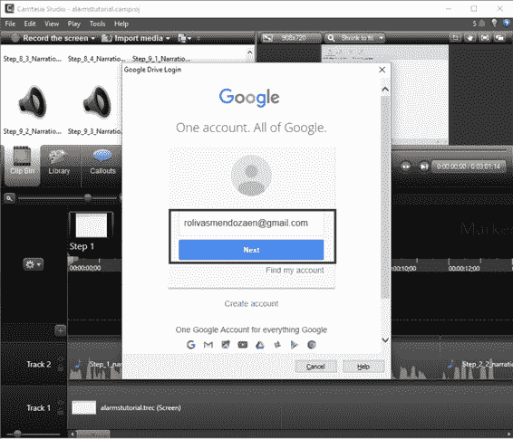

图 57:Camtasia 中的谷歌帐户登录对话框

点击**从谷歌驱动导入**选项，弹出谷歌账号登录对话框，如图 57 所示。在这里，我们将输入访问我们的谷歌驱动帐户的凭据。成功登录后，将出现以下对话框。

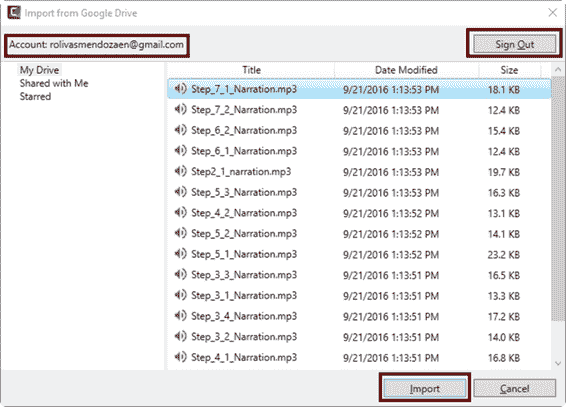

图 58:从谷歌硬盘导入对话框

如图 58 所示，Camtasia 从我们的 Google Drive 帐户中检索所有内容，并将其显示在名为“从 Google Drive 导入”的对话框中。除了“注销”和“导入”按钮之外，该对话框类似于上一节中讨论的“打开”对话框。

我们可以像在任何 Windows 应用程序中一样选择需要的文件，选择完成后，我们应该点击**导入**将文件带入我们的项目中。

有时候，为了吸引观众的注意力，在屏幕上突出或指出重要信息是很重要的。对于这些情况，Camtasia 为我们提供了一种称为标注的特殊效果。

标注是一个形状对象，通常是一个箭头，我们可以将它放在视频中，在时间线内的特定时刻指向屏幕。我们可以自定义此对象的属性，以便定义要显示的形状类型、填充和边框颜色、边框宽度以及应用于它的其他效果。此外，当标注允许我们在其中放置文本时，我们可以定义该文本的字体名称、字体大小和字体样式。

在本节中，我们将添加一个指向报警和时钟应用程序工具栏的标注，它将在讲述人提到它的精确时刻出现。要添加该标注，我们应该遵循以下步骤:

1.  将播放头放在您希望标注出现的位置(在本例中为**00:00:07；28** 位置)。
2.  从剪辑库中选择**标注**标签。
3.  单击**添加标注**。

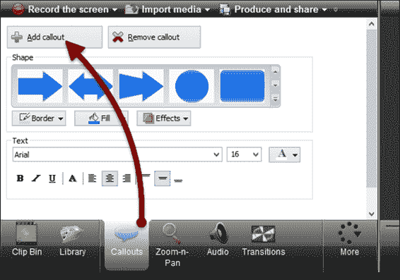

图 59:剪辑库中的标注选项卡

|  | 提示:我们可以通过按 C 热键将最近添加的标注添加到我们的项目中。 |

添加标注后，它会出现在时间线中自己的轨道上。此外，它会显示在“画布”中。

我们可以直接在“画布”中调整某些标注属性，例如缩放或旋转，方法是使用我们在画布上单击时放置的拖动点。

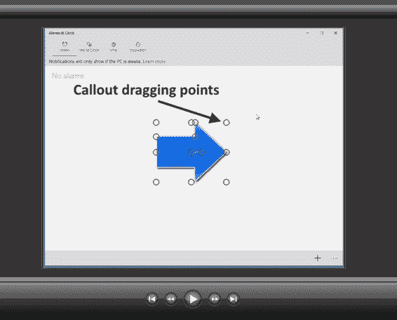

图 60:画布中显示的添加的标注

出于本练习的目的，我们将向左旋转标注 180 度，然后将它指向报警和时钟应用程序的工具栏。如果我们想要手动调整标注属性，我们应该单击画布中的标注，然后单击剪辑库中的**标注**选项卡。

标注默认属性对于本练习来说很好，但是您可以在实践中使用所有选项。

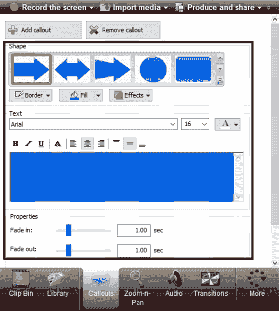

图 61:剪辑库的标注选项卡中的标注属性

图 61 显示了剪辑框的标注选项卡中的标注属性。只有在画布中选择了标注对象时，才会显示这些属性。

在视频编辑中，过渡是我们在两个镜头或剪辑之间显示的内容。当这些剪辑或镜头被连接时，会发生过渡。

我们可以通过点击剪辑库的**过渡**标签来为我们的项目添加过渡数字效果。应执行以下步骤:

1.  选择将应用转场的视频媒体类型轨道(在本例中为**轨道 1** )。
2.  将播放头放在时间线中转场开始的精确时刻(在这种情况下，在轨道 1 的开头)。
3.  从剪辑库中选择所需的过渡效果，并将其拖到播放头位置的视频媒体轨道上(在本练习中，我们将应用**淡入淡出黑色**效果)。

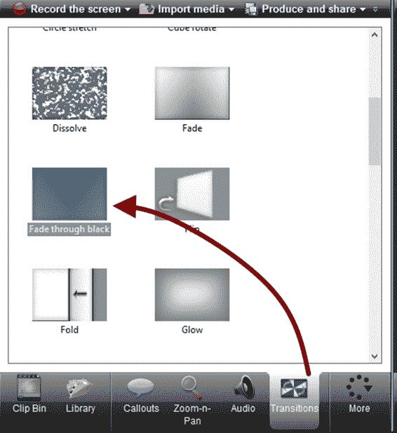

图 62:剪辑库中的过渡效果

图 62 显示了剪辑库的“过渡”标签。显示了一些可用的效果，包括我们练习中使用的效果。

将过渡效果添加到轨道后，它会以绿色矩形的形式出现，并在其中显示效果的名称。

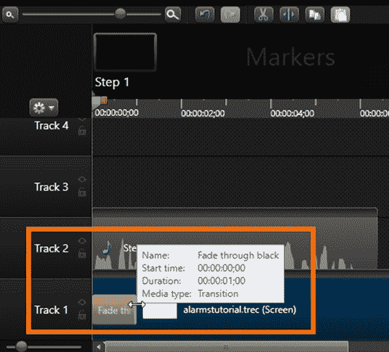

图 63:时间轴中的过渡效果

图 63 显示了添加到轨道 1 的过渡效果。双向箭头光标表示我们可以放大或缩小过渡的持续时间。如果我们希望增加持续时间，我们可以将光标向右拖动，或者如果我们希望减少持续时间，我们可以将光标向左拖动。此外，工具提示标签会显示过渡效果的名称、效果开始时间、持续时间和媒体类型。

如果我们不再希望它出现在视频中，我们可以删除过渡。要删除过渡，我们应该遵循以下步骤:

1.  使轨道和转场所在的位置在时间线中可见。
2.  右键单击过渡效果矩形。
3.  单击上下文菜单中的**删除**选项。

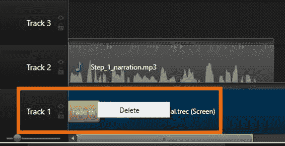

图 64:删除过渡效果

使用屏幕录像时，可能有必要显示正在发生的事情的重要细节，并确保观众注意到这些细节。

回顾我们在本书中一直讨论的视频项目，有一个时刻，讲述者指向位于闹钟应用程序右下角的加号按钮。该按钮用于添加新的报警配置。我们可能希望将观众的注意力吸引到这个按钮上，而忽略视频中屏幕的任何其他部分。最简单的方法是使用缩放效果。

在我们的视频中，缩放效果的目的是在时间线内的特定时刻和特定持续时间内放大(或有时缩小)显示内容的特定部分。

我们将通过执行以下步骤为项目添加缩放效果:

1.  在时间线中选择一个视频、图像或群组轨道(在本例中，视频位于轨道 1 中)。
2.  将播放头放在我们想要缩放效果开始的位置。
3.  单击剪辑框中的**缩放-平移**选项卡。

    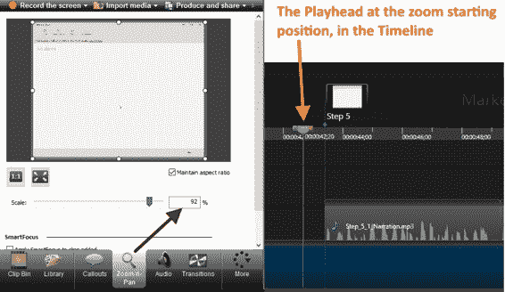

    图 65:时间线中缩放-平移标签和播放头的同时视图

    现在，“缩放-n-平移”选项卡显示一个缩略图，其框架对应于时间线中选定的确切时刻。此外，图像周围还放置了八个拖动点。

4.  拖动其中一个点，以调整缩放效果所需的比例(在这种情况下，我们将拖动左上角的点，直到矩形仅覆盖加号按钮)。之后，缩放效果将应用于视频，并在时间线中显示为箭头图标。

    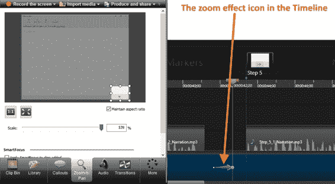

    图 66:剪辑库和时间线中的缩放效果

5.  现在，我们将在时间轴上建立一个点，我们希望视频以其原始比例显示。如果我们不执行此步骤，缩放效果将保持应用，直到视频结束。因此，我们将把播放头放在时间线的相应位置。
6.  单击**缩放-平移**选项卡中的**缩放媒体以适合整个画布**按钮。

    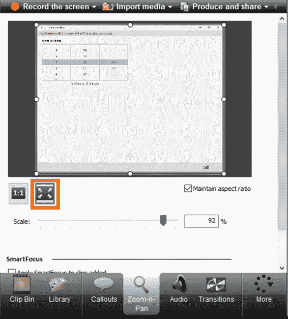

    图 67:缩放-n-平移选项卡中的“缩放媒体以适合整个画布”按钮

要移除缩放效果，我们应该在时间线中找到相应的箭头图标，然后右键单击该图标。之后，我们应该从显示的上下文菜单中点击**删除**。

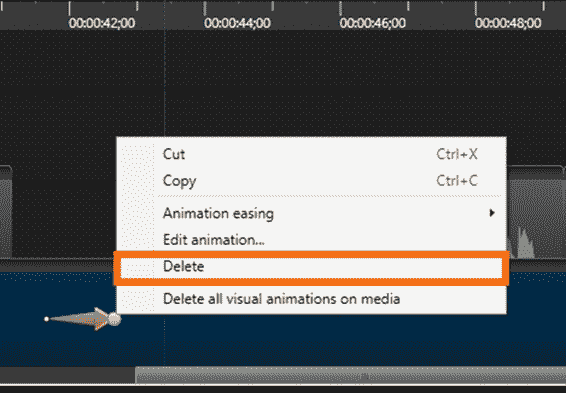

图 68:删除缩放效果

我们可以通过添加动画来增强我们的视频。为此，我们将使用剪辑库中的视觉属性选项。

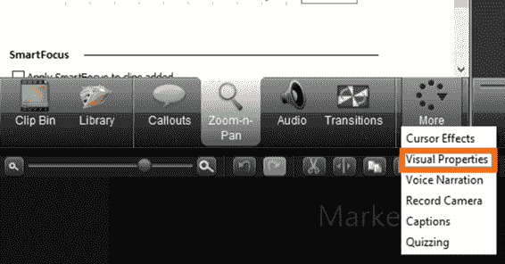

图 69:更多选项卡中显示的可视属性选项

动画是一种视觉效果，可以应用于时间线内的元素，以便在一定时间内将其视觉属性从一种状态更改为另一种状态。

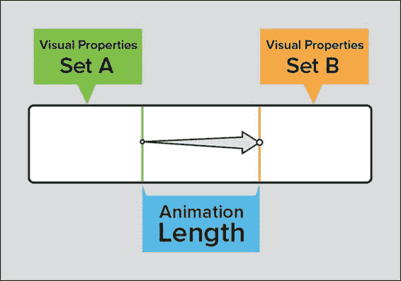

图 70:动画的组成部分

如上图所示，当动画应用于元素时，会创建三个组件。

*   动画左侧的一组视觉属性(集合 A)。
*   动画右侧的一组视觉属性。
*   集合 A 和集合 B 之间的时间量(动画长度)。

我们还可以注意到动画长度用箭头表示。箭头的起点界定视觉属性集 A，箭头的终点指示视觉属性集 b 的起点。箭头越长，在集 A 和集 b 之间更改的时间越长

我们将使用之前添加到项目中的标注来创建动画。如果您在本书中播放视频预览，您可能会注意到标注在视频中会出现淡入效果，而淡出效果会消失。

在应用动画之前，我们将从标注中移除这些效果。为此，播放头应该放在标注所在的位置。

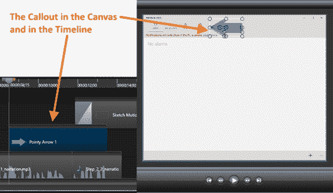

图 71:选择标注以消除淡入淡出效果

通过在画布中点按标注来选择标注。现在，我们应该在剪辑库中选择**标注**选项卡。最后，我们应该将**淡入**和**淡出**属性设置为 **0** 秒，如图 72 所示。

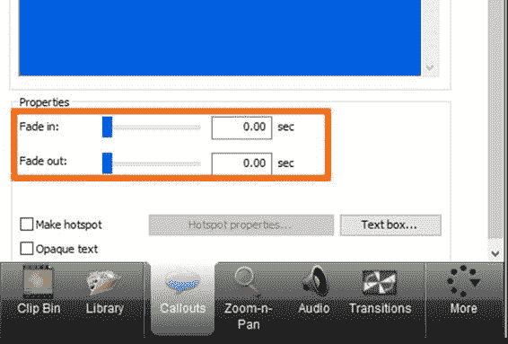

图 72:淡入淡出属性

现在，我们将把播放头移到标注的中间点，为动画设置起始点(即视觉属性集 A)。之后，我们将把标注拖出画布，使其在动画开始时不可见。

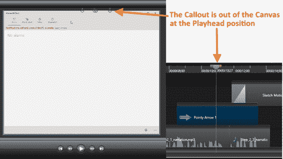

图 73:设置动画的起始点

现在，从剪辑库中选择**视觉属性**选项卡，然后单击**添加动画**。之后，标注上方会出现一个箭头图标。

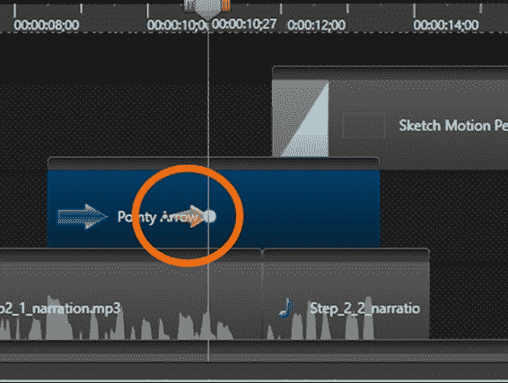

图 74:标注上的动画图标

箭头末端的蓝点，如图 74 所示，指向视觉效果集 B，即动画结束。

最后，在动画结束后，将标注拖到画布中，并将其放置在我们希望保持静止的位置。

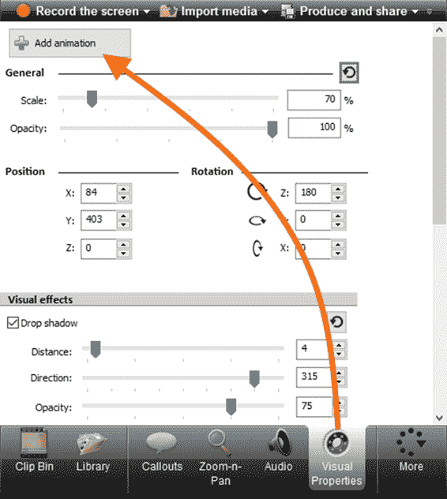

图 75:可视属性选项卡中的添加动画按钮

要从时间线中删除动画，我们应该右键单击相应的动画图标，并从上下文菜单中选择**删除**。

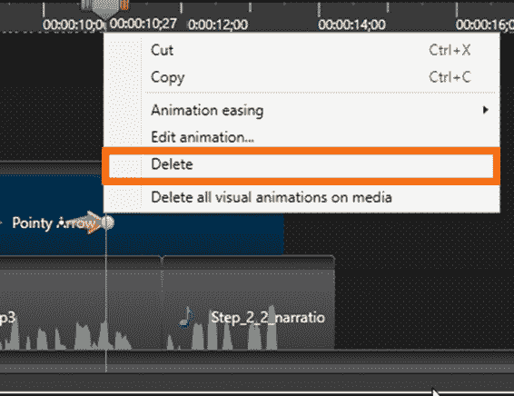

图 76:动画上下文菜单

本章解释了如何通过添加效果来增强我们的视频。本章中详细介绍的效果是标注、过渡、缩放和动画。我们还介绍了从计算机或谷歌硬盘导入媒体文件的过程。

标注是一种形状对象，我们可以将它放在视频中，在特定时刻指向屏幕，以引起观众对视频中解释的特定主题的注意。过渡是我们在两个镜头或剪辑之间使用数字效果(如渐变效果)显示的内容。视频中的缩放效果会放大(或有时缩小)显示内容的某个部分，以便覆盖整个画布，因此我们会将观众的注意力吸引到该部分内容上。动画是一种视觉效果，它在一定时间内将元素的视觉属性从一种状态(称为视觉属性集 A)更改为另一种状态(称为视觉属性集 B)，该时间称为动画长度。