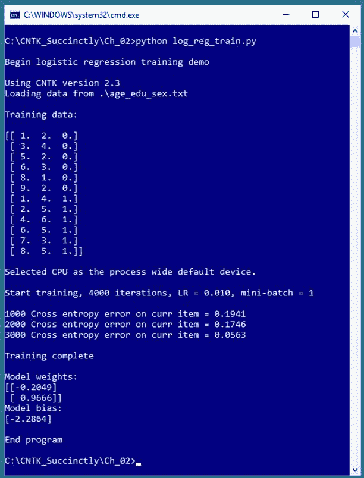
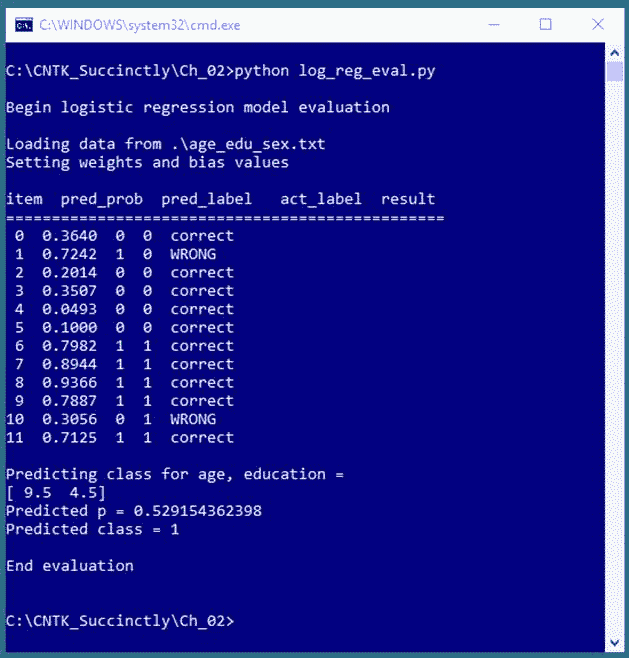

# 第二章逻辑回归

逻辑回归是最简单的机器学习技术之一。逻辑回归是一种解决二元分类问题的技术:在要预测的变量(在机器学习术语中通常称为*标签*)的值可以是两个分类值之一的情况下，创建一个预测模型。例如，您可能希望根据一个人的年龄、受教育年限和年收入来预测他的性别(男性或女性)。



图 2-1:使用碳纳米管的逻辑回归

图 2-1 中的截图显示了逻辑回归的一个简化例子。演示程序首先将 12 个数据项加载到内存中。每个项目代表一个人的年龄、教育程度和性别。比如第一个数据项是(1.0，2.0，0)，是年龄= 1.0，学历= 2.0，性别=女性的人。

年龄和教育是预测变量(在 CNTK 和机器学习术语中通常称为特征)。特征变量的值已经以某种方式标准化，因此它们的量值都在 1.0 和 9.0 之间。预测变量(通常称为*类*或*类标签*)编码为女性= 0 和男性= 1。



图 2-2:评估逻辑回归模型

CNTK 演示训练程序使用具有二元交叉熵误差的随机梯度下降算法的 4000 次迭代来创建逻辑回归预测模型。训练完成后，演示显示了定义逻辑回归模型的权重值(-0.2049，0.9666)和偏差值(-2.2864)。

图 2-2 中的截图显示了对训练好的逻辑回归模型的评估。该程序遍历 12 个训练项目中的每一个，并计算和显示预测概率、相关的预测类别、实际类别以及指示预测是正确还是不正确的标签。逻辑回归预测模型正确预测了 10 个训练项目，分类准确率为 10 / 12 = 83%。

在评估模型之后，图 2-2 所示的程序对一个新的、以前没有见过的人进行预测。未知项目的正常年龄= 9.5，正常教育= 4.5。预测概率为 0.5291，因此预测的类别为 1(男性)。

## 理解逻辑回归

为了理解生成图 2-1 和 2-2 所示输出的 CNTK 代码，您需要对逻辑回归有一个基本的了解。关键思想最好用例子来解释。假设您想根据申请的 x1 =债务，x2 =收入，x3 =信用评级来预测贷款申请的信用价值(0 =拒绝，1 =批准)。在逻辑回归中，为每个特征确定一个权重值 w 和一个单个偏差值 b。

假设 x1 = 3.0，x2 = -2.0，x3 = 1.0。并且假设你确定 w1 = 0.65，w2 = 1.75，w3 = 2.05，b = 0.33。要计算预测的类，首先要计算 z = (x1 * w1) + (x2 * w2) + (x3 * w3) + b:

z =(3.0)(0.65)+(-2.0)(1.75)+(1.0)(2.05)+0.33
= 1.95-3.50+2.05+0.33
= 0.83

接下来计算 p = 1.0 / (1.0 + exp(-z))，其中`exp()`函数是欧拉数，e (~2.71828)的幂:

p = 1.0/(1.0+exp(-0.83))
= 1.0/(1.0+0.4360)
= 1.0/1.43630
= 0.6963

p 值可以解释为类为 1 的概率。换句话说，如果 p < 0.5 the prediction is class = 0, otherwise (if p > = 0.5)，则预测为 class = 1。

好的，但是权重和偏差值来自哪里？要确定权重和偏差的值，必须获得一组训练数据，这些数据具有已知的输入预测值和已知的正确类别标签值。然后，使用一种算法(通常是梯度下降，或称为随机梯度下降的变体)来查找权重和偏差的值，以便计算出的输出值与已知的正确类别标签紧密匹配。

逻辑回归训练的一个重要方面是测量计算的输出值(使用一组权重和偏差)和正确的类别标签之间的误差。假设，对于一组给定的输入值和一组给定的权重和偏差值，计算出的 p 值为 0.7000，已知的正确类别标签为 1。你可以计算出平方误差:

如果=(1-0.7000)*(1-0.7000)
= 0.09

事实上，这种方法可以用于逻辑回归。然而，由于相当复杂的技术原因，使用所谓的二进制交叉熵误差(也称为对数损失)被认为是更可取的。

对于上面的数值示例(p = 0.7000，c = 1)，二元交叉熵误差计算如下:

CEE =-[(c * ln(p)]+[(1-c)* ln(1-p)][t1 * ln(0.7000)]+[0 * ln(0.3000)]
ln(0.7000)]
= 0.356

交叉熵误差有点难以解释，但是较小的值意味着较小的误差(这意味着更精确的预测)。正如您将很快看到的，CNTK 具有支持平方误差和交叉熵误差的函数。要记住的关键一点是，在进行逻辑回归训练时，除非您有一个致力于使用平方误差的现有系统，否则建议您使用二进制交叉熵误差，越小的值越好。

## 设置训练数据

图 2-1 和 2-2 所示程序使用的训练数据如图 2-3 所示，即:

1.0，2.0，0
3.0，4.0，0
5.0，2.0，0
6.0，3.0，0
8.0，1.0，0
9.0，2.0，0
1.0，4.0，1
2.0，5.0，1
4.0，6.0，1
6.0，5.0，1
7.0，1

当使用 CNTK 进行逻辑回归时，由您来准备您的训练数据，包括归一化特征值，并将类标签编码为`0`或`1`。例如，原始数据可能类似于:

25.0，12，女
37.0，16，男
。。。

演示程序只使用了两个预测变量，只是为了让事情变得简单，这样数据就可以显示在二维图形中。逻辑回归可以用于任何数量的预测变量。预测变量必须是数值，但是可以将非数值预测值转换为数值，以便使用逻辑回归。

与其他二元分类技术相比，逻辑回归的主要优点是简单。逻辑回归的主要缺点是它只适用于线性可分的数据。从概念上讲，逻辑回归找到了一条直线来区分这两类。对于演示数据，没有一条直线能比 12 个正确预测中的 10 个做得更好。


图 2-3:逻辑回归的数据

第 3 章详细解释了特征规范化和类编码。数据被复制到记事本中，并保存为本地机器上的 **age_edu_sex.txt** 。在非演示场景中，您可能有数百或数千个培训项目。

## 建立逻辑回归模型

代码清单 2-1 展示了生成图 2-1 所示屏幕截图的程序代码。该程序首先对所使用的文件名称和 CNTK 版本进行注释，并导入 NumPy 和 CNTK 包:

# log_reg_train.py
# logistic 回归年龄-学历-性别合成数据
# CNTK 2.3
导入 numpy 为 np
导入 CNTK 为 C

在非演示场景中，您可能希望包含更多细节。程序结构由单个`main`函数组成，没有辅助函数:

def main():
print(" \ nBegin logistic 回归训练演示\ n ")
ver = c . _ _ 版
print(【使用 CNTK 版】+ str(ver))
。。。
打印(“结束程序”)
if _ _ name _ _ = = " _ _ main _ _ ":
main()

由于页面宽度的限制，我用两个空格而不是通常的四个空格来缩进。所有正常的错误检查都被删除了，以保持主要思想的清晰。因为 CNTK 还很年轻，并且正在积极开发中，所以最好在代码注释中指明使用哪个版本，并以编程方式验证版本，如图所示。

代码清单 2-1:逻辑回归训练

```
  #
  log_reg_train.py
  #
  logistic regression age-education-sex synthetic data
  #
  CNTK 2.3

  import numpy as np
  import cntk as
  C

  #
  ==================================================================================

  def main():

  print("\nBegin
  logistic regression training demo \n")

  ver = C.__version__

  print("Using
  CNTK version " +
  str(ver))

    # training data format:
    # 4.0, 3.0, 0
    # 9.0, 5.0, 1
    # . . . 

    data_file
  = ".\\age_edu_sex.txt"

  print("Loading
  data from " +
  data_file + "\n")

  features_mat = np.loadtxt(data_file, dtype=np.float32, delimiter=",",

  skiprows=0, usecols=[0,1])

  labels_mat = np.loadtxt(data_file, dtype=np.float32, delimiter=",",

  skiprows=0, usecols=[2], ndmin=2) 

  print("Training
  data: \n")

  combined_mat = np.concatenate((features_mat, labels_mat), axis=1)

  print(combined_mat); print("")

    # create model

  features_dim = 2  # x1,
  x2

  labels_dim = 1    #
  always 1 for log regression

  X = C.ops.input_variable(features_dim, np.float32)    # cntk.Variable

  y = C.input_variable(labels_dim, np.float32)    # correct class value

  W = C.parameter(shape=(features_dim, 1))   # trainable cntk.Parameter

  b = C.parameter(shape=(labels_dim))

  z = C.times(X, W) + b        # or z = C.plus(C.times(X, W), b)

  p = 1.0 / (1.0 + C.exp(-z))  # or p = C.ops.sigmoid(z)

  model = p  # create an
  alias

    # create Learner and Trainer

  ce_error = C.binary_cross_entropy(model, y)  # CE a bit more principled for LR

  fixed_lr = 0.010

  learner = C.sgd(model.parameters, fixed_lr) 

  trainer = C.Trainer(model, (ce_error), [learner])

  max_iterations = 4000

    # train

  print("\nStart
  training, 4000 iterations, LR = 0.010, mini-batch = 1 \n")

  np.random.seed(4)

  N = len(features_mat)
    for i in range(0, max_iterations):

  row = np.random.choice(N,1)  # pick a random row from training items

  trainer.train_minibatch({ X: features_mat[row], y: labels_mat[row] })

  if i % 1000 == 0 and i > 0:

  mcee = trainer.previous_minibatch_loss_average

  print(str(i) + "
  Cross-entropy error on curr item = %0.4f " % mcee)

  print("\nTraining
  complete \n")

  np.set_printoptions(precision=4, suppress=True)

  print("Model
  weights: ")

  print(W.value)

  print("Model
  bias:")

  print(b.value)

  print("")
    #
  np.set_printoptions(edgeitems=3,infstr=‘inf’,
    #   linewidth=75, nanstr=‘nan’,
  precision=8,
    #   suppress=False, threshold=1000,
  formatter=None)  # reset all

  print("End
  program ")

  #
  ==================================================================================

  if __name__ == "__main__":

  main()

```

接下来，程序将训练数据加载到内存中:

#训练数据格式:
# 4.0，3.0，0
# 9.0，5.0，1
#。。。

data_file =。\\age_edu_sex.txt"
打印(“从“+data _ file+”\ n 加载数据”)
功能 _mat = np.loadtxt(data_file，dtype=np.float32，分隔符= "，"，
skip ows = 0，usecols=[0，1])
标签 _mat = np.loadtxt(data_file，dtype=np.float32，分隔符= "，"，
skip ows = 0，usecols

培训数据与培训计划位于同一目录中。CNTK 训练函数期望训练数据以两个矩阵提供:一个用于特征，一个用于类标签。演示使用`numpy.loadtxt()`功能。请注意，只有当您的训练数据小到可以完全存储在内存中时，该技术才有效。对于大型数据集，CNTK 支持`Reader`对象，这将在第 4 章中介绍。

大多数机器学习模型使用`float32`数据类型，而不是更常见的`float64`类型，因为使用 64 位获得的额外精度很少值得付出性能损失。当数据集有一个或多个标题行时，`skiprows`参数很有用。请注意，列是从零开始索引的。

`features_mat`矩阵的形状是由数据文件的结构决定的，所以在这种情况下是 12 ^ 2(12 行，2 列)。注意`labels_mat`矩阵的`ndmin=2`(“最小尺寸”)。如果没有该参数，`loadtxt()`将推断一维向量返回类型，而不是所需的 12 1 二维矩阵。

不兼容和不正确的矩阵形状是 CNTK 错误的一个非常常见的来源。在开发过程中追踪矩阵形状错误的一种方法是使用`shape`属性打印形状信息，例如`print(labels_mat.shape)`，它将显示(12，1)。

将训练数据加载到内存后，程序显示数据如下:

print(" Training data:\ n ")
combined _ mat = NP . concatenate((features _ mat，labels_mat)，axis = 1)
print(combined _ mat)；打印("")

`concatenate()`函数结合了两个或多个数组或矩阵。这样做，而不是分别显示特征矩阵和标签矩阵，只是为了使显示更容易阅读。您可以使用特殊的 Python 语法:`print(combined_mat[(0,1,2),:])` `or` print(combined _ mat(range(0，3)，:])来显示前三行，而不是打印整个组合矩阵。您可以将其解释为“第 0、1 和 2 行以及所有列”

接下来，训练程序创建与训练数据兼容的(未训练的)逻辑回归模型:

#创建模型
features_dim = 2 # x0，x1
labels_dim = 1 #对于对数回归
X = c . ops . input _ variable(features _ dim，np.float32) # cntk。变量
y = c . input _ variable(labels _ dim，np.float32) #正确的类值
W = c . parameter(shape =(features _ dim，1)) #可训练的 cntk。参数
b = c . parameter(shape =(labels _ dim))
z = c . times(X，W) + b #或 z = C.plus(C.times(X，W)，b)
p = 1.0 / (1.0 + C.exp(-z)) #或 p = C.ops.sigmoid(z)
model = p #创建别名

`features_dim`变量保存预测变量的数量(两个，在这种情况下是年龄和教育)。`labels_dim`保存类别标签的数量。对于逻辑回归，这将始终是 1(尽管类标签可以采用两个可能值中的一个，0 或 1，对应于女性和男性——一个变量，两个值)。两个 dim 变量名都不是 CNTK 关键字，所以如果你愿意，你可以使用像`x_dim`和`y_dim`这样的名字。

CNTK `input_variable()`功能创建存储来保存特征和标签值。请注意，对对象`X`的赋值使用完全限定名`C.ops.input_variable()`，但对对象`y`的赋值使用快捷语法`C.input_variable()`。另一种方法是导入特定函数并省略限定。例如:

从 cntk.ops 导入输入变量
中导入 numpy 作为 np
。。。
X =输入变量

`input_variable()`函数和大多数 CNTK 函数一样，有大量的参数可以在函数调用中省略，因为大多数参数都有默认值，这使得显式包含这些参数是可选的。例如，`input_variable()`有可选参数`needs_gradient`、`is_sparse, dynamix_axes`和`name`。事实上，`dtype`(数据类型)参数有默认值`np.float32`，所以该参数也可以省略。

`W`矩阵保存逻辑回归权重，`b`标量保存单个偏差值。请注意，两者都是通过调用`parameter()`函数创建的，这意味着当调用 CNTK 训练方法时，这些对象值将自动更新。

逻辑回归模型是通过计算一个`z`值作为权重和特征值的乘积之和，加上偏差`b`来指定的。如前所述计算概率值`p`。注意，我使用的是 CNTK `exp()`函数，而不是 NumPy `np.exp()`函数或基础 Python `math.exp()`函数；我可以用这三个中的任何一个。

函数 `f(x) = 1.0 / (1.0 + exp(-x))` 经常出现在机器学习中，被称为逻辑 sigmoid 函数(有时不能完全正确地缩写为 sigmoid)。CNTK 有一个内置的`sigmoid()`函数，所以计算`p`的代码可以写成:

p = C.ops.sigmoid(z)

此时，在较低的层次上，`p`表示类具有值 1 的概率，在较高的抽象层次上，`p`表示整体逻辑回归模型。演示程序通过将对象`p`分配给对象`model`来创建一个名称友好的别名。这完全是可选的，只是为了可读性。CNTK 还有一个`ops.alias()`功能可以使用。

## 训练逻辑回归模型

将训练数据读入内存并创建逻辑回归模型后，下一步是训练模型。演示程序继续创建一个`Learner`和一个`Trainer`对象:

#创建学习者和培训师
ce_error = C . binary _ cross _ 熵(模型，y)
fixed_lr = 0.010
学习者= C.sgd(模型.参数，fixed_lr)
培训师= C .培训师(模型，(ce _ error)，【学习者】)
max_iterations = 4000

你可以把`Learner`想象成一个最小化误差的算法，把`Trainer`想象成一个使用`Learner`计算权重和偏差值的对象。演示程序使用来自 CNTK `losses`包的二进制交叉熵函数来测量计算的输出概率和已知的正确标签值(0 或 1)之间的误差。如果你想用平方误差，代码可以是`s_error = C.squared_error(model, y)`。

演示使用`sgd()`函数设置随机梯度下降学习算法。CNTK 支持`adadelta()`、`adam()`、`nesterov()`等多种高级学习算法。高级算法最常用于深度神经网络。随机梯度下降是最简单的学习算法，一般适用于逻辑回归问题。

`sgd()`函数需要一个学习率，这个值会影响权重和偏差值在每次训练迭代中的变化程度。学习率的值必须通过反复试验来确定。如果学习速度太小，训练会很慢。如果学习率过大，训练可能会跳过一个好的结果。

您可以指定学习速率不同的学习速率计划，而不是使用固定的学习速率。通常，在早期迭代中，这是一个相对较大的学习速率，然后在后期迭代中，学习速率变小。

在创建了一个`Learner`对象之后，它作为一个参数被传递给`trainer()`函数来创建一个`Trainer`对象。`trainer()`的第二个参数是一个元组，如括号所示，因为您可以传递多个错误函数。对于线性回归，您应该传递二元交叉熵函数(或平方误差)。您可以选择创建第二个误差函数来测量分类误差，即错误预测的百分比。例如:

class _ err = C . classification _ error(model，y)
trainer = C.Trainer(model，(ce_error，class _ err)，【学习者】)

然而，正如您将很快看到的那样，因为演示程序在处理单个训练项目后会调整权重和偏差值，所以计算分类精度最好以不同的方式进行。

`trainer()`的第三个参数是一个列表，如方括号所示，因为可以传递多个`Learner`对象。这种技术通常用于深度神经网络——网络的不同部分可以使用不同的学习算法对象。

随机梯度下降是一种迭代技术，所以你必须有一些停止条件。最简单的方法是指定固定数量的训练迭代。迭代的次数必须通过反复试验来确定。

创建学员和培训师对象后，演示程序会训练逻辑回归模型，如下所示:

# train
print(" \ N start training，4000 次迭代，LR = 0.010，mini-batch = 1 \ N ")
NP . random . seed(4)
N = len(features _ mat)

对于范围内的 I(0，max _ iterations):
row = NP . random . choice(N，1) #从训练项目
train . train _ minibatch({ X:features _ mat[row]，y: labels_mat[row] })

如果 i % 1000 == 0 且 I > 0:
mcee = trainer . previous _ minibatch _ loss _ average
打印(str(i) +“当前项目上的交叉熵错误= % 0.4f”% mcee)

打印(" \n 打印完成\ n ")

训练模型时，必须决定每个权重和偏差更新操作使用多少训练项目。对于逻辑回归，最常见的方法(也是演示使用的方法)是在处理单个训练项目后更新权重和偏差值。这就是常说的*线上培训*。另一种方法是处理所有培训项目，然后执行更新操作。这就是常说的*批量训练*。

第三种方法是在更新之前处理一定数量的培训项目，例如四个或五个。这通常被称为小批量训练。注意，批量大小等于 1 的小批量训练相当于在线训练，批量大小等于训练数据集大小的小批量训练相当于批量训练。

当使用在线或小批量方法时，按随机顺序访问培训项目非常重要。演示将`np.random.seed`设置为 4，以便结果可再现。使用种子值 4 只是因为它给出了一个有代表性的演示输出。在训练循环中，功能`np.random.choice()`用于选择单行索引。

`train_minibatch()`函数接受预测值，创建一个以`X`为关键字的匿名字典对象，以及已知的正确类标签(一个以`y`为关键字的匿名字典对象)。在幕后，`train_minibatch()`计算预测输出，然后使用二进制交叉熵来稍微更新每个权重和偏差值，由学习速率控制。

当训练一个模型时，显示当前的错误是很重要的，这样你就可以捕捉到训练不起作用的情况。训练失败是很常见的。该演示使用`previous_minibatch_loss_average`属性显示前一个训练项目的二进制交叉熵误差，每 1000 次迭代一次。由于 CNTK 的内部架构，使用的是上一项，而不是当前项。在非演示场景中，您可能会更频繁地显示错误，例如，每 100 次迭代显示一次。

请注意，当使用在线培训时，因为您一次只处理一个培训项目，所以错误值会非常不稳定。你希望看到的是误差值普遍下降。你不希望看到的是不会真正改变的误差值，或者更糟的是，稳定增加的值。

当使用在线训练时，显示分类误差或其补充分类精度并没有太大帮助，因为精度适用于单个训练项目，并且要么是 0%(如果项目被错误预测)，要么是 100%(对于正确预测)。

演示中使用的在线训练算法从训练数据中随机选择一行，4000 次。这并不能保证每个训练项目的使用次数相同。一种更复杂的方法是随机遍历每个训练项目，然后重复这个过程几次。例如:

# train
NP . random . seed(0)
N = len(features _ mat)
用于范围内扫描(0，100):
indexes = NP . random . choice(N，N，replace=False)
用于索引中 idx:
trainer . train _ minibatch({ X:features _ mat[idx]，y:labels _ mat[idx]})
mcee = trainer . previous _ minibatch _ loss _ average
print("交叉熵误差

因为有 N = 12 个训练项目，`np.random.choice()`函数以随机顺序生成一个从 0 到 11 的索引数组。处理每个索引处的训练项目，然后生成另一组随机顺序的索引。这意味着总共将有 100 * 12 = 1200 个更新操作，并且每个训练项目使用相同的次数。

演示训练程序最后显示了两个权重的值和偏差的值:

np.set_printoptions(精度=4，抑制=真)
打印(“模型权重”:)
打印(W.value)
打印(“模型偏差:“)
打印(b.value)
打印(“”)

注意不能简单的直接打印`W`和`b`，因为它们是`Parameter`类型的 CNTK 对象，所以必须使用它们的`value`属性。`W`和`b`的值有效地定义了逻辑回归模型，因此不仅仅是显示它们；您可能希望将它们写入文本文件，以便其他程序可以检索它们。

## 使用训练好的逻辑回归模型

在一个逻辑回归模型被训练好之后，你通常会想要评估它的分类准确性，并最终使用它来预测新的，以前看不到的数据。生成图 2-2 所示输出的程序 **log_reg_eval.py** 如代码清单 2-2 所示。请注意，`\`字符被 Python 用于行延续。

代码清单 2-2:评估一个训练好的模型

```
  #
  log_reg_eval.py
  #
  logistic regression age-education-sex data

  import numpy as np

  #
  ==================================================================================

  def main():

  print("\nBegin
  logistic regression model evaluation \n")

  data_file = ".\\age_edu_sex.txt"

  print("Loading
  data from " +
  data_file)

  features_mat = np.loadtxt(data_file, dtype=np.float32, delimiter=",",

  skiprows=0, usecols=(0,1))

  labels_mat = np.loadtxt(data_file, dtype=np.float32, delimiter=",",

  skiprows=0, usecols=[2], ndmin=2) 

  print("Setting
  weights and bias values \n")

  weights = np.array([-0.2049, 0.9666], dtype=np.float32)

  bias = np.array([-2.2864], dtype=np.float32)

  N = len(features_mat)

  features_dim = 2

  print("item 
  pred_prob  pred_label   act_label  result")

  print("================================================")
    for i in range(0, N):  #
  each item

  x = features_mat[i]

  z = 0.0

  for j in
  range(0, features_dim):  # each feature

  z += x[j] * weights[j]

  z += bias[0]

  pred_prob = 1.0 / (1.0 + np.exp(-z))

  pred_label = 0 if pred_prob < 0.5 else 1

  act_label = labels_mat[i]

  pred_str = 'correct' if
  np.absolute(pred_label - act_label)
  < 1.0e-5 \

  else 'WRONG'

  print("%2d  %0.4f 
  %0.0f  %0.0f  %s"
  % \

  (i, pred_prob, pred_label, act_label, pred_str))

  x = np.array([9.5, 4.5], dtype=np.float32)

  print("\nPredicting
  class for age, education = ")

  print(x)

  z = 0.0
    for j in range(0, features_dim):

  z += x[j] * weights[j]

  z += bias[0]

  p = 1.0 / (1.0 + np.exp(-z))

  print("Predicted
  p = " + str(p))
    if p < 0.5: print("Predicted class = 0")
    else: print("Predicted class = 1")     

  print("\nEnd
  evaluation \n")

  #
  ==================================================================================

  if __name__ == "__main__":

  main()

```

评估程序导入`numpy`包，但不需要`cntk`包，因为训练模型的分类精度将从头开始计算，而不是使用 CNTK `Trainer` 对象的`previous_minibatch_evaluation_average`属性。

评估程序以与训练程序完全相同的方式将训练数据加载到特征矩阵和类别标签矩阵中。在许多情况下，您会希望将培训和评估结合到同一个计划中；这里使用了两个不同的程序来强调这两种操作之间的区别。

接下来，评估程序设置由训练程序确定的权重和偏差值:

打印(“设置权重和偏差值\ N”)
权重= np.array([0.0925，1.1722]，dtype=np.float32)
偏差= np.array([-4.5400]，dtype = NP . float 32)
N = len(features _ mat)
features _ dim = 2

请注意，评估程序使用普通的 NumPy 数组，而不是 CNTK `Parameter`对象。接下来，评估程序遍历每个训练项目并计算逻辑回归概率:

print(“item pred _ prob pred _ label act _ label result”)
print(“= = = = = = = = = = = = = = = = = = = = = = = = = = = = = = = = = = = = = = = = = = = = = = =”
为 i in range(0，N): #每个项目
x = features _ mat[I]
z = 0.0
为 j in range(0，features_dim): #每个特征
z += x[j] *权重
z += bias[0]
。。

另一种方法是编写一个程序定义的函数来执行这种计算。例如:

def compute_p(x，w，b):
z = 0.0
对于 I in range(len(x)):
z+= x[I]* w[I]
z+= b
p = 1.0/(1.0+NP . exp(-z))
返回 p

在计算当前训练项目的预测概率后，程序确定相关的预测 0 或 1 标签，并将其与实际类别标签进行比较:

。。。
pred_label = 0 if pred_prob<0.5 else 1
act_label = labels _ mat[I]
pred _ str = '正确' if NP . absolute(pred_label-act _ label)<1.0e-5 \
else ' error '
print(" % 2d % 0.4f % 0.0f % 0.0f % s " % \
)(I，pred _ prob，pred _ label，act _ label，pred _ label

比较计算类和实际类有点棘手，因为实际类是类型`float32`，所以比较会检查两个值是否在 0.00001 以内，而不是检查是否完全相等。实际上你通常可以直接比较，例如:`pred_str = ‘correct’ if pred_label == act_label else ‘WRONG`。

如果您是 Python 新手，条件 If 语句可能看起来有点奇怪。事实上，您可以使用标准的 C 族语言语法，例如:

if NP . absolute(pred _ label-act _ label)< 1.0e-5:
pred _ str = '正确'
else:
pred_str = '错误'

因为只有 12 个培训项目，所以评估程序只是显示`correct`或`WRONG`。在非演示场景中，您可能希望使用计数器变量，然后按照`class_acc = num_corr * 1.0 / (num_corr + num_wrong)`的思路计算分类精度代码。

在某些情况下，您可能希望计算并显示所有训练数据的最终平均二进制交叉熵误差。如果使用批处理训练，可以使用`Trainer`对象的`previous_minibatch_loss_average`属性，然后使用最后一个值。一种更灵活的方法是使用训练好的模型，遍历每个训练项目，自己计算错误。例如，您可以修改评估程序中的代码，以包括:

sum_bcee = 0.0 #范围内 I 的二进制交叉熵误差项之和
:#每个项目
x = features _ mat[I]
z = 0.0
范围内 j 的二进制交叉熵误差项之和(0，features_dim): #每个特征
z += x[j] *权重【j】
z+=偏差[0] #添加偏差
p = 1.0 / (1.0 + np.exp(-z)) #预测问题
y = 0

本章中的演示程序仅使用一组培训数据。在大多数情况下，您会有一个额外的测试数据集，它是从训练中获得的。然后评估测试数据的分类精度，可能还有交叉熵误差。如果测试数据的分类精度明显差于训练数据的分类精度，那么您的模型可能会被过度使用。

逻辑回归分类的全部要点是使用新的、以前看不到的数据进行预测。评估演示最后演示了一种预测方法:

x = np.array([9.5，4.5]，dtype = NP . float 32)
print(" \ n 预测年龄、教育程度的班级= ")
print(x)
z = 0.0
对于范围(0，features_dim)中的 j:
z+= x[j]*权重[j]
z+= bias[0]
p = 1.0/(1.0+NP . exp(-z))
print(" Predicted p =+str

请注意，因为逻辑回归模型是使用标准化的年龄和教育值训练的，所以在本例中，您使用标准化的特征值(9.5，4.5)进行预测。

预测代码不使用任何 CNTK 功能；因此，您可以在任何系统中使用这种方法。例如，您可以在一些 C#程序中编写等效的代码。经过训练的权重和偏差值定义了模型，因此它们可以在任何地方使用。

## 运动

有几个机器学习标准基准数据集的存储库。一个著名的数据集是威斯康星癌症数据。使用代码清单 2-1 和 2-2 中的程序作为指导，为威斯康星癌症数据集创建并评估逻辑回归预测模型。

原始数据位于加州大学欧文分校[资源库](https://archive.ics.uci.edu/ml/datasets/Breast+Cancer+Wisconsin+%28Diagnostic%29)。

数据集有几个不同的版本，文档相当混乱。使用包含 699 项的数据集版本。每个项目都有一个标识号，后跟九个归一化预测值，后跟 2 或 4 的值，其中 2 =良性，4 =恶性。

数据如下:

1000025，5，1，1，1，2，1，3，1，1，2
1002945，5，4，4，5，7，10，3，2，1，2
。。。
1017122，8，10，10，8，7，10，9，7，1，4
1018099，1，1，1，2，10，3，1，1，2
。。。
897471，4，8，8，5，4，5，10，4，1，4

代码清单 2-1 中的演示程序只显示了外壳的权重和偏差值。因此，当您评估代码清单 2-2 中的模型时，您需要将这些值复制到程序中。或者，您可能希望使用 Python `open()`和`write()`函数将权重和偏差值写入文本文件，然后使用`read()`函数加载它们。

CNTK 具有`save()`和`load()`功能，使这一过程更容易。第 4 章解释了使用 CNTK 函数保存和加载训练模型的过程。