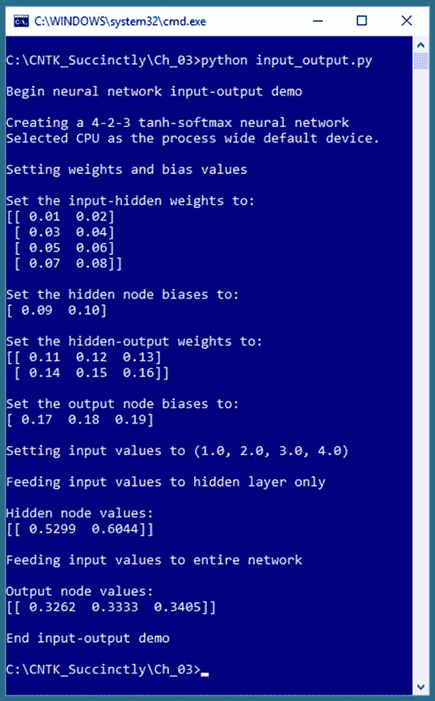
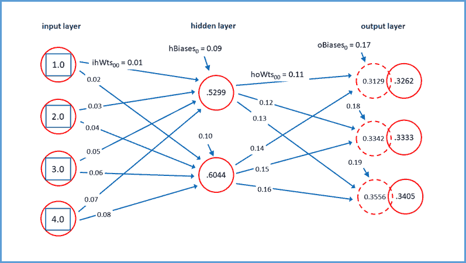
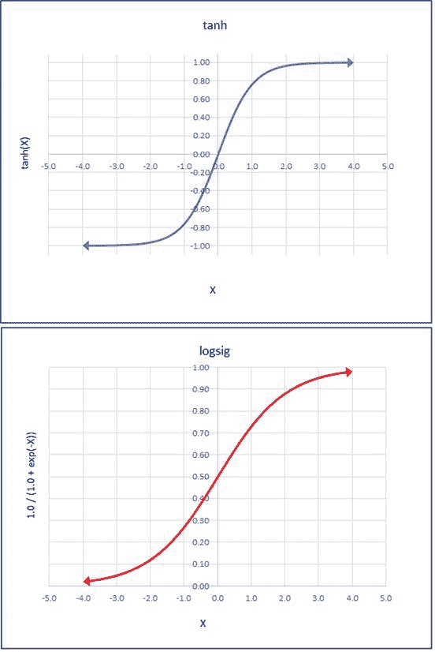

# 第三章基本概念

为了有效地使用 CNTK 深度学习代码库函数，您必须对少数几个关键的机器学习概念有基本的掌握。本章解释了神经网络体系结构和输入输出、误差和精度、数据编码和标准化、批处理和在线训练、模型过拟合和训练测试验证。图 3-1 中的截图让您了解了本章的内容。



图 3-1:神经网络输入输出

## 神经网络架构

代码清单 3-1 展示了生成图 3-1 所示输出的程序。代表演示程序神经网络的图表如图 3-2 所示。

代码清单 3-1:神经网络输入输出机制

```py
  #
  input_output.py
  #
  demo the NN input-output mechanism
  #
  CNTK 2.3

  import numpy as np
  import cntk as C

  print("\nBegin neural network
  input-output demo \n")
  np.set_printoptions(precision=4,
  suppress=True,

  formatter={'float': '{: 0.2f}'.format})

  i_node_dim
  = 4
  h_node_dim
  = 2
  o_node_dim
  = 3

  X
  = C.ops.input_variable(i_node_dim, np.float32)
  Y
  = C.ops.input_variable(o_node_dim, np.float32)

  print("Creating a 4-2-3
  tanh-softmax neural network")
  h
  = C.layers.Dense(h_node_dim, activation=C.ops.tanh,

  name='hidLayer')(X)
  o
  = C.layers.Dense(o_node_dim, activation=C.ops.softmax,

  name='outLayer')(h)
  nnet
  = o

  print("\nSetting weights and bias
  values")
  ih_wts
  = np.array([[0.01, 0.02],

              [0.03, 0.04],

  [0.05, 0.06],

  [0.07, 0.08]], dtype=np.float32)

  h_biases
  = np.array([0.09, 0.10])

  ho_wts
  = np.array([[0.11, 0.12, 0.13],

  [0.14, 0.15, 0.16]], dtype=np.float32)

  o_biases
  = np.array([0.17, 0.18, 0.19], dtype=np.float32)

  h.hidLayer.W.value
  = ih_wts
  h.hidLayer.b.value
  = h_biases
  o.outLayer.W.value
  = ho_wts
  o.outLayer.b.value
  = o_biases

  print("\nSet the input-hidden
  weights to: ")
  print(h.hidLayer.W.value)
  print("\nSet the hidden node biases
  to: ")
  print(h.hidLayer.b.value)
  print("\nSet the hidden-output
  weights to: ")
  print(o.outLayer.W.value)
  print("\nSet the output node biases
  to: ")
  print(o.outLayer.b.value)

  print("\nSetting input values to
  (1.0, 2.0, 3.0, 4.0)")
  x_vals
  = np.array([1.0, 2.0, 3.0, 4.0], dtype=np.float32)

  np.set_printoptions(formatter={'float': '{: 0.4f}'.format})
  print("\nFeeding input values to
  hidden layer only ")
  h_vals
  = h.eval({X: x_vals})
  print("\nHidden node values:")
  print(h_vals)

  print("\nFeeding input values to
  entire network ")
  y_vals
  = nnet.eval({X: x_vals})
  print("\nOutput node values:")
  print(y_vals)

  print("\nEnd input-output demo
  ")

```

演示程序从导入`numpy`和`cntk`包开始。`set_printoptions()`功能禁止用科学记数法打印非常小的值(如 1.23e-6)，并指示`print()`将浮点值精确显示为两位小数。

接下来，演示准备创建一个神经网络:

I _ node _ dim = 4
h _ node _ dim = 2
o _ node _ dim = 3
T3】X = c . ops . input _ variable(I _ node _ dim，np.float32)
Y = c . ops . input _ variable(o _ node _ dim，NP . float 32)

前三个语句指定了输入、隐藏和输出节点的数量。接下来的两个语句设置了一个 CNTK 类型的`Variable`对象(`X`)来保存来自数据源的输入数据，通常是训练数据的文本文件，以及第二个`Variable`对象(`Y`)来保存来自训练数据的已知的、正确的输出值。函数名`input_variable()`可能有点混乱——“输入”是指从数据源输入到程序中，不一定是输入到神经网络中。

现在演示可以创建一个神经网络:

print("创建 4-2-3 tanh-softmax 神经网络")
h = C.layers.Dense(hnode_dim，activation=C.ops.tanh，
name = ' hidLayer ')(X)
o = c . layers . dense(on ode _ dim，activation=C.ops.softmax，
name = ' outLayer ')(h)
nnet = o



图 3-2:神经网络架构

`Dense()`功能用于创建隐藏节点或输出节点的完全连接层，但不创建输入节点。语法有点奇怪。`X` `Variable`对象作为隐藏层`h`的输入，`h`作为输出层`o`的输入。演示创建了输出层的别名`nnet`，只是为了可读性——神经网络的输出在概念上与网络相同。

注意`X`其实并不是网络的一层。如果您想要创建一个显式输入层，您可以编写:

I = X
h = c . layers . dense(h _ node _ dim，激活=C.ops.tanh，
name = ' hidLayer ')(I)
o = c . layers . dense(o _ node _ dim，激活=C.ops.softmax，
name = ' outLayer ')(h)
nnet = o #或 nnet = C.ops.alias(o)

隐藏层被赋予一个`name`属性。这是可选的，但在某些情况下很有用。隐藏层配置为使用`tanh`(双曲正切)激活。激活功能将在本章的下一节中解释。输出层也分配了一个名称，并配置为使用`softmax`激活。`nnet`对象是输出图层的别名，可以省略。您也可以使用`alias()`功能，如代码注释所示。

接下来，演示程序设置权重和偏差。在图 3-2 的图表中，连接一个节点和另一个节点的每个蓝色箭头代表一个称为权重的数字常数。有 4 * 2 = 8 个输入到隐藏权重和 2 * 3 = 6 个隐藏到输出权重。每个指向隐藏或输出节点的蓝色短箭头是一个特殊的权重，称为偏差。有 2 + 3 = 5 个偏差。一般来说，对于具有`ni`输入节点、`nh`隐藏节点和`no`输出节点的全连接神经网络，总共会有(`ni`*`nh`)+(`nh`*`no`)+(`nh`+`no`)个权重和偏差。

该演示设置了输入到隐藏权重和隐藏节点偏差，如下所示:

ih_wts = np.array([[0.01，0.02]，
[0.03，0.04]，
[0.05，0.06]，
[0.07，0.08]]，dtype = NP . float 32)

h _ bias = NP . array([0.09，0.10])

权重被放入一个 NumPy 数组样式的矩阵中。行索引表示输入节点的索引，列索引是隐藏节点的索引。例如，[2，1]处的值为 0.06，是连接输入节点[2]和隐藏节点[1]的权重。

该演示以相同的方式设置了隐藏到输出的权重和输出节点偏差:

ho_wts = np.array([[0.11，0.12，0.13]，
[0.14，0.15，0.16]]，dtype=np.float32)

o _ bias = NP . array([0.17，0.18，0.19]，dtype = NP . float 32)

接下来，将权重和偏差值复制到神经网络中:

h . hidlayer . w . value = ih _ wts
h . hidlayer . b . value = h _ bias
o . outlayer . w . value = ho _ wts
o . outlayer . b . value = o _ bias

要访问 CNTK 神经网络中的权重，演示程序使用以下模式:

图层 _ 对象.图层 _ 名称。w 值

使用图层`name`属性在以前版本的 CNTK 中是必需的，但是现在您可以直接使用一个`Layer`对象，例如:

h.w 值= ih_wts
h.b .值= h _ bias
o . w .值= ho_wts
o.b .值= o _ biases

演示可以直接设置权重和偏差值，而不是将权重和偏差值放入 NumPy 数组，然后将这些值传输到神经网络中。例如:

h.W.value = np.array([[0.01，0.02]，
[0.03，0.04]，
[0.05，0.06]，
[0.07，0.08]]，dtype=np.float32)

使用 CNTK 时，您有很大的灵活性。总的来说，这很好，但是因为有许多方法可以执行大多数任务，所以理解 CNTK 文档示例比只有一种方法来执行任务要困难一些。

## 神经网络输入输出机制

创建神经网络并设置其权重和偏差值后，代码清单 3-1 中的演示程序会创建一些输入节点值，并将这些值反馈给网络:

print(" \ n 将输入值设置为(1.0，2.0，3.0，4.0)")
x_vals = np.array([1.0，2.0，3.0，4.0]，dtype = NP . float 32)
NP . set _ print options(格式化程序= { ' float ':{ 0.4f })。format})

打印(" \ n 仅将输入值输入到隐藏层")
h_vals = h.eval({X: x_vals}) #或仅 h.eval(x_vals)
打印(" \nHidden 节点值:")
打印(h_vals)

打印(" \ n 将输入值输入到整个网络")
y _ vals = nnet . eval({ X:X _ vals })
打印(" \ n

这段代码有点微妙。对`h.eval()`的调用使用数组`x_vals`中的值创建一个以`X`为键的匿名字典对象，然后使用输入到隐藏权重和`tanh`激活函数计算隐藏节点值并返回到数组`h_vals`中。使用字典是可选的，您可以直接传递数组。对`nnet.eval()`的调用接受`x_vals`中的值，将其转移到匿名字典对象中，重新计算隐藏节点的值，然后计算输出节点的值，然后返回到数组`y_vals`中。演示没有使用`Y`对象。典型地，`Y`保存来自一组训练数据的已知的、正确的输出节点值。

概括地说，当你创建一个神经网络时，你可以很容易地使用`Layer`对象的`W`和`b`属性来访问权重和偏差的值。没有简单的方法可以访问隐藏层和输出层节点的值——您必须使用调用应用于`Layer`对象的`eval()`函数的返回值。

神经网络的输入输出机制并不像看起来那么复杂，最好用例子来解释。假设输入值为(1.0，2.0，3.0，4.0)，权重和偏差值如图 3-2 所示。最顶端的隐藏节点值为 0.5299，计算如下:

h[0]= tanh((1.0)(0.01)+(2.0)(0.03)+(3.0)(0.05)+(4.0)(0.07)+0.09)
= tanh(0.01+0.06+0.15+0.28+0.09)
= tanh(0.59)
= 0.5299

换句话说，计算每个输入值及其相关权重的乘积之和，加上偏差，然后取和的双曲正切值。

在计算隐藏节点值之后，它们被用来计算输出节点。输出节点的初始值为(0.3129，0.3342，0.3556)，计算公式如下:

pre_o[0] = （0.5299）（0.11） + （0.6044）（0.14） + 0.17
= 0.0583 + 0.0846 + 0.17
= 0.3129

pre_o[1] = （0.5299）（0.12） + （0.6044）（0.15） + 0.18
= 0.0636 + 0.0907 + 0.18
= 0.3342

pre_o[2] = （0.5299）（0.13） + （0.6044）（0.16） + 0.19
= 0.0689 + 0.0967 + 0.19
= 0.3556

换句话说，你只需要计算隐藏节点和相关权重的乘积之和，然后加上相关的偏差值。

计算初步节点值后，使用 softmax 函数将它们强制求和为 1.0。(注意:在本例中，初步节点值的总和几乎等于 1.0，但这只是巧合，大多数情况下初步节点值的总和不会接近 1.0)。

Softmax 最好用例子来解释。softmax 函数应用于初步输出节点值，如下所示:

o[0]= exp(0.3129)/[exp(0.3129)+exp(0.3342)+exp(0.3556)]
= 1.3674/(1.3674+1.3969+1.4270)
= 1.3674/4.1913
= 0.3262

o[1]= exp(0.3342)/[exp(0.3129)+exp(0.3342)+exp(0.3556)]

这些是最终的输出值。因为它们的总和为 1.0，所以可以粗略地解释为概率。换句话说，一组值之一的软最大值是该值的`exp()`除以所有值的`exp()`之和。`exp(x)`函数是欧拉数(约 2.71828)升至`x`。

单隐层神经网络最常用的两个激活函数是双曲正切(`tanh`)和 logistic sigmoid (logsig 或仅`sigmoid`)。这两个函数的曲线图如图 3-3 所示。这些功能密切相关。数学`tanh`函数接受从负无穷大到正无穷大的任何实数值，并返回-1.0 到+1.0 之间的值。`logsig(x) = 1.0 / (1.0 + exp(-x))`函数接受任何实际值，并返回 0.0 到 1.0 之间的值。



图 3-3:Tanh 和 LogSig 激活函数

在实践中，对于相对简单的神经网络，两种激活函数通常给出类似的结果，但是`tanh`比`sigmoid`更经常用于隐藏层激活。CNTK 支持的其他不太常见的激活功能包括`softplus`、`relu`(校正线性单位)、`leaky_relu`、`param_relu`(参数化`relu`)和`selu`(缩放指数线性单位)。

## 编码和归一化

神经网络只直接处理数字数据。必须对非数字数据进行编码。数值数据应该经常被标准化(也称为缩放)，以便数值的大小大致相同。假设您有一些训练数据，如下所示:

27 42，000.00 自由派
56 68，000.00 保守派
37 94，000.00 温和派

目标是根据一个人的年龄和收入预测政治倾向。你应该将年龄和收入预测值标准化，这样相对较大的收入就不会淹没年龄。有三种常见的规范化技术。第一种技术没有标准的名称，它只是将所有值乘以或除以适当的 10 次方。例如，您可以将所有年龄值除以 10，将所有收入值除以 10，000:

2.7 4.20 自由派
5.6 6.80 保守派
3.7 9.40 温和派

另一种技术叫做最小-最大归一化。对于每个预测变量，可以用(最大值)/(最大-最小值)替换一个值。例如，对于三个原始年龄值，最大值= 56，最小值= 27。37 的归一化年龄值为(37 - 27) / (56 - 27) = 0.3448。最小-最大标准化数据为:

0.0000 1.0000 自由派
1.0000 0.5000 保守派
0.3448 0.0000 温和派

使用最小-最大归一化，所有归一化值将在 0.0 和 1.0 之间，其中 0.0 是最小原始值的归一化值，1.0 是最大值。

第三种技术称为 z 分数(或高斯或正态)归一化。对于每个预测变量，用(值-平均值)/(标准偏差)替换该值。例如，对于原始年龄值，平均值为 40.0，标准偏差为 12.03。37 的归一化年龄值为(37 - 40.0) / 12.03 = -0.2494。z 分数标准化数据将是:

-1.0808 -1.2247 自由派
1.3303 0.0000 保守派
-0.2494 1.2247 温和派

使用 z-score 归一化，归一化值通常在-10.0 和+10.0 之间，其中正值大于平均值，负值小于平均值，0.0 是平均值。

根据经验，当所有预测变量的所有值都具有相同的数量级时，我使用 10 的幂除归一化，因为该技术很简单，并且保留了原始数据的符号。当底层数据可能是高斯分布时，我使用 z 分数归一化。当我不能使用 10 的幂或 z 分数归一化时，我使用 min-max 归一化。

有几种方法可以对非数字预测值/特征值进行编码，但只有一种标准方法可以对非数字类标签值进行编码。假设您有一些训练数据，如:

女 2.5 民主党白人
男 4.0 共和党红色
女 3.1 民主党白银
男 5.3 独立黑人
男 2.9 民主党白银

目标是根据一个人的性别(男性或女性)、年龄和政治派别(民主党、共和党或独立党)来预测他们的汽车颜色(黑色、红色、银色或白色)。对非数字预测值进行编码的最常见方式是使用所谓的 1/N-1 编码。对于可能只是两个可能值之一的预测变量，可以编码为-1 或+1。

预测变量可以是三个或更多值的 1/1(N-1)技术最好用例子来解释。对于前面显示的政治派别数据，您可以将民主党编码为(1，0)，将共和党编码为(0，1)，将独立党编码为(-1，-1)。

假设一个预测变量可以是一项调查的五个分类值之一:糟糕、薄弱、一般、良好和优秀。你可以编码可怕的= (1，0，0，0)，弱的= (0，1，0，0)，平均的= (0，0，1，0)，好的= (0，0，0，1)，优秀的= (-1，-1，-1，-1)。一般来说，要对可以取 N 个值之一的分类变量进行编码，可以使用 N-1 个值，其中一个值是 1，其他值是 0，但最后一个分类值被编码为全 1 个值。

对非数字类标签(要预测的值)进行编码几乎总是使用所谓的 1/N(也称为“一热”)编码。如果类标签可以是三个或更多分类值中的一个，则使用 N 个值，其中一个值是 1，其他值是 0。对于上面汽车颜色可以是(黑色、红色、银色、白色)的数据，您可以编码黑色= (1、0、0、0)、红色= (0、1、0、0)、银色= (0、0、1、0)和白色= (0、0、0、1)。

N 选 1 编码背后的想法是，你将设计一个神经网络，使它输出 N 个值，这些值之和为 1.0，可以解释为概率。假设输出是(0.20，0.55，0.15，0.10)，那么因为最大概率是 0.55，所以预测映射到(0，10，0)，这是红色的编码。

概括地说，如果原始的原始汽车数据是:

女 2.5 民主党白人
男 4.0 共和党红色
女 3.1 民主党白银
男 5.3 独立黑人
男 2.9 民主党白银

那么编码数据将是:

1 2.5 1 0 0 0 1
-1 4.0 0 1 0 1 0 0
1 3.1 1 0 0 1 0 1 0
-1 5.3-1-1 1 0 0
-1 2.9 1 0 1 0 0 1 0

当要预测的值是二进制时，会出现一种特殊情况。您可以使用(1，0)和(0，1)正常编码，也可以编码为 0 或 1 的单个值。第 5 章讨论了二进制分类和对类标签值进行编码的两种类型。

对训练数据进行规范化和编码通常既耗时又烦人。CNTK 库没有任何内置的规范化和编码功能。熊猫(“面板数据”库)和 sci kit-learn(“sci kit 机器学习”)等库确实有这样的功能，但这些库有着不平凡的学习曲线。通常，您必须使用多种技术进行数据预处理。

## 平方误差和交叉熵误差

你可以把神经网络想象成一个复杂的数学函数。神经网络的行为由其输入值、权重和偏差值以及激活函数决定。确定权重和偏差的值称为训练网络。其思想是使用一组具有已知输入值和已知正确输出值的训练数据，然后使用一些算法来找到权重和偏差的值，从而使计算的输出值和已知正确输出值之间的误差最小化。

使用 CNTK 时，必须指定使用哪种误差度量、使用哪种学习算法以及一次使用多少个训练项。训练中最常见的两种误差度量形式是平方误差和交叉熵误差(也称为对数损失)。代码清单 3-2 中的演示程序展示了如何计算平方误差和交叉熵误差。

代码清单 3-2:平方误差和交叉熵误差

```py
  #
  error_demo.py
  #
  CNTK 2.3, Anaconda 4.1.1

  import numpy as np
  import cntk as C

  targets
  = np.array([[1, 0, 0],

  [0, 1, 0],

  [0, 0, 1],

  [1, 0, 0]], dtype=np.float32)

  computed
  = np.array([[7.0, 2.0, 1.0],

  [1.0, 9.0, 6.0],

  [2.0, 1.0, 5.0],

  [4.0, 7.0, 3.0]], dtype=np.float32)

  np.set_printoptions(precision=4,
  suppress=True)

  print("\nTargets = ")
  print(targets,
  "\n")

  sm
  = C.ops.softmax(computed).eval()  # apply softmax to computed values
  print("\nSoftmax applied to
  computed = ")
  print(sm)

  N
  = len(targets)  # 4
  n
  = len(targets[0])  # 3

  sum_se
  = 0.0
  for i in
  range(N):  # each item
    for j in range(n):  

  err = (targets[i,j] - sm[i,j]) * (targets[i,j] - sm[i,j])

  sum_se += err  #
  accumulate
  mean_se
  = sum_se / N
  print("\nMean squared error from
  scratch = %0.4f" %
  mean_se)

  mean_se
  = C.losses.squared_error(sm, targets).eval() / 4.0
  print("\nMean squared error from
  CNTK = %0.4f" %
  mean_se)

  sum_cee
  = 0.0
  for i in
  range(N):  # each item 
    for j in range(n):

  err = -np.log(sm[i,j]) * targets[i,j]

  sum_cee += err  #
  accumulate
  mean_cee
  = sum_cee / N
  print("\nMean cross-entropy error
  w/ softmax from scratch = %0.4f" % mean_cee)

  sum_cee
  = 0.0
  for i in
  range(N):

  err = C.losses.cross_entropy_with_softmax(computed[i].reshape(1,3), \

  targets[i].reshape(1,3)).eval()

  sum_cee += err
  mean_cee
  = sum_cee / N
  print("\nMean cross-entropy error
  w/ softmax from CNTK = %0.4f" % mean_cee)

```

演示程序首先从一个假设的训练数据集中设置四个目标项目:

targets = np.array([[1，0，0]，
[0，1，0]，
[0，0，1]，
[1，0，0]]，dtype=np.float32)

您可以想象这对应于四个 1/N 编码的类标签项。接下来，演示设置假设的关联原始(在`softmax`之前)计算输出值:

computed = np.array([[7.0，2.0，1.0]，
[1.0，9.0，6.0]，
[2.0，1.0，5.0]，
[4.0，7.0，3.0]]，dtype=np.float32)

请注意，行值的总和不是 1.0。接下来，演示将`softmax`应用于原始计算输出值:

sm = C.ops.softmax(已计算)。eval()
打印(" \nSoftmax 应用于 computed = ")
打印(sm)

结果是:

[[0.9909 0.0067 0.0025]
[0.0003 0.9523 0.0474]
[0.0466 0.0171 0.9362]
[0.0466 0.9362 0.0171]]

请注意，现在每行的总和为 1.0，并且保持了最小到最大的顺序。演示程序从头开始计算均方误差和平均交叉熵误差，只使用 Python，然后使用 CNTK 函数。关键是，在大多数情况下，您会希望使用内置的 CNTK 函数，但是如果您需要一个自定义的错误度量，您可以毫不费力地实现它。

为了理解代码，手动计算均方误差和平均交叉熵误差是很有用的。均方误差可以手工计算为:

【(0.9909-1)^2+(0.0067-0)^2+(0.0025-0)^2+
)】( 0.0003-0)^2+(0.9523-1)^2+(0.0474-0)^2+
)(0.0466-0)^2+(0.0171-0)^2+(0.9362-1)2+
(0.0466-1)2+(0.9362-0)2+】

换句话说，计算每个项目的平方误差，加上平方误差项，除以项目数。演示准备从头开始计算均方误差:

N = len(目标)# 4
n = len(目标[0]) # 3

然后，演示使用`i`作为索引遍历每一行，并使用`j`作为索引计算该行的平方误差，即目标值和软最大值之间的平方差之和。然后累加总和，并将累加的总和除以 4:

sum_se = 0.0
对于 i in range(N): #每个项目
对于 j in range(n):
err = (sm[i，j] -目标[i，j]) * (sm[i，j] -目标[i，j])
sum_se += err #累加
mean_se = sum_se / N
打印(\nMean 从头开始的平方误差= % 0.4f % % mean _ se)

演示程序这一部分的输出与手工计算的结果相匹配:

从头开始的均方误差= 0.4492

请注意，如果所有 softmax 输出值完全等于目标值，均方误差将为零。一个项目的最大可能平方误差是 1.0，因此，一组项目的最大可能均方误差是 1.0。接下来，演示程序使用内置的 CNTK `squared_error()`函数计算均方误差，如下所示:

均方误差=碳损失平方误差(sm，目标)。eval() / 4.0
打印(\ n 来自 CNTK 的平方误差= % 0.4f % % mean _ se)

如您所料，输出与之前的计算和输出相匹配:

CNTK 的均方误差= 0.4492

注意`squared_error()`可以对全矩阵进行运算，而不是一次一行，而且因为`squared_error()`是 CNTK `Function`类型，所以必须调用`eval()`函数。

对于任意两个长度相同的向量，均可计算出平方误差。交叉熵是一种特殊形式的误差，仅适用于两组概率，换句话说，两个向量具有相同的长度，并且其值之和为 1.0。如果您有一组预测概率和一组实际概率，交叉熵误差将计算为预测值与实际值的对数乘积之和的负值。

例如，假设一组预测概率为(0.10，0.60，0.30)，对应的一组实际概率为(0.15，0.50，0.35)。交叉熵误差为:

CEE =-[log(0.10)* 0.15+log(0.60)* 0.50+log(0.30)* 0.35]
=-(-0.3453+-0.2554+-0.4214)
= 1.0222

在分类问题中，softmax 输出值的总和为 1.0，可以解释为概率，目标向量将由一个 1 值和其余 0 值组成，因此也可以解释为概率集。例如，演示程序中的第一个 softmax 项为(0.9909，0.0067，0.0025)，对应的目标向量为(1，0，0)。交叉熵误差为:

CEE =-(log(0.9909)* 1+log(0.0067)* 0+log(0.0025)* 0]
=-(-0.0091+0+0)
= 0.0091

请注意，对于分类问题，除了一项之外，交叉熵误差都将消失。演示程序使用以下语句从头开始计算假设分类数据的交叉熵误差:

范围内 I 的 sum _ CEE = 0.0
(N):#范围内 j 的每个项目
(N):
err =-NP . log(sm[i，j]) *目标[I，j]
sum_cee += err #累加
mean_cee = sum_cee / N
打印(" \nMean 交叉熵误差 w/ softmax 从头开始= %0.4f" % mean_cee)

演示代码紧跟手工计算。输出结果是:

平均交叉熵误差 w/ softmax 从头开始= 0.7975

演示程序计算平均交叉熵误差的方式略有不同:

范围内 I 的 sum _ CEE = 0.0
(N):#每个项目
err = c . loss . cross _ entropy _ with _ soft max(计算出的[i]。重塑(1，3)，\
目标[i]。重塑(1，3))。eval()
sum _ CEE+= err
mean _ CEE = sum _ CEE/N
打印(\ N 来自 CNTK 的交叉熵误差 w/soft max = % 0.4f“% mean _ CEE”)

输出结果是:

来自 CNTK 的平均交叉熵误差 w/soft max = 0.7975

与`squared_error()`不同，它可以很容易地计算多个项目(在一个矩阵中)，`cross_entropy_with_softmax()`一次处理一个项目更容易。此外，有点令人惊讶的是，CNTK v2.3 没有简单的交叉熵误差函数——只有`cross_entropy_with_softmax()`。这意味着函数需要原始的、预软最大值。请注意，该功能接受`computed`而不是`sm`。

`reshape()`功能是必需的细节。因为`computed`是一个 4 ^ 3 矩阵，`computed[i]`是一个数组的第`i`行。`cross_entropy_with_softmax()`函数需要一个矩阵，所以，数组被转换成一个 1 3 的矩阵。

总而言之，当您训练一个 CNTK 模型时，您必须指定使用哪个错误函数。两个主要选项是`squared_error()`和`cross_entropy_with_softmax()`。对于三个或三个以上类别标签的分类问题，可以使用任一错误函数，但建议使用`cross_entropy_with_softmax()`。对于二进制分类问题，如果设置单输出节点的模型，应该使用特殊的`binary_cross_entropy()`函数，但是如果设置双输出节点的模型，建议使用`cross_entropy_with_softmax()`。如果使用`crosss_entropy_with_softmax()`，一定要记住不要明确应用`softmax`，这样就不会应用两次。对于所有回归问题，建议使用`squared_error()`。

## 随机梯度下降

假设您正在训练一个模型，其中一个权重当前的值为 2.58。对于给定的训练数据项，您将输入值输入模型并计算输出值。然后，使用一个误差函数来确定所谓的梯度，梯度是一个数字，它指示计算的输出值与已知的正确输出值之间的距离以及方向。假设梯度为+1.84。如果将权重调整(通常通过减法)一个分数，称为学习率(通常由希腊字母 eta 表示，看起来像一个脚本小写字母“n”)，那么计算的输出值将变得稍微接近目标输出值。假设学习率为 0.01，那么新的权重值为 2.58-(1.84)(0.01)= 2.58-0.0184 = 2.5616。

随机梯度下降是一个复杂的话题，但 CNTK 为您处理了大部分细节。典型的 CNTK 代码如下所示:

batch _ size = 10
learn _ rate = 0.01
leader = C . SGD(nnet . parameters，learn _ rate)
Trainer = C . Trainer(nnet，(tr_loss，tr_clas)，【leader】)
。。。
curr _ batch = rdr . next _ minibatch(batch _ size，input _ map = my _ input _ map)
train _ minibatch(curr _ batch)

当使用随机梯度下降来训练神经网络时，该技术通常被称为*反向传播*。除了基本的`sgd()`函数之外，CNTK 还有几个高级变体，包括`adam()`(“自适应矩估计”)和`rmsprop()`(“均方根传播”)。

当使用任何形式的随机梯度下降时，您必须在在线训练(处理一个训练数据项后更新权重)、批量训练(处理所有训练项后更新权重)或小批量训练(处理所有训练项的子集后更新权重)之间进行选择。在高级伪代码中，在线培训是:

*循环最大迭代次数
针对每个训练项目
计算输出值
计算梯度
使用梯度更新每个权重和偏置值
结束针对
结束循环*

在伪代码中，批处理训练是:

*循环最大迭代次数
为每个训练项目设置所有累积梯度= 0
计算输出值
计算梯度
累积梯度
结束为
使用累积梯度更新每个权重和偏差值
结束循环*

在神经网络的早期，批量训练是最常用的。然后在线培训变得更加普遍。目前最常用的是小批量训练。CNTK 库函数使您可以轻松尝试所有三种方法。

设定学习率的值主要是一个反复试验的问题。很小的学习速度会让训练变得非常非常慢。过高的学习率会使训练完全失败。一种处理学习率大小问题的技术叫做*动量*。使用动量增加了每次重量更新的推动力。这意味着你可以使用相对较小的学习率，学习率会有效地自动为你增加。CNTK 有一个基本动量的`momentum_sgd()`功能，还有一个`nesterov()`功能，是动量的高级版本。

在前面的伪代码示例中，请注意训练是一个迭代过程。您可能会猜测，您可以执行的训练迭代越多越好。然而，情况并非总是如此。如果你过度训练一个模型，你可能会得到模型过度拟合。在这种情况下，训练数据的误差非常小(分类模型的精度也很高)，但是当出现新的、以前看不到的数据时，模型的预测能力很差。

有几种方法可以减少过度拟合的可能性。事实证明，过拟合通常与权重和偏置值有关，它们具有很大的幅度。正则化是一种限制权重和偏差大小的技术。有两种主要的正规化形式，命名为 L1 和 L2。L1 正则化倾向于导致一些接近零的权重值(有效地丢弃它们相关的输入节点)，而 L2 正则化倾向于导致所有权重和偏差值都很小，但是很少非常接近零。您可以提供 L1 或 L2 正则化信息作为参数，例如:

学习者= C.sgd(nnet.parameters，learn_rate，l2 _ regularization _ weight = 0.10)

另一种用于限制过拟合的技术叫做*训练-验证-测试*。使用正常的训练-测试，您将所有可用的训练数据分为一个训练集(通常约 80%的可用数据项)和一个测试集(剩余的 20%)。您使用训练数据来训练您的模型，然后将测试数据集馈送给训练好的模型。测试数据上的训练模型的精度是对新的、以前未见过的数据的精度的非常粗略的估计。

使用 train-validate-test 技术，您可以将所有可用的训练数据分为三组:一个训练集(通常约 80%的项目)、一个验证集(10%的项目)和一个测试集(10%的项目)。您使用训练数据集训练模型，但是每隔几个训练迭代，您就将验证数据馈送给模型。在某个时间点，验证数据的误差可能开始增加而不是减少，这表明可能发生模型过拟合。您可以停止训练，然后根据测试数据评估模型。训练-验证-测试技术是一种元启发式方法，不是一种定义明确的算法。CNTK 没有任何直接支持列车验证测试的内置功能。

## 碳纳米管库组织

从技术上讲，CNTK 是一个 Python 包。CNTK 被组织成 13 个高级子包和 8 个子模块(更小的子包)。其中最常用的 10 种如表 3-1 所示。

表 3-1:最重要的碳纳米管封装

| **包装** | **描述** |
| --- | --- |
| cntk.io | 读取数据的功能，例如:`next_minibatch()` |
| cntk 层 | 创建神经层的高级功能，例如:`Dense()` |
| cntk .学员 | 训练功能，例如:`sgd()` |
| cntk .损失 | 测量训练误差的函数，例如:`squared_error()` |
| cntk.metrics | 测量模型误差的函数，例如:`classification_error()` |
| cntk . ops | 低级功能，例如:`input_variable()`和`tanh()` |
| 随机的 | 生成随机数的函数，例如:`normal()`和`uniform()` |
| CNT 火车 | 训练功能，例如:`train_minibatch()` |
| cntk.initializer | 模型参数初始值设定项，例如:`normal()`和`uniform()` |
| CNT 变量 | 低级构造，例如:`Parameter()`和`Variable()` |

请注意，一些函数名出现在多个包中；例如，cntk.random 和 cntk.initializer 包都有`normal()`和`uniform()`函数。这些重复是相对罕见的，实际上你应该不会在区分重复的函数名上有任何困难。

用 Python 代码编写 CNTK 时，你不可或缺的资源就是 [API 文档](https://cntk.ai/pythondocs/cntk.html)。因为 CNTK v2 太新了，所以网上很少有好的代码示例。然而，这将随着碳纳米管的使用增加而改变。

编写 CNTK 代码并不容易，你会遇到问题。当我得到一个错误时，作为一般的经验法则，我的第一个动作是确定违规对象的类型，例如:

t = type(foo)
print(t)

然后我将在 API 引用中查找该类型。CNTK 程序中最常见的错误来源之一是矩阵或数组的形状不正确。大多数 CNTK 对象都是 NumPy 多维数组。您可以使用 NumPy `shape`属性来确定对象的形状，例如:

shp = foo.shape
列印(shp)

在一些罕见的情况下，您可能需要更改对象的形状。为此，您可以使用 NumPy `reshape()`功能。注:在本电子书中，我使用了术语*功能*和*方法*，以及术语*变量*和*对象*，或多或少可以互换。

## 运动

以代码清单 3-1 中的程序为指导，编写一个 CNTK 程序，创建一个具有逻辑 sigmoid 隐藏层激活和 softmax 输出层激活的 3-2-4 神经网络。将输入到隐藏权重设置为:

[[0.01，0.02]，
[0.03，0.04]，
[0.05，0.06]]

将隐藏到输出权重设置为:

[[0.07，0.08，0.09，0.10]，
[0.11，0.12，0.13，0.14]]

将隐藏节点偏置值设置为[0.15，0.16]，将输出节点偏置值设置为[0.17，0.18，0.19，0.20]。

计算输入值的输出值= [2.0，4.0，6.0]。

答案:[0.2414，0.2470，0.2528，0.2588]