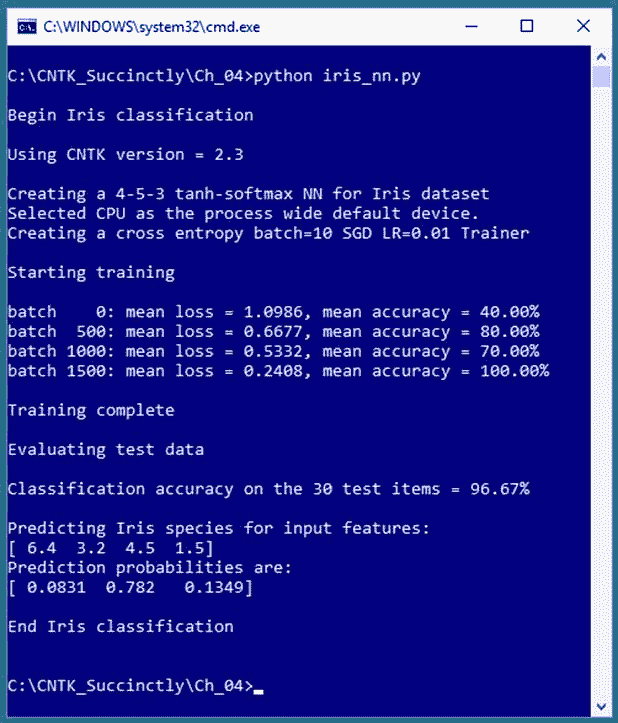
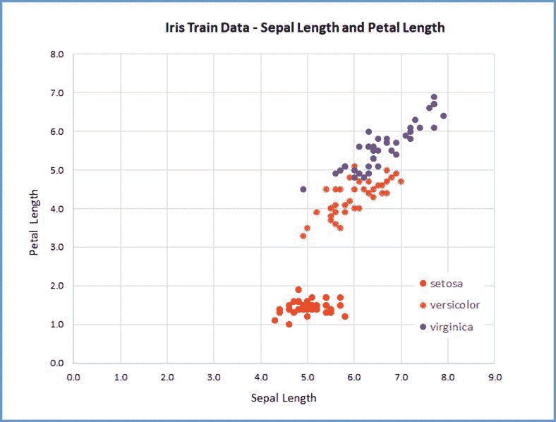

# 第四章神经网络分类

本章说明如何使用 CNTK 执行分类。看看图 4-1，看看这一章的方向。问题是基于四个预测变量(萼片长度、萼片宽度、花瓣长度和花瓣宽度)来预测鸢尾花(*濑户花*、*云芝*或*海滨花*)的种类。萼片是一种叶状结构。



图 4-1:使用 CNTK 的虹膜数据集分类

预测一个分类值通常被称为*分类*，而不是预测一个数值，后者通常被称为*回归*问题。请注意，第 2 章中解释的逻辑回归既是一种回归技术(要预测的值是 0.0 到 1.0 之间的数字概率)，也是一种分类技术(预测概率被映射到两个分类值之一，如“男性”或“女性”)。

示例程序创建了一个 4-5-3 神经网络，即一个具有四个输入节点(每个预测值一个)、五个隐藏处理节点(隐藏节点的数量必须通过反复试验来确定)和三个输出节点(因为有三个可能的物种)。神经网络在隐藏节点使用 tanh 激活，在输出节点使用 softmax 激活。

用于训练的基本误差函数是交叉熵，而不是主要的替代误差平方。神经网络使用小批量方法在 120 个训练项目上训练，一次 10 个训练项目，2000 次迭代。在训练过程中，平均误差/损失逐渐减小，分类精度大多增加，表明训练是有效的。

训练完成后，将训练好的模型应用于 30 个以前未见过的测试数据项。该模型的准确率为 96.67%(30 个正确预测中的 29 个)。该程序最后使用训练好的模型来预测预测值(6.4，3.2，4.5，1.5)的物种。预测概率为(0.0831，0.7820，0.1349)，映射到(0，1，0)，这是*彩叶鸢尾*物种的编码。

## 准备虹膜数据训练和测试文件

费希尔的虹膜数据创建于 20 世纪 30 年代，可以说是机器学习中最著名的数据集。有 150 个数据项。原始数据如下所示:

5 . 1 . 3 . 5 1 . 4 0 . 2 锯木厂
4.9 3.0 1.4 0.2 锯木厂
。。。
7 . 0 3 . 2 4 . 7 1 . 4 verse color
6 . 4 3 . 2 4 . 5 1.5 verse color
。。。
6 . 3 . 3 6 . 0 2.5 处女
5 . 8 2 . 7 5 . 1 . 9 处女

每行的前四个值是萼片长度、萼片宽度、花瓣长度和花瓣宽度。每一行的最后一个值是物种。这三种各有 50 种。示例程序使用 CNTK 可以有效使用的格式的数据。该数据如下所示:

| attribs 5.1 3.5 1.4 0.2 |物种 1 0 0
| attribs 4.9 3.0 1.4 0.2 |物种 1 0 0
。。。
|属性 7.0 3.2 4.7 1.4 |物种 0 1 0
|属性 6.4 3.2 4.5 1.5 |物种 0 1 0
。。。
|属性 6.3 3.3 6.0 2.5 |物种 0 0 1
|属性 5.8 2.7 5.1 1.9 |物种 0 0 1

`|attribs`和`|species`标记分别标记特征值和类标签值的开始。每行都用空格分隔。特征值不需要归一化，因为它们的大小大致相同。物种标签是 N 的 1(也称为一热)编码的。

你可以使用任何你想要的标签名。您可以使用标签机制添加项目标识号或注释，例如:

| ID 001 | attribs 5.1 3.5 1.4 0.2 |物种 1 0 0 | # setosa
| ID 002 | attribs 4.9 3.0 1.4 0.2 |物种 1 0 0 |#
。。。
| ID 041 | attribs 7.0 3.2 4.7 1.4 |物种 0 1 0 |#云芝
。。。

150 个项目的数据集被分成 120 个项目的训练集(每个物种的前 40 个)和 30 个项目的保持测试集(每个物种的剩余 10 个)。CNTK 格式的培训和测试数据可以在本电子书的附录中找到。

因为有四个特征，所以用图表表示数据是不可行的。但是，您可以通过检查二维图，根据萼片长度和花瓣长度，大致了解数据的结构，如图 4-2 所示。



图 4-2:虹膜数据

## 分类程序

代码清单 4-1 给出了生成图 4-1 所示输出的程序代码。该程序首先定义了一个`create_reader()`助手函数，可以处理 CNTK 格式的数据文件:

def create_reader(path，input_dim，output_dim，rnd_order，sweeps):
# rnd_order - >通常为 True 用于训练
# sweeps - >通常为 C.io.INFINITELY _ REPEAT for 用于训练 OR 1 用于 eval
x _ strm = c . io . streamdef(field = ' attribs '，shape=input_dim，is_sparse = False)
y _ strm = c . io . streamdef(field = ' species '，shape=output_dim，is _ sparse

helper 函数中有很多内容，但是对于大多数分类问题，您可以将代码视为样板，您唯一需要更改的是对 CNTK 文件中标签名称的引用，在本例中为`attribs`和`species`。

代码清单 4-1:鸢尾花分类

```py
  #
  iris_nn.py
  #
  CNTK 2.3 with Anaconda 4.1.1 (Python 3.5, NumPy 1.11.1)

  #
  Use a one-hidden layer simple NN with 5 hidden nodes
  #
  iris_train_cntk.txt - 120 items (40 each class) 
  #
  iris_test_cntk.txt - remaining 30 items

  import numpy as np
  import cntk as C

  def create_reader(path, input_dim, output_dim, rnd_order, sweeps):
    # rnd_order -> usually True for
  training
    # sweeps -> usually
  C.io.INFINITELY_REPEAT for training OR 1 for eval

  x_strm = C.io.StreamDef(field='attribs',
  shape=input_dim, is_sparse=False)

  y_strm = C.io.StreamDef(field='species',
  shape=output_dim, is_sparse=False)

  streams = C.io.StreamDefs(x_src=x_strm, y_src=y_strm)

  deserial = C.io.CTFDeserializer(path,
  streams)

  mb_src = C.io.MinibatchSource(deserial, randomize=rnd_order, max_sweeps=sweeps)
    return mb_src
  #
  ==================================================================================
  def main():

  print("\nBegin
  Iris classification \n")

  print("Using
  CNTK version = " +
  str(C.__version__)
  + "\n")

  input_dim = 4

  hidden_dim = 5

  output_dim = 3

  train_file = ".\\Data\\iris_train_cntk.txt"

  test_file = ".\\Data\\iris_test_cntk.txt"

    # 1\. create network

  X = C.ops.input_variable(input_dim, np.float32)

  Y = C.ops.input_variable(output_dim, np.float32)

  print("Creating
  a 4-5-3 tanh-softmax NN for Iris dataset ") 
    with C.layers.default_options(init=C.initializer.uniform(scale=0.01, seed=1)):

  hLayer = C.layers.Dense(hidden_dim, activation=C.ops.tanh,

  name='hidLayer')(X)  

  oLayer = C.layers.Dense(output_dim, activation=None,

  name='outLayer')(hLayer)

  nnet = oLayer

  model = C.ops.softmax(nnet)

    # 2\. create learner and trainer

  print("Creating
  a cross entropy batch=10 SGD LR=0.01 Trainer \n")

  tr_loss = C.cross_entropy_with_softmax(nnet, Y)  # not model!

  tr_clas = C.classification_error(nnet, Y)

  max_iter = 2000 

  batch_size = 10 

  learn_rate = 0.01 

  learner = C.sgd(nnet.parameters, learn_rate)

  trainer = C.Trainer(nnet, (tr_loss, tr_clas), [learner])

    # 3\. create reader for train data

  rdr = create_reader(train_file, input_dim, output_dim,

  rnd_order=True, sweeps=C.io.INFINITELY_REPEAT)

  iris_input_map = {

  X : rdr.streams.x_src,

  Y : rdr.streams.y_src

  }

    # 4\. train

  print("Starting
  training \n")
    for i in range(0, max_iter):

  curr_batch = rdr.next_minibatch(batch_size,
  input_map=iris_input_map)

  trainer.train_minibatch(curr_batch)

  if i % 500 == 0:

  mcee = trainer.previous_minibatch_loss_average

  macc = (1.0 - trainer.previous_minibatch_evaluation_average) * 100

  print("batch
  %4d: mean loss = %0.4f, mean accuracy = %0.2f%% " \

  % (i, mcee, macc))

  print("\nTraining
  complete")

    # 5\. evaluate model using test data

  print("\nEvaluating
  test data \n")

  rdr = create_reader(test_file, input_dim, output_dim,

  rnd_order=False, sweeps=1)

  iris_input_map = {

  X : rdr.streams.x_src,

  Y : rdr.streams.y_src

  }

  num_test = 30

  all_test = rdr.next_minibatch(num_test, input_map=iris_input_map)

  acc = (1.0 - trainer.test_minibatch(all_test)) * 100

  print("Classification
  accuracy on the 30 test items = %0.2f%%" % acc)

    # (could save model here - see text)

    # 6\. use trained model to make
  prediction
    np.set_printoptions(precision = 1)

  unknown = np.array([[6.4, 3.2, 4.5, 1.5]],
  dtype=np.float32)  # (0 1 0)

  print("\nPredicting
  Iris species for input features: ")

  print(unknown[0])

    # pred_prob = model.eval({X:
  unknown})

  pred_prob = model.eval(unknown)  # simple form works too
    np.set_printoptions(precision = 4, suppress=True)

  print("Prediction
  probabilities are: ")

  print(pred_prob[0])

  print("\nEnd
  Iris classification \n ")

  #
  ==================================================================================

  if __name__ == "__main__":

  main()

```

程序执行从设置神经网络的架构参数和数据文件的位置开始:

def main():
print(" \ nBegin Iris 分类\n")
print("使用 CNTK version =+str(c . _ _ version _)+" \ n ")
input _ dim = 4
hidden _ dim = 5
output _ dim = 3
train _ file =。\ \ Data \ \ iris _ train _ cntk . txt "
test _ file = "。\\Data\\iris_test_cntk.txt"
。。。

神经网络输入节点和输出节点的维数由您的数据结构决定，但隐藏节点的数量是一个自由参数(通常称为*超参数*，必须通过反复试验来确定)。数据文件放在数据子目录中。使用 CNTK 时，标准方法是为代码创建一个根项目目录，其中包含数据和模型子目录。

接下来，分类程序创建未经训练的神经网络:

# 1.创建网络
X = c . ops . input _ variable(input _ dim，NP . float 32)
Y = c . ops . input _ variable(output _ dim，np.float32)

打印(“为 Iris 数据集创建 4-5-3 tanh-soft max NN”)
带有 c . layers . default _ options(init = c . initializer . uniform(scale = 0.01，seed = 1)):
hllayer = c . layers . density(hidden _ dim，activation=C

使用`Dense()`函数创建隐藏层节点和输出层节点，该函数将一层中的所有节点完全连接到另一层。语法很不寻常。类型为 CNTK `Variable`的`X` 对象充当`hLayer`对象(隐藏层)的输入，`hLayer`对象充当`oLayer`对象(输出层)的输入。

隐藏层使用`tanh`激活，这通常(但不总是)比逻辑 sigmoid`C.ops.sigmoid()`功能执行得好一点。如果您有其他深度学习库的经验，您可能会惊讶于输出层没有使用激活函数，或者等效地说，使用了标识函数。许多其他深度学习库有一个普通的交叉熵误差函数用于训练。有点不寻常的是，从 2.3 版本开始，CNTK 有一个`cross_entropy_with_softmax()`函数，但是没有简单的交叉熵函数。因此，在训练过程中，你必须使用`cross_entropy_with_softmax()`，它需要原始的、非软的最大值。如果您将 softmax 应用于输出层，则在训练期间，softmax 将应用两次。这并没有中断训练，但由于有趣的技术原因，softmax 的双重应用往往会显著减慢训练速度。

这解释了为什么不希望将`softmax`应用于输出层节点。但是，当需要使用神经网络进行评估或进行预测时，通常需要应用`softmax`。因此，示例程序创建了一个用于训练的`nnet`对象和一个用于评估或预测的`model`对象。

Python `with`语句是一种快捷方式，可用于将指定值应用于网络的多个层。在这种情况下，`init`参数值意味着所有权重都被初始化为介于-0.01 和+0.01 之间的统一随机值。该示例没有使用相关的`init_bias`参数，因此所有偏差都被初始化为 0.0。神经网络通常对初始值高度敏感，因此如果训练失败，首先要尝试的一件事是不同的初始化算法。`uniform()`初始化的一些常见替代方法是`normal()`、`glorot_normal()`和`glorot_uniform()`。

在创建了双未训练模型之后，示例程序设置了一个`Learner`算法对象，然后使用它来创建一个`Trainer`训练对象:

# 2.创建学习者和培训师
打印(“创建交叉熵批次=10 SGD LR=0.01 培训师\ n)”
tr _ loss = c . cross _ entropy _ with _ soft max(nnet，Y) #未建模！
tr _ class = c . class _ error(nnet，Y)
max_iter = 2000

batch _ size = 10
learn _ rate = 0.01
leader = C . SGD(nnet . parameters，learn _ rate)
Trainer = C . Trainer(nnet，(tr_loss，tr_clas)，[leader])

如前所述，训练的是`nnet`对象，而不是`model`对象。`tr_loss`对象为训练指定了交叉熵误差，而不是主要的替代项，平方误差。创建`tr_clas`对象是为了在训练期间自动计算分类误差(错误预测的百分比)。

`learner`对象是使用`sgd()`函数创建的随机梯度下降对象，具有恒定的固定学习速率，这是最简单的可能算法。CNTK 库有大量复杂的学习算法，其中许多非常复杂。例如，使用 CNTK `fsadagrad()`(“专用自适应梯度”)函数，学习算法可以被编码为:

max _ ITER = 2000
batch _ size = 10
lr _ schedule = C . learning _ parameter _ schedule _ per _ sample([(1000，0.05)，(1，0.01)]
mom _ sch = C . momentum _ schedule([(100，0.99)，(0，0.95)]，batch _ size)
leader = C . fsadagrad(nnet . parameters，lr=lr_schedule，momentum=mom_sch)
trainer =

当高级学习算法工作时，它们可以很好地工作。但是您还有许多额外的免费参数需要处理。作为一般的经验法则，我建议你先尝试`sgd()`，只有当你有充分的理由这样做时(比如反复训练失败，或者已知的研究结果)，才求助于奇异的学习算法。

创建`Trainer`对象后，示例程序调用程序定义的`create_reader()`函数为训练数据创建一个`Reader`:

# 3.为列车数据创建读取器
rdr = create _ reader(train _ file，input_dim，output_dim，
rnd_order=True，sweeps = c . io . infinity _ REPEAT)
iris _ input _ map = {
X:rdr . streams . X _ src，
Y : rdr.streams.y_src
}

在训练神经网络时，您希望以随机顺序访问训练数据，以便训练不会陷入某种振荡模式和停滞。扫描参数设置为 CNTK 整数常数`INFINITELY_REPEAT` (18，446，744，073，709，551，615)，以便多次访问训练项目。

`iris_input_map`对象是字典集合，容易搞糟。请注意，结肠左侧有 CNTK `Variable`对象(`X`和`Y`)，结肠右侧有来自对`StreamDefs()`函数的调用的赋值接收器(`x_src`和`y_src`)。但是，和以前一样，您可以考虑这个代码样板，只需将地图名称(`iris_input_map`)替换为与您的分类问题相关的内容。

接下来，示例分类程序像这样训练网络:

# 4.train
print(" Starting training \ n ")
为 i in range(0，max _ ITER):
curr _ batch = rdr . next _ minibatch(batch _ size，input _ map = iris _ input _ map)
trainer . train _ minibatch(curr _ batch)
if I % 500 = = 0:
mcee = trainer . previous _ minibatch _ loss _ average
macc =(1.0-trainer . previous _ minibatch _ evaluation _ average)* *

`next_minibatch()`函数从训练数据文件(本例中为 10)中获取一批训练项，并从`iris_input_map`对象提供的信息中知道特征值在哪里，类标签值在哪里。对`train_minibatch()`的召唤几乎太简单了——所有真正的工作都是在召唤的准备中完成的。

在训练中监控错误/损失很重要，因为训练失败是很常见的，所以你想尽早发现它。示例程序每 500 次迭代/小批量显示 10 个训练项目的刚刚使用的小批量的平均交叉熵误差，以及这 10 个项目的分类精度。CNTK 库在日志包中有一个内置的`ProgressPrinter`类。我的许多同事喜欢并使用`ProgressPrinter`对象，但我更喜欢使用自定义代码创建日志消息。

在使用 120 个项目的训练数据的训练完成之后，示例程序基于保留的 30 个项目的测试数据评估训练模型的分类精度:

# 5.使用测试数据评估模型
打印(" \ ne 评估测试数据\ n ")
rdr = create _ reader(test _ file，input_dim，output_dim，
rnd_order=False，sweeps = 1)
iris _ input _ map = {
X:rdr . streams . X _ src，
Y:rdr . streams . Y _ src
}
num _ test = 30
all _ test = rdr . next _ minibatch(num _ t)

测试数据的`Reader`指定测试数据文件的位置，并将`False`传递给`rnd_order`参数，因为不需要以随机顺序处理测试数据来确定分类精度。`sweeps`参数设置为 1，因为您只想访问每个测试项目一次。

对`next_minibatch()`的调用将返回所有测试项目，因为`num_test`变量被设置为 30，即测试项目的数量。`test_minibatch()`函数返回分类误差，在我看来，这并不像分类精度那样是一个自然的度量，所以示例程序根据误差计算精度，并使用 0%到 100%的格式打印精度，在这种情况下是 96.67%(30 个正确中的 29 个)。

有时准确地看到哪些数据项被正确和错误地预测是有用的。您可以浏览测试数据并获得如下详细信息:

对于范围内的 I(0，num _ test):
curr _ item = rdr . next _ minibatch(1，input _ map = iris _ input _ map)
X = curr _ item[X]。asarray()[0] # (1，4)
y = curr_item[Y]。asarray()[0] # (1，3)
p_prob = model.eval(x) #预测概率
p _ class = NP . arg max(p _ prob[0])#预测的 class 0、1 或 2
a_class = np.argmax(y) #实际的 class 0、1 或 2
打印(x，end = ")
如果 p_class == a_class: #如果预测的 class ==实际的 class
打印(“正确”)

代码比乍看起来要复杂一些。`next_minibatch()`的第一个参数是 1，所以读者一次取一个测试项目。`curr_item`对象为类型`dict`，必须通过`X`或`Y`对象作为关键，然后将结果投射到一个(三维)数组，然后剥离第一维得到一个 1 4 或 1 3 矩阵。

在评估了训练好的模型的准确性之后，示例程序显示了如何对新的、以前看不到的数据进行预测:

# 6.使用训练好的模型进行预测
np.set_printoptions(精度= 1，抑制=True)
未知= np.array([[6.4，3.2，4.5，1.5]]，dtype = NP . float 32)#(0 1 0)
print(" \ n 预测输入特征的鸢尾种类:")
print(未知[0])
pred_prob = model.eval(未知)
np.set_printoptions(精度= 4

注意`unknown`是一个 1 4 的矩阵，由双方括号表示，而不是一个数组，因为`eval()`函数需要一个矩阵作为输入。返回预测概率结果是一个 1 3 矩阵，因此示例程序显示行[0]，这是唯一的一行。

## 保存并加载训练好的模型

因为 Iris 数据集只有 150 个项目，训练一个神经网络分类器模型只需要几秒钟。然而，在非演示场景中，在大数据集上进行训练可能需要几个小时甚至几天。你通常想要保存你训练过的模型，这样你就不必从头再训练。

您可以这样保存训练好的模型:

mdl = "。\ \ Models \ \ iris _ nn . model "
model . save(MDL，format=C.ModelFormat.CNTKv2)

传递给`save()`的第一个参数只是一个文件名，可能包含一个路径。没有要求的文件扩展名，但是`.model`是常见的，有意义。`format`参数有默认值`ModelFormat.CNTKv2`，所以可以省略。另一种方法是使用开放神经网络交换格式:`model.save(mdl, format=ONNX)`。

回想一下，训练程序创建了一个`nnet`对象(输出没有软最大化)和一个`model`对象(输出有软最大化)。您通常希望保存训练模型的软最大版本，但是如果您愿意，也可以保存非软最大网络对象。

加载保存的 CNTK 模型非常容易，如代码清单 4-2 中的短程序所示。你所要做的就是使用`load()`功能。

代码清单 4-2:加载保存的模型

```py
  #
  iris_load.py
  #
  CNTK 2.3

  import numpy as np
  import cntk as C

  print("Loading saved Iris
  model")
  model
  = C.ops.functions.Function.load(".\\Models\\iris_nn.model")

  np.set_printoptions(precision = 1,
  suppress=True)
  unknown
  = np.array([[6.4, 3.2, 4.5, 1.5]],
  dtype=np.float32)  # (0 1 0)
  print("\nPredicting Iris species
  for input features: ")
  print(unknown[0])

  pred_prob
  = model.eval(unknown)
  np.set_printoptions(precision = 4,
  suppress=True)
  print("Prediction probabilities
  are: ")
  print(pred_prob[0])

  print("\nDone \n")

```

加载已保存的模型后，可以像训练模型一样使用模型。注意对`save()`和`load()`的调用有点不对称；`save()`是`Function`对象上的方法，`load()`是`Function`类的静态方法。

## 深度神经网络

深度神经网络没有标准定义，但一般来说，这个术语意味着任何具有两个或更多隐藏层的神经网络架构。例如:

带 c . layers . default _ options(init = c . initializer . uniform(scale = 0.01，seed = 1)):
hllayer 1 = c . layers . density(hidden _ dim，activation=C.ops.tanh，
name = ' hidlayer 1 ')(X)
hllayer 2 = c . layers . density(hidden _ dim，activation=C.ops.tanh，
name = ' hidden _ dim '(hllayer 1)
oLayer = c . layer . density(output _ dim，activation)

从理论上讲，松散地说，一个只有一个隐藏层的神经网络可以计算一个有两个或更多隐藏层的网络可以计算的任何模型(受某些条件的限制)。这被称为普遍近似定理，或者有时被称为赛本科定理。但实际上，对于复杂的数据集，使用多个隐藏层有时可以产生更好的预测模型。然而，请注意，对于相对简单的数据，深度神经网络有时实际上会生成比具有单个隐藏层的网络更差的模型。

深度神经网络的陷阱之一是，与只有一个隐藏层的网络相比，它们更容易过度拟合。降低深度神经网络中过拟合可能性的一种常见技术是插入一个或多个脱落层。当应用丢弃时，层中指定比例的节点被随机丢弃，这意味着在训练期间，在每次迭代中，学习算法本质上假装丢弃的节点不存在。为什么辍学经常会防止过度拟合是一个复杂的话题，还没有完全理解，但这是一个具有深度神经网络的标准技术。

例如，以下代码在两个隐藏层之间插入一个缺失层:

带 c . layers . default _ options(init = c . initializer . uniform(scale = 0.01，seed = 1)):
hllayer 1 = c . layers . dense(hidden _ dim，activation=C.ops.tanh，
name = ' hidlayer 1 ')(X)
dllayer = c . layers . drop layer(0.20，name = ' drop layer ')(hllayer 1)
hllayer 2 = c . layers . dense(hidden _ dim，activation=C.ops.tanh，

在此示例中，丢弃应用于第一个隐藏层中的节点。

CNTK 库有一个`Sequential()`功能，可以作为语法替代，而不是手动将层链接在一起。例如:

模型= c . layers . sequential([
c . layers . dense(40，激活=C.ops.tanh)，
C.layers.Dense(20，激活=C.ops.sigmoid)，
c . layers . drop(0.25)，
C.layers.Dense(3，激活=C.ops.softmax)]

CNTK 库还有一个`For()`方法，可以通过编程生成多个图层。让我强调一下`Sequential()`和`For()`仅仅是语法糖机制，所以它们不提供额外的功能。

## 运动

使用代码清单 4-1 中的程序作为指南，为小麦种子数据集创建、训练和评估神经网络分类预测模型。

小麦种子数据集是一个众所周知的基准。可以在这里找到。有 210 个项目。每个项目都有七个预测值，后面跟着各种小麦，编码为 1 =卡马，2 =罗莎，3 =加拿大。每个品种有 70 个。制表符分隔的原始数据如下所示:

15.26 14.84 0.871 5.763 3.312 2.221 5.22 1

14.88 14.57 0.8811 5.554 3.333 1.018 4.956 1
。。。
12.3 13.34 0.8684 5.243 2.974 5.637 5.063 3

当您创建训练和测试数据集时，我建议使用 150 个项目进行训练，60 个项目进行测试。如果将预测变量的值归一化，将会得到更好的结果。别忘了编码种子品种值。