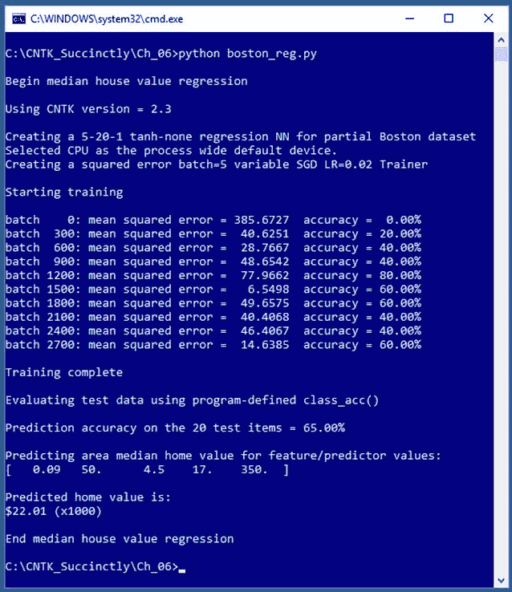
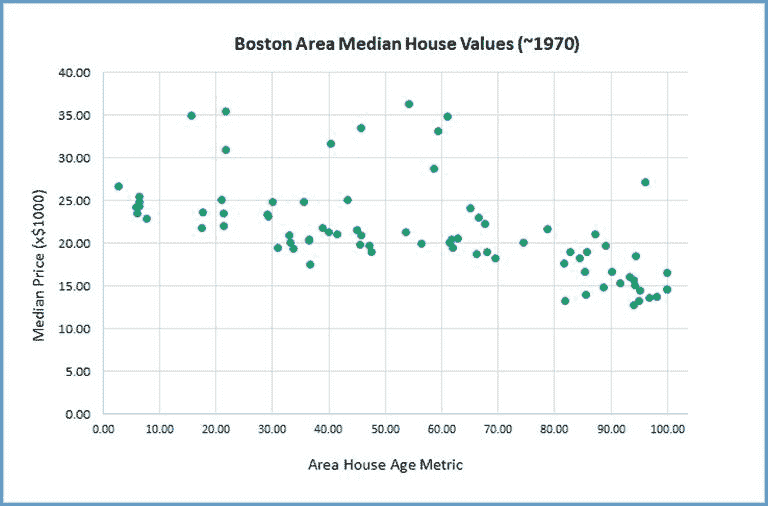

# 第六章神经网络回归

回归问题的目标是从一个或多个预测变量中预测数值。例如，假设您想预测波士顿附近 100 个城镇中的一个城镇的房子的中值。您拥有的数据包括每个城镇的犯罪统计数据、每个城镇的房屋年龄、每个城镇到波士顿的距离度量、每个城镇的师生比、每个城镇的种族人口统计数据以及每个城镇的房屋价值中位数。使用前五个预测变量，您希望创建一个模型来预测房屋价值中位数。



图 6-1:中位数家庭价值回归

您可以沿着`Y = a0 + (a1)(crime) + (a2)(age) + (a3)(distance) + (a4)(ratio) + (a5)(racial)`的线创建线性回归模型，其中`Y`是预测中值，`a0`是常数，`a1`到`a5`是与五个预测变量相关联的常数。另一种通常可以创建更精确预测模型的方法是使用神经网络。

## 准备波士顿地区房价数据

波士顿地区房屋价值数据集是一个著名的基准集合，可以追溯到 1978 年的一篇研究论文。整个数据集有 14 个属性/变量和 506 个实例。你可以在这里找到完整的数据集[。为了简单起见，图 6-1 所示的演示程序只使用了 14 个属性中的 6 个(5 个作为预测值，1 个作为预测值)，以及 100 个实例(80 个训练和 20 个测试)。](https://archive.ics.uci.edu/ml/machine-learning-databases/housing/)

要预测的价值是城镇或人口普查区域的房价中位数。第一个预测因素是城镇或美国人口普查区域的人均犯罪率，所以你会认为较小的值与较高的房价相关联。第二个是 1940 年以前建造的自住单元的比例，所以较大的值意味着较旧，但是较旧的房子是否会与较高的房价或较低的房价相关联并不明显。第三个预测因素是该镇到五个波士顿就业中心的加权距离。第四个预测因素是地区学校的师生比。第五个预测因素是该镇黑人居民比例的间接指标(`= 1000 * (proportion_Black - 0.63)^2`)，所以你会认为较高的值与较低的房屋价值相关联。要预测的价值是房屋价值的中位数除以 1000，例如 25.50 意味着 25500 美元——1978 年房屋的价格要低得多。

使用完整数据集的前 80 项，我创建了一个 80 项的制表符分隔的训练数据文件，如下所示:

|预测因子 1.612820 96.90 3.76 21.00 248.31 | med val 13.50
|预测因子 0.064170 68.20 3.36 19.20 396.90 | med val 18.90
|预测因子 0.097440 61.40 3.38 19.20 377.56 | med val 20.00
。。。

我还用同样的格式创建了一个 20 项的测试集。你可以在这本电子书的附录中找到这两个数据集。因为有五个预测变量，所以不可能对数据集进行图形化，但是您可以通过图 6-2 中的图形了解数据的结构。该图绘制了 80 项训练集，x 轴为年龄属性(1940 年前建造的房屋比例)，y 轴为房屋价值中位数。线性回归将在数据中间拟合出一条几乎水平的线，这意味着无论年龄大小，预测方程都将预测房屋价值中位数约为 22.50，从而导致预测模型不佳。

为了简单起见，我没有对数据进行规范化，但这是一个绝对应该规范化的数据示例。请注意，种族预测变量(值为 396.55)比犯罪变量(值为 0.0131)大得多。一个简单的方法是缩放所有的预测变量，使大多数在 1.0 到 10.0 之间——你可以将犯罪乘以 10，将年龄除以 10，不考虑距离，将比率除以 10，将种族除以 100。

另一种方法是使用最小-最大归一化，或 z 分数归一化。事实上，一些实验表明，所有三种形式的标准化给出了一个明显更好的预测模型。



图 6-2:部分波士顿地区房价中位数数据

在数据集包含大量变量的情况下，其中一些变量可能对预测模型没有用处，而包含一些变量实际上可能会创建一个比忽略这些变量更糟糕的模型。确定使用和不使用哪些预测变量，称为特征选择。

## 神经网络回归程序

代码清单 6-1 给出了生成图 6-1 中截图所示输出的程序代码。导入所需的 NumPy 和 CNTK 包后，演示程序定义了一个助手函数，用于将 CNTK 格式文件中的数据读取到一个小型批处理对象中:

def create_reader(path，input_dim，output_dim，rnd_order，sweeps):
# rnd_order - >通常为 True 用于训练
# sweeps - >通常为 C.io.INFINITELY _ REPEAT for 用于训练 OR 1 用于 eval
x _ strm = c . io . streamdef(field = ' predictioners '，shape=input_dim，is _ sparself = False)
y _ strm = c . io . streamdef(field = ' med val '，shape=output_dim，is _ sparself

您可以将这个助手函数中的代码视为神经网络回归问题的样板。因为 CNTK 这么新，发展这么快，有时候文档和代码不同步，比如我在写这本电子书的时候，文档没有提到`StreamDefs()`功能。不清楚`StreamDefs()`是被弃用了，还是只是从文档中遗漏了。

如果对返回结果`streams`应用`type()`函数，您将看到它是类型`cntk.variables.Record`，因此您可以编码为:

`streams = C.variables.Record(x_src=x_strm, y_src=y_strm)`

使用 Python `type()`函数检查 CNTK 对象是不可缺少的调试技术。

代码清单 6-1:神经网络回归

```py
  #
  boston_reg.py
  #
  CNTK 2.3 with Anaconda 4.1.1 (Python 3.5, NumPy 1.11.1)

  #
  Predict median value of a house in an area near Boston based on area's
  #
  crime rate, age of houses, distance to Boston, pupil-teacher
  #
  ratio, percentage black residents
  #
  boston_train_cntk.txt - 100 items 
  #
  boston_test_cntk.txt - 20 items

  import numpy as np
  import cntk as C

  def create_reader(path, input_dim, output_dim, rnd_order, sweeps):
    # rnd_order -> usually True for
  training
    # sweeps -> usually
  C.io.INFINITELY_REPEAT for training OR 1 for eval

  x_strm = C.io.StreamDef(field='predictors', shape=input_dim, is_sparse=False)

  y_strm = C.io.StreamDef(field='medval',
  shape=output_dim, is_sparse=False)

  streams = C.io.StreamDefs(x_src=x_strm, y_src=y_strm)
    # streams =
  C.variables.Record(x_src=x_strm, y_src=y_strm)

  deserial = C.io.CTFDeserializer(path,
  streams)

  mb_src = C.io.MinibatchSource(deserial, randomize=rnd_order, max_sweeps=sweeps)
    return mb_src

  def mb_accuracy(mb, x_var, y_var, model, delta):

  num_correct = 0

  num_wrong = 0

  x_mat = mb[x_var].asarray()  # batch_size x 1 x features_dim

  y_mat = mb[y_var].asarray()  # batch_size x 1 x 1

    # for i in range(mb[x_var].shape[0]): 
  # each item in the batch
    for i in range(len(mb[x_var])):

  v = model.eval(x_mat[i])           # 1 x 1 predicted value

  y = y_mat[i]                       # 1 x 1 actual value

  if np.abs(v[0,0] - y[0,0]) <  delta:  # close
  enough?

  num_correct += 1

  else:

  num_wrong += 1
    return (num_correct * 100.0) / (num_correct + num_wrong)

  #
  ==================================================================================

  def main():

  print("\nBegin
  median house value regression \n")

  print("Using
  CNTK version = " +
  str(C.__version__)
  + "\n")

  input_dim = 5  # crime,
  age, distance, pupil-teach, black

  hidden_dim = 20

  output_dim = 1  #
  median value (x$1000)

  train_file = ".\\Data\\boston_train_cntk.txt"

  test_file = ".\\Data\\boston_test_cntk.txt"

    # data resembles:
    # |predictors  0.041130  33.50 
  5.40  19.00  396.90  |medval  28.00
    # |predictors  0.068600  62.50 
  3.50  18.00  393.53  |medval    33.20

    # 1\. create network

  X = C.ops.input_variable(input_dim, np.float32)

  Y = C.ops.input_variable(output_dim, np.float32)

  print("Creating
  a 5-20-1 tanh-none regression NN for partial Boston dataset ") 
    with C.layers.default_options(init=C.initializer.uniform(scale=0.01, seed=1)):

  hLayer = C.layers.Dense(hidden_dim, activation=C.ops.tanh,

  name='hidLayer')(X)  

  oLayer = C.layers.Dense(output_dim, activation=None,

  name='outLayer')(hLayer) 

  model = C.ops.alias(oLayer)  # alias

    # 2\. create learner and trainer

  print("Creating a
  squared error batch=5 variable SGD LR=0.02 Trainer \n")

  tr_loss = C.squared_error(model, Y) 

  max_iter = 3000 

  batch_size = 5 

  base_learn_rate = 0.02 

  sch = C.learning_parameter_schedule([base_learn_rate,
  base_learn_rate/2],

  minibatch_size=batch_size,

  epoch_size=int((max_iter*batch_size)/2))

  learner = C.sgd(model.parameters, sch) 

  trainer = C.Trainer(model, (tr_loss), [learner]) 

    # 3\. create reader for train data

  rdr = create_reader(train_file, input_dim, output_dim,

  rnd_order=True, sweeps=C.io.INFINITELY_REPEAT)

  boston_input_map = {

  X : rdr.streams.x_src,

  Y : rdr.streams.y_src

  }

    # 4\. train

  print("Starting
  training \n")
    for i in range(0, max_iter):

  curr_batch = rdr.next_minibatch(batch_size, input_map=boston_input_map)

  trainer.train_minibatch(curr_batch)

  if i % int(max_iter/10) == 0:

  mcee = trainer.previous_minibatch_loss_average 

  acc = mb_accuracy(curr_batch, X, Y, model, delta=3.00)  # program-defined

  print("batch %4d:
  mean squared error = %8.4f  accuracy = %5.2f%%" \
  %
  (i, mcee, acc))

  print("\nTraining
  complete")

    # 5\. evaluate test data (cannot use
  trainer.test_minibatch)

  print("\nEvaluating
  test data using program-defined class_acc() \n")

  rdr = create_reader(test_file, input_dim, output_dim,

  rnd_order=False, sweeps=1)

  boston_input_map = {

  X : rdr.streams.x_src,

  Y : rdr.streams.y_src

  }

  num_test = 20

  all_test = rdr.next_minibatch(num_test,
  input_map=boston_input_map)

  acc = mb_accuracy(all_test, X, Y, model, delta=3.00)

  print("Prediction
  accuracy on the 20 test items = %0.2f%%" % acc)

    # (could save model here)

    # 6\. use trained model to make
  prediction
    np.set_printoptions(precision = 2, suppress=True)

  unknown = np.array([[0.09, 50.00, 4.5, 17.00,
  350.00]], dtype=np.float32) 

  print("\nPredicting
  area median home value for feature/predictor values: ")

  print(unknown[0])

  pred_value = model.eval({X: unknown})

  print("\nPredicted
  home value is: ")

  print("$%0.2f
  (x1000)" %
  pred_value[0,0])

  print("\nEnd
  median house value regression ")

  #
  ==================================================================================

  if __name__ == "__main__":

  main()

```

使用神经网络回归时，您需要定义一个自定义精度函数。对于分类问题，预测不是正确就是错误。但是对于回归问题，你必须定义一个输出值正确意味着什么——多接近才足够接近？

演示程序定义了一个助手函数，该函数接受一个 CNTK 小批量对象并计算一个定制的精度度量。定义开始于:

def mb_accuracy(mb，x_var，y_var，model，delta):
num _ correct = 0
num _ error = 0

该函数接受训练数据的 CNTK 小批量对象、要评估的模型和`delta`值，该值定义了预测输出值必须与已知的正确值有多接近才能被认为是正确的。从概念的角度来看，`x_var`和`y_var`参数不是必需的，但是它们是访问小批量对象中的数据所必需的:

x_mat = mb[x_var]。asar ray()# batch _ size x 1 x features _ dim
y _ mat = MB[y _ var]。asarray() #批处理大小 x 1 x 1

一个 CNTK 小批量对象本质上是一个 Python 字典，以 CNTK `Variable`对象为键。必须使用`asarray()`函数将这些值显式地强制转换为三维 NumPy 数组对象。

数组形状的第一维是小批量集合中的项数，因此该值可用于遍历集合。来自每个项目的输入值被馈送到回归模型，并且输出值被计算(使用当前权重和偏置值):

对于范围内的 I(MB[x _ var]。形状[0]): #批次中的每个项目
v = model.eval(x_mat[i]) # 1 x 1 预测值
y = y_mat[i] # 1 x 1 实际值
。。。

因为应用于`n` -dim NumPy 数组的`len()`函数返回第一维，所以您也可以使用`for i in range(len(mb[x_var]))`进行迭代，而不是直接使用`shape`。调用`eval()`的返回值是 1 1 矩阵。像这样的信息并不明显，最好在程序调试期间通过插入显示对象“`shape`属性的语句来确定。

`mb_accuracy()`函数计算并返回正确预测的百分比:

。。。
如果 np.abs(v[0，0] - y[0，0])<δ:#足够接近？
num _ correct+= 1
else:
num _ error+= 1
return(num _ correct * 100.0)/(num _ correct+num _ error)

另一种方法是以比例形式返回精度，如 0.6500，而不是像 65.00%这样的百分比。如果预测输出值在正确输出值的固定值范围内，您可以检查计算值是否在正确输出值的指定百分比/比例范围内，而不是将其视为正确。例如，如果预测面积中值在真实值的 10%之内，您可能需要计算预测面积中值是否正确。

演示回归程序准备创建一个神经网络，如下所示:

input_dim = 5 #犯罪、年龄、距离、瞳教、种族
hidden _ dim = 20
output _ dim = 1 #中值(X $ 1000)

X = c . ops . input _ variable(input _ dim，np.float32)
Y = c . ops . input _ variable(output _ dim，NP . float 32)

确定要使用的隐藏节点的数量没有好的经验法则。创建具有两个或更多输出节点的回归模型是可能的，但是这样的问题非常少。

该模型由以下语句创建:

带 c . layers . default _ options(init = c . initializer . uniform(scale = 0.01，seed = 1)):
hllayer = c . layers . density(hidden _ dim，activation=C.ops.tanh，
name = ' hidLayer ')(X)
oLayer = c . layers . density(output _ dim，activation=None，
name = ' outLayer '(hllayer)
model = c . ops . alias(oLayer)# alias

请注意，没有激活函数应用于单个输出节点。这有时被称为应用`Identify`函数，它只是`f(x) = x`。

学习者算法对象和训练者对象以可变的学习速率创建:

tr _ loss = C . square _ error(model，Y)
max _ ITER = 3000
batch _ size = 5
base _ learn _ rate = 0.02
sch = C . learning _ parameter _ schedule(【base _ learn _ rate，base_learn_rate/2】，
minibatch_size=batch_size，
epoch _ size = int((max _ ITER * batch _ size)/2)
leader = C . SGD(model . parameters，sch)

演示程序使用`squared_error()`，因为交叉熵不适用于回归问题。有可能扩展 CNTK 来使用一个自定义的错误函数，但这是一个超出本电子书范围的话题。

演示没有使用固定的学习速率，而是创建了一个学习速率计划，在 3000 次训练迭代的前半部分使用 0.02 的学习速率，然后在迭代的后半部分使用 0.01 的学习速率。一般来说，学习速率计划对于简单的神经网络来说不是必需的，但是对于具有许多隐藏层的深层神经网络来说，它们通常是有用的。

训练数据的阅读器以通常的方式创建:

rdr = create_reader(train_file，input_dim，output_dim，
rnd_order=True，sweeps = c . io . infinity _ REPEAT)
Boston _ input _ map = {
X:rdr . streams . X _ src，
Y : rdr.streams.y_src
}

我的一些同事更喜欢创建两个对象，比如`rdr_train`和`rdr_test`，而不是重用一个`rdr`对象进行训练和测试。

使用以下语句进行培训:

对于范围内的 I(0，max _ ITER):
curr _ batch = rdr . next _ minibatch(batch _ size，input _ map = Boston _ input _ map)
train _ minibatch(curr _ batch)
if I % int(max _ ITER/10)= 0:
mcee = trainer . previous _ minibatch _ loss _ average
ACC = MB _ ACC _ accurance(curr _ batch，X，Y，model，delta=3.00) #程序定义

就像分类一样，在回归训练中监控错误/丢失很重要，因为训练经常会以惊人的方式失败。这里，平均平方误差每隔 1/10 的指定迭代显示一次。均方误差比交叉熵误差更容易解释。假设均方误差为 25.00；那么平均绝对误差为 5.00，这意味着实际房价中位数 30.00(30，000 美元)被预测为 25.00 或 35.00。

演示程序最后对以前看不到的新预测值进行预测。预测是这样准备的:

unknown = np.array([[0.09，50.00，4.5，17.00，350.00]]，dtype = NP . float 32)# 1x 5
print(" \ n 预测区域中值用于特征/预测值:")
print(unknown[0])

预测是这样做的:

pred _ value = model . eval({ X:unknown })
print(" \ n 预测的房屋价值为:")
print($ % 0.2f(x1000)”% pred _ value[0，0])
print("\nEnd 中值房屋价值回归")

因为 Python 的允许性，你直接把未知矩阵传给`eval()`:

pred_value = model.eval(未知)

Python 语言对参数类型的松散处理不一定总是有好处的——它允许许多不同的代码编写方式，这可以在您在网上找到的一些明显不一致的代码示例中得到反映。

## 运动

使用代码清单 6-1 中的程序作为指南，为游艇流体力学数据集创建、训练和评估神经网络回归模型。你可以在这里找到原始数据[。有 308 个数据项。有六个预测值描述游艇船体的形状，后面是预测剩余阻力的值。数据如下所示:](https://archive.ics.uci.edu/ml/datasets/Yacht+Hydrodynamics)

-2.3 0.568 4.78 3.99 3.17 0.125 0.11

-2.3 0.568 4.78 3.99 3.17 0.150 0.27

-2.3 0.568 4.78 3.99 3.17 0.175 0.47
。。。

我建议通过乘以 10 来归一化第二个和第六个预测值，或者通过使用最小-最大归一化来归一化所有预测值。当你把 308 个项目拆分成一个训练集和一个测试集时，我建议用 80%进行训练(约 246 个项目)，剩下的 20% (62 个项目)进行测试。