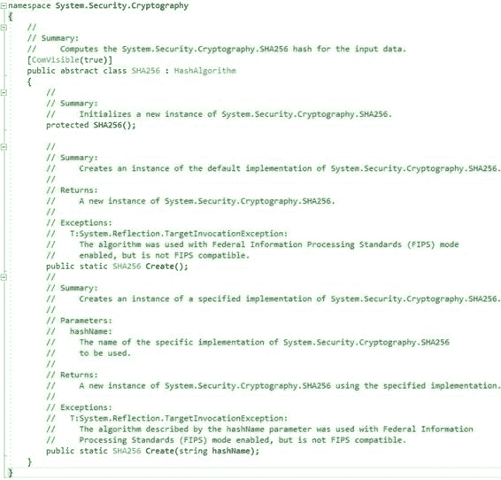
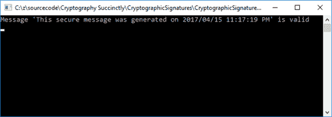
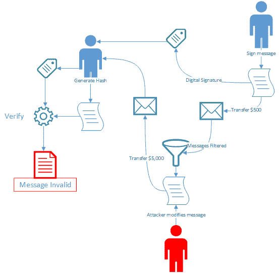
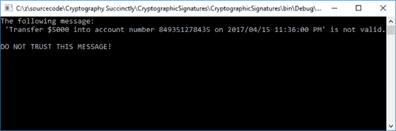

# 二、密码签名

加密签名提供了一种验证数据完整性的方法。通过使用数字签名对数据进行签名，任何人都可以验证签名，然后证明数据源自您。它还会验证信息在您签名后没有被更改。

## 生成和验证签名

生成签名时，您可能会尝试使用`String.GetHashCode`方法。然而，根本不建议这样做。`String.GetHashCode`实际上是用于基于哈希表的集合。

*   不要序列化存储在数据库中的哈希代码。
*   哈希代码不适合用作键控集合中对象检索的键。
*   不相等的对象可以有相同的哈希代码。
*   要生成加密的强哈希，请改为使用:`System.Security.Cryptography.HashAlgorithm`或`System.Security.Cryptography.KeyedHashAlgorithm`。

为了了解这是如何工作的，我们将使用 SHA256 创建一个哈希。然后，我们将创建一个容器来存储公共和私有非对称密钥。然后，我们将签名并将签名的哈希返回给调用应用程序。

为了验证签名的消息，我们将指定要使用的容器以及原始消息的哈希和数字签名。一种称为`VerifySignedMessage`的方法将验证传输消息的有效性。

|  | 注意:SHA256 是一种哈希算法，而不是加密算法。 |

首先在 Visual Studio 中创建新的控制台应用程序。在开始编写任何代码之前，请将以下命名空间添加到控制台应用程序中。

代码清单 1:添加新的名称空间

```cs
  using static System.Console;
  using
  System.Security.Cryptography;

```

`System.Security.Cryptography`命名空间将为这个应用程序提供我们需要的加密服务。命名空间提供诸如消息认证、数据编码和解码、随机数生成、哈希等服务。我们引入范围的`System.Console`静态命名空间允许我们键入更少的代码。从 C# 6.0 开始，静态类可以直接进入范围，而无需我们完全限定静态命名空间。

接下来，您需要添加一个包含容器名称的类范围属性。容器名称的功能将在后面更详细地解释。

代码清单 2:添加容器名称

```cs
  public static string ContainerName { get; private set; }

```

接下来，给`Program`类添加一个名为`SignMessage`的方法。该方法接受原始消息作为参数，并将通过`out`参数返回该消息的哈希值。

代码清单 3:添加签名消息方法

```cs
  private static byte[] SignMessage(string message, out byte[] hashValue)
  {

  }

```

在这个方法中，创建代码清单 4 中的 using 语句。

代码清单 4: SHA256Managed

```cs
  using (SHA256 sha = SHA256Managed.Create())
  {

  }

```

如前所述，SHA256 是一种哈希算法。顾名思义，SHA256 的哈希大小是 256 位。SHA256 是一个抽象类，SHA256Managed 是抽象类的唯一实现。



图 1: SHA256 抽象类

您会注意到抽象类继承自`HashAlgorithm`并公开了一个重载的`Create()`方法。事实上，继承链如图 2 所示。


图 2:继承

回到我们的代码示例，现在在 using 语句中，添加代码清单 5 中的代码。

代码清单 5: SignMessage 方法

```cs
  hashValue =
  sha.ComputeHash(Encoding.UTF8.GetBytes(message));
  CspParameters csp = new CspParameters();
  csp.KeyContainerName
  = ContainerName;
  RSACryptoServiceProvider rsa = new RSACryptoServiceProvider(csp);
  var formatter = new RSAPKCS1SignatureFormatter(rsa);
  formatter.SetHashAlgorithm("SHA256");
  return
  formatter.CreateSignature(hashValue);

```

哈希值是通过调用`ComputeHash()`方法创建的，该方法现在已经对我们传递给它的消息进行了加密哈希。`RSACryptoServiceProvider`和`DSACryptoServceProvider`类提供非对称加密。在前面的代码清单中，当我们实例化`RSACryptoServiceProvider`的新实例时，为我们生成了一个新的公钥/私钥对。

通常，非对称私钥绝不能存储在本地或本地计算机上的纯文本中。如果必须存储私钥，则必须使用**密钥容器**。当我们实例化`CspParameters`类的新实例时，我们通过将您想要使用的名称传递给`KeyContainerName`字段来创建这样一个密钥容器。这就是我们利用先前创建的`ContainerName`字段的地方。

我们现在准备使用`RSAPKCS1SignatureFormatter`创建签名，并将其返回给调用代码。我们传递给`SignMessage()`方法的消息现在被哈希和数字签名。完整的`SignMessage()`方法应该类似于代码清单 6。

代码清单 6:完全签名消息方法

```cs
  private static byte[] SignMessage(string message, out byte[] hashValue)
  {
      using (SHA256 sha = SHA256Managed.Create())
      {
          hashValue = sha.ComputeHash(Encoding.UTF8.GetBytes(message));
          CspParameters csp = new CspParameters();
          csp.KeyContainerName = ContainerName;
          RSACryptoServiceProvider rsa = new RSACryptoServiceProvider(csp);

          var formatter = new RSAPKCS1SignatureFormatter(rsa);
          formatter.SetHashAlgorithm("SHA256");
          return formatter.CreateSignature(hashValue);
      }
  }

```

哈希的消息可以通过`VerifySignedMessage()`方法验证。注意`RSAPKCS1SignatureDeformatter`对象进行数字签名的验证。

代码清单 7:验证数字签名

```cs
  private static bool VerifySignedMessage(byte[] hash, byte[] signature)
  {
      CspParameters csp = new CspParameters();
      csp.KeyContainerName = ContainerName;
      using (RSACryptoServiceProvider rsa = new RSACryptoServiceProvider(csp))
      {
          var deformatter = new RSAPKCS1SignatureDeformatter(rsa);
          deformatter.SetHashAlgorithm("SHA256");
          return deformatter.VerifySignature(hash, signature);
      }
  }

```

为了验证数字签名，您需要:

*   签名者的公钥。
*   生成的实际数字签名。
*   用于签名消息的哈希算法。
*   签名消息的哈希值。

在这种情况下，我们是消息的签名者。我们用来签署数据的公钥安全地存储在我们创建的容器中。

|  | 注意:我们尚未加密该邮件。我们只生成了一个哈希，以验证消息在发送和接收之间没有被篡改。 |

为了实现这个数字签名，让我们给我们的容器命名为 **KeyContainer** ，并获取我们生成的消息的签名。然后，代码将验证显然将通过验证的数字签名。

代码清单 8:实现

```cs
  public static string ContainerName { get; private set; }

  static void Main(string[] args)
  {

  ContainerName = "KeyContainer";
      string message = $"This secure
  message was generated on {DateTime.Now}";
      byte[] signature =
  SignMessage(message, out byte[] hash);

      if (VerifySignedMessage(hash,
  signature))

  WriteLine($"Message
  '{message}' is valid");
      else

  WriteLine($"Message
  '{message}' is not valid");

  ReadLine();
  }

```

运行应用程序将得到图 3 中的输出。



图 3:输出结果

前面代码的输出是显而易见的。那么，让我们看一个更实际的例子。在下面的代码中，我们将不详细讨论传递公钥。我们将在创建的容器中简单地使用它。

图 4 中的图表可以说明这种情况。



图 4:签署消息

想象一下，你给我发了一条信息，让我用你提供的账号把 500 美元转入你的银行账户。信息中明确说明了金额和账号。然而，在你给我发送消息之前，你要签名，并把消息和数字签名一起发给我。

代码清单 9:原始消息签名

```cs
  // Sender
  string secureMessage = $"Transfer $500 into account number 029192819283
  on {DateTime.Now}";
  byte[] digitalSignature =
  SignMessage(secureMessage);

```

用于签署消息的方法与我们之前使用的方法相同。这次它只返回数字签名。

代码清单 10:创建数字签名

```cs
  private static byte[] SignMessage(string message)
  {
      using (SHA256 sha = SHA256Managed.Create())
      {
          byte[] hashValue = sha.ComputeHash(Encoding.UTF8.GetBytes(message));
          CspParameters csp = new CspParameters();
          csp.KeyContainerName = ContainerName;
          RSACryptoServiceProvider rsa = new RSACryptoServiceProvider(csp);

          var formatter = new RSAPKCS1SignatureFormatter(rsa);
          formatter.SetHashAlgorithm("SHA256");
          return formatter.CreateSignature(hashValue);
      }
  }

```

不幸的是，在向我发送消息和我收到消息之间的某个地方，有人截获了消息并更改了内容。金额从 500 美元更改为 5000 美元，银行账户更改为攻击者的银行账号。

代码清单 11:截获的消息

```cs
  // Message intercepted
  secureMessage
  = $"Transfer
  $5000 into account number 849351278435 on {DateTime.Now}";

```

当修改后的消息到达我这里时，我使用`ComputeMessageHash()`扩展方法来计算消息的哈希。接下来，我将计算出的哈希值与您的数字签名一起传递给`VerifySignedMessage()`方法，以检查消息的真实性。

代码清单 12:计算哈希和验证消息

```cs
  // Recipient
  byte[] messageHash = secureMessage.ComputeMessageHash();
  if
  (VerifySignedMessage(messageHash, digitalSignature))
      WriteLine($"Message '{secureMessage}' is valid and can be
  trusted.");
  else

  WriteLine($"The
  following message: '{secureMessage}' is not valid. DO NOT TRUST THIS MESSAGE!");

```

`ComputeMessageHash()`方法并不复杂，只是返回接收到的消息的哈希。

代码清单 13:计算消息方法

```cs
  public static class ExtensionMethods
  {
      public static byte[] ComputeMessageHash(this string value)
      {
          using (SHA256 sha = SHA256.Create())
          {
              return sha.ComputeHash(Encoding.UTF8.GetBytes(value));
          }
      }
  }

```

如果您现在运行控制台应用程序，您将收到一条非常不同的消息。



图 5:收到的消息无效

您可以看到数字签名在安全消息传输中的重要作用。同样，使用数字签名不是为了混淆发送的消息，而是为了验证消息的真实性。如果你的意图是发送一条信息，使它不能被任何拦截它的人阅读，你必须加密这条信息。

我们将在后面的章节中讨论如何做到这一点。

## 为什么不应该用 String。GetHashCode()

如本章开头所述，`String.GetHashCode()`不是生成哈希的合适方法。它返回的值会改变，并且它依赖于平台。这意味着不同版本的。NET 框架。的 32 位和 64 位版本也有所不同。NET 框架。

最后，`GetHashCode()`方法可以为不同的字符串返回相同的值。这使得保护您的数据所需的标准完全没有效率。