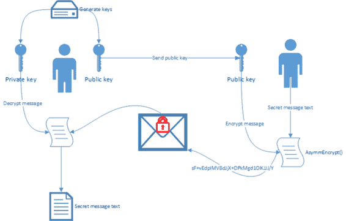
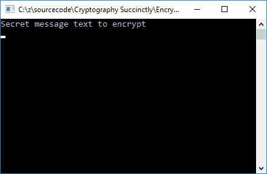

# 五、非对称加密

虽然对称加密是在流上执行的，有利于加密大量数据，但非对称加密是在少量数据上执行的。想象一下，你想给我发一条秘密信息。你会怎么做？

下图总结了非对称加密(也称为公钥加密)的过程。



图 16:不对称加密概述

您将看到该过程从左边开始，在那里生成公钥和私钥。您还会注意到私钥从不共享。只有公钥在双方之间共享。

|  | 注意:非对称加密使用数学链接的公钥和私钥。 |

让我们看看如何在代码中实现非对称加密。

## 写代码

首先，我生成一个公钥和一个私钥，存储在内存或加密密钥容器中。

|  | 注意:公钥是模数和指数。 |

生成公钥的过程如代码清单 25 所示。

代码清单 25:生成公钥和私钥

```cs
  RSACryptoServiceProvider rsaCrypto = new RSACryptoServiceProvider();
  RSAParameters RSAKeyInfo = rsaCrypto.ExportParameters(false);
  byte[] publicMod = RSAKeyInfo.Modulus;
  byte[] publicExp = RSAKeyInfo.Exponent;

```

接下来，我会把我的公钥发给你。使用我的公钥，您加密秘密消息，并将加密的消息发送回我。

代码清单 26:加密消息

```cs
  byte[] toEncrypt = Encoding.ASCII.GetBytes("Secret message text to encrypt");
  byte[] encryptedData = AsymmEncrypt(toEncrypt, publicMod,
  publicExp);

```

`AsymmEncrypt()`方法加密你要发给我的数据。请注意，此代码将运行在您的计算机上，运行在您用来加密邮件的应用程序中。出于说明的目的，它包含在同一个应用程序中(代码清单 27)。

代码清单 27:非对称加密方法

```cs
  public static byte[] AsymmEncrypt(byte[] dataToEncrypt, byte[] mod, byte[] exp)
  {
      RSACryptoServiceProvider crypto = new RSACryptoServiceProvider();
      RSAParameters RSAKeyInfo = new RSAParameters();
      RSAKeyInfo.Modulus = mod;
      RSAKeyInfo.Exponent = exp;

      crypto.ImportParameters(RSAKeyInfo);

      byte[] encryptedData;

      //Encrypt the data
      encryptedData = crypto.Encrypt(dataToEncrypt, false);

      return encryptedData;
  }

```

收到您的加密消息后，我会使用与发送给您的公钥相对应的私钥对其进行解密。只有当我使用与您用来加密机密消息的公钥相对应的私钥时，我才能解密消息。否则，解密将失败。

代码清单 28:解密秘密消息

```cs
  byte[] decrypted = rsaCrypto.Decrypt(encryptedData, false);
  string secretMessage = Encoding.Default.GetString(decrypted);

```

如果我们查看控制台应用程序的输出，我们可以看到消息被成功解密。



图 17:解密的消息

消息被加密并安全地发送给我，在那里被安全地解密。