# 第 6 章密钥容器

我们已经看到了使用非对称加密时如何生成公钥和私钥。虽然共享公钥是可以的(毕竟这是它的目的)，但私钥需要保持安全。私钥永远不应该以纯文本形式存储在硬盘上。如果要存储私钥，必须始终使用密钥容器。

|  | 注意:对于此代码示例，您必须添加系统。从 NuGet 到您的解决方案的值元组。 |

在本章中，我们将了解以下内容:

*   创建密钥容器
*   加密邮件
*   解密消息
*   删除密钥容器
*   导出公钥
*   导入公钥

在这一点上，我敢打赌，你们中的一些人想知道钥匙容器到底存放在哪里？Windows 有一个加密密钥存储，它只是位于您硬盘上的一个文件夹中。在我的 Windows 10 机器上，这个路径是`C:\ProgramData\Microsoft\Crypto`，在那个文件夹里面，每个按键类型都有各种其他的文件夹。在本例中，我们将查看`RSA\MachineKeys`子文件夹。

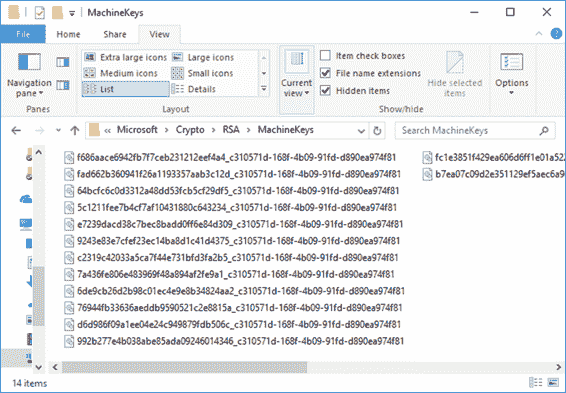

图 18: Windows 10 加密密钥存储

如果您导航到该文件夹，您将看到已经创建了各种机器密钥。

我们可以保存密钥容器的另一个位置是用户配置文件。在我的 Windows 10 机器上，这个路径是`C:\Users\<USER>\AppData\Roaming\Microsoft\Crypto`，在那个文件夹里面，有一个`RSA`子文件夹，还有一个名字有 GUID 的子文件夹。

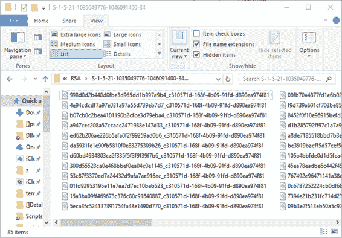

图 19:用户配置文件密钥存储

正是在这里，在这两个密钥存储中的一个中，我们将存储我们的私钥。我们先来看看用户档案下的密钥库。

## 写代码

首先在代码文件的顶部创建类范围变量，如代码清单 29 所示。

代码清单 29:常数

```cs
  const string KEY_STORE_NAME = "MyKeyStore";
  public static CspParameters csp = new CspParameters();
  public static RSACryptoServiceProvider rsa;

```

接下来，创建一个名为`CreateAsmKeys()`的方法，并注意告诉代码在机器密钥库中创建密钥容器的标志。代码很容易理解。它只是创建一个名为`MyKeyStore`的容器，然后指示`RSACryptoServiceProvider`对象将密钥保存在加密服务提供者中。

请注意，我还显示了容器名称以及保存在密钥存储中时创建的唯一密钥容器名称。

代码清单 30:创建密钥容器

```cs
  private static void CreateAsmKeys(out string containerName, bool useMachineKeyStore)
  {
      csp.KeyContainerName = KEY_STORE_NAME;
      if
  (useMachineKeyStore)
          csp.Flags = CspProviderFlags.UseMachineKeyStore;

      rsa = new RSACryptoServiceProvider(csp);
      rsa.PersistKeyInCsp = true;

      CspKeyContainerInfo info = new CspKeyContainerInfo(csp);
      WriteLine($"The key container name: {info.KeyContainerName}");
      containerName = info.KeyContainerName;

      WriteLine($"Unique key container name: {info.UniqueKeyContainerName}");
  }

```

加密消息的代码也是我们以前见过的。我们告诉加密服务提供者(`CspParameters`对象)容器名是什么(我没有在这里使用常量，因为我明确想给它一个容器名)，并使用`RSACryptoServiceProvider`对消息进行加密。你会注意到我在这里返回了一个元组。

代码清单 31:加密消息

```cs
  public static (byte[] encrBytes, string encrString)
  AsymmEncrypt(string message, string keyContainerName)
  {
      CspParameters cspParams = new CspParameters()
      {
          KeyContainerName = keyContainerName
      };
      RSACryptoServiceProvider rsa = new RSACryptoServiceProvider(cspParams);
      byte[] encryptedAsBytes = rsa.Encrypt(Encoding.UTF8.GetBytes(message), true);
      string encryptedAsBase64 = Convert.ToBase64String(encryptedAsBytes);

      return (encryptedAsBytes, encryptedAsBase64);
  }

```

反向使用相同的逻辑。我们告诉加密服务提供者(`CspParameters`对象)容器名称是什么，然后使用`RSACryptoServiceProvider`对消息进行解密。

代码清单 32:解密消息

```cs
  public static (byte[] decrBytes, string decrString)
  DecryptWithCsp(byte[] encrBytes, string containerName)
  {
      CspParameters cspParams = new CspParameters()
      {
          KeyContainerName = containerName
      };
      RSACryptoServiceProvider rsa = new RSACryptoServiceProvider(cspParams);
      byte[] decryptBytes = rsa.Decrypt(encrBytes, true);
      string secretMessage = Encoding.Default.GetString(decryptBytes);

      return (decryptBytes, secretMessage);
  }

```

要测试代码，请将以下逻辑添加到您的控制台应用程序的`static void Main`中，并运行控制台应用程序。注意`blnUseMachineKeyStore`标志设置为`false`。

代码清单 33:要测试的代码

```cs
  bool blnUseMachineKeyStore = false;
  CreateAsmKeys(out string containerName, blnUseMachineKeyStore);

  string superSecretText = "Super Secret Message";
  WriteLine($"Message to encrypt: {superSecretText}");

  var (encrBytes, encrString) = AsymmEncrypt(superSecretText,
  containerName);
  WriteLine($"Encrypted bytes: {Convert.ToBase64String(encrBytes)}");
  WriteLine($"Encrypted string: {encrString}");

  var (decrBytes, decrString) = DecryptWithCsp(encrBytes,
  containerName);
  WriteLine($"Decrypted bytes: {Convert.ToBase64String(decrBytes)}");
  WriteLine($"Decrypted message: {decrString}");

```

我们可以从生成的输出中看到一些东西。你可以看到我们使用了`MyKeyStore`的一个关键容器名，但是唯一的容器名有很大的不同。

要加密的消息被传递给返回加密字节数组和字符串的加密方法。然后，我们立即使用之前创建的密钥容器对消息进行解密。这导致解密的字节数组和消息。

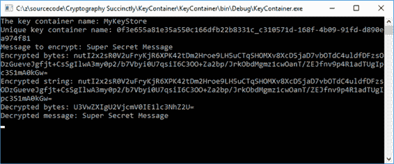

图 20:保存的密钥库输出

现在让我们花一分钟的时间来关注为密钥容器生成的唯一密钥。

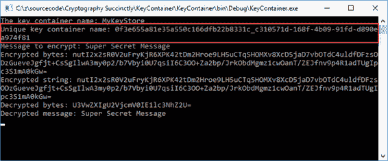

图 21:唯一密钥容器名称

您会注意到，我们在本地用户配置文件密钥存储中创建了一个新文件。创建的文件与输出中唯一密钥容器名称的名称相匹配。

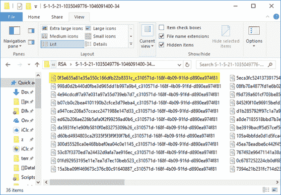

图 22:用户配置文件密钥容器

打开文件，你会看到内容是加密的。

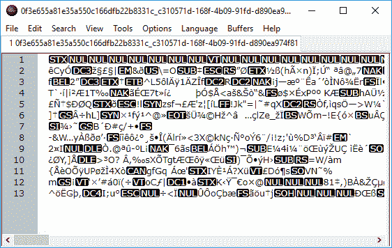

图 23:加密密钥容器文件

更改标志，让代码在 Windows 密钥存储中创建密钥存储。再次运行应用程序。

代码清单 34:打开使用机器密钥存储

```cs
  bool blnUseMachineKeyStore = true;

```

您会注意到该文件现在是在 Windows 密钥存储中创建的。

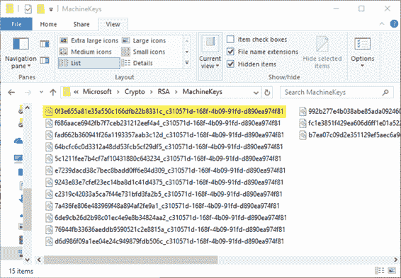

图 24:窗口密钥存储

如果我们想要清除密钥容器，我们只需要做以下事情，如代码清单 35 所示。

代码清单 35:删除密钥容器

```cs
  private static void ClearContainer(string containerName, bool useMachineKeyStore)
  {
      csp = new CspParameters() { KeyContainerName =
  containerName };
      if
  (useMachineKeyStore)
          csp.Flags = CspProviderFlags.UseMachineKeyStore;
      RSACryptoServiceProvider rsa = new RSACryptoServiceProvider(csp) { PersistKeyInCsp =
  false };
      rsa.Clear();
  }

```

保留`blnUseMachineKeyStore = true`将从 Windows 密钥存储位置移除密钥容器。

代码清单 36:打开使用机器密钥存储

```cs
  bool blnUseMachineKeyStore = true;
  ClearContainer(KEY_STORE_NAME, blnUseMachineKeyStore);

```

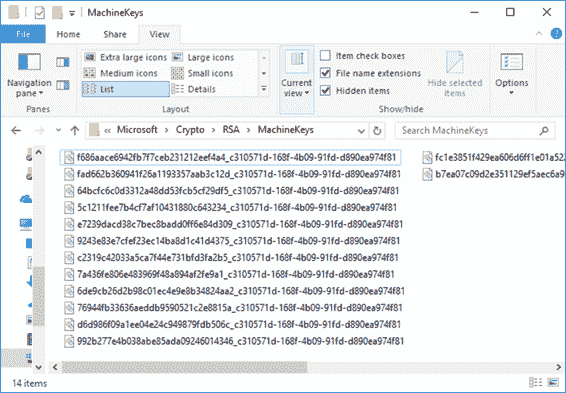

图 25:从 Windows 密钥存储中删除的容器

要从用户配置文件密钥存储中移除容器，只需将`blnUseMachineKeyStore` 标志设置为 `false`并运行代码。

代码清单 37:关闭使用机器密钥存储

```cs
  bool blnUseMachineKeyStore = false;
  ClearContainer(KEY_STORE_NAME, blnUseMachineKeyStore);

```

## 导出公钥

导出公钥非常容易。我们这样做是为了将我们的公钥给想要向我们发送消息的人，以便他们能够加密他们的消息。

向代码中添加两个常数，用于导出文件夹和文件名。

代码清单 38:公钥导出位置

```cs
  const string EXPORT_FOLDER = @"C:\public_key\";
  const string PUBLIC_KEY_FILE = @"rsaPublicKey.txt";

```

然后我们简单地检查目录是否存在，如果不存在，就创建它。我们在导出位置创建一个文件，然后将`RSACryptoServiceProvider`对象 xml 写入该文件。这是通过`ToXmlString(false)`方法完成的，其中`false`告诉代码不要包含私钥。

代码清单 39:导出公钥方法

```cs
  private static void ExportPublicKey()
  {
      if
  (!(Directory.Exists(EXPORT_FOLDER)))
          Directory.CreateDirectory(EXPORT_FOLDER);

      using (StreamWriter writer = new StreamWriter(Path.Combine(EXPORT_FOLDER,
  PUBLIC_KEY_FILE)))
      {
          writer.Write(rsa.ToXmlString(false));
      }
  }

```

运行代码清单 40 中的代码来测试导出。首先，创建一个容器，然后导出公钥。

代码清单 40:测试导出的代码

```cs
  CreateAsmKeys(out string containerName,
  blnUseMachineKeyStore);
  ExportPublicKey();

```

您将看到文件是在您提供的位置创建的。

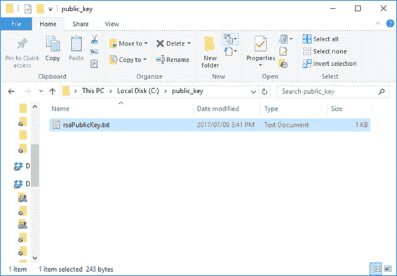

图 26:导出的公钥

打开文件，您会注意到内容根本没有加密。这是因为您向其发送公钥的人需要在他们这边导入公钥，并用它加密他们的消息。

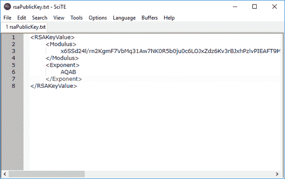

图 27:导出的公钥

如果我们更改代码以包含私有参数，您将看到生成了一个不同的文件。

代码清单 41:包含私有参数

```cs
  writer.Write(rsa.ToXmlString(true));

```

打开未加密的文件将以纯文本显示公钥和私钥信息。这通常不是你想做的事情。

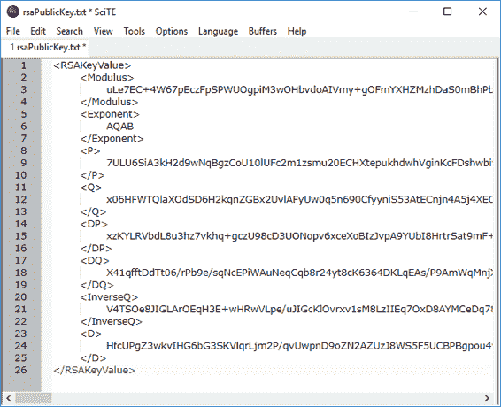

图 28:导出的私钥和公钥

## 导入公钥

您将向其发送公钥的人需要将公钥导入他们的应用程序。如果您正在相互交换加密的消息，那么如果您想向他们发送消息，您可能还需要一种方法来导入他们的公钥。

导入逻辑的方法只是将从发送给您的公钥文件中读取的文本导入到`CspParameters`对象中并保持它。

代码清单 42:导入公钥

```cs
  private static void ImportPublicKey()
  {
      FileInfo fi = new FileInfo(Path.Combine(IMPORT_FOLDER,
  PUBLIC_KEY_FILE));

      if
  (fi.Exists)
      {
          using (StreamReader reader = new StreamReader(Path.Combine(IMPORT_FOLDER,
  PUBLIC_KEY_FILE)))
          {
              csp.KeyContainerName = KEY_STORE_NAME;
              rsa = new RSACryptoServiceProvider(csp);
              string publicKeyText = reader.ReadToEnd();
              rsa.FromXmlString(publicKeyText);
              rsa.PersistKeyInCsp = true;
          }
      }
  }

```

## 使用 Azure 密钥库

Azure 密钥库允许开发人员保护应用程序和服务中使用的加密密钥和秘密。密钥库允许您通过使用受硬件安全模型保护的密钥来加密密钥和秘密。密钥库还让您可以控制访问和加密数据的密钥。为开发创建密钥是快速的，并且向生产密钥的迁移是容易和无缝的。还可以根据需要轻松撤销密钥。

例如，考虑需要用于签名和加密但需要保存在应用程序外部的密钥，因为应用程序的用户在地理上是分散的。Azure 密钥存储库在这里提供了一个很好的解决方案，因为存储在存储库中的密钥会在需要时被 URI 调用。

Azure 使用行业标准算法和硬件安全模块(HSMs)来保证密钥的安全。因此，您的密钥得到了很好的保护，而不需要您编写自己的代码。最重要的是，它们在您的应用程序中很容易使用。

创建一个密钥库比这里说明的要多得多，但我想让你知道我们在做什么。

创建密钥库是在资源组中完成的。创建密钥库时，还可以创建新的资源组。

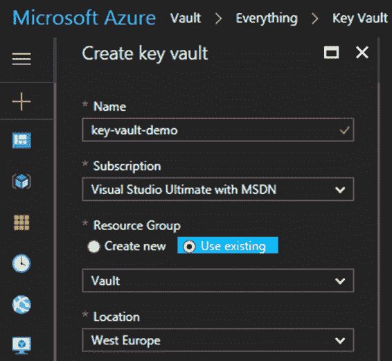

图 29:创建一个 Azure 密钥库

一旦您创建了密钥库，您将单击密钥库设置下的**秘密**来添加新的秘密。

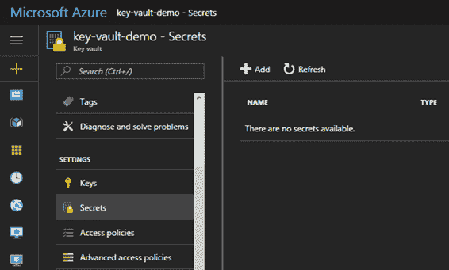

图 30:存储秘密

接下来，选择**手动**作为上传选项，并给秘密一个名称和值。

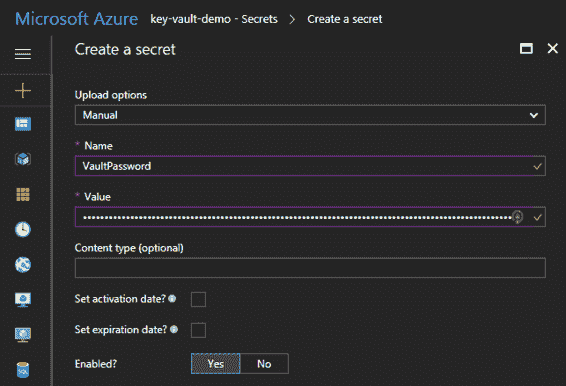

图 31:手动创建秘密

秘密的值是一个 100 个字符的密钥。这是我们希望从密钥库中检索并在应用程序中使用的值。

`HuyvFwwc7v&G!sh2F3xJG!89NlYRNS%6QTrmtPO34C7CoAbc^RKRBWbv80dSb$xq!txEqt2rDjpOjknBPjB%9%iuE2qlZZEIgelc`

我们现在将简单地从控制台应用程序调用密钥库。您需要向应用程序添加以下 NuGet 包:

*   微软。Azure.KeyVault
*   微软。标识模型。客户端。活动目录

添加完这些代码后，使用语句将以下代码添加到应用程序中。

代码清单 43:附加代码

```cs
  using Microsoft.Azure.KeyVault;
  using Microsoft.IdentityModel.Clients.ActiveDirectory;

```

我们添加到控制台应用程序的代码很少。我们正在使用活动目录应用程序标识、应用程序密钥和 Azure 中提供给我们的秘密应用程序接口密钥的网址来验证我们的应用程序。

代码清单 44:附加代码

```cs
  static void Main(string[] args)
  {
      MainAsync(args).Wait();
  }

  public static async Task MainAsync(params string[] args)
  {
      var applicationID = "[YOUR_APPLICATION_ID]";
      var vaultMasterKey = "[YOUR_APPLICATION_KEY]";
      var secretIdentifier = "[SECRET_API_KEY_URL]";

      var cloudVault = new KeyVaultClient(async (string authority, string resource, string scope) => {
          var authContext = new AuthenticationContext(authority);
          var credential = new ClientCredential(applicationID, vaultMasterKey);
          var token = await authContext.AcquireTokenAsync(resource, credential);

          return token.AccessToken;
      });

      var apiKey =
  cloudVault.GetSecretAsync(secretIdentifier).Result.Value;
  }

```

当控制台应用程序运行时，您会看到在`cloudVault.GetSecretAsync(secretIdentifier).Result.Value`调用中将密钥返回给应用程序。

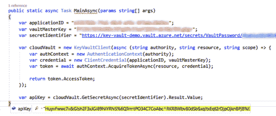

图 32:返回给应用程序的密钥

无服务器计算为开发人员提供了一个非常令人兴奋的环境。借助 Azure 功能和 Azure 密钥存储，您可以创建强大的云服务来保护您的应用程序。