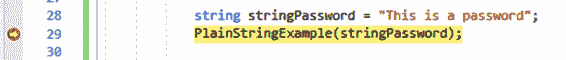
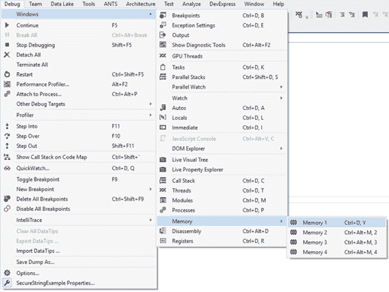
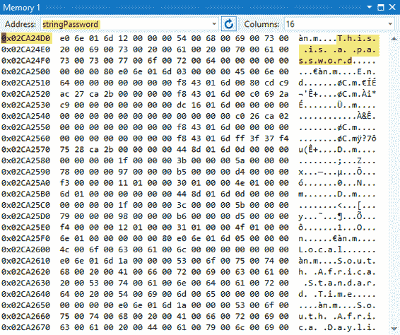
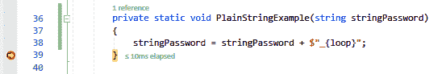
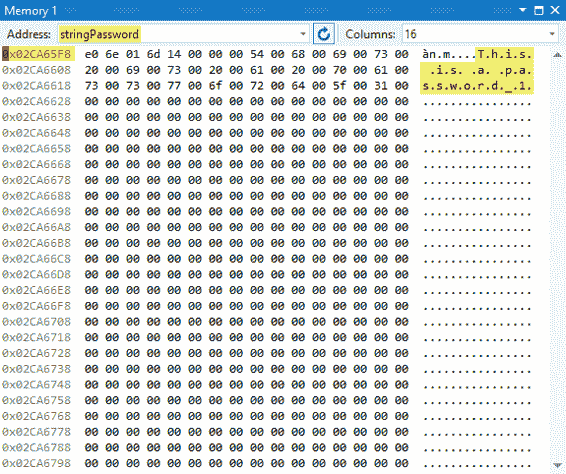
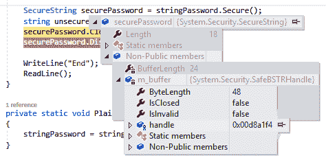
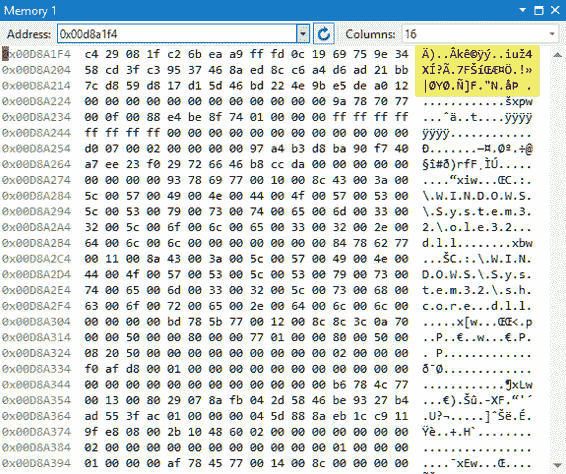
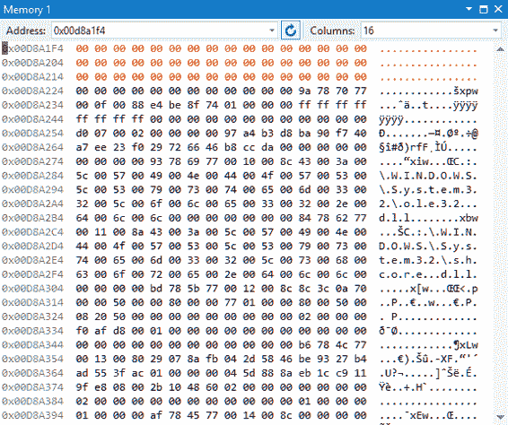

# 第七章使用安全锁

还有一个经常被忽视的部分。NET 框架，它为包含敏感信息的变量提供了额外的安全性。`SecureString`是一个. NET 类，它提供了一个比 String 类更安全的替代，因为它在内存中维护一个副本。

|  | 注意:请注意，安全存储是系统的一部分。安全命名空间。 |

事实是`string`是一种相当不安全的方式来保存敏感信息，如密码、用户名和信用卡号。这是因为`string`没有固定在内存中，也就是说:

*   垃圾收集器可以移动或复制它。
*   它可以在内存中留下多个痕迹，并且内存中可以存在多个副本。
*   内存可以交换到磁盘。
*   字符串变量的值以纯文本形式存储。
*   你不能轻易把它归零。
*   因为字符串是不可变的，所以内存中字符串变量的值永远不会被修改。在内存中用更改的值创建字符串变量的额外副本。

要查看内存中字符串变量的值，请执行以下操作:将代码清单 45 中的代码写入控制台应用程序，并将类范围变量添加到控制台应用程序。

代码清单 45:全局变量

```
  static int loop = 1;

```

在`static void Main`中，创建一个名为`stringPassword`的变量，并为其赋值。在调用`PlainStringExample()`方法时也放置一个断点。

代码清单 46:创建密码变量

```
  string stringPassword = "This is a password";
  PlainStringExample(stringPassword);

```

在方法内部，给`stringPassword`变量分配一个不同的值。在方法退出的地方放置另一个断点。

代码清单 47:更改密码变量

```
  private static void PlainStringExample(string stringPassword)
  {
      stringPassword = stringPassword + $"_{loop}";
  }

```

现在运行应用程序，等待它到达第一个断点。



图 33:代码断点 1

当代码执行在第一个断点暂停时，通过转到**调试**、**窗口**、**内存**打开**内存 1** 窗口。



图 34:打开内存窗口

在**内存 1** 窗口中，将**地址**文本框中的值更改为变量`stringPassword`的名称，然后单击输入。您将立即看到内存窗口跳转到`stringPassword`变量的内存位置。

|  | 注意:内存地址位置在您的机器上会有所不同。 |

地址为`0x02CA24D0`，右侧显示纯文本密码。



图 35:字符串密码变量内存位置 1

继续执行代码，等待到达第二个断点。



图 36:代码断点 2

您将立即看到`stringPassword`的内存地址更改为不同的地址。在本例中，内存地址已更改为`0x02CA65F8`，更新后的文本仍以纯文本形式可见。



图 37:字符串密码变量内存位置 2

使用`SecureString`的好处包括:

*   内存中的单个副本。
*   该值在内存中不作为纯文本显示。
*   实施`IDisposable`和一种`Clear()`方法。
*   可以通过调用`MakeReadOnly()`方法来更改该值。

为了了解这是如何工作的，让我们看一个使用`SecureString`的实际代码示例。首先向控制台应用程序添加以下 using 语句。

代码清单 48:使用语句

```
  using static System.Console;
  using System.Runtime.InteropServices;
  using System.Security;

```

接下来，添加一个名为`ExtensionMethods()`的类。

代码清单 49:扩展方法类

```
  public static class ExtensionMethods
  {

  }

```

添加一个名为`Secure()`的扩展方法，它将作用于一个字符串变量，并为输入的值返回一个`SecureString`值。注意`SecureString`值是如何通过将`string`的单个`char`值添加到`SecureString`对象来创建的。这使得使用带有在键盘上键入的单个键字符的`SecureString`对象变得容易。

代码清单 50:转换为安全存储

```
  public static SecureString Secure(this string value)
  {
      SecureString securedStringValue = new SecureString();

      if
  (!(string.IsNullOrWhiteSpace(value)))
      {
          foreach (char c in
  value.ToCharArray())
          {
              securedStringValue.AppendChar(c);
          }
      }
      else
          return null;

      return securedStringValue;
  }

```

现在我们添加第二个扩展方法，将`SecureString`值转换回`string`。它通过分配一个只读指针来实现，然后将`SecureString`值复制到指针上。最后，该方法将其转换为托管`string`变量。之后，它释放指针。

代码清单 51:转换为不安全字符串

```
  public static string Unsecure(this SecureString value)
  {
      // Read-only field representing a pointer initialized to zero.
      var unsecuredString = IntPtr.Zero; 

      try
      {
          // Copies the value of SecureString to unmanaged memory.
          unsecuredString = Marshal.SecureStringToGlobalAllocUnicode(value);

          return Marshal.PtrToStringUni(unsecuredString);
      }
      finally
      {
          // Frees unmanaged string pointer.
          Marshal.ZeroFreeGlobalAllocUnicode(unsecuredString); 
      }            
  }

```

对于控制台应用程序`static void Main`，将代码更改为类似代码清单 52。在`securePassword.Clear()`上设置一个断点，在`securePassword.Dispose()`上设置另一个断点。

代码清单 52:调用代码

```
  string stringPassword = "This is a password";
  PlainStringExample(stringPassword);

  SecureString securePassword = stringPassword.Secure();
  string unsecuredPassword = securePassword.Unsecure();
  securePassword.Clear();
  securePassword.Dispose();

```

运行你的应用程序，看看`securePassword`变量。



图 38:安全手柄

当你深入足够远的时候，你会看到`securePassword`变量的句柄。在这个例子中，它是`0x00D8A1F4`。



图 39:保护加密值

如果打开内存窗口，会注意到内存中`SecureString`变量的值是加密的。



图 40:清除安全变量

如果你推进断点，你会看到`SecureString`对象的值从内存中被清除。

请注意，`SecureString`对象不能替代保存在数据库中的密码。它旨在保持敏感信息的价值在记忆中不被窥视。有一个学派认为使用`SecureString`的好处非常小，根本不值得实施。如果攻击者真的想这样做，他们可以截取字符串的值，因为它被设置为一个`SecureString`对象(在每次击键时——例如，通过一个键记录器)。

我个人认为，最好减少应用程序中的攻击向量数量，这样做可以最小化攻击面(攻击向量的总和)。在存储和处理用户数据的方式中，将这一点与可靠的加密原则相结合，将有助于构建更安全的软件。

## 结论

开发世界级应用程序时，开发人员需要考虑密码学。在任何应用程序中都有它的位置。谢谢你读这本书。我希望其中举例说明的例子能让您进一步理解保护应用程序安全的概念。