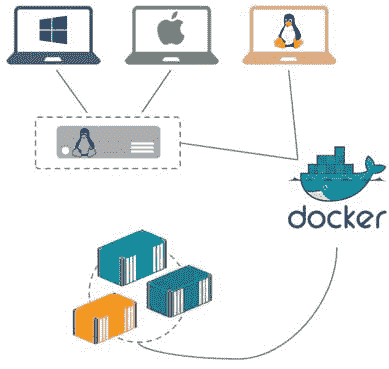
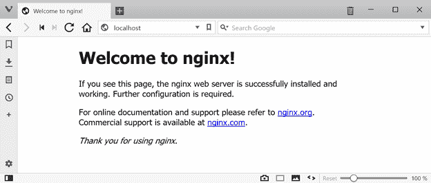

# 码头工人

Docker 是一个应用平台。它允许您将应用程序打包到它需要的所有东西中，从操作系统到单个单元，您可以在任何有 Docker 的计算机上共享和运行。Docker 在称为容器的轻量级独立组件中运行您的应用程序。

这是一个简单的命题，但它非常强大。应用程序包，称为 Docker 映像，通常只有几十或几百兆字节，因此存储成本低，移动速度快。当您从映像运行一个容器时，它将在几秒钟内启动，应用程序进程实际上在主机上运行，这意味着您可以在一台机器上运行数百个容器。映像可以进行版本控制，因此您可以确保您发布到生产环境中的软件完全是您测试过的，Docker 工具甚至可以扫描映像中的安全漏洞，因此您将知道您的应用程序是否安全。

使用 Docker，您可以构建您的应用程序映像，并知道它将以相同的方式在您的开发笔记本电脑、内部测试实验室的虚拟机或云中的机器集群上运行。它是软件交付中一些最流行趋势的推动者。您可以轻松地将打包步骤添加到您的持续集成过程中，以便为每次提交生成版本化映像。您可以将其扩展到连续交付，通过环境自动将最新的映像部署到生产中。在 Docker 中，打包过程是开发和运营的交汇点，这意味着这是向 DevOps 过渡的一个很好的开始。拥有一个在许多容器之间协调工作的框架，可以为微服务架构奠定基础。

Docker 是开源和跨平台的，其生态系统最引人注目的方面之一是 Docker Hub——一个公共注册中心，组织和个人可以在其中共享自己的应用程序容器映像。在 Hub 上，除了定制的社区图像，您还可以找到受欢迎技术(如 Nginx、MariaDB 和 Redis)支持的官方图像，并且您还可以共享自己的图像。Hub 上的图像可以像 Hello World 应用程序一样简单，也可以像完全分布式的 Hadoop 集群一样复杂，由于图像通常是开源的，因此导航 Hub 是开始使用 Docker 的好方法。

在本章中，我们将这样做——我们将安装 Docker，并且我们将使用 Docker Hub 中的图像运行一些容器。我们将看到使用 Docker 启动和运行有多容易，我们将开始了解平台的力量。在本电子书的其余部分，我们将深入挖掘并浏览您需要了解的所有内容，以便在生产中轻松使用 Docker。

## 安装 Docker

Docker 是一个单一的产品，它有三个组件——完成工作的后台服务器；Docker 客户端，用于与服务器一起工作的命令行界面；和一个用于客户机-服务器通信的 REST 应用编程接口。

客户端是跨平台的，这意味着您可以从 Linux、Windows 和 OS/X 机器本地运行它，并且您可以管理在本地或远程机器上运行的 Docker。Docker 服务器运行在 Linux 和最新版本的 Windows 上。

你不需要成为一名 Linux 大师就能有效地使用 Docker。Docker 团队已经为 Mac 和 Windows 整合了一些包，这些包利用了主机上的虚拟化技术，这样您的 Docker 服务器就可以在您的 OS/X 或 Windows 机器上的 Linux 虚拟机中运行(您在本地运行客户端，并通过虚拟机上公开的 REST API 与服务器对话)。

|  | 注意:最新的 Mac Docker 和 Windows 软件包 Docker 需要最新版本的操作系统 OS/X Yosemite 或 Windows 10。如果您运行的是旧版本，您仍然可以在 Docker 工具箱中使用 Docker。这是一个使用 VirtualBox 来运行 Linux 虚拟机的旧包，但是您使用它的方式是一样的。 |

图 1 显示了在各种操作系统上运行 Docker 引擎的不同选项。



图 1:在 Windows、Mac 和 Linux 上运行 Docker

这个数字看起来可能很复杂，但都包含在简单的安装中。了解 Docker 实际上是如何在您的机器上运行的是一个好主意，但是安装本身只需要几分钟的下载时间，然后只需点击几下鼠标。Docker 的文档是一流的，Docker Store 上的[入门部分包含了 Mac、Windows 和 Linux 的详细说明。](https://store.docker.com/)

|  | 注意:在 Windows 上，您需要在 BIOS 中启用硬件虚拟化(VT-x)来运行 Docker Linux 虚拟机，安装后您需要重新启动。您可以在 Windows 容器和 Linux 容器之间切换——本书中的示例使用了 Linux 容器。 |

安装 Docker 后，只需启动一个命令行窗口(或者 Docker 终端，如果您正在使用 Docker 工具箱的话)，就可以开始运行 Docker 客户端命令了。代码清单 1 显示了运行`docker version`的输出，它为您提供了 Docker 安装版本的详细信息。

代码清单 1:检查 Docker 的版本

```
  $ docker version
  Client:
   Version:     
  17.11.0-ce
   API version: 
  1.34 (downgraded from 1.35)
   Go version:  
  go1.9.2
   Git commit:
   Built:        Fri
  Nov 24 16:01:38 2017
   OS/Arch:     
  darwin/amd64
   Orchestrator: kubernetes

  Server:
   Version:     
  17.11.0-ce
   API version: 
  1.34 (minimum version 1.12)
   Go version:  
  go1.8.5
   Git commit:  
  1caf76c
   Built:        Mon
  Nov 20 18:39:28 2017
   OS/Arch:     
  linux/amd64
   Experimental:
  true

```

Docker 在客户端和服务器上分别报告，因为您可能使用本地客户端来管理远程服务器，而这些客户端可能在不同的版本或不同的平台上。Docker 是使用 Go 构建的，但它是作为编译后的二进制文件提供的，这意味着您不需要预先安装 Go 运行时。

安装 Docker 后，您就可以开始运行一些容器了。

Docker 映像是打包的应用程序。您可以将它们推送到中央存储(称为注册表)中，并在任何可以访问注册表的机器上提取它们。映像是包含应用程序包的单个逻辑单元。为了启动应用程序，您需要从图像中运行一个容器。

映像通常是为运行单个进程而构建的。如果您的应用程序需要与其他服务一起工作，您可以在它们自己的容器中运行这些服务，并对它们进行编排，以便所有容器可以一起工作(您将在[第 5 章“用 Docker 编排系统”](5.html#_Chapter_5_)中了解到这一点)。

当你从一个图像运行一个容器时，它可能是一个短暂的应用，运行一些功能，然后结束；它可能是一个像后台服务一样运行的长时间运行的应用程序；或者它可能是一个交互式容器，您可以像连接远程机器一样进行连接。

### 你好世界

让我们从你能运行的最简单的容器开始。安装 Docker 并连接互联网后，您可以运行代码清单 2 中的命令，并看到 Hello World 容器正在运行。

代码清单 2:运行 Hello World

```
  $ docker container
  run hello-world
  Unable to find
  image 'hello-world:latest' locally
  latest: Pulling
  from library/hello-world
  b04784fba78d: Pull
  complete
  Digest:
  sha256:f3b3b28a45160805bb16542c9531888519430e9e6d6ffc09d72261b0d26ff74f
  Status: Downloaded
  newer image for hello-world:latest

  Hello from Docker!
  ...

```

您将看到一些有用的文本，但是不要对您的第一个容器仅仅是向控制台写入内容无动于衷。当您运行该命令时，会发生很多事情:

*   您的本地 Docker 客户端向 Docker 服务器发送一个请求，从名为`hello-world`的图像中运行一个容器。
*   Docker 服务器检查其缓存中是否有该图像的副本。如果没有，它将从 Docker Hub 下载图像。
*   当映像在本地下载时，Docker 服务器从映像运行一个容器，并将输出发送回 Docker 客户端。

使用这个图像，当控制台输出被写入时，容器内的进程结束，当容器内没有进程运行时，Docker 容器退出。您可以通过使用`container ls`(容器列表)命令从 Docker 获取正在运行的容器列表来检查这一点。因为`hello-world`容器已经结束，所以没有正在运行的容器，命令输出将是空的，如代码清单 3 所示。

代码清单 3:检查运行的容器

```
  $ docker container
  ls
  CONTAINER
  ID        IMAGE               COMMAND             CREATED            
  STATUS              PORTS               NAMES

```

|  | 提示:您可以通过运行 docker 容器 ls - all 来查看所有容器，包括已经退出的容器，该容器列出了处于任何状态的容器。 |

这种执行一些代码然后退出的容器是一种非常有用的模式。您可以将这种方法用于编写重复任务脚本的容器，例如备份数据、在云中创建基础架构或处理消息队列中的消息。但是容器同样非常适合长时间运行的后台进程。

### 你好金尼克

[Nginx](https://nginx.org/en/) 是一款功能强大、轻量级、开源的 HTTP 服务器。多年来，它越来越受欢迎——作为一个网络服务器，它已经逐渐从 Apache 和 IIS 手中夺走了互联网市场份额。随着 Docker 的增长，Nginx 的受欢迎程度有所提高，因为它易于配置，构建成一个非常小的映像，并且有许多功能可以很好地与协调的容器工作负载相结合。

Docker Hub 有一个由 Nginx 团队维护和支持的[官方 Nginx 图像](https://hub.docker.com/_/nginx/)。它有几种变体，但它们基本上做同样的事情——启动 Nginx 服务器进程，在容器内监听端口 80。使用代码清单 4，您可以运行基于 Alpine Linux 的最小版本的 Nginx Docker 映像。

代码清单 4:在容器中运行 Nginx

```
  $ docker container
  run nginx:alpine
  Unable to find
  image 'nginx:alpine' locally
  alpine: Pulling
  from library/nginx
  019300c8a437: Pull
  complete
  2425a41f485c: Pull
  complete
  26e59859b15d: Pull
  complete
  a69539b662c9: Pull
  complete
  Digest:
  sha256:6cf0606c8010ed70f6a6614f8c6dfedbdb5e2d207b5dd4b0fab846bbc26f263e
  Status: Downloaded
  newer image for nginx:alpine

```

当您运行该图像时，一个容器将在前台启动，在您的终端中运行 Nginx 进程，这样您就不能运行任何其他命令。容器正在监听端口 80 上的 HTTP 请求，但那是容器内部的端口 80**，所以我们无法从主机到达。这个容器做的不多，所以我们可以用 Ctrl+C 结束这个过程来杀死它。**

 **Docker 支持长时间运行的后台进程，例如 web 服务器，它允许容器以分离模式运行，因此容器会一直在后台运行。代码清单 5 从同一个 Nginx 映像运行一个新的容器，它将在后台运行，带有`--detach`标志，端口 80 以`--publish`标志发布。

代码清单 5:作为后台容器运行 Nginx

```
  $ docker container
  run --detach --publish 80:80 nginx:alpine
  a840ccbfc8652cb6d52b5489146a59e8468747f3372e38426fe3deb40d84372a

```

该命令将容器内的端口 80 发布到主机上的端口 80。端口不能共享，因此如果您有另一个进程在端口 80 上侦听，这将失败。但是，您可以将容器端口发布到主机上的任何空闲端口:`--publish 8081:80`将主机上的端口 8081 映射到容器中的端口 80。

Docker 的输出显示了新容器的唯一标识，然后控制返回到终端。您可以使用`container ls`命令检查容器是否正在运行，如代码清单 6 所示。

代码清单 6:列出后台容器

```
  $ docker container
  ls
  CONTAINER
  ID        IMAGE               COMMAND                  CREATED            
  STATUS              PORTS                         NAMES
  a840ccbfc865       
  nginx:alpine        "nginx -g 'daemon ..."   47 seconds ago      Up
  45 seconds       0.0.0.0:80->80/tcp          heuristic_roentgen

```

输出告诉我们许多事情:容器正在运行哪个图像；Docker 唯一生成的容器标识的简短形式——在本例中从`a840`开始；除非我们提供名称，否则 Docker 将随机分配的容器名称—`heuristic_roentgen`；命令在容器中运行——`nginx`。这个容器在后台运行，Nginx 监听端口 80，我们已经从容器发布了端口 80，将其映射到运行容器的主机上的端口 80。

当请求现在到达主机上的端口 80 时，它们将被路由到容器，响应将来自容器内部运行的 Nginx 进程。在 Linux 上，Docker Engine 直接在你的主机上运行，Mac 的 Docker 和 Windows 的 Docker 使用原生网络共享，这意味着你可以浏览到`http://localhost`看到 Nginx 欢迎页面，如图 2 所示。



图 2:浏览容器内部的网络服务器

|  | 提示:在旧版本的 Mac 和 Windows 上(使用 Docker 工具箱)，Docker 服务器运行在 VirtualBox 上的 Linux 虚拟机中，该虚拟机将有自己的 ip 地址，因此您不会使用本地主机地址。为了访问从 Docker 容器映射的端口，您可以通过运行 docker-machine ip 找到您的 Docker 虚拟机的 ip 地址，这将为您提供一个类似 192.168.99.100 的 IP 地址，这就是您浏览的地方。 |

Docker 是长期运行后台服务的理想平台。在这个容器中运行的 Nginx web 服务器使用的资源几乎为零，除非有人正在访问该站点——但是该容器没有资源限制，这意味着在峰值负载下，Nginx 容器可以获取更多的资源，并且容器进程可以最大限度地耗尽 100%的 CPU 和内存，就像它直接在主机上运行一样。

通过这种方式，您可以在适当指定的服务器上运行数百个后台容器。假设使用模式各不相同，并且容器负载不会同时达到峰值，主机可以在所有容器之间愉快地共享资源。

### 你好 Ubuntu

最后一种容器是您交互运行的容器。只要您使用 Docker CLI 连接到它，它就会保持活动状态，其行为就像远程连接到单独的机器一样。您可以通过这种方式使用容器来评估图像，将图像用作软件工具，或者在构建自己的图像时完成各个步骤。

大多数 Docker Hub 映像使用 Linux 作为基础操作系统，Ubuntu 是最受欢迎的基础映像之一。Canonical 发布了官方的 Ubuntu 映像，他们已经将 Docker Hub 集成到了他们的发布周期中，以便在 Hub 上可以获得最新的 Ubuntu 版本。您可以使用代码清单 7 的命令运行交互式 Ubuntu 容器。

代码清单 7:运行交互式 Ubuntu 容器

```
  $ docker container
  run --interactive --tty ubuntu:16.04
  root@dafaf06d4ceb:/#

```

使用`--interactive`和`--tty`标志，Docker 通过终端仿真交互运行容器(通常缩写为`-it`)。容器仍然在 Docker 服务器上运行，但是客户端保持到它的开放连接，直到您退出容器。我们使用的是 Ubuntu 官方映像，但在运行命令中，我们指定了映像的特定版本—`16.04`—这为我们提供了 Ubuntu 的当前长期支持版本。

但是，如果您习惯于使用 Ubuntu，您会发现在这个容器中运行的版本不会像完整的 Ubuntu 服务器版本那样运行。代码清单 8 显示了正常的 Linux 命令，如`ls`和`cat`，在容器中按预期工作。

代码清单 Ubuntu 容器中的 Linux 命令

```
  root@dafaf06d4ceb:/# ls -l
  /tmp
  total 0
  root@dafaf06d4ceb:/# cat /etc/hosts
  127.0.0.1       localhost
  ::1     localhost ip6-localhost
  ip6-loopback
  fe00::0 ip6-localnet
  ff00::0 ip6-mcastprefix
  ff02::1 ip6-allnodes
  ff02::2 ip6-allrouters
  172.17.0.5      dafaf06d4ceb

```

|  | 注意:主机文件中有一些有趣的条目。Docker 将一些关于容器的运行时细节注入到该文件中，以帮助容器之间的可发现性。我们将在[第 5 章“用 Docker](5.html#_Chapter_5_) 编排系统”中看到更多内容。 |

Docker 映像中的 Ubuntu 版本是 Ubuntu 服务器的精简版，这意味着一些最基本的实用程序不可用。为了编辑`hosts`文件，我们可能希望使用 Nano 文本编辑器，但是它没有安装，如果我们尝试安装它，我们会看到软件库在图像中也不是最新的，如代码清单 9 所示。

代码清单 Ubuntu 映像中缺少实用程序

```
  root@dafaf06d4ceb:/# nano
  /etc/hosts
  bash: nano: command not found
  root@dafaf06d4ceb:/# apt-get
  install nano
  Reading package lists... Done
  Building dependency tree
  Reading state information...
  Done
  E: Unable to locate package
  nano

```

您仍然可以像任何其他 Ubuntu 安装一样使用容器，这样您就可以用`apt-get update`更新包库，并安装您喜欢的任何工具。但是你只改变了容器的这个实例，而不是底层的图像。当您运行`exit`命令时，容器将被停止，但您的更改不会被保存。下一次从 Ubuntu 映像运行容器时，它将是操作系统的最小版本。

Docker Hub 有许多这样的图像，旨在用作您自己的应用程序的基础图像。[Ubuntu](https://hub.docker.com/_/ubuntu/)[Alpine](https://hub.docker.com/_/alpine/)[BusyBox](https://hub.docker.com/_/busybox/)都很受欢迎，而且刻意做到了最小化。安装更少的软件意味着更少的膨胀，这意味着映像更小，也意味着攻击矢量减少，因为具有潜在漏洞的包更少。

应用程序容器不应被视为虚拟机或物理服务器，因为您通常不会连接到正在运行的容器来修复问题或修补操作系统。容器的构建和运行非常便宜，因此您可以更新映像，如果基础映像有补丁，则使用新版本的基础映像，然后创建一个新的容器并删除旧的容器。这不仅会解决应用程序的问题，还会为您提供一个更新的映像，其中包含您将来运行的任何容器的已修复问题。

我们已经看到了 Docker 的功能，学习了如何使用 Docker 客户端，并了解了 Docker 引擎如何在不同平台上运行。我们已经使用 Docker 浏览了主要的使用模式，运行短期任务容器，这些容器完成一项工作，然后退出；我们已经看到了长时间运行的容器，只要容器在运行，这些容器就会保持后台任务运行；我们已经检查了只要您的客户端与交互容器保持开放连接，它们就会存在。

Docker 的基础非常简单——应用程序打包成图像，图像用于在 Docker 服务器上运行容器，Docker 客户端管理容器。关于 Docker 还有很多需要学习的地方，在本电子书的剩余部分，我们将介绍使 Docker 成为软件交付革命性技术的特性。

在下一章中，我们将把您自己的应用程序打包成 Docker 映像。**