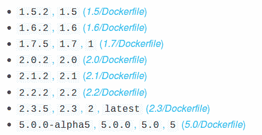
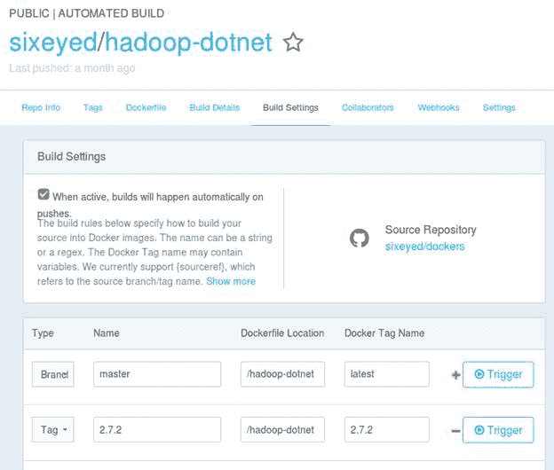
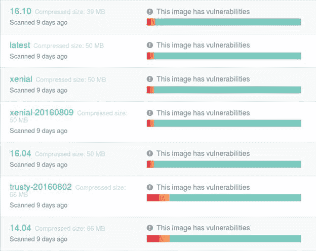

# 三、映像注册表和 Docker 中心

使用`docker image build`命令将应用程序打包成容器映像很容易，但是该映像只能在您自己的机器上的本地映像缓存中创建。为了使该映像有用，您需要能够将其运送到不同的主机，这就是映像注册表的作用。注册表只是图像的共享位置，您可以推送自己创建的图像，也可以拉取自己或他人创建的图像。注册表是 Docker 中的一个核心概念，您可以使用普通的 Docker 命令行工具来使用注册表。

[Docker Hub](https://hub.docker.com/) 是 Docker，Inc .维护的一个免费的公共图像注册中心。这是一个非常受欢迎的服务——在撰写本文时，Hub 上有超过 90 万个图像，并且已经有超过 120 亿个图像拉取。任何人都可以将图像推送到 Hub，除了社区图像之外，还有由 Docker 策划并得到其所有者支持的官方图像。

最好从 Docker Hub 开始，它是默认的源代码，有一个非常有用的特性集，使它不仅仅是一个图像存储。但是，如果您不喜欢将自己的应用程序映像存储在第三方云服务中，还有许多其他选择。在本章中，我们将了解如何使用 Hub、选择图像和其他注册表选项。

Docker Hub 是 Docker Inc .提供的公共图像注册中心(我们将在[第 9 章继续您的 Docker 之旅](9.html#_Chapter_9_)中查看 Docker 和 Docker Inc .之间的关系)。Docker Hub 是 Docker 引擎的默认注册表，您可以在不需要帐户的情况下拉取图像。到目前为止，当我们运行容器时，图像已经从 Docker Hub 下载，而我们不需要配置任何东西。

如果你想推送和分享图片，你需要在 Hub 上有自己的账号。您可以在[https://hub.docker.com](https://hub.docker.com)向中心注册，并创建一个免费账户。您选择的用户名将是您构建自己的图像时存储库名称的用户部分(我在 Hub 上的用户名是[六眼](https://hub.docker.com/u/sixeyed/)，我只能推送前缀为**六眼**的图像)。集线器也可以用于存储私有存储库，免费计划允许您存储一个私有存储库和无限的公共存储库。

|  | 提示:不要被这里的术语所迷惑。“注册中心”是托管大量图像存储库的服务，可能来自不同的用户。“存储库”是一个图像库，可能保存许多不同的标记图像。例如，Docker Hub 是一个公共注册中心，它的用户之一是微软。微软有一个。NET Core，[微软/dotnet](https://hub.docker.com/r/microsoft/dotnet/tags/) ，提供多种镜像版本。你可以拉一个特定的。来自 Docker Hub 注册表上的微软/dotnet 存储库的. NET 核心映像。 |

当您有一个在 Docker Hub 注册的帐户时，您需要使用`docker login`将您的凭证添加到 Docker CLI，如代码清单 24 所示。

代码清单 24:登录到 Docker 集线器

```
  $ docker login
  Login with your Docker ID to
  push and pull images from Docker Hub. If you don't have a Docker ID, head
  over to https://hub.docker.com to create one.
  Username: sixeyed
  Password: 
  Login Succeeded

```

您现在可以推送图像，也可以拉取图像。我的 Docker Hub 帐户也可以访问[Docker 成功](https://hub.docker.com/r/dockersuccinctly/)帐户，所以我也可以在那里推送图像。`image push`命令非常简单，如代码清单 25 所示。

代码清单 25:将本地映像推送到 Docker 中心

```
  $ docker image push
  dockersuccinctly/echoserver
  The push refers to a repository
  [docker.io/dockersuccinctly/echoserver]
  b9ff8817e1e9: Pushed 
  b859a9603b97: Pushed 
  4e31876babbb: Pushing
  [=====================>                             ] 16.87 MB/39.35 MB
  4699cbd1a947: Mounted from
  library/ubuntu 
  2bed5b3ec49f: Mounted from
  library/ubuntu 
  3834bde7e567: Mounted from
  library/ubuntu 
  d8d865b23727: Mounted from
  library/ubuntu

```

推送操作非常智能，只推送注册表中不可用的图层。在这种情况下，基本图像层来自官方的 Ubuntu 存储库(技术上称为`library/ubuntu`)，这意味着它们不会被推送，而是命令将其标记为“已挂载”。只有通过构建我的 Dockerfile 创建的新图层才会被推送。如果我修改 Dockerfile 并重新构建，并且如果只有顶层更改，当我推送新版本时，将只上传顶层。

该存储库现在在 Hub 中创建，任何人都可以使用指定图像标签的`docker container run`命令从我的图像中运行容器。正如我们所看到的，当我们运行一个容器时，Docker 会检查图像缓存，看它在本地是否有图像的副本。如果没有，它将从 Docker Hub 中拉出图像。

图像大小可以是几兆字节或几千兆字节，因此提取大图像可能需要一段时间，这意味着新容器的启动时间可以从几秒钟跳到几分钟。为了防止这种情况，您可以显式地从 Hub 中提取映像，并在需要之前下载它们，这样当您运行一个容器时，它就会使用本地映像，如代码清单 26 所示。

代码清单 26:绘制图像

```
  $ docker image pull
  dockersuccinctly/echoserver
  Using default tag: latest
  latest: Pulling from
  dockersuccinctly/echoserver
  Digest:
  sha256:9f6b1e1fb9955d4a985f04b1f85166421faf4fe414e14921ccd3f431e35833e6
  Status: Downloaded newer image
  for dockersuccinctly/echoserver:latest

```

到目前为止，我们主要通过图像的存储库名称来引用图像，而没有指定特定的标签。Docker 图像存储库使用基本格式`{user}/{app}`，但通常标签用于以格式`{user}/{app}:{tag}`指定发布版本或图像的变体。如果引用图像时没有指定标签，则使用默认的`latest`标签。当您用`docker image ls`列出您的图像缓存时，您可以看到这一点。代码清单 27 显示了我的本地缓存中的各种 Ubuntu 图像，使用了过滤器标志。

代码清单 27:为存储库列出图像

```
  $ docker image ls --filter
  reference=ubuntu
  REPOSITORY         
  TAG                 IMAGE ID            CREATED             SIZE
  ubuntu             
  16.04               f8d79ba03c00        8 days ago          126.4 MB
  ubuntu             
  latest              f8d79ba03c00        8 days ago          126.4 MB
  ubuntu             
  xenial              f8d79ba03c00        8 days ago          126.4 MB
  ubuntu             
  xenial-20160809     f8d79ba03c00        8 days ago          126.4 MB
  ubuntu             
  14.04               90d5884b1ee0        3 months ago        188
  MB              

```

|  | 注意:一个图像可以有多个标签。在写的时候，如果你拉 ubuntu，ubuntu:xenial，或者 ubuntu:16.04，你会得到同样的图像，一个以 f8d 开头的 ID。当 Canonical 向 Ubuntu 发布补丁时，它会上传一个带有多个标签的新版本——按照代码名和版本。这很有用，因为你可以把你的图像建立在 ubuntu 的基础上，而且在你构建的时候你会一直使用最新的补丁版本。如果您更具体，您的构建将使用相同的图像。如果你有一个基于 ubuntu:14.04 的旧映像，现在重建它，它仍然会基于 14.04。 |

标签可以是版本号、提交标签、代码名——任何对图像进行分类的有用方式。一个已建立的、活动的图像存储库将有多个图像，这些图像很好地利用了标签，以便告诉您图像是如何不同的。表 1 显示了在[官方弹性搜索资源库](https://hub.docker.com/r/library/elasticsearch/)中可用的一些图像，以及在撰写本文时的图像大小和年龄。

表 1:弹性搜索的图像标记

| 标签名 | 压缩尺寸 | 上次更新时间 |
| five | 157 兆字节 | 五天前 |
| Five | 157 兆字节 | 五天前 |
| 5.0.0 | 157 兆字节 | 五天前 |
| 5.0.0-alpha5 | 157 兆字节 | 五天前 |
| 最近的 | 152 兆字节 | 五天前 |
| Two | 152 兆字节 | 五天前 |
| Two point three | 152 兆字节 | 五天前 |
| 2.3.5 | 152 兆字节 | 五天前 |
| Two point two | 154 兆字节 | 五天前 |

从输出中我们可以清楚地看到有一个旧版本`2.2`，有一个预发行版本`5.0.0-alpha5`，还有一个当前版本的`latest`标签。他们都是同一时代的人，这表明 Elastic 有一个自动化的过程，可以同时构建和推送所有版本。在 Hub 的主存储库页面上，我们还可以看到许多标签指向同一个图像，如图 3 所示。



图 3:带有多个标签的弹性搜索图像

我们可以用`docker container run elasticsearch`用最新的图像启动一个容器，目前是 2.3.5 版本；如果我们想尝试版本 5 的 alpha 5 版本，我们指定标签`docker container run elasticsearch:5.0.0-alpha5`；如果我们想坚持旧版本，我们可以使用`docker container run elasticsearch:1.7`。如果我们将该图像用作自己容器的基础，也是如此。Dockerfile 中的`FROM`指令也支持图像标签。

|  | 提示:在 FROM 指令中为基础图像指定标签是一个好主意。如果没有，将使用标记为最新的图像。该标签可以在没有警告的情况下更改为不同的图像，并且图像版本之间可能会有不一致的更改，这意味着您自己的图像可能无法构建。如果您有一个构建在 ubuntu:14.04 上的旧映像，但是 Dockerfile 指定 FROM ubuntu，那么基础映像将是 ubuntu:16.04 `the next time you build it`，这在功能上是不同的。 |

手动构建和推送图像对于不经常更改的应用程序来说很好，但是如果您正在进行常规发布，您将希望自动构建和推送图像。当 Docker 文件和源位于 GitHub 或 Bitbucket 中时，Docker Hub 支持图像的自动构建，这意味着您可以设置 Hub 在提交更改时构建和标记图像。

自动构建设置仅在您登录到 Docker Hub 时可用。从顶部菜单中，选择**创建** > **创建自动构建**。从这里，您可以链接您的 GitHub 或 Bitbucket 帐户，并选择源 git 存储库——您将看到图 4 中的屏幕。


图 4:在 Docker 中心创建自动化构建

构建完成后，对 git repo 的任何推送都将触发 Docker Hub 上的构建。您也可以手动触发构建，Docker Hub 将拉入源文件，在其自己的服务器上运行`docker image build`，并将映像上传到您的 Docker Hub 存储库中。

可以设置自动化构建，从不同的分支创建不同的图像标签，或者从源 git 存储库中创建标签。图 5 显示了我的一个公共映像的自动构建配置。



图 5:具有多个图像标签的自动化构建

建立了两个构建，一个使用 GitHub `master`分支作为`latest`图像标签的来源，另一个使用 git 标签`2.7.2`作为具有相同标签名称的图像。我使用该图像进行 Hadoop 培训，在材料中指定标记版本`2.7.2`。如果我用新版本的 Hadoop 更新图像，我将使用新的标签。旧的形象不会改变，使用旧内容的人仍然可以与之合作。但是如果我发现 2.7.2 图像有问题，我可以用相同的标签更新它，以便它在训练中保持正确。

Docker Hub 是默认的注册中心，那里有成千上万的高质量图像，但只有官方的存储库是精选的。Hub 中的任何其他图像都没有质量门，这意味着任何人都可以将任何东西构建到图像中。您需要小心选择运行什么或用作基本图像。

官方资料库是最好的起点。它们不仅受到主动支持，Docker Hub 还会根据安全漏洞数据库扫描映像，并标记它在映像中发现的任何问题。

如果您登录到 Docker Hub，您可以看到安全扫描的结果。图 6 显示了官方 Ubuntu 图像的当前状态和一些其他有趣的细节。



图 Ubuntu 映像的安全扫描结果

我们可以看到，16.04 的映像比 14.04 版本小 16 MB，它目前有两个已知的安全漏洞，您可以深入其中进行查找。14.04 的映像目前有 11 个漏洞。如果你有从`ubuntu:14.04`开始构建的图像，这个信息告诉你值得升级和重建你的图像，以便获得一个更小的图像和关闭一些攻击向量。16.10 的图像更小，这意味着 Canonical 在每个新版本中都在积极地最小化图像大小。

然而，只有少量的官方资料库存在。在 Hub 的其余部分，您可能会找到几个符合应用程序基本映像要求的映像，但您必须确保它们值得信赖。

如果映像被设置为自动构建，您可以在 GitHub 中检查 Docker 文件，并确信映像来自该 Docker 文件，因为它是由 Docker 的服务器构建和推送的。对于没有自动化的图像，你不能保证。

许多图像都有指向 Dockerfile 的链接，但是如果图像是由用户手动构建和推送的，则内容可能与 Dockerfile 中的内容不匹配。有些图像根本没有 Dockerfile 链接。这并不意味着它们质量差或不可信——星级和吸引次数可能表明它们很好——但首先吸引图像是一个很好的预防措施。完成后，您可以运行`docker image history`并查看说明，了解构建图像的过程。

|  | 注意:如果您找到了完美的基础图像，并且它不是来自官方存储库，那么发布者不需要保持该图像是最新的，甚至是可用的。如果您在 Hub 上从另一个用户的基础映像构建，该存储库可能会被删除，导致您无法构建自己的映像。如果这是一个问题，您应该考虑克隆源并构建您自己的基础映像版本，这样您就可以控制映像堆栈到一个可靠的官方源。 |

Docker Hub 上几乎所有的图像都是免费开源软件的打包版本。对于商业或敏感应用程序，您可能不希望您的图像构建和托管在公共服务上，即使是在私有存储库中。在这种情况下，您可以使用 Docker 的`registry`映像在自己的硬件上运行自己的注册表。

是的，这是一个在公共 Docker Hub 上可用的 Docker 映像，它打包了一个运行私有映像注册表的应用程序，您可以在内部使用。代码清单 28 显示了如何运行一个简单的本地注册表。

代码清单 28:运行自己的映像注册表

```
  $ docker container
  run -d -p 5000:5000 registry:2

```

Docker 可以使用不同于默认 Docker Hub 的注册表，您只需要将注册表位置指定为映像存储库名称的前缀。Docker 注册表运行在端口 5000 上，这意味着当您有一个映射了端口 5000 的容器在本地运行时，您可以在`localhost:5000`引用它。注册表地址实际上是完整图像标记的一部分，因此为了将现有图像从缓存推送到注册表，您需要用地址标记它，如代码清单 29 所示。

代码清单 29:为不同的注册表标记图像

```
  $ docker image tag
  dockersuccinctly/echoserver localhost:5000/dockersuccinctly/echoserver

```

现在，只需指定完整的图像名称，就可以将图像推送到注册表中，如代码清单 30 所示。

代码清单 30:推送到本地注册表

```
  $ docker image push
  localhost:5000/dockersuccinctly/echoserver
  The push refers to
  a repository [localhost:5000/sixeyed/docker-succinctly-echoserver]
  b9ff8817e1e9:
  Pushed 
  b859a9603b97:
  Pushed 
  4e31876babbb:
  Pushed 
  4699cbd1a947:
  Pushed 
  2bed5b3ec49f:
  Pushed 
  3834bde7e567:
  Pushed 
  d8d865b23727:
  Pushed 
  latest: digest:
  sha256:9f6b1e1fb9955d4a985f04b1f85166421faf4fe414e14921ccd3f431e35833e6 size:
  1776

```

这给了你很大的灵活性。您可以提取 Ubuntu 基本图像，标记它以赋予它一个完全不同的名称，并将其推送到您的本地注册表中。如果您强制将该映像作为所有内部容器映像的基础，它们都将使用您控制的 Ubuntu 版本。如果将来您决定迁移到 Debian，您可以用您的自定义名称标记正式的 Debian 映像，替换注册表中的版本，并重建您的容器。他们都将重新使用 Debian。

使用 Docker 的注册表映像，您可以获得基本的推和拉功能，但不能获得命令行搜索选项，并且没有 UI，因此它与 Docker Hub 的功能并不等同。注册表的 [REST API](https://docs.docker.com/registry/spec/api/) 给了你很多功能，但是没有友好的界面。您可以用 HTTP GET 到`_catalog`端点，列出本地注册表中的所有存储库，如代码清单 31 所示。

代码清单 31:用 cURL 查询本地注册表

```
  $ curl localhost:5000/v2/_catalog
  {"repositories":["dockersuccinctly/echoserver"]}

```

Docker 注册表是一个相当技术性的选择。您可以将其设置为生产级、负载平衡、安全的集群，但是正确配置和维护它需要很大的努力。

因为注册表应用编程接口是公共的，所以兼容的注册表在其他产品中也是可用的。您可以使用 [GitLab](http://docs.gitlab.com/ce/container_registry/README.html) 中的集成容器注册表作为构建管道的一部分，这样当您推送代码时，GitLab 会构建一个容器并将其推送到注册表中。JFrog 为[手工工厂](https://www.jfrog.com/article/docker-registry/)提供了一个 Docker 注册插件。Docker，Inc .拥有[可信注册中心](https://docs.docker.com/docker-trusted-registry/)产品，我们将在[第 9 章继续您的 Docker 之旅](9.html#_Chapter_9_)中查看该产品。

我们现在已经看到了如何使用不同的注册表来推拉 Docker 映像。最受欢迎的注册表是 Docker Hub，它有成千上万的图像用于各种应用程序。Hub 具有免费服务级别，您可以推送自己的映像，或者利用自动构建系统，在该系统中，每当您提交更改时，Hub 都会从 GitHub 或 Bitbucket 存储库中构建映像。

如果您打包应用程序供内部使用，您可以托管自己的注册表，而不是使用公共 Docker Hub。这样做可以简单到在网络中的指定服务器上运行`registry:2`映像，或者在多个服务器上运行一组可扩展的实例，或者使用商业注册产品。

对于在容器中运行图像注册表的情况，您显然希望所有数据都永久保存。但是，当涉及到保存数据时，Docker 容器可能不会像您预期的那样运行。在下一章中，我们将更好地理解 Docker 卷。