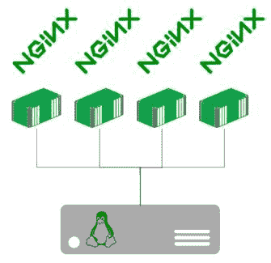
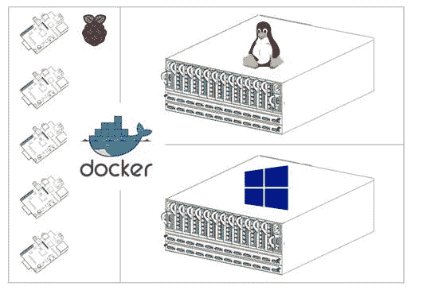

当您在 Linux 主机上运行 Docker 容器时，它运行在一个名为名称空间的隔离进程边界中。在容器内部，应用程序认为它在自己的计算机上运行，没有其他进程，但事实上，边界只是一个逻辑边界，可以有许多其他进程在同一个物理主机上运行。

您可以在主机上看到所有在容器内部和外部运行的进程，但是在容器中，您只能看到名称空间边界内的进程。图 11 显示了在运行多个 Nginx 容器的 Linux 机器上的情况。



图 11:运行 Nginx 的多个容器

如果您在其中一个容器中运行`top`命令，您将只看到一个`nginx`进程。但是如果您在主机上运行`top`，您将看到四个`nginx`进程和`dockerd`进程，这是 Docker 引擎的服务器部分，以及您正在运行的任何其他进程。

这就是为什么 Docker 容器可以如此高效地运行——它们使用主机的底层操作系统内核，以便容器内的进程实际上在主机上运行。对于主机而言，运行多个容器与运行多个进程是一样的(与虚拟机不同，虚拟机的每个虚拟机都有自己的内核和在主机上运行的虚拟机管理程序，以便在虚拟内核和真实内核之间进行转换)。

这就是为什么你不能在 Windows 上运行 Linux 容器，也不能在 Linux 上运行 Windows 容器。使用 Ubuntu 作为基础映像的容器需要在 Linux 机器上运行，这样当容器启动可执行文件时，主机就能够运行它。Linux 可执行文件与 Windows 不兼容，这意味着您不能在 Windows 上运行基于 Ubuntu 的容器。在本章中，我们将了解 Docker 如何在不同的操作系统上运行，并了解如何混合架构。

Linux 是 Docker 的原生操作系统。Linux 早就有了运行容器的技术，但是 Docker 带来了打包映像并将它们作为容器运行的概念，这使得利用底层 Linux 功能变得简单。当您运行基于 Linux 的容器时，您为您的主机使用服务器级 Linux 发行版，Docker 可能是您安装的唯一软件。您希望在服务器上运行的其他一切都将作为 Docker 中的容器运行。

Docker 可以在主要 Linux 发行版的包存储库中找到，唯一的要求是您的主机上运行着一个相当新的 Linux 内核版本。在撰写本文时，最低的 Linux 内核是 3.10，这是当前版本背后的一个完整的主要版本，这意味着 Docker 不需要最新的操作系统版本。

在 Linux 上安装 Docker 最快的方法是从代码清单 74 中的`get.docker.com`运行助手脚本。

代码清单 74:在 Linux 上安装 Docker

```
  $ curl
  -sSL http://get.docker.com | sh

```

这样做将在您的机器上安装 Docker 和 CLI，您可以运行容器，并使用我们到目前为止看到的命令创建或加入一个集群。Docker 包不安装 Docker Compose，但这是一个客户端工具，通常在单独的机器上运行。

|  | 提示:安装正确版本的 Docker 很重要。您的 Linux 发行版包含的版本不太可能是最新的。如果你不想从网上运行一个 shell 脚本，Docker Store 网站有所有支持的 Linux 发行版的详细说明。 |

您可以远程管理 Docker 主机，并且所有客户端都与引擎兼容，因此您可以从 Windows 或 Mac 机器上运行 Docker 命令行来处理远程 Linux 主机上的容器。

如果你使用`systemd`在 Linux 上运行 Docker 作为服务，这是 Ubuntu 的默认 init 系统，你会从状态输出中获得很多信息。代码清单 75 显示了当前没有运行任何容器的 Docker 引擎的输出。

代码清单 75:检查 Docker 守护程序的状态

```
  $ sudo service docker status
    docker.service - Docker
  Application Container Engine
     Loaded: loaded
  (/lib/systemd/system/docker.service; enabled; vendor preset: enabled)
     Active: active (running)
  since Sun 2016-08-21 09:10:21 BST; 6h ago
       Docs:
  https://docs.docker.com
   Main PID: 3091 (dockerd)
      Tasks: 41
     Memory: 1.6G
        CPU: 2min 35.083s
     CGroup:
  /system.slice/docker.service
             ├─3091
  /usr/bin/dockerd -H fd://
             └─3175
  docker-containerd -l
  unix:///var/run/docker/libcontainerd/docker-containerd.sock --shim
  docker-containerd-

```

每个运行的容器将在`CGroup`部分列出 Docker 正在使用的控制组。为了成功地使用 Docker，您不需要知道内核名称空间和控制组的细节，但是了解运行时结构如何影响安全性是很有用的。

### 关于安全的说明

Docker 减轻了构建、共享和运行软件系统的许多痛苦，但它并没有通过采取安全捷径来实现这一点。Docker 守护程序在 Linux 上以 root 权限运行，在 Docker 的早期，用户表示担心这是一个危险的攻击媒介—易受攻击的应用程序是否会受到威胁并获得对主机上其他容器的访问权限？

Docker 与互联网安全中心合作解决这些问题，并在一份基准文件中构建了一套全面的建议。这些对不同版本的 Docker 是公开可用的，例如 [CIS Docker 1.12.0 基准测试](https://benchmarks.cisecurity.org/tools2/docker/CIS_Docker_1.12.0_Benchmark_v1.0.0.pdf)。

Docker 的连续发布增强了安全性。现在，您可以在没有 root 权限的用户命名空间中运行容器，并且可以构建您的映像以使容器中的进程作为非 root 用户运行。Docker 文档中有一个关于 Docker 安全性的有用部分，涵盖了保护容器环境的技术元素。

|  | 提示:Docker 的一些特性实际上提高了系统的整体安全性。 [Docker Bench](https://github.com/docker/docker-bench-security) 工具作为一个容器运行，并扫描您的 Linux 主机的漏洞。 [Docker 安全扫描](https://docs.docker.com/docker-cloud/builds/image-scan/)是 Docker Hub 上的一项可选功能，可扫描存储库中的映像，并报告映像中软件的已知漏洞。 |

Windows Server 2016 和 Windows 10 对容器和 Docker 有本机支持。在 Windows 上运行容器有不同的方式:或者作为 Windows Containers，它共享操作系统内核并以类似于 Linux 容器的方式运行，或者作为 Hyper-V 容器，它可以使用与 Windows Containers 相同的映像，但运行在非常薄的虚拟机管理程序层中，以便每个容器都有自己的内核。

您不能在 Windows 上运行基于 Linux 的容器，但是 Windows 容器由 Docker 提供支持，这意味着您可以将应用程序打包成 Docker 映像二进制文件，并使用相同的 Docker 命令行工具在 Windows 中运行它们。为了让容器在 Windows 上运行，它们需要基于 Windows 映像，微软在 Docker Hub 上提供了基本映像。

该中心有两个基本的视窗容器图像:[微软/视窗服务器核心](https://hub.docker.com/r/microsoft/windowsservercore/)和[微软/纳米服务器](https://hub.docker.com/r/microsoft/nanoserver/)。视窗服务器核心是一个完整版本的视窗服务器，除了用户界面之外，它拥有所有标准的视窗服务器功能。使用服务器核心，您可以从 MSIs 安装软件并运行完整的。NET 框架，这意味着您可以将它用作一个基本映像来封装一个现有的 Windows 应用程序。

Nano Server 是 Windows 的最小安装，它遵循了集线器上的 Linux 基础映像的方法。纳米服务器的功能集有限，您不能运行微星或。NET 框架，只能用 PowerShell 来管理。这意味着该映像的重量约为 350 MB，而不是服务器核心的 3 GB，并且攻击面小得多。

Windows Containers 是 Docker 生态系统的新成员，但是 Windows 使用相同的 Docker 平台，因此它是一项成熟的技术。您可以使用代码清单 76 中的 Dockerfile 从 Windows Nano Server 构建一个简单的映像。

代码清单 76:Windows 容器映像的文档文件

```
  FROM microsoft/nanoserver
  CMD ["powershell",
  "Write-Host 'Hello from Windows Nano Server!'"]

```

|  | 注意:请记住，当您从 Docker 文件构建映像时，Docker 会创建临时容器来运行指令。由于此处的基础映像是一个 Windows 容器，因此您只能从 Windows 计算机构建此映像。如果您使用窗口 Docker，请确保切换到窗口容器选项。 |

当映像构建完成后，您可以以正常方式运行它。我已经从这个 Dockerfile 构建了一个映像并将其推送到 Hub 上，这样您就可以使用代码清单 77 中的命令运行它。

代码清单 77:运行 Windows 容器

```
  > docker container run
  sixeyed/nanoserver-helloworld
  Hello from Windows Nano Server!

```

|  | 注意:同样，这是一个基于 Windows 的容器。如果您的主机是苹果电脑或 Linux 机器，或者即使您使用的是在 Linux 虚拟机中运行的带有 Docker 的 Windows，您也不能运行它。可以在 Windows Server 2016 上直接用 [Docker 为 Windows](https://docs.docker.com/docker-for-windows/install/) 和 [Docker 使用 Windows 容器。](https://store.docker.com/editions/enterprise/docker-ee-server-windows) |

这些是标准的 Docker 容器，您可以用正常的方式管理，这样`docker container ls`将列出正在运行的容器，`docker image ls`将向您显示本地缓存中的所有图像。当您不需要安装繁重的软件并且可以从减少的占用空间中受益时，Nano Server 基础映像是新应用程序的良好起点。

Windows Server Core 映像不太符合拥有轻量级便携式容器的理念，因为一旦打包好应用程序，您就可以轻松地获得 5 GB 的映像。但这是一个很好的机会，可以将现有的视窗应用程序容器化，而不必重写它们，这样您就可以将现有的工作负载从自己的服务器上转移到 Docker 群中。

你也可以在基于高级 RISC 机器(ARM) CPU 架构的低成本、低功耗计算设备上运行 Docker，比如[树莓 Pi](https://www.raspberrypi.org/) 或者 [Pine64](https://www.pine64.com) 。ARM 设备往往很好地支持 Linux 操作系统，但不幸的是，您不能在 ARM 设备上运行正常的基于 Linux 的 Docker 映像。容器的 Linux 内核可能与 ARM 设备上的内核相同，但二进制映像可能是为 x86/x64 处理器指令集编译的，与 ARM 不兼容。

为了在 ARM 上运行 Docker 容器，容器必须是为 ARM 芯片组编译的，这实际上意味着从 ARM 设备上的 Docker 文件构建映像。一旦映像构建完成，您就可以以通常的方式将其发送，包括将其推送到 Docker Hub(Hub 上有许多 ARM 兼容的映像)。目前，ARM 映像不容易识别，因为您无法按芯片组或操作系统搜索集线器。

树莓圆周率是一个很好的 ARM 设备，因为`get.docker.com`上的设置脚本支持树莓圆周率的本地 Linux 发行版。因此，为了安装 Docker 命令行和 Docker 引擎，只需对其他 Linux 发行版使用相同的命令，如代码清单 78 所示。

代码清单 78:在树莓码头安装码头工人

```
  $ curl -sSL
  get.docker.com | sh

```

这对树莓 Pi 2、3 和 Zero 模型来说很好——这样你就可以让 Docker 在 5 美元的电脑上运行了！Docker Hub 上有 ARM 基础映像，这意味着您可以将运行在 ARM 上的任何应用程序容器化。因为流行的平台如 Java、Go 和 NodeJS 都支持 ARM，所以你可以为这些应用构建 Docker 映像。新的。微软的 NET Core 平台在下一个版本的路线图上有 ARM 支持。

代码清单 79 中的 Docker 文件可用于基于 Hub 上的`resin/rpi-raspbian`映像在 ARM 兼容的 Docker 映像中构建强制性的 Hello World 应用程序。

代码清单 79:ARM 映像的文档文件

```
  FROM resin/rpi-raspbian:jessie
  CMD
  ["echo", "Hello World from the Pi!"]

```

您可以像往常一样使用 Docker CLI 构建和运行该映像，但是与 Windows 容器一样，您必须在正确的体系结构上运行命令。在这种情况下，您需要构建映像并在 Pi 本身上运行容器，如代码清单 80 所示。

代码清单 80:在 ARM 上构建映像和运行容器

```
  pi@raspberrypi:~ $ docker
  build -t sixeyed/armhf-helloworld .
  Sending build context to Docker
  daemon 9.728 kB
  Step 1 : FROM
  resin/rpi-raspbian:jessie
   ---> e353bbe6de96
  Step 2 : CMD echo Hello World
  from the Pi!
   ---> Running in
  41038ed95981
   ---> cc950743d17a
  Removing intermediate container
  41038ed95981
  Successfully built cc950743d17a

  pi@raspberrypi:~ $ docker
  run sixeyed/armhf-helloworld
  Hello World from the Pi!

```

Docker Hub 上有许多基于 ARM 的映像。 [armhf](https://hub.docker.com/u/armhf) 帐户有运行在 ARM 上的 Node 和 Redis 的存储库，但是它们被标记为实验性的。目前集线器上兼容 ARM 的映像数量很少，在 ARM 设备上构建自己的映像可能很耗时，但是一旦有了映像，就可以用正常的方式从映像中运行容器。

Docker 在 ARM 上没有完全的功能奇偶校验，但是您可以将多个设备连接在一起形成一个集群。有趣的是，该群支持异构主机，这意味着您可以构建 arm、x64、Linux 和 Windows 主机的混合群。

您不能在单个 Docker 主机上混合不同操作系统内核和 CPU 架构的容器，但是您可以用来自多个架构和操作系统的主机构建一个集群，并且您可以在集群上运行不同类型的容器。图 12 显示了一个混合集群的示例架构。



图 12:一个(非常)混合的码头工人群体

这个场景并不像看起来那么极端。只要主机之间有足够快的网络连接，这个群就具有很高的功能，并给你很大的灵活性。您可以在 Windows 节点上的 Windows Server Core 容器中运行现有的 ASP.NET 应用程序，在 Linux 节点上运行的 Nginx 中为它们提供缓存代理，并将 ARM 节点用于非关键工作负载，例如从其他容器中收集指标并运行性能仪表板。

您可以用与普通群相同的方式创建一个混合群，从一个管理器开始并加入新节点。但是为了确保容器只在正确的节点上运行，您需要给 Docker 一些额外的信息。您可以向 Docker 主机添加任意标签，例如，您可以向主机添加像`cpu=armhf`或`os=linux`和`os=windows`这样的标志。

在代码清单 81 中，我创建了一个混合群，x64/Linux 节点作为管理器，树莓 Pi 作为工作器。我使用带有`--label-add`选项的`update`命令，用自定义的`cpu=armhf`标签来标记圆周率。

代码清单 81:标记群节点

```
  $ docker node ls
  ID                          
  HOSTNAME     STATUS  AVAILABILITY  MANAGER STATUS
  0bvd2x0lh4e5kbpzpydvev02r * 
  sc-ub-brix   Ready   Active        Leader
  3he5xk2ve5fewk4j0pmwhqril   
  raspberrypi  Ready   Active  

  $ docker node update
  --label-add cpu=armhf raspberrypi
  raspberrypi

```

可以用约束来调度服务，以告诉 Docker 它们有特殊的主机要求。可以在约束中使用节点标签，这样我们就可以使用代码清单 82 中的命令运行基于 x64 的 Nginx 容器的三个副本(不包括带有`cpu=armhf`标签的节点)。

代码清单 82:创建带有节点标签约束的服务

```
  $ docker
  service create --name website --constraint 'node.labels.cpu != armhf'
  --replicas 3 nginx:alpine
  dqtfwk7zmxe44r1ztrh2k116m

```

当调度器选择节点时，它将排除任何带有关键字`cpu`和值`armhf`的标签。在这种情况下，只剩下管理器节点，正如我们在代码清单 83 中看到的，所有三个容器都在管理器上运行。

代码清单 83:列出服务实例

```
  $ docker service ps website
  ID                        
  NAME       IMAGE         NODE        DESIRED STATE  CURRENT STATE         
  ERROR
  7z9a5k5vaepdqer9eyi7izg16 
  website.1  nginx:alpine  sc-ub-brix  Running        Running 6 seconds ago  
  el30vk6euevq7swx1e9fw4axe 
  website.2  nginx:alpine  sc-ub-brix  Running        Running 5 seconds ago  
  5g2p0f9d8i28jqfh01of1hft0 
  website.3  nginx:alpine  sc-ub-brix  Running        Running 6 seconds ago

```

Docker 支持两种标签:节点标签和引擎标签，前者是在集群模式下引入的，用于调度约束，后者用于在旧主机上向后兼容。为了设置 Docker Engine 标签，您需要修改主机上的环境配置，这将因操作系统而异。节点标签可以在管理器上管理，这意味着它们是更好的方法。

|  | 注意:为了跨混合集群的系统，您需要创建一个覆盖网络，并使用- network 选项启动服务。不同的平台有不同的网络堆栈，但是从 Docker 17.06 开始，您可以跨混合集群网络容器。 |

我们已经了解了 Docker 容器如何在不同的操作系统和 CPU 架构上工作。最主要的一点就是不能混搭——基于 Windows 的镜像只能在 Windows 主机上运行，基于 Linux 的镜像只能在 Linux 主机上运行，为 x64 编译的镜像只能在 x64 主机上运行。

借助 Docker 群集模式，您可以让节点在不同的体系结构和操作系统上运行，这使您能够运行单个集群，该集群能够通过单个管理界面托管 Linux、Windows 甚至 arm 应用程序。当您为计算付费时，这是一个特别重要的选项。如果您想在云中运行 Dockerized Windows 应用程序，您可以让 Windows 虚拟机作为工作节点，同时使用更便宜的 Linux 虚拟机作为管理器节点。

在 Docker 上运行云解决方案特别有吸引力，因为您可以获得一致的打包和部署模型，可以在任何云上使用，这意味着您可以避免被锁定在特定的云平台上。接下来，我们将看看云中的 Docker。