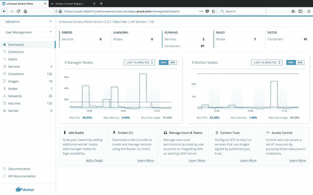
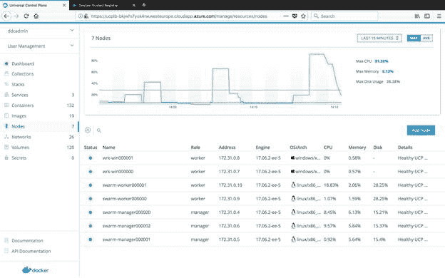
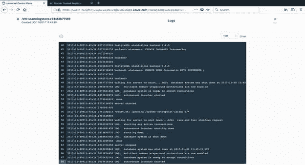
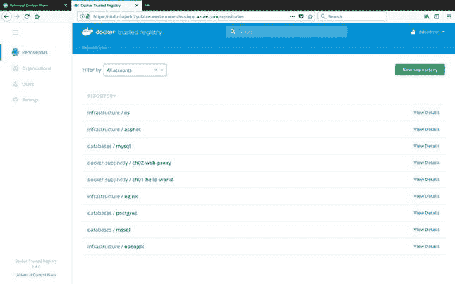
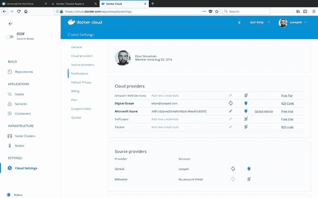
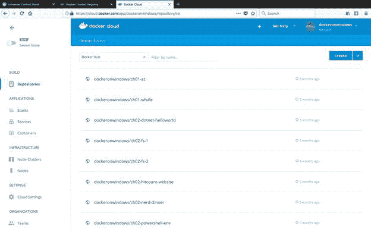

# 第九章继续你的码头工人之旅

Docker 是一项简单的技术，这本*简洁的*电子书有足够多的细节，开始使用你应该会很舒服。最后一章将介绍一些有用的后续步骤，当您准备好使用自己的应用程序尝试 Docker 时，可以考虑这些步骤。

Docker 是一项成熟的技术，得到了亚马逊、微软和 IBM 等大型企业的技术支持和资金支持，目前正在优步网飞和其他尖端科技公司进行生产。应用程序容器是一种新的计算模式，Docker 可以真正彻底改变您构建、运行和支持软件的方式，但它不一定是一场暴力革命。

在最后一章中，我们将了解 Docker，Inc .的产品，这些产品简化了您自己的数据中心和云中 Docker 的管理，同时为您的 Docker 主机提供商业支持。我们将介绍 Docker 在成功实现中出现的一些主要用例，并且我将提供关于 Docker 下一步发展方向的建议。

Docker 生态系统中的核心技术——Docker 服务器、CLI、Docker Compose、Docker Machine 和“Docker for”系列——都是免费的开源工具。开源项目的主要贡献者是 Docker，Inc .，一家由 Docker 创始人创建的商业公司。除了免费工具之外，Docker，Inc .还为需要软件支持的企业和公司提供了一套商业产品。

Docker，Inc .产品使管理多台主机、运行安全映像注册表、使用不同的基础架构以及监控系统活动变得更加容易。Docker 企业版(Docker EE)在内部和云中运行。

### 码头工人 EE

Docker 企业版有两种风格——基本版为您的容器运行时提供生产支持，高级版为您提供完整的容器即服务解决方案，您可以在数据中心或任何云中运行。 [Docker EE Basic](https://www.docker.com/enterprise-edition) 拥有与 Docker 社区版相同的功能集，因此可以在支持下运行容器和集群。Docker EE Advanced 有一个更大的功能集，这将加速您的生产。

Docker EE Advanced 有两个组件——通用控制平面(UCP)，它是您管理容器和主机的地方；以及 Docker Trusted Registry (DTR)，它是您自己的安全私有映像注册表。UCP 和 DTR 整合在一起，提供了一个安全的软件供应链。

UCP 位于编排层之上，它支持多个调度器。在撰写本文时，它支持经典的 Docker swarm 和 Docker Swarm 模式。这两种技术都运行在同一个集群上。对 [Kubernetes](https://www.docker.com/kubernetes) 的支持即将来到 Docker EE，您将能够在 Kubernetes 和 Docker 上部署应用程序，并在同一组服务器上群集。

UCP 有一个网络用户界面来管理你的本地码头工人的财产。图 15 描述了带有仪表板的主页，显示了 UCP 正在管理多少资源——主机、映像、容器和应用程序。这也显示了主机是如何努力工作的。

图 15:通用控制平面仪表板

UCP 是一个整合的管理门户。您可以创建卷和网络，从图像运行单个容器，或者从 Docker Compose 文件运行多容器应用程序。从节点视图中，您可以看到集群中机器的概述。在图 16 中，我们可以看到一个混合集群，包含 Linux 管理器节点、Linux 工作节点和 Windows 工作节点。

图 16:检查 UCP 的群节点

在容器页面上，您可以深入到一个正在运行的容器中，检查 CPU 内存和网络使用情况，连接控制台，或者检查日志，如图 17 所示。

图 17:查看来自 UCP 的集装箱日志

UCP 为您的 Docker 资源提供基于角色的访问控制。所有资源都可以应用任意键值对的标签。权限应用于标签。您可以在 UCP 内部创建用户和团队，或者连接到 LDAP 源以导入用户详细信息，并在团队或用户级别授予资源标签权限。

您可以让 UCP 管理多个环境并配置权限，以便开发人员可以在集成环境中运行容器，但是只有测试人员可以在登台环境中运行它们，并且只有生产支持团队可以在生产中运行容器。UCP 使用相同的 API 与 Docker 引擎通信，但是引擎也是安全的。为了使用 Docker CLI 管理 UCP 引擎，您需要 UCP 生成的证书，这意味着您不能绕过 UCP 权限。

您可以使用 Docker 数据中心的另一部分—Docker 可信注册表(DTR)来保护主机上运行的映像。DTR 使用与 Hub 相同的注册应用编程接口，这意味着您可以以相同的方式使用它，但是它也有自己的网络用户界面。DTR 用户界面类似于 Docker Hub 用户界面，但作为一个私有注册中心，因此您拥有更多的控制权。DTR 共享您在 UCP 设置的身份验证。用户可以拥有自己的存储库，您可以为共享存储库创建组织。图 18 显示了可以访问所有存储库的管理员用户的 DTR 主页。

图 18:Docker 可信注册表

DTR 和 UCP 是紧密结合的，这意味着你可以使用你自己的图像库作为在 UCP 蜂群上运行容器和应用程序的来源。

|  | 提示:DTR 具有与 Docker Hub 相同的安全扫描功能，这意味着您自己的私人图像可以被扫描漏洞。因为 DTR 也有[内容信任](https://docs.docker.com/engine/security/trust/content_trust/)，你可以安全地签署图像，并配置你的 Docker 引擎，使它们只运行来自签署图像的容器。 |

### 码头工人云

[Docker Cloud](https://www.docker.com/products/docker-cloud) 提供了与 Docker EE 类似的一组功能，但它是用于管理公共云中的映像和节点。Docker EE 非常适合企业，在企业中，您将需要针对大量映像和主机的细粒度访问控制和安全性。对于部署到公共云的较小公司或项目团队，Docker Cloud 为您提供了类似级别的控制，但没有商业支持。

Docker Cloud 的工作方式类似于 Docker Machine，用于调配新节点。它拥有所有主要云的提供商，您可以从 Docker Cloud 中启动运行 Docker 的新主机。当您使用 Docker Cloud 时，您有两种商业关系:您的基础架构由云提供商计费，附加的 Docker 功能由 Docker，Inc .计费。

图 19 显示我登录了[https://cloud.docker.com](https://cloud.docker.com)(你可以使用你的 Docker Hub 凭证，试用 Docker Cloud 你不需要从付费计划开始)与我的 DigitalOcean 和 Azure 帐户设置。

图 19:Docker 云中的云提供商

您可以在所选的云提供商上创建节点集群，Docker Cloud 将创建一个安装了商业支持的 Docker Engine 的虚拟机。Docker Cloud 与公共 Docker Hub 的集成方式与 UCP 和 DTR 内部集成的方式相同。您可以从 Hub 中的映像部署容器，并且可以创建仅对您或您的组织可见的私有存储库。

在图 20 中，我的 Docker Hub 存储库显示在 Docker 云用户界面中，我可以从这里直接部署到我的云 Docker 节点。

图 20:Docker 云中的图像存储库

通过 Docker Cloud 的付费计划，您可以为自己的存储库获得与 Docker 可信注册中心和 Hub 上的官方存储库相同的映像安全扫描。

|  | 提示:这是对 Docker 企业版和 Docker 云的快速浏览，但两者都值得进一步研究。商业支持和安全访问是许多企业采用新技术的先决条件。 |

Docker 正在推动软件构建和管理方式的重大变革。Docker 产品套件的功能，加上 Docker，Inc .的商业支持，是构建更好的软件和更快交付软件的基础。

Dockerfile 并不经常被认为是对软件行业的主要贡献，但它可以为希望采用 DevOps 的组织发挥关键作用。向 DevOps 的过渡意味着统一现有的开发和运营团队，Dockerfile 是不同关注点可以满足的一个明显的中心点。

本质上，Dockerfile 是一个部署指南。但是，它不是一个开放给人类解释的模糊文档，而是一组简洁、清晰、可操作的步骤，用于将应用程序打包成一个可运行的容器映像。对于开发和运营团队来说，这是一个很好的会面的第一个地方——开发人员可以从一个简单的 Dockerfile 开始打包应用程序，然后运营部门可以接管它，强化映像或换成一个兼容但定制的基础映像。

顺利的部署管道对于成功的开发运维至关重要。采用 Docker 作为您的主机平台意味着您可以从每个构建生成版本化的映像，将它们部署到您的测试环境中，并且当您的测试套件通过时，升级到试运行和生产，因为您知道您将运行与通过测试完全相同的代码库。

|  | 提示:Docker swarm 模式支持滚动服务更新，这意味着当您将正在运行的应用程序升级到新版本时，Docker 将逐步删除旧版本的实例，并调出新版本。这使得无状态应用的升级非常安全。参见[滚动更新教程](https://docs.docker.com/engine/swarm/swarm-tutorial/rolling-update/)了解滚动升级的更多信息。 |

Docker 还通过主机环境的简单性为 DevOps 做出了巨大贡献。在数据中心内，您的虚拟机设置可以像简单地安装基本操作系统和 Docker 一样精简，其他一切，包括业务应用程序和操作监控，都在群集的容器中运行。

新的操作系统可能会越来越受欢迎，以支持 Docker 的简单性。Canonical 有 Ubuntu 爽快核，微软有 Nano Server。它们都是轻量级操作系统，可以用于基于容器的映像，但也可以用作服务器上的主机操作系统。它们具有最小的功能集，相当于最小的攻击面，大大降低了修补需求。

DevOps 的关键技术实践——基础架构即代码、连续交付、连续监控——都通过 Docker 变得更加简单，它将您的应用程序环境简化为几个简单的原语:映像、容器和主机。

容器化解决方案不仅适用于绿地应用开发。将一个现有的应用程序分解成独立的应用程序容器，可以将一个重量级的单一应用程序转变成一组精简的、易于升级的服务。Docker 的轻量级容器和内置编排为微服务架构提供了主干。

微服务架构实际上更容易应用于现有的应用程序，而不是新的系统，因为您已经清楚地知道在哪里可以找到逻辑服务边界和物理痛点。有两个很好的候选人可以在不需要对应用程序进行重大重写的情况下，从一个整体中分离出独立的服务:

*   小的、包含良好的组件，如果它们易于更改，可以增加业务价值。
*   更大、高度集成的组件，如果保持不变，可以增加业务价值。

例如，考虑一个企业使用的网络应用程序，该应用程序经常想要更改主页，以便尝试增加客户参与度，而很少想要更改结账阶段，因为它觉得该阶段完成了它需要做的一切。如果该应用程序当前是作为一个单一的整体单元部署的，您就不能对主页进行快速、简单的更改——您需要测试和部署整个应用程序，包括尚未更改的签出组件。

将主页和签出组件拆分为单独的应用程序容器意味着您可以对主页进行更改并频繁部署，同时知道不会影响签出组件。您应该只测试您所做的更改，如果新版本不太受欢迎，您可以轻松地回滚。

微服务的成本是许多小服务协同工作的额外复杂性。然而，在 Docker 容器中运行这些服务会带来编排问题，Docker 生态系统很好地解决了这个问题。

为了更好地利用 Docker，您不需要开始 DevOps 过渡或重新设计您的关键系统。如果您从迁移您经常使用并理解的应用程序开始，您将很快获得在容器中运行应用程序的宝贵经验和信心。

开发工具集是一个很好的起点，令人惊讶的是，您所依赖的工具往往已经被包装成 Hub 上的 Docker 映像。最起码，你需要做的就是把图像拉出来检查一下。最多，您可以使用首选的基本操作系统和工具构建一个新映像。

很多团队都是从将自己的核心系统容器化开始的——[git lab](https://hub.docker.com/u/gitlab/)和 [Jenkins](https://jenkins.io/) 在 Hub 上有非常受欢迎的存储库，你可以找到大量文件共享、wikis 和代码分析等工具的示例图像。

每天使用容器是适应 Docker 的最快方法，您很快就会发现 Docker 改进的各种场景。祝旅途愉快！