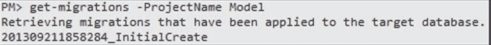

我们需要显式地向实体框架传递要使用的连接字符串，该字符串与特定的提供者相关。我们可以通过`OnConfiguring`方法来实现，如下所示:

代码清单 47

```
public class ProjectsContext : DbContext
{
  private readonly String _nameOrConnectionString; 

  public ProjectsContext(String nameOrConnectionString)
  {
    _nameOrConnectionString = nameOrConnectionString;
  }

  protected override void OnConfiguring(DbContextOptionsBuilder optionsBuilder)
  {
    optionsBuilder.UseSqlServer(_nameOrConnectionString);
    base.OnConfiguring(optionsBuilder);
  }
}

```

另一种选择是使用接受`DbContextOptions`对象的基本构造函数:

代码清单 48

```
public class ProjectsContext : DbContext
{
  public ProjectsContext(DbContextOptions options) : base(options)
  {
  }

  private static DbContextOptions GetOptions(string connectionString)
  {
    var optionsBuilder = new DbContextOptionsBuilder();
    return optionsBuilder.UseSqlServer(connectionString).Options;
  }
}

```

顾名思义，代码优先模型出现在数据库之前。然而，我们仍然需要它，并且必须创造它。实体框架为此提供了一个应用编程接口。如果我们决定应该创建它，我们需要启动一个新的上下文，并通过调用`EnsureCreated`要求它为我们这样做:

代码清单 49

```
using (var ctx = new ProjectsContext())
{
  //will create the database if it doesn’t already exist.
  ctx.Database.EnsureCreated();
}

```

|  | 提示:由连接字符串指定的用户(甚至可以是当前的 Windows 用户)必须具有创建数据库的访问权限。 |

|  | 提示:如果数据库已经存在，`Create`将失败，`CreateIfNotExists`将返回`false`。 |

实体框架核心删除了数据库初始化器——它们不再包含在代码中。

我们都知道模式和数据会随着时间的推移而变化，无论是添加另一列还是修改基本记录。实体框架核心提供了一种基于代码的方法来处理模式的变化:迁移。

迁移提供了对生成模型的细粒度控制。我们首先创建一个迁移，其名称描述了我们的目的，为此我们需要一些 NuGet 包:

*   [https://www.nuget.org/packages/Microsoft.实体框架工具网](https://www.nuget.org/packages/Microsoft.EntityFrameworkCore.Tools.DotNet)作为一个**点网工具参考**在。csproj 文件
*   [微软。实体框架工作中心工具](https://www.nuget.org/packages/Microsoft.EntityFrameworkCore.Tools)

更多信息请参考[https://docs . Microsoft . com/en-us/ef/core/get-start/aspnet core/new-db](https://docs.microsoft.com/en-us/ef/core/get-started/aspnetcore/new-db)。

我们在包管理器控制台中执行`Add-Migration`:

`Add-Migration InitialVersion`

或者，使用命令行执行以下操作:

`dotnet ef migrations add InitialCreate`

这将仅在迁移文件夹上创建迁移类，迁移文件夹的名称反映了传递给`Add-Migration`的名称及其创建的时间戳，时间戳继承自类迁移。这个新类是空的，除了两个方法声明，它们是从基类重写的:

*   [Up](http://msdn.microsoft.com/en-us/library/system.data.entity.migrations.dbmigration.up.aspx) :将指定运行迁移时将应用于数据库的更改。
*   [Down](http://msdn.microsoft.com/en-us/library/system.data.entity.migrations.dbmigration.down.aspx) :将包含 Up 方法中声明的变更的反向内容，用于回滚此迁移的情况。

|  | 注意:这个类不特定于任何实体框架核心上下文；它只关心数据库。 |

当 Entity Framework 创建迁移时，它会在目标数据库中为支持它的数据存储创建一个`__MigrationHistory`表，当然类似于关系数据库。这是跟踪所有迁移的地方。

让我们看一个简单的例子。

代码清单 50

```
  public partial class InitialCreate : Migration
  {
    public override void Up()
    {
      /* … */
    }

    public override void Down()
    {
      /* … */
    }
  }

```

如您所见，我没有显示 [Up](http://msdn.microsoft.com/en-us/library/system.data.entity.migrations.dbmigration.up.aspx) 方法的所有内容，所有操作在 [Down](http://msdn.microsoft.com/en-us/library/system.data.entity.migrations.dbmigration.down.aspx) 方法中都是相反的。

`Migration`类包含大多数典型数据库操作的辅助方法，但是如果我们需要一些不同的东西，我们总是可以使用 [Sql](http://msdn.microsoft.com/en-us/library/system.data.entity.migrations.dbmigration.sql.aspx) 方法:

代码清单 51

```
Sql("-- some SQL command");

```

既然我们已经完成了迁移，我们不妨使用命令行来执行它:

`dotnet ef database update`

或**包装管理器控制台**:

`Update-Database -TargetMigration InitialCreate`

|  | 提示:与之前的版本不同，不再有`Seed`方法。 |

再次可以看到`__MigrationHistory`表更新了。


图 13:命名迁移后的 __MigrationHistory 表

我们通过用某个名称调用`Add-Migration`来添加新的迁移。当然，我们总是可以通过使用`Update-Database`回到之前的状态，或者已经运行的任何命名迁移所标识的状态。


图 14:返回到初始数据库版本

如果要恢复到命名迁移，只需将其名称作为参数传递给`Update-Database`。


图 15:恢复到命名版本

任何时候，您都可以通过调用`Get-Migrations`命令来查看数据库中已经执行了哪些迁移。



图 16:列出所有应用的迁移

最后一个警告:要使用迁移，您的上下文需要有一个公共的、无参数的构造函数。为什么呢？因为它需要通过迁移基础架构的反射来实例化，而迁移基础架构无法知道它应该采用哪些参数。严格来说，这并不完全正确:如果迁移框架可以找到`IDesignTimeDbContextFactory<T>` (以前是 `IDbContextFactory<T>,` ，但这个接口在 EF Core 2 中被弃用)的公共实现，其中`T`是您的 [DbContext](https://msdn.microsoft.com/en-us/library/system.data.entity.dbcontext(v=vs.113).aspx) 的类型，那么它将自动调用其 [Create](https://msdn.microsoft.com/en-us/library/mt155160(v=vs.113).aspx#M:System.Data.Entity.Infrastructure.IDbContextFactory) 方法:

代码清单 52

```
  public class ProjectsContextFactory : IDesignTimeDbContextFactory<ProjectsContext>
  {
    public ProjectsContext Create(string [] args)
    {
      //create and return a new
  ProjectsContext.
      return new ProjectsContext(/* … */);
    }
  }

```