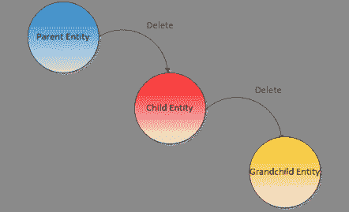
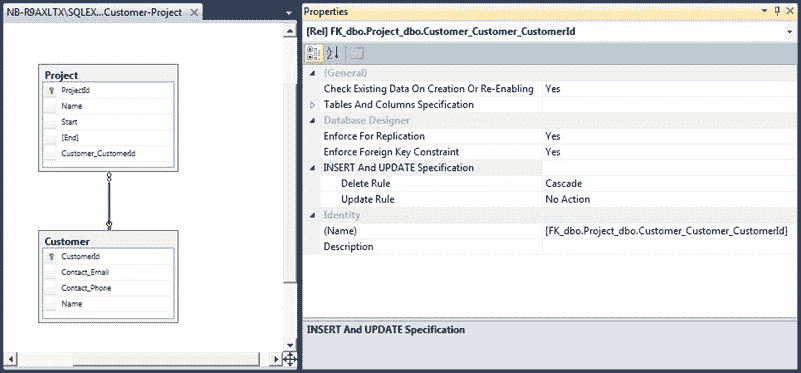
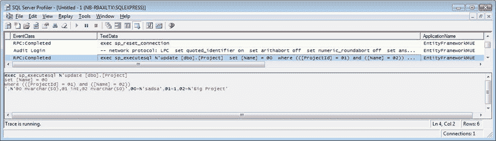

因为 EF 与 POCOs 一起工作，创建一个新的实体只是用新的操作符实例化它的问题。如果我们希望它最终到达数据库，我们需要将它附加到现有的上下文中。

代码清单 94

```cs
var developmentTool = new DevelopmentTool() { Name = "Visual Studio 2017", 
Language = "C#" };

ctx.Tools.Add(developmentTool);

```

新实体必须添加到同类型的 [DbSet < T >](https://msdn.microsoft.com/en-us/library/gg696460(v=vs.113).aspx) 属性中，这也是您查询的网关。另一种选择是向[数据库上下文](http://msdn.microsoft.com/en-us/library/system.data.entity.dbcontext.aspx)本身添加一批新实体，可能是不同类型的:

代码清单 95

```cs
DevelopmentTool tool = /* something */;
Project project = /* something */;
Customer customer = /* something */; 

ctx.AddRange(tool, project, customer);

```

但是，这个新实体不会立即发送到数据库。英孚上下文实现了工作单元模式，这是马丁·福勒创造的一个术语，关于它你可以在这里阅读更多。简而言之，这种模式声明工作单元容器将在内部保留一个需要持久化的项目列表(新的、修改的或删除的实体)，并将以原子方式保存它们，考虑它们之间的任何最终依赖关系。当我们调用[数据库上下文](http://msdn.microsoft.com/en-us/library/system.data.entity.dbcontext.aspx)的[保存更改](https://msdn.microsoft.com/en-us/library/system.data.entity.dbcontext.savechanges(v=vs.113).aspx)方法时，这些实体首先被保存在实体框架代码中。

代码清单 96

```cs
var affectedRecords = ctx.SaveChanges();

```

此时，所有挂起的更改都被发送到数据库。实体框架采用一级(或本地)缓存，所有的“脏”实体——比如添加到上下文中的那些——都在缓存中等待时间的到来。 [SaveChanges](https://msdn.microsoft.com/en-us/library/system.data.entity.dbcontext.savechanges(v=vs.113).aspx) 方法返回成功插入的记录数，如果过程中出现错误，将抛出异常。在这种情况下，所有的更改都会回滚，您真的应该考虑这个场景。

至于更新，实体框架会自动跟踪对已加载实体的更改。对于每个实体，它知道它们的初始值是什么，如果它们与当前值不同，则该实体被认为是“脏的”下面是一个示例代码。

代码清单 97

```cs
//load some entity.
var tool = ctx.Tools.FirstOrDefault();

ctx.SaveChanges(); //0

//change something.
tool.Name += "_changed";

//send changes.
var affectedRecords = ctx.SaveChanges(); //1

```

如您所见，不需要单独的更新方法，也不存在单独的更新方法，因为所有类型的更改(插入、更新和删除)都是由 [SaveChanges](https://msdn.microsoft.com/en-us/library/system.data.entity.dbcontext.savechanges(v=vs.113).aspx) 方法自动检测和执行的。 [SaveChanges](https://msdn.microsoft.com/en-us/library/system.data.entity.dbcontext.savechanges(v=vs.113).aspx) 仍然需要调用，它将返回所有插入和更新的实体的合并计数。如果违反了某种完整性约束，那么就会抛出异常，这需要适当地处理。

当您拥有对加载实体的引用时，您可以将其标记为已删除，这样当更改被持久化时，EF 将删除相应的记录。在 EF 中删除一个实体包括将其从[数据库集< T >](https://msdn.microsoft.com/en-us/library/gg696460(v=vs.113).aspx) 集合中删除。

代码清单 98

```cs
//load some entity.
var tool = ctx.Tools.FirstOrDefault();

//remove the entity.
ctx.Tools.Remove(tool);

//send changes.
var affectedRecords = ctx.SaveChanges(); //1

```

当然，仍然需要调用 [SaveChanges](https://msdn.microsoft.com/en-us/library/system.data.entity.dbcontext.savechanges(v=vs.113).aspx) 来使更改永久化。如果违反了任何完整性约束，将引发异常。

|  | 注意:实体框架将以适当的顺序应用所有挂起的更改(插入、更新和删除)，包括依赖于其他实体的实体。 |

当我们谈到本地缓存时，您可能会问自己这个缓存在哪里，以及可以用它做什么。

您可以使用`Entry`方法访问实体的本地缓存条目。这将返回一个`EntityEntry`的实例，其中包含大量有用的信息，如实体的当前状态(如上下文所示)、初始值和当前值等。

代码清单 99

```cs
//load some entity.
var tool = ctx.Tools.FirstOrDefault();

//get the cache entry.
var entry = ctx.Entry(tool);

//get the entity state.
var state = entry.State; //EntityState.Unchanged

//get the original value of the Name property.
var originalName = entry.OriginalValues["Name"] as String; //Visual Studio 2017

//change something.
tool.Name += "_changed";

//get the current state
state = entry.State; //EntityState.Modified

//get the current value of the Name property.
var currentName = entry.CurrentValues["Name"] as String; //Visual Studio 2017_changed

```

如果您想检查当前正在跟踪的所有条目，有 [ChangeTracker](http://msdn.microsoft.com/en-us/library/system.data.entity.dbcontext.changetracker.aspx) 属性。

代码清单 100

```cs
//get all the added entities of type Project.
var addedProjects = ctx
  .ChangeTracker
  .Entries()
  .Where(x => x.State == EntityState.Added)
  .Select(x => x.Entity)
  .OfType<Project>();

```

有时候你需要做大量的修改，在这种情况下，没有什么比好的旧 SQL 更好的了。英孚核心在数据库属性中提供了`ExecuteSqlCommand`，您可以使用它:

代码清单 101

```cs
  var rows =
  ctx.Database.ExecuteSqlCommand($"DELETE FROM Project WHERE ProjectId
  = {id}");

```

如您所见，您甚至可以使用插值字符串，EF Core 会将其转换为安全的参数化字符串。

有一个特殊的基础设施接口叫做 [ILocalViewListener](https://docs.microsoft.com/en-us/ef/core/api/microsoft.entityframeworkcore.changetracking.internal.ientitystatelistener) ，它注册在实体框架中，每当实体的状态改变时(比如当它将要被保存、删除、更新等时)就会被调用。).我们这样使用它:

代码清单 102

```cs
  var events =
  ctx.GetService<ILocalViewListener>();
  events.RegisterView((entry,
  state) =>
  {
    //entry contains the
  entity’s details.
    //state is the new state.
  });

```

可以在数据库中创建两个相关的表，这样，当父表的一条记录被删除时，子表中所有相应的记录也会被删除。这被称为级联删除。



图 17:级联删除

这对于自动保持数据库完整性非常有用。如果数据库没有为我们这样做，我们将不得不手动这样做；否则，我们最终会有孤儿记录。这仅适用于父子或主从关系，其中一个端点不能与另一个端点分开存在。不是所有的关系都应该这样建立；例如，当父端点是可选的时，我们通常不会级联。想想客户和项目的关系:没有客户的项目是没有意义的。另一方面，在没有指定开发人员的情况下有一个 bug 是有意义的。

当实体框架创建数据库时，它将根据映射创建适当的级联约束。



图 18:级联删除

到目前为止，英孚对此应用了一个约定，但是它可以被流畅的映射覆盖。

表 2

| 关系 | 默认级联 |
| --- | --- |
| 一对一 | 不 |
| 一对多 | 仅当需要一个端点时 |
| 多对一 | 不 |

我们可以在 fluent 配置中显式配置级联选项，如下所示:

代码清单 103

```cs
  //when
  deleting a Project, delete its ProjectDetail.
  builder
    .Entity<Project>()
    .HasOne(b
  => b.Detail)
    .WithOne(d
  => d.Project)
    .OnDelete(DeleteBehavior.Cascade);

  //when
  deleting a ProjectResource, do not delete the Project. 
  builder
    .Entity<ProjectResource>()
    .HasOne(x
  => x.Project)
    .WithMany(x
  => x.ProjectResources)
    .OnDelete(DeleteBehavior.SetNull);

  //when
  deleting a Project, delete its ProjectResources. 
  builder
    .Entity<Project>()
    .HasMany(x
  => x.ProjectResources)
    .WithOne(x
  => x.Project)
    .OnDelete(DeleteBehavior.Cascade);

```

|  | 提示:你可以有多级级联，只要确保你没有循环引用。 |

|  | 注意:级联删除发生在数据库级别；实体框架不为此发布任何 SQL。 |

当 EF 作为查询结果加载记录时，会创建一个实体并将其放入本地缓存中。当执行一个新的查询，返回与已经在本地缓存中的实体相关联的记录时，不会创建新的实体；而是返回缓存中的一个。这偶尔会有不良的副作用:即使实体记录中发生了变化，本地实体也不会更新。这是实体框架执行的一种优化，但有时它会导致意想不到的结果。如果我们想确保我们有最新的数据，我们需要强制显式刷新，首先，从本地缓存中删除实体:

代码清单 104

```cs
//load some entity.
var project = ctx.Projects.Find(1);

//set it to detached.
ctx.Entry(project).State = EntityState.Detached;

//time passes…

//load entity again.
project = ctx.Projects.Find(1);

```

实体框架核心允许我们更新它:

代码清单 105

```cs
  ctx.Entry(project).Reload();

```

即使是特定的财产:

代码清单 106

```cs
  ctx

  .Entry(project)
    .Property(x
  => x.Name)

  .EntityEntry
    .Reload();

```

或收藏:

代码清单 107

```cs
  ctx

  .Entry(customer)

  .Collection(x => x.Projects)

  .EntityEntry
    .Reload();

```

乐观并发控制是一种使用数据库的方法，它假设多个事务可以在不相互影响的情况下完成；不需要锁定。每个更新事务都将检查数据库中自读取以来是否有任何记录被修改，如果有，将失败。这对于在 web 应用程序的上下文中处理对数据的多次访问非常有用。

有两种方法可以处理数据被更改的情况:

*   第一个获胜:第二个事务将检测到数据已经被更改，并将抛出一个异常。
*   最后一个获胜:当它检测到数据已经改变时，第二个事务选择覆盖它。

实体框架支持这两种方法。

我们有一个从数据库获得的实体实例，我们改变它，并告诉 EF 上下文保持它。由于乐观并发，如果数据被更改， [SaveChanges](https://msdn.microsoft.com/en-us/library/system.data.entity.dbcontext.savechanges(v=vs.113).aspx) 方法将抛出一个[dbupdateconcurrency exception](https://msdn.microsoft.com/en-us/library/system.data.entity.infrastructure.dbupdateconcurrencyexception(v=vs.113).aspx)，因此请确保将其包装在一个`try…catch`中。

代码清单 108

```cs
try
{
  ctx.SaveChanges();
}
catch (DbUpdateConcurrencyException)
{
  //the record was changed in the database, notify the user and fail.
}

```

“第一个赢”的方法就是这样:如果发生了变化，就失败。

对于这一个，我们将检测到已经进行了更改，并且我们将显式覆盖它。然而，在实体框架核心中，我们不能以一种简单的方式自动做到这一点。

默认情况下，实体框架不执行乐观并发检查。您可以通过选择其值将与当前数据库值进行比较的一个或多个属性来启用它。这是通过在属性映射时应用[并发检查属性](http://msdn.microsoft.com/en-us/library/system.componentmodel.dataannotations.concurrencycheckattribute.aspx)来完成的。

代码清单 109

```cs
public class Project
{
  [Concurrency][ConcurrencyCheck]
  public DateTime Timestamp { get; set; }
}

```

或者通过代码映射。

代码清单 110

```cs
protected override void OnModelCreating(ModelBuilder modelBuilder)
{
  modelBuilder
    .Entity<Project>()
    .Property(x => x.Name)
    .IsConcurrencyToken();
}

```

发生的情况是这样的:当 EF 为一个`UPDATE`操作生成 SQL 时，它将不仅包括对主键的`WHERE`限制，还包括对任何标记为并发检查的属性的限制，将它们的列与原始值进行比较。



图 19:带有并发控制检查的更新

如果受影响记录的数量不是`1`，这可能是因为数据库中的值与实体框架已知的原始值不匹配，因为它们已经被实体框架之外的第三方修改过。

SQL Server 有一种数据类型，其值不能显式设置，而是在它们所属的记录发生更改时自动更改: [ROWVERSION](http://technet.microsoft.com/en-us/library/ms182776.aspx) 。其他数据库提供类似的功能。

因为实体框架与 SQL Server 有很好的集成，所以乐观并发检查支持类型为 [ROWVERSION](http://technet.microsoft.com/en-us/library/ms182776.aspx) 的列。为此，我们需要将一个这样的列作为时间戳映射到我们的模型中。首先，我们将通过对属性应用 [TimestampAttribute](http://msdn.microsoft.com/en-us/library/system.componentmodel.dataannotations.timestampattribute.aspx) 来实现这一点，该属性需要为`byte array`类型，并且不需要公共设置器。

代码清单 111

```cs
[Timestamp]
public byte [] RowVersion { get protected set; }

```

并且，为了完整，具有流畅的配置。

代码清单 112

```cs
modelBuilder
  .Entity<Project>()
  .Property(x => x.RowVersion)
  .IsRowVersion();

```

[TimestampAttribute](http://msdn.microsoft.com/en-us/library/system.componentmodel.dataannotations.timestampattribute.aspx) 的行为与[concurrency checkattribute](http://msdn.microsoft.com/en-us/library/system.componentmodel.dataannotations.concurrencycheckattribute.aspx)的行为完全相同，但是每个实体只能有一个属性被标记为时间戳，[concurrency checkattribute](http://msdn.microsoft.com/en-us/library/system.componentmodel.dataannotations.concurrencycheckattribute.aspx)并不绑定到特定的数据库。

web 应用程序中的一个常见场景是这样的:从数据库中加载某个实体，将其存储在会话中，然后在后续请求中，从那里获取它并继续使用它。这一切都很好，除了如果您使用的是实体框架核心，您将不会在两个请求上使用相同的上下文实例。这个新的上下文对这个实例一无所知。在这种情况下，据说实体相对于上下文是分离的。其结果是不会跟踪对此实例的任何更改，并且不会加载任何在会话中存储时未加载的延迟加载属性。

我们需要做的是将这个实例与新的上下文相关联。

代码清单 113

```cs
//retrieve the instance from the ASP.NET context. 
var project = Session["StoredProject"] as Project;

var ctx = new ProjectsContext();

//attach it to the current context with a state of unchanged.
ctx.Entry(project).State = EntityState.Unchanged;

```

在这之后，一切都会如预期的那样运转。

然而，如果我们需要附加一个实体图，其中一些可能是新的，另一些可能是修改过的，我们可以使用实体框架核心中引入的图形应用编程接口。对于这种情况，实体框架允许您遍历实体的所有关联实体，并分别设置每个实体的状态。这是使用`DbContext``ChangeTracker`成员的`TrackGraph`方法完成的:

代码清单 114

```cs
ctx.ChangeTracker.TrackGraph(rootEntity, node =>
{
  if (node.Entry.Entity is Project)
  {
    if ((node.Entry.Entity as Project).ProjectId != 0)
    {
      node.Entry.State = EntityState.Unchanged;
    }
    else
    {
      //other conditions 
    }
  }
);

```

与以前的版本不同，当调用 [SaveChanges](https://msdn.microsoft.com/en-us/library/system.data.entity.dbcontext.savechanges(v=vs.113).aspx) 方法时，实体框架核心不执行被跟踪实体的验证。实体框架预核心，用于使用数据注释应用编程接口验证实体。幸运的是，如果我们覆盖[保存更改](https://msdn.microsoft.com/en-us/library/system.data.entity.dbcontext.savechanges(v=vs.113).aspx)并插入我们的验证算法——在这种情况下，数据注释验证:

代码清单 115

```cs
public override int SaveChanges()
{
  var serviceProvider = GetService<IServiceProvider>();
  var items = new Dictionary<object, object>();

  foreach (var entry in ChangeTracker.Entries().Where(e => 
        (e.State == EntityState.Added) || (e.State == EntityState.Modified))
  {
    var entity = entry.Entity;
    var context = new ValidationContext(entity, serviceProvider, items);
    var results = new List<ValidationResult>();

    if (!Validator.TryValidateObject(entity, context, results, true))
    {
      foreach (var result in results)
      {
        if (result != ValidationResult.Success)
        {
          throw new ValidationException(result.ErrorMessage);
        }
      }
    }
  }

  return base.SaveChanges();
}

```

为了识别`GetService`扩展方法，需要给`Microsoft.EntityFrameworkCore.Infrastructure`添加一个名称空间引用。这是可能的，因为`DbContext`实现了`IInfrastructure<IServiceProvider>`，暴露了内部服务商。

为了在将实体提交到数据库之前对其进行验证，我们使用变更跟踪器来遍历上下文中添加或更新的每个实体。然后我们使用`Validator.TryValidateObject`检查验证错误。如果发现验证错误，我们抛出`ValidationException`。

因为我们调用基础 [SaveChanges](https://msdn.microsoft.com/en-us/library/system.data.entity.dbcontext.savechanges(v=vs.113).aspx) 方法，如果没有验证错误，那么一切都按预期运行。

验证结果由[数据库实体验证结果](http://msdn.microsoft.com/en-us/library/system.data.entity.validation.dbentityvalidationresult.aspx)的实例组成，其中每个无效实体只有一个实例。此类提供以下属性。

表 3:验证结果属性

| 财产 | 目的 |
| [条目](http://msdn.microsoft.com/en-us/library/system.data.entity.validation.dbentityvalidationresult.entry.aspx) | 该验证所引用的实体。 |
| [IsValid](http://msdn.microsoft.com/en-us/library/system.data.entity.validation.dbentityvalidationresult.isvalid.aspx) | 指示实体是否有效。 |
| [验证错误](http://msdn.microsoft.com/en-us/library/system.data.entity.validation.dbentityvalidationresult.validationerrors.aspx) | 个别错误的集合。 |

[验证错误](http://msdn.microsoft.com/en-us/library/system.data.entity.validation.dbentityvalidationresult.validationerrors.aspx)属性包含一组[数据库验证错误](http://msdn.microsoft.com/en-us/library/system.data.entity.validation.dbvalidationerror.aspx)条目，每个条目公开以下内容。

表 4:结果错误属性

| 财产 | 目的 |
| [错误消息](http://msdn.microsoft.com/en-us/library/system.data.entity.validation.dbvalidationerror.errormessage.aspx) | 错误消息。 |
| [属性 Name](http://msdn.microsoft.com/en-us/library/system.data.entity.validation.dbvalidationerror.propertyname.aspx) | 实体上被认为无效的属性的名称(如果被认为无效的是整个实体，则可以为空)。 |

如果我们试图保存一个具有无效值的实体，将会抛出一个[DbEntityValidationException](http://msdn.microsoft.com/en-us/library/system.data.entity.validation.dbentityvalidationexception.aspx)，在它的内部，有一个 [EntityValidationErrors](http://msdn.microsoft.com/en-us/library/system.data.entity.validation.dbentityvalidationexception.entityvalidationerrors.aspx) 集合，暴露了所有找到的 [DbEntityValidationResult](http://msdn.microsoft.com/en-us/library/system.data.entity.validation.dbentityvalidationresult.aspx) 。

代码清单 116

```cs
try
{
  //try to save all changes.
  ctx.SaveChanges();
}
catch (DbEntityValidationException ex)
{
  //validation errors were found that prevented saving changes.
  var errors = ex.EntityValidationErrors.ToList();
}

```

类似于我们可以使用属性来声明映射选项的方式，我们也可以使用属性来声明验证规则。验证属性必须继承自[系统中的](http://msdn.microsoft.com/en-us/library/system.componentmodel.dataannotations.aspx)[验证属性](http://msdn.microsoft.com/en-us/library/system.componentmodel.dataannotations.validationattribute.aspx)。component model . DataAnnotations命名空间并覆盖其中一个[是有效的](http://msdn.microsoft.com/en-us/library/dd730022.aspx)方法。有一些简单的验证属性我们可以开箱即用，它们与实体框架没有任何关系。

表 5:验证属性

| 验证属性 | 目的 |
| --- | --- |
| 比较属性 | 比较两个属性，如果不同，则失败。 |
| [自定义验证属性](http://msdn.microsoft.com/en-us/library/system.componentmodel.dataannotations.customvalidationattribute.aspx) | 执行自定义验证函数并返回其值。 |
| [最大长度属性](http://msdn.microsoft.com/en-us/library/system.componentmodel.dataannotations.maxlengthattribute.aspx) | 检查字符串属性的长度是否大于给定值。 |
| minlengthttribute | 检查字符串属性的长度是否小于给定值。 |
| 范围属性 | 检查属性的值是否包含在给定的范围内。 |
| [正则表达式属性](http://msdn.microsoft.com/en-us/library/system.componentmodel.dataannotations.regularexpressionattribute.aspx) | 检查字符串是否匹配给定的正则表达式。 |
| [要求属性](http://msdn.microsoft.com/en-us/library/system.componentmodel.dataannotations.requiredattribute.aspx) | 检查属性是否有值；如果属性的类型为 string，还会检查它是否为空。 |
| [字符串属性](http://msdn.microsoft.com/en-us/library/system.componentmodel.dataannotations.stringlengthattribute.aspx) | 检查字符串属性的长度是否包含在给定的阈值内。 |
| [会员资格单词属性](http://msdn.microsoft.com/en-us/library/system.web.security.membershippasswordattribute.aspx) | 检查字符串属性(通常是密码)是否符合默认成员资格提供程序的要求。 |

实现自定义验证属性很容易。这里我们可以看到一个简单的例子，检查一个数字是否为偶数。

代码清单 117

```cs
[AttributeUsage(AttributeTargets.Property, AllowMultiple = false, 
        Inherited = true)]
public sealed class IsEvenAttribute : ValidationAttribute
{
  protected override ValidationResult IsValid(object value, 
      ValidationContext validationContext)
  {
    //check if the value is null or empty.
    if ((value != null) && (!string.IsNullOrWhiteSpace(value.ToString())))
    {
      //check if the value can be converted to a long one.
      var number = Convert.ToDouble(value);
      //fail if the number is even.
      if ((number % 2) == 0)
      {
        return new ValidationResult(ErrorMessage, new [] 
          { validationContext.MemberName });
      }
    }
    return ValidationResult.Success;
  }
}

```

它可以应用于任何类型可以转换为长整数的属性——在预算的情况下，它可能没有意义，但是让我们假设它有意义。

代码清单 118

```cs
[IsEven(ErrorMessage = "Number must be even")]
public int Number { get set; }

```

我们还可以通过应用[customvalidation attribute](http://msdn.microsoft.com/en-us/library/system.componentmodel.dataannotations.customvalidationattribute.aspx)来提供自定义验证方法。让我们看看如何使用这种技术实现相同的验证(“是偶数”)。首先，使用以下属性声明。

代码清单 119

```cs
[CustomValidation(typeof(CustomValidationRules), "IsEven", 
  ErrorMessage = "Number must be even")]
public int Number { get; set; }

```

接下来，使用下面的实际验证规则实现。

代码清单 120

```cs
public static ValidationResult IsEven(Object value, ValidationContext context)
{
  //check if the value is not null or empty.
  if ((value != null) && (!string.IsNullOrWhiteSpace(value.ToString())))
  {
    //check if the value can be converted to a long one.
    var number = Convert.ToDouble(value);
    //fail if the number is even.
    if ((number % 2) == 0)
    {
      return new ValidationResult(ErrorMessage, new [] 
        { validationContext.MemberName });
    }
    return ValidationResult.Success;
  }
}

```

我选择将验证函数实现为静态的，但这不是必需的。在这种情况下，声明函数的类必须可以安全实例化(而不是用公共无参数构造函数抽象)。

执行自定义验证的另一个选项位于 [IValidatableObject](http://msdn.microsoft.com/en-us/library/system.componentmodel.dataannotations.ivalidatableobject.aspx) 界面。通过实现这个接口，实体可以自我验证；也就是说，所有的验证逻辑都包含在它自己里面。让我们看看如何。

代码清单 121

```cs
public class Project : IValidatableObject
{
  //other members go here.
  public IEnumerable<ValidationResult> Validate(ValidationContext context)
  {
    if (ProjectManager == null)
    {
      yield return new ValidationResult("No project manager specified");
    }
    if (Developers.Any() == false)
    {
      yield return new ValidationResult("No developers specified");
    }
    if ((End != null) && (End.Value < Start))
    {
      yield return new ValidationResult("End of project is before start");
    }
  }
}

```

您可能已经注意到，所有这些自定义验证技术——自定义属性、自定义验证函数和[新表对象](http://msdn.microsoft.com/en-us/library/system.componentmodel.dataannotations.ivalidatableobject.aspx)实现——都返回[验证结果](http://msdn.microsoft.com/en-us/library/system.componentmodel.dataannotations.validationresult.aspx)实例，而实体框架代码首先将验证结果公开为[数据库实体验证结果](http://msdn.microsoft.com/en-us/library/system.data.entity.validation.dbentityvalidationresult.aspx)和[数据库验证错误](http://msdn.microsoft.com/en-us/library/system.data.entity.validation.dbvalidationerror.aspx)的集合。别担心:实体框架会帮你搞定的！

那么，哪个验证选项是最好的呢？在我看来，都有优点，都可以一起使用。我只留下一些结束语:

*   如果验证属性足够通用，它可以在许多地方重用。
*   当我们看一个使用属性来表达验证问题的类时，很容易看出我们想要什么。
*   让通用验证函数作为静态方法可用也是有意义的，静态方法可以从验证属性或其他方式调用。
*   最后，一个类可以用很难甚至不可能用属性表达的方式进行自我验证。例如，考虑其值依赖于其他属性值的属性。

|  | 提示:请记住，这仅仅是因为我们显式地调用了 [Validator。TryValidateObject](https://msdn.microsoft.com/en-us/library/dd411772%28v=vs.110%29.aspx) ，因为 EF Core 不再自动执行验证。 |

实体框架核心中的事务有三种风格:

*   隐式:方法[保存更改](http://msdn.microsoft.com/en-us/library/system.data.entity.dbcontext.savechanges.aspx)创建一个事务，用于包装它将发送到数据库的所有更改集，如果不存在环境事务的话。这对于正确实施工作单元是必要的，在工作单元中，所有的变更或者没有任何变更被同时应用。
*   显式:我们需要自己显式启动事务，然后要么提交，要么“回滚”
*   外部:事务是在实体框架之外启动的，但是我们希望它使用它。

使用事务主要有两个原因:

*   为了在执行必须同时成功的操作时保持一致性(考虑银行转账，离开一个账户的钱必须进入另一个账户)。
*   用于确保读取操作的相同结果，其中数据可以被第三方同时访问和更改。

为了在关系数据库上启动显式事务，需要在上下文的`Database`属性上调用`BeginTransaction`或`BeginTransactionAsync`:

代码清单 122

```cs
ctx.Database.BeginTransaction();

```

这实际上返回了一个`IDbContextTransaction`对象，它包装了 ADO.NET 事务对象(`DbTransaction`)。

同样，您可以使用`Database`中的方法提交或回滚:

代码清单 123

```cs
if (/*some condition*/)
{
  ctx.Database.CommitTransaction();
}
else
{
  ctx.Database.RollbackTransaction();
}

```

如果只是处理`BeginTransaction`返回的交易而没有实际调用`CommitTransaction`，那么显式调用`RollbackTransaction`是多余的。

另一方面，如果您在其他地方启动了一个事务，您需要将[数据库事务](https://msdn.microsoft.com/en-us/library/system.data.common.dbtransaction(v=vs.110).aspx)实例传递给`IRelationalTransactionManager`的`UseTransaction`方法:

代码清单 124

```cs
ctx.GetService<IRelationalTransactionManager>().UseTransaction(tx);

```

或者，将其传递给底层的[数据库连接](https://msdn.microsoft.com/en-us/library/system.data.common.dbconnection(v=vs.110).aspx)实例:

代码清单 125

```cs
var con = ctx.Database.GetDbConnection();
con.Transaction = tx;

```

您需要注意的另一件事是，连接可能会断开，并且命令可能会因连接中断而失败。这不仅会发生在云场景中，也会发生在其他地方。你需要意识到这种可能性，并进行防御性编程。

实体框架核心——在某种程度上，它的前身——提供了一种叫做连接弹性的东西。简而言之，它是一种机制，通过这种机制，EF 将多次重试失败的操作，其间有一定的间隔，直到成功或失败。这仅适用于提供商认为的暂时性错误。

这需要分两个阶段:

1.  我们首先需要在特定于提供商的配置代码中配置它:

代码清单 126

```cs
protected override void OnConfiguring(DbContextOptionsBuilder optionsBuilder)
{
  optionsBuilder
    .UseSqlServer(
      connectionString: _nameOrConnectionString,
      sqlServerOptionsAction: opts =>
      {
        opts.EnableRetryOnFailure(3, TimeSpan.FromSeconds(3), new int[] {});
      });
    );

  base.OnConfiguring(optionsBuilder);
}

```

2.  然后我们需要注册所有我们想要重试的操作:

代码清单 127

```cs
var strategy = ctx.Database.CreateExecutionStrategy();
strategy.Execute(() =>
{
  using (var tx = ctx.Database.BeginTransaction())
  {
    tx.Projects.Add(new Project { Name = "Big Project", 
Customer = new Customer { CustomerId = 1 }, Start = DateTime.UtcNow });  
    tx.Commit();
  }
});

```

这告诉 EF 最多重试该操作三次，每次之间间隔三秒钟。`EnableRetryOnFailure`的最后一个参数是一个可选的特定于提供商的错误代码列表，这些错误代码将被视为暂时错误。我们不立即执行操作，而是通过`strategy`对象。