# 第一章 Force.com 概况

## 简介

如今，我们听到企业、信息技术专家和开发人员越来越频繁地使用“平台即服务”这一术语。此外，我们也听到了很多关于软件即服务(SaaS)和基础设施即服务(IaaS)的说法。

但这一切到底意味着什么？基本上，所有这些都适合云计算，这与以非常灵活和可扩展的方式按需租用计算资源有关。虽然这三个术语看起来非常相似，但让我们试着把它们区分开来。

将 IaaS 视为运行软件的地方，将 SaaS 视为使用软件的方式，将 PaaS 视为编写软件的地方。通过建立这些定义，我们可以很快看到它们之间的区别以及将它们绑定在一起的东西:软件——在云中运行。

通过使用 PaaS 平台，我们能够构建应用程序并将其发布到结构中，无论它是什么。NET、Java 或 force . com——底线是，我们知道这个结构将在一个受控且典型的多租户环境下运行我们正在编写的软件，在这个环境中，多个用户一起共享资源。

在 PaaS 平台中，可扩展性和可维护性已经是内置的，并且是现成的，这意味着不需要接触底层基础设施。有些提供额外的服务，如数据、缓存、消息传递和一个或多个 API，这鼓励开发人员编写集成，也支持自动化。

话虽如此，销售人员销售云和客户关系管理是现成的销售自动化和客户服务产品，而 Force.com 是底层平台，可用于构建各种数据驱动的业务应用程序，托管在 Salesforce 的主要基础架构上。

在本章中，我们将探讨 Force.com 作为平台背后的关键概念，它与其他 PaaS 产品的比较，并检查其主要服务。接下来，我们将从创建一个帐户开始，并为我们将在本书中构建的应用程序奠定基础。

听起来很刺激，对吧？我们不要再拖延了！

## 关键概念

首先，我们将探讨一些有助于我们入门的关键概念。需要理解的一个基本概念是，Force.com 不会暴露底层基础设施。

在其他云平台上，您可能对基础架构有所了解，并知道您的应用程序在多少个实例上运行，但 Force.com 不会发生这种情况——没有机器配置，也不知道应用程序是如何托管、配置或分发的。

另一个关键概念是，Force.com 是为点击式应用程序设计而设计的，尽管它支持编码。无需编写一行代码就可以创建对象、字段及其各自的验证和布局。

Force.com 始终是多租户的，这意味着它对所有用户来说都是相同的软件实例和数据库，运行在相同的应用服务器上。这一切都可以无缝扩展，内置保护功能可防止用户互相攻击或在资源使用上发生冲突，因为多租户架构不会自动做到这一点。

这一切都是可能的，因为 Force.com 建立在关系数据库之上，而关系数据库是这种灵活而有弹性的结构的核心基础。没有要管理的索引或要优化的表分区，所有这些都是自动处理的。

此外，Force.com 使用多方面的权限策略，这意味着平台内置了不同的安全层，基本上是关于哪些人可以访问某些记录，哪些人不可以访问的应用程序和数据库级安全。

## 初级服务

这些是您可以开箱即用的服务，您不必自己编写。这听起来没什么大不了的，但这是尽快把东西运出去的一个重要因素。所以，让我们快速探索它们:

**数据库**:第一个也可能是最重要的服务是数据库——这是 Force.com 应用程序的核心和灵魂。这是存储所有元数据、所有对象和所有记录的地方。

本质上，组成应用程序的所有东西都存储在数据库中。可以使用关系、约束、验证和审计来构建对象，这些都在幕后处理，并且可以使用非常熟悉的类似 SQL 的语法来查询这个数据库。

**UI** :第二个服务是用户界面，允许拖拽体验或者使用 Visualforce 或者 Lightning 创建自定义页面的可能性。

**报告**:这是一个开箱即用的灵活报告服务，让您可以非常轻松地构建标准和自定义报告。

**应用逻辑**:该服务依赖于验证规则的配置和更高级定制逻辑的代码。

**工作流**:这个服务允许你以异步的方式，在不需要编写代码的情况下，对业务流程序列进行建模，比如一个批准或者一个收集流程。

**安全性**:该服务允许您启用应用程序级安全性，并使用单点登录(SSO)等功能。

**集成**:该服务提供了一套基于 SOAP 和 REST 的 API，允许您与来自其他应用程序或外部服务提供商的任何 Force.com 服务进行集成。

所有这些主要服务都为我们提供了一个很好的起点和各种选项来开始与 Force.com 合作。像 Salesforce Sales Cloud 或 CRM 这样的应用程序是建立在这些服务之上的，每个人都可以通过 Force.com 获得这些服务——非常酷！

## Force.com 和其他 PaaS 产品

Force.com 可能是目前所有 PaaS 产品中最抽象的。这是因为 Salesforce 在抽象大部分底层复杂性方面做得非常好，以便允许开发人员和用户将主要精力放在应用程序背后的业务逻辑上。

Force.com 与 [Dynamics 365](https://www.microsoft.com/en-us/dynamics365/) 非常相似，后者是一个可配置的平台，主要与 CRM 和金融解决方案相关，利用. NET。

[AWS Elastic Beanstalk](https://aws.amazon.com/elasticbeanstalk/) 是亚马逊 Web Services 提供的一项服务，允许您上传代码并自动处理部署、容量供应、负载平衡、自动扩展和应用程序运行状况监控。

其他 PaaS 服务包括[谷歌云平台](https://cloud.google.com/)、[云代工](https://www.cloudfoundry.org/)、 [Heroku](https://www.heroku.com/) (归 Salesforce 所有)和[微软 Azure](https://azure.microsoft.com/en-us/) 。

Force.com 和这些服务的主要区别在于，Force.com 提供了更多现成的主要服务，允许使用作为其底层关系数据库一部分的核心对象编写业务应用程序，但不一定需要编写代码——至少对于对象创建和验证部分是如此。

我并不是在暗示 Force.com 比前面提到的任何其他平台都好——在我的其他几本书里，我使用了 Azure 和 Google Cloud Platform 的服务，它们为作为这些书的示例而开发的应用程序提供了坚如磐石的基础。那些平台太神奇了。

我想传达的是，开发 Force.com 的目的是让用户能够非常快地启动业务应用程序，而不必担心数据库和框架集成——这显然是在他们的主网站上销售的。

## 你应该什么时候选择 Force.com？

我认为这是一个很好的问题，最终是什么促使你决定是否使用这个平台。

如果您想要构建一个应用程序:

*   是数据驱动的，需要关系数据
*   涉及电子表格数据或传统的基于 Access 或 FileMaker 的应用程序的迁移
*   需要一个面向数据输入的用户界面，并且非常适合用于查看数据的表单、网格和向导样式
*   ব্যবহারকারীর সহযোগিতা থেকে উপকৃত হতে পারে
*   包括基于团队的活动
*   是否基于任务
*   需要细粒度的安全访问和控制
*   需要关于事务数据的报告
*   需要手动输入经常使用的数据
*   不需要 CPU 密集型的大容量数据加载
*   不需要高性能计算，例如运行 Hadoop 作业进行大数据分析

如果您想要构建一个具有这些需求的应用程序，Force.com 是一个很好的平台，因为它专注于使用关系数据并需要协作团队输入和任务的应用程序。

现在，我们已经讨论了 Force.com 如何与其他 PaaS 服务竞争，以及何时应该使用它，让我们从创建帐户开始。

## 创建账户

为了在 Force.com 创建应用程序，我们必须创建一个帐户。让我们导航到[Force.com](https://developer.salesforce.com/)开发者主页，点击顶部的**注册**。

图 1-a:开发者 Force.com 主页

请记住，Salesforce 是一家非常注重营销的公司，因此，他们会不断开发自己的网站，因此，当您阅读此文时，Force.com 开发者主页可能会发生变化或看起来有所不同。

尽管如此，请放心，他们会确保它很容易导航，这样你就能找到你周围的路。

一旦你点击**注册**，你将被重定向到注册页面，在那里你将被要求输入并提交你的个人信息。

图 1-b:Force.com 注册页面

有两个非常重要的字段应该有不同的值。一个是您的真实电子邮件(您的真实电子邮件地址)，另一个是您的**用户名**，您稍后将使用该用户名登录您的 Force.com 组织。

你必须提供真实的电子邮件地址，因为在这里你会收到一封电子邮件来确认你的帐户。但是**用户名**字段(需要以电子邮件地址的形式指定)可以是虚拟电子邮件地址，也可以是您所在组织的辅助电子邮件地址。因此，**电子邮件**和**用户名**字段应该不同——请记住这一点。

输入这些必填字段的值后，接受**主订阅协议**，然后点击**为我注册**。

请注意，当您注册 Force.com 时，您将获得一个名为 Force.com 组织(开发人员帐户)的帐户，该帐户为您提供了 Salesforce.com 平台的全部功能，包括许多预先构建的应用程序，如销售、服务、营销、社区、内容和聊天。

在大多数情况下，您将被自动重定向到您的新开发组织，该组织加载了闪电用户界面，您将能够开始工作。然而，在某些情况下，情况可能并非如此。如果您没有被自动重定向到您的新组织，还有两种可能性。

一是您收到一封来自 Salesforce 的电子邮件，要求您验证您的帐户。如果是这种情况，请按照电子邮件中描述的步骤验证您的帐户。

另一种可能性是，您将登录，但仍停留在 Force.com 开发者主页上，并且您将不再看到页面顶部的登录或注册按钮，而是一个上面有您的姓名的按钮，该按钮使您能够进入您的帐户设置并导航到您的开发者组织。

图 1-c:登录到 Force.com 开发者页面

如果是这种情况，您可以通过单击主页面上您的姓名按钮下的下拉菜单中的 来联系您的开发者组织。

一旦您点击**我的开发者帐户**链接，您可能会被要求输入您的 Force.com 用户名和密码，您应该已经通过注册或验证过程收到或创建了这些信息。登录屏幕如下所示:

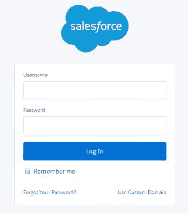

图 1-d:Force.com 组织登录页面

输入您的详细信息，点击**登录**，这将带您进入您的开发组织，看起来应该类似于下面的屏幕。

图 1-e:Force.com 发展组织(闪电体验)

我想强调的是，Salesforce 正在不断改进他们的网站，并在他们的登录机制中添加额外的安全验证步骤，因此在您阅读本文时，所解释的步骤可能会略有不同。然而，你应该仍然会发现在你的 Force.com 组织上建立一个帐户、登录并开始第一次工作是足够直观的。

太棒了。有了这些，我们准备开始创建我们的 Force.com 应用程序。

## 创建我们的应用程序

我喜欢 Force.com 的一个很酷的地方是，在创建一个帐户后，我们可以立即创建一个应用程序。真的没有什么能阻止我们这么做，所以这正是我们现在要做的。

我们将创建的应用程序是一个基本的客户成功应用程序，它将跟踪软件维护续订。

为了定制应用程序，我们还需要创建一些定制对象——我们将在第 2 章中这样做。我们将创建**客户端**和**续订**自定义对象。

该应用程序还需要销售人员提供的支持票务应用程序中使用的标准 Force.com 对象，例如**案例**和**帐户**。

虽然**帐户**对象包含许多用于管理客户帐户的有用字段，但我们需要额外的字段，这些字段将专门用于管理软件续订的客户，我们应该将其与使用**帐户**对象的其他应用程序(如客户关系管理和销售应用程序)分开。这就是为什么我们将为我们的客户成功应用程序创建一个单独的**客户端**对象，该对象将链接到**帐户**对象，但仍然是独立的。

为了开始，在你的开发者组织的左侧，点击**平台工具** > **应用** > **应用管理器**。点击**新闪电应用**。

图 1-f:闪电体验应用管理器

请注意，所描述的步骤是针对闪电应用程序的，而不是针对 Force.com 应用程序的经典用户界面，尽管屏幕、用户界面和布局不同，但过程或多或少是相同的。

展望未来，闪电是最新的 Force.com 用户界面体验，正由 Salesforce 积极推广。

一旦我们做到了这一点，一个应用程序创建向导将指导我们完成每个阶段。这将允许我们输入应用程序详细信息，选择我们想要使用的默认对象，并分配任何用户配置文件。

让我们从进入**应用详情&品牌**面板开始。

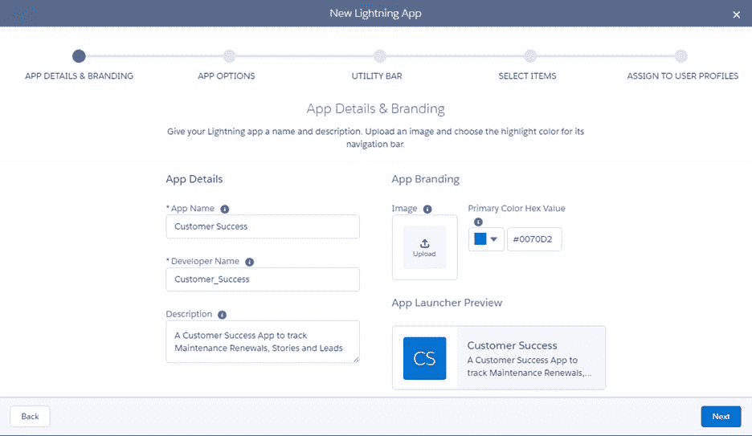

图 1-g:闪电体验应用向导(应用细节和品牌)

给你的应用起个名字——我称之为我的客户成功。你会注意到，Force.com 会自动创建**开发者名称**，这通常是与你选择的名字相同的名字，在单词之间加下划线。

别忘了输入有意义的描述。完成后，点击右下角的**下一步**。在下一个屏幕中，向导将询问您希望您的应用程序使用哪种类型的导航—选择标准导航，然后单击**下一步**。

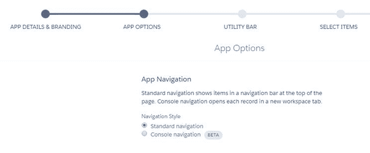

图 1-h:闪电体验应用向导(应用选项)

下一个屏幕相当有趣，因为它允许我们在应用程序中添加**实用程序栏**项目。实用程序栏是一个固定的页脚，用于打开停靠面板中的组件。让我们看看。

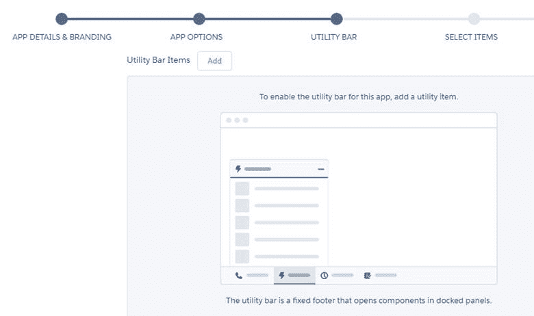

图 1-i:闪电体验应用向导(实用栏)

就我个人而言，我喜欢访问在使用 Force.com 应用程序时添加或修改的最近项目，因此我将通过单击**添加**将最近项目组件添加到我的应用程序的**实用程序栏**中。

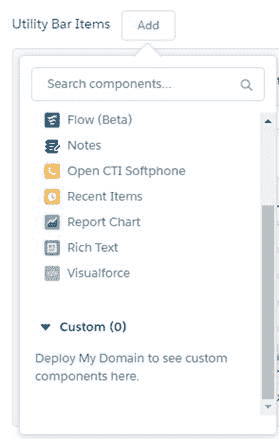

图 1-j:添加实用程序项目(Force.com 组件)

从列表中选择**最近项目**。如果你愿意，你可以再加一个。我将只为我的应用程序添加这一个，通过点击**最近的项目**选项。完成后，您将看到以下信息。

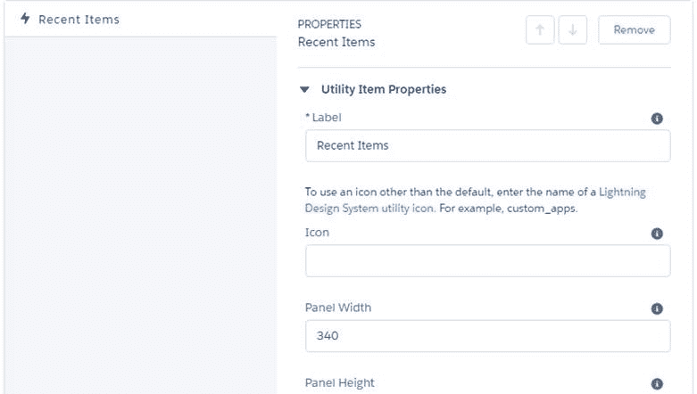

图 1-k:实用程序项目属性(最近项目组件)

这些是**最近项目**组件的属性。你能留下的大部分价值都保持原样；然而，有几个我会推荐你定制的，我会为我的应用做的。

为此，向下滚动一点，注意**对象**属性和**记录数以显示**值。

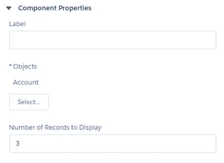

图 1-1:组件属性(最近项目组件)

点击**选择**。完成后，将出现一个弹出窗口，您可以使用该窗口选择哪些标准 Force.com 对象将显示在**最近项目**列表中。默认选择**账户**对象，我也添加了**案例**和**联系人**对象。

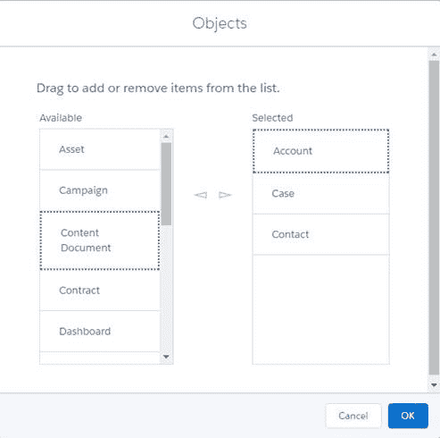

图 1-m:为最近项目列表选择对象

选择组件后，点击**确定**。就我个人而言，我至少喜欢看我最近处理过的 10 个项目，所以我会修改**记录数来显示 **10** 的**值。

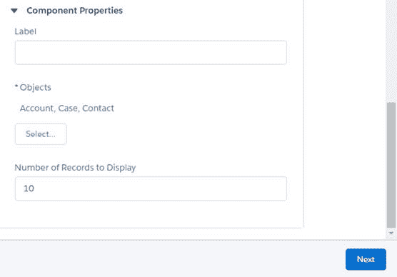

图 1-n:最近项目组件属性集

完成后，为了继续向导过程，单击**下一步**。此时，我们已经通过了**添加选项**阶段，现在我们在向导的**选择项目**阶段。

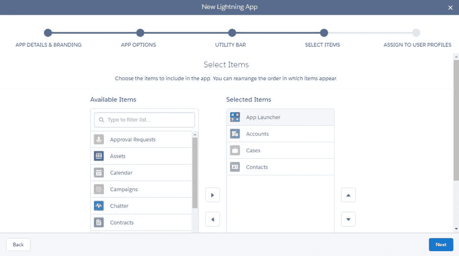

图 1-o:选择项目阶段

在此阶段，您可以选择在加载“客户成功”应用程序时希望看到(包括)哪些对象。

这些将对应于允许您访问与这些对象相关联的数据的选项卡。将对象视为数据库表。就我而言，我对拥有来自**帐户**、**案例**和**联系人**的数据感兴趣，这些数据都与客户成功应用程序相关，因此我选择了它们。要继续，点击**下一步**。

我们几乎完成了应用程序创建向导，但还有最后一步，那就是为我们的应用程序分配用户配置文件。这一步非常重要，因为它将决定哪些 Salesforce 用户组可以在登录时查看我们的客户成功应用程序。

请记住，我们是 Force.com 的开发人员，我们正在创建一个客户成功应用程序，将由我们组织内的普通销售人员用户使用，因此这就是为什么分配用户配置文件是应用程序创建过程中的一个必要步骤。

现在，让我们选择所有可用的用户配置文件，并将其分配给我们的应用程序——我们可以稍后在应用程序的设置中修改这些文件。一直向下滚动到底部，按住 **Shift** 键，将它们全部选中，并将其添加到**选中档案**列表中。

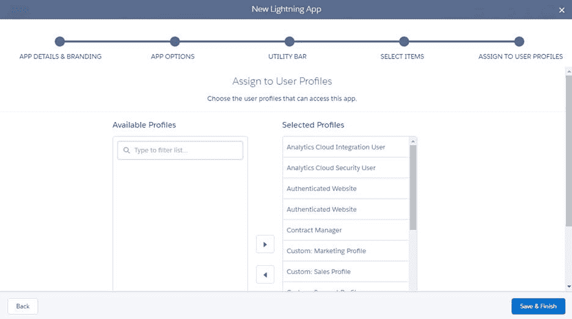

图 1-p:分配给用户配置文件阶段

最后，点击**保存&完成**以完成向导并创建我们的应用程序。我们现在已经创建了我们的客户成功应用程序模板！

我们可以在**闪电体验 App 管理器**列表中看到如下。

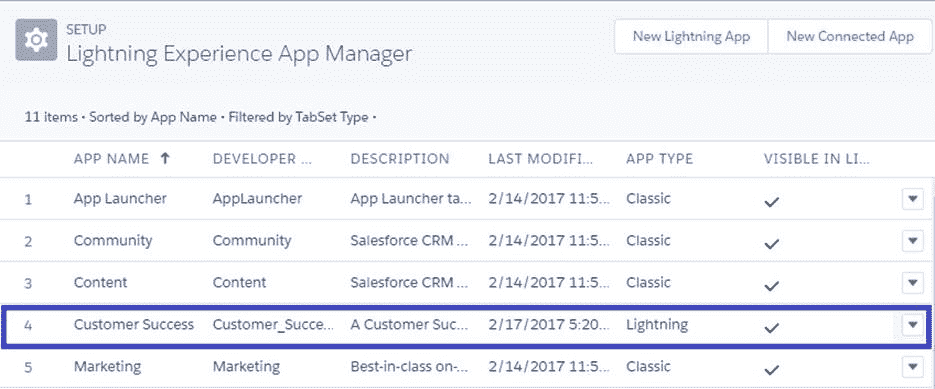

图 1-q:闪电体验应用程序管理器中显示的客户成功应用程序

乐趣就要开始了。向导给了我们一个起点，它创建了一个基本的应用程序，其中有现成的和现成的 Force.com 对象，我们已经可以与之交互，例如**帐户**、**案例**和**联系人**，我们在选择项目阶段将其添加到我们的应用程序中。

然而，为了使我们的客户成功应用程序真正有用，我们需要创建具有特定自定义字段和所有适用验证逻辑的自定义对象，这是我们将在下一章中做的事情。

## 总结

在本章中，我们快速探讨了什么是 Force.com，它包括哪些现成的主要服务和功能，以及它与市场上现有的其他 PaaS 产品相比有何不同。

我们还从注册开发人员帐户开始，然后创建了我们将在本书中撰写的客户成功应用程序的基础。

真正酷的事情(在我看来)是，我们已经意识到这个平台有多直观——它提供了相当多的功能。此外，全新的 Lightning Experience 为用户界面提供了现代且响应迅速的外观和感觉，这非常吸引人。

在下一章中，我们将通过添加自定义对象和字段来深入挖掘应用程序，并创建关系和自定义验证，这将是我们的客户成功应用程序的构建块。

让我们探索一下未来可能会发生什么令人兴奋的事情。