# 二、客户端自定义对象

## 简介

Force.com 提供了一些现成的对象，这些对象提供了一些内置的 Salesforce 应用程序所包含的许多功能，例如 CRM 和 Sales。我已经简单提到了其中的一些对象，如**账户**、**案件**、**联系人**。

这些默认对象非常棒，因为它们带有许多预构建的字段、验证和布局——本质上，有许多有用的功能来构建任何新的定制应用程序。

除此之外，Force.com 允许我们创建自己的自定义对象，这在创建应用程序时非常方便。虽然创建一个只有默认对象的应用程序是可能的，但是你会发现能够创建和使用自定义对象是一个非常强大的特性。

您可以将对象视为数据库表，但是具有额外的功能，如预定义的字段类型、内置验证和布局功能。除此之外，默认和自定义对象可以通过主-细节和查找关系相互关联，就像关系数据库中的表一样。

对象是 Force.com 应用程序的核心和灵魂，定制对象就像干净的画布，我们可以在上面勾画出我们的应用程序。在本章中，我们将详细探讨这个主题，我们将为我们的客户成功应用程序创建**客户端**对象。准备，准备，开始！

## 创建自定义对象

在主**Lightning体验**屏幕内，点击左侧**平台工具** > **对象和字段** > **对象管理器**。一旦您这样做了，您将看到已经存在的可用对象的列表，看起来应该类似于图 2-a

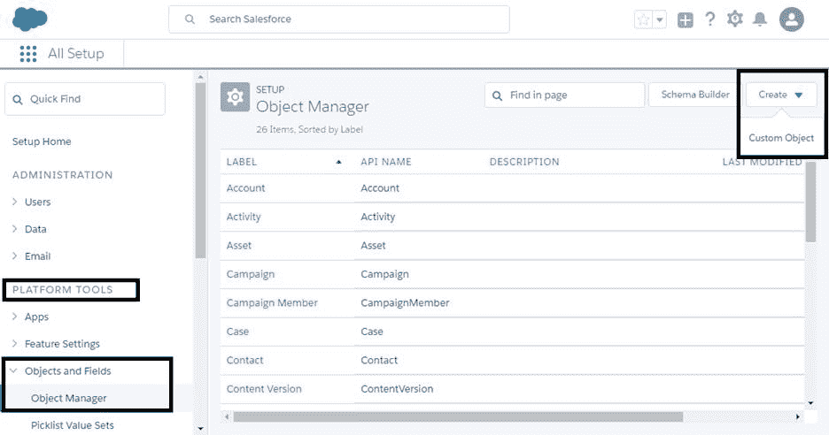

图 2-a:对象管理器

要创建新的自定义对象，单击右上角的**创建**，然后选择**自定义对象**选项。

我们的客户成功应用程序需要的第一个定制对象是**客户端**对象。这将是我们的应用程序将使用的主要对象。

一旦我们点击了**自定义对象**选项，我们将看到一个类似于下面的屏幕。

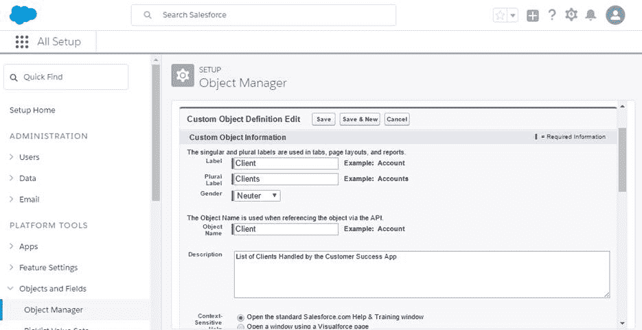

图 2-b:创建新的自定义对象:客户端

创建新对象时，Force.com 会要求我们输入一些我们感兴趣创建的对象的详细信息。

我们被要求输入的第一个细节是对象的标签，它只是标题或文本，将在 Force.com 标签之一上直观地识别对象。

我们将对象标记为**客户端**。有趣的是，Force.com 总是会向我们索要复数标签，在这种情况下将是**客户**。

有一个**性别**字段，我们可以将它设置为默认选项和对象本身的名称，我们也将其指定为**客户端**。

此外，建议输入**描述**；这不是一个必填字段，但它有助于提供一些关于我们对象的基本信息，以防我们将来需要回来进行一些调整，或者，如果其他人需要在以后修改应用程序结构。

如果我们向下滚动，还有其他字段是必需的和可选的。让我们探索它们。

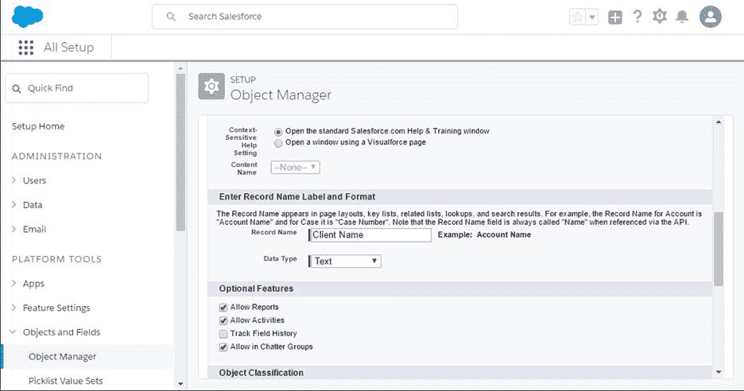

图 2-c:创建新的自定义对象:客户端(续)

我们可以保持**上下文敏感** **帮助**选项不变，并注意到对于**记录名称**字段，Force.com 已经为我们默认选择了**客户端名称**作为我们对象的主字段，并且还将**数据类型**设置为**文本**。我们可以保持现状。

**可选功能**通常默认情况下是未选中的，所以我明确选择了**允许报告**、**允许活动、**和**允许在聊天组中**。

我这样做是因为让**客户端**对象数据显示在报告中很有用。此外，活动可以添加到任何**客户端**记录中，**客户端**记录也可以在用户使用 Force.com 内部预先构建的**聊天**功能进行交互时获取。

我们真的不需要记录任何场地变化，所以我们可以不勾选**田径历史**选项。

我们还没有完成，所以让我们向下滚动一点，完成我们的**客户端**对象属性的设置。

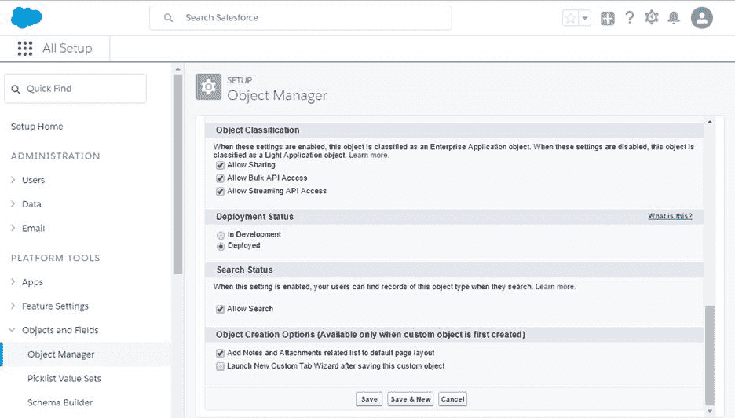

图 2-d:创建新的自定义对象:客户端(最后一部分)

**对象分类**属性允许对象暴露给其他 Force.com 应用程序接口，这些接口可以在创建企业应用程序时使用。所以默认勾选**允许共享**、**允许批量 API 访问**、**允许流 API 访问**；我们可以保持原样——无论如何，这是推荐的。

这些 API 已经超出了本电子书的范围，但是你可以在这里阅读更多关于它们的[。](https://help.salesforce.com/articleView?err=1&id=dev_object_def.htm&siteLang=en_US&type=0)

对于**部署状态**，默认设置为**部署**。**部署状态**允许我们控制自定义对象及其关联的自定义选项卡、相关列表和报告何时对非管理员用户可见。

至于**搜索状态**，我们绝对感兴趣的是这个对象将包含的数据可以完全文本搜索。默认情况下，此选项未选中，因此强烈建议您选择它。

最后，关于**对象创建选项**，该选项仅在首次创建自定义对象时可用(在修改自定义对象时不可用)，我通常喜欢选择**将注释和附件相关列表添加到默认布局**选项(默认情况下未选中)，因为在对象中添加文本注释和附件(文件)的占位符很方便。

为了创建**客户端**对象，我们所要做的就是点击**保存**。一旦我们这样做了，我们将看到下面的屏幕。

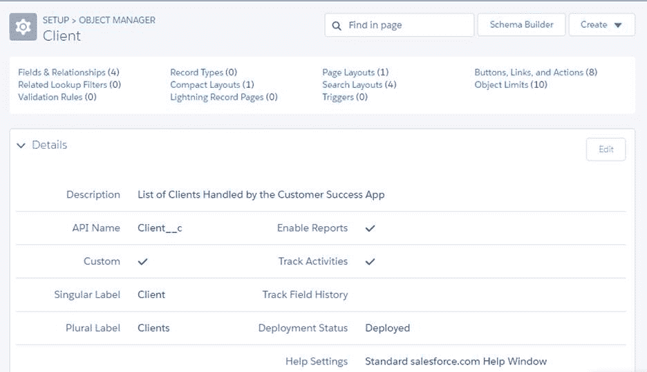

图 2-e:新创建的客户端定制对象

这包含属性列表和我们的**客户端**对象在这一点上的所有细节。从这里，我们将添加定义对象( *Client__c* )布局的自定义字段，这是用户将看到并与之交互的内容。

现在我们已经创建了我们的**客户端**对象，我们将需要定义在其中存储数据的字段，所以让我们继续这样做。

## 创建自定义字段

在 Force.com 为任何对象创建自定义字段就像在关系数据库中的表中创建字段一样，但是在某种程度上——产品中已经包含了很多功能，大部分是预定义的字段类型。

让我们首先看看将要添加到**客户端**对象中的字段。表 2-a 中的**字段**列表示自定义字段的名称，**类型**表示实际的 Force.com 数据类型。

如果其中一些数据类型听起来有点陌生，不要担心，因为它们实际上非常容易理解——我们将继续探索每一种数据类型。

表 2-a:我们的客户定制对象的字段

| 田 | 类型 |
| 账户 | 查找(在帐户对象上) |
| 客户端名称 | 文本(80)唯一，不区分大小写 |
| 政务司司长 | 选项列表 |
| 版本 | 选项列表(多选) |
| 最新续订 | 累计汇总(最大续订) |
| 地区 | 选项列表 |
| 状态 | 选项列表 |
| 提升 | 公式(复选框) |

现在我们知道了要添加到**客户端**对象中的字段，让我们一次添加一个。

我们继续我们在图 2-e 中离开的地方，在**设置** > **对象管理器** > **客户端**对象上。稍微向下滚动到**字段&关系**部分，注意默认情况下，已经自动创建了四个字段——其中一个是我们之前检查过的**客户端名称**，这是一个索引字段。您可以将其视为关系数据库表中的主键。

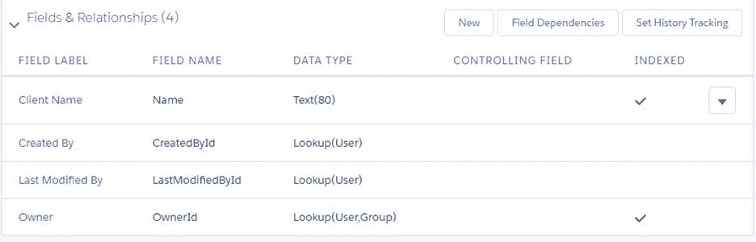

图 2-f:默认字段和关系(客户端对象)

其他三个默认字段是:**创建者**，它存储创建**客户端**记录的用户的名称，**最后修改者**，它指示哪个用户最后更新了**客户端**记录，以及**所有者**，它指示哪个用户或组拥有该记录。

创建任何新对象时，都会自动添加这些字段。只有**客户端名称**字段可以编辑，这可以通过点击箭头按钮，然后点击**编辑**选项来完成——但是，我们不会这样做。

现在，让我们创建第一个自定义字段。为此，单击**字段&关系**区域内的**新建**。完成后，将出现一个类似于下面的屏幕。

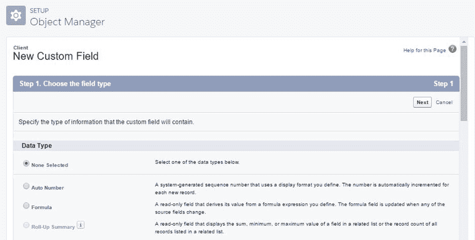

图 2-g:创建新的自定义字段

请注意，Force.com 要求我们指定该字段将包含什么类型的信息。我们将创建**账户**字段，这将是在**账户**标准对象上的**查找**。

让我们向下滚动并选择**查找关系**选项。


图 2-h:帐户名字段的查找关系选项

选择该选项后，点击**下一步**。在这个阶段，Force.com 会问我们这个**查找关系**与哪个对象相关——从列表中选择**账户**对象。

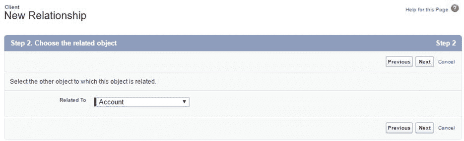

图 2-i:为查找关系选择相关对象

再次点击**下一步**继续该过程。下一个阶段是我们定义实际字段本身并给它一个名称，所以让我们这样做。

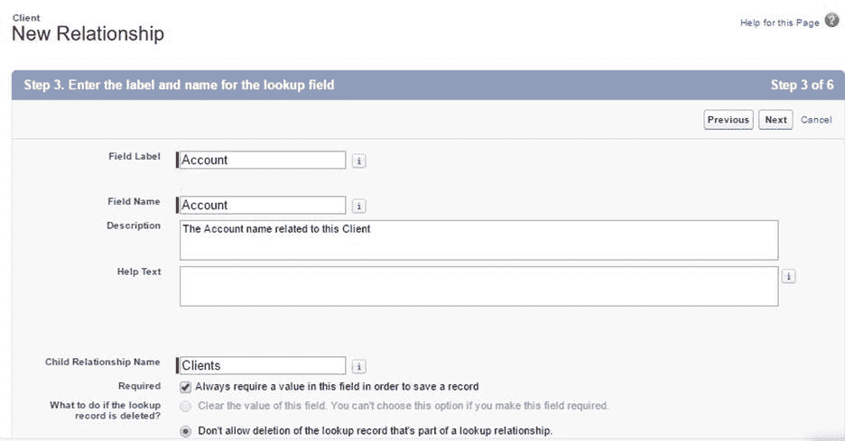

图 2-j:给自定义字段一个标识

输入**字段标签**和**字段名称**值——在我们的例子中，我们将为两者输入相同的值，并将其称为**帐户**。总是建议我们输入一个**描述**，那么我们也这样做吧。

一旦我们输入了这些基本细节，请注意**子关系名称**是由 Force.com 自动提供的，建议我们保持该值不变，除非您选择不同的关系名称。

默认情况下不选择**必需的**选项，这意味着如果我们保持这种方式，我们将能够在创建新的**客户端**对象时将该字段留空。在这种情况下，我们希望在保存新的**客户端**对象时，强制执行**帐户**字段不为空的条件，因此让我们通过单击此选项根据需要进行设置。

我们希望选择的另一个选项是名为**的选项，不允许删除属于查找关系**的查找记录。

这意味着如果删除了**客户端**记录，链接到该**客户端**记录的**帐户**将不会从 Force.com 数据库中删除。这很有用也很重要，因为**账户**对象也是其他 Force.com 应用程序常用的，比如 CRM 和 Sales。

这里发生的是，通过添加这个**查找**字段，Force.com 正在幕后建立我们的**客户端**自定义对象和现成的**帐户**标准对象之间的数据库关系。

如果我们向下滚动一点，有一个可选的**查找** **过滤器**部分，可用于限制用户在**查找**字段中可用的记录数量。如果我们想要限制结果，这可以派上用场，但是我们不会使用这个选项。

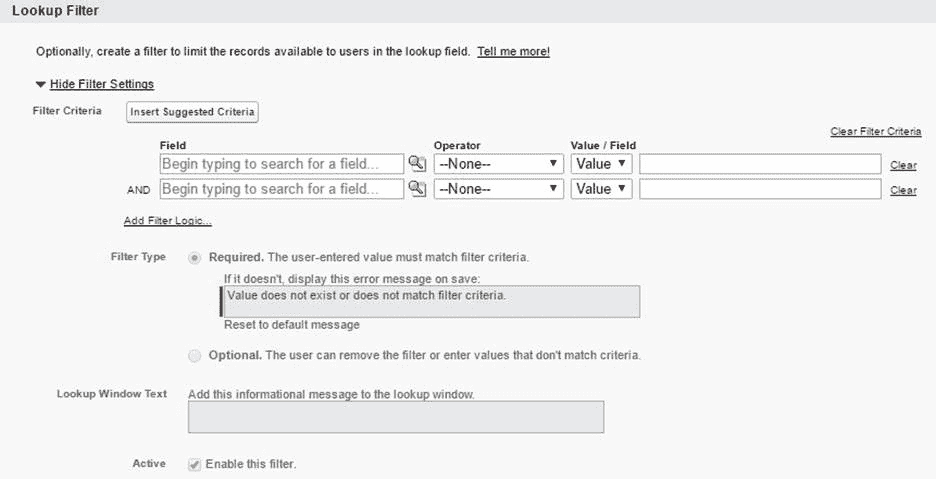

图 2-k:查找过滤器可选部分

为了继续，再向下滚动一点，再次点击**下一步**。完成后，您将被要求为正在创建的字段建立**字段级安全性**。

在这里，您可以选择哪些配置文件可以访问此字段。默认情况下，该字段被设置为可以访问所有配置文件(所有配置文件都选择了**可见**复选框)。在我的例子中，我选择了这些默认选项。

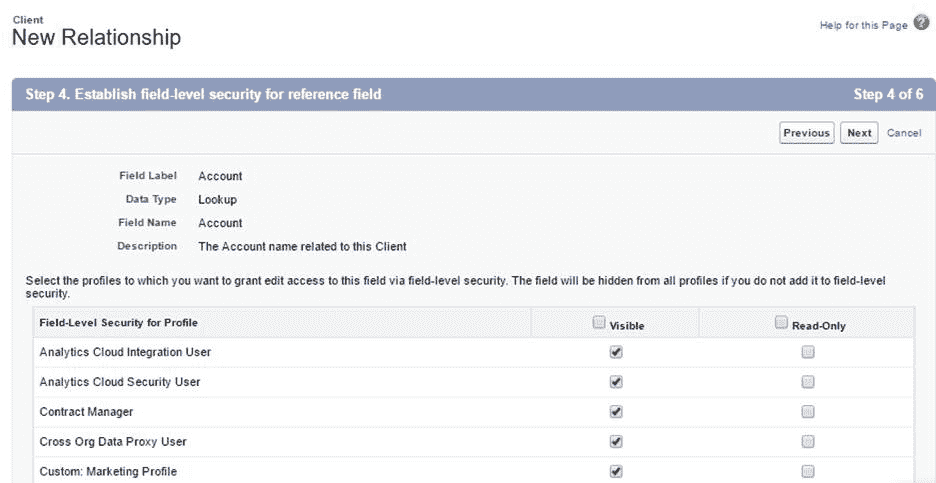

图 2-1:正在创建的字段的字段级安全性

要继续，点击**下一步**。完成后，您将看到一个屏幕，要求您选择包含此字段的页面布局。

默认情况下，该字段将包含在我们对象的布局中——在我们的例子中，这对应于**客户端**对象的布局。

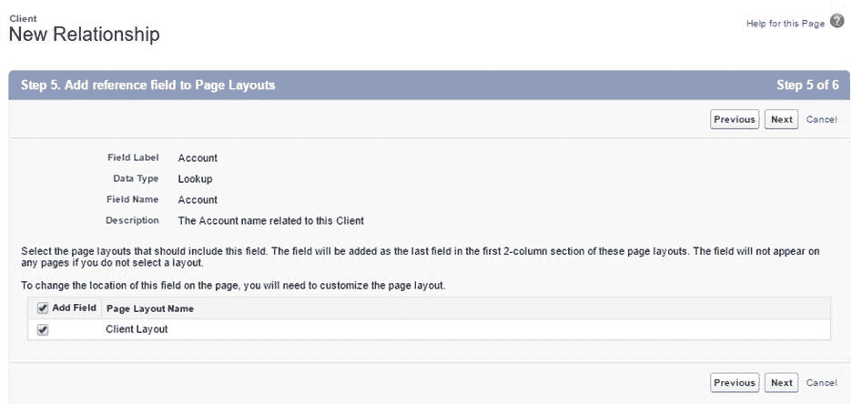

图 2-m:向页面布局添加引用字段

要继续，请单击**下一步**。您将看到最终的字段创建屏幕。在这里，您将被要求指定该字段在与**帐户**对象相关的所有布局中的标题，以及您希望该字段在这些布局中的哪个布局中显示。这是因为该字段链接到了**账户**对象。

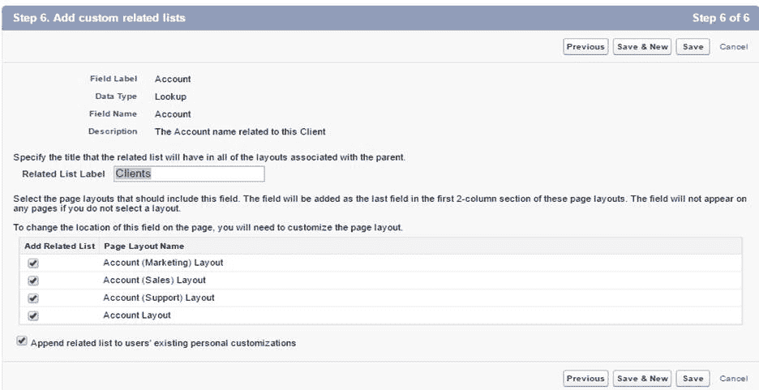

图 2-n:添加自定义相关列表

您可以取消选择一个或多个相关的**帐户**对象布局，在我们的例子中，我们可以保持不变，因此该字段可以在所有这些布局中显示。

最后，点击**保存**完成该字段的创建，或者点击**保存&新建**按钮保存该字段并新建一个。

我点击了**保存**按钮，我们的字段现在出现在**客户端**对象的**字段&关系**部分下。

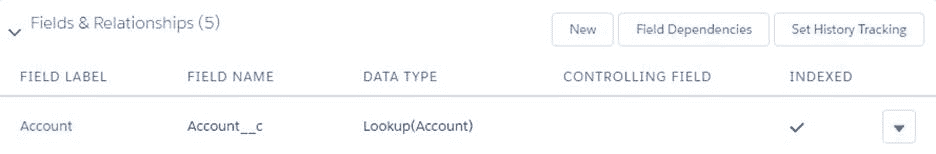

图 2-o:新创建的帐户字段

太棒了—我们创建了第一个定制字段。这是一个很大的成就，但是我们**客户端**的对象还远远没有完成。让我们创建它需要的其余字段，如表 2-a 所述

## 客户服务经理字段

默认情况下，**客户端名称**字段是在设置**客户端**对象时创建的，因此我们将跳过这一个。

我们列表中的下一个字段是 **CS 管理器**。此字段基本上是一个**选项列表**，其中包含将分配给各种客户帐户的客户成功经理的姓名。让我们创造它。

在**字段&关系**部分，点击**新建**。您将看到**新定制字段**屏幕。在这里，向下滚动选择**选项列表**数据类型，然后点击**下一步**。


图 2-p:选择 CS 管理器字段的文本字段类型

请注意，还有一个**选项列表(多选)**数据类型，允许我们选择多个值。

对于我们的应用，我们只对每个**账户**有一个 **CS 管理器**感兴趣，这就是为什么我们选择了**选项列表**而不是**选项列表(多选)**。

一旦我们点击**下一步**，我们会看到下面的屏幕。为了节省时间，我已经填写了细节。

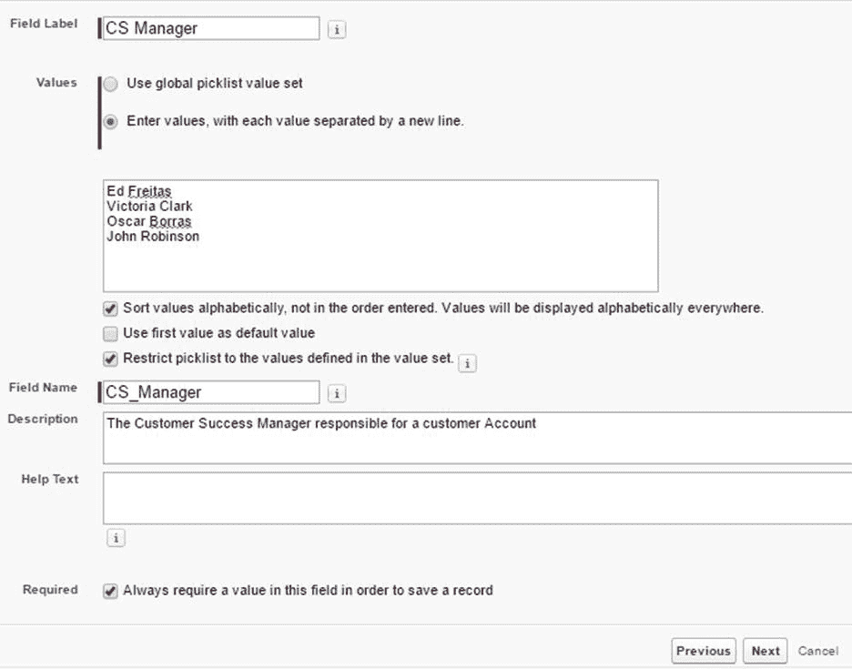

图 2-q:客户服务管理器字段的属性

我们需要填写的第一个属性是**字段标签**—我已经输入了名称 **CS Manager** 作为字段的标签，Force.com 已经自动为**字段名称**属性分配了值 **CS_Manager** 。

您可能已经注意到，Force.com 只是添加了一个下划线，因为域名不能包含空格。可以将**字段名**改为其他名称，但这真的不是必须的——所以我们可以保持原样。

默认情况下，**值**属性设置为**使用全局选项列表值集**；但是，我选择了选项**输入值，每个值用一条新的线**隔开。这是因为我有一个客户成功经理的列表，我希望能够选择，所以我已经手动输入了他们。

我还选择了选项**按字母顺序对值进行排序**—默认情况下不选择。默认情况下选择选项**将选项列表限制为值集**中定义的值，我保持不变。

最后但同样重要的是，我输入了一个有意义的**描述**，这样我们就不会忘记这个字段是做什么的——以后有它总是有用的。

默认情况下也没有选择**必需的**属性，所以我选择了它，因为我喜欢在添加**客户端**记录时总是分配一个 **CS 管理器**。完成后，点击**下一步**继续。

在接下来的屏幕上，您将看到**场级**安全屏幕。这里真的没什么可做的，因为所有**场级**安全设置默认设置为**可见**，所以只需点击**下一步**。

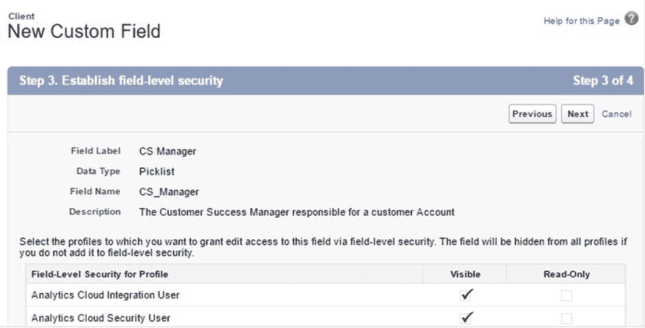

图 2-r:客户服务经理字段的字段级安全性

下面的屏幕是**添加到页面布局**。这里也没有什么可做的，因为该字段被自动选择添加到**客户端**对象的布局中。只需点击**保存**即可完成该字段的创建。

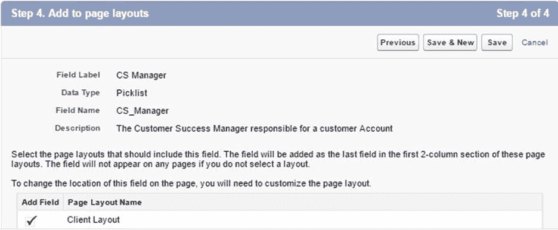

图 2-s:添加到 CS 管理器字段的页面布局

我们新创建的字段将显示在**客户端**对象的**字段&关系**部分下。

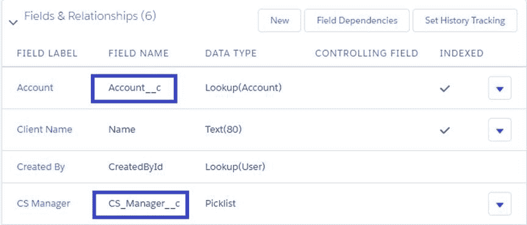

图 2-t:客户端对象的字段

**重要的**:注意有些字段总是附加 *__c* 后缀，表示这些是我们创建的自定义字段。Force.com 创建的字段没有附加 *__c* 后缀。

所以现在我们创造了另一个领域。让我们继续并最终确定我们的**客户端**对象。

对于接下来的字段，为了节省一些时间，我将跳过**建立字段级安全性**和**添加到页面布局**屏幕，只需点击**下一步**和**保存**。

让我们快进并立即首先创建**区域**和**状态**字段，因为它们也是**选项列表**类型。

## 地区&状态选项列表

**区域**字段将指示**客户**记录属于哪个地理区域，而**状态**字段将指示客户在我们组织中的位置—例如，如果客户正在接受主动支持或正在升级。

让我们首先创建**区域**字段。单击**客户端**对象的**字段&关系**部分下的**新建**。

选择**选项列表**作为数据类型并继续。然后，输入**地区**作为**字段标签**，并在**值**属性上，键入以下条目:*北美、拉丁美洲、欧洲、中东、非洲、亚洲、*和*太平洋*—每一个都在单独的行上。

确保选择了**按字母顺序对值进行排序**并选中了**限制选项列表**。输入有意义的**描述**，并确保**必需的**属性也被勾选。

点击**下一步**继续，你会看到**场级**安全画面，所以只需点击**下一步**继续。最后，在最后一屏点击**保存&新建**。

太棒了——我们的**区域**字段已经创建，现在我们可以创建**状态**字段了。出现提示时，再次选择**选项列表**数据类型，然后继续。输入**状态**作为**字段标签**，在**值**属性上，输入以下条目:*在活动支持、升级、寿命终止中，*和*非活动*。

正如我们刚才对**区域**字段所做的那样，确保选择了**按字母顺序排序值**并选中了**限制选项列表**。

不要忘记输入有意义的**描述**，并确保选择了**必需的**属性。

接下来是**场级**安全屏幕——你知道该怎么做。最后一个点击**保存**，就大功告成了！我们现在已经创建了**状态**字段。


图 2-u:区域和状态字段

现在，我们已经为我们的**客户端**对象创建了所有的**选项列表**字段，让我们创建其余的字段——其中一些字段包括我们尚未探索的其他有趣的数据类型。

## 版本多选选项列表

**版本**字段是一个有趣的字段，因为它应该允许我们选择我们组织的客户可能使用的多个产品版本。它与**选项列表**数据类型非常相似，但略有不同。让我们探索一下。

要创建我们的字段，点击**客户端**对象的**字段&关系**部分下的**新建**。

选择**选项列表(多选)**作为字段数据类型，然后点击**下一步**，屏幕显示进入字段详细信息。

在字段属性中，请注意有一个**可见行**属性在常规**选项列表**字段中不存在，该属性指示将显示多少行— **多选选项列表**显示在滚动框中，而不是常规**选项列表**那样的下拉菜单。

我已经为**版本**字段输入了以下详细信息。

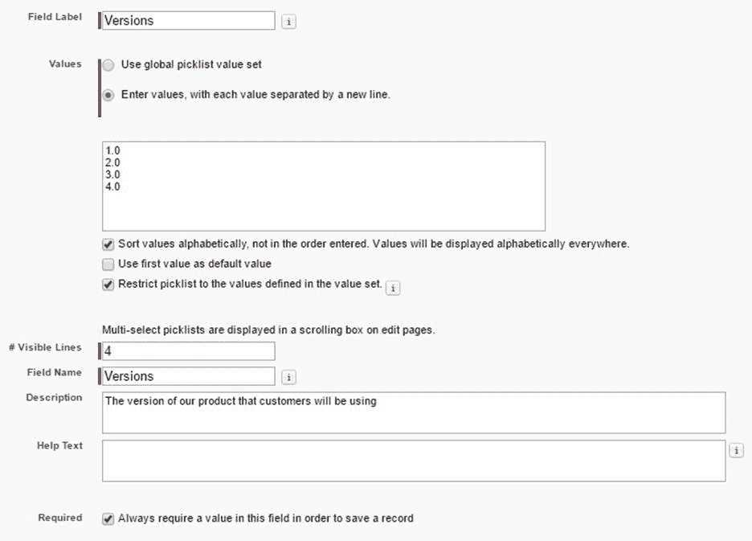

图 2-v:版本字段的详细信息

完成这些细节后，点击**下一步**，然后点击**保存**，完成该字段的创建。我们现在已经创建了我们的**版本**字段。

## 升级公式复选框字段

因为我们的客户可能会使用我们产品的多个版本，所以如果快速浏览一下，我们可以很容易地看到哪些版本需要升级到我们产品的最新版本，这将非常有用。实现这一点的快速方法是使用**公式复选框**字段。

**升级**字段的目的就是为了精确确定这一点。如果选中该字段，则表明客户需要升级。但是，我们如何确定客户是否需要升级？

答案很简单:如果客户使用的是我们产品的最新(最高)版本，他们就不需要升级，即使他们可能还在并行使用旧版本。相反，如果他们没有使用最新版本，那么他们将需要升级-勾选**升级**复选框。这可以通过使用公式来确定。

所以，让我们继续创建我们的**升级**字段。单击**字段&关系**部分下的**新建**。

选择**公式**作为字段数据类型，然后点击**下一步**。指定**字段标签**、**、**，对于**配方退货类型**，选择**复选框**。

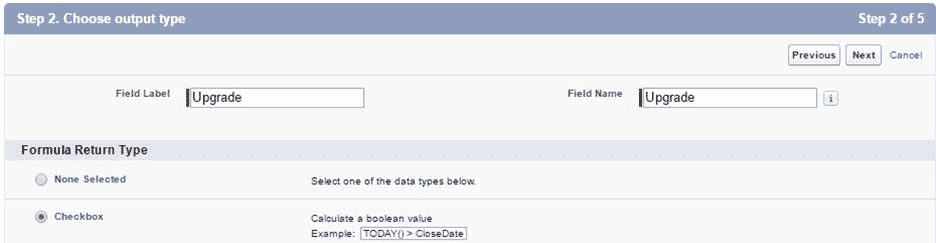

图 2-w:升级字段的输出类型

然后，单击**下一步**—这将带我们进入一个屏幕，在那里我们可以输入我们字段的公式。

公式编辑器易于理解和导航。我通常使用**高级公式**选项卡，因为它有一个方便的列表框，允许我们快速查看可用的函数集。

代码清单 2-a 显示了我们用来确定客户是否需要升级的公式。

代码清单 2-a:升级字段公式

```js

IF(INCLUDES(Versions__c,
  "5.0"), false, true)

```

公式非常简单，它基本上检查字段**Versions**(*Versions _ _ c*)是否包含字符串 5.0——如果包含，则返回 false，这意味着不需要升级。相反，如果没有找到 5.0，则返回 true，这意味着需要升级。

比如说，未来我们的软件 6.0 版本发布，我们需要更新**版本**字段，随后**升级字段公式**。那我们该怎么办？

简单—我们可以随时更新，方法是转到**客户端**对象的**字段&关系**部分，单击箭头按钮，然后单击**编辑**选项—该选项适用于每个字段。

所以，让我们添加我们的公式，并使用**高级公式**编辑器。

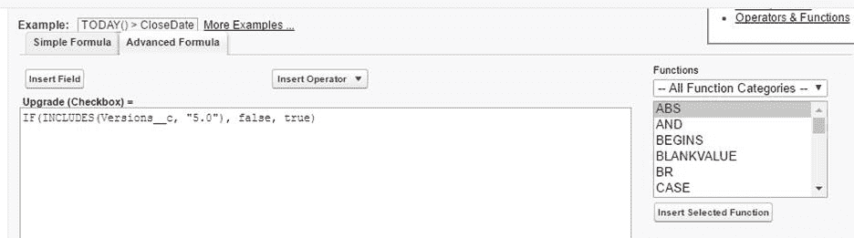

图 2-x:高级公式编辑器

验证我们输入的公式是否准确总是有用的。公式编辑器正下方有一个**检查语法**按钮。单击它以验证公式确实具有有效的语法。

如果你再向下滚动一点，有一个重要的部分叫做**空白字段处理**。默认设置为**将空白字段视为零**；然而，对于这个公式，我们感兴趣的是**将空白字段视为空白**。


图 2-y:空白字段处理

因为我们的**版本**字段实际上只是**字符串**的一个**列表**，把空白字段当作空白而不是零更有意义。

让我们点击**下一步**继续——我们将看到**现场级**安全屏幕。我们可以跳过这一步，通过点击**下一步**接受默认设置。

最后，将显示**添加到页面布局**屏幕。保留默认设置，点击**保存**—这将创建我们的**升级**字段。

## 总结

等等，我们的**客户端**对象是不是少了一个字段？说得好！我们还没有创建**最新更新**字段，如表 2-a 所示。我们还没有创建该字段，因为它依赖于另一个我们还没有创建的对象—**更新**对象。

**最新续订**字段将是**汇总**字段，该字段将从最新的**续订**记录中检索信息。

首先，我们需要创建我们的**续订**对象，然后我们可以返回到**客户端**对象，并添加这个**最新续订**汇总字段。

对于大多数组织来说，客户成功意味着我们希望让客户参与并使用我们的产品，因此续订是客户成功应用程序的重要组成部分，这就是为什么在接下来的章节中，我们将创建**续订**对象，并将其与我们创建的**客户端**对象绑定。

我们的应用程序开始成形。让我们继续探索未来。