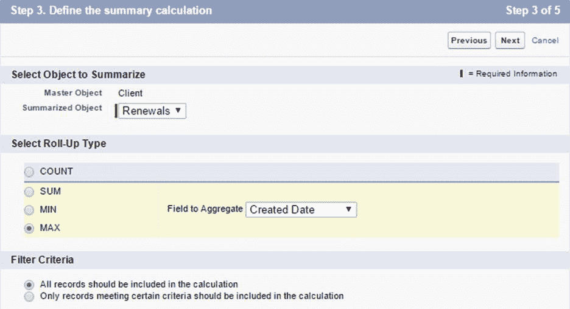

# 第三章续订自定义对象

## 简介

对于 SaaS 企业来说，吸引客户入驻至关重要，但让他们对某个产品保持兴趣并支付订阅费或维护费(也称为续订费)对长期现金流至关重要。

近年来，出现了一个新的职业，一个专注于减少客户流失和让客户参与组织产品的职业——这个角色通常被称为客户成功经理。

在本章中，我们将创建一个**更新**对象，该对象将与我们之前创建的**客户端**对象密切相关。

一般来说，续订背后的想法是跟踪客户的支持合同何时到期以及他们支付了多少费用，并记录与他们提出的问题相关的笔记和活动。

从数据库的角度来看，这应该足以在我们的应用程序中拥有某种基本的客户成功功能。因此，在本章中，我们将重点关注创建这个对象，并将其链接到我们之前创建的功能。

在后面的章节中，我们将开始添加一些逻辑和业务规则，以便将应用程序带入生活。仍然有很多有趣的东西需要构建和学习。让我们继续玩得开心。

## 续订自定义字段

就像我们使用**客户端**对象一样，让我们定义需要哪些字段来跟踪**更新**记录。这是我们将创建的字段列表。

表 3-a:我们的续订自定义对象的字段

| 田 | 类型 |
| --- | --- |
| 客户 | 主-详细信息(在客户端对象上) |
| 续订名称 | 文本(80)唯一，不区分大小写 |
| 开始日期 | 日期 |
| 结束日期 | 日期 |
| 期满 | 公式(复选框) |
| 开发票 | 检验盒 |
| 数量 | 数字(16，2) |
| 货币 | 选项列表 |
| 案例 | 主-详细信息(在案例对象上) |

我们必须创建每个字段。我们可以看到我们的**更新**对象将有两个**主-细节**字段，我们还没有涉及到——所以这将是一个很好的学习资源，因为它是任何 Force.com 应用程序的重要部分。但是在我们可以创建任何字段之前，我们需要创建**更新**对象本身——所以让我们这样做。

## 创建续订自定义对象

要创建**更新**对象，进入主**闪电体验**画面。在左侧，点击**平台工具** > **对象和字段** > **对象管理器**。一旦您这样做了，您将看到已经存在的可用对象列表，包括我们之前创建的自定义**客户端**对象。

要创建新的自定义对象，单击**创建**，然后单击**自定义对象**选项。回头参考图 2a

让我们指定对象的基本信息——我们需要首先输入**标签**和**复数标签**。自动生成**对象名**，自动生成**记录名**。

如前所述，建议为我们的对象输入一个有意义的**描述**。


图 3-a:续订对象(基本详细信息)

输入这些细节后，让我们再向下滚动一点，以便完成这个对象的创建。

就像我们在创建**客户端**对象时所做的那样，确保**允许报告**、**允许活动**、**允许在聊天组中**、**允许共享**、**允许批量 API 访问**和**允许流 API 访问**都已勾选。

确保**部署状态**设置为**部署**。我也建议你特别选择**允许搜索**和**添加笔记和附件相关列表到默认页面布局**选项。


图 3-b:续订对象(扩展详细信息)

太好了——定义了所有这些属性，让我们点击**保存**。这将创建我们的**更新**对象。

我们可以看到以下字段已经被 Force.com 自动添加到我们的**更新**对象中。


图 3-c:自动创建的字段(续订对象)

我们准备开始创建自定义字段。我们需要创建的第一个字段是**客户端**字段，它将链接到**客户端**对象。我们去做吧。

## 客户端主-详细字段

**客户端**字段将包含与**更新**记录相关的**客户端**对象的名称。一个**客户端**记录可以有多个**更新**记录，每个记录在不同的时间段。

这意味着**客户端**对象(主)和**更新**对象(细节)之间将存在**主-细节**关系。

在**字段&关系**下，点击**新建**，然后选择**主-明细关系**作为新字段的数据类型。


图 3-d:选择主-细节关系

选择该数据类型后，点击**下一步**，选择与该字段相关的对象。


图 3-e:选择主-细节字段的相关对象

选择**客户端**对象，点击**下一步**。然后输入**字段标签**，并添加**描述**。**字段名**由 Force.com 自动分配。


图 3-f:查找关系详细信息

**子关系名**也是 Force.com 自动分配的。**共享设置**默认设置为**读/写**。

这允许对**主**记录具有读写权限的用户创建、编辑或删除任何相关的**明细**记录—这是我们感兴趣的选项，因为我们希望用户能够同时读写**客户端**和**续订**记录。

同样在默认情况下，**允许重配**选项未被选中-我们可以保持原样，因为我们希望每个**续订**记录都是其对应的**客户**记录的父记录(关联)。

如果你向下滚动一点，有一些我们也不感兴趣的**查找过滤器**选项——我们可以跳过。所以，点击**下一步**，会显示**场级**安全画面，其实没什么好做的——所以再次点击**下一步**。

之后，我们到达**页面布局**界面添加参考字段，也没有我们要做的事情，所以再次点击**下一步**。

最后，我们在**添加自定义相关列表**屏幕，如图 3-g 所示


图 3-g:添加自定义相关列表屏幕

Force.com 已自动为**相关列表标签**指定了一个名称，该名称与我们的**详细信息**对象— **更新**的复数相同。我们可以保持现状。

要创建**客户端**字段，只需点击**保存**。我们现在已经创建了我们的第一个**主-细节**领域。

## 日期字段

**开始**和**结束**日期是跟踪续订的关键。正如你可能已经猜到的，两者都是**日期**数据类型字段。

让我们创造它们。我们将从创建**开始日期**字段开始。点击**字段&关系**下的**新建**按钮。

询问时，选择**日期**作为字段类型，然后点击**下一步**。


图 3-h:开始日期字段详细信息

进入**字段标签**—Force.com 将自动分配**字段名称**属性。也输入一个有意义的**描述**。设置**所需的**属性，然后点击**下一步**。

在**字段级安全性**屏幕上，单击**下一步**，在**添加到页面布局**屏幕上，单击**保存&新建**—这样我们也可以立即创建**结束日期**字段。

按照与**开始日期**字段相同的步骤，确保将**字段标签**设置为**结束日期**。

## 过期配方复选框

现在我们已经创建了**日期**字段，让我们创建一个**公式复选框**字段，它将基本上告诉我们一个**更新**记录是否已经过期。过期意味着支持维护合同不再有效—至今尚未续订。这是一个方便的字段，所以让我们创建它。

点击**字段&关系**下的**新建**。询问时，选择**公式**作为字段类型，然后点击**下一步**。

在**字段标签**上，输入名称**过期**。Force.com 将根据**字段标签**自动分配**字段名称**。然后，作为**公式返回类型**，选择**复选框**，点击**下一步**。

我们将使用以下公式来确定**续订**记录是否已过期。

代码清单 3-a:过期字段公式

```js

IF(End_Date__c
  < TODAY(), true, false)

```

`End_Date__c`是**结束日期**字段的内部名称。请记住，在内部，Force.com 的所有自定义字段都附加了`__c`后缀。

公式很简单。本质上，如果`End Date`的值小于今天的日期，则`true`被返回——这意味着**更新**记录已经过期。反之，如果`false`被退回，则表示记录未过期。

再向下滚动一点，将**空白字段处理**属性设置为**将空白字段视为空白**，然后点击**下一步**。

在**建立字段级安全**屏幕上，保持所有默认选项不变，点击**下一步**。

在**添加到页面布局**屏幕上执行相同的操作-保留默认选项并单击**保存**以创建字段。

## 已开票复选框

**已开票**字段只是一个**复选框**，它将指示客户是否已为适用的续订期开具发票。它只是一个标志——一个**布尔**，而不是一个计算字段。所以，让我们现在就创建它。

点击**字段&关系**下的**新建**按钮。询问时，选择**复选框**作为字段类型，然后点击**下一步**。

现在我们输入**字段标签**—**字段名称**将被自动分配。同时输入**描述**并点击**下一步**。


图 3-i:开始日期字段详细信息

在**建立现场级安全**屏幕上，保留默认值并点击**下一步**。在**添加到页面布局**屏幕上，保留默认选项并点击**保存**以创建字段。

太好了，我们创造了另一个领域。我们继续吧。

## 金额字段

**金额**字段，顾名思义，对应于客户将支付的维护费用——基本上是**更新**成本。让我们创造它。

点击**字段&关系**下的**新建**按钮。询问时，选择**号**作为字段类型，然后点击**下一步**。

现在输入**字段标签**，使用**金额**作为名称。将**长度**设置为 **16** ，将**小数位**设置为 **2** 。

输入**描述**，选择**需要的**属性，然后点击**下一步**。


图 3-j:金额字段详细信息

在**字段级**安全上没什么可做的，所以点击**下一步**，在**添加到页面布局**屏幕上，点击**保存**以创建字段。

## 货币字段

创建**金额**字段后，我们现在可以创建**货币**字段。这将用于指示哪种货币适用于**更新**。我们之前已经创建了**选项列表**，所以这个应该很熟悉。

要创建此字段，请单击**字段&关系**下的**新建**。询问时，选择**选项列表**作为字段类型，然后点击**下一步**。

输入**货币**作为**字段标签，**，对于**值**属性，选择选项**输入值，每个值用新的一行**隔开。然后输入如下图所示的值。


图 3-k:货币字段详细信息

选择选项**按字母顺序对值进行排序**和**在该字段中始终需要一个值** **，以便保存记录**。默认情况下，选择选项**将选项列表限制为值集**中定义的值。

然后点击**下一步**—这将显示**建立场级安全**画面，在该画面上没有任何操作，因此再次点击**下一步**。最后，在**添加到页面布局**屏幕上，点击**保存**以创建字段。

## 案例主-明细字段

我们现在已经到达了**更新**对象的最后一个区域——令人兴奋！**案例**字段是链接到**案例**标准对象的**主-详细信息**字段。换句话说，一旦我们创建了这个字段，Force.com 将在**更新**和**案例**对象之间建立一对多的关系。这意味着任何给定的**更新**记录可以有多个**案例**记录。

让我们创建这个字段。点击**字段&关系**下的**新建**。对于字段类型，选择**主-明细关系**选项，点击**下一步**。

紧接着，你会被要求选择相关的对象。从下拉列表中选择**案例**对象。


图 3-1:案例字段的相关对象

选择该对象后，点击**下一步**。在接下来的屏幕上，您将被要求指定**字段标签**和其他属性。输入**案例**作为**字段标签**，输入**描述**，然后点击**下一步**。


图 3-m:案例字段的详细信息

你可能已经猜到了，下面的屏幕是**场级安全**。实在没什么可做的，只需点击**下一步**。

在**页面布局**界面添加参考字段，点击**下一步**，最后在**添加自定义相关列表**界面，接受默认选项，点击**保存**，这将创建字段。

太棒了——我们现在已经创建了**更新**对象的所有字段。但是，您是否记得有一个字段是**客户端**对象的一部分，我们无法创建它，因为它依赖于准备好**更新**对象？

我们尚未创建的字段是**最新续订** **汇总**字段。所以，让我们继续创造它。

## 最新续订汇总字段

此字段的目的是了解对于任何给定的**客户**记录，哪个是最近的**更新**对象—这在 Force.com 被称为**汇总**字段。

这是一个聚合字段，在本例中，我们将通过**更新**对象的**创建日期**字段进行聚合。

在**平台工具** > **对象和字段** > **对象管理器**下，找到之前创建的**客户端**对象，点击。在**字段&关系**下，点击**新建**。

选择**汇总**作为字段类型，点击**下一步**。


图 3-n:汇总汇总字段类型

输入**字段标签**(最新更新)和一个**描述**，点击**下一步**。有趣的部分来了，这是我们以前没有涉及到的。

在这一步中，我们需要**定义** **这个汇总计算**。在**汇总对象**属性下，从下拉列表中选择**续订**。

在**下选择累计类型**，选择**最大值**，在**字段聚合**属性上，从列表中选择**创建日期**字段。

默认情况下，**过滤标准**设置为**所有记录都应包括在计算中。**点击**下一步**。



图 3-o:定义汇总计算屏幕

在**建立场级安全**界面，保留如下图所示的默认选项，点击**下一步**。


图 3-p:建立现场级安全屏幕

最后，在**添加到页面布局**屏幕上，保持默认选项不变，点击**保存**。我们现在已经创建了来自**客户端**和**更新**对象的所有字段。

## 总结

在本章中，我们逐步探索了如何创建**续订**对象的每个字段，这是我们的客户成功应用程序的核心。

此外，我们还探索了各种字段类型及其与主**客户端**对象的关系。

在下一章中，我们将探索闪电体验用户界面，如何添加、编辑和删除记录，以及如何为自定义对象添加选项卡。

到目前为止，我们一直沉浸在关系对象及其领域的设计中，没有关系对象和领域，我们将无法在 Force.com 平台上拥有应用程序。展望未来，我们将学习如何将这些物体带入生活。