# 四、用户界面基础

## 简介

当你在 Force.com 创建一个对象时，你会立即得到一个用户界面。想一想——您可以自动获得具有内嵌和完整编辑功能的**列表视图**和**对象视图**，而无需添加任何代码。

甚至可以通过使用拖放、直观的**布局属性**配置界面更改**页面布局**来自定义**视图**。也有可能有不同种类的布局，即使是移动设备。所有这些都不需要写一行代码。

如果你需要更多的灵活性，有视觉力量。它比拖放配置界面稍微复杂一点，因为您需要了解一些基本的 HTML 标记以及一些 Apex 标签；然而，没有必要了解任何关于样式或 CSS 的知识。有了 Visualforce，很多功能都可以用标准的 Apex 控制器来完成，这也是一个优势。

在 Visualforce 之后是 Lightning——这是我们在本书中看到的用户界面。它既现代又灵敏——它能很好地适应不同的设备格式，看起来很酷。

在本章中，我们将探讨 Force.com 用户界面的基础知识，重点是Lightning体验。

我们还将查看在创建自定义对象时“自动神奇”构建的布局。听起来很有趣，让我们了解更多。

## 内置布局

在前面的章节中，当我们创建**客户端**和**更新**对象时，Force.com 自动在幕后为我们创建了一些布局。布局只是我们查看和操作对象中字段的一种方式。

在我们Lightning体验的**设置主页**页面，我们应该会看到**最近使用的**项目列表。在那里你一定会找到**客户端**和**更新**对象。

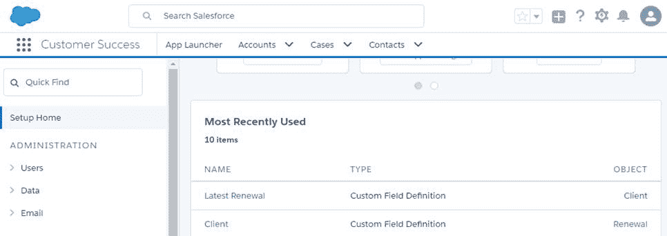

图 4-a:最近使用的项目列表

因此，让我们点击**客户端**对象，以探索创建该对象时自动添加的布局。然后，点击**页面布局**。

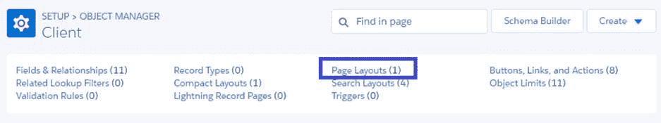

图 4-b:客户端对象的定义

点击**客户端布局，**如下图所示。

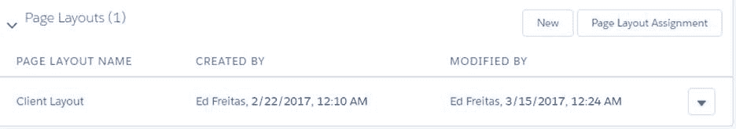

图 4-c:客户端布局项目

点击该链接后，会出现**客户端布局**配置界面，如图 4d 所示

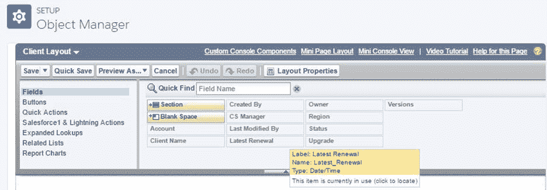

图 4-d:布局配置界面

再向下滚动一点到**客户端详细信息**部分。这准确地显示了 Force.com 如何为我们设置**客户端**布局，也就是说，当创建新的**客户端**记录时，或者当修改现有的**客户端**记录时，字段将按什么顺序出现。

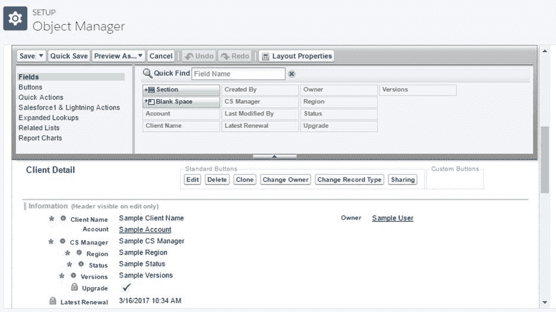

图 4-e:客户端布局的细节(字段顺序)

这里我们看到了**客户端**字段在屏幕上出现的顺序，如**客户端**部分所示。如果我们想重新排列顺序，我们可以简单地将任何字段拖放到所需的位置。

例如，让我们下移**版本**字段，使其显示为**客户端**布局的最后一个字段。为此，只需点击该字段并将其向下拖动到**最新更新**字段下方。

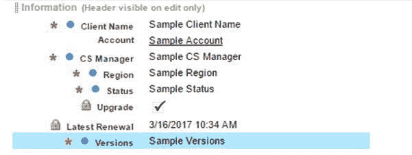

图 4-f:重新排序的客户端布局

完成后，点击**保存**以保持布局变化。

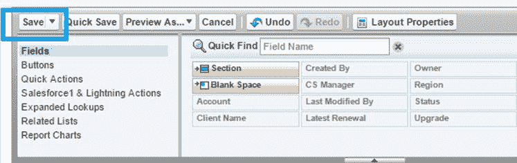

图 4-g:配置界面上的保存按钮

单击**保存**按钮后，您将被重定向到**客户端**对象的主设置屏幕(在设置**主页** > **平台工具** > **对象管理器**下)。

我们现在已经看到了如何快速改变 Force.com 为我们自动创建的内置布局之一。

还有另一个名为**模式构建器**的可视化工具，它也提供了拖放体验，以便定制对象和布局(我们将不涉及)。

现在，让我们探索这些布局在运行时实际上是怎样的——在数据输入模式下。

## 访问我们的自定义对象—数据输入模式

既然我们已经看到了定制对象布局是多么容易，那么现在就该看看它们在运行时的外观和感觉了，这样我们就可以使用它们来添加和编辑数据。

我想借此机会提一下，在 Force.com，真的没有运行时和设计时的概念。我想我应该用这个词来区分是处于设置模式还是数据输入模式。

到目前为止，在我们的Lightning体验中，我们一直处于设置模式。为了进入数据输入模式，这相当于运行我们的定制应用程序，我们必须明确点击**应用程序启动器**按钮(左上角的 3 乘 3 点图标)，然后选择我们的**客户成功**应用程序。

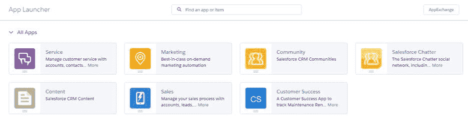

图 4-h:应用程序启动器

单击**客户成功**应用程序选项后，您将看到以下内容。

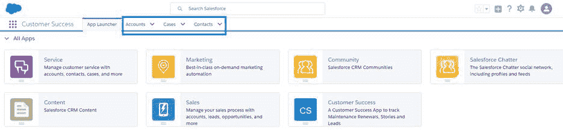

图 4-i:客户成功应用程序

请注意，默认情况下，**应用启动器**选项卡是如何显示的，只有**账户**、**案例**和**联系人**选项卡可见。分别对应**账户**、**案例**、**接触**对象。

但是我们创建的**客户端**和**更新**自定义对象在哪里呢？这个问题问得好。

本质上，为了添加和编辑**客户端**和**续订**对象的数据，我们必须首先为每个对象的**客户成功**用户界面添加一个选项卡。

因为**客户端**和**更新**对象都没有定义相应的标签，所以我们还不能在数据输入模式下访问这些对象。那么，让我们添加这些选项卡。

## 添加应用标签

在屏幕顶部，单击**档位**，然后单击**设置**选项，但在新的浏览器选项卡中打开它。在**快速查找**搜索框中，输入单词**选项卡**，您将看到以下内容。

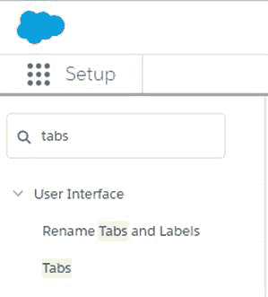

图 4-j:在设置中搜索选项卡选项

然后，点击**选项卡**选项，将进入以下屏幕。

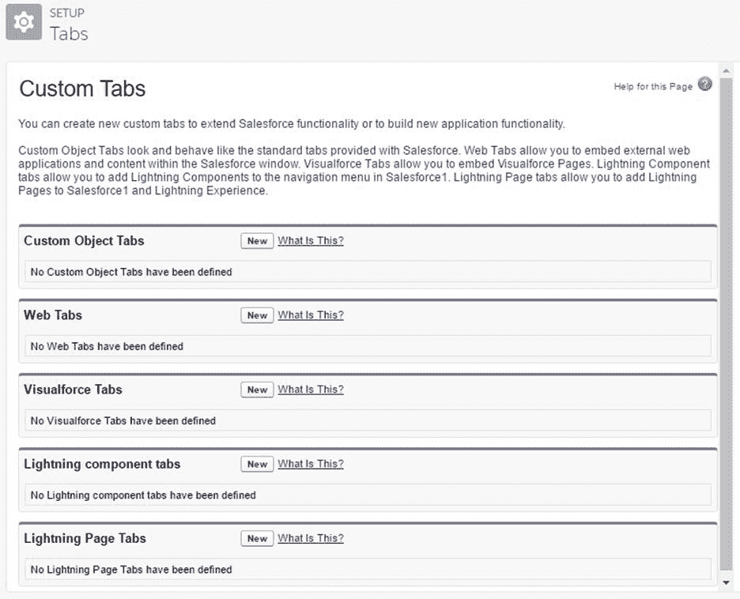

图 4-k:选项卡设置屏幕

让我们首先为我们的**客户端**对象创建一个**选项卡**。单击**自定义对象标签**旁边的**新建**。

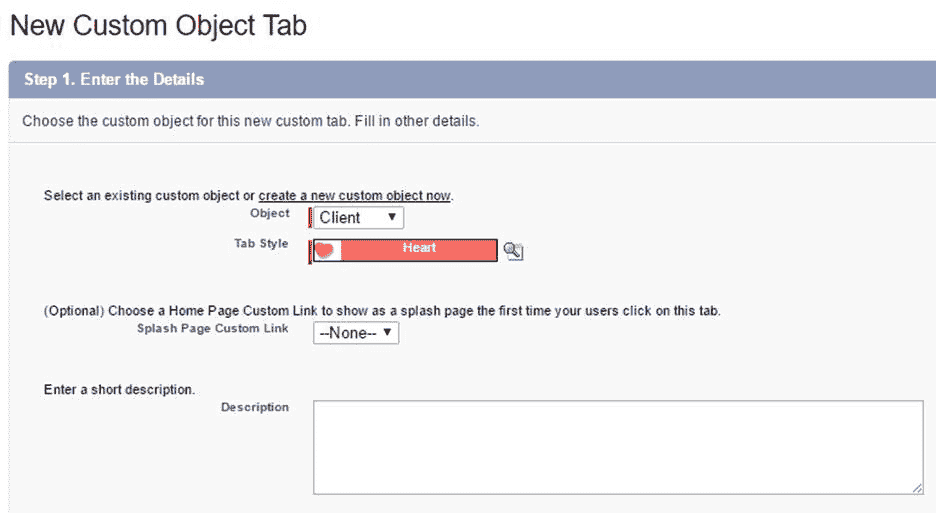

图 4-1:客户端选项卡设置

选择**客户端**作为对象，选择**选项卡样式**可用的任何选项——在我的例子中，我选择了**心脏**。然后，点击**下一步**。

在**步骤 2-添加到配置文件**中，只需保留默认选项并点击**下一步**。对于**步骤 3-添加到自定义应用程序**，执行相同的操作:保留默认选项并单击**保存**。您现在应该看到创建了**客户端**选项卡。

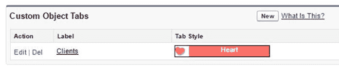

图 4-m:创建的客户端选项卡

现在让我们对**更新**对象进行同样的操作，并为其创建一个选项卡。点击**新建**按钮，在**自定义对象标签**旁边，按照相同的步骤，但是这次选择**更新**作为**对象**，还有一个不同的**标签样式**—在我的情况下，我会选择**麻袋**作为样式。

如果您现在切换回您在另一个浏览器选项卡上打开的**客户成功**应用程序，并刷新页面，您将看到两个新选项卡。

图 4-n:带有客户和续订选项卡的客户成功应用程序

## 添加记录

现在让我们向应用程序中添加一些数据。在我们向**客户端**对象添加任何数据之前，我们将创建几个**帐户**。这是因为我们的**客户端**对象依赖于**账户**对象。一旦我们创建了至少一个**帐户**记录，我们就可以创建一个**客户端**记录。

在创建**续订**记录之前，我们需要创建一个**客户端**记录，因为**续订**对象依赖于**客户端**对象。至少还需要添加一条**案例**记录，因为**更新**对象也依赖于它——所以请记住这一点。现在让我们添加一些数据。

点击**账户**选项卡，然后**新建**，以新建**账户**记录。

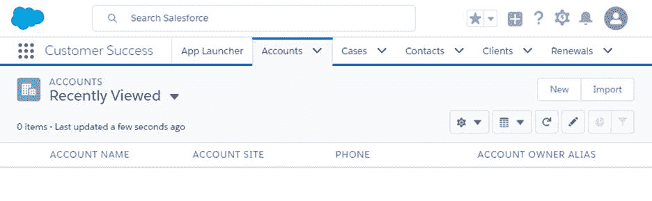

图 4-o:帐户选项卡

单击**新建**按钮后，您将看到如图 4-p 所示的数据输入表单。填写必填字段和其他一些您可能觉得有用的非必填字段。

一个**账户**记录是指代表你的**客户**的客户组织的非常高级的细节。您可以输入与他们的**账单地址**相关的详细信息以及**服务级别协议**信息。完成后，点击**保存**。

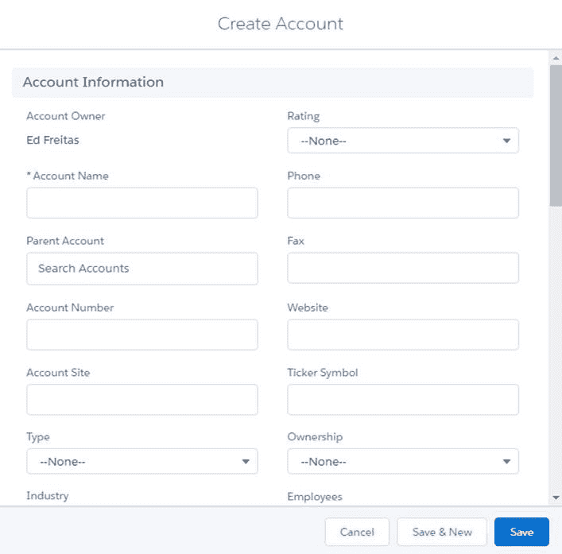

图 4-p:创建帐户表单

如果你愿意，可以随意创建一些额外的**账户**记录。完成后，点击**客户端**选项卡，为每个**账户**创建一些**客户端**记录。

起初，我们似乎是通过添加**账户**和**客户端**记录来复制信息。虽然**账户**和**客户**之间的关系通常是一对一的关系，但有时我们可能希望同一**账户**有多个**客户**—例如，有两个独立的业务部门。

另一个原因是**帐户**对象被现成提供的其他 Force.com 应用程序使用，因此不使用特定于客户成功应用程序的自定义属性来扩展该对象很方便，而是将这些特定属性添加到新的自定义对象中，这是创建**客户端**对象的另一个原因。

说到这里，我们来添加**客户端**记录。假设您已经在**客户端**选项卡上，单击**新建**。**客户端**记录数据录入表单将出现如下。

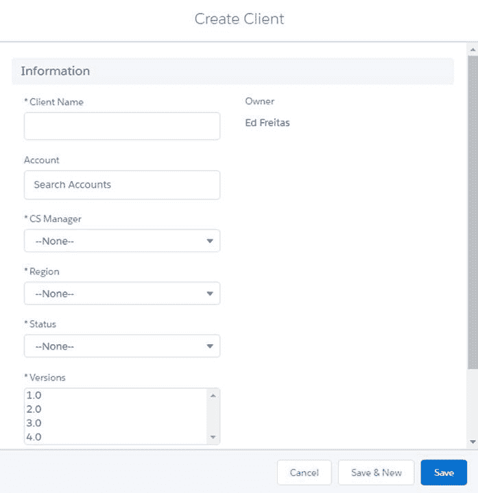

图 4-q:创建客户端表单

输入需要的字段，然后点击**保存**，或者**保存&新建**如果你想创建更多的**客户端**记录。

到目前为止，您应该已经创建了一个或多个**客户端**记录。我创建了其中的几个，我在我的**客户端**选项卡下看到的如图 4-r 所示

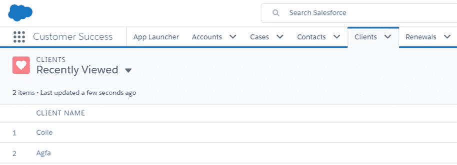

图 4-r:客户记录

也可以随意添加一些**更新**记录。这个以后会派上用场的。

## 编辑数据

现在，我们有了一些要处理的记录和数据，我们可以通过单击列表中的记录名称来轻松编辑任何记录，这将显示与记录相关联的数据，如下所示。

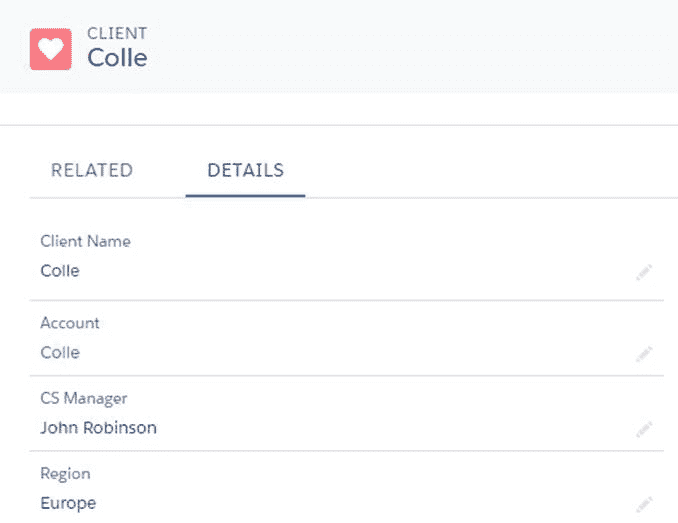

图 4-s:客户记录的详细信息

如果您想对此记录进行任何更改，您只需双击记录的任何部分即可，当您这样做时，屏幕将如下所示。

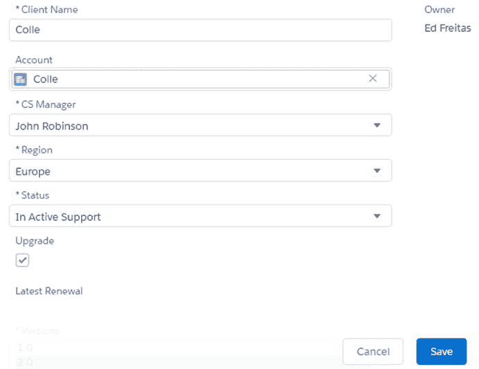

图 4-t:客户端记录—在编辑模式下

请注意，双击记录时，它会进入编辑模式，这意味着您可以更改任何字段的任何值。完成更改后，只需点击**保存**。

## 删除记录

删除记录也很简单。在记录列表中，每个有**删除**选项的记录都有一个箭头按钮。

图 4-u:删除记录选项

点击**删除**将删除该特定记录。

## 总结

在本章中，我们探讨了创建对象时现成提供的Lightning体验**布局**，以及如何修改它们。

我们已经了解了如何添加、编辑和删除记录数据，以及如何通过添加**选项卡**向用户界面添加自定义对象。

本质上，不需要任何编程——除了使用几个公式字段——我们已经创建了一个数据输入应用程序，它有一个简洁而现代的用户界面，并由一个强大的关系对象数据库提供支持。我们只需遵循一系列简单的步骤和直观的点击式向导就可以做到这一点。我个人认为这是相当强大的，也是 Force.com 美丽的一部分。

在接下来的章节中，我们将把注意力转移到平台的编程端，以及如何添加特定的定制逻辑。