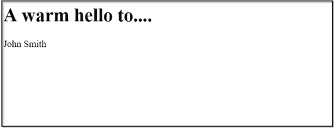
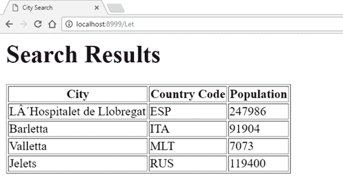
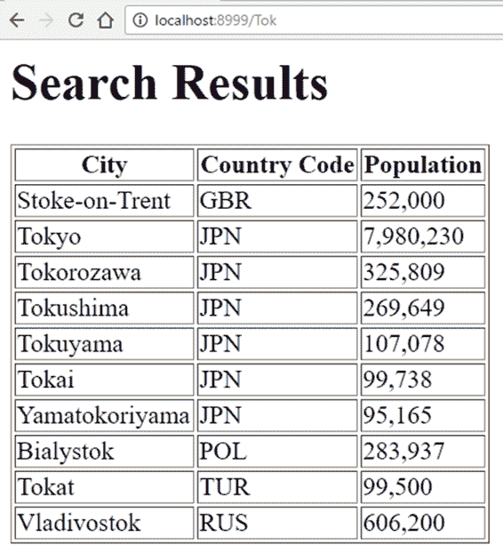
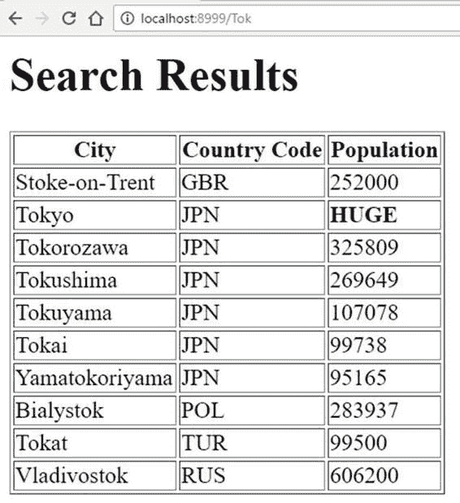

# 第四章模板

在前一章中，我们连接到一个数据源，然后以 HTML 格式向用户显示查询结果。这个 HTML 代码被直接嵌入到我们的源代码中，这是不可取的(除了非常简单的场景)，因为这使得应用程序非常难以维护。

Go 用一个相当好的模板引擎来拯救我们。这不仅使我们能够将程序代码从表示标记中分离出来，而且它还提供了一些逻辑结构，例如循环、变量，甚至是允许我们将表示逻辑卸载到模板中的函数。

## 介绍模板

首先，让我们定义一个模板。

Go 模板功能由`template`包提供，该包包括多种方法，包括`Parse`和`ParseFile`，用于从字符串或文件加载模板，然后`Execute`用于将来自我们应用程序的特定内容与模板本身提供的更一般的内容合并。

请注意，模板通常存在于它们自己的文件中，但情况并非总是如此。我们可以在程序逻辑中直接使用模板功能，方法是将模板编码为字符串，然后使用`Parse`方法从中读取。这只是对将所有内容编码为 HTML 的一个小小的改进，所以在这些例子中，我们将使用单独的模板文件和`ParseFile`来读取它们。

首先，我们的模板。如您所见，这只是一个带有一些特殊语法的 HTML 文件，这样我们的程序就知道要插入什么以及在哪里插入它。

代码清单 10:我们的 HTML 文件

```go
  <html>
  <head>
  <title>Hello!</title>
  </head>
  <body>     

  <h1>A warm hello to....</h1>

  <p>

  {{.Name}}

  </p>
  </body>
  </html>

```

除了`{{.Name}}`条目，一切都应该看起来很熟悉。对于 Go 模板，这是一个变量。它包含在双花括号中，它的名称(`Name`)前面有一个点。

点表示变量的范围或上下文。在我们的例子中，`Name`变量指的是一个`Person`结构的`Name`字段，当您看到我们将在程序逻辑中使用的它的定义时，这将变得显而易见:

**``type``** 人 **`struct`**

名称`string`

}

我们可以给模板变量传递一个`Person`结构，它会拉出`Name`字段，并用它替换模板中的变量定义。

请注意，模板中引用的任何字段都必须导出。也就是说，它们必须以大写字母开头。我们稍后会看到，未报告的字段会导致问题。

代码清单 11 显示了完整的程序代码。

代码清单 11:使用模板

```go
  package
  main

  import
  (
        "log"
        "net/http"
        "text/template"
  )

  type
  Person struct {
        Name
  string
  }

  func
  main() {
        http.HandleFunc("/", handler)
        err
  := http.ListenAndServe(":8999", nil)
        if err != nil {
              log.Fatal("ListenAndServe: ", err)
        }
  }

  func
  handler(w http.ResponseWriter, r *http.Request)
  {
        p
  := Person{Name: "John
  Smith"}
        t,
  _ := template.ParseFiles("hello.html")

        t.Execute(w,
  p)
  }

```

这里唯一值得注意的代码是在`handler`函数中，当用户访问我们的网络应用程序的根时，在 [http://localhost:8999](http://localhost:8999) 被调用。

Handler 创建一个类型为`Person`的变量`p`，并将“约翰·史密斯”赋给其`Name`字段。然后我们使用`template.ParseFiles`，传入模板文件的名称，并将结果分配给变量`t`。

解析完模板文件后，我们接下来需要执行合并，我们通过调用`Execute`来完成，这将传递`http.ResponseWriter`和我们想要与模板合并的数据项作为参数。

当我们在浏览器中启动应用程序时，我们得到图 15。



图 15:我们简单模板的输出

## 使用模板返工数据访问应用程序

让我们把我们对围棋模板的新认识付诸实践。首先，我们需要了解模板的众多功能之一——迭代一组结果，然后对每个结果应用适当的格式。

为了实现这一点，我们必须使用`{{range}} {{end}}`构造。我们将使用以下模板来构建我们的表。`{{range}}`和`{{end}}`之间的每一件事，对于我们传递到其中的每一个物体都会重复一次。

代码清单 12:我们的“城市”数据库应用程序的模板

```go
  <html>
  <head>
  <title>City Search</title>
  </head>
  <body>

  <h1>Search Results</h1>

  <table border='1'>

  <tr>

  <th>City</th>

  <th>Country Code</th>

  <th>Population</th>

  </tr>

  {{range .}}

  <tr>

  <td>{{.Name}}</td>

  <td>{{.CountryCode}}</td>

  <td>{{.Population}}</td>

  </tr>

  {{end}}

  </table>
  </body>
  </html>

```

看到出现在 range 关键字后面的点符号了吗？意思是“任何物体”

在 Go 模板中使用范围需要注意的一点是——它们只接受一个对象。“什么？”我听到你说。"为什么要迭代一组值的东西只接受一个呢？"

你是对的。但是这个范围允许我们传入一个值的数组或片段，然后它会深入到那个对象中，拉出它的成员。

因此，在我们的数据库应用程序中，我们只需要做一些重构，以确保我们的每个查询结果都被添加到一个切片中——让我们称之为`Cities`——并将该切片传递到我们的模板中。

代码清单 13:在我们的“城市”应用程序中使用模板

```go
  package
  main

  import
  (
        "database/sql"
        "html/template"
        "log"
        "net/http"

        _
  "github.com/go-sql-driver/mysql"
  )

  type
  City struct {
        Name       
  string
        CountryCode
  string
        Population 
  int
  }

  var
  database *sql.DB

  func
  main() {

        db,
  err := sql.Open("mysql",
  "root:password@tcp(127.0.0.1:3306)/world")
        if err != nil {
              log.Println("Could not connect!")
        }
        database
  = db
        log.Println("Connected.")

        http.HandleFunc("/", showCity)
        http.ListenAndServe(":8999", nil)
  }

  func
  showCity(w http.ResponseWriter, r *http.Request)
  {
        var Cities = []City{}
        queryParam
  := "%"
  + r.URL.Path[1:]
  + "%"
        cities,
  err := database.Query("SELECT Name, CountryCode,
                 Population FROM city WHERE Name LIKE ?", queryParam)
        if err != nil {
              log.Fatal(err)
        }
        defer cities.Close()

        for cities.Next() {
              theCity
  := City{}
              cities.Scan(&theCity.Name, &theCity.CountryCode,

            &theCity.Population)
              Cities
  = append(Cities, theCity)
        }

        t,
  _ := template.ParseFiles("results.html")

        t.Execute(w,
  Cities)
  }

```

接下来，我们可以像以前一样执行程序并搜索城市。



图 16:带有模板的城市应用程序

让我们考虑一下使用模板的一些好处。首先，我们的代码更简洁。我们不需要费力地通过长长的标签串来弄清楚发生了什么。

第二，我们可以随时更改模板，无需重新编译。

第三，模板语法足够简单，我们可以把它交给一个对围棋或网络开发一无所知的人，但他可能比我们更擅长设计。

使用围棋模板我们还能做什么？碰巧的是，很多。查看官方文档，了解最终列表。与此同时，有几个非常有用的特性，至少我不能不提它们——嵌入式方法和条件。

## 在模板中使用嵌入方法

假设我们想用模板化的输出做点什么。也许我们想要格式化前面示例中的人口列，以便使用逗号作为千位分隔符。

当然，我们可以在`City`结构中添加一个额外的字符串字段来显示格式化的输出，并在每次从表中检索一行时向其中写入格式化的`Population`列图。但是，技术上来说，这是演示，对吗？我们不是一直渴望从我们的主代码中得到尽可能多的表示逻辑吗？

此外，这特别麻烦，因为 Go 的`fmt`包没有提供开箱即用的功能，这意味着我们必须推出自己的功能。

所以，让我们看看是否可以将部分责任转移到模板上。事实上，我们可以通过在应用程序中编写一个方法来实现这一点，这样我们就可以调用模板了。最好的方法是直接向我们的`City`结构添加一个方法，如代码清单 14 所示。

代码清单 14:向城市结构添加自定义函数

```go
  func (c
  City) FormatPopulation(n int, sep rune) string
  {

        s
  := strconv.Itoa(n)

        startOffset
  := 0
        var buff bytes.Buffer

        if n < 0
  {
              startOffset
  = 1
              buff.WriteByte('-')
        }

        l
  := len(s)

        commaIndex
  := 3 - ((l -
  startOffset) % 3)

        if commaIndex ==
  3 {
              commaIndex
  = 0
        }

        for i :=
  startOffset; i < l; i++ {

              if commaIndex ==
  3 {
                    buff.WriteRune(sep)
                    commaIndex
  = 0
              }
              commaIndex++

              buff.WriteByte(s[i])
        }

        return buff.String()

  }

```

请注意，该函数接受一个整数值和一个分隔符，并返回一个字符串(对于该函数，这是对 Ivan Tung 的致敬，这使我不必自己编写它！).

你可以把 Go **符文**关键字想象成一个 Unicode 字符的别名，这个字符在 Go 术语中有时被称为“代码点”。

为了在我们的模板中调用这个函数，我们只需指定它的名称，后跟任何参数(不在括号中)，如代码清单 15 所示。

代码清单 15:从模板调用 FormatPopulation 函数

```go
  <html>
  <head>
  <title>City Search</title>
  </head>
  <body>

  <h1>Search Results</h1>

  <table border='1'>

  <tr>

  <th>City</th>

  <th>Country Code</th>

  <th>Population</th>

  </tr>

  {{range .}}

  <tr>

  <td>{{.Name}}</td>

  <td>{{.CountryCode}}</td>

  <td>{{.FormatPopulation
  .Population}}</td>

  </tr>

  {{end}}

  </table>
  </body>
  </html>

```

当我们执行应用程序时，我们得到格式良好的填充值，如图 17 所示。



图 17:由模板格式化的总体值

## 在模板中使用条件句

您可以使用`{{if}} {{else}} {{end}}`将条件表达式的计算卸载到您的模板中。

Go 支持多种支持基本类型的函数，如`eq`(等于)、`ne`(不等于)或`gt` (大于)，可用于构建表达式。

模板中条件表达式的使用最好用一个例子来演示。

假设我们只对 500 万以下的人口感兴趣。其他一切我们都将视为巨大的，不会费心显示实际数字。

代码清单 16 显示了我们的模板。

代码清单 16:带有条件表达式的模板

```go
  <html>
  <head>
  <title>City Search</title>
  </head>
  <body>

  <h1>Search Results</h1>

  <table border='1'>

  <tr>

  <th>City</th>

  <th>Country Code</th>

  <th>Population</th>

  </tr>

  {{range .}}

  <tr>

  <td>{{.Name}}</td>

  <td>{{.CountryCode}}</td>

  <td>{{if gt .Population
  5000000}} <b>HUGE</b>
              {{else}} {{.Population}}

  {{end}}

  </td>

  </tr>

  {{end}}

  </table>
  </body>
  </html>

```

图 18 显示了结果。



图 18:在模板中使用条件显示总体值