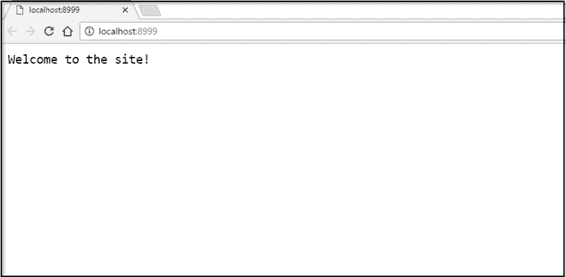
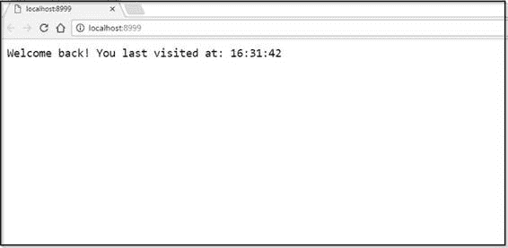
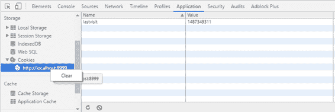

# 六、Cookie和会话

毫无疑问，您知道，HTTP 是一种无状态协议。客户端对 web 服务器的每个请求都与两者之间的任何先前交换完全无关，并且通信机制仅由请求/响应对组成。服务器不需要保留关于任何先前请求的任何信息。

这种方法的好处是，服务器不需要分配内存来实现这一点(因为它不会“记住”客户端以前的任何请求)，如果客户端连接断开，服务器也不必进行任何清理。

这种方法的缺点是，服务器什么都不记得。这可能会使构建一个丰富的交互式 web 应用程序变得很棘手，因为我们经常必须在每个请求中发送额外的信息，以便服务器充分了解客户端的状态，从而提供有用的响应。

实现这一切的关键是Cookie和会话。在演示如何在我们的 Go web 应用程序中使用它们之前，让我们先定义两者。

## 介绍Cookie和会话

### 什么是Cookie？

cookie 只是浏览器放在用户电脑上的一个小文本文件。它存储的信息有助于维持持久连接的假象。

Cookies 通常用于身份验证、存储站点访问者首选项、维护购物车项目和识别服务器会话。

当浏览器与 web 服务器交互时，它将 cookie 中的信息作为请求的一部分传递。请注意 cookies 是特定于域的。如果浏览器为 twitter.com 创建了一个 cookie，它不能突然将该 cookie 发送到 google.com。

从本质上说，cookies 非常适合存储用户从一个页面移动到下一个页面时与网页交互的信息。

### 什么是会话？

会话允许您存储关于客户端与网站交互的信息，就像 cookies 一样，但是数据存储在服务器上而不是客户端上。

会话是在 cookies 中填充大量不断变化的信息的更好选择。相反，客户端只存储一个唯一的标识符(“会话标识”)，并在每次请求时将该标识传递给网络服务器。服务器使用会话标识在其内部数据库中查找信息，并检索与用户使用应用程序相关的变量。

### 什么是会话 cookie？还是持久的Cookie？

哦哦。只是为了进一步迷惑你，不仅有 cookie 和会话，还有会话 cookie！

使用 cookies，您的应用程序可以设置一个到期时间。当一个网站的登录页面给你“让我登录吗？”选项。

如果设置了过期时间，浏览器会将 cookie 保存到本地文件系统。这被称为持久 cookie。

如果不设置过期时间，浏览器通常会将 cookie 保留在内存中，这称为会话 cookie。

因此，会话 cookie 和持久 cookie 只是 cookie，但是有不同的过期时间。

## 使用Cookie

### 设置Cookie

为了向 Go 中的 cookie 写入信息，您可以使用`net/http`的包的`SetCookie`功能，其签名如下:

`http.SetCookie(w ResponseWriter, cookie *Cookie)`

`w`是对请求的响应，`cookie`是一个结构:

`type Cookie struct {`

`Name string`

`Value string`

`Path string`

`Domain string`

`Expires time.Time`

`RawExpires string`

`MaxAge int`

`Secure bool`

`HttpOnly bool`

`Raw string`

`Unparsed []string`

`}`

cookie 可以保存许多信息，但最重要的字段是:

*   `Name`:cookie 的密钥，用于在代码中引用它。
*   `Value`:Cookie的数据。
*   `Expires`:表示浏览器何时可以删除的`Time`值。

对于控制对 cookie 的访问可能有用的其他字段有:

*   `Path`
*   `Domain`
*   `HttpOnly`

现在，让我们保持简单。

以下是如何设置 cookie 的示例:

`expiration := time.Now().Add(365 * 24 * time.Hour)`

`cookie := http.Cookie{Name: "username", Value: "jsmith", Expires: expiration}`

`http.SetCookie(w, &cookie)`

|  | 提示:Go 的时间功能很复杂，但是很复杂。有关更多信息，请参见 https://golang.org/pkg/time/.的文档 |

### 取Cookie

为了从请求中检索 cookie，您可以执行以下操作:

`cookie, _ := r.Cookie("username")`

`fmt.Fprint(w, cookie.)`

或者，如果几个 cookies 与一个请求相关联，您可以循环访问它们，如下所示:

`for _, cookie := range r.Cookies() {`

`fmt.Fprint(w, cookie.Name)`

`}`

### 使用Cookie

让我们创建一个使用 cookie 的简单应用程序。

下面的代码检查这是否是访问者第一次访问我们的网站。如果是，它会显示一条欢迎消息。如果没有，它会显示上次访问的时间。

代码清单 35:使用 Cookie 检查站点访问者状态

```go
  package
  main

  import
  (
        "net/http"
        "strconv"
        "time"
  )

  func
  CheckLastVisit(w http.ResponseWriter, r *http.Request)
  {

        c,
  err := r.Cookie("lastvisit")
  //

        expiry
  := time.Now().AddDate(0, 0, 1)

        cookie
  := &http.Cookie{
              Name:   
  "lastvisit",
              Expires:
  expiry,
              Value:  
  strconv.FormatInt(time.Now().Unix(), 10),
        }

        http.SetCookie(w,
  cookie)

        if err != nil {
              w.Write([]byte("Welcome to
  the site!"))
        }
  else {
              lasttime,
  _ := strconv.ParseInt(c.Value, 10, 0)
              html
  := "Welcome
  back! You last visited at: "
              html
  = html + time.Unix(lasttime, 0).Format("15:04:05")
              w.Write([]byte(html))
        }
  }

  func
  main() {
        http.HandleFunc("/", CheckLastVisit)
        http.ListenAndServe(":8999", nil)
  }

```

处理程序中的第一行代码试图将 cookie 放到用户的浏览器中。如果成功，它会在 cookie 的`Value`字段中记录当前时间，并显示“欢迎来到该网站！”消息。如果出现错误，这将是因为 cookie 已经存在，这意味着它所做的只是更新`Value`字段中的时间，并将其显示给用户，作为他们上次访问的时间。

如果我们运行应用程序并访问应用程序的根，我们将在图 30 中看到消息。



图 30:第一次访问站点

如果我们刷新页面，我们将看到图 31。



图 31:对站点的后续访问

如果你像我一样使用 Chrome，你可以这样删除 cookie:

1.  打开开发者工具( **Chrome 菜单** > **更多工具** > **开发者工具**)。
2.  选择**网络**选项卡。
3.  展开左窗格中“存储”下的“Cookies”部分。
4.  右键单击域( [http://localhost:8999](http://localhost:8999) )并单击**清除**。



图 32:使用 Chrome 的网络开发工具删除 Cookie

如果您正在使用 Firefox，您可以通过以下方式删除 cookie:

1.  从火狐按钮或工具菜单，转到选项>隐私面板。
2.  选择火狐将:使用历史自定义设置。
3.  点击**显示Cookie**。
4.  使用搜索框输入您正在开发的网站的域名( [http://localhost:8999](http://localhost:8999) )或深入文件夹列表进行查找。
5.  在列表中选择要删除的 cookie，点击**删除 Cookie** 。

如果您删除 cookie 并刷新浏览器页面，您将看到“欢迎来到该网站！”再次留言。

## 与会议合作

为了在 Go 中使用会话，我建议我们重新访问 Gorilla Web Toolkit 的会话模块，因为在我看来，这是一个比原生 Go 方法更干净的实现。

从 GitHub 安装，如下所示:

`go get github.com/gorilla/sessions`

### 基础

下面的代码演示了使用`gorilla/sessions`包创建和验证会话、检索会话、设置一些值、然后保存会话的基础知识。

代码清单 36:使用大猩猩/会话

```go
  package
  main

  import
  (
        "net/http"

        "github.com/gorilla/mux"
        "github.com/gorilla/sessions"
  )

  var
  store = sessions.NewCookieStore(
                             []byte("keep-it-secret-keep-it-safe"))

  func
  handler(w http.ResponseWriter, r *http.Request)
  {
        session,
  err := store.Get(r, "session-name")
        if err != nil {
              http.Error(w,
  err.Error(),

   http.StatusInternalServerError)
              return
        }

        // Set some session values.
        session.Values["abc"] = "cba"
        session.Values[111] = 222
        // Save the session values
        session.Save(r,
  w)
  }

  func
  main() {
        router
  := mux.NewRouter()
        http.Handle("/", router)
        router.HandleFunc("/", handler)
        http.ListenAndServe(":8999", nil)
  }

```

该代码首先通过使用用于验证会话的密钥调用`NewCookieStore`来初始化会话存储。

然后，在我们的处理程序中，我们调用商店的`Get`函数来检索名为“会话名”的会话如果它发现了，我们就能进入会议。如果该名称的会话不存在，将创建一个会话。

|  | 提示:默认情况下，Gorilla 创建的会话 cookies 将持续一个月。如果这对于您的需求来说太长，您可以在每个会话的选项中设置 MaxAge 属性，或者配置会话存储，以便所有会话 cookies 都具有相同的 MaxAge 值。 |

当我们有一个会话时，我们可以使用它的`Values`属性赋值。`Values`属性是一个 Go `map`，它基本上是一个哈希表的 Go 实现，允许您使用键/值对来设置属性。

接下来，我们调用会话的`Save`方法，将会话保存在响应中。

|  | 提示:在返回响应之前，请始终保存会话值。否则，响应将不会收到会话 cookie。 |

这是 Gorilla 会话的基本实现。然而，gorilla/session 还为我们提供了额外的、有用的功能，我们将在接下来介绍这些功能。

### 闪光信息

Gorilla 从 Ruby 借用了 flash 消息的概念。闪存消息只是一个会话值，在读取之前一直存在。

我们使用 flash 消息来临时存储请求之间的数据，例如表单提交过程中的成功或错误消息，以避免以后被错误复制。

我们使用会话的`AddFlash`方法添加一条 flash 消息，并通过调用`session.Flash`检索 flash 消息。

在这里，我们不会过多地讨论 flash 消息，只是要意识到它们的存在。代码清单 37 演示了如何获取和设置 flash 消息。

代码清单 37:在大猩猩/会话中使用 Flash 消息

```go
  package
  main

  import
  (
        "fmt"
        "net/http"
        "time"

        "github.com/gorilla/mux"
        "github.com/gorilla/sessions"
  )

  var
  store = sessions.NewCookieStore(

  []byte("keep-it-secret-keep-it-safe"))

  func
  handler(w http.ResponseWriter, r *http.Request)
  {
        session,
  err := store.Get(r, "session-name")
        if err != nil {
              http.Error(w,
  err.Error(),

  http.StatusInternalServerError)
              return
        }

        // Get any previous flashes.
        if flashes :=
  session.Flashes(); len(flashes) > 0 {
              // Do something with them
              for f := range flashes {
                    fmt.Println(flashes[f])
              }
        }
  else {
              // Set a new flash.
              session.AddFlash("Flash! Ah-ah, savior of the universe!"
                                               +
  time.Now().String())
        }
        session.Save(r,
  w)
  }

  func
  main() {
        router
  := mux.NewRouter()
        http.Handle("/", router)
        router.HandleFunc("/", handler)
        http.ListenAndServe(":8999", nil)
  }

```