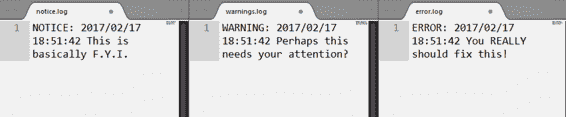
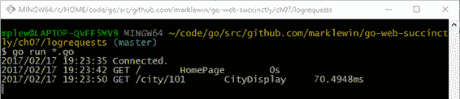
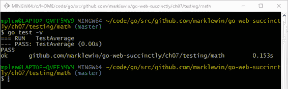
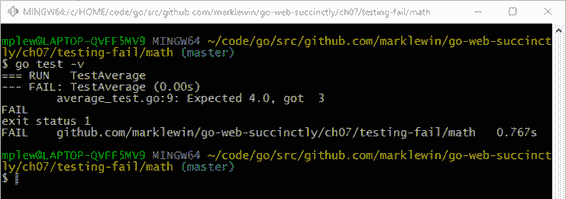

# 第七章开发技术

如果您已经坚持了这么长时间，现在应该已经很好地掌握了在 go 中创建 web 应用程序的各种细节。在这一章中，我想介绍一些技术，这些技术将帮助您调试和测试您的 Go web 应用程序。

## 测井

任何超越琐碎的应用程序都需要良好的日志记录，以便开发人员能够定位和修复错误。

### 基本测井

Go 的`log`包可以让你写入所有标准设备、自定义文件或任何支持`io.Writer`接口的目的地。到目前为止，我们只登录了`stdout`(通过`fmt.Println`等)，但这对于生产应用来说并不是一个现实的选择。因此，让我们考虑如何将输出记录到文件中，并明确哪个文件获得哪种类型的日志消息。

在下面的代码中，我们创建了一个应用程序，它会将通知记录到`notices.log`，将警告记录到`warnings.log`，将错误记录到`errors.log`。

代码清单 38:根据信息类型记录到不同的文件

```
  package
  main

  import
  (
        "log"
        "os"
  )

  var (
        Notice 
  *log.Logger
        Warning
  *log.Logger
        Error  
  *log.Logger
  )

  func
  main() {
        noticeFile,
  err := os.OpenFile("notice.log",

  os.O_RDWR|os.O_APPEND, 0660)
        defer noticeFile.Close()
        if err != nil {
              log.Fatal(err)
        }
        warnFile,
  err := os.OpenFile("warnings.log",

  os.O_RDWR|os.O_APPEND, 0660)
        defer warnFile.Close()
        if err != nil {
              log.Fatal(err)
        }
        errorFile,
  err := os.OpenFile("error.log",

  os.O_RDWR|os.O_APPEND, 0660)
        defer errorFile.Close()
        if err != nil {
              log.Fatal(err)
        }

        Notice
  = log.New(noticeFile, "NOTICE: ",
  log.Ldate|log.Ltime)
        Notice.SetOutput(noticeFile)
        Notice.Println("This is basically F.Y.I.")

        Warning
  = log.New(warnFile, "WARNING: ",
  log.Ldate|log.Ltime)
        Warning.SetOutput(warnFile)
        Warning.Println("Perhaps this needs your attention?")

        Error
  = log.New(errorFile, "ERROR: ",
  log.Ldate|log.Ltime)
        Error.SetOutput(errorFile)
        Error.Println("You REALLY should fix this!")
  }

```

请注意，在上面的代码清单中，`0660`是文件模式参数，允许向用户和组读写文件。有关文件模式`0660`(以及一般文件模式)的更多信息，请参见[http://www.filepermissions.com/file-permission/0660](http://www.filepermissions.com/file-permission/0660)。

输出如代码清单 39 所示。

代码清单 39:日志文件输出



然而，这些对于记录 web 请求都不是很有用，任何一个好的 web 服务器都可以做到这一点。那么，让我们考虑另一种方法。

### 记录网络请求

让我们重温一下我们在第 5 章中创建的 RESTful 网络服务。还记得我们是如何将路由器的路由分别拆分为`routes.go`和`router.go`的吗？让我们再次查看一些代码清单示例，并将各种关注点分成这些模块:

*   **路由器. go**
*   **路线走**
*   **logger.go**
*   **logger.go 包含 logger 中间件**
*   **路由器增加记录器中间件**

代码清单 40:路由器

```
  package
  main

  import "github.com/gorilla/mux"

  func
  NewRouter() *mux.Router {

        router
  := mux.NewRouter().StrictSlash(true)
        for _, route :=
  range routes {
              router.
                    Methods(route.Method).
                    Path(route.Pattern).
                    Name(route.Name).
                    Handler(route.HandlerFunc)
        }

        return router
  }

```

代码清单 41:路线

```
  package
  main

  import "net/http"

  type
  Route struct {
        Name       
  string
        Method     
  string
        Pattern    
  string
        HandlerFunc
  http.HandlerFunc
  }

  type
  Routes []Route

  var
  routes = Routes{
        Route{
              "HomePage",
              "GET",
              "/",
              HomePage,
        },
        Route{
              "CityList",
              "GET",
              "/city",
              CityList,
        },
        Route{
              "CityDisplay",
              "GET",
              "/city/{id}",
              CityDisplay,
        },
        Route{
              "CityAdd",
              "POST",
              "/cityadd",
              CityAdd,
        },
        Route{
              "CityDelete",
              "GET",
              "/citydel/{id}",
              CityDelete,
        },
  }

```

以这种方式管理路由使得用中间件装饰它们变得非常容易，正如我们在第 2 章中讨论的那样。考虑我们的 web 服务应用程序的这个新添加，如代码清单 42 所示。

代码清单 42:记录器. go，包含记录器中间件

```
  package
  main

  import
  (
        "log"
        "net/http"
        "time"
  )

  func
  Logger(inner http.Handler, name string)
  http.Handler {
        return http.HandlerFunc(func(w http.ResponseWriter, 

  r *http.Request) {
              startTime
  := time.Now()

              inner.ServeHTTP(w,
  r)

              log.Printf(
                    "%s\t%s\t%s\t%s",
                    r.Method,
                    r.RequestURI,
                    name,
                    time.Since(startTime),
              )
        })
  }

```

新文件`logger.go`包含一个名为`Logger`的函数。我们可以将我们的处理程序传递给`Logger`，然后它会自动提供记录和计时信息。

中间件很酷，对吧？

我们可以通过修改`router.go`中的`NewRouter`函数，将这个中间件应用到我们的处理程序中。

代码清单 43:向我们的路由器添加日志中间件

```
  package
  main

  import
  (
        "net/http"

        "github.com/gorilla/mux"
  )

  func
  NewRouter() *mux.Router {

        router
  := mux.NewRouter().StrictSlash(true)
        for _, route :=
  range routes {

              var handler http.Handler
              handler
  = route.HandlerFunc
              handler
  = Logger(handler, route.Name)

              router.
                    Methods(route.Method).
                    Path(route.Pattern).
                    Name(route.Name).
                    Handler(handler)
        }

        return router
  }

```

接下来，当我们启动应用程序并创建请求时，我们的控制台显示日志消息，如图 33 所示。



图 33:测试记录器中间件

## 测试

测试被烘焙成 Go 语言，标准库中有`testing`包。测试提供了通过执行`go test`命令来运行测试的能力。

更好的是，围棋测试非常简单直观。编写测试只需要导入`testing`包，编写测试函数即可。

Go 中的所有测试功能都以单词“test”开头，并接收类型为`*testing.T`的单个参数:

`package foo`

`import "testing"`

`func TestSomething(t *testing.T) {`

`// do your testing here...`

`}`

当你写了一个测试，并把它保存在一个名字以`_test.go`结尾的文件中时，你接下来通过在同一个目录中运行`go test`来练习它。

让我们来看一个它是如何工作的例子。

我们将创建一个非常简单的函数，在一个名为`Average`的函数中，在一个名为`math`的包中，在一个名为`average.go`的文件中，计算一片数字的平均值。

代码清单 44:数学包中的平均函数

```
  package
  math

  func
  Average(nums []float64) float64 {
        total
  := float64(0)
        for _, x :=
  range nums {
              total
  += x
        }
        return total /
  float64(len(nums))
  }

```

代码清单 45 显示了我们通常用来调用`Average`函数的`main.go`中的`main`函数。

代码清单 45: main.go，在包 main 中

```
  package
  main

  import
  (
        "fmt"

        "github.com/marklewin/go-web-succinctly/ch07/testing/math"
  )

  func
  main() {
        nums
  := []float64{1, 2, 3, 4}
        avg
  := math.Average(nums)
        fmt.Println(avg)
  }

```

接下来，我们可以在一个名为`average_test.go`的文件中创建一个名为`TestAverage`的函数，也在`math`中，以便测试该函数。

代码清单 46:测试数学包中平均函数的代码

```
  package
  math

  import "testing"

  func
  TestAverage(t *testing.T) {
        var v float64
        v
  = Average([]float64{1, 2, 3, 4, 5})
        if v != 3.0 {
              t.Error("Expected 3.0, got ", v)
        }
  }

```

现在，从文件所在的目录运行测试。使用`go test`中的`-v`标志进行详细输出。



图 34:成功执行测试

在这种情况下，`math`包中的所有测试都通过了(尽管目前只有一个测试)。

如果我们的测试失败了呢？让我们模拟一下。在这种情况下，是我们的测试，而不是我们正在测试的代码，出了问题——它期望一个不同于正确值的值。

代码清单 47:破坏测试平均函数

```
  package
  math

  import "testing"

  func
  TestAverage(t *testing.T) {
        var v float64
        v
  = Average([]float64{1, 2, 3, 4, 5})
        if v != 4.0 {
              t.Error("Expected 4.0, got ", v)
        }
  }

```

图 35 展示了失败测试的样子。



图 35:失败的测试

希望在你的 Go web 开发冒险中，你不会经历太多失败的测试，但是最好在开发中而不是在生产中了解！

无论发生什么事情，我都祝你作为一名围棋网络开发者快乐而富有成效！