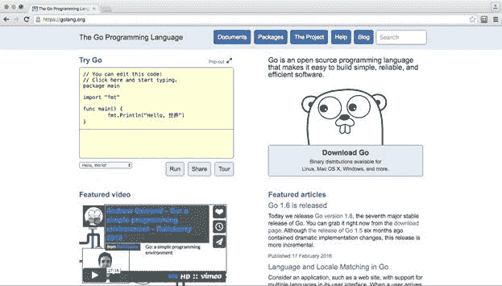
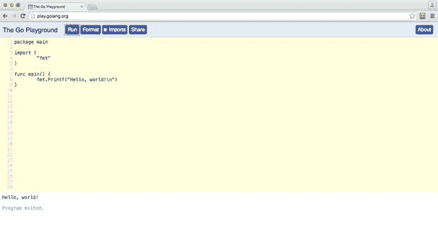
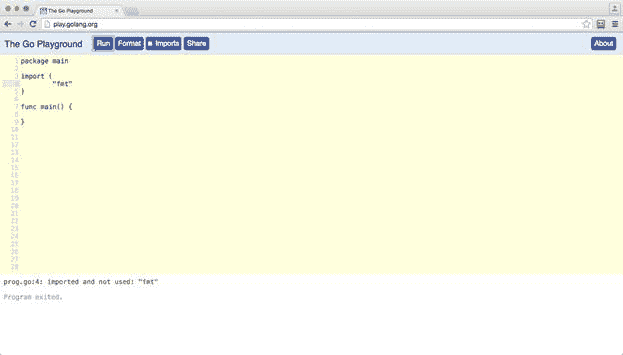
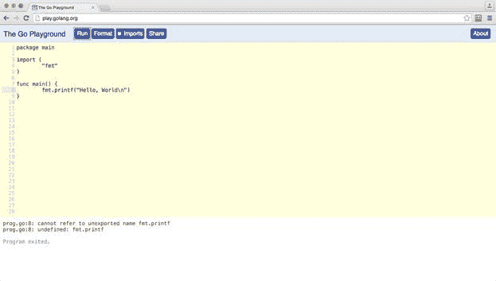
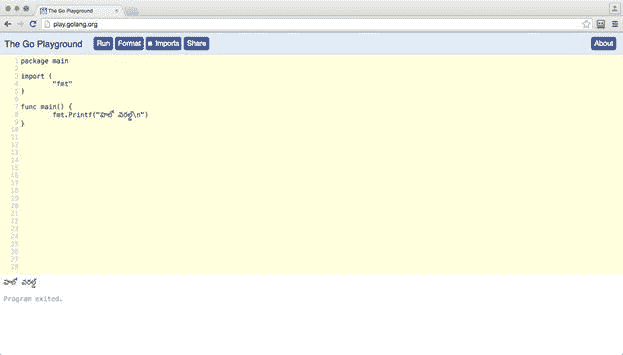
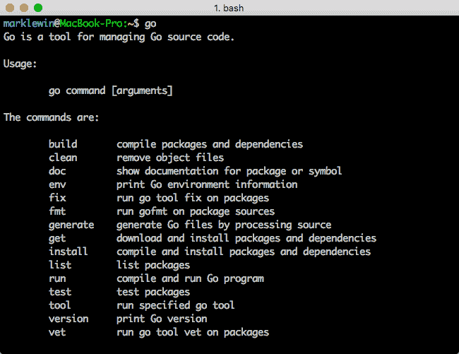

# 三、让我们走吧！

## 格朗网站

Golang(Go 编程语言的缩写)网站是您与 Go 相关的所有内容的首选资源(抱歉，无法抗拒)。从这里，您可以下载Go编译器和工具，访问在线文档，并阅读Go世界中所有新的精彩内容。

快来看看。访问 [Golang 网站](http://www.golang.org/)向自己介绍 Go Gopher，它是 Go 项目的标志性吉祥物。(如果你真的对Go地鼠背后的历史感兴趣，请阅读[Go项目博客](http://is.gd/xasMh9)上的这篇文章。)



图 1:戈朗主页

## 你的第一个Go程序

你甚至不需要安装 Go 来编写你的第一个 Go 程序，因为你可以直接从 Golang 网站试用 Go。我们现在就开始吧。毕竟，你可能讨厌Go。如果你这样做了，我会非常惊讶和失望，但我不想成为那个让你在机器上安装大量你永远不会真正使用的 cruft 的人。我会让电脑厂商去做！

首先，参观[Go游戏场](http://play.golang.org/)。

接下来，选择代码窗口中的所有内容并将其删除。

然后，键入以下内容作为新Go程序的第一行:

`package main`

就这样。不需要分号或其他终止符。但是 Go 是一种类似 C 的语言，C 及其派生词用分号告诉编译器一行结束，另一行开始。Go 也使用分号，但是除了少数控制结构，它们通常不会出现在源代码中。相反，lexer 会在扫描您的程序时自动插入它们，寻找新的行，并从它找到的标记中推断语句的结尾，这意味着您不必担心终止语句。这只是 Go 让你的生活变得更轻松的众多事情之一。

您刚才输入的`package`语句告诉 Go 编译器，该代码文件将位于`main`包中。Go 将代码组织成包，其中最重要的包是`main`，因为那是你的程序将要开始的地方。有些包是您自己编写的，比如这个包，有些包是您从其他来源导入的。

在`main`包中有一个名为`main()`的函数，如果你曾经写过任何 C 或 Java 代码，这应该不足为奇。这是你的程序的入口点。

因此，按几次回车键并输入:

`func main() {`

`}`

我们要写一个简单的程序，写一句“你好，世界！”屏幕上的信息。为此，我们需要从名为`fmt`的 Go 标准库中导入一个包。在您的包声明和您的`main()`功能之间，输入以下内容:

`import (`

`"fmt"`

`)`

现在回到您的`main()`功能，输入以下语句:

`fmt.Printf("Hello, World!\n")`

该行代码使用`fmt`包中的`Printf()`功能在屏幕上显示一行文本，该行文本以一个新的行字符(`'\n'`)结束。

让我们运行它，看看它是否有效。只需点击页面顶部的**运行**按钮，查看底部的程序输出。如果你看到你的“你好世界！”留言，你的程序运行正常。如果没有，将您的代码与图 2 中的截图进行比较。



图 2:“你好，世界！”Go游戏场的节目

如果一切按计划进行，你的程序在谷歌的服务器上编译并执行，显示“你好，世界！”消息，然后退出。这个过程非常快，因为 Go 的编译器是高度优化的。是的，您的程序只有几行长，而且非常琐碎，但是当您开始编写更复杂的代码时，Go 编译器会对它的速度感到惊讶——尤其是如果您是一名 Java 程序员的话。

我想起了一个以 Java 为代价的老笑话:

*敲！敲！”
“谁在那里？”
“…”
“…”
“…”
“…”
“…”
“…Java！”*

现在，我想让你打破一些东西，只是为了了解Go是如何工作的。首先删除`fmt.Printf()`语句，重新运行程序。这一次您应该会看到一个错误，如图 3 所示。您会看到错误的行号用粉红色突出显示，并在底部显示一条错误消息。



图 3:未使用的包错误

这是因为 Go 与许多语言不同，它严格关注您导入的包以及它们在程序中的使用方式。Go 不喜欢您导入从未使用过的包。它认为这是对资源的浪费，并且非常讨厌它，以至于引发了一个错误。这使你的程序保持良好和精简，而不是被从未使用过的链接代码膨胀。

重新键入打印“你好，世界”的代码行消息发送到您的屏幕，但这次使用小写的`p`代表`printf()`，并再次运行程序。



图 4:未知函数错误

Go 编译器抛出另一个错误。那是因为 Go 是一种区分大小写的语言，如果大写错误它不会原谅你。

修改你的程序，使它正常工作。

关于Go，另一件需要了解的事情是它处理字符串的方式。在大多数语言中，字符串只是一堆字节。在Go中，它们是“符文”，实际上只是映射到 Unicode 对应物的整数值。这使得在 Go 字符串中包含外语字符变得非常容易(如果您非常倾向，甚至可以在函数名中使用它们)。

例如，如果我们想写“你好，世界！”在 Telegu 中，我们不需要对代码做任何特别的事情:



图 5:“你好，世界！”在 Telegu

Go操场是一个很好的语言实验场所，你甚至可以和别人分享你的劳动成果(只需点击**分享**按钮)。然而，一旦你准备好写一些更充实的东西，你就需要下载在本地机器上编译和执行代码所需的工具。

## 设置您的机器

在准备开始编写Go程序之前，您需要在机器上设置一些东西。具体步骤将取决于您的操作系统。

### 文本编辑器

你需要一个编辑器来编写代码。任何编辑器都可以，但是如果你能找到一个支持 Go 语法高亮显示的编辑器，它会让生活变得更容易。您可能需要做一些谷歌搜索来为您选择的编辑器找到合适的语法高亮语言包，但是这样做是值得的。

Atom 或 Sublime Text 是非常好的跨平台编辑器，有各种各样的插件，可以用来编译和格式化代码。老顽固 emacs 和 vim 同样有能力，如果不是更有能力的话。最终，这取决于你使用哪个文本编辑器，因为 Go 本身并不在乎。

如果您熟悉某个集成开发环境，您可能能够调整它以使用 Go。例如，IntelliJ IDEA 平台有一个名为 [go-ide](http://www.go-ide.com/) 的插件。

我在这里保持简单，只是在我的苹果电脑上使用一个相当简单的名为文本牧马人的文本编辑器。这不令人兴奋，但也不妨碍。Windows 的等效程序可以是 Notepad++、Notepad2 和 PSPad，或者，对于 Linux，可以是 Gedit、Geany 或 Kate。

### 终点站

Go 编译器和其他工具都是命令行应用程序，因此您需要访问终端程序，除非您的高级编辑器可以直接运行这些工具。当您熟悉 Go 时，这可能很好，但是我建议您在开始时通过命令行来做事情，因为这样可以让您更好地了解工具是如何工作的。

**窗户**

在 Windows 中，您可以通过调出运行对话框(按住 **Windows 徽标键** + **R** )然后键入`cmd.exe`来打开终端(或众所周知的命令提示符)。

**OS X**

在苹果电脑上，打开**查找器**并导航至**应用程序** > **实用程序** > **终端**。把它钉在码头上，因为在这本书里你会经常用到它。

Linux

如果你正在运行 Linux，你无疑已经熟悉了命令行，不需要我的任何帮助。

### 开始工具集

您可以从 [Golang 网站下载 Go 工具。](http://www.golang.org/)找到地鼠的图片(很难错过)，点击下方**下载开始**按钮。从“特色下载”部分选择您的操作系统版本。在撰写本文时，Go 的当前稳定版本是 1.6，本书中的所有示例都基于此版本。然而，谷歌希望 Go 代码可以跨版本工作，所以如果你的 Go 版本和我的版本不一样，一切都应该仍然可以工作。

如果你在 Windows 或 OS X 上，你可以简单地运行安装程序，你就可以开始了。

如果你在 Linux 上，你可以把`.tar.gz`文件解压到/ `usr/local/go`中，不需要进一步设置。如果你坚持在其他地方安装，你需要相应地设置`$GOROOT`环境变量。有关完整说明，请参考安装程序包中的`README.md`文件。

通过打开终端提示并输入`go`来测试安装。您应该会看到类似于图 6 所示的输出。当您运行`go`而没有任何其他参数时，它只是列出了各种可用的工具和帮助。您可以从输出中看到，工具集中有用于编译、运行和格式化 Go 代码的工具；查找文档；以及作为Go程序员你会遇到的所有其他任务。



图 6:检查执行工具集的安装

## 开始工作区

在大多数编程环境中，每个代码项目都有一个单独的工作空间，每个工作空间都可能在源代码控制之下。Go采取了一种不同的方法，Go程序员通常将他们所有的Go代码保存在一个工作空间中。让您的工作空间的结构恰到好处是很重要的，因为 Go 工具集预期事情会在某些地方发生，并且当您以不同的方式做事情时会非常沮丧。

Go 工作区只是一个包含三个主要子目录的目录:

*   `src`:包含你的 Go 源代码文件
*   `pkg`:包含包裹
*   `bin`:包含可执行程序

在实践中，在`src`目录中将会有进一步的划分，映射到不同的版本控制存储库，但是现在我们将保持事情非常简单。

在您的计算机上为所有 Go 项目创建一个位置。这将是你的工作空间。例如，我的在我的主目录(`~/Code/Go`)的`/Code/Go`文件夹中。唯一的要求是这不能与您的 Go 安装在同一路径上。

Go 工具需要知道在哪里可以找到您的代码，它们将使用名为`GOPATH`的环境变量来实现这一点。`GOPATH`环境变量指向您的Go工作区。

使用以下特定于操作系统的说明来设置`GOPATH`。这些都是基于我的环境，所以你需要改变`/Code/Go`来反映你自己工作空间的位置。

**窗户**

打开命令提示符并键入以下内容:

`setx GOPATH %USERPROFILE%\Code\Go`

这将在较新版本的 Windows 上将`GOPATH`设置为`C:\users\username\Code\Go`。旧版本可能不支持这种命令行方式，但您也可以从控制面板中设置`GOPATH`(**系统** > **【高级】** > **环境** **变量**)。

**OS X 和 Linux**

您需要存储`GOPATH`设置，以便您的终端记住它。你通常在`~/.bash_profile`中这样做。在终端输入以下命令:

`echo 'export GOPATH=$HOME/<path to my folder>…' >> ~/.bash_profile`

退出终端，重新启动，输入以下命令，确保`GOPATH`设置一直保持:

`env | grep GOPATH`

这将显示`GOPATH`环境变量的当前值。

## 迁移“你好，世界！”

让我们以“你好，世界！”我们在Go游戏场创建的程序，并让它在我们的本地机器上运行。

首先，在工作区目录中，创建一个名为`src`的新子目录，并在其下创建一个名为`hello`的子目录。请记住，如果您的工作区在不同的位置，您需要的目录路径可能与我的不同。

**窗户**

`md src\hello`

**OS X 和 Linux**

`mkdir –p src/hello`

在`/src/hello`内，创建一个名为`main.go`的文件。请注意，您可以随意调用这个文件，但是因为它是我们的`main()`函数的位置，`main.go`似乎是一个好名字。

进入“你好，世界！”代码从 Go 操场进入你选择的文本编辑器中的`main.go`文件并保存。

代码清单 1

```go

  package main

  import (
        "fmt"
  )

  func main() {
        fmt.Printf("Hello, world!\n")
  }

```

为了运行程序，您需要使用`go`工具。打开终端，转到`src/hello`目录，输入以下命令:

`go run main.go`

该命令编译`main.go`文件，如果编译成功，则启动该文件。如果你的程序显示“你好，世界！”在你的终端，这意味着你成功了。拍拍自己的背。如果失败，查看编译器生成的错误，并尝试在代码中修复它们，然后再次执行 `go` `run main.go`。如果你能做到，那就为你的调试技巧多拍自己的背。

|  | 提示:有关设置工作空间和许多不同编译器选项的更多信息，请参见这些主题的优秀文档[这里](https://golang.org/doc/code.html)。 |

## 格式化 Go 源代码

与许多语言不同，Go 对代码的格式非常挑剔。这给了你更少的机会来展示你的艺术本质，但是它确实防止了工作中的代码评审期间的争论，并且使你的代码(和其他人的代码)更容易阅读，因此也更容易维护。

Go规则有规则(你必须遵守)和惯例(他们希望你遵守)。这与 Java 和其他衍生自 c 语言的语言有很大的不同。来自这些语言的程序员在使用 Go 时发现的最大的震惊之一是 Go 如何对大括号的使用实施规则。

在 C 和 Java 中，当你有一段代码作为函数或控制结构的一部分时(`if`、`for`等)。)，这些都包含在花括号中。C 或 Java 编译器不关心初始大括号是否出现。例如:

`function myFunction() {`

`if (loggingEnabled == true) {`

`log.output("I'm in myFunction()");`

`}`

`…`

`}`

这段代码同样可以这样写:

`function myFunction()`

`{`

`if (loggingEnabled == true)`

`{`

`log.output("I'm in myFunction()");`

`}`

`…`

`}`

但不是在Go中。Go 坚持认为左大括号总是与它前面的语句在同一行。无论如何，大多数 C 和 Java 程序员都使用这种风格，但是当 Go 在背离这种风格的情况下引发错误时，他们会感到惊讶。

Go 还抱怨当控件结构的主体只包含一行代码时，省略了花括号。Go 坚持这样做。例如，以下方法在 Go 中是非法的:

`if zombieApocalypse == true`

`fmt.Println("Run for the hills")`

相反，它应该写成:

`if zombieApocalypse == true {`

`fmt.Println("Run for the hills")`

`}`

没有规则的地方就有惯例，例如:

*   Go 使用制表符而不是空格来缩进代码。
*   当您使用导入语句导入多个包时，Go 希望它们按字母顺序排列。
*   当您创建自定义类型时，Go 喜欢字段名称和类型排列整齐。

因为这些约定一开始很难记住，也因为 Go 的创建者想让你更容易采用他们的编程风格，所以在工具集中有一个叫做`fmt`的工具，你可以用它来确保你的代码非常“Go-like。”

从命令行执行该工具，如下所示:

`go fmt /path/to/your/package`

例如，如果这是源文件(`hello.go`):

`package main`

`import "fmt"`

`func main() {`

`i := 5`

`fmt.Println((i))`

`fmt.Printf( "hello, world\n" )`

`}`

然后，运行 `go fmt hello.go`后，输出会出现如下:

`package main`

`import "fmt"``func main() {` ``fmt.Println((i))` `fmt.Printf("hello, world\n")``}`

好多了！

养成这种习惯是很好的，尤其是当和其他程序员一起工作时，他们希望你的代码被格式化为“Go way”您可以将它包含在您的构建过程中，一些编辑器有插件，可以在您每次保存源文件时自动格式化您的代码。

## 获得Go的帮助

无论你是一个多么优秀的程序员，你都不可能记住一门编程语言的每一个复杂之处，即使是像 Go 这样简洁的语言。您将需要帮助，Go 中的帮助文档非常有用。

获取帮助有两种主要方式。首先，您可以访问 Golang 网站上的**文档**链接。它包含介绍、操作指南和文章，以及全面的参考文档。您还可以通过Go博客了解最新的Go新闻，并收听一些关于Go的录制讲座和演示。也可以在这里查看论坛、邮件列表和 IRC 频道。

您也可以直接在 Go 本身中查找有关 Go 命令的信息。例如，要获取整个`fmt`包的信息，在终端提示处输入以下内容:

`godoc fmt`

要深入了解特定 Go 类型、变量、常量或函数(如`Printf()`)的信息，请输入以下内容:

`godoc fmt Printf`

如果文档没有提供您需要的答案，那是因为 Go 是一个开源项目，这意味着您可以直接访问源代码本身。但是，我认为您会对 Go 文档的质量感到满意。

### 记录自己的代码

您也可以使用`godoc`工具来记录您自己的包。虽然这超出了本书的范围，但它需要的只是代码中的注释，根据您试图传递的信息类型，以特殊的方式格式化。在 Go 中创建注释的语法与其他 C 风格语言相同:

`// This is a line comment that will be ignored by the compiler`

`/* This is a block comment.`

`It can span several lines and`

`will also be ignored by the compiler. */`

养成在代码中添加注释的习惯。它对其他程序员很有用，当你重温不久前写的代码而不再理解它时，它对你也很有用！

我们的编写、编译、运行和获取 Go 代码帮助的速成班到此结束。在随后的章节中，我们将深入研究这种语言本身的特点。

## 推荐 Go 工具:Golint` 

这是我发现非常有用的另一个工具。它不是标准工具集的一部分，但是可以从 GitHub 安装。

`Golint`是 Go 源代码的一个短句。它与`go` `fmt`的不同之处在于`go` `fmt`重新格式化源代码，而`Golint`生成一个它认为是风格不端的列表。我发现，当 Go 告诉我出了什么问题，而不仅仅是为我重新格式化代码时，我从风格上更多地了解了 Go 对我的期望。

通过运行安装`Golint`:

`go get github.com/golang/lint/golint`

使用说明参见[在线文档](https://github.com/golang/lint)。