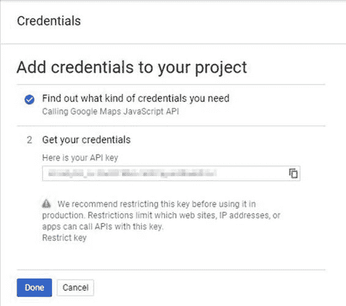

# 二、入门

## API 密钥

在页面中嵌入谷歌地图之前，您需要请求一个应用编程接口密钥。应用编程接口密钥只是一个字符串，您需要将其嵌入到代码中，以便在自己的网页中使用谷歌地图。这使得谷歌能够关注你提供了多少地图请求，如果你的应用变得超级流行，就开始向你收取访问费用。

谷歌有几个不同的定价计划，但你会想从他们的标准计划开始，这是免费的，直到你在 24 小时内加载超过 25，000 张地图。您对方向和地理编码等服务的免费请求数量也有所限制，我们将在本书的后面部分讨论。之后，你需要开始向谷歌支付特权。

请放心，25，000 个地图加载和 2，500 个服务请求是非常慷慨的，在你的应用变得相当受欢迎(并且可能正在为你赚钱)之前，你不太可能达到这个配额。如果你只是跟着这本书里的例子走，这些限制对你来说不会是问题。

之后，您可以“随用随付”或加入他们的高级计划，这使您能够提前购买点数并解锁其他优势，如支持、服务级别协议等。你可以在这里找到更多关于他们的定价选项[。](https://developers.google.com/maps/documentation/javascript/usage)

## 获取应用编程接口密钥

要获得应用编程接口密钥，您必须首先有一个谷歌帐户。然后:

1.  参观[http://console.developers.google.com](http://console.developers.google.com)。
2.  使用您的谷歌帐户用户名和密码登录。
3.  在仪表板中，在 API 列表(有负载)下，找到左侧的库页面。


图 2:开发人员控制台。

4.  找到页面的**地图**部分，点击**谷歌地图 JavaScript API** 。或者使用搜索对话框。
5.  当显示应用编程接口汇总页面时，点击**启用**。


图 3:谷歌地图 JavaScript API 摘要页面。

6.  出现一个对话框，要求您选择一个项目。您还没有，所以请点击蓝色按钮创建一个。我要把我的叫做**gmaps-简洁点**。创建项目后，摘要页面将再次出现。但是这一次，您在上一步中创建的项目的名称显示在页面的顶部。
7.  再次点击蓝色**启用**按钮。您将被重定向到仪表板页面，一旦您的应用程序在那里，您将能够查看使用信息。现在，可能会提示您创建凭据。如果是，点击**创建凭证**。
8.  在凭证向导中，确保在**下的下拉列表中选择了**谷歌地图 JavaScript API** ，您正在使用哪个 API？**表头，然后点击**我需要哪些凭据？**。
9.  凭据向导为您提供了一个应用编程接口密钥—一个字母数字字符串(如“AizatYD-2Vj3p _ IPqyPYMxtKFzwbi0 JuvKHbg 4”)，您必须将它嵌入到代码中才能使用该应用编程接口。在某个地方记下来，因为你需要它和本书中的代码示例一起使用。请注意在生产中使用密钥之前限制密钥的警告。我们不会在这本书里这样做，但这肯定是要记住的。



图 4:您的应用编程接口密钥。

10.  记下应用编程接口密钥后，点击**完成**。如果您丢失了密钥，您可以在开发人员控制台的凭据区域找到它。

## 创建您的第一张地图

现在您已经有了您的应用编程接口密钥，您已经准备好构建您的第一个谷歌地图 JavaScript 应用编程接口应用程序。您的应用程序将托管在包含以下元素的网页中:

*   一个`<script>`标签，使用你的应用编程接口密钥加载应用编程接口本身。
*   充当地图占位符的`<div>`。
*   另一个`<script>`标签，包含一些你自己写的 JavaScript 代码。当页面加载以创建地图并为其显示设置一些初始选项时，将执行此操作。
*   一些 CSS，以确保所有这些东西出现正确。

### 创建网页

使用代码清单 1 中的代码创建一个新的 HTML 页面，并将其保存为与您的 web 服务器关联的目录中的 Ch2_FirstMap.html(例如 Windows 机器上的 C:\inetpub\wwwroot\Gmaps)。这是“样板”代码，您将把它作为本书中许多示例的起点，因此您可能希望在某个地方创建它的副本。

代码清单 1:初始页面

```html
  <!DOCTYPE html>
  <html>

  <head>
      <title>Ch2 First Map</title>
      <meta name="viewport" content="initial-scale=1.0">
      <meta charset="utf-8">
      <style>
          #map {
              height: 100%;
          }

          html,
          body {
              height: 100%;
              margin: 0;
              padding: 0;
          }
      </style>
  </head>

  <body>
      <div id="map"></div>
      <script>
          // The code to create the map goes here.
      </script>
      <!-- Reference the API -->
      <script src="https://maps.googleapis.com/maps/api/js?key=
                    YOUR API KEY&callback=initMap" async defer></script>
  </body>

  </html>

```

大部分都是标准的网页内容，所以我们只讨论有趣的部分。

首先要注意的是带有`map`的`id`的`<div>`。当我们创建地图时，API 需要知道它在页面中的位置，并且该位置需要是`<div>`元素。

第一个`<script>`块是我们将编写 JavaScript 的地方，它将与谷歌地图应用编程接口交互来创建地图。我们还没有写这段代码。

第二个`<script>`块包含引导网址，引导网址将谷歌地图应用编程接口代码下载到浏览器。为此，您需要将您的应用编程接口密钥替换为您的应用编程接口密钥(包括方括号)。

为了连接一切，我们使用谷歌地图应用编程接口引导网址中的`callback`查询参数来指定我们的 JavaScript 函数的名称，当应用编程接口加载时，我们希望执行该函数(我们还没有写这个，但我们将称之为`initMap()`)。我们还在我们的`<script>`标签中添加了一些属性，这些属性指定了如何加载应用编程接口。

`async`属性告诉浏览器在后台加载脚本(异步)，而页面本身正在加载。这意味着两件事同时发生，为我们的用户带来更好的性能。脚本加载后，会立即执行。

`defer`属性是相似的，但是放在那里是为了保护可能无法识别`async`的旧浏览器。如果不支持`async`，那么`defer`在页面加载之前不会执行脚本。

这样做的目的是让地图应用编程接口代码尽快运行地图初始化代码，从而为用户带来更好的体验。

最后，我们有一个`<style>`标签，在这里我们为地图`<div>`提供一个高度，在这种情况下是页面高度的 100%，从而占据整个页面。

|  | 提示:如果您的地图没有显示，并且您的页面上没有错误，请确保您已经为承载地图的元素指定了高度。如果不指定高度，地图将不会出现。 |

让我们通过在编写谷歌地图应用编程接口代码的脚本块中添加`initMap()`函数来确保页面编码正确。将代码清单 2 中的代码添加到第一个`<script>`块中。

代码清单 2:测试回调函数

```html
  <body>
      <div id="map"></div>
      <script>
          // The code to create the map goes here.
          function initMap() {
              alert("I'm ready to make a map!");
          }       
      </script>
      <!-- Reference the API -->
      <script src="https://maps.googleapis.com/maps/api/js?key=
                     [YOUR API KEY]&callback=initMap" async defer></script>
  </body>

```

确保您的 web 服务器正在运行，然后在浏览器中打开该页面。如果一切正常，那么`initMap()`函数应该在 API 下载完成后执行，您应该会看到图 5 中的消息。


图 5:`initMap()`功能工作正常。

|  | 注意:本书中显示的大多数示例只需打开网页本身即可工作，无需将其托管在网络服务器上。然而，这样做是很好的做法。如果你还没有一个网络服务器，考虑安装 XAMPP，其中包括流行的阿帕奇网络服务器。参见[此链接](https://www.apachefriends.org/index.html)安装 XAMPP。 |

### 写入地图初始化函数

现在，我们已经访问了应用编程接口和页面上的一个函数，该函数将在应用编程接口加载后被调用，现在是创建映射的时候了。

为了创建一个地图，我们需要实例化`google.maps.Map`类的一个新对象，告诉它*它应该出现在我们页面上的什么地方*，并提供一些选项告诉它*如何*显示。我们通过将参数传递给`google.maps.Map`构造函数来完成这两个任务。

让我们先看看代码清单 3 中的代码，然后我们将讨论它在做什么。

代码清单 3:实例化 google.maps.Map 类

```html
  <div id="map"></div>
  <script>
      // The code to create the map goes here.
      function initMap() {
          var map;
          map = new google.maps.Map(document.getElementById('map'), {
              center: {
                  lat: 51.503,
                  lng: -0.135
              },
              zoom: 12
          });
      }       
  </script>

```

我们做的第一件事是声明一个名为`map`的变量来存储对新的`google.maps.Map`对象的引用。然后我们创建了`google.maps.Map`对象，传递了两个参数。

第一个参数使用普通 JavaScript 访问我们页面上名为`map`的 DOM 元素，这是我们希望地图显示的`<div>`。

第二个是地图选项对象文字，包含地图的`center`和`zoom`属性。有许多不同的属性可以用来修改地图的外观和工作方式，我们将在本书中考虑其中的许多属性。然而，对于我们的第一张地图，我们只对其中的两个属性感兴趣。第一个是`center`，这是我们想要展示给用户的地图区域中心的地理坐标。第二个是`zoom`，代表离散区间的地图比例尺。

`center`属性的值本身就是一个具有两个属性的对象，`lat`和`lng`，分别表示地图中心点的纬度和经度。`zoom`属性接受一个整数值，该整数值可以在零(表示“一路放大”)和一个最大值之间，该最大值取决于您正在显示的地理区域可用的影像，并且代表“一路放大”例如，大多数路线图图像在 0 到 18 之间，但卫星图像的可用性差异很大。在本例中，`zoom`属性被设置为`12`。

如果您在浏览器中打开页面，您将看到一个占据整个页面的地图(如`<style>`属性中所指定的)，并且聚焦在英国伦敦，如图 6 所示。


图 6:你的第一张地图！

恭喜你！你刚刚创建了你的第一张地图。请随意尝试，注意默认行为:卫星图像和街景的可用性，以及右下角的放大和缩小按钮。随着本书的深入，我们将研究定制这张地图的各种方法。

## 设置范围

您可能想要进行的第一个自定义是更改地图的地理范围。为此，您需要知道地图中心的纬度和经度以及您想要显示该区域的缩放级别。

有几个网站可以帮助你确定一个地点的经纬度。该应用编程接口本身提供了一种通过`MaxZoomService`确定任何位置可用的缩放级别的方法(详见本文[)。](https://developers.google.com/maps/documentation/javascript/maxzoom)

然而，我有一个更简单的方法来帮助您确定这些细节，甚至可以为您创建代码。如果你跟随[这个链接](https://marklewin.github.io/gmaps/extentfinder/)，你会发现我的一个小应用叫做范围查找器。它使您能够平移和缩放地图，直到找到您想要使用的区域。然后，您可以单击**为此位置创建地图选项**来访问表示此区域所需的地图应用编程接口代码。


图 7:范围查找器应用程序。

按下 **Ctrl + C** 复制高亮显示的代码，并将其粘贴到声明地图变量的代码行正下方的`initMap()`函数中。

现在，您需要更改实例化地图对象的方式来实现这一点。在我们的例子中，我们使用了一个对象文字来定义对`google.maps.Map`类构造函数的调用中的映射选项对象。您在范围查找器应用程序中生成的代码将该选项对象存储在名为`mapOptions`的变量中。它没有使用对象文字来指定中心坐标，而是创建了一个`google.maps.LatLng`类的实例。

一般来说，你怎么做并不重要，但是除了琐碎的用例，我更喜欢这种方法，因为我相信它使代码更容易阅读。

如下所示，更改您的代码，为您选择的区域使用新的`mapOptions`对象，然后测试它以验证该区域显示正确。

代码清单 4:设置自定义地图范围

```html
  <script>
      // The code to create the map goes here.
      function initMap() {
          var mapOptions = { center: new google.maps.LatLng(40.832787, 13.81395), zoom: 9 };
          var map;
          map = new google.maps.Map(document.getElementById('map'),
                                    mapOptions);
      }       
  </script>

```

## 尝试不同的底图

谷歌地图应用编程接口提供了四种不同的基础地图图层供您选择。分别是`roadmap`、`satellite`、`hybrid`(带标签的卫星地图)和`terrain`。如果启动时没有指定，默认会得到`roadmap`。


图 8:可用的基础地图图层。

如果您想为您的应用程序指定不同的基础地图，您可以在`mapOptions`对象中设置`mapTypeId`选项。例如，要使用混合基础图，请按如下方式更改代码:

```html
var mapOptions = {
    center: new
google.maps.LatLng(40.832787, 13.81395),
    zoom: 9,
    mapTypeId:
'hybrid'
};

```

您也可以通过常数的名称来引用特定的`mapTypeId`，如下所示:

```html
var mapOptions = {
    center: new
google.maps.LatLng(40.832787, 13.81395),
    zoom: 9,
    mapTypeId: google.maps.MapTypeId.HYBRID
};

```

但是，默认情况下，地图显示`MapTypeControl`，这允许您的用户选择他们想要的任何基础地图。这个控件如图 9 所示。


图 9:地图类型控件。

假设您不想让用户访问此控件。嗯，像谷歌地图中的所有控件一样，你可以选择它们是否被启用。我们将在下一节中更多地讨论控件，但是现在，请注意控件的可见性也可以在`mapOptions`对象中指定。要禁用`MapTypeControl`，只需在地图选项对象中将`MapTypeControl`属性设置为`false`:

```html
var mapOptions = {
    center: new
google.maps.LatLng(40.832787, 13.81395),
    zoom: 9,
    mapTypeId: 'hybrid',
    mapTypeControl:
false
};

```

现在，当你启动应用程序时，基础地图被设置为`hybrid`，用户没有办法将其更改为其他任何东西。当然，您可能希望为用户提供一种替代方法来实现这一点，并可能启用一些基础地图，同时隐藏其他基础地图。比方说，你想让用户从一个简单的下拉列表中选择地图类型，而不是谷歌自己的 `MapTypeControl`。

复制Ch2_FirstMap.html 文件，并将其称为 Ch2_MapTypes.html。更改`<title>`标签的内容以反映新文件名，并将`mapTypeControl: false`属性分配添加到`mapOptions`对象，以隐藏谷歌的基础地图切换器控件。

然后，就在地图`<div>`上方，创建一个 HTML `<select>`元素，如代码清单 5 所示，并给它一个`id`属性，这样您就可以从您的 JavaScript 代码中引用该元素。然后，您可以使用用户在下拉列表中选择的项目的值，并将其传递给地图的`setMapTypeId()`功能，以在运行时更改基础地图。

代码清单 5:以编程方式更改基础地图

```html
  <select id="selMapType" onChange="setBaseMap(this.value)">
      <option value="roadmap">Road Map</option>
      <option value="satellite">Satellite Map</option>
      <option value="hybrid">Hybrid Map</option>
      <option value="terrain">Terrain Map</option>
  </select>
  <div id="map"></div>
  <script>
      var map;
      function initMap() {
          var mapOptions = {
              center: new google.maps.LatLng(40.832787, 13.81395),
              zoom: 9,
              mapTypeControl: false
          };
          map = new google.maps.Map(document.getElementById('map'), mapOptions);
      }

      function setBaseMap(mapType) {
          map.setMapTypeId(mapType);
      }
  </script>

```

在下拉列表中选择不同的值会引发其`onChange`事件，我们通过调用`setBaseMap()`来处理。我们将与用户选择的地图类型相对应的`MapType`的名称传递给`setBaseMap()`，并在地图的`setMapTypeId()`功能中使用该名称来更改地图。还要注意的是，我们已经将`map`变量声明移到了`initMap()`函数之外，这样我们就可以在`setBaseMap()`函数中访问地图对象(以及我们稍后可能想要添加的任何其他函数)。

|  | 注意:在 API 参考文档[这里](https://developers.google.com/maps/documentation/javascript/maptypes)可以找到更多关于不同地图类型及其功能的信息。 |