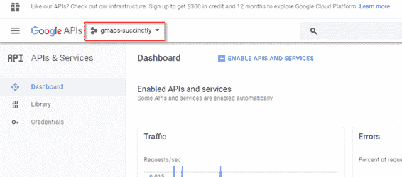
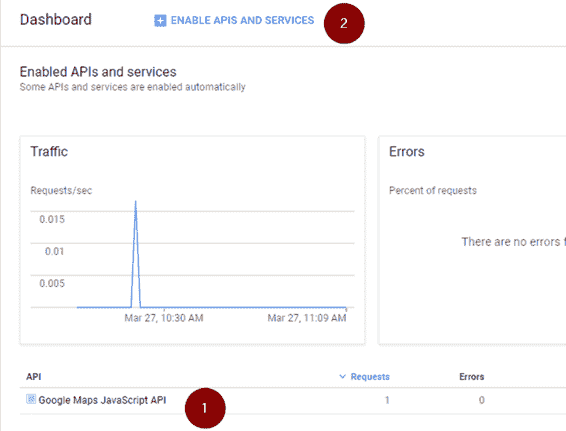
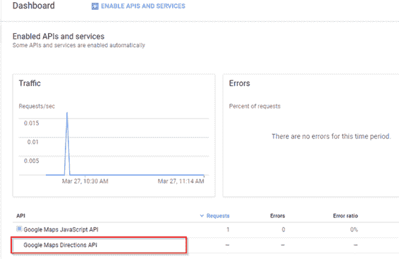
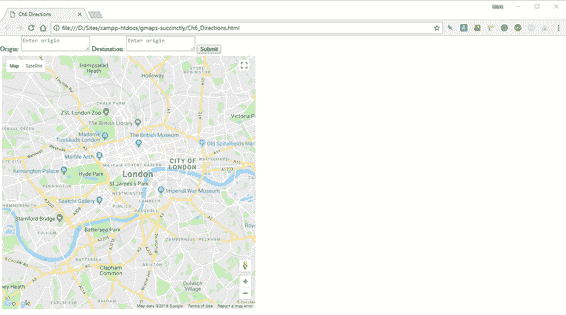
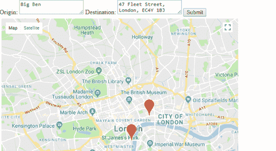
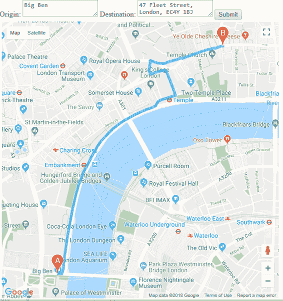
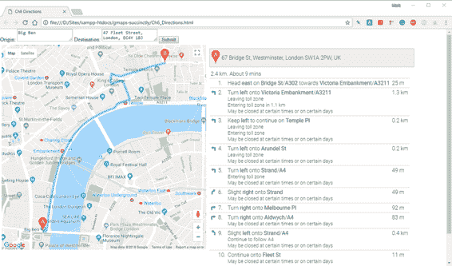
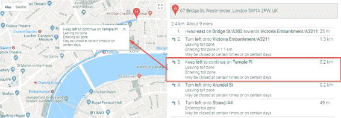

# 第七章问路

既然你知道如何让你的用户在地图上找到地方，为什么不告诉他们如何到达那里呢？当然，你可以给他们你惊人的新零售店/毛茸茸的会议/局域网聚会的地址，并把他们送到谷歌地图的主网站上获取方向，但是完全从你自己的网页上做这件事，并能够定制体验，会有多酷？您可以通过谷歌地图方向应用编程接口完成所有这些和更多的工作。

## 启用方向应用编程接口

要在谷歌地图 JavaScript 应用程序中使用方向，您必须在开发人员控制台中启用方向应用程序接口。方向应用编程接口与其他谷歌应用编程接口一起工作，而不仅仅是谷歌地图 JavaScript 应用编程接口。要启用方向应用编程接口，请完成以下步骤:

1.  参观[http://console.developers.google.com](http://console.developers.google.com)。
2.  使用您的谷歌帐户用户名和密码登录。
3.  在**仪表盘**上，检查您在第 2 章中创建的项目是否被选中。如果没有，请从下拉列表中选择它。



图 46

4.  在仪表板底部显示的应用编程接口列表中，检查方向应用编程接口是否已启用。如果它已经出现在列表中(截图中的第 1 项)，那么您可以忽略剩余的步骤。否则，点击**启用 API 和服务**(截图第 2 项)。



图 47

5.  在 API 库中，搜索**谷歌地图方向 API** 。单击出现的谷歌地图方向应用编程接口图块，然后单击**启用**。当方向应用编程接口摘要页面出现时，单击仪表板链接，并验证方向应用编程接口是否包含在页面底部的已启用应用编程接口列表中。



您现在可以使用该应用编程接口了。

|  | 注意:和谷歌地图 JavaScript API 一样，Directions API 只对有限数量的请求是免费的(见这里的使用限制)。 |

## 创建页面

在本例中，我们将创建一个应用程序，允许用户选择出发地和目的地，对两者进行地理编码，然后在地图上显示路线，并在页面的另一个面板中依次显示行驶方向。在构建这个应用程序的过程中，我们将把我们在前面几章中学习的一些技术结合在一起。

|  | 注意:严格来说，如果您的地理编码要求像本例中一样简单，则在计算路线之前不必对地址进行地理编码。DirectionsService 类可以为您做到这一点。然而，自己进行地理编码确实为 JavaScript 的异步特性上了一课，这让你成为了一名更好的谷歌地图应用编程接口开发人员！ |

我们将从第 5 章“同步两张地图”示例中使用的双窗格布局开始。复制 Ch5_Sync2Maps.html 文件，创建一个名为 Ch7_Directions.html 的新文件。

对页面进行以下更改:

1.  将`map1`和`map2`T2 s 分别重命名为`map`和`directions`。将`class`属性更改为`panel`，并对 CSS 进行必要的调整。
2.  去除两个`<div>`的红色背景
3.  从第一个`<script>`块中删除所有地图初始化和其他代码，并用 Ch2_FirstMap.html 中的`initMap()`函数替换。
4.  将`map`变量的声明移到`initMap()`外的`<script>`块的顶部。
5.  将引导网址中的回调函数从`initMaps`改为`initMap`。
6.  在页面顶部添加两个名为`txtOrigin`和`txtDestination`的文本框，以及一个名为`btnSubmit`的按钮。

作为进行这些更改的结果，初始代码类似于代码清单 42 所示。

代码清单 42:初始页面布局

```
  <!DOCTYPE html>
  <html>

  <head>
      <title>Ch6 Directions</title>
      <meta name="viewport" content="initial-scale=1.0">
      <meta charset="utf-8">
      <style>
          .panel {
              width: 600px;
              height: 600px;
              margin: 5px;
              float: left;
          }

          html,
          body {
              height: 100%;
              margin: 0;
              padding: 0;
          }
      </style>
  </head>

  <body>
      <div>
          <label for="txtOrigin">Origin: </label>
          <textarea id="txtOrigin" placeholder="Enter origin"></textarea>
          <label for="txtDestination">Destination: </label>
          <textarea id="txtDestination" placeholder="Enter origin"></textarea>
          <button id="btnSubmit">Submit</button>
      </div>
      <div id="map" class="panel"></div>
      <div id="directions" class="panel"></div>
      <script>
          var map;

          function initMap() {
              var mapOptions = {
                  center: new google.maps.LatLng(51.503, -0.135),
                  zoom: 12
              };
              map = new google.maps.Map(document.getElementById('map'),
                                                                 mapOptions);
          }       
      </script>
      <!-- Reference the API -->
      <script src="https://maps.googleapis.com/maps/api/js?key=YOUR
  API KEY&callback=initMap" async
          defer></script>
  </body>

  </html>

```

当您在浏览器中打开页面时，它应该如图 46 所示。



图 48:初始页面布局

## 对起点和终点进行地理编码

接下来我们需要做的是对用户提供的始发地和目的地地址进行地理编码。从我们在第六章的探索中，我们知道如何做到这一点，但在这种情况下会增加复杂性。

在开始计算两个地址之间的路由之前，我们需要确保这两个地址都经过了正确的地理编码，但是由于 JavaScript 的异步特性，我们不能只做如下事情:

```
geocoder.geocode({address:
startAddress, function(results, status) {
origin = results[0];
}
geocoder.geocode({address:
startAddress, function(results, status) {
   destination =
results [0];
}
getDirections(origin,
destination);

```

问题是 JavaScript 不会等第一次调用`Geocoder.geocode()`再进行第二次，也不会等第二次调用`Geocoder.geocode()`再调用`getDirections()`。事实上，很有可能在`origin`或`destination`变量赋值之前调用`getDirections()`，因此会失败。

我们需要的是在我们尝试计算路线之前，确保两个地址都成功地进行了地理编码。值得庆幸的是，JavaScript 的最新版本包括*承诺*，这种构造非常适合这样的场景。

我所见过的最好(也是最简单)的承诺定义是这样的:

*承诺是一个可能在未来某个时间产生单一价值的对象:要么是一个已解决的价值，要么是一个未解决的原因。*

当被调用时，`Promise`对象尝试某种操作，如果成功，调用`resolve()`返回结果。如果失败，它会调用`reject()`，通常会将错误传递回调用方。

代码清单 43 展示了一个非常简单的承诺实现。这个检查用户的信用等级，如果是好的，就批准贷款。如果没有，它会返回一个错误，告诉您贷款申请失败。代码清单 44 展示了我们如何使用这个承诺。

代码清单 43:承诺实现示例

```
  var goodCreditRating = false;

  // Promise
  var applyForALoan = new Promise(
      function (resolve, reject) {
          if
  (goodCreditRating) {
              var loan = {
                  amount: 10000,
                  term: 60
              };
              resolve(loan); // fulfilled
          } else {
              var reason = new Error('Credit Rating Poor');
              reject(reason); // reject
          }

      }
  );

```

代码清单 44:消费承诺

```
  var begTheBank = function () {
      applyForALoan
          .then(function (fulfilled) {
              // loan application successful, here are the details.
              console.log(fulfilled);
              // outputs { amount: 10000, term: 60 }
          })
          .catch(function (error) {
              // loan application failed, for this reason.
              console.log(error.message);
              // outputs 'Credit Rating Poor'.
          });
  };

  begTheBank();

```

因为这是一个承诺，如果`Promise`成功(解析)，我们可以在实现`Promise`对象的函数上调用`.then()`来执行一些代码，如果失败(拒绝)，我们可以调用`.catch()`。这是对 JavaScript 承诺的一个非常简短的概述，也是我们让我们的应用程序工作所需要的。然而，承诺远不止于此，我建议您访问 [Mozilla 开发者网络](https://developer.mozilla.org/en-US/)，了解更多关于它们的信息。

让我们创建一个名为`geocodeAddresses()`的函数来实现一个承诺。该函数对提供的起始和结束地址进行地理编码，并为每个地址创建一个标记。您可以在代码清单 45 中看到这方面的代码。请注意，`Promise`对象在第二个地址被成功地理编码之前不会调用`resolve()`。

代码清单 45:地理编码地址()函数

```
  function geocodeAddresses(origin, destination) {
      return new Promise(function (resolve, reject) {

          var geocodedOrigin, geocodedDestination;

          geocoder.geocode({ 'address': origin },
              function (results, status) {
                  if
  (status == google.maps.GeocoderStatus.OK) {
                      geocodedOrigin = results[0];
                      originMarker = new google.maps.Marker({
                          position:
  geocodedOrigin.geometry.location,
                          label: "O",
                          map: map
                      })
                  } else {
                      reject(Error("Could not geocode
  origin"));
                  }
              });
          geocoder.geocode({ 'address': destination },
              function (results, status) {
                  if
  (status == google.maps.GeocoderStatus.OK) {
                      geocodedDestination = results[0];
                      destinationMarker = new google.maps.Marker({
                          position:
  geocodedDestination.geometry.location,
                          label: "D",
                          map: map
                      })
                      resolve({
                          origin: geocodedOrigin,
                          destination: geocodedDestination,
                      });
                  } else {
                      reject(Error("Could not geocode
  destination"));
                  }
              });
      });
  }

```

现在，我们的提交按钮需要一个事件处理程序来消耗这个`Promise`，并且只有当`Promise`解析时，也就是说，当始发地和目的地地址都被成功地理编码时，才继续计算路线。参见代码清单 46。

代码清单 46:调用地理编码地址()

```
  var map, geocoder;
  var origin, destination;
  var originMarker, destinationMarker;

  function initMap() {
      var mapOptions = {
          center: new google.maps.LatLng(51.503, -0.135),
          zoom: 12
      };
      map = new google.maps.Map(document.getElementById('map'), mapOptions);

      geocoder = new google.maps.Geocoder();

      origin = document.getElementById("txtOrigin").value;
      destination = document.getElementById("txtDestination").value

      google.maps.event.addDomListener(
          document.getElementById("btnSubmit"), "click", function () {
              geocodeAddresses(origin, destination).then(function (result) {
                  findDirections(result);
              }, function (err) {
                  alert(err);
              });
          });
  }

  function findDirections(journey) {
      // calculate the route.
  }

  function geocodeAddresses(origin, destination) {
      // ...
  }

```

在浏览器中打开页面，如果一切正常，应该可以输入出发地(试试**大本钟**)和目的地(试试**伦敦舰队街 47 号，EC4Y 1BJ** )的数值，看到地图上出现标记，如图 47 所示。



图 49:成功地理编码源地址和目的地址。

现在，您知道了自己的来源和方向，就可以开始使用方向应用编程接口了。

### 计算路线

路线计算由`google.maps.DirectionsService`类执行。还有一个名为`google.maps.DirectionsRenderer`的类，可以很容易地显示结果路线。为每个类创建全局变量，并在`initMap()`函数中实例化两个类的对象，如代码清单 47 所示。此外，删除在`geocodeAddresses()`功能中创建标记的代码，因为`DirectionsRenderer`将为您提供标记，并提供代表路线的折线。

代码清单 47:创建方向服务和方向渲染器类

```
  var map, geocoder;
  var origin, destination;
  var originMarker, destinationMarker;
  var directionsService, directionsRenderer;

  function initMap() {
      var mapOptions = {
          center: new google.maps.LatLng(51.503, -0.135),
          zoom: 12
      };
      map = new google.maps.Map(document.getElementById('map'), mapOptions);

      geocoder = new google.maps.Geocoder();

      directionsService = new google.maps.DirectionsService;
      directionsRenderer = new google.maps.DirectionsRenderer;
      directionsRenderer.setMap(map);

      origin = document.getElementById("txtOrigin").value;
      destination = document.getElementById("txtDestination").value

      google.maps.event.addDomListener(
          document.getElementById("btnSubmit"), "click", function () {
              geocodeAddresses(origin, destination).then(function (result) {
                  findDirections(result);
              }, function (err) {
                  alert(err);
              });
          });
  }

```

要计算路线，需要调用`google.maps.DirectionsService`上的`route()`方法，传入一个`google.maps.DirectionsRequest`对象和一个回调函数。

`DirectionsRequest`对象支持多种不同的属性，让你配置路线计算，包括驾驶选项；避开渡船、高速公路和收费公路的能力；以及经由航路点的路线。不过，我们在这里保持简单，只需指定`origin`、`destination`和`travelMode`属性。完成`findDirections()`功能，如代码清单 48 *所示。*

代码清单 findDirections()函数

```
  function findDirections(journey) {
      directionsService.route({
          origin: journey.origin.geometry.location,
          destination: journey.destination.geometry.location,
          travelMode: 'DRIVING'
      }, function (response, status) {
          if
  (status === 'OK') {
              directionsRenderer.setDirections(response);
          } else {
              window.alert('Directions request failed: ' + status);
          }
      });
  };

```

在浏览器中打开页面，输入**大本钟**为原点，**伦敦舰队街 47 号，EC4Y** 1BJ 为目的地。确认路线如图 48 所示。



图 50:计算出的路线。

到目前为止，一切都很好——但是我们页面的一半还没有投入使用。让我们使用`DirectionsRenderer`在`<div>`中显示转弯方向，我们专门为此创建了一个`directions`的`id`。

在`initMap()`功能中，调用`DirectionsRenderer`对象上的`setPanel()`，并传入您想要显示方向的`<div>`。在`findDirections()`功能中对`DirectionsRenderer.setDirections()`的调用也将显示行驶方向。参见代码清单 49。

代码清单 49:为逐圈方向指定

```
  function initMap() {
      var mapOptions = {
          center: new google.maps.LatLng(51.503, -0.135),
          zoom: 12
      };
      map = new google.maps.Map(document.getElementById('map'), mapOptions);

      geocoder = new google.maps.Geocoder();

      directionsService = new google.maps.DirectionsService;
      directionsRenderer = new google.maps.DirectionsRenderer;
      directionsRenderer.setMap(map);
      directionsRenderer.setPanel(document.getElementById("directions"));

      origin = document.getElementById("txtOrigin").value;
      destination = document.getElementById("txtDestination").value

      google.maps.event.addDomListener(
          document.getElementById("btnSubmit"), "click", function () {
              geocodeAddresses(origin, destination).then(function (result) {
                  findDirections(result);
              }, function (err) {
                  alert(err);
              });
          });
  }

```

再次运行应用程序，以**大本钟**为起点，**伦敦舰队街 47 号，EC4Y 1BJ** 为终点。这一次，方向应该出现在页面的右侧，如图 49 所示。



图 51:带行驶方向的路线。

`DirectionsRenderer`对象为你处理了这一切。使用`DirectionsRenderer`的另一个好处是路线现在是交互式的。单击右侧窗格中的一个阶段，路线的相应部分就被标注在地图上，如图 50 所示。



图 52:显示路由段。