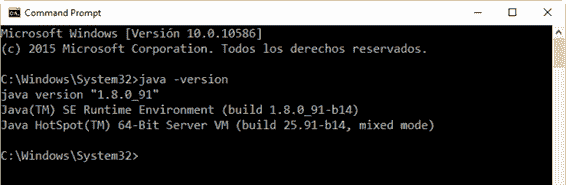
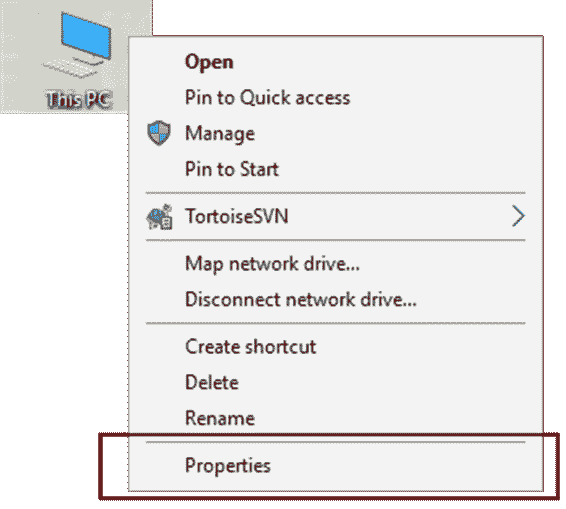
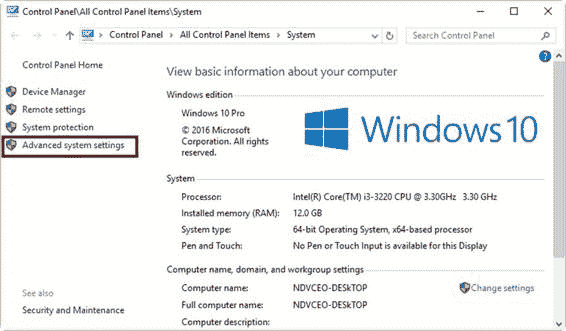
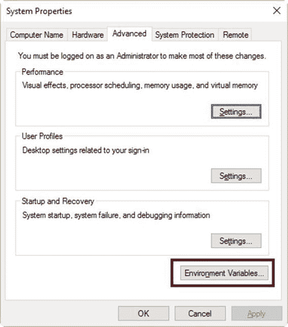
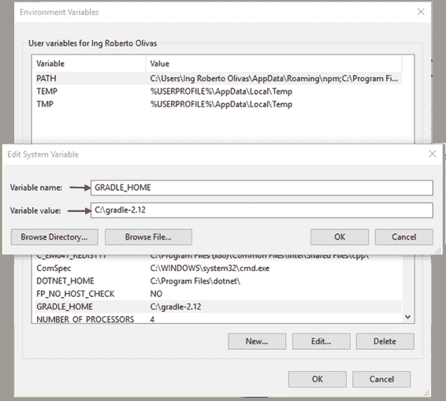
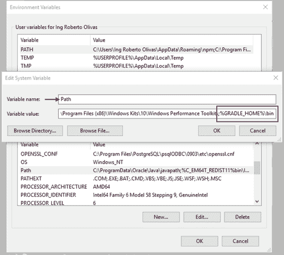
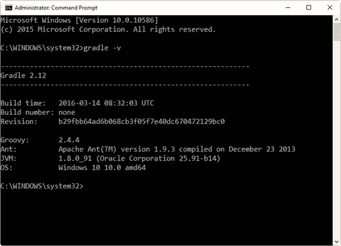

# 二、安装 Gradle

## 开始

### 先决条件

Gradle 要求首先安装 Java JDK 或 JRE 版本 7 或更高版本。不需要安装 Groovy，因为 Gradle 自带 Groovy 库；Gradle 会忽略任何现有的 Groovy 安装。

Java JDK 可以在这里下载。

要检查 Java 版本，打开一个命令窗口，发出`java -version`命令。



图 1:检查 Java 版本

### 获得 Gradle

任何 Gradle 分布都可以在这里[下载。每个发行版都打包成一个. zip 文件。完整的发行版包含:](http://www.gradle.org/downloads)

*   格雷尔二进制文件
*   HTML 和 PDF 格式的用户指南。
*   DSL 参考指南。
*   API 文档，包括 Javadoc 和 Groovydoc。
*   大量的示例，以及一些完整且更复杂的构建，可以作为定制构建的起点。
*   二进制来源，仅供参考。如果用户想要构建 Gradle，则需要下载源代码分发(或者从源代码存储库中签出源代码)。[gradel 网站](http://www.gradle.org/development)包含更多细节。

## 渐变安装流程

要在 Windows 上安装 Gradle，请按照下列步骤操作:

1.  将从 Gradle 网站下载的分发文件解压到一个文件夹位置。建议将这个文件夹位置命名为类似**的 C:\gradle-2.12** 。
2.  右键单击**我的电脑**(或 Windows 10 中的**这台电脑**)图标，选择**属性**。



图 2:这台电脑的上下文菜单

3.  从系统控制面板窗口左侧显示的链接中选择**高级系统设置**。



图 3:系统控制面板窗口

4.  点击位于高级系统设置对话框底部的**环境变量**按钮。



图 4:高级系统设置对话框

5.  在**环境变量**对话框中，点击系统变量下的**新建**。命名环境变量 **GRADLE_HOME** ，给它取值 **C:\gradle-2.12** 。



图 5:添加 GRADLE_HOME 环境变量

6.  在同一对话框中，选择位于系统变量下的**路径**变量。点击**编辑**并添加文字**；变量值列表末尾的%GRADLE_HOME%\bin** 。



图 6:编辑路径环境变量

|  | 注意:此处显示的截图来自 Windows 10，因此它们可能看起来与您的屏幕不同，具体取决于您的 Windows 版本。 |

## 测试安装

安装过程结束后，您需要检查 Gradle 是否安装正确。Gradle 通过`gradle`命令运行，因此打开一个命令提示窗口并键入以下内容:

代码清单 1

```groovy
  gradle -v

```

该命令的输出显示了 Gradle 版本和本地环境配置(Groovy、JVM 版本、OS 版本等)。).显示的 Gradle 版本应该与用户下载的发行版相匹配。就本书而言，Gradle 版本是 2.12。



图 7:渐变-v 命令的输出

## 章节总结

必须在安装 Gradle 之前安装 Java JDK 或 JRE 版本 7 或更高版本。没有必要安装 Groovy，因为 Gradle 自带 Groovy 库。

Gradle 可以从[这里](http://www.gradle.org/downloads "荚≘뿵깝ĸむ祋")下载为. zip 文件。该文件包含在计算机中安装 Gradle 所需的所有文件，包括 Gradle 二进制文件、参考文档和示例。

要安装 Gradle，用户需要解压缩发行版。将文件压缩到文件夹中。建议将这个文件夹命名为类似 **C:\ gradle-2.12** 的东西。之后，必须添加名为 **GRADLE_HOME** 的环境变量，并将其值设置为安装文件夹的名称( **C:\ gradle-2.12** )。此外，必须编辑路径环境变量，以将 **GRADLE_HOME** 变量的名称添加到其值中，格式为:**；%GRADLE_HOME%。**

要测试安装过程，用户需要从命令提示窗口执行命令`gradle -v`。该命令的输出显示了 Gradle 版本和本地环境配置。显示的 Gradle 版本应该与用户下载的发行版相匹配。等你看完这本电子书的时候，现在的 Gradle 版本会不一样，所以你可以用 2.12 版本或者更新的版本。