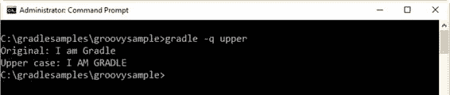
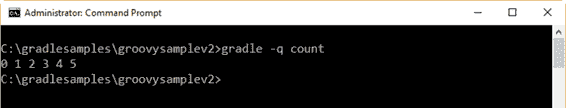
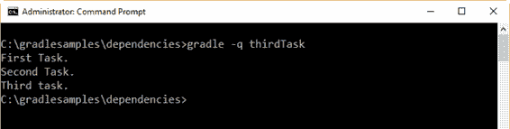
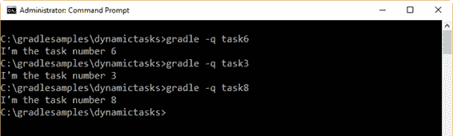
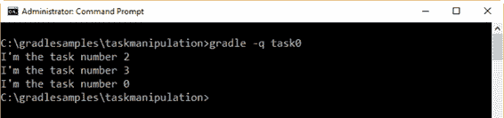

# 第四章构建脚本基础

## 项目和任务:Gradle 中的两个基本概念

Gradle 中的一切都基于两个基本概念:项目和任务。项目是任务的集合，每个任务执行一些操作，如编译类或运行单元测试。从现在开始，包含本书中讨论的 Gradle 示例的每个文件夹都将被视为一个项目容器。

## 项目生命周期

一个 **build.gradle** 文件与一个项目有一对一的关系。每次执行构建脚本时，Gradle 都会为每个将在构建初始化时参与构建的项目组装一个`project`对象。`project`物体按以下顺序组装:

1.  为构建创建一个`Settings`实例。
2.  针对`Settings`对象评估`settings.gradle`脚本(如果有)以进行配置。
3.  使用配置的`Settings`对象创建`Project`实例的层次结构。
4.  最后，通过针对项目执行其 **build.gradle** 文件(如果存在)来评估每个项目。生成项目中的每个项目都在其子项目之前进行评估。

一旦这些步骤完成，构建就结束了，两个名为**的文件夹构建了**和**。梯度**可以作为过程的结果找到。

## 任务

任务被认为是构建活动的基本单元，代表构建所执行的基本工作。这可能是编译一些类，创建一个. jar 文件，生成 Javadoc，或者将一些档案存储到存储库中。

本章将重点介绍单项目构建的简单任务定义。多项目构建和更多关于任务的内容将在后面的章节中讨论。

## 构建脚本是 Groovy 代码

如第 1 章所述，Gradle 的构建脚本基于 Groovy 代码，因此用户可以充分利用 Groovy 的强大功能。下面的示例演示了这一点。

代码清单 16

```
  task
  upper << {

  String someString = 'I am Gradle'

  println "Original: " + someString 

  println "Upper case: " + someString.toUpperCase()
  }

```

要执行这段代码，在**C:\ grade samples**中创建一个名为 **groovysample** 的文件夹。之后，在 **groovysample** 文件夹中保存一个带有代码的 **build.gradle** 文件。下图显示了构建的结果。



图 11: Groovy 示例输出

另一个示例可以使用 Groovy `times`循环。 **build.gradle** 文件的代码应该创建在名为**的文件夹中。**

代码清单 17

```
  task
  count << {

  6.times { print "$it " }

  println ''
  }

```

下图显示了上一次构建的结果。



图 12: Groovy 时间循环示例输出

## 任务相关性

Gradle 允许您声明依赖于其他任务的任务。这可以通过在任务名称后使用`dependsOn:`子句，并将依赖任务的名称放在声明之后来实现。下面的构建脚本显示了一个示例。

代码清单 18

```
  task
  firstTask << {

  println 'First Task.'
  }

  task
  secondTask(dependsOn: 'firstTask') << {

  println 'Second Task.'
  }

  task
  thirdTask(dependsOn: 'secondTask') << {

  println 'Third task.'
  }

```

这个例子展示了三个任务，其中两个(`secondTask`和`thirdTask`)声明了依赖关系。这种情况下，`secondTask`先靠`firstTask`先执行，`thirdTask`先靠`secondTask`先执行。下图显示了构建的输出。



图 13:依赖示例输出

依赖项的声明没有严格的顺序。因此，以下代码的工作方式与本节开头讨论的示例相同。

代码清单 19

```
  task
  secondTask(dependsOn: 'firstTask') << {

  println 'Second Task.'
  }

  task
  thirdTask(dependsOn: 'secondTask') << {

  println 'Third task.'
  }

  task
  firstTask << {

  println 'First Task.'
  }

```

## 动态任务

由于 Groovy 的强大，Gradle 允许您动态创建任务。下面的代码使用 Groovy `times`循环语句说明了这一功能。

代码清单 20

```
  9.times
  { index ->

  task "task$index" << {

  println "I'm the task number $index"

  }
  }

```

在这种情况下，`times`语句创建了一个循环，该循环将迭代九次。每次执行循环迭代时，索引变量都会接收迭代号(介于 0 和 8 之间)，并在循环内创建一个任务。每个任务的名称由单词`task`和存储在索引变量中的数字组成。所以，创建的任务有`task0`、`task1`、`task2`等等。

现在，这个构建脚本可以通过调用一个 0 到 8 之间的数字(例如，`task6`)来执行。下图显示了构建脚本的输出。



图 14:动态任务示例输出

## 任务操纵

任务可以在创建后使用应用编程接口访问。以下示例在运行时向任务添加依赖关系。

代码清单 21

```
  5.times
  { index ->

  task "task$index" << {

  println "I'm the task number $index"

  }
  }
  task0.dependsOn
  task2, task3

```

在前面的例子中，`task0`的依赖关系是使用`dependsOn`方法声明的，该方法是`task0`对象的一部分。任务对象将在本书后面讨论。这段代码的输出应该如下所示:



图 15:任务操作示例输出

## 章节总结

Gradle 中的一切都基于两个基本概念:项目和任务。项目是任务的集合，每个任务执行一些操作，例如编译类或运行单元测试。

一个 **build.gradle** 文件与一个项目是一对一的关系。每次执行构建脚本时，Gradle 都会在构建中组装一个`Project`对象

任务被认为是构建活动的基本单元，代表构建所执行的基本工作。这可能是编译一些类，创建一个. jar 文件，生成 Javadoc，或者将一些档案存储到存储库中。

Gradle 允许您声明依赖于其他任务的任务。这可以通过在任务名称后使用`dependsOn:`子句，并将依赖任务的名称放在声明之后来实现。依赖项的声明没有严格的顺序。

由于 Gradle 的构建脚本基于 Groovy 代码，您可以充分利用 Groovy 语言的强大功能。这对于动态创建任务或在运行时操作任务非常有用。