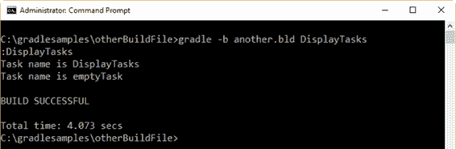
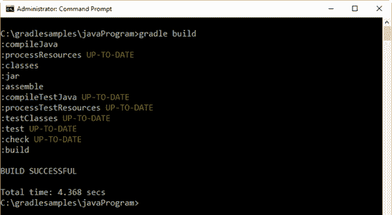
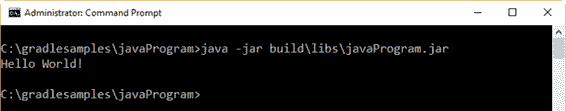

# 六、关于编写构建脚本的更多东西

## 使用不同的构建脚本文件

到目前为止，每个构建脚本都保存在一个名为 **build.gradle** 的文件中，每次执行 gradle 时，默认情况下都会查找这个文件。

但是，构建脚本可以保存在不同名称的文件中。对于下一个例子，**另一个. bld** 将被用作文件名。

代码清单 50

```groovy
  task
  emptyTask << {
  }

  task
  DisplayTasks << {

  tasks.each {

  println "Task name is ${it.name}"
     }
  }

```

本示例显示生成中存在的所有任务的名称。以下命令用于执行构建脚本。

代码清单 51

```groovy
  gradle
  -b another.bld DisplayTasks

```



图 28:显示任务示例的输出

## 指定默认任务

构建脚本允许您指定一系列默认任务，如果命令行中没有指定任务(当用户调用`gradle`时)，将执行这些任务。

代码清单 52

```groovy
  defaultTasks
  'DisplayTasks'

  task
  emptyTask << {
  }

  task
  DisplayTasks << {

  tasks.each {

  println "Task name is ${it.name}"
     }
  }

```

前面的代码将`DisplayTasks`定义为默认任务。假设构建脚本保存在 **build.gradle** 文件中，如果用户按照以下方式执行`gradle`，将自动执行`DisplayTasks`，因为命令行中没有指定任务名称。

代码清单 53

```groovy
  gradle

```

另一种可以使用的方式`defaultTasks`显示在下面的示例中。

代码清单 54

```groovy
  /* A
  list of default tasks is supplied. Each task will be executed
     in
  order, starting from the left.
  */
  defaultTasks
  'SetEnvironment','extractDatabase','ResetEnvironment'

  task
  SetEnvironment << {

  println 'Setting operating system environment'
  }

  task
  extractMetadata << {

  println 'Extacting metadata.'
  }

  task
  extractData << {

  println 'Extracting database data.'
  }

  task
  extractDatabase << {  

  }

  task
  ResetEnvironment << {

  println 'Resetting operating system environment'
  }

  /*
  Code that will be executed after extractDatabase action ends. */
  extractDatabase
  << {

  println 'Zipping extracted data to backupdata.zip'
  }

  extractDatabase
  << {

  println 'Closing database connection.'
  }

  /*
  extractDatabase will depend on extractData and extractMetadata.       */
  /*
  extractData is executed first, then extractMetadata will be executed. */
  extractDatabase
  {

  dependsOn extractData, extractMetadata
  }

  /*
  Code that will be executed before extractData task action begins is set up at
  configuration phase. */
  extractData
  {

  doFirst {

  println 'Connecting to the database.'
      }

  doFirst {

  println 'Setting up database connection.'
      }
  }

```

前面的代码将三个任务设置为默认任务。假设代码保存在名为**的文件中，那么当使用以下命令调用这个构建脚本时，将依次执行`SetEnvironment`、`extractDatabase`和`ResetEnvironment`。**

代码清单 55

```groovy
  gradle
  -b severaldefaults.gradle

```

## 进行 Java 快速入门

在这一点上，已经声明 Gradle 是一个通用的构建工具。它可以构建您想要在构建脚本中实现的任何东西。但是，简单地说，除非您在构建脚本中添加代码，否则 Gradle 不会构建任何东西。

本节旨在解释如何构建一个 Java 程序。大多数 Java 项目都非常相似:需要编译一组 Java 源文件，需要运行一些单元测试，并且需要创建一个. jar 文件来包含所有的类。为每个项目编写所有这些步骤可能会很烦人，并且会导致时间的巨大浪费。幸运的是，Gradle 通过使用 Java 插件解决了这个问题。插件是 Gradle 的扩展，它以某种方式配置项目，通常是通过添加一些预配置的任务，这些任务一起做一些有用的事情。

要使用 Java 插件，必须使用一系列约定。这意味着插件为项目的许多方面定义了默认值。这些方面包括 Java 源、生产资源和测试位置。在项目中遵循这些约定，您不需要在构建脚本中做很多工作就可以获得有用的构建。

### 创建一个 Java 项目

要在 Gradle 中创建一个 Java 项目，需要在构建脚本中应用 Java 插件，如下例所示。

代码清单 56

```groovy
  apply
  plugin: 'java'

```

定义一个 Java 项目只需要前面的代码。该 Java 插件将应用于该项目，并将向其中添加许多任务。

#### 项目布局

Java 插件是基于约定的。本章的“Java 快速入门”一节对此进行了解释。因此，Java 插件假定了项目的某种布局。下表显示了该布局。

表 2: Java 插件项目布局

| 目录 | 意义 |
| --- | --- |
| src\main\java | 生产 Java 源代码 |
| 主资源 | 生产资源 |
| src\test\java | 测试 Java 源代码 |
| src \测试\资源 | 测试资源 |

当构建脚本结束执行时，构建的结果保存在名为 **build** 的目录中。该目录包含以下相关子目录。

表 3:构建目录子目录

| 子目录 | 意义 |
| --- | --- |
| 构建\类 | 包含已编译的。类文件。 |
| 构建\libs | 包含。罐子或者。由构建创建的 war 文件。 |

#### 创建 Java 代码

为了构建 Java 项目，应该在 **src\main\java** 目录中创建一个名为 **hello** 的子目录。接下来，文件**HelloWorld.java**应该用下面的代码保存。

代码清单 57

```groovy
  package
  hello;

  public
  class HelloWorld {

  public static void main(String[] args){

  System.out.println("Hello World!");   

  }    
  }

```

现在，下面的命令将构建 Java 可执行文件。jar 文件在 **build\libs** 目录下。该文件将保存为 **javaProgram.jar** 。

代码清单 58

```groovy
  gradle
  build

```



图 29:构建任务输出

使用以下命令运行 **javaProgram.jar** ...

代码清单 59

```groovy
  java -jar
  build\libs\javaProgram.jar

```

...将显示以下输出。

代码清单 60

```groovy
  no
  main manifest attribute, in build\libs\javaProgram.jar

```

此问题是未配置的主类的结果。jar 文件。这个`main`类可以在一个称为清单文件的文件中配置。

#### 配置. jar 文件的主类

Java 插件向项目中公开了一个`jar`任务。每个`jar`对象都有一个`manifest`属性，它是`manifest`类的一个实例。对这些类的详细解释不在本书的讨论范围内，但是在本节中，我们将解释如何使用`jar`对象为配置`main`类。jar 可执行文件。

`manifest`实例的`attributes`方法用于设置应用程序的入口点。这可以通过使用包含键值对的映射来实现，这些属性将被添加到清单文件中。`Main-Class`属性的值必须用类名设置，类名是程序的入口点。对 **build.gradle** 文件的更改应该如下所示。

代码清单 61

```groovy
  apply
  plugin: 'java'

  jar {

  manifest {

   attributes 'Main-Class': 'hello.HelloWorld'
      }
  }

```

全新的。jar 文件将通过发出`gradle build`命令来创建。之后，用户可以运行。jar 文件。程序显示的输出如下图所示。



图 30:运行中的 Hello World 类

### 了解 Java 项目的任务

Java 插件为构建增加了许多任务。就本书而言，最相关的任务如下:

*   `assemble`任务:编译应用程序的源代码并打包成. jar 文件，但不运行单元测试。
*   `build`任务:执行项目的完整构建，包括代码编译、单元测试和。jar 文件打包。
*   `clean`任务:删除构建目录。
*   `compileJava`任务:编译项目的源代码。
*   `check`任务:编译并测试代码。

在不阅读构建脚本的情况下获得项目概述是一个好主意。为此，应使用以下命令。

代码清单 62

```groovy
  gradle
  tasks

```

输出应该如下所示。

代码清单 63

```groovy
  :tasks

  ------------------------------------------------------------
  All
  tasks runnable from root project
  ------------------------------------------------------------

  Build
  tasks
  -----------
  assemble
  - Assembles the outputs of this project.
  build
  - Assembles and tests this project.
  buildDependents
  - Assembles and tests this project and all projects that depend on it.
  buildNeeded
  - Assembles and tests this project and all projects it depends on.
  classes
  - Assembles main classes.
  clean
  - Deletes the build directory.
  jar -
  Assembles a jar archive containing the main classes.
  testClasses
  - Assembles test classes.

  Build
  Setup tasks
  -----------------
  init
  - Initializes a new Gradle build. [incubating]
  wrapper
  - Generates Gradle wrapper files. [incubating]

  Documentation
  tasks
  -------------------
  javadoc
  - Generates Javadoc API documentation for the main source code.

  Help
  tasks
  ----------
  buildEnvironment
  - Displays all buildscript dependencies declared in root project
  'javaProgramv2'.
  components
  - Displays the components produced by root project 'javaProgramv2'.
  [incubating]
  dependencies
  - Displays all dependencies declared in root project 'javaProgramv2'.
  dependencyInsight
  - Displays the insight into a specific dependency in root project
  'javaProgramv2'.
  help
  - Displays a help message.
  model
  - Displays the configuration model of root project 'javaProgramv2'.
  [incubating]
  projects
  - Displays the sub-projects of root project 'javaProgramv2'.
  properties
  - Displays the properties of root project 'javaProgramv2'.
  tasks
  - Displays the tasks runnable from root project 'javaProgramv2'.

  Verification
  tasks
  ------------------
  check
  - Runs all checks.
  test
  - Runs the unit tests.

  Rules
  -----
  Pattern:
  clean<TaskName>: Cleans the output files of a task.
  Pattern:
  build<ConfigurationName>: Assembles the artifacts of a configuration.
  Pattern:
  upload<ConfigurationName>: Assembles and uploads the artifacts
  belonging to a configuration.

  To
  see all tasks and more detail, run gradle tasks --all

  To
  see more detail about a task, run gradle help --task <task>

  BUILD
  SUCCESSFUL

  Total
  time: 4.637 secs

```

前面的示例显示了可运行任务的完整列表及其描述。从上一个例子的底部可以看出，如果用户需要关于特定任务的更详细的信息，应该使用下面的命令。

代码清单 64

```groovy
  gradle
  help --task <task>

  Where
  <task> is the name of the task to be inquired.

```

以下示例获取关于`clean`任务的详细信息。

代码清单 65

```groovy
  gradle
  help --task clean

```

输出应该如下所示。

代码清单 66

```groovy
  :help
  Detailed
  task information for clean

  Path

  :clean

  Type

  Delete (org.gradle.api.tasks.Delete)

  Description

  Deletes the build directory.

  Group

  build

  BUILD
  SUCCESSFUL

  Total
  time: 3.652 secs

```

通过`help`命令为任务显示的属性如下:

*   `Path`:任务的路径(如第 5 章“默认任务的属性”一节所述)。
*   `Type`:任务类型(如第五章“关于任务类型”一节所述)。
*   `Description`:关于任务目的的简要说明。
*   `Group`:任务所属组的名称(在本例中，`clean`任务是`build`组的一部分)。

### 为项目设置包版本信息

有时，用户可能需要在构建中包含包版本信息。这可以通过使用`jar`对象的`manifest`方法设置一组标题来实现。下表总结了这些标题。

表 4:清单文件中的头

| 页眉 | 定义 |
| --- | --- |
| `Name` | 包的名称。 |
| `Specification-Title` | 描述包的标题。 |
| `Specification-Version` | 包的版本号。 |
| `Specification-Vendor` | 供应商名称。 |
| `Implementation-Title` | 正在打包的实现的标题。 |
| `Implementation-Version` | 实现的内部版本号。 |
| `Implementation-Vendor` | 实现的供应商。 |

构建脚本应该如下例所示。

代码清单 67

```groovy
  apply
  plugin: 'java'

  jar {

  manifest {

  attributes 'Specification-Title'    : 'Gradle Succinctly'

  attributes 'Specification-Version'  : '1.0'

    attributes 'Specification-Vendor'   : 'Syncfusion, Inc.'

  attributes 'Implementation-Title'   : 'hello.HelloWorld'

  attributes 'Implementation-Version' : 'build02'

  attributes 'Implementation-Vendor'  : 'Syncfusion, Inc.'

  attributes 'Main-Class': 'hello.HelloWorld'
      }
  }

```

那个。jar 文件可以像往常一样构建。但是现在，清单文件将包含构建过程之后的所有包信息。

### 创建待发货的配送

以下构建脚本将从`jar`程序创建一个. zip 文件，以便发送给任何客户。

代码清单 68

```groovy
  /*
  Declaring default tasks will ensure the zip packaging after the build. */
  defaultTasks
  'build', 'packageDistribution'

  /*
  Execute gradle with no tasks, in order to succeed. */

  apply
  plugin: 'java'

  /*
  Adding the needed attributes to the manifest file. */
  jar {

  manifest {

  attributes 'Specification-Title'    : 'Gradle Succinctly'

  attributes 'Specification-Version'  : '1.0'

  attributes 'Specification-Vendor'   : 'Syncfusion, Inc.'

  attributes 'Implementation-Title'   : 'hello.HelloWorld'

  attributes 'Implementation-Version' : 'build02'

  attributes 'Implementation-Vendor'  : 'Syncfusion, Inc.'

  attributes 'Main-Class': 'hello.HelloWorld'
      }
  }

  /*
  This task will be executed after the build task

  and will create a zip file with the contents of

  the build\libs directory (the jar program). 

  The zip file will be saved in the 

  build\distributions folder, and will be named

  distPackage-1.0.zip                              */
  task
  packageDistribution(type: Zip){

  from 'build\\libs'

  baseName = 'distPackage'

  version = '1.0'
  }

```

这个构建脚本利用了`defaultTasks`和`Zip`任务类型，以. zip 压缩格式创建一个分发包。

如代码中所解释的，发出没有任务名称的`gradle`命令将自动执行`defaultTasks`语句声明的所有任务。在这种情况下，`build`任务将首先执行，构建过程结束后，`packageDistribution`任务将创建。带有`jar`程序的 zip 文件。

## 章节总结

本章已经超越了用于保存构建脚本的简单的 **build.gradle** 文件。构建脚本文件可以使用不同的名称，您可以通过命令行中的`-b`选项来查找该命名文件。

您也可以在不指定任务名称的情况下执行生成脚本。在这种情况下，使用`defaultTasks`语句允许您指示将执行引用的逗号分隔列表中给出的哪些任务。执行的顺序总是从左到右。

为了演示 Gradle 可以构建一些东西，本章的其余部分描述了如何使用 java 插件创建一个 Java 项目。插件是 Gradle 的扩展，它以某种方式配置项目，通常是通过添加一些预配置的任务。

Java 插件是基于约定的。这意味着插件为项目的许多方面定义了默认值，包括 Java 源、生产资源和测试位置。

对于创建 Java 项目，特定的目录布局必须存在于项目的目录中，因为 Gradle 在构建过程中会搜索该布局。构建的所有结果都保存在**构建**目录中。如果该目录不存在，则会自动创建。

就本书而言，Java 插件添加的相关任务有:`assemble`、`clean`、`compileJava`、`build`和`check`。汇编编译 Java 代码并创建。jar 可执行文件，但不运行单元测试；`clean`删除构建目录；`compileJava`只编译 Java 代码；`build`为项目执行完整的构建，包括代码编译、单元测试和。罐子包装；`check`编译测试代码。

用 Gradle 构建的 Java 项目需要围绕哪个类将成为应用程序的入口点进行配置。Java 插件向项目中公开了一个`jar`任务，它具有`manifest`属性。该属性的`attributes`方法用于通过为该方法的`Main-class`属性分配将作为入口点的类的名称来设置入口点。

`manifest`属性也可以用来添加一个 jar 包的详细信息。可以保存该信息的属性有`Name`、`Specification-Title`、`Specification-Title`、`Specification-Version`、`Specification-Vendor`、`Implementation-Title`、`Implementation-Version`、`Implementation-Vendor`。

构建脚本可以利用`defaultTasks`语句和`Zip`任务类型，以便在构建过程之后自动创建. zip 分发包。