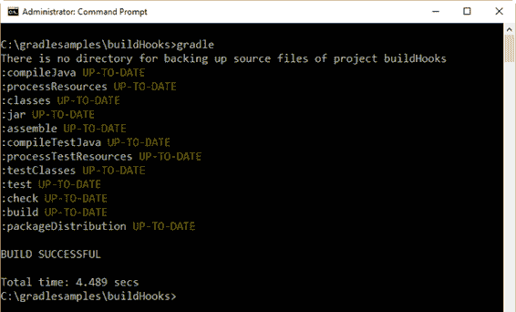
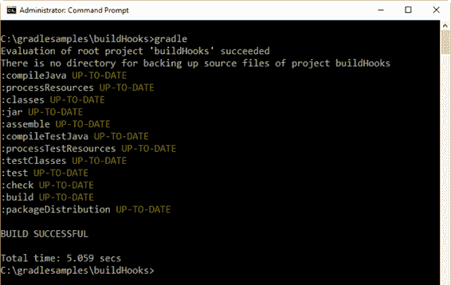
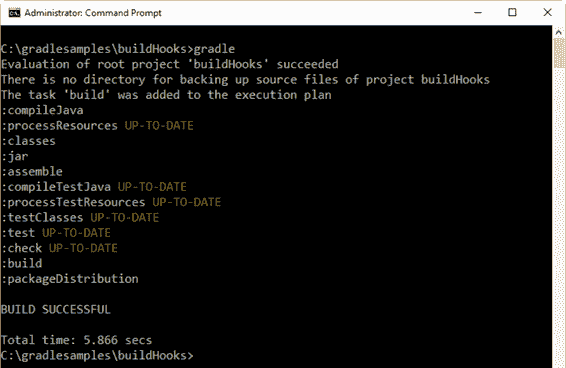
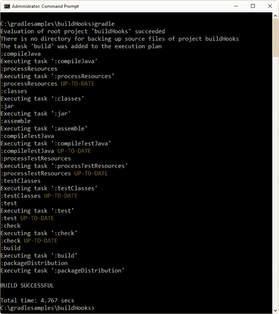
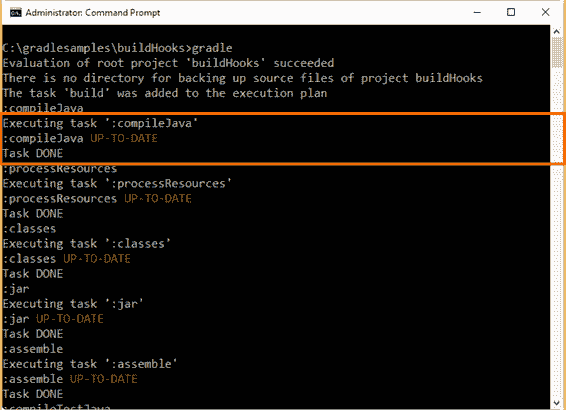
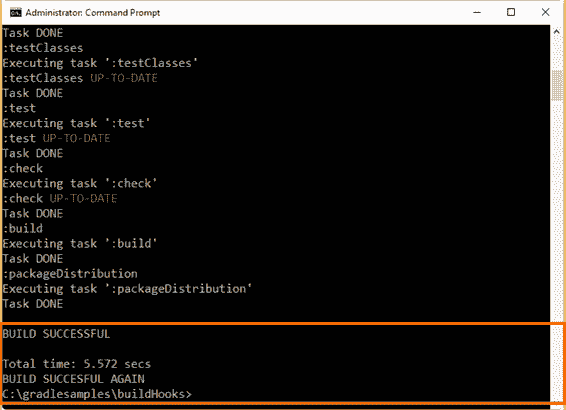

# 第七章打造钩子

## 概述

Gradle 是一个高度可定制的工具，用于创建定制的构建软件。它公开了一组丰富的 API，用于在构建中引入新的功能。但是定制构建的能力并没有随着插件而结束。

Gradle 还提供了通过挂钩在构建的配置和执行期间发生的各种事件来修改构建的执行的能力。这些挂钩可以在添加任务、创建项目以及配置序列中的其他时间运行。

## 回顾梯度生命周期

正如第 4 章中所解释的，Gradle 构建总是以完全相同的顺序经历三个阶段:初始化、配置和执行。

初始化阶段让 Gradle 启动并定位它必须处理的所有构建文件。在这个阶段，Gradle 还会确定构建是单项目构建还是多项目构建。对于单项目构建，Gradle 识别单个构建文件并继续到下一阶段。对于多项目构建，Gradle 定位处理所需的所有构建文件，并继续到下一阶段。

下一个阶段是配置。在这个阶段，Gradle 将每个构建文件作为 Groovy 脚本执行，但这不是构建操作的实际执行。这是任务对象的有向无环图(DAG)的创建(在第 5 章的“配置块”一节中解释)。在构建这个图的过程中，可以运行许多钩子。

最后一个阶段是执行。在这个阶段，Gradle 通过查看 DAG 来确定必须执行的任务。然后，Gradle 按照依赖顺序执行它们(如第 4 章的“任务依赖”一节所述)。所有的构建活动都发生在执行阶段，就像在配置阶段一样，一些钩子可以在执行期间运行。

## 这个“建议”术语

一种管理企业 Java 软件复杂性的范例在 21 世纪初变得稍微流行起来。这种范式被称为面向方面编程。AOP 着重指出程序通常包含需要用代码增强的单个功能单元，其目的与所讨论的单元没有直接关系。例如，写入数据库的方法可能必须首先设置数据库上下文，然后提交事务。

AOP 开发了一个特定的词汇表，一些 Java 框架随着 AOP 的实现而出现。原方法前后运行的代码被赋予了一个特殊的名称:一个*建议*动作。建议代码依赖于这个原则:在原始方法之前运行的代码块与之后运行的代码没有相关性，即使执行序列有相关性。

在解释构建钩子时，将使用“建议”特殊名称。

## 对项目评估的建议

一个单独的 Gradle 构建文件用它需要的所有设置和任务来建立一个项目，以便在执行阶段为 Gradle 提供有用的工作。这种设置发生在配置阶段，并且可以在评估项目时收到关于项目的通知。

`project.afterEvaluate`方法用于在项目评估后执行代码。

代码清单 69

```
  /*
  Declaring default tasks will ensure the zip packaging after the build. */
  defaultTasks
  'build', 'packageDistribution'

  /*
  Execute gradle with no tasks, in order to succeed. */

  apply
  plugin: 'java'

  /*
  Adding the needed attributes to the manifest file. */
  jar {

  manifest {

  attributes 'Specification-Title'    : 'Gradle Succinctly'

  attributes 'Specification-Version'  : '1.0'

  attributes 'Specification-Vendor'   : 'Syncfusion, Inc.'

  attributes 'Implementation-Title'   : 'hello.HelloWorld'

  attributes 'Implementation-Version' : 'build02'

  attributes 'Implementation-Vendor'  : 'Syncfusion, Inc.'

  attributes 'Main-Class': 'hello.HelloWorld'
      }
  }

  /*
  This task will be executed after the build task

  and will create a zip file with the contents of

  the build\libs directory (the jar program). 

  The zip file will be saved in the 

  build\distributions folder, and will be named

  distPackage-1.0.zip                              */
  task
  packageDistribution(type: Zip){

  from 'build\\libs'

  baseName = 'distPackage'

  version = '1.0'
  }

  /* In
  this case, and for testing purposes only, a directory

  named backuprepo is searched within the project's

  tree structure. If such directory doesn't exist, a message
     is
  displayed.                                              */   
  afterEvaluate
  {

  if (!file('backuprepo').isDirectory())
      {

  println "There is no directory for backing up source files of project 
  {project.name}"
      }
  }

```

在前面的例子中，`project.afterEvaluate`方法在项目的目录树结构中搜索给定的目录。在这种情况下，当找不到该目录时，会显示一条简单的消息。如代码所示，有一个`project`对象，在项目评估时可用。在这种情况下，代码使用`project`对象在警告消息中显示项目的名称。当然，这并不重要，但是这个建议可以有很多应用，比如设置一个合适的目录结构供执行阶段使用，向项目经理发送通知等。



图 31:项目后评估示例输出

项目评估的结果可以通过咨询的方式来查询。为此，我们使用`gradle`对象的`afterProject`方法。这个方法需要两个参数来处理这个项目。第一个是`project`对象本身，第二个参数是项目评估后的状态。

代码清单 70

```
  /*
  Declaring default tasks will ensure the zip packaging after the build. */
  defaultTasks
  'build', 'packageDistribution'

  /*
  Execute gradle with no tasks, in order to succeed. */

  apply
  plugin: 'java'

  /*
  Adding the needed attributes to the manifest file. */
  jar {

  manifest {

  attributes 'Specification-Title'    : 'Gradle Succinctly'

  attributes 'Specification-Version'  : '1.0'

  attributes 'Specification-Vendor'   : 'Syncfusion, Inc.'

  attributes 'Implementation-Title'   : 'hello.HelloWorld'

  attributes 'Implementation-Version' : 'build02'

  attributes 'Implementation-Vendor'  : 'Syncfusion, Inc.'

  attributes 'Main-Class': 'hello.HelloWorld'
      }
  }

  /*
  This task will be executed after the build task

  and will create a zip file with the contents of

  the build\libs directory (the jar program). 

  The zip file will be saved in the 

  build\distributions folder, and will be named

  distPackage-1.0.zip                              */
  task
  packageDistribution(type: Zip){

  from 'build\\libs'

  baseName = 'distPackage'

  version = '1.0'
  }

  /* In
  this case, and for testing purposes only, a directory

  named backuprepo is searched within the project's

  tree structure. If such directory doesn't exist, a message
     is
  displayed.                                              */   
  afterEvaluate
  {

  if (!file('backuprepo').isDirectory())
      {

  println "There is no directory for backing up source files of project
  ${project.name}"
      }
  }

  /*
  The result of the evaluation for a project can be

  trapped with this code.                           */
  gradle.afterProject
  {project, projectState -> 
     if
  (projectState.failure) {

  println "Evaluation of $project FAILED"
     }

  else
     {

  println "Evaluation of $project succeeded"
     }
  }

```

上一个代码的输出如下图所示。



图 32: AfterProject 示例输出

注意图 32 中`afterProject`和`afterEvaluate`通知的触发顺序。在这种情况下，`afterProject`发生在项目评估刚刚结束之后。然后，执行与该建议相关联的代码。一旦该执行结束，则执行`afterEvaluate`建议代码。

## 任务创建建议

当任务被添加到项目中时，可以附加通知来通知您。这对于在任务可用于构建之前设置一些所需的值非常有用。为此，使用了`tasks`对象的`whenTaskAdded`方法。该方法接收`task`对象作为参数。

代码清单 71

```
  /*
  Declaring default tasks will ensure the zip packaging after the build. */
  defaultTasks
  'packageDistribution'

  /*
  Execute gradle with no tasks, in order to succeed. */

  apply
  plugin: 'java'

  /*
  Adding the needed attributes to the manifest file. */
  jar {

  manifest {

  attributes 'Specification-Title'    : 'Gradle Succinctly'

  attributes 'Specification-Version'  : '1.0'

  attributes 'Specification-Vendor'   : 'Syncfusion, Inc.'

  attributes 'Implementation-Title'   : 'hello.HelloWorld'

  attributes 'Implementation-Version' : 'build02'

  attributes 'Implementation-Vendor'  : 'Syncfusion, Inc.'

  attributes 'Main-Class': 'hello.HelloWorld'
      }
  }

  /*
  This task will be executed after the build task

  and will create a zip file with the contents of

  the build\libs directory (the jar program). 

  The zip file will be saved in the 

  build\distributions folder, and will be named

  distPackage-1.0.zip                              */
  task
  packageDistribution(type: Zip){

  from 'build\\libs'

  baseName = 'distPackage'

  version = '1.0'
  }

  packageDistribution
  {

  dependsOn 'build'
  }

  /* In
  this case, and for testing purposes only, a directory

  named backuprepo is searched within the project's

  tree structure. If such directory doesn't exist, a message
     is
  displayed.                                              */   
  afterEvaluate
  {

  if (!file('backuprepo').isDirectory())
      {

  println "There is no directory for backing up source files of project
  ${project.name}"
      }
  }

  /*
  The result of the evaluation for a project can be

  trapped with this code.                           */
  gradle.afterProject
  {project, projectState -> 
     if
  (projectState.failure) {

  println "Evaluation of $project FAILED"
     }

  else
     {

  println "Evaluation of $project succeeded"
     }
    }

  tasks.whenTaskAdded
  { task ->

  println "The task '${task.name}' was added to the execution plan"
  }

```

前面的代码只是在任务添加到项目中时显示任务的名称。下图显示了此构建的输出。



图 33:任务创建建议示例输出

根据图 33 所示的输出，任务创建发生在项目评估之后。

## 执行阶段的建议

### 任务执行

建议可以在任何任务执行前后使用。这可以通过使用`gradle.taskGraph`对象的`beforeTask`和`afterTask`方法来完成。

`beforeTask`方法接收`task`对象作为参数，因此用户可以在任务执行之前查询任务的任何属性，以便进行行为更改。

代码清单 72

```
  /*
  Declaring default tasks will ensure the zip packaging after the build. */
  defaultTasks
  'packageDistribution'

  /*
  Execute gradle with no tasks, in order to succeed. */

  apply
  plugin: 'java'

  /*
  Adding the needed attributes to the manifest file. */
  jar {

  manifest {

  attributes 'Specification-Title'    : 'Gradle Succinctly'

  attributes 'Specification-Version'  : '1.0'

  attributes 'Specification-Vendor'   : 'Syncfusion, Inc.'

  attributes 'Implementation-Title'   : 'hello.HelloWorld'

  attributes 'Implementation-Version' : 'build02'

  attributes 'Implementation-Vendor'  : 'Syncfusion, Inc.'

  attributes 'Main-Class': 'hello.HelloWorld'
      }
  }

  /*
  This task will be executed after the build task

  and will create a zip file with the contents of

  the build\libs directory (the jar program). 

  The zip file will be saved in the 

  build\distributions folder, and will be named

  distPackage-1.0.zip                              */
  task
  packageDistribution(type: Zip){

  from 'build\\libs'

  baseName = 'distPackage'

  version = '1.0'
  }

  packageDistribution
  {

  dependsOn 'build'
  }

  /* In
  this case, and for testing purposes only, a directory
     named
  backuprepo is searched within the project's

  tree structure. If such directory doesn't exist, a message
     is
  displayed.                                              */   
  afterEvaluate
  {

  if (!file('backuprepo').isDirectory())
      {

  println "There is no directory for backing up source files of project
  ${project.name}"
      }
  }

  /*
  Every time a task is added its name is displayed */
  tasks.whenTaskAdded
  { task ->

  println "The task '${task.name}' was added to the execution plan"
  }

  /* The
  result of the evaluation for a project can be

  trapped with this code.                           */
  gradle.afterProject
  {project, projectState -> 
     if
  (projectState.failure) {

  println "Evaluation of $project FAILED"
     }

  else
     {

  println "Evaluation of $project succeeded"
     }
    }

  /*
  Every task name is displayed before task's execution begins */
  gradle.taskGraph.beforeTask
  {Task task ->

  println "Executing $task"
    }

```

在开始执行之前，前面的代码添加了`beforeTask`方法来显示每个任务名称。



图 34:由 beforeTask 方法生成的输出

`afterTask`方法可以用来知道任务执行完成时的状态。该方法接收任务对象和`TaskState`作为参数。下面的代码片段显示了它的实现。

代码清单 73

```
  /*
  The state for every task is displayed just after its execution. */
  gradle.taskGraph.afterTask
  {Task task, TaskState state ->

  if (state.failure) {

  println 'Task FAILED'

  }

  else

  {

  println 'Task DONE'

  }
  }

```



图 35:添加 afterTask 后的构建输出

|  | 注意:无论任务是成功完成还是因异常而失败，都会执行 task 方法。 |

### 建造完成

有时，用户可能想知道构建何时完成，以及它是成功结束还是出错。这对于编写一种跟踪所有构建执行的日志非常有用。

`gradle`对象的方法`buildFinished`用于捕获构建完成通知。下面的代码片段显示了实现。

代码清单 74

```
  /* If
  the build fails, the reason why it fails is displayed. */
  gradle.buildFinished
  {buildResult ->

  if (buildResult.failure != null)
      {

  println "Build has failed - ${buildResult.failure}"
      }

  else
      {

  println "BUILD SUCCESFUL AGAIN"
      }
  }

```



图 36:构建完成方法的输出

## 章节总结

Gradle 是一个高度可定制的工具，用于创建定制的构建软件。它公开了一组丰富的 API，用于在构建中引入新的功能。Gradle 还提供了通过挂钩在构建的配置和执行期间发生的各种事件来修改构建的执行的能力。

正如第 4 章中所解释的，Gradle 构建总是以完全相同的顺序经历三个阶段:初始化、配置和执行。初始化阶段让 Gradle 启动并定位它必须处理的所有构建文件。配置阶段以 Groovy 脚本的形式执行每个构建文件，并创建任务对象的有向无环图(DAG)。执行阶段通过查看 DAG 来确定必须执行的任务，然后按照依赖顺序执行它们。所有构建活动都发生在执行阶段。

在 2000 年代早期，一种被称为面向方面编程(AOP)的范例变得稍微流行起来。AOP 的重点是声明程序的单个功能单元需要用与所讨论的单元不直接相关的代码来增强。AOP 开发了一个特定的词汇表，一些 Java 框架随着 AOP 的实现而出现。原方法前后运行的代码被赋予了一个特殊的名称:*建议*。

用户可以在配置阶段为项目评估和任务创建创建建议。在执行阶段，可以创建任务执行和`buildFinished`的建议。

`project.afterEvaluate`方法用于在项目评估后执行代码。同样，可以使用`gradle`对象的`afterProject`方法找到项目评估的结果。此方法接收两个参数:项目对象本身和项目评估后的状态。

当使用`tasks`对象的`whenTaskAdded`方法将任务添加到项目中时，可以附加通知来通知您。该方法接收`task`对象作为参数。

建议可以在任何任务执行前后使用。这可以通过使用`gradle.taskGraph`对象的`beforeTask`和`afterTask`方法来完成。`beforeTask`方法接收`task`对象作为参数。`afterTask`方法可以在任务执行刚刚结束时使用。该方法接收`task`对象和`TaskState`作为参数。

有时，用户可能想知道构建何时完成，以及它是成功结束还是出错。`gradle`对象的方法`buildFinished`用于此目的。