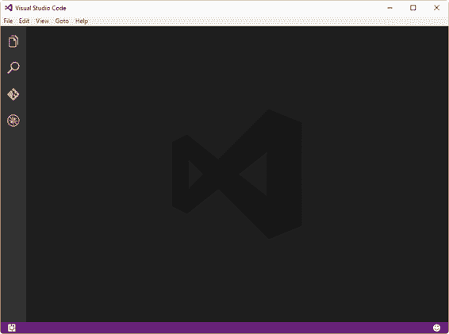
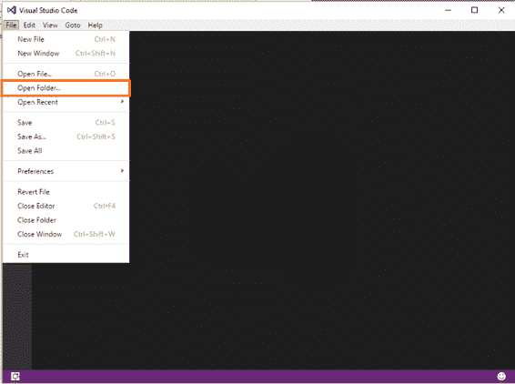
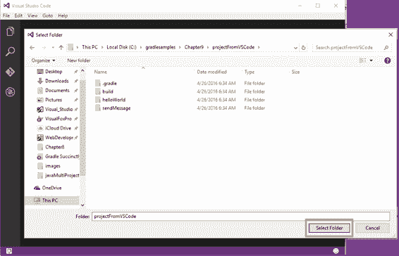
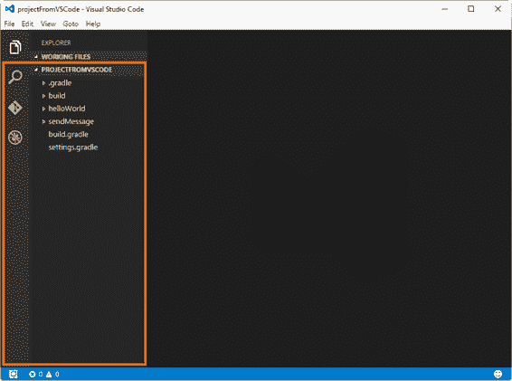
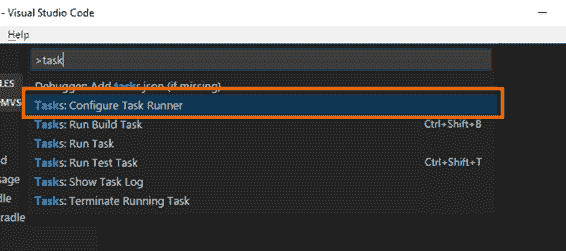
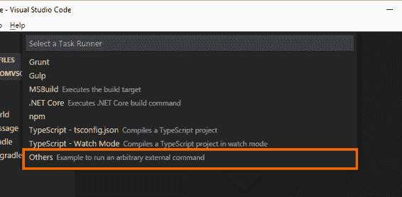
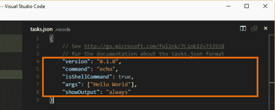
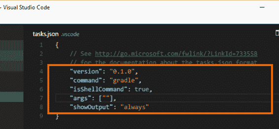
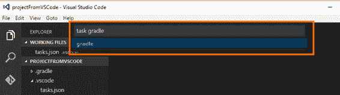
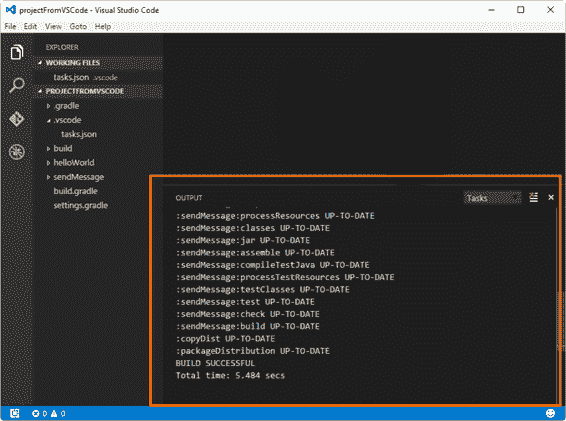

# 九、从 Visual Studio 代码运行 Gradle

这本书的所有代码示例都是使用 Visual Studio Code (VS Code)创建的，这是一个来自微软公司的免费开源代码编辑器。除了 Windows 平台，该编辑器还适用于 Linux 和 Mac OS X 平台。通过为几种编程语言安装扩展、添加调试器和连接到其他服务，它是可扩展和可定制的。

本章不会深入讨论 Visual Studio 代码，因为它不在本书的讨论范围内，但我将简要解释如何从 VS 代码中执行 Gradle 构建。

## 将 Gradle 项目加载到 VS 代码中

您应该做的第一件事是创建将在其中编辑构建脚本的项目目录。然后，启动 VS 代码。

图 47: VS 代码主窗口

现在，Gradle 项目的目录需要通过 VS Code 打开。为此，从**文件**菜单中选择**打开文件夹**选项。

图 48:打开文件夹选项

可以使用**选择文件夹**对话框并点击**选择文件夹**来定位目录。该操作将把项目结构带到 VS 代码主窗口。

图 49:选择文件夹对话框

假设已经编辑了构建脚本和项目的结构，VS Code 主窗口将在左侧显示项目的所有内容。下图显示了加载了项目的 VS 代码。

图 50:加载了构建项目的 VS 代码

要编辑项目目录中包含的任何文件，只需单击所需文件的名称，其内容将显示在项目导航栏右侧的编辑器窗口中。

## 在 VS 代码中添加任务运行 Gradle

为了从 VS 代码运行 Gradle，需要使用 **tasks.json** 文件设置一个任务。按下**Ctrl**+**Shift**+**P**组合键调出搜索栏。然后，输入**任务**，从列表中选择**配置任务运行器**。

图 51:配置任务运行器选项

选择“配置任务运行器”选项后，VS 代码将要求配置任务运行器的类型。为渐变选择**其他**选项。

图 52:“其他”任务运行器类型

一个名为**的文件夹。将在项目目录中创建 vscode** ，编辑器窗口中将显示一个名为 **tasks.json** 的文件。该文件包含五个参数，需要修改这些参数才能运行 Gradle。

图 53:任务. json 文件

要使 Gradle 运行，需要编辑参数`command`和`args`。`command`参数的值需要更改为`gradle`，`args`(参数)参数可以是空字符串(如果构建脚本定义了默认任务)，也可以是将由构建脚本执行的任务的名称。

进行这些更改后，文件应该如下图所示。

图 54:更改后的 Tasks.json

现在，要运行 Gradle，关闭文件，然后按下 **Ctrl** + **P** 组合键调出动作栏。在动作栏中输入**任务等级**，按**进入**键。

图 55: VS 代码动作栏

几秒钟后，输出窗口将显示构建脚本的执行结果。

图 56:构建脚本执行的结果

## 章节总结

本章解释了如何使用 Visual Studio Code 中的 Gradle 执行构建脚本，这是微软公司提供的免费开源代码编辑器，适用于 Windows、Linux 和 Mac OS X 平台。

要从 VS Code 运行 Gradle，必须用 VS Code 打开项目的文件夹，并且需要在该目录中创建一个 **tasks.json** 文件。该文件是通过**配置任务运行器**选项创建的，通过键入**任务**可以在搜索栏中找到该选项。要显示该条，按下**Ctrl**+**Shift**+**P**组合键。

**tasks.json** 文件有两个参数需要修改:`command`和`args`。`command`参数必须设置为`gradle`，而`args`参数可以设置为空字符串(如果构建脚本定义了默认任务)，或者设置为将由 Gradle 执行的任务的名称。

要运行构建脚本，您需要保存并关闭 **tasks.json** 文件。然后，按下 **Ctrl** + **P** 组合键将调出动作栏。输入**任务Gradle**并按下**进入**键后，Gradle将运行。输出窗口将显示构建脚本的执行结果。