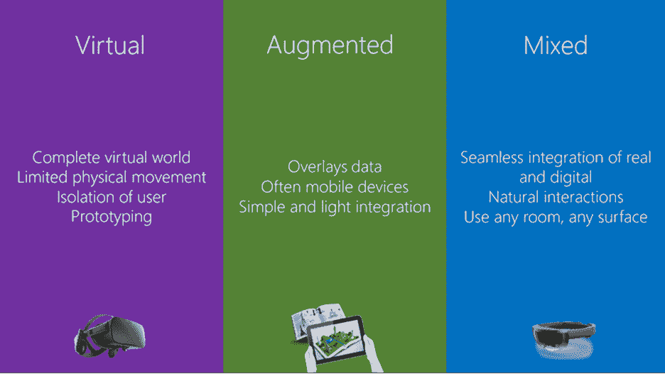
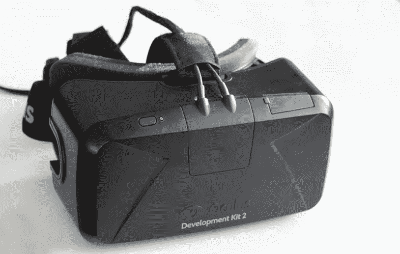
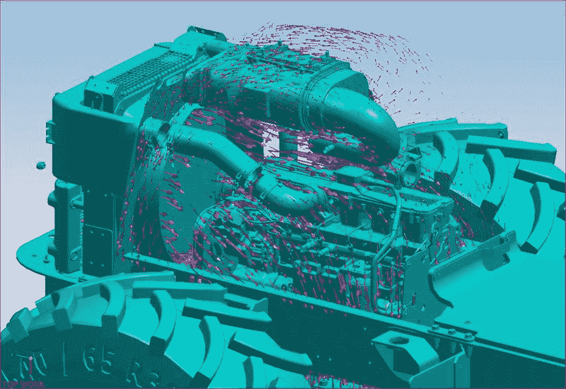
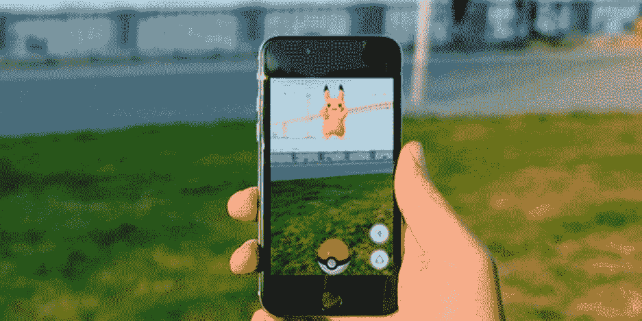
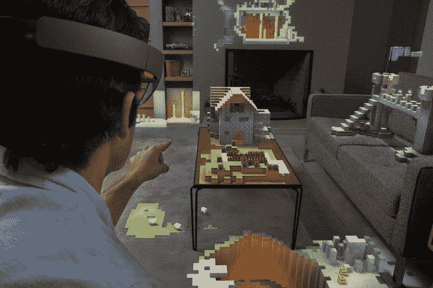
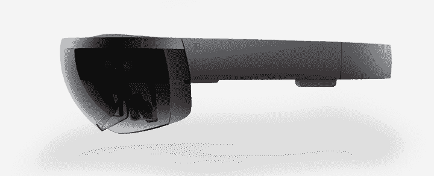

1993 年，我十几岁时第一次体验了虚拟现实。我记得很清楚，因为它彻底让我震惊了。那是《指环梦魇》游戏，太神奇了。今天看一下，那是一堆 8 位块，一些平台，还有一个你不得不戴的非常不舒服的耳机。不过，我不在乎。沉浸式计算的早期体验一直伴随着我，随着世界进入虚拟和增强现实的新时代。

自 1993 年以来，我们已经走过了漫长的道路，虚拟现实已经发展成许多形状和形式。我们现在有了增强现实(AR)设备，可以通过你的手机在你的物理世界中覆盖数据。VR 设备现在更容易获得，比如 Oculus Rift，还有一些设备既不适合也不适合这两个类别，比如微软的 HoloLens，它存在于混合现实(MR)中。为了描述这整个技术领域，不管什么样的现实，我创造了*数字现实*这个术语(虽然没有缩写)。

在讨论数字现实时，了解各种细分市场(如 VR、AR 和 MR)非常重要。不仅要知道潜在项目会落在哪个细分市场，还要用正确的想法瞄准正确的设备。例如，当一个 300 美元的设备(如智能手机)也能同样有效时，为什么要为一个很少有人使用的 3000 美元的设备创造一种体验呢？不仅要了解您所瞄准的开发平台，还要了解该平台的用户，以及同一细分市场中的其他平台，这对于创建这些用户将会购买的强大且沉浸式的体验至关重要。

考虑到这一点，让我们仔细研究每一个数字现实部分，以准确理解全息镜头应用程序的适用范围。如下图所示，数字现实有三个主要的定义领域:虚拟、增强和混合。

图 1:数字现实中的主要类别

大多数人都听说过虚拟现实这个术语，并把它与某种形式的游戏或噱头联系在一起。普通大众，以及某种程度上的 IT 专业人士，都非常把它视为“月味”，很少关注。事实是，VR 在 2016 年[【1】](HoloLens_Succinctly_0014.htm#_ftn1)是一个 10 亿美元的产业，预计到 2020 年将是一个 1500 亿美元的产业。[【2】](HoloLens_Succinctly_0014.htm#_ftn2)这是一个巨大的市场，可能性和机会只会越来越好，越来越精细。

|  | 注:第一次提到虚拟现实的概念来自科幻小说。斯坦利·g·温鲍姆 1935 年的短篇小说《皮格马利翁的眼镜》描述了一个基于护目镜的虚拟现实系统，全息记录了虚构的经历，包括嗅觉和触觉。 |

虚拟现实的定义特征是开发者为用户创造的一个完整的虚拟世界。现实的每一个组成部分都是虚拟的，用户被从他们所处的物理现实中移除。这使得体验令人难以置信地身临其境，因为开发人员控制着整个体验。这也意味着开发者必须非常注意所有的小细节。控制晕车可能是一个真正的问题。

图 2:[Ats Kurvet 出品的 Oculus Rift VR 耳机](https://commons.wikimedia.org/w/index.php?curid=35919898)(CC BY-SA 4.0)

虚拟现实的另一个限制是用户不能物理移动，因为他们的整个现实已经被取代。用户四处移动并撞到物体不是一个好的外观，所以虚拟现实体验中的移动通常是通过手持触发器来完成的。运动必须被模拟，这又导致了对晕动病的控制。如果你把动作做得太逼真，很可能你需要一个桶让用户呕吐。如果你让它变得不够现实，用户就不会购买你创造的世界。

虚拟现实的一个优势是场景的原型制作能力，这对于没有经验的用户来说要么很昂贵，要么很危险。主要的汽车制造公司已经使用虚拟现实很长时间来设计和设计他们的车辆，然后才生产一个物理螺母或螺栓。您还可以将用户放置在他们做梦也想不到的位置，例如拥有 9 万名观众的墨尔本板球场的中心。

VR 在这里停留，毫无疑问。这项技术改变了数字现实的面貌，从 90 年代初和我第一次使用它开始，它已经走过了漫长的道路。越来越多的设备被推向市场，体验变得更加精致和沉浸式。然而，由于阻挡物理世界的纯粹性质，虚拟现实体验的范围是有限的。尽管这些应用将打破界限，改变软件的观看方式，但虚拟现实并没有涵盖数字现实空间的方方面面。

图 3: [发动机气流模拟](https://en.wikipedia.org/w/index.php?curid=12057576)(UGS NX 5，CC BY-SA 3.0 截图)

尽管虚拟现实通常需要专用硬件，但增强现实大多数时候可以利用任何智能手机或平板电脑。它是一个物理的、真实世界环境的实时直接或间接视图，其元素通过计算机生成的感官输入(如声音、视频、图形或全球定位系统数据)得到增强。增强现实体验将数据叠加到物理体验上，从而增强它(或者至少，这是一个想法)。

因为现实是对现实世界的扩充，体验通常是通过更小的手持设备传递的。当你通过这个设备看时，最常见的是使用相机和屏幕，这种体验会改变你对现实世界的看法。这使得这项技术对大多数人来说非常容易获得，它被用于各种不同的想法，从栩栩如生的名片到在想象的地方透过真实的墙壁看到。

图 4: [增强现实游戏口袋妖怪 Go](https://www.flickr.com/photos/iphonedigital/28286906571) (CC BY-SA 2.0)

|  | 注:口袋妖怪 Go 是最成功和最受欢迎的增强现实体验之一。 |

一般来说，AR 体验需要一个触发点，这是启动体验的视觉线索。因为这个触发点依赖于特定的轮廓或图形，所以体验非常有限，不能只在任何地方工作。这并不是说它没有增强用户的世界，而是增强现实中有限的“视角”加上触发点带来了有时笨拙的体验。

## 现实

我们将经历的最后一个数字现实实际上介于前两者之间。它是最新的，在某种程度上是前两者的结合，也是本书的重点。混合现实(MR)是微软在推出 HoloLens 时发明的一个术语，它听起来就是这样的:你可以或多或少以自然的方式与数字和现实世界的对象进行交互。在某种程度上，混合现实是虚拟现实和增强现实的最佳选择，但它也更复杂。一方面，你可以在现实世界中放置任何你喜欢的全息图，但是你也必须在数字现实和物理现实中管理这个全息图。

表 1:数字现实比较

|  | *增强现实* | *混合现实* | *虚拟现实* |
| --- | --- | --- | --- |
| 真实世界增长 | ✔ | ✔ |  |
| *交互全息图* |  | ✔ |  |
| *虚拟世界体验* |  | ✔ | ✔ |
| *取代现实世界* |  |  | ✔ |

因为在你的物理空间中放置全息图并与之互动的未来主义内涵，设计和开发一个真正的混合现实体验有它自己的陷阱。人们很容易被设备和功能的“惊艳”所吸引，但这往往会导致一种缺乏寿命的体验，或者一种并非混合现实的体验。构建接管整个现实的应用程序通常最好是作为完整的虚拟现实应用程序来构建，而具有有限用例和简单“触发和事件”的应用程序可以用智能手机作为增强现实应用程序来完成。

当为混合现实设计时，全息图和物理世界之间必须有相互作用。例如，你可以让角色坐在你旁边的沙发上，让机器人通过实际的墙壁进入房间，或者创建全息图，其大小适合放置它们的任何物理空间。如果你把一个全息球放在桌子上，如果桌子移动，它应该会滚下来。

## 全息图

第一款商用混合现实设备是微软的全息镜头。这是一款制作多年的设备，它已经成功地突破了数字现实的界限，甚至在其原型状态下也是如此。全息透镜是一台完全独立的计算机，配有定制的硬件，例如全息处理单元(HPU)，负责计算与全息图相关的所有三维空间计算。与其他数字现实设备的主要区别和明显优势在于全息透镜不受束缚。运行混合现实体验不需要额外的计算设备，这意味着用户可以完全自由地在他们的环境中移动。这是非常重要的，因为设备知道它的周围环境和物理位置。

如果你放置一个全息图——无论它是在墙上、桌子上还是漂浮在半空中——它几乎永远留在那里，直到被移除。全息图持续与他们周围的真实世界相关，这是体验的一部分。你可以把一个平面的 2D 全息图，比如一个视频剪辑，放在墙上，走到下一个房间，当你回来的时候，它就在你离开的地方。这就是混合现实体验的全部内容:数字和物理现实的完全混合。

我们从微软看到的第一批演示包括:将 3D 版的《我的世界》放在与 2D 设备交互的物理空间中；一个第一人称射击游戏，机器人从你的墙出来，向你射击；人体的完整医学表现，让医学生了解骨骼、肌肉和神经系统；还有更多。全息透镜有如此多的应用，以至于开发者的想象力是唯一的界限。

图 5:[holo lens 上的《我的世界》](https://www.flickr.com/photos/microsoftsweden/15716942894)(微软瑞典—win 10-holo lens-《我的世界》，CC BY 2.0)

虽然硬件是最先进的，不像其他任何东西，我们不打算在这本书里深入研究硬件方面的东西。我们将从软件的角度关注如何创造混合现实体验。

图 6: [微软全息镜头](https://www.flickr.com/photos/microsoftsweden/16153490837)(微软瑞典—CC BY 2.0)

为了让全息透镜在物理表面上放置全息图并与现实世界互动，空间映射是关键。要了解它是如何工作的，请参阅第 3 章。

全息镜头的一个关键特性是它运行在 Windows 10 上。全息图和混合现实体验一样令人惊讶和具有未来感，设备运行最新的微软操作系统意味着设备也运行通用视窗平台(UWP)。所有的视窗 10 设备——从 Xbox 到 PC，再到全息镜头——都符合与开发者的合同，这就是 UWP。这有很大的优势，而且不仅仅是对开发者。

UWP 带来了一套通用的应用编程接口和工具来为 Windows 10 平台上的任何设备创建应用程序。正如我们将在下一章中看到的，工具是第一类的，您可以使用微软堆栈中的典型编程语言:C#。开发人员可以使用相同的方法为运行在 Windows 10 上的任何设备进行开发。当然，UWP 内部存在特定于平台的差异，但作为基础，平台之间有一个有保证的核心应用编程接口。

这个核心 API 层也是跨平台发布应用如此容易的原因。你必须根据每个平台来做这项工作，比如管理智能手机上的移动连接，解决物联网设备上缺乏物理屏幕的问题，以及在全息镜头上处理 3D。特别是对于全息镜头，您还可以发布 2D 应用程序，当使用时，这些应用程序将在 3D 空间中显示为平面应用程序。

虽然这本书主要是为开发人员编写的，但我们不要忘记，我们最终是为用户编写软件。UWP 也是用户的一大优势。如果开发人员设置了服务，他们可以轻松地跨设备使用相同的配置文件，用户也可以为任何受支持的设备下载相同的应用程序。如果他们买了一次，他们可以在任何地方下载。

总的来说，用户并不关心某样东西在技术上是如何工作的，但他们确实欣赏方便和易用。UWP 可以在运行 Windows 10 的任何微软设备上创建无缝体验，用户只需在每台设备上登录一次即可完成所有设置。当然，这也适用于全息镜头应用。

对于企业来说，投资回报得到了极大的提高——主要是因为代码的重用，也因为对多个平台和外形使用相同的工具而易于开发。甚至用户界面也是自适应的，并且在大多数情况下可以是一个单一的代码库，它可以工作并且符合可用的屏幕空间和特定于平台的特性。

业务用例也不是本书的重点，但它是决定构建 UWP 应用程序的重要部分，无论它们是用于 HoloLens 还是另一个 Windows 10 设备。即使是运行在 Windows 10 上的现有应用程序，也可以通过很少的工作移植到 HoloLens，企业也可以在 UWP 平台上以很少的投资获利。