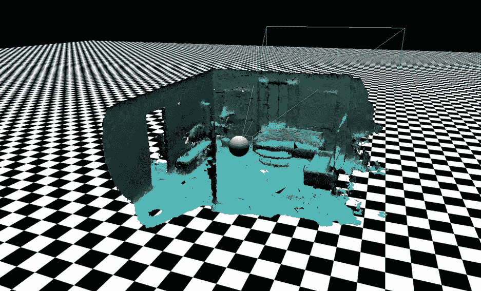
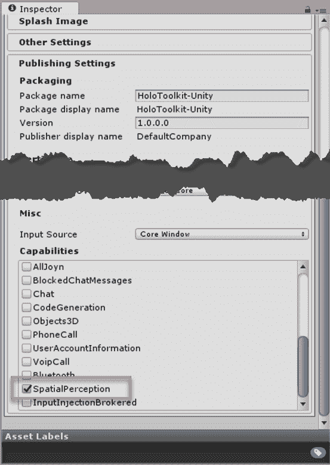
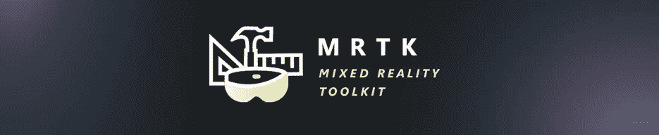
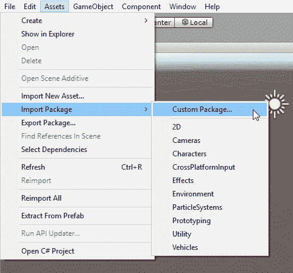
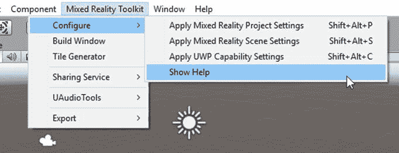
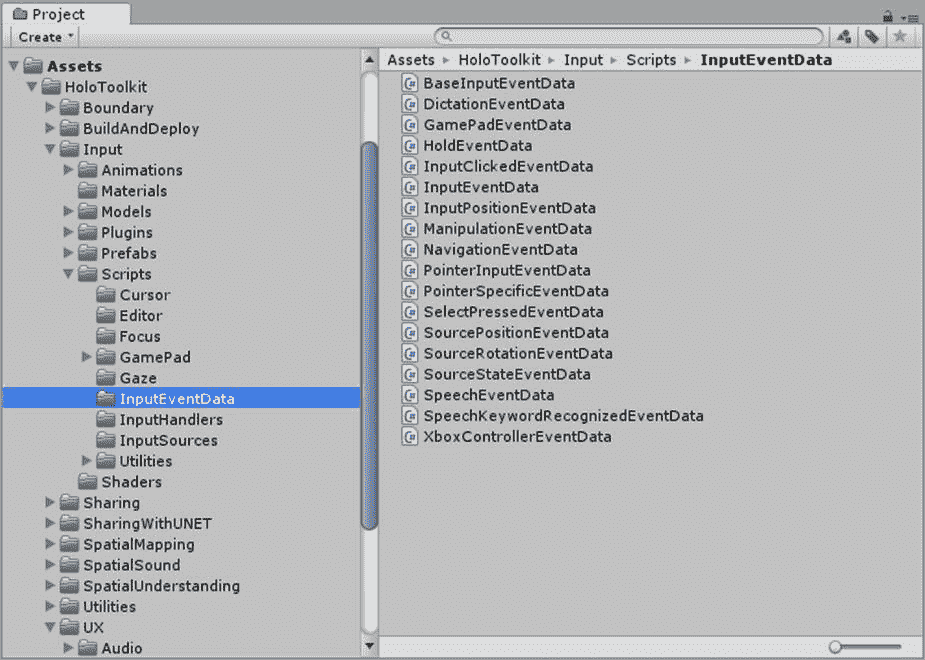

# 第三章空间制图

## 是什么？

空间映射是全息透镜作为混合现实设备区别于其他增强现实设备的原因。全息镜头使用设备正面的四个环境摄像机来绘制物理环境的地图，并建立真实世界的 3D 模型。当您使用该设备时，它会不断创建您所在空间的空间映射模型，并更新任何现有映射。酷的是，开发人员工具附带的开发人员门户允许您实时查看这种 3D 空间映射，它适用于物理全息透镜设备和仿真器。

为了创造数字和物理资产相互作用的令人信服的幻觉，例如让数字角色坐在物理家具上，全息应用程序必须意识到数字和物理现实(因此得名“混合现实”)。这要求全息图在世界上以对用户完全自然的方式进行非常精确的定位。空间坐标系用于计算这种相互作用。

为了理解全息透镜空间映射的复杂性，考虑虚拟现实的类似坐标系。因为您作为开发人员控制着整个环境，您也知道对象之间的距离，因为您对对象本身有编程控制。您有一个主坐标系，所有对象都可以映射到该坐标系并与之相关联。这意味着您可以非常准确地将信息与用户联系起来，因此体验非常稳定和精确。用户期望对象在整个体验中以相同的方式相互关联。

用户对混合现实应用的期望是一样的，但是因为数字资产依赖于全息透镜完成的空间映射来精确地相互关联，所以存在同步的挑战。随着网格的更新，全息图不仅会实时定位自身，而且物理对象和数字资产之间的映射也可能会关闭。全息透镜上坐标系中的单位总是以米为单位，这使得计算全息图相对于彼此和现实世界的位置非常容易。但是，如果空间制图不准确怎么办？如果初始环境扫描不准确或不完整，随着空间映射的改进，全息图可以彼此相距不同的距离或与物理物体相距不同的距离。这将导致全息图开始浮动和移动位置，这使得体验不可思议和不自然。首先，两个对象相距两米，随着映射的更新，它们突然相距 1.8 米。最坏的情况是，它们会让你的用户晕车，你的用户会很快放弃这种体验。幸运的是，对此有一个解决方案。

图 15:空间映射的三维视图

为了避免漂移并确保全息图精确地保留在世界上的特定位置，即使系统发现了更多关于世界的信息并更新了空间地图，您也可以使用空间锚来放置全息图。

空间锚点代表了世界上一个重要的点，系统应该随时跟踪它。每个锚都有一个坐标系，可以根据需要相对于其他空间锚或参照系进行调整，以确保锚定的全息图精确地保持在适当的位置。

在空间锚点的坐标系中渲染全息图，可以在任何给定的时间为全息图提供最精确的定位。这是以随着时间的推移对全息图的位置进行微小调整为代价的，因为系统会不断地将其移回相对于真实世界的位置。

空间锚点可以在会话之间保持，甚至可以在共享相同体验的设备之间共享。这是通过使用特定应用程序的空间锚点存储并提供一个有意义的密钥来允许以后识别锚点来完成的。

通常，你想要全息图来导航你的物质空间，就好像它们是它的一部分。这需要精确的空间映射，以确保没有人试图走过家具和跳过墙壁。这也需要能够识别表面，所以人们只能在地板上行走，只能坐在椅子和沙发上。

空间映射最简单的用途之一，也是创建自然相互作用模型最重要的用途之一，就是简单地遮挡全息图。通过隐藏全息图，或者模糊它们的一部分，你显著地增加了感知的真实感。你也创造了一个期望，当全息图是固体时，它们会与物理物体碰撞。总而言之，这意味着简单的遮挡对于有效地传达物理和数字现实的现实整合非常重要。

为了在物理世界中放置全息图，全息透镜依靠空间映射来确定距离、可用空间和可用表面。使用手势来推断距离(HoloLens 交互模型基于手势)的一个让步是，我们通常只使用手势来传达方向。当这也需要转换成距离时，空间映射可以帮助用户指示全息图可以放置在哪里。结合这一点和全息图的形状，放置为混合现实增加了另一个自然的方面。

有时，可能有必要可视化物理表面和结构，以允许全息图准确和逼真地放置在其上。你可能还想让全息图投射阴影在表面上。

在全息透镜应用程序中使用空间映射比你想象的要简单。您要做的第一件事是为您的 Unity 项目启用`SpatialPerception`功能。一旦将项目从 Unity 导出到 Visual Studio，进而导出到全息透镜设备，这将使三维对象符合三维空间映射模型。

图 16:统一能力

混合现实工具包(以前称为全息工具包)由制作“碎片”和“年轻的康克”的团队创建，是一个脚本和组件的集合，旨在加速针对视窗全息的全息应用程序的开发。

图 17:混合现实工具包徽标

工具包是免费的[【4】](HoloLens_Succinctly_0014.htm#_ftn4)，有两个品种:一个是 Visual Studio，一个是 Unity 3D。为 HoloLens 开发意味着在 Unity 编辑器中花费大量时间，HoloToolkit 是一个简单的`.unitypackage`文件，您可以下载并导入到您的 Unity 项目中。

图 18:混合现实工具包安装

这将在 Unity 中显示一个新的菜单项，混合现实工具包。

图 19:混合现实工具包菜单

这些菜单项构成了 HoloToolkit 实现的对 Unity 的可视化更改的一部分。让菜单项为一个新项目执行最琐碎和最基本的配置任务可以让你更快地找到乐趣，并帮助你确保没有错过任何东西。

除了明显的菜单项变化之外，全息工具包还带来了许多脚本、预置、材质、着色器和插件，您可以在 Unity3D 中使用。

图 20:混合现实工具包内容