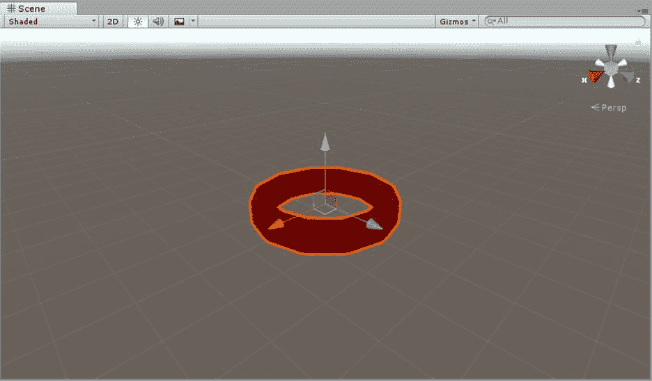
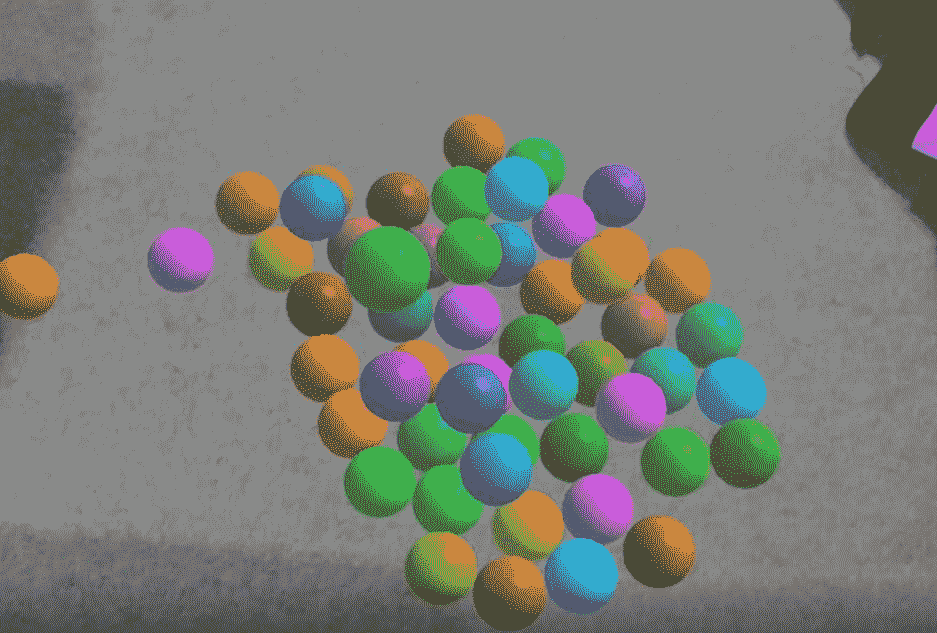
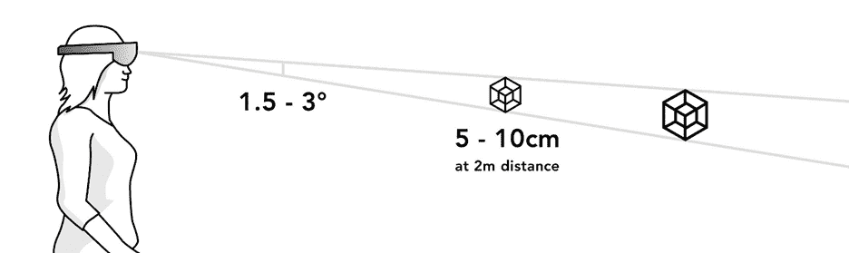

# 第四章凝视

HoloLens 应用程序的第一个主要输入方法是凝视。凝视告诉应用程序用户在世界的哪个地方看，类似于现实世界，用户看着他们打算与之交互的对象。全息透镜不能检测眼球运动和眼球活动；用户头部的位置决定了凝视的方向或矢量。如果你从传统计算的角度来思考，你用你的头作为鼠标指针来凝视物体，有点像你有一个激光笔直接从你的头里出来。

这个“激光指示器”可以与前一章中描述的空间映射网格相交，也可以与你已经在应用程序中放置的任何全息图相交。任何体验中的交互都是基于用户瞄准他们想要交互的元素的能力，对于 HoloLens 来说，这通常是通过凝视来完成的。

考虑到凝视是混合现实体验的主要输入之一，凝视有多种用途并不奇怪，其中一些并不明显。

*   **选择**:用户可以通过交叉`RayCast`功能选择有凝视的物体。
*   **目标**:一旦做出选择，凝视有助于确定交互的正确姿势。
*   **相交**:可以将用户的凝视与场景中的全息图相交，以确定用户的注意力。全息图可以在适当的时候对凝视做出反应，比如改变物体的颜色来识别它。
*   **组合**:用户可以将凝视和手势结合起来(见第五章)，允许更复杂的交互。
*   **引导:**你可以用视觉线索引导用户的注视到他们正在看的物体或区域*而不是*，但是应该为了体验有效。

凝视是使用全息镜头的第一种标准输入机制，也是你与用户互动的第一种方式。

由于 HoloLens 用户范例与传统计算非常不同，您可能不得不在体验的第一点就握住众所周知的用户之手。用你的头作为鼠标光标是对大多数人习惯于与计算机交互的方式的一种转变，并显示各种提示来引导他们前进会产生奇迹。

实现凝视和凝视处理的代码相对简单。其实这本电子书中的很多代码都是非常基础的，因为如果你对 C#和 Visual Studio 有任何经验的话，你已经走到了半路。如果你没有之前的经验，最难的是把设计做好，掌握 Unity 3D。考虑到这一点，代码清单 1 展示了捕捉凝视事件的基本代码。本书中的所有代码都是统一 3D 脚本的一部分，该脚本由统一对象引用或附加到统一对象。

代码清单 1:简单的 RayCast 测试(来自微软)

```

  // Do a raycast into the world based
  on the user's
  // head position and orientation.
  var
  headPosition = Camera.main.transform.position;
  var
  gazeDirection = Camera.main.transform.forward;

  RaycastHit hitInfo;

  if
  (Physics.Raycast(headPosition, gazeDirection, out
  hitInfo))
  {
      // If
  the raycast hit a hologram...
      //
  Display the cursor mesh.
      meshRenderer.enabled = true;

      //
  Move the cursor to the point where the raycast hit.
      this.transform.position = hitInfo.point;

      //
  Rotate the cursor to hug the surface of the hologram.
      this.transform.rotation =
  Quaternion.FromToRotation(Vector3.up, hitInfo.normal);
  }
  else
  {
      // If
  the raycast did not hit a hologram, hide the cursor mesh.
      meshRenderer.enabled = false;
  }

```

因为`camera`是用户眼睛在 Unity 中的位置，你可以用它来计算用户把头指向的方向。然后，您可以使用`RayCast`对象来计算凝视是否与空间映射 3D 模型或其他数字资产中的任何对象相交。如果`RayCast`返回`true`，则有命中，可以得到命中的三维坐标。换句话说，您可以获得用户正在查看的对象的位置。

`RayCast`是 Unity 游戏中经常使用的一个构造，用于确定子弹可能击中什么、物体可能落在哪里、敌人是否在附近等等。这是一种经过验证的计算资产之间关系的方法，对于全息透镜来说，这意味着您可以非常准确地确定用户将他们的头转向哪里，以及他们正在看什么。

|  | 注意:全息镜头不跟踪用户的眼睛——它只跟踪头部运动。 |

在您的体验中不需要有光标对象，但是强烈推荐使用。光标可以是 Unity 中的任何 3D 对象，您必须以编程方式对其进行管理。您通常会将光标定位在真实世界表面或全息图与`RayCast`测试之间的交叉点上。这不仅为用户提供了一个视觉线索，让他们知道将要与哪个元素进行交互，还让用户对体验有了一些信心。通过使用光标，您向用户表明您正在对他们的输入做出反应。



图 21:统一 3D 中的光标对象

虽然光标可以是任何 3D 对象，但要保持简单，不要偏离体验中应该聚焦的部分。一旦用户用他们的目光瞄准了全息图或现实世界的对象，您就可以直观地指示哪些动作对他们可用。

|  | 提示:如果在体验中的某些时候不需要光标，请隐藏它。少即是多。 |

光标可以执行比您想象的更多的任务。您可以向光标和全息图添加反馈，让用户更确定地知道他们凝视的目标是什么。改变光标的大小来指示特定的目标，或者改变目标对象的颜色，都是引导用户的好方法。当您对体验进行编码时，您可以使用返回的`RayCast`对象信息向被注视的对象发送事件。

如果你对许多较小的物体有经验，通常很难准确地识别和瞄准这些物体。使用视觉辅助并帮助用户用目光选择合适的物体，即使是小物体也能使用。



图 22:在没有辅助的情况下瞄准特定的球

用户与他们正在凝视的对象交互的主要方式是使用手势或语音，我们将在接下来的两章中讨论。

当与凝视发生重要交互时，您也可以添加音频提示。第 7 章“声音”将详细介绍全息镜头体验中的音频

使用凝视的目的是瞄准用户想要与之交互的对象。当定位准确时，意味着预期结果与真实结果相匹配，用户将快速自信地习惯凝视体验。这就是凝视瞄准的作用。

识别用户凝视的内容确实有一些限制，但是有一些方法可以确保凝视尽可能准确。其中一个问题是，用户从来不会保持他们的头不动，他们也永远不会(人类在物理上不可能这样做)。另一个问题是，距离物体越远，它们看起来越小，越难瞄准。



图 23:注视目标最佳距离和大小

您希望目标位于用户前方凝视“圆锥体”的 1.5–3 度范围内。这显然会转化为距离越远越大的对象，如图 23 所示。如前所述，以音频或视频的形式添加线索来帮助确定凝视目标是非常有帮助的。

有许多方法可以提高凝视的针对性，并帮助用户使用您的应用程序获得良好的体验。

*   知道这一点的放置元素会对可用性产生很大的影响，因此会影响它们的注视目标。一般来说，放置在非常高或非常低的位置的元素很难被发现，因为它们在用户的正常视野之外。将重要的全息图放在用户面前。
*   使用凝视稳定来消除用户可能有的自然头颈抽搐和抖动。这种技术实现了“磁性”来引导用户的视线朝向附近的物体。这非常有效，也有助于创造更可靠的体验。
*   将相关全息图组合在一起，形成一个通过体验进步的自然方式。
*   根据用户正在做的事情假设意图。您可以在一定的误差范围内确定最接近的全息图，并在适当的情况下执行必要的操作。
*   增加全息图周围的“命中框”的大小。在 Unity 中，物体上的碰撞器决定了它何时被击中。如果这个区域比全息图稍大，它会带来更平滑的体验。

一般来说，为了促进与用户的信任，注视目标是正确的最重要的方面之一。